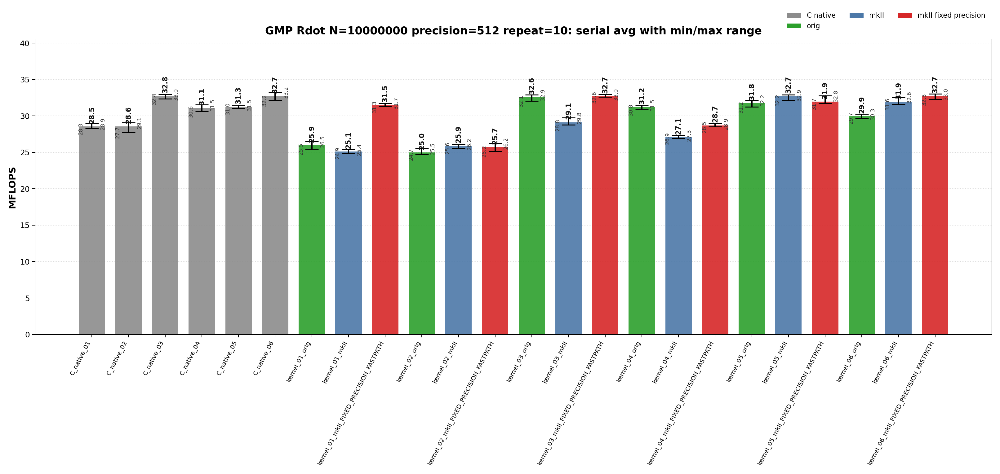
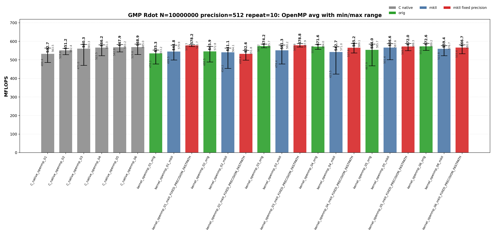

<!-- SPDX-License-Identifier: BSD-2-Clause -->

# 00_Rdot

This directory benchmarks the GMP real dot product

```text
sum_i x_i * y_i
```

with fixed-precision `mpf` data. It compares raw GMP C API kernels, upstream `gmpxx.h`, and `gmpxx_mkII`. The performance question is which source-level temporary policy determines the emitted hot loop and whether the mkII fixed-precision fastpath changes that class.

## Build

From the repository root:

```bash
cmake -S . -B build_bench_release -DCMAKE_BUILD_TYPE=Release
cmake --build build_bench_release -j
```

Executables are created under:

```text
build_bench_release/benchmarks/gmp/00_Rdot/
```

Each executable takes `<vector size> <precision>`. Example:

```bash
build_bench_release/benchmarks/gmp/00_Rdot/Rdot_gmp_kernel_03_mkII 10000000 512
```

The repeat runner is:

```bash
OMP_NUM_THREADS=32 OMP_PLACES=cores OMP_PROC_BIND=spread \
    benchmarks/gmp/00_Rdot/run_repeat.sh build_bench_release 10000000 512 10
```

Arguments are `<build dir> <vector size> <precision> <repeat count> [output dir]`.

The mkII fixed-precision variants use `GMPFRXX_MKII_FAST_FIXED_PREC`; executable suffixes keep the historical `FIXED_PRECISION_FASTPATH` label for benchmark continuity.

The cross-benchmark runner can execute the GMP and MPFR `00_Rdot`, `01_Raxpy`, and `02_Rgemv` suites for both standard precisions with one command:

```bash
OMP_NUM_THREADS=32 OMP_PLACES=cores OMP_PROC_BIND=spread \
    benchmarks/run_all.sh build_bench_release 512,1024 10 10000000 10000000 4000 4000
```

The second argument is a precision list. `both` and `all` are aliases for `512,1024`; a single value such as `512` still runs only that precision. Per-benchmark results are written to `results_raw/run_all_p512_repeat10_<timestamp>/` and `results_raw/run_all_p1024_repeat10_<timestamp>/` under each benchmark directory.

## Benchmark Parameters

| Parameter | Meaning |
| --- | --- |
| `N` | Number of vector elements. |
| `precision` | Requested GMP `mpf` precision in bits for inputs and accumulators. |
| `repeat` | Number of timed process executions per executable. |
| `OMP_NUM_THREADS` | OpenMP worker count for `openmp` executables. |
| `OMP_PLACES`, `OMP_PROC_BIND` | OpenMP affinity controls used by the runner. |

The committed runs use `N=10000000`, `repeat=10`, `precision=512` and `precision=1024`, with `OMP_NUM_THREADS=32`, `OMP_PLACES=cores`, and `OMP_PROC_BIND=spread`.

## Variant Shapes

The timed body is `_Rdot()`. The suffix numbers are aligned across raw C, upstream C++, mkII C++, serial, and OpenMP kernels.

| Variant | Transition from previous variant | Timed source shape | Temporary/resource policy | Purpose |
| --- | --- | --- | --- | --- |
| `01` | Baseline expression form. | `acc += dx[i] * dy[i]` expression form. | Expression product is materialized inside the loop unless mkII fixed-precision scratch storage applies. | Stress expression-template materialization. |
| `02` | `01 -> 02`: introduce an explicit loop-local product object. | `mpf_class templ = dx[i] * dy[i]; acc += templ;` | Loop-local product object is constructed inside every iteration. | Intentionally expensive construction control. |
| `03` | `02 -> 03`: move product storage outside the loop. | `templ = dx[i] * dy[i]; acc += templ;` | One product object is initialized before the loop and reused. | Practical reusable-product baseline. |
| `04` | `03 -> 04`: switch the reusable product update to copy-then-multiply. | `templ = dx[i]; templ *= dy[i]; acc += templ;` | One product object is reused, but each iteration copies before multiplication. | Test copy-then-multiply source shape. |
| `05` | Branch from `03`: add four accumulators while keeping one product object. | Four accumulators with one reused product object. | Four accumulators share one product temporary. | Test accumulator unrolling. |
| `06` | `05 -> 06`: give each accumulator its own product object. | Four accumulators with four reused product objects. | Four accumulators and four product temporaries are reused. | Test unrolling plus independent product temporaries. |

Raw C kernels use `Rdot_gmp_C_native_NN` and `Rdot_gmp_C_native_openmp_NN`. Wrapper kernels use `Rdot_gmp_kernel_NN_orig`, `Rdot_gmp_kernel_NN_mkII`, `Rdot_gmp_kernel_NN_mkII_FIXED_PRECISION_FASTPATH`, and their `openmp` counterparts.

## Source Transitions

The numbered variants isolate one source-level change at a time. `01 -> 02` moves the product into an explicit loop-local product object. `02 -> 03` moves product storage outside the loop and reuses it. `03 -> 04` changes the reusable product update from expression assignment to copy-then-multiply. `03 -> 05` and `05 -> 06` test accumulator unrolling with one and then four reusable product objects. OpenMP targets keep the same numbered source shape and add a static worker partition plus a final reduction.

## C Native Equivalent Kernels

The C native executables are the reference hot-loop shapes for the C++ wrapper kernels. The mapping is based on the timed `_Rdot()` body, not on the post-run correctness reference.

| C native kernel | Equivalent C++ wrapper kernel(s) | Equivalence notes |
| --- | --- | --- |
| `C_native_01` | Closest to `kernel_02_*`; normal `kernel_01_*` may lower to this class. | Raw C initializes and clears a product `mpf_t` inside the loop. |
| `C_native_02` | Closest to `kernel_02_*` | Same loop-local product class as 01. |
| `C_native_03` | `kernel_03_*` | One product object is initialized before the loop and reused. |
| `C_native_04` | `kernel_04_*` | One product object is reused after copying `dx[i]`. |
| `C_native_05` | `kernel_05_*` | Four accumulators with one reused product object. |
| `C_native_06` | `kernel_06_*` | Four accumulators with four reused product objects. |
| `C_native_openmp_NN` | `kernel_openmp_NN_*` for the same `NN` | OpenMP variants follow the same source-shape numbering as serial kernels. |

`kernel_01_*` has no exact raw C source-level equivalent because it is the expression-template spelling. In a normal build it behaves like a loop-local product materialization path. In a fixed-precision fastpath build it can move into the reusable-scratch performance class, so disassembly should be used before treating it as equivalent to one raw C kernel.

## Recorded Run

### 512-bit run

| Field | Value |
|-------|-------|
| Run ID | `run_all_p512_repeat10_20260525_224339` |
| Date | 2026-05-25 |
| CPU | AMD Ryzen Threadripper 3970X 32-Core Processor |
| OS | Linux 6.8.0-94-generic x86_64 |
| Compiler | `c++ (Ubuntu 15.2.0-16ubuntu1) 15.2.0` |
| Build type | Release |
| Problem size | `N=10000000` |
| Precision | 512 bits |
| Repeat count | 10 |
| OpenMP | `OMP_NUM_THREADS=32`, `OMP_PLACES=cores`, `OMP_PROC_BIND=spread` |
| Benchmark command | `OMP_NUM_THREADS=32 OMP_PLACES=cores OMP_PROC_BIND=spread benchmarks/run_all.sh build_bench_release 512 10 10000000 10000000 4000 4000` |
| Raw result directory | `benchmarks/gmp/00_Rdot/results_raw/run_all_p512_repeat10_20260525_224339/` |
| Raw log | `benchmarks/gmp/00_Rdot/results_raw/run_all_p512_repeat10_20260525_224339/benchmark_rdot_gmp_n10000000_p512_repeat10.log` |
| Raw CSV | `benchmarks/gmp/00_Rdot/results_raw/run_all_p512_repeat10_20260525_224339/raw_rdot_gmp_n10000000_p512_repeat10.csv` |
| Summary CSV | `benchmarks/gmp/00_Rdot/results_raw/run_all_p512_repeat10_20260525_224339/summary_rdot_gmp_n10000000_p512_repeat10.csv` |
| Correctness | 480 / 480 runs reported OK. |





Plot regeneration command:

```bash
python3 benchmarks/gmp/00_Rdot/plot_repeat_summary.py \
    benchmarks/gmp/00_Rdot/results_raw/run_all_p512_repeat10_20260525_224339/benchmark_rdot_gmp_n10000000_p512_repeat10.log \
    --output-dir benchmarks/gmp/00_Rdot/results_raw/run_all_p512_repeat10_20260525_224339 \
    --output-prefix rdot_gmp_n10000000_p512_repeat10 \
    --title-prefix "GMP Rdot N=10000000, precision=512, repeat=10"
```

### 1024-bit run

No current 1024-bit `run_all` result directory is present under this benchmark's `results_raw/` tree. Run `benchmarks/run_all.sh build_bench_release 1024 10 10000000 10000000 4000 4000` or the default dual-precision command to regenerate this section.

## Resource or Bandwidth Estimates

The values below are model estimates derived from MFLOPS, not hardware-counter measurements. They use the current 512-bit `run_all` summary and count active limb bytes plus a header-inclusive model. They exclude allocator metadata, cache-line overfetch, instruction fetch, and final OpenMP reduction traffic.

| Case | Representative best-avg variant | Avg MFLOPS | Active bytes/iteration | Header-inclusive bytes/iteration | Active GB/s | Header-inclusive GB/s |
| --- | --- | --- | --- | --- | --- | --- |
| 512-bit serial | `C_native_03` | 32.770 | 128 | 176 | 2.097 | 2.884 |
| 512-bit OpenMP | `kernel_openmp_03_mkII_FIXED_PRECISION_FASTPATH` | 578.766 | 128 | 176 | 37.041 | 50.931 |

For matrix-vector benchmarks, the per-iteration byte model is a compact active-data estimate for the arithmetic stream, not a full matrix-footprint or cache-reuse model.
## Headline Results

The 512-bit headline rows below are regenerated from `benchmarks/gmp/00_Rdot/results_raw/run_all_p512_repeat10_20260525_224339/summary_rdot_gmp_n10000000_p512_repeat10.csv`. No 1024-bit raw data is present in the current `results_raw/` tree, so 1024-bit result sections are placeholders until a fresh 1024-bit `run_all` result is collected.

| Precision | Class | Variant | Max MFLOPS | Avg MFLOPS | Interpretation |
| --- | --- | --- | --- | --- | --- |
| 512 | Best serial max | `C_native_06` | 33.237 | 32.710 | Single fastest serial repeat; compare with Avg MFLOPS for stability. |
| 512 | Best serial average | `C_native_03` | 32.980 | 32.770 | Raw C reference for the numbered source shape. |
| 512 | Best OpenMP max | `kernel_openmp_06_orig` | 589.216 | 572.591 | Single fastest OpenMP repeat; OpenMP rows should be interpreted by performance class. |
| 512 | Best OpenMP average | `kernel_openmp_03_mkII_FIXED_PRECISION_FASTPATH` | 587.940 | 578.766 | Wrapper fixed-precision build; intended to remove repeated precision checks or scratch setup when the source shape allows it. |
## Serial Results

### 512-bit serial interpretation

These rows are derived from `benchmarks/gmp/00_Rdot/results_raw/run_all_p512_repeat10_20260525_224339/summary_rdot_gmp_n10000000_p512_repeat10.csv`.

| Observation | Variant | Max MFLOPS | Avg MFLOPS | Min MFLOPS | Interpretation |
| --- | --- | --- | --- | --- | --- |
| Best raw C serial avg | `C_native_03` | 32.980 | 32.770 | 32.363 | Raw C reference for the numbered source shape. |
| Best upstream serial avg | `kernel_03_orig` | 32.903 | 32.565 | 32.057 | Upstream gmpxx.h wrapper; useful as the C++ wrapper comparison point for the same numbered source shape. |
| Best mkII serial avg | `kernel_06_mkII_FIXED_PRECISION_FASTPATH` | 33.011 | 32.742 | 32.291 | Wrapper fixed-precision build; intended to remove repeated precision checks or scratch setup when the source shape allows it. |
| Best serial max | `C_native_06` | 33.237 | 32.710 | 32.156 | Raw C reference for the numbered source shape. |

<details>
<summary>512-bit serial results sorted by Max MFLOPS</summary>

| Rank | Variant | Max MFLOPS | Avg MFLOPS | Min MFLOPS |
| --- | --- | --- | --- | --- |
| 1 | `C_native_06` | 33.237 | 32.710 | 32.156 |
| 2 | `kernel_06_mkII_FIXED_PRECISION_FASTPATH` | 33.011 | 32.742 | 32.291 |
| 3 | `C_native_03` | 32.980 | 32.770 | 32.363 |
| 4 | `kernel_03_mkII_FIXED_PRECISION_FASTPATH` | 32.960 | 32.724 | 32.588 |
| 5 | `kernel_03_orig` | 32.903 | 32.565 | 32.057 |
| 6 | `kernel_05_mkII` | 32.894 | 32.691 | 32.192 |
| 7 | `kernel_05_mkII_FIXED_PRECISION_FASTPATH` | 32.766 | 31.948 | 31.688 |
| 8 | `kernel_06_mkII` | 32.576 | 31.920 | 31.630 |
| 9 | `kernel_05_orig` | 32.177 | 31.773 | 31.228 |
| 10 | `kernel_01_mkII_FIXED_PRECISION_FASTPATH` | 31.749 | 31.508 | 31.268 |
| 11 | `C_native_04` | 31.531 | 31.097 | 30.619 |
| 12 | `C_native_05` | 31.516 | 31.257 | 31.008 |
| 13 | `kernel_04_orig` | 31.505 | 31.236 | 30.847 |
| 14 | `kernel_06_orig` | 30.261 | 29.948 | 29.729 |
| 15 | `kernel_03_mkII` | 29.758 | 29.121 | 28.756 |
| 16 | `C_native_02` | 29.085 | 28.557 | 27.727 |
| 17 | `C_native_01` | 28.927 | 28.545 | 28.260 |
| 18 | `kernel_04_mkII_FIXED_PRECISION_FASTPATH` | 28.925 | 28.703 | 28.507 |
| 19 | `kernel_04_mkII` | 27.338 | 27.072 | 26.907 |
| 20 | `kernel_01_orig` | 26.487 | 25.949 | 25.465 |
| 21 | `kernel_02_mkII_FIXED_PRECISION_FASTPATH` | 26.243 | 25.703 | 25.157 |
| 22 | `kernel_02_mkII` | 26.156 | 25.898 | 25.597 |
| 23 | `kernel_02_orig` | 25.534 | 24.979 | 24.707 |
| 24 | `kernel_01_mkII` | 25.387 | 25.108 | 24.925 |

</details>

<details>
<summary>512-bit serial results sorted by Avg MFLOPS</summary>

| Rank | Variant | Max MFLOPS | Avg MFLOPS | Min MFLOPS |
| --- | --- | --- | --- | --- |
| 1 | `C_native_03` | 32.980 | 32.770 | 32.363 |
| 2 | `kernel_06_mkII_FIXED_PRECISION_FASTPATH` | 33.011 | 32.742 | 32.291 |
| 3 | `kernel_03_mkII_FIXED_PRECISION_FASTPATH` | 32.960 | 32.724 | 32.588 |
| 4 | `C_native_06` | 33.237 | 32.710 | 32.156 |
| 5 | `kernel_05_mkII` | 32.894 | 32.691 | 32.192 |
| 6 | `kernel_03_orig` | 32.903 | 32.565 | 32.057 |
| 7 | `kernel_05_mkII_FIXED_PRECISION_FASTPATH` | 32.766 | 31.948 | 31.688 |
| 8 | `kernel_06_mkII` | 32.576 | 31.920 | 31.630 |
| 9 | `kernel_05_orig` | 32.177 | 31.773 | 31.228 |
| 10 | `kernel_01_mkII_FIXED_PRECISION_FASTPATH` | 31.749 | 31.508 | 31.268 |
| 11 | `C_native_05` | 31.516 | 31.257 | 31.008 |
| 12 | `kernel_04_orig` | 31.505 | 31.236 | 30.847 |
| 13 | `C_native_04` | 31.531 | 31.097 | 30.619 |
| 14 | `kernel_06_orig` | 30.261 | 29.948 | 29.729 |
| 15 | `kernel_03_mkII` | 29.758 | 29.121 | 28.756 |
| 16 | `kernel_04_mkII_FIXED_PRECISION_FASTPATH` | 28.925 | 28.703 | 28.507 |
| 17 | `C_native_02` | 29.085 | 28.557 | 27.727 |
| 18 | `C_native_01` | 28.927 | 28.545 | 28.260 |
| 19 | `kernel_04_mkII` | 27.338 | 27.072 | 26.907 |
| 20 | `kernel_01_orig` | 26.487 | 25.949 | 25.465 |
| 21 | `kernel_02_mkII` | 26.156 | 25.898 | 25.597 |
| 22 | `kernel_02_mkII_FIXED_PRECISION_FASTPATH` | 26.243 | 25.703 | 25.157 |
| 23 | `kernel_01_mkII` | 25.387 | 25.108 | 24.925 |
| 24 | `kernel_02_orig` | 25.534 | 24.979 | 24.707 |

</details>
### 1024-bit serial interpretation

No current 1024-bit `run_all` summary CSV is present under this benchmark's `results_raw/` tree. The serial table should be regenerated after a fresh 1024-bit run is collected.

## OpenMP Results

### 512-bit OpenMP interpretation

These rows are derived from `benchmarks/gmp/00_Rdot/results_raw/run_all_p512_repeat10_20260525_224339/summary_rdot_gmp_n10000000_p512_repeat10.csv`.

| Observation | Variant | Max MFLOPS | Avg MFLOPS | Min MFLOPS | Interpretation |
| --- | --- | --- | --- | --- | --- |
| Best raw C OpenMP avg | `C_native_openmp_06` | 584.987 | 568.859 | 529.570 | Raw C OpenMP blocked/reordered class; locality and traversal dominate wrapper-level effects. |
| Best upstream OpenMP avg | `kernel_openmp_03_orig` | 585.697 | 574.197 | 565.198 | Upstream gmpxx.h wrapper; useful as the C++ wrapper comparison point for the same numbered source shape. |
| Best mkII OpenMP avg | `kernel_openmp_03_mkII_FIXED_PRECISION_FASTPATH` | 587.940 | 578.766 | 569.610 | Wrapper fixed-precision build; intended to remove repeated precision checks or scratch setup when the source shape allows it. |
| Best OpenMP max | `kernel_openmp_06_orig` | 589.216 | 572.591 | 551.494 | Upstream gmpxx.h wrapper; useful as the C++ wrapper comparison point for the same numbered source shape. |

<details>
<summary>512-bit OpenMP results sorted by Max MFLOPS</summary>

| Rank | Variant | Max MFLOPS | Avg MFLOPS | Min MFLOPS |
| --- | --- | --- | --- | --- |
| 1 | `kernel_openmp_06_orig` | 589.216 | 572.591 | 551.494 |
| 2 | `kernel_openmp_04_mkII_FIXED_PRECISION_FASTPATH` | 589.146 | 565.203 | 537.849 |
| 3 | `kernel_openmp_05_mkII_FIXED_PRECISION_FASTPATH` | 588.263 | 571.999 | 549.722 |
| 4 | `kernel_openmp_03_mkII_FIXED_PRECISION_FASTPATH` | 587.940 | 578.766 | 569.610 |
| 5 | `kernel_openmp_05_mkII` | 587.582 | 566.572 | 501.442 |
| 6 | `kernel_openmp_03_orig` | 585.697 | 574.197 | 565.198 |
| 7 | `kernel_openmp_05_orig` | 585.677 | 554.015 | 467.910 |
| 8 | `C_native_openmp_06` | 584.987 | 568.859 | 529.570 |
| 9 | `kernel_openmp_04_orig` | 584.048 | 571.607 | 557.619 |
| 10 | `C_native_openmp_03` | 583.297 | 560.269 | 470.956 |
| 11 | `C_native_openmp_05` | 583.232 | 567.859 | 542.882 |
| 12 | `kernel_openmp_01_mkII_FIXED_PRECISION_FASTPATH` | 581.685 | 578.246 | 572.320 |
| 13 | `C_native_openmp_04` | 581.333 | 566.173 | 522.487 |
| 14 | `kernel_openmp_06_mkII_FIXED_PRECISION_FASTPATH` | 580.918 | 566.724 | 533.434 |
| 15 | `kernel_openmp_03_mkII` | 580.227 | 551.282 | 478.369 |
| 16 | `kernel_openmp_01_mkII` | 579.858 | 544.818 | 499.478 |
| 17 | `kernel_openmp_06_mkII` | 576.685 | 559.377 | 522.797 |
| 18 | `kernel_openmp_02_orig` | 572.756 | 545.871 | 488.481 |
| 19 | `kernel_openmp_04_mkII` | 570.992 | 542.678 | 423.549 |
| 20 | `kernel_openmp_02_mkII` | 564.117 | 541.140 | 454.221 |
| 21 | `C_native_openmp_01` | 563.534 | 532.692 | 486.428 |
| 22 | `C_native_openmp_02` | 562.366 | 551.175 | 528.584 |
| 23 | `kernel_openmp_01_orig` | 553.201 | 535.335 | 478.221 |
| 24 | `kernel_openmp_02_mkII_FIXED_PRECISION_FASTPATH` | 551.796 | 532.605 | 498.375 |

</details>

<details>
<summary>512-bit OpenMP results sorted by Avg MFLOPS</summary>

| Rank | Variant | Max MFLOPS | Avg MFLOPS | Min MFLOPS |
| --- | --- | --- | --- | --- |
| 1 | `kernel_openmp_03_mkII_FIXED_PRECISION_FASTPATH` | 587.940 | 578.766 | 569.610 |
| 2 | `kernel_openmp_01_mkII_FIXED_PRECISION_FASTPATH` | 581.685 | 578.246 | 572.320 |
| 3 | `kernel_openmp_03_orig` | 585.697 | 574.197 | 565.198 |
| 4 | `kernel_openmp_06_orig` | 589.216 | 572.591 | 551.494 |
| 5 | `kernel_openmp_05_mkII_FIXED_PRECISION_FASTPATH` | 588.263 | 571.999 | 549.722 |
| 6 | `kernel_openmp_04_orig` | 584.048 | 571.607 | 557.619 |
| 7 | `C_native_openmp_06` | 584.987 | 568.859 | 529.570 |
| 8 | `C_native_openmp_05` | 583.232 | 567.859 | 542.882 |
| 9 | `kernel_openmp_06_mkII_FIXED_PRECISION_FASTPATH` | 580.918 | 566.724 | 533.434 |
| 10 | `kernel_openmp_05_mkII` | 587.582 | 566.572 | 501.442 |
| 11 | `C_native_openmp_04` | 581.333 | 566.173 | 522.487 |
| 12 | `kernel_openmp_04_mkII_FIXED_PRECISION_FASTPATH` | 589.146 | 565.203 | 537.849 |
| 13 | `C_native_openmp_03` | 583.297 | 560.269 | 470.956 |
| 14 | `kernel_openmp_06_mkII` | 576.685 | 559.377 | 522.797 |
| 15 | `kernel_openmp_05_orig` | 585.677 | 554.015 | 467.910 |
| 16 | `kernel_openmp_03_mkII` | 580.227 | 551.282 | 478.369 |
| 17 | `C_native_openmp_02` | 562.366 | 551.175 | 528.584 |
| 18 | `kernel_openmp_02_orig` | 572.756 | 545.871 | 488.481 |
| 19 | `kernel_openmp_01_mkII` | 579.858 | 544.818 | 499.478 |
| 20 | `kernel_openmp_04_mkII` | 570.992 | 542.678 | 423.549 |
| 21 | `kernel_openmp_02_mkII` | 564.117 | 541.140 | 454.221 |
| 22 | `kernel_openmp_01_orig` | 553.201 | 535.335 | 478.221 |
| 23 | `C_native_openmp_01` | 563.534 | 532.692 | 486.428 |
| 24 | `kernel_openmp_02_mkII_FIXED_PRECISION_FASTPATH` | 551.796 | 532.605 | 498.375 |

</details>
### 1024-bit OpenMP interpretation

No current 1024-bit `run_all` summary CSV is present under this benchmark's `results_raw/` tree. The OpenMP table should be regenerated after a fresh 1024-bit run is collected.

## Hotpath Disassembly

The representative disassembly checks are unchanged by this result refresh because the kernel sources did not change during the repeat-10 run. Regenerate snippets with:

```bash
objdump -Cd --no-show-raw-insn build_bench_release/benchmarks/gmp/00_Rdot/Rdot_gmp_C_native_03
objdump -Cd --no-show-raw-insn build_bench_release/benchmarks/gmp/00_Rdot/Rdot_gmp_kernel_03_orig
objdump -Cd --no-show-raw-insn build_bench_release/benchmarks/gmp/00_Rdot/Rdot_gmp_kernel_03_mkII
objdump -Cd --no-show-raw-insn build_bench_release/benchmarks/gmp/00_Rdot/Rdot_gmp_kernel_openmp_03_mkII_FIXED_PRECISION_FASTPATH
```

| Kernel class | Expected hot-loop check |
| --- | --- |
| Loop-local temporary | `mpf_init2` / `mpf_clear` or equivalent object construction appears in the timed loop. |
| Reusable product | One `mpf_mul` and one `mpf_add` per element; product object lifetime is outside the timed loop. |
| Unrolled reusable product | Four independent accumulators do not remove the backend multiply/add cost; they mainly change dependency shape. |
| mkII fixed precision | Expression-form scratch reuse should remove repeated precision setup when the destination precision is fixed. |
| OpenMP worker loop | Per-thread accumulation happens inside the worker loop; final reduction is outside the worker hot path. |

The 1024-bit run adds a precision-audit requirement: raw C and upstream wrappers form the expected lower-throughput 1024-bit class, while mkII results remain close to the 512-bit class. Disassembly alone is not enough to validate those mkII numbers; inspect the precision of generated input objects, expression materialization, and accumulator temporaries before using them as performance evidence.

## Lessons Learned

- At 512 bits, the main GMP Rdot boundary is temporary lifetime: reusable product objects and fixed-precision scratch paths reach the top serial and OpenMP classes.
- Four-way unrolling does not create a fundamentally new serial class; variants `03`, `05`, and `06` cluster closely when temporaries are reused.
- OpenMP results should be interpreted by performance class and average MFLOPS, not by a single fastest repeat.
- The 1024-bit raw C/upstream data drop to the expected lower class, but mkII does not. Treat the mkII 1024-bit results as a correctness/precision audit trigger rather than a real speedup claim.
- The next GMP Rdot step should verify requested/effective `mpf` precision in mkII benchmark inputs and temporaries before comparing 1024-bit performance.
