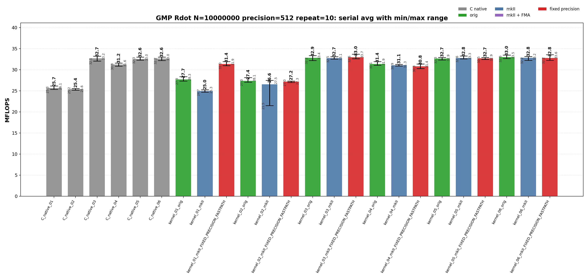
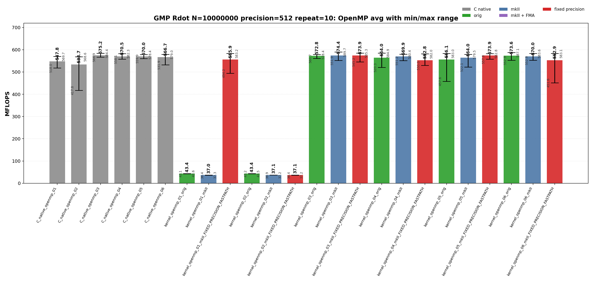
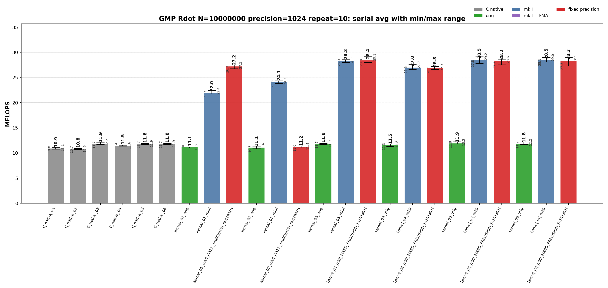
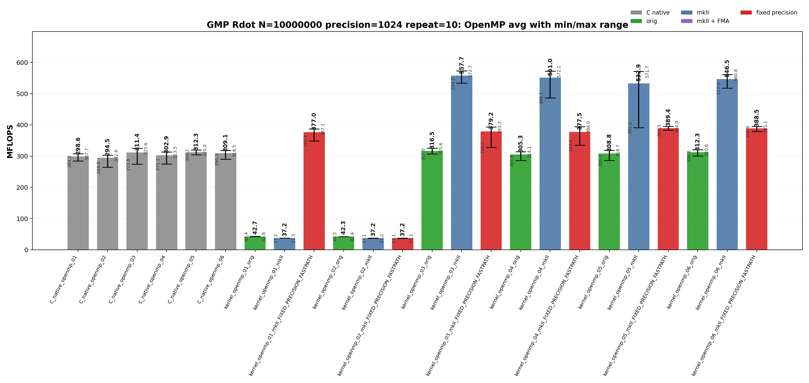

<!-- SPDX-License-Identifier: BSD-2-Clause -->

# 00_Rdot

This directory benchmarks the GMP real dot product

```text
sum_i x_i * y_i
```

with fixed-precision `mpf` data. It compares raw GMP C API kernels,
upstream `gmpxx.h`, and `gmpxx_mkII`. The performance question is which
source-level temporary policy determines the emitted hot loop and whether the
mkII fixed-precision fastpath changes that class.

## Build

From the repository root:

```bash
cmake -S . -B build_bench_release -DCMAKE_BUILD_TYPE=Release
cmake --build build_bench_release -j
```

Rdot executables are created under:

```text
build_bench_release/benchmarks/gmp/00_Rdot/
```

Each executable takes `<vector size> <precision>`. Example:

```bash
build_bench_release/benchmarks/gmp/00_Rdot/Rdot_gmp_kernel_03_mkII 10000000 512
```

The mkII fixed-precision variants use `GMPFRXX_MKII_FAST_FIXED_PREC`;
executable suffixes keep the historical `FIXED_PRECISION_FASTPATH` label for
benchmark continuity.

## Kernel Shapes

The timed body is `_Rdot()`. The suffix numbers are aligned across raw C,
upstream C++, and mkII C++ kernels.

| Variant | Timed source shape | Temporary/resource policy | Purpose |
|---------|--------------------|---------------------------|---------|
| `01` | `acc += dx[i] * dy[i]` expression form. | Expression product is materialized inside the loop unless mkII fixed-precision scratch storage applies. | Stress expression-template materialization. |
| `02` | `mpf_class templ = dx[i] * dy[i]; acc += templ;` | Loop-local product object is constructed inside every iteration. | Intentionally expensive construction control. |
| `03` | `templ = dx[i] * dy[i]; acc += templ;` | One product object is initialized before the loop and reused. | Practical reusable-product baseline. |
| `04` | `templ = dx[i]; templ *= dy[i]; acc += templ;` | One product object is reused, but each iteration copies before multiplication. | Test copy-then-multiply source shape. |
| `05` | Four accumulators with one reused product object. | Four accumulators share one product temporary. | Test accumulator unrolling. |
| `06` | Four accumulators with four reused product objects. | Four accumulators and four product temporaries are reused. | Test unrolling plus independent product temporaries. |

Raw C kernels use the same numbering:

```text
Rdot_gmp_C_native_NN
Rdot_gmp_C_native_openmp_NN
```

Wrapper kernels use:

```text
Rdot_gmp_kernel_NN_orig
Rdot_gmp_kernel_NN_mkII
Rdot_gmp_kernel_NN_mkII_FIXED_PRECISION_FASTPATH
Rdot_gmp_kernel_openmp_NN_orig
Rdot_gmp_kernel_openmp_NN_mkII
Rdot_gmp_kernel_openmp_NN_mkII_FIXED_PRECISION_FASTPATH
```

## C Native Equivalent Kernels

The C native executables are the reference hot-loop shapes for the C++ wrapper
kernels. The mapping is based on the timed `_Rdot()` body, not on the
post-run correctness reference.

| C native kernel | Equivalent C++ wrapper kernel(s) | Equivalence notes |
|-----------------|----------------------------------|-------------------|
| `C_native_01` | Closest to `kernel_02_*`; normal `kernel_01_*` may lower to this class. | Raw C initializes and clears a product `mpf_t` inside the loop. |
| `C_native_02` | Closest to `kernel_02_*` | Same loop-local product class as 01. |
| `C_native_03` | `kernel_03_*` | One product object is initialized before the loop and reused. |
| `C_native_04` | `kernel_04_*` | One product object is reused after copying `dx[i]`. |
| `C_native_05` | `kernel_05_*` | Four accumulators with one reused product object. |
| `C_native_06` | `kernel_06_*` | Four accumulators with four reused product objects. |
| `C_native_openmp_NN` | `kernel_openmp_NN_*` for the same `NN` | OpenMP variants follow the same source-shape numbering as serial kernels. |

`kernel_01_*` has no exact raw C source-level equivalent because it is the
expression-template spelling. In a normal build it behaves like a loop-local
product materialization path. In a fixed-precision fastpath build it can move
into the reusable-scratch performance class, so disassembly should be used
before treating it as equivalent to one raw C kernel.

## Recorded Run

This README reports the current committed repeat-10 run:

```text
N = 10000000
precision = 512
repeat = 10
OMP_NUM_THREADS = 32
OMP_PLACES = cores
OMP_PROC_BIND = spread
CPU = AMD Ryzen Threadripper 3970X 32-Core Processor
build = build_bench_release
build type = Release
```

Results are stored in:

```text
results_raw/rdot_gmp_n10000000_p512_repeat10_20260522_195144/
```

Files:

- [Raw log](results_raw/rdot_gmp_n10000000_p512_repeat10_20260522_195144/benchmark_rdot_gmp_n10000000_p512_repeat10.log)
- [Raw CSV](results_raw/rdot_gmp_n10000000_p512_repeat10_20260522_195144/raw_rdot_gmp_n10000000_p512_repeat10.csv)
- [Summary CSV](results_raw/rdot_gmp_n10000000_p512_repeat10_20260522_195144/summary_rdot_gmp_n10000000_p512_repeat10.csv)

All 48 variants report `OK` in all 10 runs.

The plots below show average MFLOPS as vertical bars. The black range line on
each bar is the observed min-to-max interval across the 10 repeats; the large
label is the average and the small labels mark min and max.





The images can be regenerated from the committed summary CSV with:

```bash
python3 benchmarks/gmp/00_Rdot/plot_repeat_summary.py \
    benchmarks/gmp/00_Rdot/results_raw/rdot_gmp_n10000000_p512_repeat10_20260522_195144/summary_rdot_gmp_n10000000_p512_repeat10.csv \
    --output-prefix benchmarks/gmp/00_Rdot/results_raw/rdot_gmp_n10000000_p512_repeat10_20260522_195144/rdot_gmp_n10000000_p512_repeat10 \
    --title-prefix "GMP Rdot N=10000000 precision=512 repeat=10"
```

<!-- BEGIN 1024-BIT RECORDED RUN -->

### 1024-bit run

The 1024-bit addendum uses the same release build, CPU affinity, input shape,
and repeat count as the 512-bit run, with only the precision changed.

| Field | Value |
|-------|-------|
| Run ID | `rdot_gmp_n10000000_p1024_repeat10_20260523_194451` |
| Date | 2026-05-23 |
| Problem size | `N=10000000` |
| Precision | 1024 bits |
| Repeat count | 10 |
| OpenMP | `OMP_NUM_THREADS=32`, `OMP_PLACES=cores`, `OMP_PROC_BIND=spread` |
| Benchmark command | Each Rdot executable was run for 10 repeats with arguments `10000000 1024`. |
| Raw result directory | `benchmarks/gmp/00_Rdot/results_raw/rdot_gmp_n10000000_p1024_repeat10_20260523_194451/` |
| Raw log | `benchmarks/gmp/00_Rdot/results_raw/rdot_gmp_n10000000_p1024_repeat10_20260523_194451/benchmark_rdot_gmp_n10000000_p1024_repeat10.log` |
| Raw CSV | `benchmarks/gmp/00_Rdot/results_raw/rdot_gmp_n10000000_p1024_repeat10_20260523_194451/raw_rdot_gmp_n10000000_p1024_repeat10.csv` |
| Summary CSV | `benchmarks/gmp/00_Rdot/results_raw/rdot_gmp_n10000000_p1024_repeat10_20260523_194451/summary_rdot_gmp_n10000000_p1024_repeat10.csv` |
| Correctness | 480 / 480 runs reported `Result OK`. |





Plot regeneration command:

```bash
python3 benchmarks/gmp/00_Rdot/plot_repeat_summary.py \
    benchmarks/gmp/00_Rdot/results_raw/rdot_gmp_n10000000_p1024_repeat10_20260523_194451/benchmark_rdot_gmp_n10000000_p1024_repeat10.log \
    --output-dir benchmarks/gmp/00_Rdot/results_raw/rdot_gmp_n10000000_p1024_repeat10_20260523_194451 \
    --output-prefix rdot_gmp_n10000000_p1024_repeat10 \
    --title-prefix "GMP Rdot N=10000000 precision=1024 repeat=10"
```

<!-- END 1024-BIT RECORDED RUN -->

## Headline Results

| Observation | Evidence | Interpretation |
|-------------|----------|----------------|
| Best serial average | `kernel_06_orig` at 32.992 MFLOPS avg, 33.502 max | The top serial result is still the reusable-product/unrolled class, not a fundamentally different hot loop. |
| Best mkII serial average | `kernel_03_mkII_FIXED_PRECISION_FASTPATH` at 32.955 MFLOPS avg, 33.699 max | mkII reaches the raw C reusable-product class when product lifetime is outside the loop or scratch reuse applies. |
| Expression fastpath effect | `kernel_01_mkII` 24.961 avg vs `kernel_01_mkII_FIXED_PRECISION_FASTPATH` 31.392 avg | Fixed-precision scratch removes the main expression-materialization cost. |
| Best OpenMP average | `C_native_openmp_03` at 575.234 MFLOPS avg, 584.371 max | The best parallel class is the per-thread reusable-product shape. |
| Best mkII OpenMP average | `kernel_openmp_03_mkII` at 574.444 MFLOPS avg, 589.682 max | mkII OpenMP matches the C native class when the timed loop has one multiply and one add per element. |

<!-- BEGIN 1024-BIT HEADLINE RESULTS -->

### 1024-bit headline results

| Observation | Evidence | Interpretation |
|-------------|----------|----------------|
| Best serial average | `kernel_05_mkII` at 28.495 MFLOPS avg, 29.243 max | The best 1024-bit serial mkII result remains in the reusable/unrolled class; it is much higher than the raw C and upstream wrapper results in this run, so it should be interpreted as the mkII benchmark class rather than a raw GMP backend limit. |
| Best raw/upstream serial class | `C_native_03` at 11.862 avg; best upstream wrapper at 11.880 avg | Raw C and upstream `gmpxx.h` drop strongly from the 512-bit run, as expected for larger GMP mantissas. |
| Best OpenMP average | `kernel_openmp_03_mkII` at 557.670 MFLOPS avg, 572.745 max | The OpenMP mkII reusable-product class stays near the 512-bit throughput class in this run. |
| Best raw/upstream OpenMP class | `C_native_openmp_05` at 312.287 avg; best upstream wrapper at 316.476 avg | Raw C and upstream OpenMP results form a lower 1024-bit class than mkII in the collected data. |

<!-- END 1024-BIT HEADLINE RESULTS -->

## Serial Results

<details>
<summary>Serial results sorted by Max MFLOPS</summary>

| Rank | Variant | Max MFLOPS | Avg MFLOPS | Min MFLOPS |
|------|---------|------------|------------|------------|
| 1 | `kernel_03_mkII_FIXED_PRECISION_FASTPATH` | 33.699 | 32.955 | 32.603 |
| 2 | `kernel_06_mkII_FIXED_PRECISION_FASTPATH` | 33.568 | 32.797 | 32.240 |
| 3 | `kernel_06_orig` | 33.502 | 32.992 | 32.649 |
| 4 | `kernel_03_orig` | 33.362 | 32.852 | 32.202 |
| 5 | `kernel_05_mkII` | 33.269 | 32.799 | 32.589 |
| 6 | `C_native_03` | 33.221 | 32.715 | 32.069 |
| 7 | `kernel_06_mkII` | 33.158 | 32.821 | 32.247 |
| 8 | `kernel_03_mkII` | 33.114 | 32.744 | 32.547 |
| 9 | `C_native_06` | 33.024 | 32.646 | 32.183 |
| 10 | `C_native_05` | 32.995 | 32.598 | 32.288 |
| 11 | `kernel_05_mkII_FIXED_PRECISION_FASTPATH` | 32.937 | 32.696 | 32.455 |
| 12 | `kernel_05_orig` | 32.904 | 32.684 | 32.329 |
| 13 | `kernel_04_orig` | 31.936 | 31.386 | 31.072 |
| 14 | `kernel_01_mkII_FIXED_PRECISION_FASTPATH` | 31.930 | 31.392 | 30.984 |
| 15 | `C_native_04` | 31.608 | 31.228 | 30.841 |
| 16 | `kernel_04_mkII_FIXED_PRECISION_FASTPATH` | 31.375 | 30.798 | 30.297 |
| 17 | `kernel_04_mkII` | 31.291 | 31.078 | 30.907 |
| 18 | `kernel_01_orig` | 28.338 | 27.708 | 27.325 |
| 19 | `kernel_02_orig` | 28.125 | 27.365 | 27.042 |
| 20 | `kernel_02_mkII` | 27.491 | 26.555 | 21.496 |
| 21 | `kernel_02_mkII_FIXED_PRECISION_FASTPATH` | 27.337 | 27.180 | 26.996 |
| 22 | `C_native_01` | 26.146 | 25.666 | 25.333 |
| 23 | `C_native_02` | 25.568 | 25.399 | 25.182 |
| 24 | `kernel_01_mkII` | 25.271 | 24.961 | 24.681 |

</details>

<details>
<summary>Serial results sorted by Avg MFLOPS</summary>

| Rank | Variant | Max MFLOPS | Avg MFLOPS | Min MFLOPS |
|------|---------|------------|------------|------------|
| 1 | `kernel_06_orig` | 33.502 | 32.992 | 32.649 |
| 2 | `kernel_03_mkII_FIXED_PRECISION_FASTPATH` | 33.699 | 32.955 | 32.603 |
| 3 | `kernel_03_orig` | 33.362 | 32.852 | 32.202 |
| 4 | `kernel_06_mkII` | 33.158 | 32.821 | 32.247 |
| 5 | `kernel_05_mkII` | 33.269 | 32.799 | 32.589 |
| 6 | `kernel_06_mkII_FIXED_PRECISION_FASTPATH` | 33.568 | 32.797 | 32.240 |
| 7 | `kernel_03_mkII` | 33.114 | 32.744 | 32.547 |
| 8 | `C_native_03` | 33.221 | 32.715 | 32.069 |
| 9 | `kernel_05_mkII_FIXED_PRECISION_FASTPATH` | 32.937 | 32.696 | 32.455 |
| 10 | `kernel_05_orig` | 32.904 | 32.684 | 32.329 |
| 11 | `C_native_06` | 33.024 | 32.646 | 32.183 |
| 12 | `C_native_05` | 32.995 | 32.598 | 32.288 |
| 13 | `kernel_01_mkII_FIXED_PRECISION_FASTPATH` | 31.930 | 31.392 | 30.984 |
| 14 | `kernel_04_orig` | 31.936 | 31.386 | 31.072 |
| 15 | `C_native_04` | 31.608 | 31.228 | 30.841 |
| 16 | `kernel_04_mkII` | 31.291 | 31.078 | 30.907 |
| 17 | `kernel_04_mkII_FIXED_PRECISION_FASTPATH` | 31.375 | 30.798 | 30.297 |
| 18 | `kernel_01_orig` | 28.338 | 27.708 | 27.325 |
| 19 | `kernel_02_orig` | 28.125 | 27.365 | 27.042 |
| 20 | `kernel_02_mkII_FIXED_PRECISION_FASTPATH` | 27.337 | 27.180 | 26.996 |
| 21 | `kernel_02_mkII` | 27.491 | 26.555 | 21.496 |
| 22 | `C_native_01` | 26.146 | 25.666 | 25.333 |
| 23 | `C_native_02` | 25.568 | 25.399 | 25.182 |
| 24 | `kernel_01_mkII` | 25.271 | 24.961 | 24.681 |

</details>

<!-- BEGIN 1024-BIT SERIAL RESULTS -->

### 1024-bit serial results

<details>
<summary>1024-bit serial results sorted by Max MFLOPS</summary>

| Rank | Variant | Max MFLOPS | Avg MFLOPS | Min MFLOPS |
|------|---------|-----------:|-----------:|-----------:|
| 1 | `kernel_05_mkII` | 29.243 | 28.495 | 27.833 |
| 2 | `kernel_03_mkII_FIXED_PRECISION_FASTPATH` | 29.124 | 28.380 | 28.011 |
| 3 | `kernel_06_mkII` | 29.030 | 28.454 | 28.090 |
| 4 | `kernel_06_mkII_FIXED_PRECISION_FASTPATH` | 28.940 | 28.295 | 27.302 |
| 5 | `kernel_05_mkII_FIXED_PRECISION_FASTPATH` | 28.629 | 28.231 | 27.534 |
| 6 | `kernel_03_mkII` | 28.535 | 28.314 | 28.018 |
| 7 | `kernel_04_mkII` | 27.653 | 26.977 | 26.600 |
| 8 | `kernel_01_mkII_FIXED_PRECISION_FASTPATH` | 27.487 | 27.177 | 26.725 |
| 9 | `kernel_04_mkII_FIXED_PRECISION_FASTPATH` | 27.183 | 26.814 | 26.575 |
| 10 | `kernel_02_mkII` | 24.335 | 24.106 | 23.816 |

</details>

<details>
<summary>1024-bit serial results sorted by Avg MFLOPS</summary>

| Rank | Variant | Max MFLOPS | Avg MFLOPS | Min MFLOPS |
|------|---------|-----------:|-----------:|-----------:|
| 1 | `kernel_05_mkII` | 29.243 | 28.495 | 27.833 |
| 2 | `kernel_06_mkII` | 29.030 | 28.454 | 28.090 |
| 3 | `kernel_03_mkII_FIXED_PRECISION_FASTPATH` | 29.124 | 28.380 | 28.011 |
| 4 | `kernel_03_mkII` | 28.535 | 28.314 | 28.018 |
| 5 | `kernel_06_mkII_FIXED_PRECISION_FASTPATH` | 28.940 | 28.295 | 27.302 |
| 6 | `kernel_05_mkII_FIXED_PRECISION_FASTPATH` | 28.629 | 28.231 | 27.534 |
| 7 | `kernel_01_mkII_FIXED_PRECISION_FASTPATH` | 27.487 | 27.177 | 26.725 |
| 8 | `kernel_04_mkII` | 27.653 | 26.977 | 26.600 |
| 9 | `kernel_04_mkII_FIXED_PRECISION_FASTPATH` | 27.183 | 26.814 | 26.575 |
| 10 | `kernel_02_mkII` | 24.335 | 24.106 | 23.816 |

</details>

<!-- END 1024-BIT SERIAL RESULTS -->

## OpenMP Results

<details>
<summary>OpenMP results sorted by Max MFLOPS</summary>

| Rank | Variant | Max MFLOPS | Avg MFLOPS | Min MFLOPS |
|------|---------|------------|------------|------------|
| 1 | `kernel_openmp_03_mkII` | 589.682 | 574.444 | 551.922 |
| 2 | `kernel_openmp_06_orig` | 587.098 | 573.568 | 552.928 |
| 3 | `kernel_openmp_03_mkII_FIXED_PRECISION_FASTPATH` | 585.289 | 573.914 | 545.227 |
| 4 | `kernel_openmp_04_orig` | 584.881 | 563.980 | 520.299 |
| 5 | `C_native_openmp_03` | 584.371 | 575.234 | 566.890 |
| 6 | `kernel_openmp_06_mkII` | 583.560 | 570.006 | 552.937 |
| 7 | `kernel_openmp_01_mkII_FIXED_PRECISION_FASTPATH` | 583.173 | 555.914 | 494.197 |
| 8 | `kernel_openmp_06_mkII_FIXED_PRECISION_FASTPATH` | 583.092 | 552.906 | 451.645 |
| 9 | `kernel_openmp_05_orig` | 583.015 | 556.063 | 457.625 |
| 10 | `kernel_openmp_05_mkII_FIXED_PRECISION_FASTPATH` | 582.824 | 573.859 | 557.811 |
| 11 | `C_native_openmp_04` | 582.329 | 570.500 | 558.065 |
| 12 | `kernel_openmp_04_mkII_FIXED_PRECISION_FASTPATH` | 581.985 | 552.765 | 530.018 |
| 13 | `kernel_openmp_04_mkII` | 580.377 | 569.934 | 551.181 |
| 14 | `kernel_openmp_05_mkII` | 579.492 | 564.031 | 522.053 |
| 15 | `C_native_openmp_06` | 579.015 | 566.714 | 531.895 |
| 16 | `kernel_openmp_03_orig` | 578.441 | 572.814 | 560.711 |
| 17 | `C_native_openmp_05` | 578.394 | 570.002 | 559.924 |
| 18 | `C_native_openmp_01` | 569.716 | 547.755 | 518.027 |
| 19 | `C_native_openmp_02` | 568.615 | 533.655 | 417.780 |
| 20 | `kernel_openmp_01_orig` | 43.586 | 43.381 | 43.057 |
| 21 | `kernel_openmp_02_orig` | 43.522 | 43.389 | 43.171 |
| 22 | `kernel_openmp_01_mkII` | 37.279 | 37.037 | 36.420 |
| 23 | `kernel_openmp_02_mkII_FIXED_PRECISION_FASTPATH` | 37.216 | 37.056 | 36.419 |
| 24 | `kernel_openmp_02_mkII` | 37.206 | 37.114 | 36.938 |

</details>

<details>
<summary>OpenMP results sorted by Avg MFLOPS</summary>

| Rank | Variant | Max MFLOPS | Avg MFLOPS | Min MFLOPS |
|------|---------|------------|------------|------------|
| 1 | `C_native_openmp_03` | 584.371 | 575.234 | 566.890 |
| 2 | `kernel_openmp_03_mkII` | 589.682 | 574.444 | 551.922 |
| 3 | `kernel_openmp_03_mkII_FIXED_PRECISION_FASTPATH` | 585.289 | 573.914 | 545.227 |
| 4 | `kernel_openmp_05_mkII_FIXED_PRECISION_FASTPATH` | 582.824 | 573.859 | 557.811 |
| 5 | `kernel_openmp_06_orig` | 587.098 | 573.568 | 552.928 |
| 6 | `kernel_openmp_03_orig` | 578.441 | 572.814 | 560.711 |
| 7 | `C_native_openmp_04` | 582.329 | 570.500 | 558.065 |
| 8 | `kernel_openmp_06_mkII` | 583.560 | 570.006 | 552.937 |
| 9 | `C_native_openmp_05` | 578.394 | 570.002 | 559.924 |
| 10 | `kernel_openmp_04_mkII` | 580.377 | 569.934 | 551.181 |
| 11 | `C_native_openmp_06` | 579.015 | 566.714 | 531.895 |
| 12 | `kernel_openmp_05_mkII` | 579.492 | 564.031 | 522.053 |
| 13 | `kernel_openmp_04_orig` | 584.881 | 563.980 | 520.299 |
| 14 | `kernel_openmp_05_orig` | 583.015 | 556.063 | 457.625 |
| 15 | `kernel_openmp_01_mkII_FIXED_PRECISION_FASTPATH` | 583.173 | 555.914 | 494.197 |
| 16 | `kernel_openmp_06_mkII_FIXED_PRECISION_FASTPATH` | 583.092 | 552.906 | 451.645 |
| 17 | `kernel_openmp_04_mkII_FIXED_PRECISION_FASTPATH` | 581.985 | 552.765 | 530.018 |
| 18 | `C_native_openmp_01` | 569.716 | 547.755 | 518.027 |
| 19 | `C_native_openmp_02` | 568.615 | 533.655 | 417.780 |
| 20 | `kernel_openmp_02_orig` | 43.522 | 43.389 | 43.171 |
| 21 | `kernel_openmp_01_orig` | 43.586 | 43.381 | 43.057 |
| 22 | `kernel_openmp_02_mkII` | 37.206 | 37.114 | 36.938 |
| 23 | `kernel_openmp_02_mkII_FIXED_PRECISION_FASTPATH` | 37.216 | 37.056 | 36.419 |
| 24 | `kernel_openmp_01_mkII` | 37.279 | 37.037 | 36.420 |

</details>

<!-- BEGIN 1024-BIT OPENMP RESULTS -->

### 1024-bit OpenMP results

<details>
<summary>1024-bit OpenMP results sorted by Max MFLOPS</summary>

| Rank | Variant | Max MFLOPS | Avg MFLOPS | Min MFLOPS |
|------|---------|-----------:|-----------:|-----------:|
| 1 | `kernel_openmp_03_mkII` | 572.745 | 557.670 | 534.026 |
| 2 | `kernel_openmp_04_mkII` | 572.145 | 550.961 | 486.136 |
| 3 | `kernel_openmp_05_mkII` | 571.721 | 532.919 | 391.216 |
| 4 | `kernel_openmp_06_mkII` | 560.765 | 546.535 | 517.921 |
| 5 | `kernel_openmp_06_mkII_FIXED_PRECISION_FASTPATH` | 395.091 | 388.539 | 378.884 |
| 6 | `kernel_openmp_05_mkII_FIXED_PRECISION_FASTPATH` | 394.912 | 389.412 | 382.984 |
| 7 | `kernel_openmp_04_mkII_FIXED_PRECISION_FASTPATH` | 393.987 | 377.538 | 334.574 |
| 8 | `kernel_openmp_03_mkII_FIXED_PRECISION_FASTPATH` | 393.317 | 379.198 | 328.035 |
| 9 | `kernel_openmp_01_mkII_FIXED_PRECISION_FASTPATH` | 387.100 | 376.986 | 348.269 |
| 10 | `kernel_openmp_03_orig` | 325.638 | 316.476 | 306.996 |

</details>

<details>
<summary>1024-bit OpenMP results sorted by Avg MFLOPS</summary>

| Rank | Variant | Max MFLOPS | Avg MFLOPS | Min MFLOPS |
|------|---------|-----------:|-----------:|-----------:|
| 1 | `kernel_openmp_03_mkII` | 572.745 | 557.670 | 534.026 |
| 2 | `kernel_openmp_04_mkII` | 572.145 | 550.961 | 486.136 |
| 3 | `kernel_openmp_06_mkII` | 560.765 | 546.535 | 517.921 |
| 4 | `kernel_openmp_05_mkII` | 571.721 | 532.919 | 391.216 |
| 5 | `kernel_openmp_05_mkII_FIXED_PRECISION_FASTPATH` | 394.912 | 389.412 | 382.984 |
| 6 | `kernel_openmp_06_mkII_FIXED_PRECISION_FASTPATH` | 395.091 | 388.539 | 378.884 |
| 7 | `kernel_openmp_03_mkII_FIXED_PRECISION_FASTPATH` | 393.317 | 379.198 | 328.035 |
| 8 | `kernel_openmp_04_mkII_FIXED_PRECISION_FASTPATH` | 393.987 | 377.538 | 334.574 |
| 9 | `kernel_openmp_01_mkII_FIXED_PRECISION_FASTPATH` | 387.100 | 376.986 | 348.269 |
| 10 | `kernel_openmp_03_orig` | 325.638 | 316.476 | 306.996 |

</details>

<!-- END 1024-BIT OPENMP RESULTS -->

## Memory Bandwidth Estimates

These are model estimates derived from MFLOPS, not hardware-counter
measurements. The 512-bit GMP `mpf_t` inputs in this run have:

```text
sizeof(__mpf_struct) = 24 bytes
sizeof(mp_limb_t)    = 8 bytes
mpf_get_prec(x)      = 512 bits
used limbs           = 8
allocated limbs      = 9
```

Rdot performs two floating operations per element. Therefore:

```text
active-limb GB/s         = MFLOPS * (2 * 8 limbs * 8 bytes) / 2000 = MFLOPS * 0.064
header-inclusive GB/s    = MFLOPS * (2 * (24 + 8 * 8) bytes) / 2000 = MFLOPS * 0.088
allocated-footprint GB/s = MFLOPS * (2 * (24 + 9 * 8) bytes) / 2000 = MFLOPS * 0.096
```

The active-limb model counts the mantissa limbs that the random 512-bit inputs
actually use. The header-inclusive model adds the contiguous `mpf_t` headers.
The allocated-footprint model is an upper-bound footprint estimate that also
counts GMP's extra allocated limb. It is useful for cache-capacity reasoning,
but the extra limb is not necessarily read in the hot loop.

Representative top paths from this run:

| Variant | Avg MFLOPS | Max MFLOPS | Active-limb GB/s | Header-inclusive GB/s | Allocated-footprint GB/s |
|---------|------------|------------|------------------|-----------------------|--------------------------|
| `kernel_03_mkII_FIXED_PRECISION_FASTPATH` | 32.955 | 33.699 | 2.11 | 2.90 | 3.16 |
| `C_native_03` | 32.715 | 33.221 | 2.09 | 2.88 | 3.14 |
| `kernel_06_orig` | 32.992 | 33.502 | 2.11 | 2.90 | 3.17 |
| `C_native_openmp_03` | 575.234 | 584.371 | 36.81 | 50.62 | 55.22 |
| `kernel_openmp_03_mkII` | 574.444 | 589.682 | 36.76 | 50.55 | 55.15 |
| `kernel_openmp_05_mkII_FIXED_PRECISION_FASTPATH` | 573.859 | 582.824 | 36.73 | 50.50 | 55.09 |
| `kernel_openmp_01_mkII_FIXED_PRECISION_FASTPATH` | 555.914 | 583.173 | 35.58 | 48.92 | 53.37 |

<!-- BEGIN 1024-BIT MEMORY ESTIMATES -->

### 1024-bit estimates

For the 1024-bit GMP Rdot run, the same model uses 16 active limbs and
17 allocated limbs per `mpf_t` value:

```text
active-limb GB/s         = MFLOPS * 0.128
header-inclusive GB/s    = MFLOPS * 0.152
allocated-footprint GB/s = MFLOPS * 0.160
```

| Variant | Avg MFLOPS | Max MFLOPS | Active-limb GB/s | Header-inclusive GB/s | Allocated-footprint GB/s |
|---------|-----------:|-----------:|------------------:|-----------------------:|--------------------------:|
| `kernel_openmp_03_mkII` | 557.670 | 572.745 | 71.382 | 84.766 | 89.227 |
| `C_native_openmp_05` | 312.287 | 319.993 | 39.973 | 47.468 | 49.966 |
| `kernel_openmp_03_orig` | 316.476 | 325.638 | 40.509 | 48.104 | 50.636 |
| `kernel_05_mkII` | 28.495 | 29.243 | 3.647 | 4.331 | 4.559 |
| `C_native_03` | 11.862 | 12.164 | 1.518 | 1.803 | 1.898 |

<!-- END 1024-BIT MEMORY ESTIMATES -->

## Hotpath Disassembly

The representative snippets below were extracted from local release binaries
with:

```bash
objdump -Cd --no-show-raw-insn <binary>
```

Addresses are build-specific. The call sequence inside the loop is the relevant
comparison.

The snippets are representative, not exhaustive. They were selected to cover
the raw slow path, the raw reusable-product baseline, the upstream `orig`
wrapper, the mkII wrapper, representative OpenMP workers, and the unrolled
control kernels that explain the result classes. Because this is a GMP report,
mkII snippets used for equivalence are paired with the corresponding upstream
`gmpxx.h` `orig` hot loop where that source shape exists.

### C Native 01

`C_native_01` initializes and clears the raw product object inside the timed
loop. This is the raw counterpart of the wrapper expression-materialization
stress case.

```asm
33d0: mov    %r15,%rsi
33d3: lea    0x30(%rsp),%rdi
33d8: add    $0x1,%r14
33dc: call   __gmpf_init2@plt
33e1: mov    %rbp,%rdx
33e4: mov    %r12,%rsi
33e7: lea    0x30(%rsp),%rdi
33ec: call   __gmpf_mul@plt
33f1: lea    0x30(%rsp),%rdx
33f6: lea    0x10(%rsp),%rsi
33fb: add    $0x18,%r12
33ff: lea    0x10(%rsp),%rdi
3404: add    $0x18,%rbp
3408: call   __gmpf_add@plt
340d: lea    0x30(%rsp),%rdi
3412: call   __gmpf_clear@plt
341b: jne    33d0
```

### C Native 03

`C_native_03` is the raw reusable-product baseline. The loop has one
`mpf_mul` and one `mpf_add` per element.

```asm
33e0: mov    %r15,%rdx
33e3: mov    %rbx,%rsi
33e6: lea    0x30(%rsp),%rdi
33eb: add    $0x1,%r14
33ef: call   __gmpf_mul@plt
33f4: lea    0x30(%rsp),%rdx
33f9: mov    %rbp,%rsi
33fc: mov    %rbp,%rdi
33ff: call   __gmpf_add@plt
3404: add    $0x18,%rbx
3408: add    $0x18,%r15
340f: jne    33e0
```

### orig 03

`kernel_03_orig` has the same hot loop class as `kernel_03_mkII`: one
upstream `gmpxx.h` product object is reused outside the loop, and the loop body
contains one `mpf_mul` and one `mpf_add` per element.

```asm
3440: mov    %rbx,%rdx
3443: mov    %rbp,%rsi
3446: mov    %rsp,%rdi
3449: call   __gmpf_mul@plt
344e: mov    %rsp,%rdx
3451: mov    %r12,%rsi
3454: mov    %r12,%rdi
3457: call   __gmpf_add@plt
345c: add    $0x1,%r15
3460: add    $0x18,%rbp
3464: add    $0x18,%rbx
346b: jne    3440
```

### mkII 03

`kernel_03_mkII` has the same hot loop class as `C_native_03` and
`kernel_03_orig`: one multiply, one add, and pointer increments. The wrapper
work is outside the timed loop.

```asm
33c0: mov    %rbx,%rdx
33c3: mov    %rbp,%rsi
33c6: mov    %r13,%rdi
33c9: call   __gmpf_mul@plt
33ce: mov    %r13,%rdx
33d1: mov    %r12,%rsi
33d4: mov    %r12,%rdi
33d7: call   __gmpf_add@plt
33dc: add    $0x1,%r15
33e0: add    $0x18,%rbp
33e4: add    $0x18,%rbx
33eb: jne    33c0
```

### OpenMP 03

`C_native_openmp_03`, `kernel_openmp_03_orig`, and
`kernel_openmp_03_mkII` have the same per-thread inner loop shape. The final
reduction is outside this loop and uses a critical section.

```asm
# C_native_openmp_03
3420: mov    %r15,%rdx
3423: mov    %r14,%rsi
3426: mov    %rbp,%rdi
3429: add    $0x1,%r13
342d: call   __gmpf_mul@plt
3432: mov    %rbp,%rdx
3435: add    $0x18,%r14
3439: add    $0x18,%r15
343d: lea    0x10(%rsp),%rsi
3442: lea    0x10(%rsp),%rdi
3447: call   __gmpf_add@plt
344f: jne    3420

# kernel_openmp_03_orig
3010: mov    %r15,%rdx
3013: mov    %r13,%rsi
3016: mov    %rbp,%rdi
3019: add    $0x1,%r14
301d: call   __gmpf_mul@plt
3022: mov    %rbp,%rdx
3025: add    $0x18,%r13
3029: add    $0x18,%r15
302d: lea    0x10(%rsp),%rsi
3032: lea    0x10(%rsp),%rdi
3037: call   __gmpf_add@plt
303f: jne    3010

# kernel_openmp_03_mkII
34e0: mov    %rbx,%rdx
34e3: mov    %r14,%rsi
34e6: mov    %r12,%rdi
34e9: add    $0x1,%r15
34ed: call   __gmpf_mul@plt
34f2: mov    %r12,%rdx
34f5: mov    %rbp,%rsi
34f8: mov    %rbp,%rdi
34fb: call   __gmpf_add@plt
3500: add    $0x18,%r14
3504: add    $0x18,%rbx
350b: jne    34e0
```

### Kernel 05

`kernel_05` is included to show why accumulator unrolling remains the same
performance class as 03. The hotpath is a four-way unroll of the same
`mpf_mul` + `mpf_add` pair. It removes some loop-control overhead and spreads
accumulation across four accumulators, but it does not reduce the number of GMP
arithmetic calls per element.

```asm
# kernel_05_orig
34c0: mov    %rbp,%rdx
34c3: mov    %r12,%rsi
34c6: mov    %rbx,%rdi
34c9: call   __gmpf_mul@plt
34ce: mov    %rbx,%rdx
34d1: mov    %r13,%rsi
34d4: mov    %r13,%rdi
34d7: call   __gmpf_add@plt
34dc: lea    0x18(%rbp),%rdx
34e0: lea    0x18(%r12),%rsi
34e5: mov    %rbx,%rdi
34e8: call   __gmpf_mul@plt
34ed: mov    0x8(%rsp),%rdi
34f2: mov    %rbx,%rdx
34f5: mov    %rdi,%rsi
34f8: call   __gmpf_add@plt
34fd: lea    0x30(%rbp),%rdx
3501: lea    0x30(%r12),%rsi
3506: mov    %rbx,%rdi
3509: call   __gmpf_mul@plt
350e: mov    %rbx,%rdx
3511: lea    0x50(%rsp),%rsi
3516: lea    0x50(%rsp),%rdi
351b: call   __gmpf_add@plt
3520: lea    0x48(%rbp),%rdx
3524: lea    0x48(%r12),%rsi
3529: mov    %rbx,%rdi
352c: call   __gmpf_mul@plt
3531: mov    (%rsp),%rdi
3535: mov    %rbx,%rdx
3538: mov    %rdi,%rsi
353b: call   __gmpf_add@plt
3540: add    $0x4,%r14
3544: add    $0x60,%r12
3548: add    $0x60,%rbp
3551: jne    34c0

# kernel_05_mkII
3510: mov    %rbp,%rdx
3513: mov    %r12,%rsi
3516: mov    %rbx,%rdi
3519: call   __gmpf_mul@plt
351e: mov    %rbx,%rdx
3527: call   __gmpf_add@plt
352c: lea    0x18(%rbp),%rdx
3530: lea    0x18(%r12),%rsi
3535: mov    %rbx,%rdi
3538: call   __gmpf_mul@plt
3541: mov    %rbx,%rdx
3547: call   __gmpf_add@plt
354c: lea    0x30(%rbp),%rdx
3550: lea    0x30(%r12),%rsi
3555: mov    %rbx,%rdi
3558: call   __gmpf_mul@plt
355d: mov    %rbx,%rdx
356a: call   __gmpf_add@plt
356f: lea    0x48(%rbp),%rdx
3573: lea    0x48(%r12),%rsi
3578: mov    %rbx,%rdi
357b: call   __gmpf_mul@plt
3585: mov    %rbx,%rdx
358b: call   __gmpf_add@plt
3594: add    $0x60,%r12
3598: add    $0x60,%rbp
35a1: jne    3510
```

### OpenMP 05

`kernel_openmp_05_orig` had the highest max sample among the OpenMP 05
wrapper variants in this run. The hot loop is still the same four-way unrolled
`mpf_mul` + `mpf_add` class as `C_native_openmp_05` and
`kernel_openmp_05_mkII`; the low minimum sample in the result table is run
variance, not a different instruction class.

```asm
# C_native_openmp_05
3600: mov    %rbp,%rdx
3603: mov    %r12,%rsi
3606: mov    %rbx,%rdi
3609: add    $0x4,%r13
360d: call   __gmpf_mul@plt
3612: mov    0x8(%rsp),%rsi
3617: mov    %rbx,%rdx
361a: mov    %rsi,%rdi
361d: call   __gmpf_add@plt
3622: lea    0x18(%rbp),%rdx
3626: lea    0x18(%r12),%rsi
362b: mov    %rbx,%rdi
362e: call   __gmpf_mul@plt
3637: mov    %rbx,%rdx
363d: call   __gmpf_add@plt
3642: lea    0x30(%rbp),%rdx
3646: lea    0x30(%r12),%rsi
364b: mov    %rbx,%rdi
364e: call   __gmpf_mul@plt
3653: mov    %rbx,%rdx
365c: call   __gmpf_add@plt
3661: lea    0x48(%rbp),%rdx
3665: lea    0x48(%r12),%rsi
366a: mov    %rbx,%rdi
366d: call   __gmpf_mul@plt
3672: mov    %rbx,%rdx
367b: call   __gmpf_add@plt
3680: add    $0x60,%r12
3684: add    $0x60,%rbp
368d: jg     3600

# kernel_openmp_05_orig
30b0: mov    %rbp,%rdx
30b3: mov    %r12,%rsi
30b6: mov    %rbx,%rdi
30b9: add    $0x4,%r13
30bd: call   __gmpf_mul@plt
30c2: mov    0x8(%rsp),%rdi
30c7: mov    %rbx,%rdx
30ca: mov    %rdi,%rsi
30cd: call   __gmpf_add@plt
30d2: lea    0x18(%rbp),%rdx
30d6: lea    0x18(%r12),%rsi
30db: mov    %rbx,%rdi
30de: call   __gmpf_mul@plt
30e7: mov    %rbx,%rdx
30ed: call   __gmpf_add@plt
30f2: lea    0x30(%rbp),%rdx
30f6: lea    0x30(%r12),%rsi
30fb: mov    %rbx,%rdi
30fe: call   __gmpf_mul@plt
3103: mov    %rbx,%rdx
310c: call   __gmpf_add@plt
3111: lea    0x48(%rbp),%rdx
3115: lea    0x48(%r12),%rsi
311a: mov    %rbx,%rdi
311d: call   __gmpf_mul@plt
3122: mov    %rbx,%rdx
312b: call   __gmpf_add@plt
3130: add    $0x60,%r12
3134: add    $0x60,%rbp
313d: jg     30b0

# kernel_openmp_05_mkII
3700: mov    %rbp,%rdx
3703: mov    %r13,%rsi
3706: mov    %rbx,%rdi
3709: add    $0x4,%r12
370d: call   __gmpf_mul@plt
3712: mov    0x8(%rsp),%rdi
3717: mov    %rbx,%rdx
371a: mov    %rdi,%rsi
371d: call   __gmpf_add@plt
3722: lea    0x18(%rbp),%rdx
3726: lea    0x18(%r13),%rsi
372a: mov    %rbx,%rdi
372d: call   __gmpf_mul@plt
3736: mov    %rbx,%rdx
373c: call   __gmpf_add@plt
3741: lea    0x30(%rbp),%rdx
3745: lea    0x30(%r13),%rsi
3749: mov    %rbx,%rdi
374c: call   __gmpf_mul@plt
3751: mov    %rbx,%rdx
375a: call   __gmpf_add@plt
375f: lea    0x48(%rbp),%rdx
3763: lea    0x48(%r13),%rsi
3767: mov    %rbx,%rdi
376a: call   __gmpf_mul@plt
376f: mov    %rbx,%rdx
3778: call   __gmpf_add@plt
377d: add    $0x60,%r13
3781: add    $0x60,%rbp
378a: jg     3700
```

## Lessons Learned

The main performance boundary is product lifetime, not wrapper syntax.
`kernel_01` looks ideal at source level, but a normal build still materializes
the product expression inside the loop. That keeps serial `kernel_01_mkII` at
24.961 MFLOPS and OpenMP `kernel_openmp_01_mkII` at
37.037 MFLOPS.

`kernel_03` is the practical baseline for wrapper code. Reusing one product
object outside the loop gives the same hotpath as raw C 03 and reaches about
33 MFLOPS at 512-bit precision in serial, or about 570-575 MFLOPS with 32
OpenMP threads.

The mkII fixed-precision fastpath matters for expression-form kernels. It moves
serial `kernel_01_mkII` from 24.961 to
31.392 MFLOPS and moves OpenMP
`kernel_openmp_01_mkII` from 37.037 to
555.914 MFLOPS. It does not help
`kernel_02`, because that source explicitly constructs a loop-local object.

Four-way unrolling in 05/06 does not create a clear new serial performance
class for GMP `mpf_t`. The expensive work remains inside `mpf_mul` and
`mpf_add`, so extra accumulators mostly add code complexity. In OpenMP runs,
03/05/06 stay in the same broad range and should be interpreted by performance
class rather than a single fastest sample.
