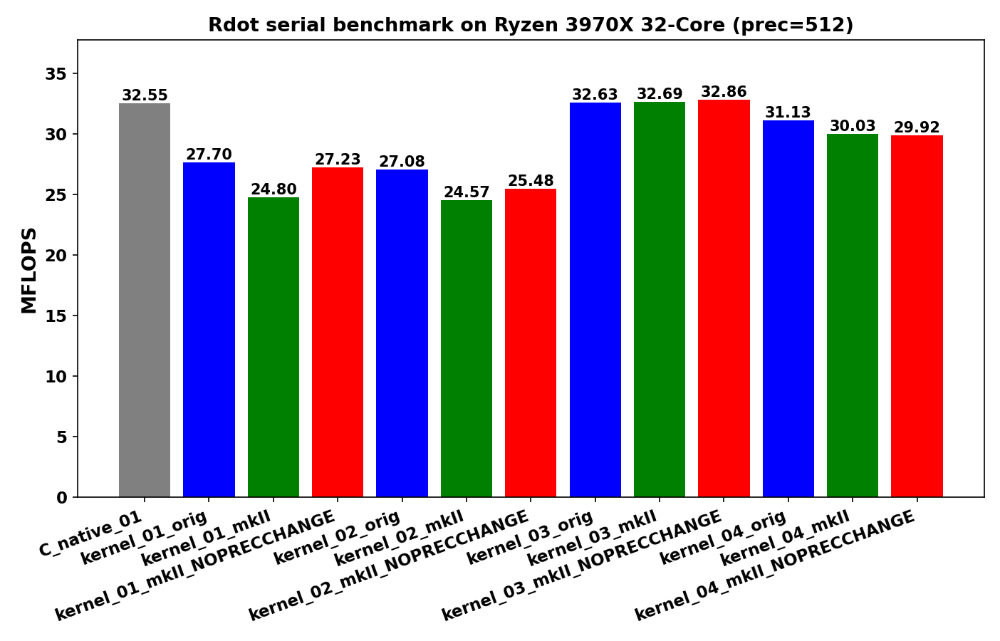
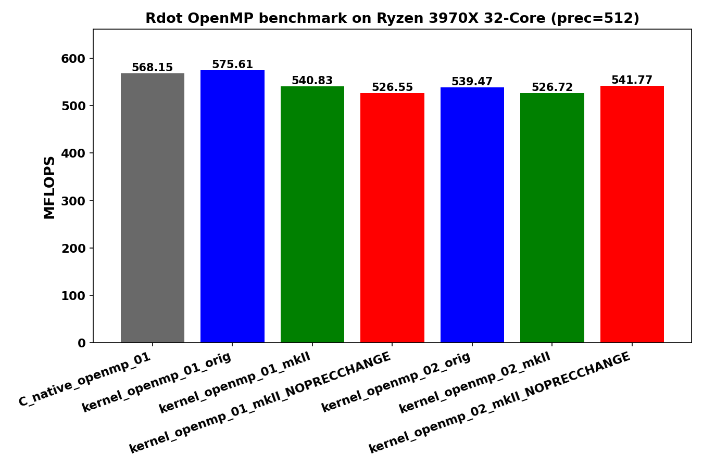

<!-- SPDX-License-Identifier: BSD-2-Clause -->

# 00_Rdot

This directory benchmarks the GMP real dot product

```text
sum_i x_i * y_i
```

with random `mpf` data at a fixed precision.  It compares raw `mpf_t`,
upstream `gmpxx.h`, and `gmpxx_mkII`.

## Build

From the repository root:

```bash
cmake -S . -B build_bench_release -DCMAKE_BUILD_TYPE=Release
cmake --build build_bench_release -j
```

The executables are created under:

```text
build_bench_release/benchmarks/gmp/00_Rdot/
```

## Run

Run the whole benchmark set through the top-level runner:

```bash
benchmarks/common/run_benchmarks.sh build_bench_release 512
```

For a quick Rdot-sized smoke run, pass smaller dimensions:

```bash
benchmarks/common/run_benchmarks.sh build_bench_release 128 1000 1000 32 32 16 16 16 \
    benchmarks/gmp/results-smoke
```

The first vector-size argument is used for Rdot.  Individual executables take:

```text
<vector size> <precision>
```

Example:

```bash
build_bench_release/benchmarks/gmp/00_Rdot/Rdot_gmp_kernel_01_mkII 1000000 512
```

## Reading Results

Each executable prints `Elapsed time` and `MFLOPS`.  Higher MFLOPS is better
when comparing runs with the same vector size, precision, compiler flags, and
machine.

Rdot executables also print a timed-kernel allocator profile:

```text
BENCH_ALLOC_COUNTS label=timed_kernel alloc=... realloc=... free=... alloc_bytes=... realloc_old_bytes=... realloc_new_bytes=... free_bytes=...
```

These counts come from GMP's allocator callback API and measure actual heap
traffic during the timed dot-product body.  They are deliberately separate from
the optional init/clear operation counters enabled by
`-DGMPFRXX_MKII_BENCHMARK_COUNT_MPF_OPERATIONS=ON`.

Variant names:

- `C_native`: raw `mpf_t` implementation.
- `C_native_openmp`: raw `mpf_t` implementation with OpenMP.
- `*_orig`: upstream `gmpxx.h`.
- `*_mkII`: this header with the default precision policy.
- `*_openmp_*`: OpenMP variant where the eager benchmark provided one.

## Recorded go.sh Sample





The committed sample run uses the original `go.sh` dimensions:

```text
N = 100000000, precision = 512
```

Results are stored in [../results_raw/Linux_Ryzen_3970X_32-Core/](../results_raw/Linux_Ryzen_3970X_32-Core/):

- [Raw log](../results_raw/Linux_Ryzen_3970X_32-Core/benchmark_20260430_081331.log)
- [Serial plot](../results_raw/Linux_Ryzen_3970X_32-Core/benchmark_20260430_081331_Linux_Ryzen_3970X_32-Core_serial_Rdot.png)
- [Serial PDF](../results_raw/Linux_Ryzen_3970X_32-Core/benchmark_20260430_081331_Linux_Ryzen_3970X_32-Core_serial_Rdot.pdf)
- [OpenMP plot](../results_raw/Linux_Ryzen_3970X_32-Core/benchmark_20260430_081331_Linux_Ryzen_3970X_32-Core_openmp_Rdot.png)
- [OpenMP PDF](../results_raw/Linux_Ryzen_3970X_32-Core/benchmark_20260430_081331_Linux_Ryzen_3970X_32-Core_openmp_Rdot.pdf)

All Rdot variants in that run report `Result OK`.

The OpenMP variants improve the timed dot-product body by about 17-22x in the
recorded run.  The full executable wall time improves much less, because the
benchmark allocates and initializes two 100000000-element vectors before the
timed kernel.  For non-OpenMP comparison, `kernel_03` is the strongest serial
wrapper family in this run, and `mkII` is essentially tied with upstream
`gmpxx.h` there.

## Kernel Shapes

The timed body is `_Rdot()` in each benchmark executable.  The `Rdot()` helper
in `Rdot.hpp` is the post-run correctness reference; it uses a five-term
unrolled expression and should not be mixed with the timed-kernel disassembly.

| Variant | Timed source shape | Temporary policy | Hotpath meaning |
|---------|--------------------|------------------|-----------------|
| `C_native_01` | `mpf_mul(templ, dx[i], dy[i]); mpf_add(temp, temp, templ);` | `temp` and `templ` are initialized once outside the loop. | Baseline: one `mpf_mul` and one `mpf_add` per element, no per-iteration `mpf_init` / `mpf_clear`. |
| `C_native_openmp_01` | Same raw `mpf_t` dot product inside `#pragma omp for`. | Each thread owns `temp` and `templ`; final accumulation is guarded by `#pragma omp critical`. | Measures parallel raw-GMP throughput without a GMP-aware OpenMP reduction. |
| `kernel_01` | `temp += dx[i] * dy[i];` | Expression-friendly source. In the normal build, the multiply result is materialized as a scoped temporary each iteration. | Tests whether wrapper expression templates remove source-level temporaries. The default hotpath still contains product init/clear traffic. |
| `kernel_02` | `mpf_class templ = dx[i] * dy[i]; temp += templ;` | A new `templ` object is constructed inside every iteration. | Deliberately allocation-heavy wrapper form; worst case for loop-local object lifetime. |
| `kernel_03` | `templ = dx[i] * dy[i]; temp += templ;` | `templ` is constructed once before the loop and reused. | Best serial wrapper shape in the recorded runs: the loop has the same `mpf_mul` + `mpf_add` call shape as C native. |
| `kernel_04` | `templ = dx[i]; templ *= dy[i]; temp += templ;` | `templ` is reused, but each iteration copies `dx[i]` before in-place multiply. | Avoids per-iteration construction but adds `mpf_set`; useful for separating product reuse from expression assignment. |
| `kernel_openmp_01` | Per-thread `templ += dx[i] * dy[i];` | One accumulator per thread, final `critical` add. | Parallel version of the expression-friendly `kernel_01` shape. |
| `kernel_openmp_02` | Per-thread `templl = dx[i]; templl *= dy[i]; tmpl += templl;` | One accumulator and one product object per thread, final `critical` add. | Parallel version of the reused-temporary/in-place multiply shape. |

For `kernel_01_mkII`, the fixed-precision fastpath build changes the product
temporary from a scoped `mpf_init2` / `mpf_clear` object to thread-local scratch
storage.  That removes repeated GMP allocation in the common fixed-precision
case, but the hot loop still contains scratch selection and TLS guard checks.

## Hotpath Disassembly Comparison

The snippets below are from the local release binaries under
`build_bench_release/benchmarks/gmp/00_Rdot/` and were extracted with:

```bash
objdump -Cd --no-show-raw-insn <binary> | c++filt
```

Addresses are build-specific; the relevant comparison is the call sequence
inside the loop.

`Rdot_gmp_C_native_01` is the baseline.  After one-time setup, the loop is only
pointer movement plus `mpf_mul` and `mpf_add`:

```asm
3560: mov    %rbx,%rdx          # dy[i]
3563: mov    %r15,%rsi          # dx[i]
3566: lea    0x30(%rsp),%rdi    # templ
356f: call   __gmpf_mul@plt
3574: lea    0x30(%rsp),%rdx    # templ
3579: mov    %rbp,%rsi          # temp
357c: mov    %rbp,%rdi          # temp
357f: call   __gmpf_add@plt
3584: add    $0x18,%r15
3588: add    $0x18,%rbx
358c: cmp    %r14,%r13
```

`kernel_01_orig` and default `kernel_01_mkII` have the same important problem:
the source expression `temp += dx[i] * dy[i]` creates a product temporary in the
loop.  For default `mkII`, the hotpath contains `mpf_get_prec`, `mpf_init2`,
`mpf_mul`, `mpf_add`, and `mpf_clear` each iteration:

```asm
3460: mov    %rbp,%rdi
3463: call   __gmpf_get_prec@plt
3468: mov    %rsp,%rdi
346b: mov    %rax,%rsi
346e: call   __gmpf_init2@plt
3473: mov    %r13,%rdx
3476: mov    %r12,%rsi
3479: mov    %rsp,%rdi
347c: call   __gmpf_mul@plt
3481: mov    %rsp,%rdx
3484: mov    %rbp,%rsi
3487: mov    %rbp,%rdi
348a: call   __gmpf_add@plt
348f: mov    %rsp,%rdi
349e: call   __gmpf_clear@plt
34a6: jne    3460
```

`kernel_01_mkII_FIXED_PRECISION_FASTPATH` removes the normal scoped temporary
allocation path in the common case, but it is still not as tight as C native or
`kernel_03`: the loop checks thread-local scratch state before using the
scratch product.

```asm
3529: cmpb   $0x0,%fs:0xffffffffffffff59
3538: cmpb   $0x0,%fs:0xffffffffffffff89
3547: cmpb   $0x0,%fs:0xffffffffffffffb9
3556: cmpb   $0x0,%fs:0xffffffffffffffe9
3585: lea    0x20(%rsp),%rdi
358a: mov    %r12,%rdx
358d: mov    %rbp,%rsi
3590: call   __gmpf_mul@plt
359a: lea    0x20(%rsp),%rdx
359f: mov    %rbx,%rsi
35a2: mov    %rbx,%rdi
35ab: call   __gmpf_add@plt
```

`kernel_03_mkII` is the closest wrapper hotpath to C native.  The reusable
`templ` object is initialized before the loop, and the loop itself has one
`mpf_mul` and one `mpf_add`:

```asm
33c0: mov    %rbx,%rdx          # dy[i]
33c3: mov    %rbp,%rsi          # dx[i]
33c6: mov    %r13,%rdi          # templ
33c9: call   __gmpf_mul@plt
33ce: mov    %r13,%rdx          # templ
33d1: mov    %r12,%rsi          # temp
33d4: mov    %r12,%rdi          # temp
33d7: call   __gmpf_add@plt
33dc: add    $0x1,%r15
33e0: add    $0x18,%rbp
33e4: add    $0x18,%rbx
33eb: jne    33c0
```

`kernel_04_mkII` also avoids per-iteration construction, but it pays an extra
copy before the multiply:

```asm
33c0: mov    %r12,%rsi          # dx[i]
33c3: mov    %rbx,%rdi          # templ
33c6: call   __gmpf_set@plt
33cb: mov    %rbp,%rdx          # dy[i]
33ce: mov    %rbx,%rsi          # templ
33d1: mov    %rbx,%rdi          # templ
33d4: call   __gmpf_mul@plt
33d9: mov    %rbx,%rdx          # templ
33dc: mov    %r13,%rsi          # temp
33df: mov    %r13,%rdi          # temp
33e2: call   __gmpf_add@plt
33f6: jne    33c0
```

The OpenMP kernels do not change the scalar GMP operation shape.  They split
the vector loop across threads and then serialize only the final accumulation
through `critical`, so the speedup comes from distributing many independent
`mpf_mul` / `mpf_add` pairs, not from changing GMP's arithmetic cost.

## Recorded Hotpath Run

The repeat-10 run in
[../results_raw/rdot_n1e7_20260509/](../results_raw/rdot_n1e7_20260509/)
uses:

```text
N = 10000000, precision = 512, repeat = 10
```

Maximum MFLOPS in that log:

| Variant | Max MFLOPS | Interpretation |
|---------|------------|----------------|
| `C_native_01` | 32.6331 | Raw serial baseline. |
| `kernel_01_orig` | 27.8489 | Per-iteration product init/clear from expression materialization. |
| `kernel_01_mkII` | 22.5465 | Same hotpath class as upstream `kernel_01`; wrapper default-precision machinery does not remove the loop temporary in the normal build. |
| `kernel_01_mkII_FIXED_PRECISION_FASTPATH` | 29.5412 | Faster than default `kernel_01_mkII` because repeated product allocation is avoided in the fixed-precision case. |
| `kernel_02_orig` | 27.2624 | Loop-local `templ` construction remains expensive. |
| `kernel_02_mkII` | 26.0789 | Same lifetime problem as `kernel_02_orig`. |
| `kernel_03_orig` | 32.8438 | Reused product object; best serial wrapper result in this run. |
| `kernel_03_mkII` | 31.0479 | Same loop call shape as C native and upstream `kernel_03`; remaining gap is setup/object-policy overhead around the loop. |
| `kernel_04_orig` | 31.2640 | Reused product object plus an explicit `mpf_set` before multiply. |
| `kernel_04_mkII` | 30.9857 | Similar to upstream `kernel_04`; extra `mpf_set` keeps it slightly behind the clean `kernel_03` shape. |
| `C_native_openmp_01` | 462.748 | Raw OpenMP baseline. |
| `kernel_openmp_01_orig` | 449.395 | Per-thread expression accumulator scales well despite wrapper overhead. |
| `kernel_openmp_01_mkII` | 431.040 | Same source shape as serial `kernel_01`, but per-thread work amortizes overhead well. |
| `kernel_openmp_02_orig` | 457.709 | Best wrapper OpenMP result in this run. |
| `kernel_openmp_02_mkII` | 435.687 | Reused per-thread product object; close to `kernel_openmp_01_mkII`. |

The main lesson is that `Rdot` is dominated by whether the product temporary is
allocated inside the loop.  Expression-template syntax alone is not enough:
`kernel_01` looks ideal at source level, but the default hotpath still performs
`mpf_init2` / `mpf_clear` per element.  `kernel_03` is faster because it makes
the product lifetime explicit and moves initialization outside the loop.
