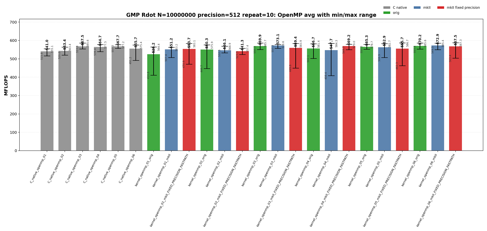
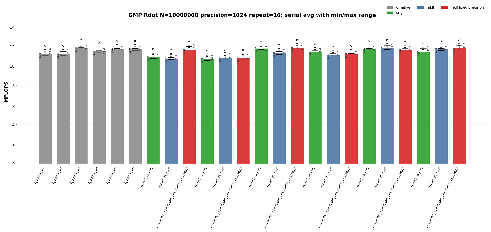
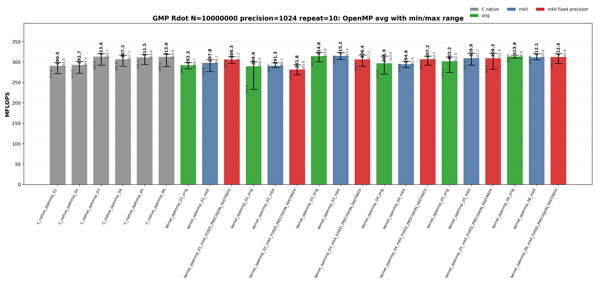

<!--
Copyright (c) 2026
     Nakata, Maho
     All rights reserved.

Redistribution and use in source and binary forms, with or without
modification, are permitted provided that the following conditions
are met:
1. Redistributions of source code must retain the above copyright
   notice, this list of conditions and the following disclaimer.
2. Redistributions in binary form must reproduce the above copyright
   notice, this list of conditions and the following disclaimer in the
   documentation and/or other materials provided with the distribution.

THIS SOFTWARE IS PROVIDED BY THE AUTHOR AND CONTRIBUTORS ``AS IS'' AND
ANY EXPRESS OR IMPLIED WARRANTIES, INCLUDING, BUT NOT LIMITED TO, THE
IMPLIED WARRANTIES OF MERCHANTABILITY AND FITNESS FOR A PARTICULAR PURPOSE
ARE DISCLAIMED.  IN NO EVENT SHALL THE AUTHOR OR CONTRIBUTORS BE LIABLE
FOR ANY DIRECT, INDIRECT, INCIDENTAL, SPECIAL, EXEMPLARY, OR CONSEQUENTIAL
DAMAGES (INCLUDING, BUT NOT LIMITED TO, PROCUREMENT OF SUBSTITUTE GOODS
OR SERVICES; LOSS OF USE, DATA, OR PROFITS; OR BUSINESS INTERRUPTION)
HOWEVER CAUSED AND ON ANY THEORY OF LIABILITY, WHETHER IN CONTRACT, STRICT
LIABILITY, OR TORT (INCLUDING NEGLIGENCE OR OTHERWISE) ARISING IN ANY WAY
OUT OF THE USE OF THIS SOFTWARE, EVEN IF ADVISED OF THE POSSIBILITY OF
SUCH DAMAGE.
-->

# 00_Rdot

This directory benchmarks the GMP real dot product

```text
sum_i x_i * y_i
```

with fixed-precision `mpf` data. It compares raw GMP C API kernels, upstream `gmpxx.h`, and `gmpxx_mkII`. The performance question is which source-level temporary policy determines the emitted hot loop and whether the mkII fixed-precision fastpath changes that class.

## Build

From the repository root:

```bash
cmake -S . -B build_bench_release -DCMAKE_BUILD_TYPE=Release
cmake --build build_bench_release -j
```

Executables are created under:

```text
build_bench_release/benchmarks/gmp/00_Rdot/
```

Each executable takes `<vector size> <precision>`. Example:

```bash
build_bench_release/benchmarks/gmp/00_Rdot/Rdot_gmp_kernel_03_mkII 10000000 512
```

The repeat runner is:

```bash
OMP_NUM_THREADS=32 OMP_PLACES=cores OMP_PROC_BIND=spread \
    benchmarks/gmp/00_Rdot/run_repeat.sh build_bench_release 10000000 512 10
```

Arguments are `<build dir> <vector size> <precision> <repeat count> [output dir]`.

The mkII fixed-precision variants use `GMPFRXX_MKII_FAST_FIXED_PREC`; executable suffixes keep the historical `FIXED_PRECISION_FASTPATH` label for benchmark continuity.

The cross-benchmark runner can execute the GMP and MPFR `00_Rdot`, `01_Raxpy`, and `02_Rgemv` suites for both standard precisions with one command:

```bash
OMP_NUM_THREADS=32 OMP_PLACES=cores OMP_PROC_BIND=spread \
    benchmarks/run_all.sh build_bench_release 512,1024 10 10000000 10000000 4000 4000
```

The second argument is a precision list. `both` and `all` are aliases for `512,1024`; a single value such as `512` still runs only that precision. Per-benchmark results are written to `results_raw/run_all_p512_repeat10_<timestamp>/` and `results_raw/run_all_p1024_repeat10_<timestamp>/` under each benchmark directory.

## Benchmark Parameters

| Parameter | Meaning |
| --- | --- |
| `N` | Number of vector elements. |
| `precision` | Requested GMP `mpf` precision in bits for inputs and accumulators. |
| `repeat` | Number of timed process executions per executable. |
| `OMP_NUM_THREADS` | OpenMP worker count for `openmp` executables. |
| `OMP_PLACES`, `OMP_PROC_BIND` | OpenMP affinity controls used by the runner. |

The committed runs use `N=10000000`, `repeat=10`, `precision=512` and `precision=1024`, with `OMP_NUM_THREADS=32`, `OMP_PLACES=cores`, and `OMP_PROC_BIND=spread`.

## Variant Shapes

The timed body is `_Rdot()`. The suffix numbers are aligned across raw C, upstream C++, mkII C++, serial, and OpenMP kernels.

| Variant | Transition from previous variant | Timed source shape | Temporary/resource policy | Purpose |
| --- | --- | --- | --- | --- |
| `01` | Baseline expression form. | `acc += dx[i] * dy[i]` expression form. | Expression product is materialized inside the loop unless mkII fixed-precision scratch storage applies. | Stress expression-template materialization. |
| `02` | `01 -> 02`: introduce an explicit loop-local product object. | `mpf_class templ = dx[i] * dy[i]; acc += templ;` | Loop-local product object is constructed inside every iteration. | Intentionally expensive construction control. |
| `03` | `02 -> 03`: move product storage outside the loop. | `templ = dx[i] * dy[i]; acc += templ;` | One product object is initialized before the loop and reused. | Practical reusable-product baseline. |
| `04` | `03 -> 04`: switch the reusable product update to copy-then-multiply. | `templ = dx[i]; templ *= dy[i]; acc += templ;` | One product object is reused, but each iteration copies before multiplication. | Test copy-then-multiply source shape. |
| `05` | Branch from `03`: add four accumulators while keeping one product object. | Four accumulators with one reused product object. | Four accumulators share one product temporary. | Test accumulator unrolling. |
| `06` | `05 -> 06`: give each accumulator its own product object. | Four accumulators with four reused product objects. | Four accumulators and four product temporaries are reused. | Test unrolling plus independent product temporaries. |

Raw C kernels use `Rdot_gmp_C_native_NN` and `Rdot_gmp_C_native_openmp_NN`. Wrapper kernels use `Rdot_gmp_kernel_NN_orig`, `Rdot_gmp_kernel_NN_mkII`, `Rdot_gmp_kernel_NN_mkII_FIXED_PRECISION_FASTPATH`, and their `openmp` counterparts.

## Source Transitions

The numbered variants isolate one source-level change at a time. `01 -> 02` moves the product into an explicit loop-local product object. `02 -> 03` moves product storage outside the loop and reuses it. `03 -> 04` changes the reusable product update from expression assignment to copy-then-multiply. `03 -> 05` and `05 -> 06` test accumulator unrolling with one and then four reusable product objects. OpenMP targets keep the same numbered source shape and add a static worker partition plus a final reduction.

## C Native Equivalent Kernels

The C native executables are the reference hot-loop shapes for the C++ wrapper kernels. The mapping is based on the timed `_Rdot()` body, not on the post-run correctness reference.

| C native kernel | Equivalent C++ wrapper kernel(s) | Equivalence notes |
| --- | --- | --- |
| `C_native_01` | Closest to `kernel_02_*`; normal `kernel_01_*` may lower to this class. | Raw C initializes and clears a product `mpf_t` inside the loop. |
| `C_native_02` | Closest to `kernel_02_*` | Same loop-local product class as 01. |
| `C_native_03` | `kernel_03_*` | One product object is initialized before the loop and reused. |
| `C_native_04` | `kernel_04_*` | One product object is reused after copying `dx[i]`. |
| `C_native_05` | `kernel_05_*` | Four accumulators with one reused product object. |
| `C_native_06` | `kernel_06_*` | Four accumulators with four reused product objects. |
| `C_native_openmp_NN` | `kernel_openmp_NN_*` for the same `NN` | OpenMP variants follow the same source-shape numbering as serial kernels. |

`kernel_01_*` has no exact raw C source-level equivalent because it is the expression-template spelling. In a normal build it behaves like a loop-local product materialization path. In a fixed-precision fastpath build it can move into the reusable-scratch performance class, so disassembly should be used before treating it as equivalent to one raw C kernel.

## Recorded Run

### 512-bit run

| Field | Value |
|-------|-------|
| Run ID | `run_all_p512_repeat10_20260527_094954` |
| Date | 2026-05-27 |
| CPU | AMD Ryzen Threadripper 3970X 32-Core Processor |
| OS | Linux 6.8.0-94-generic x86_64 |
| Compiler | `c++ (Ubuntu 15.2.0-16ubuntu1) 15.2.0` |
| Build type | Release |
| Problem size | `N=10000000` |
| Precision | 512 bits |
| Repeat count | 10 |
| OpenMP | `OMP_NUM_THREADS=32`, `OMP_PLACES=cores`, `OMP_PROC_BIND=spread` |
| Default precision env | `GMPXX_DEFAULT_MPF_PRECISION_BITS=512` |
| Benchmark command | `OMP_NUM_THREADS=32 OMP_PLACES=cores OMP_PROC_BIND=spread benchmarks/run_all.sh build_bench_release 512,1024 10` |
| Raw result directory | `benchmarks/gmp/00_Rdot/results_raw/run_all_p512_repeat10_20260527_094954/` |
| Raw log | `benchmarks/gmp/00_Rdot/results_raw/run_all_p512_repeat10_20260527_094954/benchmark_rdot_gmp_n10000000_p512_repeat10.log` |
| Raw CSV | `benchmarks/gmp/00_Rdot/results_raw/run_all_p512_repeat10_20260527_094954/raw_rdot_gmp_n10000000_p512_repeat10.csv` |
| Summary CSV | `benchmarks/gmp/00_Rdot/results_raw/run_all_p512_repeat10_20260527_094954/summary_rdot_gmp_n10000000_p512_repeat10.csv` |
| Correctness | 480 / 480 runs reported OK. |




Plot regeneration command:

```bash
python3 benchmarks/gmp/00_Rdot/plot_repeat_summary.py \
    benchmarks/gmp/00_Rdot/results_raw/run_all_p512_repeat10_20260527_094954/benchmark_rdot_gmp_n10000000_p512_repeat10.log \
    --output-dir benchmarks/gmp/00_Rdot/results_raw/run_all_p512_repeat10_20260527_094954 \
    --output-prefix rdot_gmp_n10000000_p512_repeat10 \
    --title-prefix "GMP Rdot N=10000000, precision=512, repeat=10"
```

### 1024-bit run

| Field | Value |
|-------|-------|
| Run ID | `run_all_p1024_repeat10_20260527_094954` |
| Date | 2026-05-27 |
| CPU | AMD Ryzen Threadripper 3970X 32-Core Processor |
| OS | Linux 6.8.0-94-generic x86_64 |
| Compiler | `c++ (Ubuntu 15.2.0-16ubuntu1) 15.2.0` |
| Build type | Release |
| Problem size | `N=10000000` |
| Precision | 1024 bits |
| Repeat count | 10 |
| OpenMP | `OMP_NUM_THREADS=32`, `OMP_PLACES=cores`, `OMP_PROC_BIND=spread` |
| Default precision env | `GMPXX_DEFAULT_MPF_PRECISION_BITS=1024` |
| Benchmark command | `OMP_NUM_THREADS=32 OMP_PLACES=cores OMP_PROC_BIND=spread benchmarks/run_all.sh build_bench_release 512,1024 10` |
| Raw result directory | `benchmarks/gmp/00_Rdot/results_raw/run_all_p1024_repeat10_20260527_094954/` |
| Raw log | `benchmarks/gmp/00_Rdot/results_raw/run_all_p1024_repeat10_20260527_094954/benchmark_rdot_gmp_n10000000_p1024_repeat10.log` |
| Raw CSV | `benchmarks/gmp/00_Rdot/results_raw/run_all_p1024_repeat10_20260527_094954/raw_rdot_gmp_n10000000_p1024_repeat10.csv` |
| Summary CSV | `benchmarks/gmp/00_Rdot/results_raw/run_all_p1024_repeat10_20260527_094954/summary_rdot_gmp_n10000000_p1024_repeat10.csv` |
| Correctness | 480 / 480 runs reported OK. |





Plot regeneration command:

```bash
python3 benchmarks/gmp/00_Rdot/plot_repeat_summary.py \
    benchmarks/gmp/00_Rdot/results_raw/run_all_p1024_repeat10_20260527_094954/benchmark_rdot_gmp_n10000000_p1024_repeat10.log \
    --output-dir benchmarks/gmp/00_Rdot/results_raw/run_all_p1024_repeat10_20260527_094954 \
    --output-prefix rdot_gmp_n10000000_p1024_repeat10 \
    --title-prefix "GMP Rdot N=10000000, precision=1024, repeat=10"
```

## Resource or Bandwidth Estimates

The values below are model estimates derived from MFLOPS, not hardware-counter measurements. They count active limb bytes plus a header-inclusive object model. They exclude allocator metadata, cache-line overfetch, instruction fetch, and final OpenMP reduction traffic.

| Case | Representative best-avg variant | Avg MFLOPS | Active bytes/iteration | Header-inclusive bytes/iteration | Active GB/s | Header-inclusive GB/s |
| --- | --- | --- | --- | --- | --- | --- |
| 512-bit serial | `kernel_06_mkII_FIXED_PRECISION_FASTPATH` | 32.961 | 128 | 176 | 2.109 | 2.901 |
| 512-bit OpenMP | `kernel_openmp_03_mkII` | 573.121 | 128 | 176 | 36.680 | 50.435 |
| 1024-bit serial | `kernel_06_mkII_FIXED_PRECISION_FASTPATH` | 11.897 | 256 | 304 | 1.523 | 1.808 |
| 1024-bit OpenMP | `kernel_openmp_03_mkII` | 315.184 | 256 | 304 | 40.344 | 47.908 |

For `Rdot`, the per-iteration byte model is a compact arithmetic-stream estimate. It is not a full cache-footprint or hardware-bandwidth measurement.

## Headline Results

The headline rows below are regenerated from the committed 512-bit and 1024-bit `run_all` summary CSV files.

| Precision | Class | Variant | Max MFLOPS | Avg MFLOPS | Interpretation |
| --- | --- | --- | --- | --- | --- |
| 512 | Best max serial | `kernel_06_mkII_FIXED_PRECISION_FASTPATH` | 33.796 | 32.961 | mkII fixed-precision build; intended to remove repeated scratch setup when the source shape uses expression materialization. |
| 512 | Best average serial | `kernel_06_mkII_FIXED_PRECISION_FASTPATH` | 33.796 | 32.961 | mkII fixed-precision build; intended to remove repeated scratch setup when the source shape uses expression materialization. |
| 512 | Best max OpenMP | `kernel_openmp_06_mkII_FIXED_PRECISION_FASTPATH` | 587.334 | 567.504 | mkII fixed-precision build; intended to remove repeated scratch setup when the source shape uses expression materialization. |
| 512 | Best average OpenMP | `kernel_openmp_03_mkII` | 578.634 | 573.121 | mkII wrapper baseline for the numbered source shape. |
| 1024 | Best max serial | `kernel_06_mkII_FIXED_PRECISION_FASTPATH` | 12.151 | 11.897 | mkII fixed-precision build; intended to remove repeated scratch setup when the source shape uses expression materialization. |
| 1024 | Best average serial | `kernel_06_mkII_FIXED_PRECISION_FASTPATH` | 12.151 | 11.897 | mkII fixed-precision build; intended to remove repeated scratch setup when the source shape uses expression materialization. |
| 1024 | Best max OpenMP | `kernel_openmp_03_orig` | 323.630 | 314.643 | Upstream gmpxx.h wrapper for the same numbered source shape. |
| 1024 | Best average OpenMP | `kernel_openmp_03_mkII` | 323.366 | 315.184 | mkII wrapper baseline for the numbered source shape. |

## Serial Results

### 512-bit serial interpretation

These rows are derived from `benchmarks/gmp/00_Rdot/results_raw/run_all_p512_repeat10_20260527_094954/summary_rdot_gmp_n10000000_p512_repeat10.csv`.

| Observation | Variant | Max MFLOPS | Avg MFLOPS | Min MFLOPS | Interpretation |
| --- | --- | --- | --- | --- | --- |
| Best raw C average | `C_native_06` | 33.521 | 32.838 | 32.489 | Raw C reference for the numbered source shape. |
| Best upstream average | `kernel_03_orig` | 33.486 | 32.813 | 32.441 | Upstream gmpxx.h wrapper for the same numbered source shape. |
| Best mkII baseline average | `kernel_05_mkII` | 33.105 | 32.769 | 32.450 | mkII wrapper baseline for the numbered source shape. |
| Best mkII fixed-precision average | `kernel_06_mkII_FIXED_PRECISION_FASTPATH` | 33.796 | 32.961 | 32.285 | mkII fixed-precision build; intended to remove repeated scratch setup when the source shape uses expression materialization. |
| Best max | `kernel_06_mkII_FIXED_PRECISION_FASTPATH` | 33.796 | 32.961 | 32.285 | mkII fixed-precision build; intended to remove repeated scratch setup when the source shape uses expression materialization. |

<details>
<summary>512-bit serial results sorted by Max MFLOPS</summary>

| Rank | Variant | Max MFLOPS | Avg MFLOPS | Min MFLOPS |
| --- | --- | --- | --- | --- |
| 1 | `kernel_06_mkII_FIXED_PRECISION_FASTPATH` | 33.796 | 32.961 | 32.285 |
| 2 | `C_native_06` | 33.521 | 32.838 | 32.489 |
| 3 | `kernel_03_orig` | 33.486 | 32.813 | 32.441 |
| 4 | `kernel_05_mkII` | 33.105 | 32.769 | 32.450 |
| 5 | `C_native_03` | 33.038 | 32.619 | 32.102 |
| 6 | `kernel_03_mkII_FIXED_PRECISION_FASTPATH` | 33.038 | 32.728 | 32.036 |
| 7 | `kernel_05_orig` | 32.825 | 31.837 | 31.637 |
| 8 | `kernel_04_orig` | 32.447 | 31.323 | 30.969 |
| 9 | `C_native_05` | 32.261 | 31.312 | 30.520 |
| 10 | `kernel_06_mkII` | 32.085 | 31.823 | 31.491 |
| 11 | `kernel_05_mkII_FIXED_PRECISION_FASTPATH` | 31.948 | 31.789 | 31.541 |
| 12 | `kernel_01_mkII_FIXED_PRECISION_FASTPATH` | 31.777 | 31.551 | 31.098 |
| 13 | `C_native_04` | 31.409 | 30.987 | 30.070 |
| 14 | `kernel_06_orig` | 30.796 | 30.004 | 29.583 |
| 15 | `kernel_03_mkII` | 29.478 | 29.034 | 28.768 |
| 16 | `kernel_04_mkII_FIXED_PRECISION_FASTPATH` | 29.032 | 28.611 | 28.308 |
| 17 | `C_native_02` | 28.756 | 28.425 | 27.898 |
| 18 | `C_native_01` | 28.630 | 28.384 | 27.992 |
| 19 | `kernel_04_mkII` | 27.281 | 27.189 | 27.039 |
| 20 | `kernel_01_orig` | 26.738 | 26.071 | 25.732 |
| 21 | `kernel_02_mkII` | 26.246 | 25.842 | 25.306 |
| 22 | `kernel_01_mkII` | 26.050 | 25.321 | 25.055 |
| 23 | `kernel_02_mkII_FIXED_PRECISION_FASTPATH` | 25.941 | 25.622 | 25.248 |
| 24 | `kernel_02_orig` | 25.561 | 25.006 | 24.750 |

</details>

<details>
<summary>512-bit serial results sorted by Avg MFLOPS</summary>

| Rank | Variant | Max MFLOPS | Avg MFLOPS | Min MFLOPS |
| --- | --- | --- | --- | --- |
| 1 | `kernel_06_mkII_FIXED_PRECISION_FASTPATH` | 33.796 | 32.961 | 32.285 |
| 2 | `C_native_06` | 33.521 | 32.838 | 32.489 |
| 3 | `kernel_03_orig` | 33.486 | 32.813 | 32.441 |
| 4 | `kernel_05_mkII` | 33.105 | 32.769 | 32.450 |
| 5 | `kernel_03_mkII_FIXED_PRECISION_FASTPATH` | 33.038 | 32.728 | 32.036 |
| 6 | `C_native_03` | 33.038 | 32.619 | 32.102 |
| 7 | `kernel_05_orig` | 32.825 | 31.837 | 31.637 |
| 8 | `kernel_06_mkII` | 32.085 | 31.823 | 31.491 |
| 9 | `kernel_05_mkII_FIXED_PRECISION_FASTPATH` | 31.948 | 31.789 | 31.541 |
| 10 | `kernel_01_mkII_FIXED_PRECISION_FASTPATH` | 31.777 | 31.551 | 31.098 |
| 11 | `kernel_04_orig` | 32.447 | 31.323 | 30.969 |
| 12 | `C_native_05` | 32.261 | 31.312 | 30.520 |
| 13 | `C_native_04` | 31.409 | 30.987 | 30.070 |
| 14 | `kernel_06_orig` | 30.796 | 30.004 | 29.583 |
| 15 | `kernel_03_mkII` | 29.478 | 29.034 | 28.768 |
| 16 | `kernel_04_mkII_FIXED_PRECISION_FASTPATH` | 29.032 | 28.611 | 28.308 |
| 17 | `C_native_02` | 28.756 | 28.425 | 27.898 |
| 18 | `C_native_01` | 28.630 | 28.384 | 27.992 |
| 19 | `kernel_04_mkII` | 27.281 | 27.189 | 27.039 |
| 20 | `kernel_01_orig` | 26.738 | 26.071 | 25.732 |
| 21 | `kernel_02_mkII` | 26.246 | 25.842 | 25.306 |
| 22 | `kernel_02_mkII_FIXED_PRECISION_FASTPATH` | 25.941 | 25.622 | 25.248 |
| 23 | `kernel_01_mkII` | 26.050 | 25.321 | 25.055 |
| 24 | `kernel_02_orig` | 25.561 | 25.006 | 24.750 |

</details>

### 1024-bit serial interpretation

These rows are derived from `benchmarks/gmp/00_Rdot/results_raw/run_all_p1024_repeat10_20260527_094954/summary_rdot_gmp_n10000000_p1024_repeat10.csv`.

| Observation | Variant | Max MFLOPS | Avg MFLOPS | Min MFLOPS | Interpretation |
| --- | --- | --- | --- | --- | --- |
| Best raw C average | `C_native_03` | 11.909 | 11.821 | 11.762 | Raw C reference for the numbered source shape. |
| Best upstream average | `kernel_03_orig` | 11.859 | 11.808 | 11.729 | Upstream gmpxx.h wrapper for the same numbered source shape. |
| Best mkII baseline average | `kernel_05_mkII` | 12.101 | 11.873 | 11.716 | mkII wrapper baseline for the numbered source shape. |
| Best mkII fixed-precision average | `kernel_06_mkII_FIXED_PRECISION_FASTPATH` | 12.151 | 11.897 | 11.679 | mkII fixed-precision build; intended to remove repeated scratch setup when the source shape uses expression materialization. |
| Best max | `kernel_06_mkII_FIXED_PRECISION_FASTPATH` | 12.151 | 11.897 | 11.679 | mkII fixed-precision build; intended to remove repeated scratch setup when the source shape uses expression materialization. |

<details>
<summary>1024-bit serial results sorted by Max MFLOPS</summary>

| Rank | Variant | Max MFLOPS | Avg MFLOPS | Min MFLOPS |
| --- | --- | --- | --- | --- |
| 1 | `kernel_06_mkII_FIXED_PRECISION_FASTPATH` | 12.151 | 11.897 | 11.679 |
| 2 | `kernel_05_mkII` | 12.101 | 11.873 | 11.716 |
| 3 | `kernel_01_mkII_FIXED_PRECISION_FASTPATH` | 12.024 | 11.695 | 11.573 |
| 4 | `kernel_03_mkII_FIXED_PRECISION_FASTPATH` | 11.958 | 11.864 | 11.775 |
| 5 | `C_native_03` | 11.909 | 11.821 | 11.762 |
| 6 | `kernel_03_orig` | 11.859 | 11.808 | 11.729 |
| 7 | `kernel_06_orig` | 11.841 | 11.488 | 11.369 |
| 8 | `kernel_05_mkII_FIXED_PRECISION_FASTPATH` | 11.834 | 11.692 | 11.566 |
| 9 | `kernel_05_orig` | 11.826 | 11.727 | 11.661 |
| 10 | `C_native_06` | 11.825 | 11.756 | 11.593 |
| 11 | `kernel_06_mkII` | 11.822 | 11.718 | 11.616 |
| 12 | `C_native_05` | 11.820 | 11.744 | 11.668 |
| 13 | `C_native_04` | 11.595 | 11.517 | 11.444 |
| 14 | `kernel_04_orig` | 11.592 | 11.483 | 11.382 |
| 15 | `C_native_01` | 11.582 | 11.249 | 11.128 |
| 16 | `C_native_02` | 11.524 | 11.222 | 11.075 |
| 17 | `kernel_03_mkII` | 11.501 | 11.344 | 11.199 |
| 18 | `kernel_04_mkII` | 11.326 | 11.188 | 11.025 |
| 19 | `kernel_04_mkII_FIXED_PRECISION_FASTPATH` | 11.297 | 11.222 | 11.136 |
| 20 | `kernel_02_mkII` | 11.143 | 10.864 | 10.715 |
| 21 | `kernel_01_orig` | 11.051 | 10.949 | 10.801 |
| 22 | `kernel_02_mkII_FIXED_PRECISION_FASTPATH` | 11.039 | 10.827 | 10.717 |
| 23 | `kernel_02_orig` | 10.938 | 10.743 | 10.591 |
| 24 | `kernel_01_mkII` | 10.894 | 10.788 | 10.680 |

</details>

<details>
<summary>1024-bit serial results sorted by Avg MFLOPS</summary>

| Rank | Variant | Max MFLOPS | Avg MFLOPS | Min MFLOPS |
| --- | --- | --- | --- | --- |
| 1 | `kernel_06_mkII_FIXED_PRECISION_FASTPATH` | 12.151 | 11.897 | 11.679 |
| 2 | `kernel_05_mkII` | 12.101 | 11.873 | 11.716 |
| 3 | `kernel_03_mkII_FIXED_PRECISION_FASTPATH` | 11.958 | 11.864 | 11.775 |
| 4 | `C_native_03` | 11.909 | 11.821 | 11.762 |
| 5 | `kernel_03_orig` | 11.859 | 11.808 | 11.729 |
| 6 | `C_native_06` | 11.825 | 11.756 | 11.593 |
| 7 | `C_native_05` | 11.820 | 11.744 | 11.668 |
| 8 | `kernel_05_orig` | 11.826 | 11.727 | 11.661 |
| 9 | `kernel_06_mkII` | 11.822 | 11.718 | 11.616 |
| 10 | `kernel_01_mkII_FIXED_PRECISION_FASTPATH` | 12.024 | 11.695 | 11.573 |
| 11 | `kernel_05_mkII_FIXED_PRECISION_FASTPATH` | 11.834 | 11.692 | 11.566 |
| 12 | `C_native_04` | 11.595 | 11.517 | 11.444 |
| 13 | `kernel_06_orig` | 11.841 | 11.488 | 11.369 |
| 14 | `kernel_04_orig` | 11.592 | 11.483 | 11.382 |
| 15 | `kernel_03_mkII` | 11.501 | 11.344 | 11.199 |
| 16 | `C_native_01` | 11.582 | 11.249 | 11.128 |
| 17 | `kernel_04_mkII_FIXED_PRECISION_FASTPATH` | 11.297 | 11.222 | 11.136 |
| 18 | `C_native_02` | 11.524 | 11.222 | 11.075 |
| 19 | `kernel_04_mkII` | 11.326 | 11.188 | 11.025 |
| 20 | `kernel_01_orig` | 11.051 | 10.949 | 10.801 |
| 21 | `kernel_02_mkII` | 11.143 | 10.864 | 10.715 |
| 22 | `kernel_02_mkII_FIXED_PRECISION_FASTPATH` | 11.039 | 10.827 | 10.717 |
| 23 | `kernel_01_mkII` | 10.894 | 10.788 | 10.680 |
| 24 | `kernel_02_orig` | 10.938 | 10.743 | 10.591 |

</details>

## OpenMP Results

### 512-bit OpenMP interpretation

These rows are derived from `benchmarks/gmp/00_Rdot/results_raw/run_all_p512_repeat10_20260527_094954/summary_rdot_gmp_n10000000_p512_repeat10.csv`.

| Observation | Variant | Max MFLOPS | Avg MFLOPS | Min MFLOPS | Interpretation |
| --- | --- | --- | --- | --- | --- |
| Best raw C average | `C_native_openmp_05` | 577.182 | 567.715 | 557.277 | Raw C reference for the numbered source shape. |
| Best upstream average | `kernel_openmp_06_orig` | 585.594 | 570.242 | 553.366 | Upstream gmpxx.h wrapper for the same numbered source shape. |
| Best mkII baseline average | `kernel_openmp_03_mkII` | 578.634 | 573.121 | 557.322 | mkII wrapper baseline for the numbered source shape. |
| Best mkII fixed-precision average | `kernel_openmp_04_mkII_FIXED_PRECISION_FASTPATH` | 578.977 | 569.227 | 549.674 | mkII fixed-precision build; intended to remove repeated scratch setup when the source shape uses expression materialization. |
| Best max | `kernel_openmp_06_mkII_FIXED_PRECISION_FASTPATH` | 587.334 | 567.504 | 503.422 | mkII fixed-precision build; intended to remove repeated scratch setup when the source shape uses expression materialization. |

<details>
<summary>512-bit OpenMP results sorted by Max MFLOPS</summary>

| Rank | Variant | Max MFLOPS | Avg MFLOPS | Min MFLOPS |
| --- | --- | --- | --- | --- |
| 1 | `kernel_openmp_06_mkII_FIXED_PRECISION_FASTPATH` | 587.334 | 567.504 | 503.422 |
| 2 | `kernel_openmp_05_mkII_FIXED_PRECISION_FASTPATH` | 586.673 | 555.689 | 462.259 |
| 3 | `kernel_openmp_03_orig` | 585.739 | 569.878 | 550.309 |
| 4 | `C_native_openmp_03` | 585.640 | 567.520 | 553.781 |
| 5 | `kernel_openmp_06_orig` | 585.594 | 570.242 | 553.366 |
| 6 | `kernel_openmp_06_mkII` | 585.415 | 572.902 | 549.546 |
| 7 | `kernel_openmp_04_mkII` | 584.327 | 547.696 | 408.397 |
| 8 | `kernel_openmp_03_mkII_FIXED_PRECISION_FASTPATH` | 583.850 | 559.351 | 449.555 |
| 9 | `kernel_openmp_01_mkII_FIXED_PRECISION_FASTPATH` | 583.092 | 553.668 | 470.868 |
| 10 | `kernel_openmp_05_mkII` | 582.739 | 562.882 | 506.866 |
| 11 | `kernel_openmp_04_orig` | 581.414 | 556.721 | 502.051 |
| 12 | `kernel_openmp_04_mkII_FIXED_PRECISION_FASTPATH` | 578.977 | 569.227 | 549.674 |
| 13 | `kernel_openmp_05_orig` | 578.659 | 565.341 | 552.006 |
| 14 | `kernel_openmp_03_mkII` | 578.634 | 573.121 | 557.322 |
| 15 | `C_native_openmp_04` | 577.511 | 564.656 | 539.368 |
| 16 | `C_native_openmp_05` | 577.182 | 567.715 | 557.277 |
| 17 | `kernel_openmp_02_orig` | 575.940 | 550.282 | 446.720 |
| 18 | `C_native_openmp_06` | 575.393 | 555.723 | 491.213 |
| 19 | `kernel_openmp_02_mkII` | 568.881 | 546.090 | 532.499 |
| 20 | `kernel_openmp_01_orig` | 564.385 | 525.219 | 410.766 |
| 21 | `C_native_openmp_02` | 563.367 | 543.372 | 519.992 |
| 22 | `kernel_openmp_01_mkII` | 563.226 | 551.229 | 507.414 |
| 23 | `kernel_openmp_02_mkII_FIXED_PRECISION_FASTPATH` | 557.353 | 541.301 | 523.458 |
| 24 | `C_native_openmp_01` | 555.086 | 540.963 | 515.814 |

</details>

<details>
<summary>512-bit OpenMP results sorted by Avg MFLOPS</summary>

| Rank | Variant | Max MFLOPS | Avg MFLOPS | Min MFLOPS |
| --- | --- | --- | --- | --- |
| 1 | `kernel_openmp_03_mkII` | 578.634 | 573.121 | 557.322 |
| 2 | `kernel_openmp_06_mkII` | 585.415 | 572.902 | 549.546 |
| 3 | `kernel_openmp_06_orig` | 585.594 | 570.242 | 553.366 |
| 4 | `kernel_openmp_03_orig` | 585.739 | 569.878 | 550.309 |
| 5 | `kernel_openmp_04_mkII_FIXED_PRECISION_FASTPATH` | 578.977 | 569.227 | 549.674 |
| 6 | `C_native_openmp_05` | 577.182 | 567.715 | 557.277 |
| 7 | `C_native_openmp_03` | 585.640 | 567.520 | 553.781 |
| 8 | `kernel_openmp_06_mkII_FIXED_PRECISION_FASTPATH` | 587.334 | 567.504 | 503.422 |
| 9 | `kernel_openmp_05_orig` | 578.659 | 565.341 | 552.006 |
| 10 | `C_native_openmp_04` | 577.511 | 564.656 | 539.368 |
| 11 | `kernel_openmp_05_mkII` | 582.739 | 562.882 | 506.866 |
| 12 | `kernel_openmp_03_mkII_FIXED_PRECISION_FASTPATH` | 583.850 | 559.351 | 449.555 |
| 13 | `kernel_openmp_04_orig` | 581.414 | 556.721 | 502.051 |
| 14 | `C_native_openmp_06` | 575.393 | 555.723 | 491.213 |
| 15 | `kernel_openmp_05_mkII_FIXED_PRECISION_FASTPATH` | 586.673 | 555.689 | 462.259 |
| 16 | `kernel_openmp_01_mkII_FIXED_PRECISION_FASTPATH` | 583.092 | 553.668 | 470.868 |
| 17 | `kernel_openmp_01_mkII` | 563.226 | 551.229 | 507.414 |
| 18 | `kernel_openmp_02_orig` | 575.940 | 550.282 | 446.720 |
| 19 | `kernel_openmp_04_mkII` | 584.327 | 547.696 | 408.397 |
| 20 | `kernel_openmp_02_mkII` | 568.881 | 546.090 | 532.499 |
| 21 | `C_native_openmp_02` | 563.367 | 543.372 | 519.992 |
| 22 | `kernel_openmp_02_mkII_FIXED_PRECISION_FASTPATH` | 557.353 | 541.301 | 523.458 |
| 23 | `C_native_openmp_01` | 555.086 | 540.963 | 515.814 |
| 24 | `kernel_openmp_01_orig` | 564.385 | 525.219 | 410.766 |

</details>

### 1024-bit OpenMP interpretation

These rows are derived from `benchmarks/gmp/00_Rdot/results_raw/run_all_p1024_repeat10_20260527_094954/summary_rdot_gmp_n10000000_p1024_repeat10.csv`.

| Observation | Variant | Max MFLOPS | Avg MFLOPS | Min MFLOPS | Interpretation |
| --- | --- | --- | --- | --- | --- |
| Best raw C average | `C_native_openmp_03` | 320.683 | 313.360 | 292.434 | Raw C reference for the numbered source shape. |
| Best upstream average | `kernel_openmp_03_orig` | 323.630 | 314.643 | 300.813 | Upstream gmpxx.h wrapper for the same numbered source shape. |
| Best mkII baseline average | `kernel_openmp_03_mkII` | 323.366 | 315.184 | 306.414 | mkII wrapper baseline for the numbered source shape. |
| Best mkII fixed-precision average | `kernel_openmp_06_mkII_FIXED_PRECISION_FASTPATH` | 320.397 | 312.373 | 296.459 | mkII fixed-precision build; intended to remove repeated scratch setup when the source shape uses expression materialization. |
| Best max | `kernel_openmp_03_orig` | 323.630 | 314.643 | 300.813 | Upstream gmpxx.h wrapper for the same numbered source shape. |

<details>
<summary>1024-bit OpenMP results sorted by Max MFLOPS</summary>

| Rank | Variant | Max MFLOPS | Avg MFLOPS | Min MFLOPS |
| --- | --- | --- | --- | --- |
| 1 | `kernel_openmp_03_orig` | 323.630 | 314.643 | 300.813 |
| 2 | `kernel_openmp_03_mkII` | 323.366 | 315.184 | 306.414 |
| 3 | `kernel_openmp_05_mkII` | 321.656 | 309.940 | 292.368 |
| 4 | `kernel_openmp_05_mkII_FIXED_PRECISION_FASTPATH` | 321.387 | 309.255 | 282.559 |
| 5 | `kernel_openmp_06_mkII` | 320.796 | 312.118 | 305.784 |
| 6 | `C_native_openmp_03` | 320.683 | 313.360 | 292.434 |
| 7 | `kernel_openmp_06_mkII_FIXED_PRECISION_FASTPATH` | 320.397 | 312.373 | 296.459 |
| 8 | `C_native_openmp_06` | 319.883 | 313.020 | 289.021 |
| 9 | `C_native_openmp_05` | 318.591 | 311.484 | 294.294 |
| 10 | `kernel_openmp_03_mkII_FIXED_PRECISION_FASTPATH` | 317.245 | 306.378 | 289.866 |
| 11 | `C_native_openmp_04` | 317.097 | 307.192 | 289.833 |
| 12 | `kernel_openmp_06_orig` | 316.940 | 313.865 | 309.905 |
| 13 | `kernel_openmp_04_orig` | 314.553 | 296.884 | 270.937 |
| 14 | `kernel_openmp_04_mkII_FIXED_PRECISION_FASTPATH` | 314.533 | 307.169 | 292.521 |
| 15 | `kernel_openmp_01_mkII_FIXED_PRECISION_FASTPATH` | 313.172 | 306.294 | 296.983 |
| 16 | `kernel_openmp_05_orig` | 312.457 | 302.179 | 275.032 |
| 17 | `kernel_openmp_01_mkII` | 306.163 | 297.753 | 276.840 |
| 18 | `kernel_openmp_04_mkII` | 301.951 | 294.643 | 286.795 |
| 19 | `C_native_openmp_02` | 301.475 | 292.745 | 272.727 |
| 20 | `kernel_openmp_02_orig` | 300.864 | 289.880 | 233.397 |
| 21 | `C_native_openmp_01` | 298.769 | 290.472 | 271.847 |
| 22 | `kernel_openmp_01_orig` | 298.651 | 292.279 | 283.418 |
| 23 | `kernel_openmp_02_mkII` | 298.344 | 291.308 | 286.698 |
| 24 | `kernel_openmp_02_mkII_FIXED_PRECISION_FASTPATH` | 292.754 | 281.821 | 269.111 |

</details>

<details>
<summary>1024-bit OpenMP results sorted by Avg MFLOPS</summary>

| Rank | Variant | Max MFLOPS | Avg MFLOPS | Min MFLOPS |
| --- | --- | --- | --- | --- |
| 1 | `kernel_openmp_03_mkII` | 323.366 | 315.184 | 306.414 |
| 2 | `kernel_openmp_03_orig` | 323.630 | 314.643 | 300.813 |
| 3 | `kernel_openmp_06_orig` | 316.940 | 313.865 | 309.905 |
| 4 | `C_native_openmp_03` | 320.683 | 313.360 | 292.434 |
| 5 | `C_native_openmp_06` | 319.883 | 313.020 | 289.021 |
| 6 | `kernel_openmp_06_mkII_FIXED_PRECISION_FASTPATH` | 320.397 | 312.373 | 296.459 |
| 7 | `kernel_openmp_06_mkII` | 320.796 | 312.118 | 305.784 |
| 8 | `C_native_openmp_05` | 318.591 | 311.484 | 294.294 |
| 9 | `kernel_openmp_05_mkII` | 321.656 | 309.940 | 292.368 |
| 10 | `kernel_openmp_05_mkII_FIXED_PRECISION_FASTPATH` | 321.387 | 309.255 | 282.559 |
| 11 | `C_native_openmp_04` | 317.097 | 307.192 | 289.833 |
| 12 | `kernel_openmp_04_mkII_FIXED_PRECISION_FASTPATH` | 314.533 | 307.169 | 292.521 |
| 13 | `kernel_openmp_03_mkII_FIXED_PRECISION_FASTPATH` | 317.245 | 306.378 | 289.866 |
| 14 | `kernel_openmp_01_mkII_FIXED_PRECISION_FASTPATH` | 313.172 | 306.294 | 296.983 |
| 15 | `kernel_openmp_05_orig` | 312.457 | 302.179 | 275.032 |
| 16 | `kernel_openmp_01_mkII` | 306.163 | 297.753 | 276.840 |
| 17 | `kernel_openmp_04_orig` | 314.553 | 296.884 | 270.937 |
| 18 | `kernel_openmp_04_mkII` | 301.951 | 294.643 | 286.795 |
| 19 | `C_native_openmp_02` | 301.475 | 292.745 | 272.727 |
| 20 | `kernel_openmp_01_orig` | 298.651 | 292.279 | 283.418 |
| 21 | `kernel_openmp_02_mkII` | 298.344 | 291.308 | 286.698 |
| 22 | `C_native_openmp_01` | 298.769 | 290.472 | 271.847 |
| 23 | `kernel_openmp_02_orig` | 300.864 | 289.880 | 233.397 |
| 24 | `kernel_openmp_02_mkII_FIXED_PRECISION_FASTPATH` | 292.754 | 281.821 | 269.111 |

</details>

## Hotpath Disassembly

Representative command:

```bash
objdump -Cd --no-show-raw-insn build_bench_release/benchmarks/gmp/00_Rdot/Rdot_gmp_kernel_03_mkII
```

The refreshed representative disassembly was compared by backend call sequence,
not by absolute addresses.

| Representative | Hotpath observation | Comparison point |
|----------------|---------------------|------------------|
| `C_native_03` | One reusable `mpf_t` product object; the timed loop has one `__gmpf_mul` and one `__gmpf_add` per element. `mpf_init2` and `mpf_clear` are outside the loop. | Raw baseline. |
| `kernel_03_orig` | Same one-`__gmpf_mul` plus one-`__gmpf_add` loop class as `C_native_03`; wrapper object setup is outside the loop. | Equivalent hot loop to C native for the reusable-product source shape. |
| `kernel_03_mkII` | Same backend arithmetic sequence as `C_native_03`; mkII precision setup and guards are not in the inner multiply-add loop. | Equivalent arithmetic hot loop to C native, with wrapper control outside the timed loop. |
| `kernel_06_mkII_FIXED_PRECISION_FASTPATH` | Four accumulator lanes still emit the same backend multiply/add operations, only distributed across four accumulators and reusable products. | Same performance class as the reusable-product baseline at this precision. |
| `kernel_openmp_03_*` / `kernel_openmp_06_*` | Worker loops keep per-thread accumulator/product objects outside the hot loop. The final reduction is outside the per-thread element loop. | Same arithmetic class as the serial reusable-product loop, with OpenMP scheduling and reduction overhead. |

Representative excerpts from the current binaries:

```asm
# Rdot_gmp_C_native_03::_Rdot
2817: pxor   %xmm0,%xmm0
281b: lea    0x30(%rsp),%rdi
2820: call   __gmpf_set_d@plt
2825: test   %r13,%r13
2828: jle    2861 <_Rdot+0xd1>
2830: mov    %r15,%rdx        # y/input pointer for product
2833: mov    %rbx,%rsi        # x/input pointer for product
2836: lea    0x30(%rsp),%rdi  # reusable product temp
283f: call   __gmpf_mul@plt
2844: lea    0x30(%rsp),%rdx  # product temp
2849: mov    %rbp,%rsi        # accumulator
284c: mov    %rbp,%rdi        # accumulator destination
284f: call   __gmpf_add@plt
2854: add    $0x18,%rbx
2858: add    $0x18,%r15
285c: cmp    %r14,%r13
285f: jne    2830 <_Rdot+0xa0>
2861: mov    0x8(%rsp),%rdi
2869: call   __gmpf_swap@plt
2871: call   __gmpf_clear@plt
```

```asm
# Rdot_gmp_kernel_03_orig::_Rdot
272b: test   %r14,%r14
272e: jle    276d <_Rdot+0x9d>
2730: xor    %r15d,%r15d
2740: mov    %rbx,%rdx        # dy[i]
2743: mov    %rbp,%rsi        # dx[i]
2746: mov    %rsp,%rdi        # reusable product temp
2749: call   __gmpf_mul@plt
274e: mov    %rsp,%rdx        # product temp
2751: mov    %r12,%rsi        # accumulator
2754: mov    %r12,%rdi        # accumulator destination
2757: call   __gmpf_add@plt
275c: add    $0x1,%r15
2760: add    $0x18,%rbp
2764: add    $0x18,%rbx
2768: cmp    %r15,%r14
276b: jne    2740 <_Rdot+0x70>
276d: mov    %rsp,%rdi
2770: call   __gmpf_clear@plt
```

```asm
# Rdot_gmp_kernel_03_mkII::_Rdot
2864: test   %r14,%r14
2867: jle    289d <_Rdot+0xdd>
2870: mov    %rbx,%rdx        # dy[i]
2873: mov    %rbp,%rsi        # dx[i]
2876: mov    %r13,%rdi        # reusable product temp
2879: call   __gmpf_mul@plt
287e: mov    %r13,%rdx        # product temp
2881: mov    %r12,%rsi        # accumulator
2884: mov    %r12,%rdi        # accumulator destination
2887: call   __gmpf_add@plt
288c: add    $0x1,%r15
2890: add    $0x18,%rbp
2894: add    $0x18,%rbx
2898: cmp    %r15,%r14
289b: jne    2870 <_Rdot+0xb0>
289d: mov    %r13,%rdi
28a0: call   __gmpf_clear@plt
```

Counterexample without `FIXED_PRECISION_FASTPATH`: for this reusable-product
`03` source shape, removing the GMP precision fastpath does not change the
inner arithmetic loop. The fixed and unprecisioned mkII targets both keep the
product object outside the loop and both emit one `__gmpf_mul` plus one
`__gmpf_add` per element. The difference is in setup/fallback code around the
loop, not in the hot multiply-add body.

```asm
# Rdot_gmp_kernel_03_mkII_FIXED_PRECISION_FASTPATH::_Rdot
2900: mov    %rbx,%rdx        # dy[i]
2903: mov    %rbp,%rsi        # dx[i]
2906: mov    %r13,%rdi        # reusable product temp
2909: call   __gmpf_mul@plt
290e: mov    %r13,%rdx        # product temp
2911: mov    %r12,%rsi        # accumulator
2914: mov    %r12,%rdi        # accumulator destination
2917: call   __gmpf_add@plt
291c: add    $0x1,%r15
2920: add    $0x18,%rbp
2924: add    $0x18,%rbx
292b: jne    2900 <_Rdot+0xb0>
```

```asm
# Rdot_gmp_kernel_03_mkII::_Rdot
2870: mov    %rbx,%rdx        # dy[i]
2873: mov    %rbp,%rsi        # dx[i]
2876: mov    %r13,%rdi        # reusable product temp
2879: call   __gmpf_mul@plt
287e: mov    %r13,%rdx        # product temp
2881: mov    %r12,%rsi        # accumulator
2884: mov    %r12,%rdi        # accumulator destination
2887: call   __gmpf_add@plt
288c: add    $0x1,%r15
2890: add    $0x18,%rbp
2894: add    $0x18,%rbx
289b: jne    2870 <_Rdot+0xb0>
```

These excerpts show the same hot arithmetic class for C native, orig, and mkII:
one `__gmpf_mul` and one `__gmpf_add` per element, with the reusable product
cleared after the loop.

## Lessons Learned

The main boundary is still temporary lifetime. When the product object and
accumulators are outside the timed loop, C native, upstream `gmpxx`, and mkII
all reduce to the same one-`__gmpf_mul` plus one-`__gmpf_add` class.

For 512-bit serial runs, `kernel_06_mkII_FIXED_PRECISION_FASTPATH` leads both
max and average. The disassembly still shows ordinary GMP multiply/add calls;
this is a reusable-resource and scheduling result, not a new arithmetic
primitive.

For 512-bit OpenMP runs, `kernel_openmp_06_mkII_FIXED_PRECISION_FASTPATH` has
the highest max while `kernel_openmp_03_mkII` has the highest average. Treat
that split as run-to-run OpenMP variance inside the reusable temporary class.

For 1024-bit serial runs, `kernel_06_mkII_FIXED_PRECISION_FASTPATH` again leads
both max and average. Higher precision increases backend arithmetic cost, so the
wrapper syntax is less important once scratch and temporaries are reused.

For 1024-bit OpenMP runs, `kernel_openmp_03_orig` has the highest max and
`kernel_openmp_03_mkII` has the highest average. The hot loops are the same
backend arithmetic class, so the ordering difference is not evidence for a
stable orig-vs-mkII gap.

The fixed-precision fastpath helps expression-form scratch handling, but it
does not change the backend arithmetic loop once the source already reuses
explicit temporaries.
