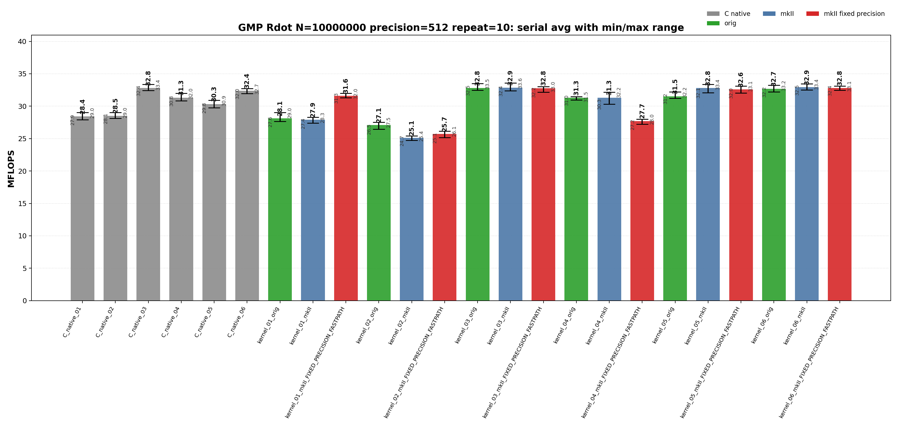
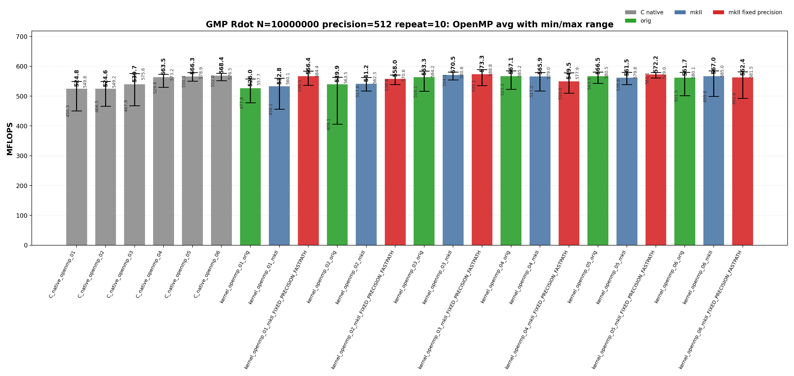
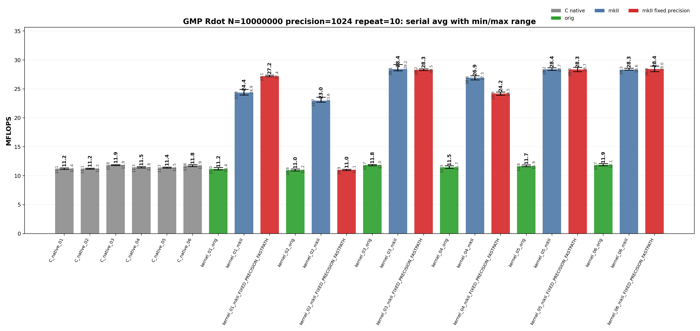
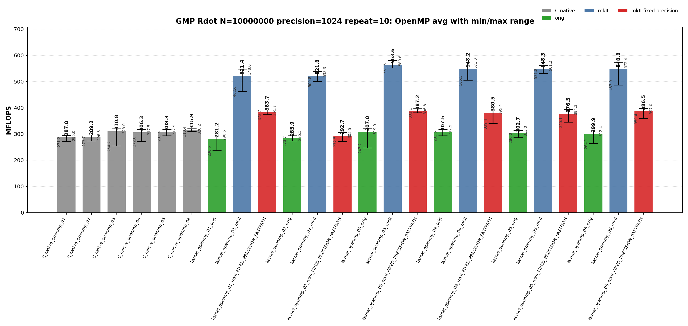

<!-- SPDX-License-Identifier: BSD-2-Clause -->

# 00_Rdot

This directory benchmarks the GMP real dot product

```text
sum_i x_i * y_i
```

with fixed-precision `mpf` data. It compares raw GMP C API kernels, upstream `gmpxx.h`, and `gmpxx_mkII`. The performance question is which source-level temporary policy determines the emitted hot loop and whether the mkII fixed-precision fastpath changes that class.

## Build

From the repository root:

```bash
cmake -S . -B build_bench_release -DCMAKE_BUILD_TYPE=Release
cmake --build build_bench_release -j
```

Executables are created under:

```text
build_bench_release/benchmarks/gmp/00_Rdot/
```

Each executable takes `<vector size> <precision>`. Example:

```bash
build_bench_release/benchmarks/gmp/00_Rdot/Rdot_gmp_kernel_03_mkII 10000000 512
```

The repeat runner is:

```bash
OMP_NUM_THREADS=32 OMP_PLACES=cores OMP_PROC_BIND=spread \
    benchmarks/gmp/00_Rdot/run_repeat.sh build_bench_release 10000000 512 10
```

Arguments are `<build dir> <vector size> <precision> <repeat count> [output dir]`.

The mkII fixed-precision variants use `GMPFRXX_MKII_FAST_FIXED_PREC`; executable suffixes keep the historical `FIXED_PRECISION_FASTPATH` label for benchmark continuity.

## Benchmark Parameters

| Parameter | Meaning |
| --- | --- |
| `N` | Number of vector elements. |
| `precision` | Requested GMP `mpf` precision in bits for inputs and accumulators. |
| `repeat` | Number of timed process executions per executable. |
| `OMP_NUM_THREADS` | OpenMP worker count for `openmp` executables. |
| `OMP_PLACES`, `OMP_PROC_BIND` | OpenMP affinity controls used by the runner. |

The committed runs use `N=10000000`, `repeat=10`, `precision=512` and `precision=1024`, with `OMP_NUM_THREADS=32`, `OMP_PLACES=cores`, and `OMP_PROC_BIND=spread`.

## Variant Shapes

The timed body is `_Rdot()`. The suffix numbers are aligned across raw C, upstream C++, mkII C++, serial, and OpenMP kernels.

| Variant | Timed source shape | Temporary/resource policy | Purpose |
| --- | --- | --- | --- |
| `01` | `acc += dx[i] * dy[i]` expression form. | Expression product is materialized inside the loop unless mkII fixed-precision scratch storage applies. | Stress expression-template materialization. |
| `02` | `mpf_class templ = dx[i] * dy[i]; acc += templ;` | Loop-local product object is constructed inside every iteration. | Intentionally expensive construction control. |
| `03` | `templ = dx[i] * dy[i]; acc += templ;` | One product object is initialized before the loop and reused. | Practical reusable-product baseline. |
| `04` | `templ = dx[i]; templ *= dy[i]; acc += templ;` | One product object is reused, but each iteration copies before multiplication. | Test copy-then-multiply source shape. |
| `05` | Four accumulators with one reused product object. | Four accumulators share one product temporary. | Test accumulator unrolling. |
| `06` | Four accumulators with four reused product objects. | Four accumulators and four product temporaries are reused. | Test unrolling plus independent product temporaries. |

Raw C kernels use `Rdot_gmp_C_native_NN` and `Rdot_gmp_C_native_openmp_NN`. Wrapper kernels use `Rdot_gmp_kernel_NN_orig`, `Rdot_gmp_kernel_NN_mkII`, `Rdot_gmp_kernel_NN_mkII_FIXED_PRECISION_FASTPATH`, and their `openmp` counterparts.

## C Native Equivalent Kernels

The C native executables are the reference hot-loop shapes for the C++ wrapper kernels. The mapping is based on the timed `_Rdot()` body, not on the post-run correctness reference.

| C native kernel | Equivalent C++ wrapper kernel(s) | Equivalence notes |
| --- | --- | --- |
| `C_native_01` | Closest to `kernel_02_*`; normal `kernel_01_*` may lower to this class. | Raw C initializes and clears a product `mpf_t` inside the loop. |
| `C_native_02` | Closest to `kernel_02_*` | Same loop-local product class as 01. |
| `C_native_03` | `kernel_03_*` | One product object is initialized before the loop and reused. |
| `C_native_04` | `kernel_04_*` | One product object is reused after copying `dx[i]`. |
| `C_native_05` | `kernel_05_*` | Four accumulators with one reused product object. |
| `C_native_06` | `kernel_06_*` | Four accumulators with four reused product objects. |
| `C_native_openmp_NN` | `kernel_openmp_NN_*` for the same `NN` | OpenMP variants follow the same source-shape numbering as serial kernels. |

`kernel_01_*` has no exact raw C source-level equivalent because it is the expression-template spelling. In a normal build it behaves like a loop-local product materialization path. In a fixed-precision fastpath build it can move into the reusable-scratch performance class, so disassembly should be used before treating it as equivalent to one raw C kernel.

## Recorded Run

### 512-bit run

| Field | Value |
|-------|-------|
| Run ID | `rdot_gmp_n10000000_p512_repeat10_20260524_231717` |
| Date | 2026-05-24 |
| CPU | AMD Ryzen Threadripper 3970X 32-Core Processor |
| OS | Linux 6.8.0-94-generic x86_64 |
| Compiler | `c++ (Ubuntu 15.2.0-16ubuntu1) 15.2.0` |
| Build type | Release |
| Problem size | `N=10000000` |
| Precision | 512 bits |
| Repeat count | 10 |
| OpenMP | `OMP_NUM_THREADS=32`, `OMP_PLACES=cores`, `OMP_PROC_BIND=spread` |
| Benchmark command | `OMP_NUM_THREADS=32 OMP_PLACES=cores OMP_PROC_BIND=spread benchmarks/gmp/00_Rdot/run_repeat.sh build_bench_release 10000000 512 10` |
| Raw result directory | `benchmarks/gmp/00_Rdot/results_raw/rdot_gmp_n10000000_p512_repeat10_20260524_231717/` |
| Raw log | `benchmarks/gmp/00_Rdot/results_raw/rdot_gmp_n10000000_p512_repeat10_20260524_231717/benchmark_rdot_gmp_n10000000_p512_repeat10.log` |
| Raw CSV | `benchmarks/gmp/00_Rdot/results_raw/rdot_gmp_n10000000_p512_repeat10_20260524_231717/raw_rdot_gmp_n10000000_p512_repeat10.csv` |
| Summary CSV | `benchmarks/gmp/00_Rdot/results_raw/rdot_gmp_n10000000_p512_repeat10_20260524_231717/summary_rdot_gmp_n10000000_p512_repeat10.csv` |
| Correctness | 480 / 480 runs reported `OK`. |





Plot regeneration command:

```bash
python3 benchmarks/gmp/00_Rdot/plot_repeat_summary.py \
    benchmarks/gmp/00_Rdot/results_raw/rdot_gmp_n10000000_p512_repeat10_20260524_231717/benchmark_rdot_gmp_n10000000_p512_repeat10.log \
    --output-dir benchmarks/gmp/00_Rdot/results_raw/rdot_gmp_n10000000_p512_repeat10_20260524_231717 \
    --output-prefix rdot_gmp_n10000000_p512_repeat10 \
    --title-prefix "GMP Rdot N=10000000 precision=512 repeat=10"
```

### 1024-bit run

| Field | Value |
|-------|-------|
| Run ID | `rdot_gmp_n10000000_p1024_repeat10_20260525_075314` |
| Date | 2026-05-25 |
| CPU | AMD Ryzen Threadripper 3970X 32-Core Processor |
| OS | Linux 6.8.0-94-generic x86_64 |
| Compiler | `c++ (Ubuntu 15.2.0-16ubuntu1) 15.2.0` |
| Build type | Release |
| Problem size | `N=10000000` |
| Precision | 1024 bits |
| Repeat count | 10 |
| OpenMP | `OMP_NUM_THREADS=32`, `OMP_PLACES=cores`, `OMP_PROC_BIND=spread` |
| Benchmark command | `OMP_NUM_THREADS=32 OMP_PLACES=cores OMP_PROC_BIND=spread benchmarks/gmp/00_Rdot/run_repeat.sh build_bench_release 10000000 1024 10` |
| Raw result directory | `benchmarks/gmp/00_Rdot/results_raw/rdot_gmp_n10000000_p1024_repeat10_20260525_075314/` |
| Raw log | `benchmarks/gmp/00_Rdot/results_raw/rdot_gmp_n10000000_p1024_repeat10_20260525_075314/benchmark_rdot_gmp_n10000000_p1024_repeat10.log` |
| Raw CSV | `benchmarks/gmp/00_Rdot/results_raw/rdot_gmp_n10000000_p1024_repeat10_20260525_075314/raw_rdot_gmp_n10000000_p1024_repeat10.csv` |
| Summary CSV | `benchmarks/gmp/00_Rdot/results_raw/rdot_gmp_n10000000_p1024_repeat10_20260525_075314/summary_rdot_gmp_n10000000_p1024_repeat10.csv` |
| Correctness | 480 / 480 runs reported `OK`. |





Plot regeneration command:

```bash
python3 benchmarks/gmp/00_Rdot/plot_repeat_summary.py \
    benchmarks/gmp/00_Rdot/results_raw/rdot_gmp_n10000000_p1024_repeat10_20260525_075314/benchmark_rdot_gmp_n10000000_p1024_repeat10.log \
    --output-dir benchmarks/gmp/00_Rdot/results_raw/rdot_gmp_n10000000_p1024_repeat10_20260525_075314 \
    --output-prefix rdot_gmp_n10000000_p1024_repeat10 \
    --title-prefix "GMP Rdot N=10000000 precision=1024 repeat=10"
```

## Resource or Bandwidth Estimates

The values below are static model estimates derived from benchmark MFLOPS, not hardware-counter measurements. The GMP model assumes 64-bit limbs, active limb bytes from `ceil(precision / 64)`, and a 24-byte `mpf_t` header. It counts two input objects per Rdot iteration and excludes allocator metadata, cache-line overfetch, accumulator writes, instruction fetch, and OpenMP reduction traffic.

| Case | Representative best-avg variant | Avg MFLOPS | Active bytes/iter | Header-inclusive bytes/iter | Active GB/s | Header-inclusive GB/s |
| --- | --- | --- | --- | --- | --- | --- |
| 512-bit serial | `kernel_06_mkII` | 32.941 | 128 | 176 | 2.108 | 2.899 |
| 512-bit openmp | `kernel_openmp_03_mkII_FIXED_PRECISION_FASTPATH` | 573.316 | 128 | 176 | 36.692 | 50.452 |
| 1024-bit serial | `kernel_06_mkII_FIXED_PRECISION_FASTPATH` | 28.439 | 256 | 304 | 3.640 | 4.323 |
| 1024-bit openmp | `kernel_openmp_03_mkII` | 563.553 | 256 | 304 | 72.135 | 85.660 |

The 1024-bit GMP rows use the best-average variants from the generated summary. Because those best entries are mkII targets with the precision-audit caveat noted below, treat their bandwidth estimates as model values for the recorded benchmark output, not validated 1024-bit memory-traffic evidence.

## Headline Results

| Observation | Variant | Max MFLOPS | Avg MFLOPS | Interpretation |
| --- | --- | --- | --- | --- |
| 512-bit serial best average | `kernel_06_mkII` | 33.435 | 32.941 | mkII wrapper target for the numbered source shape. |
| 512-bit openmp best average | `kernel_openmp_03_mkII_FIXED_PRECISION_FASTPATH` | 588.794 | 573.316 | mkII fixed-precision fastpath; expression scratch reuse can remove repeated temporary setup. |
| 1024-bit serial best average | `kernel_06_mkII_FIXED_PRECISION_FASTPATH` | 28.951 | 28.439 | mkII fixed-precision target; this run is precision-suspicious because throughput stays near the 512-bit class. |
| 1024-bit openmp best average | `kernel_openmp_03_mkII` | 580.838 | 563.553 | mkII wrapper target; this run is precision-suspicious because throughput does not drop like raw C/upstream at 1024 bits. |
| 1024-bit mkII precision audit | `kernel_*_mkII*` | - | - | mkII 1024-bit results stay near 512-bit throughput while raw C/upstream drop as expected; audit precision handling before interpreting mkII 1024-bit speedups. |

## Serial Results

### 512-bit serial interpretation

| Observation | Variant | Max MFLOPS | Avg MFLOPS | Min MFLOPS | Interpretation |
| --- | --- | --- | --- | --- | --- |
| Best raw C serial avg | `C_native_03` | 33.353 | 32.804 | 32.435 | Reusable-product raw C class. |
| Best upstream serial avg | `kernel_03_orig` | 33.493 | 32.801 | 32.472 | Upstream wrapper reaches the raw reusable class. |
| Best mkII serial avg | `kernel_06_mkII` | 33.435 | 32.941 | 32.521 | mkII top serial class for this precision. |
| Best serial max | `kernel_03_mkII` | 33.581 | 32.852 | 32.392 | Single fastest repeat; use avg for stable ranking. |

<details>
<summary>512-bit serial results sorted by Max MFLOPS</summary>

| Rank | Variant | Max MFLOPS | Avg MFLOPS | Min MFLOPS |
| --- | --- | --- | --- | --- |
| 1 | `kernel_03_mkII` | 33.581 | 32.852 | 32.392 |
| 2 | `kernel_03_orig` | 33.493 | 32.801 | 32.472 |
| 3 | `kernel_06_mkII` | 33.435 | 32.941 | 32.521 |
| 4 | `kernel_05_mkII` | 33.381 | 32.795 | 32.090 |
| 5 | `C_native_03` | 33.353 | 32.804 | 32.435 |
| 6 | `kernel_06_orig` | 33.225 | 32.692 | 32.209 |
| 7 | `kernel_05_mkII_FIXED_PRECISION_FASTPATH` | 33.110 | 32.595 | 32.044 |
| 8 | `kernel_06_mkII_FIXED_PRECISION_FASTPATH` | 33.109 | 32.796 | 32.444 |
| 9 | `kernel_03_mkII_FIXED_PRECISION_FASTPATH` | 33.026 | 32.786 | 32.180 |
| 10 | `C_native_06` | 32.705 | 32.369 | 31.953 |
| 11 | `kernel_05_orig` | 32.200 | 31.511 | 31.199 |
| 12 | `kernel_04_mkII` | 32.170 | 31.313 | 30.316 |
| 13 | `C_native_04` | 31.993 | 31.321 | 30.831 |
| 14 | `kernel_01_mkII_FIXED_PRECISION_FASTPATH` | 31.974 | 31.590 | 31.299 |
| 15 | `kernel_04_orig` | 31.494 | 31.299 | 30.952 |
| 16 | `C_native_05` | 30.905 | 30.330 | 29.759 |
| 17 | `C_native_02` | 29.042 | 28.530 | 28.141 |
| 18 | `C_native_01` | 29.018 | 28.420 | 27.928 |
| 19 | `kernel_01_orig` | 29.009 | 28.120 | 27.642 |
| 20 | `kernel_01_mkII` | 28.282 | 27.911 | 27.384 |
| 21 | `kernel_04_mkII_FIXED_PRECISION_FASTPATH` | 27.998 | 27.710 | 27.204 |
| 22 | `kernel_02_orig` | 27.530 | 27.085 | 26.466 |
| 23 | `kernel_02_mkII_FIXED_PRECISION_FASTPATH` | 26.150 | 25.707 | 25.148 |
| 24 | `kernel_02_mkII` | 25.427 | 25.106 | 24.729 |

</details>

<details>
<summary>512-bit serial results sorted by Avg MFLOPS</summary>

| Rank | Variant | Max MFLOPS | Avg MFLOPS | Min MFLOPS |
| --- | --- | --- | --- | --- |
| 1 | `kernel_06_mkII` | 33.435 | 32.941 | 32.521 |
| 2 | `kernel_03_mkII` | 33.581 | 32.852 | 32.392 |
| 3 | `C_native_03` | 33.353 | 32.804 | 32.435 |
| 4 | `kernel_03_orig` | 33.493 | 32.801 | 32.472 |
| 5 | `kernel_06_mkII_FIXED_PRECISION_FASTPATH` | 33.109 | 32.796 | 32.444 |
| 6 | `kernel_05_mkII` | 33.381 | 32.795 | 32.090 |
| 7 | `kernel_03_mkII_FIXED_PRECISION_FASTPATH` | 33.026 | 32.786 | 32.180 |
| 8 | `kernel_06_orig` | 33.225 | 32.692 | 32.209 |
| 9 | `kernel_05_mkII_FIXED_PRECISION_FASTPATH` | 33.110 | 32.595 | 32.044 |
| 10 | `C_native_06` | 32.705 | 32.369 | 31.953 |
| 11 | `kernel_01_mkII_FIXED_PRECISION_FASTPATH` | 31.974 | 31.590 | 31.299 |
| 12 | `kernel_05_orig` | 32.200 | 31.511 | 31.199 |
| 13 | `C_native_04` | 31.993 | 31.321 | 30.831 |
| 14 | `kernel_04_mkII` | 32.170 | 31.313 | 30.316 |
| 15 | `kernel_04_orig` | 31.494 | 31.299 | 30.952 |
| 16 | `C_native_05` | 30.905 | 30.330 | 29.759 |
| 17 | `C_native_02` | 29.042 | 28.530 | 28.141 |
| 18 | `C_native_01` | 29.018 | 28.420 | 27.928 |
| 19 | `kernel_01_orig` | 29.009 | 28.120 | 27.642 |
| 20 | `kernel_01_mkII` | 28.282 | 27.911 | 27.384 |
| 21 | `kernel_04_mkII_FIXED_PRECISION_FASTPATH` | 27.998 | 27.710 | 27.204 |
| 22 | `kernel_02_orig` | 27.530 | 27.085 | 26.466 |
| 23 | `kernel_02_mkII_FIXED_PRECISION_FASTPATH` | 26.150 | 25.707 | 25.148 |
| 24 | `kernel_02_mkII` | 25.427 | 25.106 | 24.729 |

</details>

### 1024-bit serial interpretation

| Observation | Variant | Max MFLOPS | Avg MFLOPS | Min MFLOPS | Interpretation |
| --- | --- | --- | --- | --- | --- |
| Best raw C serial avg | `C_native_03` | 11.923 | 11.858 | 11.758 | Reusable-product raw C class. |
| Best upstream serial avg | `kernel_06_orig` | 12.095 | 11.864 | 11.733 | Upstream wrapper reaches the raw reusable class. |
| Best mkII serial avg | `kernel_06_mkII_FIXED_PRECISION_FASTPATH` | 28.951 | 28.439 | 27.998 | mkII top serial class for this precision. |
| Best serial max | `kernel_03_mkII` | 29.220 | 28.433 | 28.123 | Single fastest repeat; use avg for stable ranking. |
| Precision audit note | `kernel_*_mkII*` | - | - | - | mkII 1024-bit throughput remains close to 512-bit while raw C/upstream drops to about 12 MFLOPS; do not treat this as a valid backend speedup until precision handling is audited. |

<details>
<summary>1024-bit serial results sorted by Max MFLOPS</summary>

| Rank | Variant | Max MFLOPS | Avg MFLOPS | Min MFLOPS |
| --- | --- | --- | --- | --- |
| 1 | `kernel_03_mkII` | 29.220 | 28.433 | 28.123 |
| 2 | `kernel_06_mkII_FIXED_PRECISION_FASTPATH` | 28.951 | 28.439 | 27.998 |
| 3 | `kernel_05_mkII_FIXED_PRECISION_FASTPATH` | 28.736 | 28.344 | 27.984 |
| 4 | `kernel_05_mkII` | 28.654 | 28.386 | 28.225 |
| 5 | `kernel_06_mkII` | 28.574 | 28.341 | 28.262 |
| 6 | `kernel_03_mkII_FIXED_PRECISION_FASTPATH` | 28.481 | 28.324 | 28.177 |
| 7 | `kernel_01_mkII_FIXED_PRECISION_FASTPATH` | 27.387 | 27.219 | 27.130 |
| 8 | `kernel_04_mkII` | 27.270 | 26.934 | 26.568 |
| 9 | `kernel_01_mkII` | 24.932 | 24.353 | 23.949 |
| 10 | `kernel_04_mkII_FIXED_PRECISION_FASTPATH` | 24.467 | 24.200 | 23.929 |
| 11 | `kernel_02_mkII` | 23.592 | 22.993 | 22.711 |
| 12 | `kernel_06_orig` | 12.095 | 11.864 | 11.733 |
| 13 | `kernel_03_orig` | 11.956 | 11.835 | 11.739 |
| 14 | `C_native_03` | 11.923 | 11.858 | 11.758 |
| 15 | `C_native_06` | 11.903 | 11.751 | 11.579 |
| 16 | `kernel_05_orig` | 11.878 | 11.665 | 11.571 |
| 17 | `kernel_04_orig` | 11.743 | 11.468 | 11.262 |
| 18 | `C_native_04` | 11.576 | 11.453 | 11.343 |
| 19 | `C_native_05` | 11.499 | 11.416 | 11.312 |
| 20 | `kernel_01_orig` | 11.421 | 11.170 | 11.031 |
| 21 | `C_native_01` | 11.363 | 11.247 | 11.103 |
| 22 | `C_native_02` | 11.321 | 11.235 | 11.129 |
| 23 | `kernel_02_orig` | 11.168 | 10.975 | 10.836 |
| 24 | `kernel_02_mkII_FIXED_PRECISION_FASTPATH` | 11.143 | 11.023 | 10.905 |

</details>

<details>
<summary>1024-bit serial results sorted by Avg MFLOPS</summary>

| Rank | Variant | Max MFLOPS | Avg MFLOPS | Min MFLOPS |
| --- | --- | --- | --- | --- |
| 1 | `kernel_06_mkII_FIXED_PRECISION_FASTPATH` | 28.951 | 28.439 | 27.998 |
| 2 | `kernel_03_mkII` | 29.220 | 28.433 | 28.123 |
| 3 | `kernel_05_mkII` | 28.654 | 28.386 | 28.225 |
| 4 | `kernel_05_mkII_FIXED_PRECISION_FASTPATH` | 28.736 | 28.344 | 27.984 |
| 5 | `kernel_06_mkII` | 28.574 | 28.341 | 28.262 |
| 6 | `kernel_03_mkII_FIXED_PRECISION_FASTPATH` | 28.481 | 28.324 | 28.177 |
| 7 | `kernel_01_mkII_FIXED_PRECISION_FASTPATH` | 27.387 | 27.219 | 27.130 |
| 8 | `kernel_04_mkII` | 27.270 | 26.934 | 26.568 |
| 9 | `kernel_01_mkII` | 24.932 | 24.353 | 23.949 |
| 10 | `kernel_04_mkII_FIXED_PRECISION_FASTPATH` | 24.467 | 24.200 | 23.929 |
| 11 | `kernel_02_mkII` | 23.592 | 22.993 | 22.711 |
| 12 | `kernel_06_orig` | 12.095 | 11.864 | 11.733 |
| 13 | `C_native_03` | 11.923 | 11.858 | 11.758 |
| 14 | `kernel_03_orig` | 11.956 | 11.835 | 11.739 |
| 15 | `C_native_06` | 11.903 | 11.751 | 11.579 |
| 16 | `kernel_05_orig` | 11.878 | 11.665 | 11.571 |
| 17 | `kernel_04_orig` | 11.743 | 11.468 | 11.262 |
| 18 | `C_native_04` | 11.576 | 11.453 | 11.343 |
| 19 | `C_native_05` | 11.499 | 11.416 | 11.312 |
| 20 | `C_native_01` | 11.363 | 11.247 | 11.103 |
| 21 | `C_native_02` | 11.321 | 11.235 | 11.129 |
| 22 | `kernel_01_orig` | 11.421 | 11.170 | 11.031 |
| 23 | `kernel_02_mkII_FIXED_PRECISION_FASTPATH` | 11.143 | 11.023 | 10.905 |
| 24 | `kernel_02_orig` | 11.168 | 10.975 | 10.836 |

</details>

## OpenMP Results

### 512-bit OpenMP interpretation

| Observation | Variant | Max MFLOPS | Avg MFLOPS | Min MFLOPS | Interpretation |
| --- | --- | --- | --- | --- | --- |
| Best raw C OpenMP avg | `C_native_openmp_06` | 576.543 | 568.425 | 552.017 | Raw C per-thread reusable/unrolled class. |
| Best upstream OpenMP avg | `kernel_openmp_04_orig` | 585.153 | 567.103 | 523.270 | Upstream wrapper OpenMP reference class. |
| Best mkII OpenMP avg | `kernel_openmp_03_mkII_FIXED_PRECISION_FASTPATH` | 588.794 | 573.316 | 535.067 | mkII top OpenMP class for this precision. |
| Best OpenMP max | `kernel_openmp_03_mkII_FIXED_PRECISION_FASTPATH` | 588.794 | 573.316 | 535.067 | Single fastest OpenMP repeat; sensitive to run-to-run variance. |

<details>
<summary>512-bit OpenMP results sorted by Max MFLOPS</summary>

| Rank | Variant | Max MFLOPS | Avg MFLOPS | Min MFLOPS |
| --- | --- | --- | --- | --- |
| 1 | `kernel_openmp_03_mkII_FIXED_PRECISION_FASTPATH` | 588.794 | 573.316 | 535.067 |
| 2 | `kernel_openmp_04_orig` | 585.153 | 567.103 | 523.270 |
| 3 | `kernel_openmp_06_mkII` | 585.049 | 566.974 | 499.583 |
| 4 | `kernel_openmp_01_mkII_FIXED_PRECISION_FASTPATH` | 584.374 | 566.380 | 536.537 |
| 5 | `kernel_openmp_03_orig` | 584.199 | 563.321 | 516.108 |
| 6 | `kernel_openmp_06_mkII_FIXED_PRECISION_FASTPATH` | 581.524 | 562.421 | 492.797 |
| 7 | `kernel_openmp_03_mkII` | 580.613 | 570.533 | 554.094 |
| 8 | `kernel_openmp_05_orig` | 580.520 | 566.513 | 543.254 |
| 9 | `kernel_openmp_06_orig` | 580.128 | 561.665 | 501.513 |
| 10 | `kernel_openmp_05_mkII` | 579.797 | 561.463 | 538.595 |
| 11 | `kernel_openmp_04_mkII` | 578.986 | 565.935 | 517.154 |
| 12 | `kernel_openmp_05_mkII_FIXED_PRECISION_FASTPATH` | 578.957 | 572.180 | 561.144 |
| 13 | `C_native_openmp_05` | 578.854 | 566.317 | 550.253 |
| 14 | `kernel_openmp_04_mkII_FIXED_PRECISION_FASTPATH` | 577.921 | 549.494 | 509.985 |
| 15 | `C_native_openmp_06` | 576.543 | 568.425 | 552.017 |
| 16 | `C_native_openmp_03` | 575.637 | 539.742 | 467.928 |
| 17 | `C_native_openmp_04` | 573.176 | 563.499 | 529.787 |
| 18 | `kernel_openmp_02_mkII_FIXED_PRECISION_FASTPATH` | 570.568 | 557.955 | 538.559 |
| 19 | `kernel_openmp_02_orig` | 563.550 | 539.929 | 406.078 |
| 20 | `kernel_openmp_02_mkII` | 562.278 | 541.181 | 517.576 |
| 21 | `kernel_openmp_01_mkII` | 560.092 | 532.824 | 456.125 |
| 22 | `kernel_openmp_01_orig` | 557.672 | 526.008 | 477.793 |
| 23 | `C_native_openmp_01` | 549.813 | 524.795 | 450.305 |
| 24 | `C_native_openmp_02` | 549.153 | 524.582 | 466.494 |

</details>

<details>
<summary>512-bit OpenMP results sorted by Avg MFLOPS</summary>

| Rank | Variant | Max MFLOPS | Avg MFLOPS | Min MFLOPS |
| --- | --- | --- | --- | --- |
| 1 | `kernel_openmp_03_mkII_FIXED_PRECISION_FASTPATH` | 588.794 | 573.316 | 535.067 |
| 2 | `kernel_openmp_05_mkII_FIXED_PRECISION_FASTPATH` | 578.957 | 572.180 | 561.144 |
| 3 | `kernel_openmp_03_mkII` | 580.613 | 570.533 | 554.094 |
| 4 | `C_native_openmp_06` | 576.543 | 568.425 | 552.017 |
| 5 | `kernel_openmp_04_orig` | 585.153 | 567.103 | 523.270 |
| 6 | `kernel_openmp_06_mkII` | 585.049 | 566.974 | 499.583 |
| 7 | `kernel_openmp_05_orig` | 580.520 | 566.513 | 543.254 |
| 8 | `kernel_openmp_01_mkII_FIXED_PRECISION_FASTPATH` | 584.374 | 566.380 | 536.537 |
| 9 | `C_native_openmp_05` | 578.854 | 566.317 | 550.253 |
| 10 | `kernel_openmp_04_mkII` | 578.986 | 565.935 | 517.154 |
| 11 | `C_native_openmp_04` | 573.176 | 563.499 | 529.787 |
| 12 | `kernel_openmp_03_orig` | 584.199 | 563.321 | 516.108 |
| 13 | `kernel_openmp_06_mkII_FIXED_PRECISION_FASTPATH` | 581.524 | 562.421 | 492.797 |
| 14 | `kernel_openmp_06_orig` | 580.128 | 561.665 | 501.513 |
| 15 | `kernel_openmp_05_mkII` | 579.797 | 561.463 | 538.595 |
| 16 | `kernel_openmp_02_mkII_FIXED_PRECISION_FASTPATH` | 570.568 | 557.955 | 538.559 |
| 17 | `kernel_openmp_04_mkII_FIXED_PRECISION_FASTPATH` | 577.921 | 549.494 | 509.985 |
| 18 | `kernel_openmp_02_mkII` | 562.278 | 541.181 | 517.576 |
| 19 | `kernel_openmp_02_orig` | 563.550 | 539.929 | 406.078 |
| 20 | `C_native_openmp_03` | 575.637 | 539.742 | 467.928 |
| 21 | `kernel_openmp_01_mkII` | 560.092 | 532.824 | 456.125 |
| 22 | `kernel_openmp_01_orig` | 557.672 | 526.008 | 477.793 |
| 23 | `C_native_openmp_01` | 549.813 | 524.795 | 450.305 |
| 24 | `C_native_openmp_02` | 549.153 | 524.582 | 466.494 |

</details>

### 1024-bit OpenMP interpretation

| Observation | Variant | Max MFLOPS | Avg MFLOPS | Min MFLOPS | Interpretation |
| --- | --- | --- | --- | --- | --- |
| Best raw C OpenMP avg | `C_native_openmp_06` | 320.237 | 315.896 | 310.435 | Raw C per-thread reusable/unrolled class. |
| Best upstream OpenMP avg | `kernel_openmp_04_orig` | 317.467 | 307.535 | 293.531 | Upstream wrapper OpenMP reference class. |
| Best mkII OpenMP avg | `kernel_openmp_03_mkII` | 580.838 | 563.553 | 551.584 | mkII top OpenMP class for this precision. |
| Best OpenMP max | `kernel_openmp_03_mkII` | 580.838 | 563.553 | 551.584 | Single fastest OpenMP repeat; sensitive to run-to-run variance. |
| Precision audit note | `kernel_openmp_*_mkII*` | - | - | - | mkII 1024-bit OpenMP remains near the 512-bit class while raw C/upstream are around 300 MFLOPS; this is likely a benchmark or precision-policy issue. |

<details>
<summary>1024-bit OpenMP results sorted by Max MFLOPS</summary>

| Rank | Variant | Max MFLOPS | Avg MFLOPS | Min MFLOPS |
| --- | --- | --- | --- | --- |
| 1 | `kernel_openmp_03_mkII` | 580.838 | 563.553 | 551.584 |
| 2 | `kernel_openmp_06_mkII` | 572.394 | 548.797 | 486.990 |
| 3 | `kernel_openmp_04_mkII` | 570.953 | 548.165 | 505.486 |
| 4 | `kernel_openmp_05_mkII` | 561.185 | 548.326 | 531.824 |
| 5 | `kernel_openmp_01_mkII` | 547.981 | 521.377 | 462.573 |
| 6 | `kernel_openmp_02_mkII` | 538.331 | 521.769 | 500.799 |
| 7 | `kernel_openmp_06_mkII_FIXED_PRECISION_FASTPATH` | 397.039 | 386.520 | 359.397 |
| 8 | `kernel_openmp_03_mkII_FIXED_PRECISION_FASTPATH` | 396.836 | 387.175 | 381.112 |
| 9 | `kernel_openmp_04_mkII_FIXED_PRECISION_FASTPATH` | 395.400 | 380.482 | 339.356 |
| 10 | `kernel_openmp_05_mkII_FIXED_PRECISION_FASTPATH` | 394.267 | 376.532 | 345.147 |
| 11 | `kernel_openmp_01_mkII_FIXED_PRECISION_FASTPATH` | 391.734 | 383.717 | 373.706 |
| 12 | `C_native_openmp_03` | 322.965 | 310.765 | 254.209 |
| 13 | `C_native_openmp_06` | 320.237 | 315.896 | 310.435 |
| 14 | `kernel_openmp_03_orig` | 319.946 | 306.950 | 247.212 |
| 15 | `C_native_openmp_05` | 317.867 | 308.290 | 293.405 |
| 16 | `C_native_openmp_04` | 317.487 | 306.340 | 272.021 |
| 17 | `kernel_openmp_04_orig` | 317.467 | 307.535 | 293.531 |
| 18 | `kernel_openmp_05_orig` | 312.986 | 302.706 | 286.015 |
| 19 | `kernel_openmp_06_orig` | 312.418 | 299.895 | 264.144 |
| 20 | `kernel_openmp_02_mkII_FIXED_PRECISION_FASTPATH` | 305.509 | 292.727 | 272.483 |
| 21 | `C_native_openmp_02` | 296.842 | 289.207 | 273.738 |
| 22 | `kernel_openmp_01_orig` | 296.550 | 281.231 | 236.643 |
| 23 | `kernel_openmp_02_orig` | 295.503 | 285.894 | 273.725 |
| 24 | `C_native_openmp_01` | 295.044 | 287.828 | 271.222 |

</details>

<details>
<summary>1024-bit OpenMP results sorted by Avg MFLOPS</summary>

| Rank | Variant | Max MFLOPS | Avg MFLOPS | Min MFLOPS |
| --- | --- | --- | --- | --- |
| 1 | `kernel_openmp_03_mkII` | 580.838 | 563.553 | 551.584 |
| 2 | `kernel_openmp_06_mkII` | 572.394 | 548.797 | 486.990 |
| 3 | `kernel_openmp_05_mkII` | 561.185 | 548.326 | 531.824 |
| 4 | `kernel_openmp_04_mkII` | 570.953 | 548.165 | 505.486 |
| 5 | `kernel_openmp_02_mkII` | 538.331 | 521.769 | 500.799 |
| 6 | `kernel_openmp_01_mkII` | 547.981 | 521.377 | 462.573 |
| 7 | `kernel_openmp_03_mkII_FIXED_PRECISION_FASTPATH` | 396.836 | 387.175 | 381.112 |
| 8 | `kernel_openmp_06_mkII_FIXED_PRECISION_FASTPATH` | 397.039 | 386.520 | 359.397 |
| 9 | `kernel_openmp_01_mkII_FIXED_PRECISION_FASTPATH` | 391.734 | 383.717 | 373.706 |
| 10 | `kernel_openmp_04_mkII_FIXED_PRECISION_FASTPATH` | 395.400 | 380.482 | 339.356 |
| 11 | `kernel_openmp_05_mkII_FIXED_PRECISION_FASTPATH` | 394.267 | 376.532 | 345.147 |
| 12 | `C_native_openmp_06` | 320.237 | 315.896 | 310.435 |
| 13 | `C_native_openmp_03` | 322.965 | 310.765 | 254.209 |
| 14 | `C_native_openmp_05` | 317.867 | 308.290 | 293.405 |
| 15 | `kernel_openmp_04_orig` | 317.467 | 307.535 | 293.531 |
| 16 | `kernel_openmp_03_orig` | 319.946 | 306.950 | 247.212 |
| 17 | `C_native_openmp_04` | 317.487 | 306.340 | 272.021 |
| 18 | `kernel_openmp_05_orig` | 312.986 | 302.706 | 286.015 |
| 19 | `kernel_openmp_06_orig` | 312.418 | 299.895 | 264.144 |
| 20 | `kernel_openmp_02_mkII_FIXED_PRECISION_FASTPATH` | 305.509 | 292.727 | 272.483 |
| 21 | `C_native_openmp_02` | 296.842 | 289.207 | 273.738 |
| 22 | `C_native_openmp_01` | 295.044 | 287.828 | 271.222 |
| 23 | `kernel_openmp_02_orig` | 295.503 | 285.894 | 273.725 |
| 24 | `kernel_openmp_01_orig` | 296.550 | 281.231 | 236.643 |

</details>

## Hotpath Disassembly

The representative disassembly checks are unchanged by this result refresh because the kernel sources did not change during the repeat-10 run. Regenerate snippets with:

```bash
objdump -Cd --no-show-raw-insn build_bench_release/benchmarks/gmp/00_Rdot/Rdot_gmp_C_native_03
objdump -Cd --no-show-raw-insn build_bench_release/benchmarks/gmp/00_Rdot/Rdot_gmp_kernel_03_orig
objdump -Cd --no-show-raw-insn build_bench_release/benchmarks/gmp/00_Rdot/Rdot_gmp_kernel_03_mkII
objdump -Cd --no-show-raw-insn build_bench_release/benchmarks/gmp/00_Rdot/Rdot_gmp_kernel_openmp_03_mkII_FIXED_PRECISION_FASTPATH
```

| Kernel class | Expected hot-loop check |
| --- | --- |
| Loop-local temporary | `mpf_init2` / `mpf_clear` or equivalent object construction appears in the timed loop. |
| Reusable product | One `mpf_mul` and one `mpf_add` per element; product object lifetime is outside the timed loop. |
| Unrolled reusable product | Four independent accumulators do not remove the backend multiply/add cost; they mainly change dependency shape. |
| mkII fixed precision | Expression-form scratch reuse should remove repeated precision setup when the destination precision is fixed. |
| OpenMP worker loop | Per-thread accumulation happens inside the worker loop; final reduction is outside the worker hot path. |

The 1024-bit run adds a precision-audit requirement: raw C and upstream wrappers form the expected lower-throughput 1024-bit class, while mkII results remain close to the 512-bit class. Disassembly alone is not enough to validate those mkII numbers; inspect the precision of generated input objects, expression materialization, and accumulator temporaries before using them as performance evidence.

## Lessons Learned

- At 512 bits, the main GMP Rdot boundary is temporary lifetime: reusable product objects and fixed-precision scratch paths reach the top serial and OpenMP classes.
- Four-way unrolling does not create a fundamentally new serial class; variants `03`, `05`, and `06` cluster closely when temporaries are reused.
- OpenMP results should be interpreted by performance class and average MFLOPS, not by a single fastest repeat.
- The 1024-bit raw C/upstream data drop to the expected lower class, but mkII does not. Treat the mkII 1024-bit results as a correctness/precision audit trigger rather than a real speedup claim.
- The next GMP Rdot step should verify requested/effective `mpf` precision in mkII benchmark inputs and temporaries before comparing 1024-bit performance.
