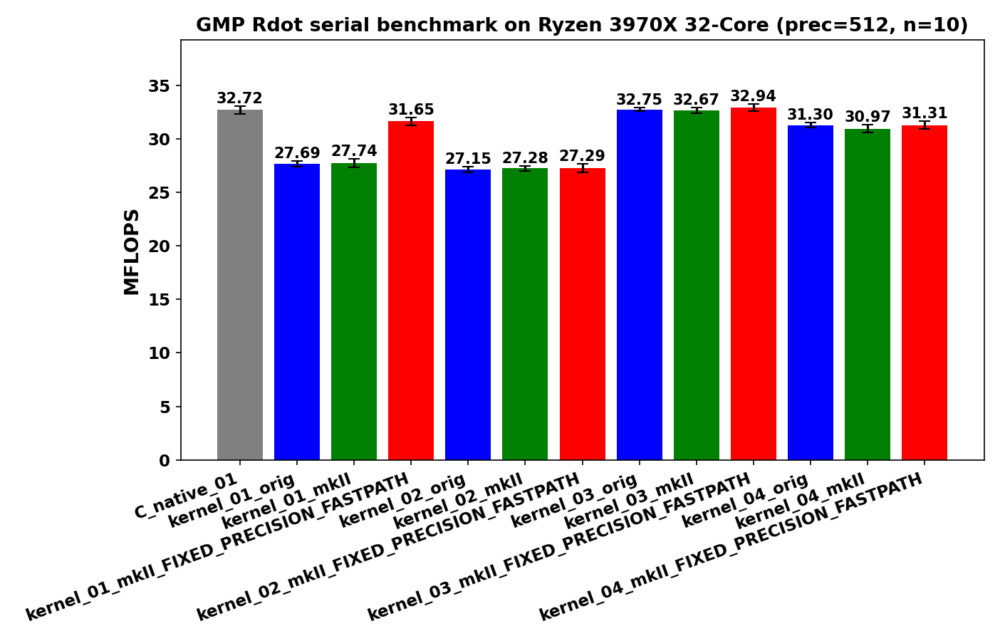
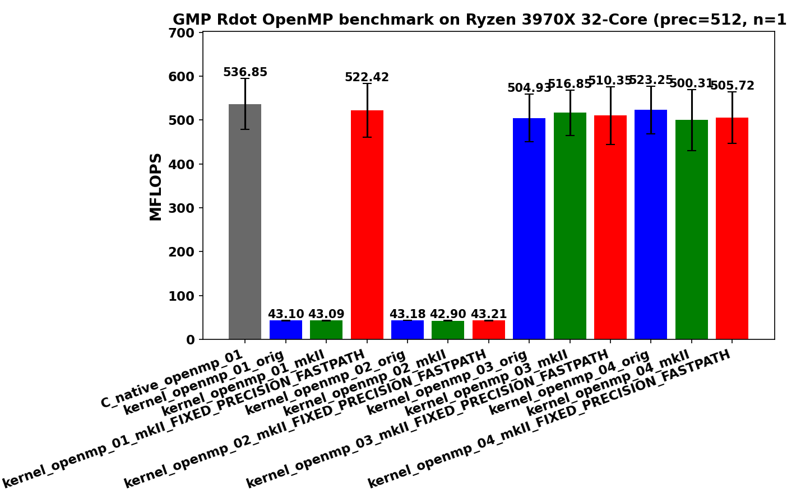

<!-- SPDX-License-Identifier: BSD-2-Clause -->

# 00_Rdot

This directory benchmarks the GMP real dot product

```text
sum_i x_i * y_i
```

with random `mpf` data at a fixed precision.  It compares raw `mpf_t`,
upstream `gmpxx.h`, and `gmpxx_mkII`.

## Build

From the repository root:

```bash
cmake -S . -B build_bench_release -DCMAKE_BUILD_TYPE=Release
cmake --build build_bench_release -j
```

The executables are created under:

```text
build_bench_release/benchmarks/gmp/00_Rdot/
```

## Run

Run the whole benchmark set through the top-level runner:

```bash
benchmarks/common/run_benchmarks.sh build_bench_release 512
```

For a quick Rdot-sized smoke run, pass smaller dimensions:

```bash
benchmarks/common/run_benchmarks.sh build_bench_release 128 1000 1000 32 32 16 16 16 \
    benchmarks/gmp/results-smoke
```

The first vector-size argument is used for Rdot.  Individual executables take:

```text
<vector size> <precision>
```

Example:

```bash
build_bench_release/benchmarks/gmp/00_Rdot/Rdot_gmp_kernel_01_mkII 1000000 512
```

## Reading Results

Each executable prints `Elapsed time` and `MFLOPS`.  Higher MFLOPS is better
when comparing runs with the same vector size, precision, compiler flags, and
machine.

Rdot executables also print a timed-kernel allocator profile:

```text
BENCH_ALLOC_COUNTS label=timed_kernel alloc=... realloc=... free=... alloc_bytes=... realloc_old_bytes=... realloc_new_bytes=... free_bytes=...
```

These counts come from GMP's allocator callback API and measure actual heap
traffic during the timed dot-product body.  They are deliberately separate from
the optional init/clear operation counters enabled by
`-DGMPFRXX_MKII_BENCHMARK_COUNT_MPF_OPERATIONS=ON`.

Variant names:

- `C_native`: raw `mpf_t` implementation.
- `C_native_openmp`: raw `mpf_t` implementation with OpenMP.
- `*_orig`: upstream `gmpxx.h`.
- `*_mkII`: this header with the default precision policy.
- `*_openmp_*`: OpenMP variant where the eager benchmark provided one.

## Recorded Repeat-10 Sample





The current committed sample run uses:

```text
N = 10000000, precision = 512, repeat = 10, OMP_NUM_THREADS = 32
```

Results are stored in
[../results_raw/rdot_n1e7_openmp_01_04_20260513/](../results_raw/rdot_n1e7_openmp_01_04_20260513/):

- [Raw log](../results_raw/rdot_n1e7_openmp_01_04_20260513/benchmark_rdot_n1e7_512_openmp_01_04_repeat10.log)
- [Summary CSV](../results_raw/rdot_n1e7_openmp_01_04_20260513/summary_rdot_n1e7_512_openmp_01_04_repeat10.csv)
- [Serial plot](../results_raw/rdot_n1e7_openmp_01_04_20260513/benchmark_rdot_n1e7_512_openmp_01_04_repeat10_Linux_Ryzen_3970X_32-Core_serial_Rdot.png)
- [Serial summary plot](../results_raw/rdot_n1e7_openmp_01_04_20260513/benchmark_rdot_n1e7_512_openmp_01_04_repeat10_Linux_Ryzen_3970X_32-Core_serial_summary.png)
- [OpenMP plot](../results_raw/rdot_n1e7_openmp_01_04_20260513/benchmark_rdot_n1e7_512_openmp_01_04_repeat10_Linux_Ryzen_3970X_32-Core_openmp_Rdot.png)
- [OpenMP summary plot](../results_raw/rdot_n1e7_openmp_01_04_20260513/benchmark_rdot_n1e7_512_openmp_01_04_repeat10_Linux_Ryzen_3970X_32-Core_openmp_summary.png)

All 26 Rdot variants in that run report `OK` in all 10 runs.

For serial comparison, `kernel_03` is the strongest wrapper family because it
uses a reusable product object and keeps product initialization outside the
loop.  `kernel_01` and `kernel_02` allocate one product object per element and
therefore remain well below C native.  `kernel_01_mkII_FIXED_PRECISION_FASTPATH`
removes that per-element allocation and returns close to the C native serial
baseline.

For OpenMP comparison, the current 01/02/03/04 split makes the source-shape
effect explicit.  `kernel_openmp_01` and `kernel_openmp_02` still allocate per
element and only reach about 43 MFLOPS despite 32 threads.  `kernel_openmp_03`
and `kernel_openmp_04` reuse one product object per thread, reduce timed-kernel
allocations to thread count scale, and run in the same range as raw C native
OpenMP.  The full executable wall time improves much less than the timed
kernel because each run allocates and initializes two 10000000-element vectors
before timing `_Rdot()`.

## Kernel Shapes

The timed body is `_Rdot()` in each benchmark executable.  The `Rdot()` helper
in `Rdot.hpp` is the post-run correctness reference; it uses a five-term
unrolled expression and should not be mixed with the timed-kernel disassembly.

| Variant | Timed source shape | Temporary policy | Hotpath meaning |
|---------|--------------------|------------------|-----------------|
| `C_native_01` | `mpf_mul(templ, dx[i], dy[i]); mpf_add(temp, temp, templ);` | `temp` and `templ` are initialized once outside the loop. | Baseline: one `mpf_mul` and one `mpf_add` per element, no per-iteration `mpf_init` / `mpf_clear`. |
| `C_native_openmp_01` | Same raw `mpf_t` dot product inside `#pragma omp for`. | Each thread owns `temp` and `templ`; final accumulation is guarded by `#pragma omp critical`. | Measures parallel raw-GMP throughput without a GMP-aware OpenMP reduction. |
| `kernel_01` | `temp += dx[i] * dy[i];` | Expression-friendly source. In the normal build, the multiply result is materialized as a scoped temporary each iteration. | Tests whether wrapper expression templates remove source-level temporaries. The default hotpath still contains product init/clear traffic. |
| `kernel_02` | `mpf_class templ = dx[i] * dy[i]; temp += templ;` | A new `templ` object is constructed inside every iteration. | Deliberately allocation-heavy wrapper form; worst case for loop-local object lifetime. |
| `kernel_03` | `templ = dx[i] * dy[i]; temp += templ;` | `templ` is constructed once before the loop and reused. | Best serial wrapper shape in the recorded runs: the loop has the same `mpf_mul` + `mpf_add` call shape as C native. |
| `kernel_04` | `templ = dx[i]; templ *= dy[i]; temp += templ;` | `templ` is reused, but each iteration copies `dx[i]` before in-place multiply. | Avoids per-iteration construction but adds `mpf_set`; useful for separating product reuse from expression assignment. |
| `kernel_openmp_01` | Per-thread `templ += dx[i] * dy[i];` | One accumulator per thread, final `critical` add. | Parallel version of the expression-friendly `kernel_01` shape. |
| `kernel_openmp_02` | Per-thread `mpf_class templ = dx[i] * dy[i]; partial += templ;` | One accumulator per thread and one loop-local product object per element, final `critical` add. | Parallel version of the loop-local-temporary `kernel_02` shape. |
| `kernel_openmp_03` | Per-thread `templ = dx[i] * dy[i]; partial += templ;` | One accumulator and one reusable product object per thread, final `critical` add. | Parallel version of the reusable-expression-product `kernel_03` shape. |
| `kernel_openmp_04` | Per-thread `templ = dx[i]; templ *= dy[i]; partial += templ;` | One accumulator and one reusable product object per thread, final `critical` add. | Parallel version of the reused-temporary/in-place multiply `kernel_04` shape. |

For `kernel_01_mkII`, the fixed-precision fastpath build changes the product
temporary from a scoped `mpf_init2` / `mpf_clear` object to thread-local scratch
storage.  That removes repeated GMP allocation in the common fixed-precision
case, but the hot loop still contains scratch selection and TLS guard checks.

## Hotpath Disassembly Comparison

The snippets below are from the local release binaries under
`build_bench_release/benchmarks/gmp/00_Rdot/` and were extracted with:

```bash
objdump -Cd --no-show-raw-insn <binary> | c++filt
```

Addresses are build-specific; the relevant comparison is the call sequence
inside the loop.

`Rdot_gmp_C_native_01` is the baseline.  After one-time setup, the loop is only
pointer movement plus `mpf_mul` and `mpf_add`:

```asm
3560: mov    %rbx,%rdx          # dy[i]
3563: mov    %r15,%rsi          # dx[i]
3566: lea    0x30(%rsp),%rdi    # templ
356f: call   __gmpf_mul@plt
3574: lea    0x30(%rsp),%rdx    # templ
3579: mov    %rbp,%rsi          # temp
357c: mov    %rbp,%rdi          # temp
357f: call   __gmpf_add@plt
3584: add    $0x18,%r15
3588: add    $0x18,%rbx
358c: cmp    %r14,%r13
```

`kernel_01_orig` and default `kernel_01_mkII` have the same important problem:
the source expression `temp += dx[i] * dy[i]` creates a product temporary in the
loop.  For default `mkII`, the hotpath contains `mpf_get_prec`, `mpf_init2`,
`mpf_mul`, `mpf_add`, and `mpf_clear` each iteration:

```asm
3460: mov    %rbp,%rdi
3463: call   __gmpf_get_prec@plt
3468: mov    %rsp,%rdi
346b: mov    %rax,%rsi
346e: call   __gmpf_init2@plt
3473: mov    %r13,%rdx
3476: mov    %r12,%rsi
3479: mov    %rsp,%rdi
347c: call   __gmpf_mul@plt
3481: mov    %rsp,%rdx
3484: mov    %rbp,%rsi
3487: mov    %rbp,%rdi
348a: call   __gmpf_add@plt
348f: mov    %rsp,%rdi
349e: call   __gmpf_clear@plt
34a6: jne    3460
```

`kernel_01_mkII_FIXED_PRECISION_FASTPATH` removes the normal scoped temporary
allocation path in the common case, but it is still not as tight as C native or
`kernel_03`: the loop checks thread-local scratch state before using the
scratch product.

```asm
3529: cmpb   $0x0,%fs:0xffffffffffffff59
3538: cmpb   $0x0,%fs:0xffffffffffffff89
3547: cmpb   $0x0,%fs:0xffffffffffffffb9
3556: cmpb   $0x0,%fs:0xffffffffffffffe9
3585: lea    0x20(%rsp),%rdi
358a: mov    %r12,%rdx
358d: mov    %rbp,%rsi
3590: call   __gmpf_mul@plt
359a: lea    0x20(%rsp),%rdx
359f: mov    %rbx,%rsi
35a2: mov    %rbx,%rdi
35ab: call   __gmpf_add@plt
```

`kernel_03_mkII` is the closest wrapper hotpath to C native.  The reusable
`templ` object is initialized before the loop, and the loop itself has one
`mpf_mul` and one `mpf_add`:

```asm
33c0: mov    %rbx,%rdx          # dy[i]
33c3: mov    %rbp,%rsi          # dx[i]
33c6: mov    %r13,%rdi          # templ
33c9: call   __gmpf_mul@plt
33ce: mov    %r13,%rdx          # templ
33d1: mov    %r12,%rsi          # temp
33d4: mov    %r12,%rdi          # temp
33d7: call   __gmpf_add@plt
33dc: add    $0x1,%r15
33e0: add    $0x18,%rbp
33e4: add    $0x18,%rbx
33eb: jne    33c0
```

`kernel_04_mkII` also avoids per-iteration construction, but it pays an extra
copy before the multiply:

```asm
33c0: mov    %r12,%rsi          # dx[i]
33c3: mov    %rbx,%rdi          # templ
33c6: call   __gmpf_set@plt
33cb: mov    %rbp,%rdx          # dy[i]
33ce: mov    %rbx,%rsi          # templ
33d1: mov    %rbx,%rdi          # templ
33d4: call   __gmpf_mul@plt
33d9: mov    %rbx,%rdx          # templ
33dc: mov    %r13,%rsi          # temp
33df: mov    %r13,%rdi          # temp
33e2: call   __gmpf_add@plt
33f6: jne    33c0
```

The OpenMP kernels mirror the serial source shapes.  `kernel_openmp_01` maps
to serial `kernel_01`, `kernel_openmp_02` maps to serial `kernel_02`,
`kernel_openmp_03` maps to serial `kernel_03`, and `kernel_openmp_04` maps to
serial `kernel_04`.  They split the vector loop across threads and then
serialize only the final accumulation through `critical`, so the speedup comes
from distributing many independent `mpf_mul` / `mpf_add` pairs, not from
changing GMP's arithmetic cost.

### OpenMP 03 Hotpath Equivalence

The repeat-10 OpenMP 03 result should be read with the release hotpath in
mind.  `C_native_openmp_01`, `kernel_openmp_03_orig`,
`kernel_openmp_03_mkII`, and
`kernel_openmp_03_mkII_FIXED_PRECISION_FASTPATH` all reduce to the same inner
loop shape: one `__gmpf_mul`, one `__gmpf_add`, pointer increments, and the
loop branch.  The wrapper and fixed-precision differences are outside the
timed arithmetic loop, mostly in per-thread object initialization and default
precision setup.  Therefore small max-MFLOPS ordering changes among these
variants are OpenMP run-to-run variance, not a different arithmetic kernel.

`C_native_openmp_01` baseline:

```asm
34f0: mov    %r15,%rdx          # dy[i]
34f3: mov    %r14,%rsi          # dx[i]
34f6: mov    %rbp,%rdi          # templ
34f9: add    $0x1,%r13
34fd: call   __gmpf_mul@plt
3502: mov    %rbp,%rdx          # templ
3505: add    $0x18,%r14
3509: add    $0x18,%r15
350d: lea    0x10(%rsp),%rsi    # temp
3512: lea    0x10(%rsp),%rdi    # temp
3517: call   __gmpf_add@plt
351c: cmp    %r13,%r12
351f: jne    34f0
```

`kernel_openmp_03_orig`:

```asm
3010: mov    %r15,%rdx          # dy[i]
3013: mov    %r13,%rsi          # dx[i]
3016: mov    %rbp,%rdi          # templ
3019: add    $0x1,%r14
301d: call   __gmpf_mul@plt
3022: mov    %rbp,%rdx          # templ
3025: add    $0x18,%r13
3029: add    $0x18,%r15
302d: lea    0x10(%rsp),%rsi    # partial
3032: lea    0x10(%rsp),%rdi    # partial
3037: call   __gmpf_add@plt
303c: cmp    %r14,%r12
303f: jne    3010
```

`kernel_openmp_03_mkII`:

```asm
34e0: mov    %rbx,%rdx          # dy[i]
34e3: mov    %r14,%rsi          # dx[i]
34e6: mov    %r12,%rdi          # templ
34e9: add    $0x1,%r15
34ed: call   __gmpf_mul@plt
34f2: mov    %r12,%rdx          # templ
34f5: mov    %rbp,%rsi          # partial
34f8: mov    %rbp,%rdi          # partial
34fb: call   __gmpf_add@plt
3500: add    $0x18,%r14
3504: add    $0x18,%rbx
3508: cmp    %r15,%r13
350b: jne    34e0
```

`kernel_openmp_03_mkII_FIXED_PRECISION_FASTPATH`:

```asm
3580: mov    %rbx,%rdx          # dy[i]
3583: mov    %r14,%rsi          # dx[i]
3586: mov    %r12,%rdi          # templ
3589: add    $0x1,%r15
358d: call   __gmpf_mul@plt
3592: mov    %r12,%rdx          # templ
3595: mov    %rbp,%rsi          # partial
3598: mov    %rbp,%rdi          # partial
359b: call   __gmpf_add@plt
35a0: add    $0x18,%r14
35a4: add    $0x18,%rbx
35a8: cmp    %r15,%r13
35ab: jne    3580
```

The allocation counters support the same conclusion.  In the recorded timed
kernel, `C_native_openmp_01` performs 64 allocations and each OpenMP 03 wrapper
variant performs 65 allocations, which is consistent with one or two
per-thread temporaries and no per-element product allocation.  That is why
OpenMP 03 reaches the C native OpenMP range, while OpenMP 01/02 variants that
materialize a product object per element remain near 43 MFLOPS.

## Recorded Hotpath Run

The current repeat-10 run in
[../results_raw/rdot_n1e7_openmp_01_04_20260513/](../results_raw/rdot_n1e7_openmp_01_04_20260513/)
uses:

```text
N = 10000000, precision = 512, repeat = 10, OMP_NUM_THREADS = 32
```

Maximum and average MFLOPS in that log:

| Variant | Max MFLOPS | Avg MFLOPS | Interpretation |
|---------|------------|------------|----------------|
| `C_native_01` | 33.279 | 32.716 | Raw serial baseline. |
| `kernel_01_orig` | 28.144 | 27.688 | Per-element product allocation from expression materialization. |
| `kernel_01_mkII` | 28.537 | 27.743 | Same allocation class as upstream `kernel_01`. |
| `kernel_01_mkII_FIXED_PRECISION_FASTPATH` | 32.506 | 31.646 | Fixed-precision scratch removes the per-element product allocation. |
| `kernel_02_orig` | 27.547 | 27.147 | Loop-local `templ` construction remains expensive. |
| `kernel_02_mkII` | 27.618 | 27.275 | Same lifetime problem as `kernel_02_orig`. |
| `kernel_02_mkII_FIXED_PRECISION_FASTPATH` | 27.987 | 27.290 | Fastpath does not help because the source explicitly constructs `templ` in the loop. |
| `kernel_03_orig` | 33.079 | 32.746 | Reused product object; strongest serial upstream wrapper shape. |
| `kernel_03_mkII` | 33.019 | 32.665 | Same loop call shape as C native and upstream `kernel_03`. |
| `kernel_03_mkII_FIXED_PRECISION_FASTPATH` | 33.627 | 32.936 | Best serial result in this run. |
| `kernel_04_orig` | 31.758 | 31.301 | Reused product object plus an explicit `mpf_set` before multiply. |
| `kernel_04_mkII` | 31.503 | 30.966 | Similar to upstream `kernel_04`; `mpf_set` keeps it behind `kernel_03`. |
| `kernel_04_mkII_FIXED_PRECISION_FASTPATH` | 32.051 | 31.308 | Slightly better than default `mkII`, still below `kernel_03`. |
| `C_native_openmp_01` | 586.399 | 536.847 | Raw OpenMP baseline. |
| `kernel_openmp_01_orig` | 43.388 | 43.104 | Per-element expression temporary allocation dominates even with 32 threads. |
| `kernel_openmp_01_mkII` | 43.396 | 43.093 | Same allocation class as upstream OpenMP 01. |
| `kernel_openmp_01_mkII_FIXED_PRECISION_FASTPATH` | 583.865 | 522.420 | Fixed-precision scratch removes the per-element allocation and reaches C native OpenMP range. |
| `kernel_openmp_02_orig` | 43.349 | 43.185 | Parallel version of serial `kernel_02`; loop-local construction dominates. |
| `kernel_openmp_02_mkII` | 43.051 | 42.896 | Same loop-local construction cost as upstream OpenMP 02. |
| `kernel_openmp_02_mkII_FIXED_PRECISION_FASTPATH` | 43.482 | 43.206 | Fastpath does not help explicit loop-local construction. |
| `kernel_openmp_03_orig` | 582.196 | 504.927 | Reused product object per thread; reaches C native OpenMP range. |
| `kernel_openmp_03_mkII` | 578.168 | 516.853 | Same source shape as serial `kernel_03`, parallelized. |
| `kernel_openmp_03_mkII_FIXED_PRECISION_FASTPATH` | 587.490 | 510.353 | Best max MFLOPS in this run. |
| `kernel_openmp_04_orig` | 586.742 | 523.251 | Reused product object per thread with `mpf_set` before multiply. |
| `kernel_openmp_04_mkII` | 586.888 | 500.311 | Same source shape as serial `kernel_04`, parallelized. |
| `kernel_openmp_04_mkII_FIXED_PRECISION_FASTPATH` | 583.145 | 505.720 | In the same range as C native OpenMP; no per-element allocation. |

The main lesson is unchanged but clearer after adding OpenMP 03/04: `Rdot` is
dominated by whether the product temporary is allocated inside the timed loop.
Expression-template syntax alone is not enough.  `kernel_01` looks ideal at
source level, but the default hotpath still performs product materialization
per element.  `kernel_03` and `kernel_openmp_03` are faster because they make
the product lifetime explicit and move initialization outside the loop.
