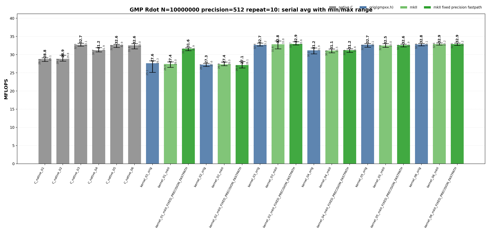
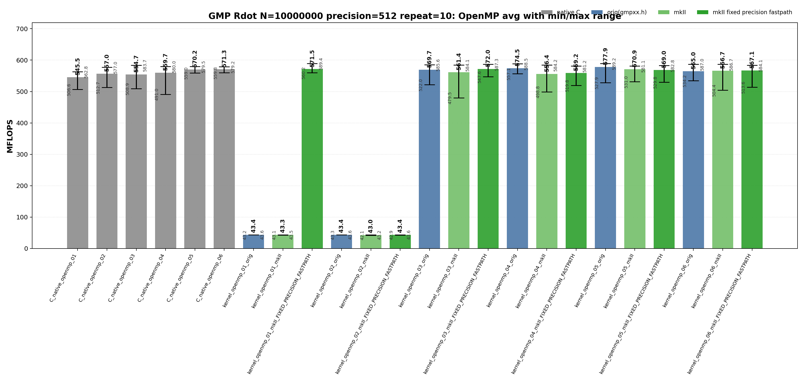

<!-- SPDX-License-Identifier: BSD-2-Clause -->

# 00_Rdot

This directory benchmarks the GMP real dot product

```text
sum_i x_i * y_i
```

with fixed-precision `mpf` data. It compares raw GMP C API kernels,
upstream `gmpxx.h`, and `gmpxx_mkII`.

## Build

From the repository root:

```bash
cmake -S . -B build_bench_release -DCMAKE_BUILD_TYPE=Release
cmake --build build_bench_release -j
```

Executables are created under:

```text
build_bench_release/benchmarks/gmp/00_Rdot/
```

Each executable takes:

```text
<vector size> <precision>
```

Example:

```bash
build_bench_release/benchmarks/gmp/00_Rdot/Rdot_gmp_kernel_03_mkII 10000000 512
```

## Kernel Shapes

The timed body is `_Rdot()`. The suffix numbers are aligned across raw C,
upstream C++, and mkII C++ kernels.

| Kernel | Timed source shape | Temporary policy |
|--------|--------------------|------------------|
| `01` | `acc += dx[i] * dy[i]` expression form. | Expression product is materialized inside the loop unless the mkII fixed-precision fastpath can use scratch storage. |
| `02` | `mpf_class templ = dx[i] * dy[i]; acc += templ;` | Loop-local product object is constructed inside every iteration. |
| `03` | `templ = dx[i] * dy[i]; acc += templ;` | One product object is initialized before the loop and reused. |
| `04` | `templ = dx[i]; templ *= dy[i]; acc += templ;` | One product object is reused, but each iteration performs an explicit copy before multiplication. |
| `05` | Four accumulators with one reused product object. | Tests whether accumulator dependency limits the serial loop. |
| `06` | Four accumulators with four reused product objects. | Separates accumulator unrolling from product temporary reuse. |

Raw C kernels use the same numbering:

```text
Rdot_gmp_C_native_NN
Rdot_gmp_C_native_openmp_NN
```

Wrapper kernels use:

```text
Rdot_gmp_kernel_NN_orig
Rdot_gmp_kernel_NN_mkII
Rdot_gmp_kernel_NN_mkII_FIXED_PRECISION_FASTPATH
Rdot_gmp_kernel_openmp_NN_orig
Rdot_gmp_kernel_openmp_NN_mkII
Rdot_gmp_kernel_openmp_NN_mkII_FIXED_PRECISION_FASTPATH
```

## Recorded Run

This README reports the current committed repeat-10 run:

```text
N = 10000000
precision = 512
repeat = 10
OMP_NUM_THREADS = 32
OMP_PLACES = cores
OMP_PROC_BIND = spread
CPU = AMD Ryzen Threadripper 3970X 32-Core Processor
```

Results are stored in:

```text
results_raw/rdot_gmp_n10000000_p512_repeat10_20260516_210207/
```

Files:

- [Raw log](results_raw/rdot_gmp_n10000000_p512_repeat10_20260516_210207/benchmark_rdot_gmp_n10000000_p512_repeat10.log)
- [Raw CSV](results_raw/rdot_gmp_n10000000_p512_repeat10_20260516_210207/raw_rdot_gmp_n10000000_p512_repeat10.csv)
- [Summary CSV](results_raw/rdot_gmp_n10000000_p512_repeat10_20260516_210207/summary_rdot_gmp_n10000000_p512_repeat10.csv)

All 48 variants report `OK` in all 10 runs.

The plots below show average MFLOPS as vertical bars.  The black range line on
each bar is the observed min-to-max interval across the 10 repeats; the large
label is the average and the small labels mark min and max.





The images can be regenerated from the committed summary CSV with:

```bash
python3 benchmarks/gmp/00_Rdot/plot_repeat_summary.py \
    benchmarks/gmp/00_Rdot/results_raw/rdot_gmp_n10000000_p512_repeat10_20260516_210207/summary_rdot_gmp_n10000000_p512_repeat10.csv \
    --output-prefix benchmarks/gmp/00_Rdot/results_raw/rdot_gmp_n10000000_p512_repeat10_20260516_210207/rdot_gmp_n10000000_p512_repeat10 \
    --title-prefix "GMP Rdot N=10000000 precision=512 repeat=10"
```

## Memory Bandwidth Estimates

These are model estimates derived from MFLOPS, not hardware-counter
measurements.  The 512-bit GMP `mpf_t` inputs in this run have:

```text
sizeof(__mpf_struct) = 24 bytes
sizeof(mp_limb_t)    = 8 bytes
mpf_get_prec(x)      = 512 bits
used limbs           = 8
allocated limbs      = 9
```

Rdot performs two floating operations per element.  Therefore:

```text
active-limb GB/s        = MFLOPS * (2 * 8 limbs * 8 bytes) / 2000 = MFLOPS * 0.064
header-inclusive GB/s   = MFLOPS * (2 * (24 + 8 * 8) bytes) / 2000 = MFLOPS * 0.088
allocated-footprint GB/s = MFLOPS * (2 * (24 + 9 * 8) bytes) / 2000 = MFLOPS * 0.096
```

The active-limb model counts the mantissa limbs that the random 512-bit inputs
actually use.  The header-inclusive model adds the contiguous `mpf_t` headers.
The allocated-footprint model is an upper-bound footprint estimate that also
counts GMP's extra allocated limb.  It is useful for cache-capacity reasoning,
but the extra limb is not necessarily read in the hot loop.

Representative top paths from this run:

| Variant | Avg MFLOPS | Max MFLOPS | Active-limb GB/s | Header-inclusive GB/s | Allocated-footprint GB/s |
|---------|------------|------------|------------------|-----------------------|--------------------------|
| `kernel_03_mkII_FIXED_PRECISION_FASTPATH` | 32.923 | 33.551 | 2.11 | 2.90 | 3.16 |
| `C_native_03` | 32.733 | 33.135 | 2.09 | 2.88 | 3.14 |
| `kernel_openmp_05_orig` | 577.892 | 589.195 | 36.99 | 50.85 | 55.48 |
| `kernel_openmp_03_mkII_FIXED_PRECISION_FASTPATH` | 571.961 | 587.298 | 36.61 | 50.33 | 54.91 |
| `kernel_openmp_01_mkII_FIXED_PRECISION_FASTPATH` | 571.483 | 589.381 | 36.57 | 50.29 | 54.86 |
| `C_native_openmp_06` | 571.300 | 579.186 | 36.56 | 50.27 | 54.84 |

## Serial Results

GitHub Markdown tables cannot run JavaScript sorting in a README.  The
collapsible views below provide the useful sorted orders directly.

| Variant | Max MFLOPS | Avg MFLOPS | Interpretation |
|---------|------------|------------|----------------|
| `C_native_01` | 29.145 | 28.790 | Raw per-iteration `mpf_init2` / `mpf_clear` product. |
| `C_native_02` | 29.825 | 28.859 | Raw loop-local product object; same effective class as 01. |
| `C_native_03` | 33.135 | 32.733 | Raw reusable-product baseline. |
| `C_native_04` | 31.909 | 31.229 | Raw reusable product plus explicit `mpf_set`. |
| `C_native_05` | 32.863 | 32.625 | Four accumulators, one product object. |
| `C_native_06` | 32.999 | 32.554 | Four accumulators, four product objects. |
| `kernel_01_orig` | 28.313 | 27.641 | Expression product materializes inside the loop. |
| `kernel_01_mkII` | 28.026 | 27.441 | Same normal allocation class as upstream 01. |
| `kernel_01_mkII_FIXED_PRECISION_FASTPATH` | 31.906 | 31.624 | Scratch fastpath removes the repeated product allocation. |
| `kernel_02_orig` | 27.613 | 27.254 | Loop-local construction remains expensive. |
| `kernel_02_mkII` | 27.974 | 27.359 | Same loop-local construction cost as upstream 02. |
| `kernel_02_mkII_FIXED_PRECISION_FASTPATH` | 28.085 | 27.113 | Fastpath does not help an explicitly constructed loop-local object. |
| `kernel_03_orig` | 33.170 | 32.686 | Reused product object; matches the raw reusable-product class. |
| `kernel_03_mkII` | 33.777 | 32.828 | Same hot loop shape as C native 03. |
| `kernel_03_mkII_FIXED_PRECISION_FASTPATH` | 33.551 | 32.923 | Same class as 03; small differences are run noise. |
| `kernel_04_orig` | 31.862 | 31.188 | Extra copy keeps it behind 03. |
| `kernel_04_mkII` | 31.542 | 31.147 | Same source shape as upstream 04. |
| `kernel_04_mkII_FIXED_PRECISION_FASTPATH` | 31.605 | 31.216 | Same class as 04. |
| `kernel_05_orig` | 33.053 | 32.726 | Four accumulators do not create a new performance class. |
| `kernel_05_mkII` | 33.015 | 32.511 | Same class as 03/05 raw C. |
| `kernel_05_mkII_FIXED_PRECISION_FASTPATH` | 32.905 | 32.584 | No material gain because temporaries are already outside the loop. |
| `kernel_06_orig` | 33.115 | 32.806 | Four product objects do not improve the serial average. |
| `kernel_06_mkII` | 33.239 | 32.870 | Same class as 03. |
| `kernel_06_mkII_FIXED_PRECISION_FASTPATH` | 33.160 | 32.891 | Same class as 06. |

<details>
<summary>Serial results sorted by Max MFLOPS</summary>

| Rank | Variant | Max MFLOPS | Avg MFLOPS | Min MFLOPS |
|------|---------|------------|------------|------------|
| 1 | `kernel_03_mkII` | 33.777 | 32.828 | 31.581 |
| 2 | `kernel_03_mkII_FIXED_PRECISION_FASTPATH` | 33.551 | 32.923 | 32.684 |
| 3 | `kernel_06_mkII` | 33.239 | 32.870 | 32.622 |
| 4 | `kernel_03_orig` | 33.170 | 32.686 | 32.368 |
| 5 | `kernel_06_mkII_FIXED_PRECISION_FASTPATH` | 33.160 | 32.891 | 32.543 |
| 6 | `C_native_03` | 33.135 | 32.733 | 32.340 |
| 7 | `kernel_06_orig` | 33.115 | 32.806 | 32.408 |
| 8 | `kernel_05_orig` | 33.053 | 32.726 | 32.047 |
| 9 | `kernel_05_mkII` | 33.015 | 32.511 | 31.994 |
| 10 | `C_native_06` | 32.999 | 32.554 | 31.584 |
| 11 | `kernel_05_mkII_FIXED_PRECISION_FASTPATH` | 32.905 | 32.584 | 32.141 |
| 12 | `C_native_05` | 32.863 | 32.625 | 31.969 |
| 13 | `C_native_04` | 31.909 | 31.229 | 30.748 |
| 14 | `kernel_01_mkII_FIXED_PRECISION_FASTPATH` | 31.906 | 31.624 | 31.104 |
| 15 | `kernel_04_orig` | 31.862 | 31.188 | 30.204 |
| 16 | `kernel_04_mkII_FIXED_PRECISION_FASTPATH` | 31.605 | 31.216 | 30.632 |
| 17 | `kernel_04_mkII` | 31.542 | 31.147 | 30.509 |
| 18 | `C_native_02` | 29.825 | 28.859 | 28.230 |
| 19 | `C_native_01` | 29.145 | 28.790 | 28.145 |
| 20 | `kernel_01_orig` | 28.313 | 27.641 | 25.143 |
| 21 | `kernel_02_mkII_FIXED_PRECISION_FASTPATH` | 28.085 | 27.113 | 26.333 |
| 22 | `kernel_01_mkII` | 28.026 | 27.441 | 26.487 |
| 23 | `kernel_02_mkII` | 27.974 | 27.359 | 26.946 |
| 24 | `kernel_02_orig` | 27.613 | 27.254 | 26.745 |

</details>

<details>
<summary>Serial results sorted by Avg MFLOPS</summary>

| Rank | Variant | Max MFLOPS | Avg MFLOPS | Min MFLOPS |
|------|---------|------------|------------|------------|
| 1 | `kernel_03_mkII_FIXED_PRECISION_FASTPATH` | 33.551 | 32.923 | 32.684 |
| 2 | `kernel_06_mkII_FIXED_PRECISION_FASTPATH` | 33.160 | 32.891 | 32.543 |
| 3 | `kernel_06_mkII` | 33.239 | 32.870 | 32.622 |
| 4 | `kernel_03_mkII` | 33.777 | 32.828 | 31.581 |
| 5 | `kernel_06_orig` | 33.115 | 32.806 | 32.408 |
| 6 | `C_native_03` | 33.135 | 32.733 | 32.340 |
| 7 | `kernel_05_orig` | 33.053 | 32.726 | 32.047 |
| 8 | `kernel_03_orig` | 33.170 | 32.686 | 32.368 |
| 9 | `C_native_05` | 32.863 | 32.625 | 31.969 |
| 10 | `kernel_05_mkII_FIXED_PRECISION_FASTPATH` | 32.905 | 32.584 | 32.141 |
| 11 | `C_native_06` | 32.999 | 32.554 | 31.584 |
| 12 | `kernel_05_mkII` | 33.015 | 32.511 | 31.994 |
| 13 | `kernel_01_mkII_FIXED_PRECISION_FASTPATH` | 31.906 | 31.624 | 31.104 |
| 14 | `C_native_04` | 31.909 | 31.229 | 30.748 |
| 15 | `kernel_04_mkII_FIXED_PRECISION_FASTPATH` | 31.605 | 31.216 | 30.632 |
| 16 | `kernel_04_orig` | 31.862 | 31.188 | 30.204 |
| 17 | `kernel_04_mkII` | 31.542 | 31.147 | 30.509 |
| 18 | `C_native_02` | 29.825 | 28.859 | 28.230 |
| 19 | `C_native_01` | 29.145 | 28.790 | 28.145 |
| 20 | `kernel_01_orig` | 28.313 | 27.641 | 25.143 |
| 21 | `kernel_01_mkII` | 28.026 | 27.441 | 26.487 |
| 22 | `kernel_02_mkII` | 27.974 | 27.359 | 26.946 |
| 23 | `kernel_02_orig` | 27.613 | 27.254 | 26.745 |
| 24 | `kernel_02_mkII_FIXED_PRECISION_FASTPATH` | 28.085 | 27.113 | 26.333 |

</details>

## OpenMP Results

| Variant | Max MFLOPS | Avg MFLOPS | Interpretation |
|---------|------------|------------|----------------|
| `C_native_openmp_01` | 562.844 | 545.466 | Raw OpenMP per-iteration product initialization. |
| `C_native_openmp_02` | 577.011 | 557.046 | Same class as raw 01. |
| `C_native_openmp_03` | 583.660 | 554.712 | Raw reusable product per thread. |
| `C_native_openmp_04` | 579.986 | 559.656 | Raw reusable product plus copy. |
| `C_native_openmp_05` | 579.489 | 570.242 | Best raw OpenMP average in this run. |
| `C_native_openmp_06` | 579.186 | 571.300 | Same class as raw 05. |
| `kernel_openmp_01_orig` | 43.592 | 43.444 | Per-element product allocation dominates and does not scale. |
| `kernel_openmp_01_mkII` | 43.463 | 43.317 | Same allocation class as upstream 01. |
| `kernel_openmp_01_mkII_FIXED_PRECISION_FASTPATH` | 589.381 | 571.483 | Scratch fastpath restores the C native OpenMP class. |
| `kernel_openmp_02_orig` | 43.595 | 43.414 | Explicit loop-local construction dominates. |
| `kernel_openmp_02_mkII` | 43.199 | 42.997 | Same loop-local construction cost as upstream 02. |
| `kernel_openmp_02_mkII_FIXED_PRECISION_FASTPATH` | 43.609 | 43.427 | Fastpath does not help explicit loop-local construction. |
| `kernel_openmp_03_orig` | 585.558 | 569.747 | Reused product per thread reaches the raw OpenMP range. |
| `kernel_openmp_03_mkII` | 584.146 | 561.448 | Same hot loop shape as C native OpenMP 03. |
| `kernel_openmp_03_mkII_FIXED_PRECISION_FASTPATH` | 587.298 | 571.961 | Same class as OpenMP 03; best wrapper average in this run. |
| `kernel_openmp_04_orig` | 588.542 | 574.476 | Best wrapper average in this run. |
| `kernel_openmp_04_mkII` | 584.226 | 556.360 | Same class; lower average from OpenMP variance. |
| `kernel_openmp_04_mkII_FIXED_PRECISION_FASTPATH` | 581.238 | 559.160 | Same class as OpenMP 04. |
| `kernel_openmp_05_orig` | 589.195 | 577.892 | Best overall average in this run. |
| `kernel_openmp_05_mkII` | 581.118 | 570.886 | Same broad class as OpenMP 03/04. |
| `kernel_openmp_05_mkII_FIXED_PRECISION_FASTPATH` | 582.841 | 568.962 | No clear benefit over 05. |
| `kernel_openmp_06_orig` | 586.969 | 564.999 | Four product objects do not clearly improve OpenMP. |
| `kernel_openmp_06_mkII` | 586.669 | 566.652 | Same class as OpenMP 05. |
| `kernel_openmp_06_mkII_FIXED_PRECISION_FASTPATH` | 584.079 | 567.075 | Same class as 06. |

<details>
<summary>OpenMP results sorted by Max MFLOPS</summary>

| Rank | Variant | Max MFLOPS | Avg MFLOPS | Min MFLOPS |
|------|---------|------------|------------|------------|
| 1 | `kernel_openmp_01_mkII_FIXED_PRECISION_FASTPATH` | 589.381 | 571.483 | 560.180 |
| 2 | `kernel_openmp_05_orig` | 589.195 | 577.892 | 527.915 |
| 3 | `kernel_openmp_04_orig` | 588.542 | 574.476 | 557.149 |
| 4 | `kernel_openmp_03_mkII_FIXED_PRECISION_FASTPATH` | 587.298 | 571.961 | 547.573 |
| 5 | `kernel_openmp_06_orig` | 586.969 | 564.999 | 534.191 |
| 6 | `kernel_openmp_06_mkII` | 586.669 | 566.652 | 504.369 |
| 7 | `kernel_openmp_03_orig` | 585.558 | 569.747 | 521.967 |
| 8 | `kernel_openmp_04_mkII` | 584.226 | 556.360 | 498.805 |
| 9 | `kernel_openmp_03_mkII` | 584.146 | 561.448 | 479.539 |
| 10 | `kernel_openmp_06_mkII_FIXED_PRECISION_FASTPATH` | 584.079 | 567.075 | 513.609 |
| 11 | `C_native_openmp_03` | 583.660 | 554.712 | 508.874 |
| 12 | `kernel_openmp_05_mkII_FIXED_PRECISION_FASTPATH` | 582.841 | 568.962 | 529.801 |
| 13 | `kernel_openmp_04_mkII_FIXED_PRECISION_FASTPATH` | 581.238 | 559.160 | 519.842 |
| 14 | `kernel_openmp_05_mkII` | 581.118 | 570.886 | 531.049 |
| 15 | `C_native_openmp_04` | 579.986 | 559.656 | 491.010 |
| 16 | `C_native_openmp_05` | 579.489 | 570.242 | 558.995 |
| 17 | `C_native_openmp_06` | 579.186 | 571.300 | 559.800 |
| 18 | `C_native_openmp_02` | 577.011 | 557.045 | 512.741 |
| 19 | `C_native_openmp_01` | 562.844 | 545.466 | 506.590 |
| 20 | `kernel_openmp_02_mkII_FIXED_PRECISION_FASTPATH` | 43.609 | 43.427 | 42.943 |
| 21 | `kernel_openmp_02_orig` | 43.595 | 43.414 | 43.274 |
| 22 | `kernel_openmp_01_orig` | 43.592 | 43.444 | 43.180 |
| 23 | `kernel_openmp_01_mkII` | 43.463 | 43.317 | 43.090 |
| 24 | `kernel_openmp_02_mkII` | 43.199 | 42.997 | 42.097 |

</details>

<details>
<summary>OpenMP results sorted by Avg MFLOPS</summary>

| Rank | Variant | Max MFLOPS | Avg MFLOPS | Min MFLOPS |
|------|---------|------------|------------|------------|
| 1 | `kernel_openmp_05_orig` | 589.195 | 577.892 | 527.915 |
| 2 | `kernel_openmp_04_orig` | 588.542 | 574.476 | 557.149 |
| 3 | `kernel_openmp_03_mkII_FIXED_PRECISION_FASTPATH` | 587.298 | 571.961 | 547.573 |
| 4 | `kernel_openmp_01_mkII_FIXED_PRECISION_FASTPATH` | 589.381 | 571.483 | 560.180 |
| 5 | `C_native_openmp_06` | 579.186 | 571.300 | 559.800 |
| 6 | `kernel_openmp_05_mkII` | 581.118 | 570.886 | 531.049 |
| 7 | `C_native_openmp_05` | 579.489 | 570.242 | 558.995 |
| 8 | `kernel_openmp_03_orig` | 585.558 | 569.747 | 521.967 |
| 9 | `kernel_openmp_05_mkII_FIXED_PRECISION_FASTPATH` | 582.841 | 568.962 | 529.801 |
| 10 | `kernel_openmp_06_mkII_FIXED_PRECISION_FASTPATH` | 584.079 | 567.075 | 513.609 |
| 11 | `kernel_openmp_06_mkII` | 586.669 | 566.652 | 504.369 |
| 12 | `kernel_openmp_06_orig` | 586.969 | 564.999 | 534.191 |
| 13 | `kernel_openmp_03_mkII` | 584.146 | 561.448 | 479.539 |
| 14 | `C_native_openmp_04` | 579.986 | 559.656 | 491.010 |
| 15 | `kernel_openmp_04_mkII_FIXED_PRECISION_FASTPATH` | 581.238 | 559.160 | 519.842 |
| 16 | `C_native_openmp_02` | 577.011 | 557.045 | 512.741 |
| 17 | `kernel_openmp_04_mkII` | 584.226 | 556.360 | 498.805 |
| 18 | `C_native_openmp_03` | 583.660 | 554.712 | 508.874 |
| 19 | `C_native_openmp_01` | 562.844 | 545.466 | 506.590 |
| 20 | `kernel_openmp_01_orig` | 43.592 | 43.444 | 43.180 |
| 21 | `kernel_openmp_02_mkII_FIXED_PRECISION_FASTPATH` | 43.609 | 43.427 | 42.943 |
| 22 | `kernel_openmp_02_orig` | 43.595 | 43.414 | 43.274 |
| 23 | `kernel_openmp_01_mkII` | 43.463 | 43.317 | 43.090 |
| 24 | `kernel_openmp_02_mkII` | 43.199 | 42.997 | 42.097 |

</details>

## Hotpath Disassembly

The snippets were extracted from the local release binaries with:

```bash
objdump -Cd --no-show-raw-insn <binary>
```

Addresses are build-specific. The call sequence inside the loop is the relevant
comparison.

### C Native 01

`C_native_01` initializes and clears the raw product object inside the timed
loop. This is the raw counterpart of the wrapper expression-materialization
stress case.

```asm
33d0: mov    %r15,%rsi
33d3: lea    0x30(%rsp),%rdi
33d8: add    $0x1,%r14
33dc: call   __gmpf_init2@plt
33e1: mov    %rbp,%rdx
33e4: mov    %r12,%rsi
33e7: lea    0x30(%rsp),%rdi
33ec: call   __gmpf_mul@plt
33f1: lea    0x30(%rsp),%rdx
33f6: lea    0x10(%rsp),%rsi
33fb: add    $0x18,%r12
33ff: lea    0x10(%rsp),%rdi
3404: add    $0x18,%rbp
3408: call   __gmpf_add@plt
340d: lea    0x30(%rsp),%rdi
3412: call   __gmpf_clear@plt
341b: jne    33d0
```

### C Native 03

`C_native_03` is the raw reusable-product baseline. The loop has one
`mpf_mul` and one `mpf_add` per element.

```asm
33e0: mov    %r15,%rdx
33e3: mov    %rbx,%rsi
33e6: lea    0x30(%rsp),%rdi
33eb: add    $0x1,%r14
33ef: call   __gmpf_mul@plt
33f4: lea    0x30(%rsp),%rdx
33f9: mov    %rbp,%rsi
33fc: mov    %rbp,%rdi
33ff: call   __gmpf_add@plt
3404: add    $0x18,%rbx
3408: add    $0x18,%r15
340f: jne    33e0
```

### mkII 03

`kernel_03_mkII` has the same hot loop class as `C_native_03`: one multiply,
one add, and pointer increments. The wrapper work is outside the timed loop.

```asm
33c0: mov    %rbx,%rdx
33c3: mov    %rbp,%rsi
33c6: mov    %r13,%rdi
33c9: call   __gmpf_mul@plt
33ce: mov    %r13,%rdx
33d1: mov    %r12,%rsi
33d4: mov    %r12,%rdi
33d7: call   __gmpf_add@plt
33dc: add    $0x1,%r15
33e0: add    $0x18,%rbp
33e4: add    $0x18,%rbx
33eb: jne    33c0
```

### OpenMP 03

`C_native_openmp_03` and `kernel_openmp_03_mkII` have the same per-thread inner
loop shape. The final reduction is outside this loop and uses a critical
section.

```asm
# C_native_openmp_03
3420: mov    %r15,%rdx
3423: mov    %r14,%rsi
3426: mov    %rbp,%rdi
3429: add    $0x1,%r13
342d: call   __gmpf_mul@plt
3432: mov    %rbp,%rdx
3435: add    $0x18,%r14
3439: add    $0x18,%r15
343d: lea    0x10(%rsp),%rsi
3442: lea    0x10(%rsp),%rdi
3447: call   __gmpf_add@plt
344f: jne    3420

# kernel_openmp_03_mkII
34e0: mov    %rbx,%rdx
34e3: mov    %r14,%rsi
34e6: mov    %r12,%rdi
34e9: add    $0x1,%r15
34ed: call   __gmpf_mul@plt
34f2: mov    %r12,%rdx
34f5: mov    %rbp,%rsi
34f8: mov    %rbp,%rdi
34fb: call   __gmpf_add@plt
3500: add    $0x18,%r14
3504: add    $0x18,%rbx
350b: jne    34e0
```

### Kernel 05

`kernel_05` is worth checking because it has the best OpenMP average in this
run. The hotpath shows why it remains the same performance class as 03: the
loop is a four-way unroll of the same `mpf_mul` + `mpf_add` pair. It removes
some loop-control overhead and spreads accumulation across four accumulators,
but it does not reduce the number of GMP arithmetic calls per element.

```asm
# C_native_05
3490: mov    %rbp,%rdx
3493: mov    %r12,%rsi
3496: mov    %rbx,%rdi
3499: add    $0x4,%r13
349d: call   __gmpf_mul@plt
34a7: mov    %rbx,%rdx
34ad: call   __gmpf_add@plt
34b2: lea    0x18(%rbp),%rdx
34b6: lea    0x18(%r12),%rsi
34bb: mov    %rbx,%rdi
34be: call   __gmpf_mul@plt
34c8: mov    %rbx,%rdx
34ce: call   __gmpf_add@plt
34d3: lea    0x30(%rbp),%rdx
34d7: lea    0x30(%r12),%rsi
34dc: mov    %rbx,%rdi
34df: call   __gmpf_mul@plt
34e4: mov    %rbx,%rdx
34ed: call   __gmpf_add@plt
34f2: lea    0x48(%rbp),%rdx
34f6: lea    0x48(%r12),%rsi
34fb: mov    %rbx,%rdi
34fe: call   __gmpf_mul@plt
3503: mov    %rbx,%rdx
350c: call   __gmpf_add@plt
3511: add    $0x60,%r12
3515: add    $0x60,%rbp
351e: jg     3490

# kernel_05_mkII
3510: mov    %rbp,%rdx
3513: mov    %r12,%rsi
3516: mov    %rbx,%rdi
3519: call   __gmpf_mul@plt
351e: mov    %rbx,%rdx
3527: call   __gmpf_add@plt
352c: lea    0x18(%rbp),%rdx
3530: lea    0x18(%r12),%rsi
3535: mov    %rbx,%rdi
3538: call   __gmpf_mul@plt
3541: mov    %rbx,%rdx
3547: call   __gmpf_add@plt
354c: lea    0x30(%rbp),%rdx
3550: lea    0x30(%r12),%rsi
3555: mov    %rbx,%rdi
3558: call   __gmpf_mul@plt
355d: mov    %rbx,%rdx
356a: call   __gmpf_add@plt
356f: lea    0x48(%rbp),%rdx
3573: lea    0x48(%r12),%rsi
3578: mov    %rbx,%rdi
357b: call   __gmpf_mul@plt
3585: mov    %rbx,%rdx
358b: call   __gmpf_add@plt
3594: add    $0x60,%r12
3598: add    $0x60,%rbp
35a1: jne    3510
```

The OpenMP 05 outlined loops have the same four multiply/add pairs per chunk:

```asm
# C_native_openmp_05
34e0: mov    %rbp,%rdx
34e3: mov    %r12,%rsi
34e6: mov    %rbx,%rdi
34ed: call   __gmpf_mul@plt
34f7: mov    %rbx,%rdx
34fd: call   __gmpf_add@plt
3502: lea    0x18(%rbp),%rdx
3506: lea    0x18(%r12),%rsi
350b: mov    %rbx,%rdi
350e: call   __gmpf_mul@plt
3517: mov    %rbx,%rdx
351d: call   __gmpf_add@plt
3522: lea    0x30(%rbp),%rdx
3526: lea    0x30(%r12),%rsi
352b: mov    %rbx,%rdi
352e: call   __gmpf_mul@plt
3533: mov    %rbx,%rdx
353c: call   __gmpf_add@plt
3541: lea    0x48(%rbp),%rdx
3545: lea    0x48(%r12),%rsi
354a: mov    %rbx,%rdi
354d: call   __gmpf_mul@plt
3552: mov    %rbx,%rdx
355b: call   __gmpf_add@plt
3560: add    $0x60,%r12
3564: add    $0x60,%rbp
356d: jg     34e0

# kernel_openmp_05_mkII
3620: mov    %rbp,%rdx
3623: mov    %r13,%rsi
3626: mov    %rbx,%rdi
362d: call   __gmpf_mul@plt
3637: mov    %rbx,%rdx
363d: call   __gmpf_add@plt
3642: lea    0x18(%rbp),%rdx
3646: lea    0x18(%r13),%rsi
364a: mov    %rbx,%rdi
364d: call   __gmpf_mul@plt
3656: mov    %rbx,%rdx
365c: call   __gmpf_add@plt
3661: lea    0x30(%rbp),%rdx
3665: lea    0x30(%r13),%rsi
3669: mov    %rbx,%rdi
366c: call   __gmpf_mul@plt
3671: mov    %rbx,%rdx
367a: call   __gmpf_add@plt
367f: lea    0x48(%rbp),%rdx
3683: lea    0x48(%r13),%rsi
3687: mov    %rbx,%rdi
368a: call   __gmpf_mul@plt
368f: mov    %rbx,%rdx
3698: call   __gmpf_add@plt
369d: add    $0x60,%r13
36a1: add    $0x60,%rbp
36aa: jg     3620
```

## Lessons Learned

The main performance boundary is product lifetime, not wrapper syntax.
`kernel_01` looks ideal at source level, but a normal build still materializes
the product expression inside the loop. That puts it in the same class as the
raw C 01/02 stress kernels and keeps serial performance around 27-29 MFLOPS.

`kernel_03` is the practical serial baseline for wrapper code. Reusing one
product object outside the loop gives the same hotpath as raw C 03 and reaches
about 33 MFLOPS at 512-bit precision.

The mkII fixed-precision fastpath matters for expression-form kernels. It
turns OpenMP 01 from about 43 MFLOPS into the same 560-590 MFLOPS class as raw
C OpenMP by avoiding per-element product allocation. It does not help
`kernel_02`, because that source explicitly constructs a loop-local object.

Four-way unrolling in 05/06 does not create a clear new serial performance
class for GMP `mpf_t`. The expensive work remains inside `mpf_mul` and
`mpf_add`, so extra accumulators mostly add code complexity. In OpenMP runs,
05/06 stay in the same broad range as 03/04 and are dominated by run-to-run
variance.
