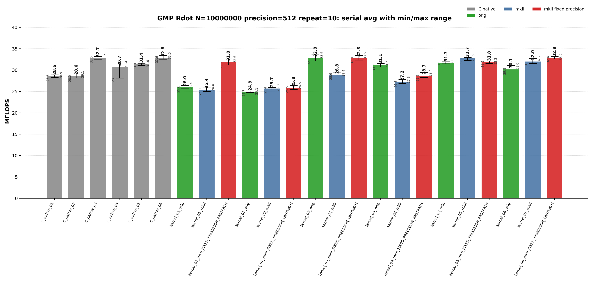
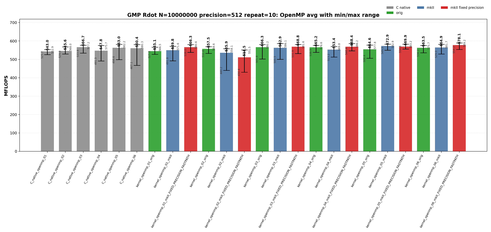
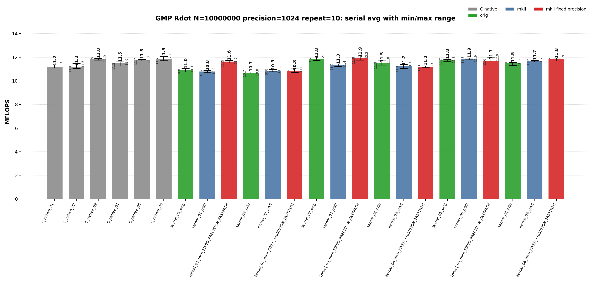
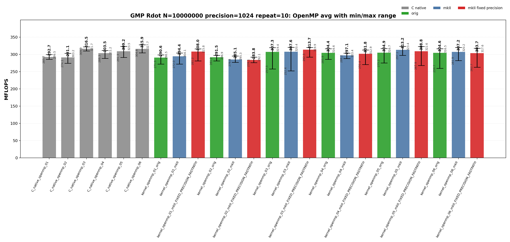

<!-- SPDX-License-Identifier: BSD-2-Clause -->

# 00_Rdot

This directory benchmarks the GMP real dot product

```text
sum_i x_i * y_i
```

with fixed-precision `mpf` data. It compares raw GMP C API kernels, upstream `gmpxx.h`, and `gmpxx_mkII`. The performance question is which source-level temporary policy determines the emitted hot loop and whether the mkII fixed-precision fastpath changes that class.

## Build

From the repository root:

```bash
cmake -S . -B build_bench_release -DCMAKE_BUILD_TYPE=Release
cmake --build build_bench_release -j
```

Executables are created under:

```text
build_bench_release/benchmarks/gmp/00_Rdot/
```

Each executable takes `<vector size> <precision>`. Example:

```bash
build_bench_release/benchmarks/gmp/00_Rdot/Rdot_gmp_kernel_03_mkII 10000000 512
```

The repeat runner is:

```bash
OMP_NUM_THREADS=32 OMP_PLACES=cores OMP_PROC_BIND=spread \
    benchmarks/gmp/00_Rdot/run_repeat.sh build_bench_release 10000000 512 10
```

Arguments are `<build dir> <vector size> <precision> <repeat count> [output dir]`.

The mkII fixed-precision variants use `GMPFRXX_MKII_FAST_FIXED_PREC`; executable suffixes keep the historical `FIXED_PRECISION_FASTPATH` label for benchmark continuity.

The cross-benchmark runner can execute the GMP and MPFR `00_Rdot`, `01_Raxpy`, and `02_Rgemv` suites for both standard precisions with one command:

```bash
OMP_NUM_THREADS=32 OMP_PLACES=cores OMP_PROC_BIND=spread \
    benchmarks/run_all.sh build_bench_release 512,1024 10 10000000 10000000 4000 4000
```

The second argument is a precision list. `both` and `all` are aliases for `512,1024`; a single value such as `512` still runs only that precision. Per-benchmark results are written to `results_raw/run_all_p512_repeat10_<timestamp>/` and `results_raw/run_all_p1024_repeat10_<timestamp>/` under each benchmark directory.

## Benchmark Parameters

| Parameter | Meaning |
| --- | --- |
| `N` | Number of vector elements. |
| `precision` | Requested GMP `mpf` precision in bits for inputs and accumulators. |
| `repeat` | Number of timed process executions per executable. |
| `OMP_NUM_THREADS` | OpenMP worker count for `openmp` executables. |
| `OMP_PLACES`, `OMP_PROC_BIND` | OpenMP affinity controls used by the runner. |

The committed runs use `N=10000000`, `repeat=10`, `precision=512` and `precision=1024`, with `OMP_NUM_THREADS=32`, `OMP_PLACES=cores`, and `OMP_PROC_BIND=spread`.

## Variant Shapes

The timed body is `_Rdot()`. The suffix numbers are aligned across raw C, upstream C++, mkII C++, serial, and OpenMP kernels.

| Variant | Transition from previous variant | Timed source shape | Temporary/resource policy | Purpose |
| --- | --- | --- | --- | --- |
| `01` | Baseline expression form. | `acc += dx[i] * dy[i]` expression form. | Expression product is materialized inside the loop unless mkII fixed-precision scratch storage applies. | Stress expression-template materialization. |
| `02` | `01 -> 02`: introduce an explicit loop-local product object. | `mpf_class templ = dx[i] * dy[i]; acc += templ;` | Loop-local product object is constructed inside every iteration. | Intentionally expensive construction control. |
| `03` | `02 -> 03`: move product storage outside the loop. | `templ = dx[i] * dy[i]; acc += templ;` | One product object is initialized before the loop and reused. | Practical reusable-product baseline. |
| `04` | `03 -> 04`: switch the reusable product update to copy-then-multiply. | `templ = dx[i]; templ *= dy[i]; acc += templ;` | One product object is reused, but each iteration copies before multiplication. | Test copy-then-multiply source shape. |
| `05` | Branch from `03`: add four accumulators while keeping one product object. | Four accumulators with one reused product object. | Four accumulators share one product temporary. | Test accumulator unrolling. |
| `06` | `05 -> 06`: give each accumulator its own product object. | Four accumulators with four reused product objects. | Four accumulators and four product temporaries are reused. | Test unrolling plus independent product temporaries. |

Raw C kernels use `Rdot_gmp_C_native_NN` and `Rdot_gmp_C_native_openmp_NN`. Wrapper kernels use `Rdot_gmp_kernel_NN_orig`, `Rdot_gmp_kernel_NN_mkII`, `Rdot_gmp_kernel_NN_mkII_FIXED_PRECISION_FASTPATH`, and their `openmp` counterparts.

## Source Transitions

The numbered variants isolate one source-level change at a time. `01 -> 02` moves the product into an explicit loop-local product object. `02 -> 03` moves product storage outside the loop and reuses it. `03 -> 04` changes the reusable product update from expression assignment to copy-then-multiply. `03 -> 05` and `05 -> 06` test accumulator unrolling with one and then four reusable product objects. OpenMP targets keep the same numbered source shape and add a static worker partition plus a final reduction.

## C Native Equivalent Kernels

The C native executables are the reference hot-loop shapes for the C++ wrapper kernels. The mapping is based on the timed `_Rdot()` body, not on the post-run correctness reference.

| C native kernel | Equivalent C++ wrapper kernel(s) | Equivalence notes |
| --- | --- | --- |
| `C_native_01` | Closest to `kernel_02_*`; normal `kernel_01_*` may lower to this class. | Raw C initializes and clears a product `mpf_t` inside the loop. |
| `C_native_02` | Closest to `kernel_02_*` | Same loop-local product class as 01. |
| `C_native_03` | `kernel_03_*` | One product object is initialized before the loop and reused. |
| `C_native_04` | `kernel_04_*` | One product object is reused after copying `dx[i]`. |
| `C_native_05` | `kernel_05_*` | Four accumulators with one reused product object. |
| `C_native_06` | `kernel_06_*` | Four accumulators with four reused product objects. |
| `C_native_openmp_NN` | `kernel_openmp_NN_*` for the same `NN` | OpenMP variants follow the same source-shape numbering as serial kernels. |

`kernel_01_*` has no exact raw C source-level equivalent because it is the expression-template spelling. In a normal build it behaves like a loop-local product materialization path. In a fixed-precision fastpath build it can move into the reusable-scratch performance class, so disassembly should be used before treating it as equivalent to one raw C kernel.

## Recorded Run

### 512-bit run

| Field | Value |
|-------|-------|
| Run ID | `run_all_p512_repeat10_20260526_062542` |
| Date | 2026-05-26 |
| CPU | AMD Ryzen Threadripper 3970X 32-Core Processor |
| OS | Linux 6.8.0-94-generic x86_64 |
| Compiler | `c++ (Ubuntu 15.2.0-16ubuntu1) 15.2.0` |
| Build type | Release |
| Problem size | `N=10000000` |
| Precision | 512 bits |
| Repeat count | 10 |
| OpenMP | `OMP_NUM_THREADS=32`, `OMP_PLACES=cores`, `OMP_PROC_BIND=spread` |
| Default precision env | `GMPXX_DEFAULT_MPF_PRECISION_BITS=512` |
| Benchmark command | `OMP_NUM_THREADS=32 OMP_PLACES=cores OMP_PROC_BIND=spread benchmarks/run_all.sh build_bench_release 512,1024 10` |
| Raw result directory | `benchmarks/gmp/00_Rdot/results_raw/run_all_p512_repeat10_20260526_062542/` |
| Raw log | `benchmarks/gmp/00_Rdot/results_raw/run_all_p512_repeat10_20260526_062542/benchmark_rdot_gmp_n10000000_p512_repeat10.log` |
| Raw CSV | `benchmarks/gmp/00_Rdot/results_raw/run_all_p512_repeat10_20260526_062542/raw_rdot_gmp_n10000000_p512_repeat10.csv` |
| Summary CSV | `benchmarks/gmp/00_Rdot/results_raw/run_all_p512_repeat10_20260526_062542/summary_rdot_gmp_n10000000_p512_repeat10.csv` |
| Correctness | 480 / 480 runs reported OK. |





Plot regeneration command:

```bash
python3 benchmarks/gmp/00_Rdot/plot_repeat_summary.py \
    benchmarks/gmp/00_Rdot/results_raw/run_all_p512_repeat10_20260526_062542/benchmark_rdot_gmp_n10000000_p512_repeat10.log \
    --output-dir benchmarks/gmp/00_Rdot/results_raw/run_all_p512_repeat10_20260526_062542 \
    --output-prefix rdot_gmp_n10000000_p512_repeat10 \
    --title-prefix "GMP Rdot N=10000000, precision=512, repeat=10"
```

### 1024-bit run

| Field | Value |
|-------|-------|
| Run ID | `run_all_p1024_repeat10_20260526_062542` |
| Date | 2026-05-26 |
| CPU | AMD Ryzen Threadripper 3970X 32-Core Processor |
| OS | Linux 6.8.0-94-generic x86_64 |
| Compiler | `c++ (Ubuntu 15.2.0-16ubuntu1) 15.2.0` |
| Build type | Release |
| Problem size | `N=10000000` |
| Precision | 1024 bits |
| Repeat count | 10 |
| OpenMP | `OMP_NUM_THREADS=32`, `OMP_PLACES=cores`, `OMP_PROC_BIND=spread` |
| Default precision env | `GMPXX_DEFAULT_MPF_PRECISION_BITS=1024` |
| Benchmark command | `OMP_NUM_THREADS=32 OMP_PLACES=cores OMP_PROC_BIND=spread benchmarks/run_all.sh build_bench_release 512,1024 10` |
| Raw result directory | `benchmarks/gmp/00_Rdot/results_raw/run_all_p1024_repeat10_20260526_062542/` |
| Raw log | `benchmarks/gmp/00_Rdot/results_raw/run_all_p1024_repeat10_20260526_062542/benchmark_rdot_gmp_n10000000_p1024_repeat10.log` |
| Raw CSV | `benchmarks/gmp/00_Rdot/results_raw/run_all_p1024_repeat10_20260526_062542/raw_rdot_gmp_n10000000_p1024_repeat10.csv` |
| Summary CSV | `benchmarks/gmp/00_Rdot/results_raw/run_all_p1024_repeat10_20260526_062542/summary_rdot_gmp_n10000000_p1024_repeat10.csv` |
| Correctness | 480 / 480 runs reported OK. |





Plot regeneration command:

```bash
python3 benchmarks/gmp/00_Rdot/plot_repeat_summary.py \
    benchmarks/gmp/00_Rdot/results_raw/run_all_p1024_repeat10_20260526_062542/benchmark_rdot_gmp_n10000000_p1024_repeat10.log \
    --output-dir benchmarks/gmp/00_Rdot/results_raw/run_all_p1024_repeat10_20260526_062542 \
    --output-prefix rdot_gmp_n10000000_p1024_repeat10 \
    --title-prefix "GMP Rdot N=10000000, precision=1024, repeat=10"
```

## Resource or Bandwidth Estimates

The values below are model estimates derived from MFLOPS, not hardware-counter measurements. They count active limb bytes plus a header-inclusive object model. They exclude allocator metadata, cache-line overfetch, instruction fetch, and final OpenMP reduction traffic.

| Case | Representative best-avg variant | Avg MFLOPS | Active bytes/iteration | Header-inclusive bytes/iteration | Active GB/s | Header-inclusive GB/s |
| --- | --- | --- | --- | --- | --- | --- |
| 512-bit serial | `kernel_06_mkII_FIXED_PRECISION_FASTPATH` | 32.851 | 128 | 176 | 2.102 | 2.891 |
| 512-bit OpenMP | `kernel_openmp_06_mkII_FIXED_PRECISION_FASTPATH` | 578.143 | 128 | 176 | 37.001 | 50.877 |
| 1024-bit serial | `kernel_03_mkII_FIXED_PRECISION_FASTPATH` | 11.908 | 256 | 304 | 1.524 | 1.810 |
| 1024-bit OpenMP | `C_native_openmp_03` | 316.496 | 256 | 304 | 40.511 | 48.107 |

For `Rdot`, the per-iteration byte model is a compact arithmetic-stream estimate. It is not a full cache-footprint or hardware-bandwidth measurement.

## Headline Results

The headline rows below are regenerated from the committed 512-bit and 1024-bit `run_all` summary CSV files.

| Precision | Class | Variant | Max MFLOPS | Avg MFLOPS | Interpretation |
| --- | --- | --- | --- | --- | --- |
| 512 | Best serial max | `kernel_03_orig` | 33.582 | 32.777 | Upstream gmpxx.h wrapper for the same numbered source shape. |
| 512 | Best serial average | `kernel_06_mkII_FIXED_PRECISION_FASTPATH` | 33.195 | 32.851 | Wrapper fixed-precision build; intended to remove repeated precision checks or scratch setup when the source shape allows it. |
| 512 | Best OpenMP max | `kernel_openmp_06_mkII_FIXED_PRECISION_FASTPATH` | 589.239 | 578.143 | Wrapper fixed-precision build; intended to remove repeated precision checks or scratch setup when the source shape allows it. |
| 512 | Best OpenMP average | `kernel_openmp_06_mkII_FIXED_PRECISION_FASTPATH` | 589.239 | 578.143 | Wrapper fixed-precision build; intended to remove repeated precision checks or scratch setup when the source shape allows it. |
| 1024 | Best serial max | `kernel_03_mkII_FIXED_PRECISION_FASTPATH` | 12.195 | 11.908 | Wrapper fixed-precision build; intended to remove repeated precision checks or scratch setup when the source shape allows it. |
| 1024 | Best serial average | `kernel_03_mkII_FIXED_PRECISION_FASTPATH` | 12.195 | 11.908 | Wrapper fixed-precision build; intended to remove repeated precision checks or scratch setup when the source shape allows it. |
| 1024 | Best OpenMP max | `C_native_openmp_06` | 327.729 | 315.925 | Raw C OpenMP reference for the numbered source shape. |
| 1024 | Best OpenMP average | `C_native_openmp_03` | 321.697 | 316.496 | Raw C OpenMP reference for the numbered source shape. |

## Serial Results

### 512-bit serial interpretation

These rows are derived from `benchmarks/gmp/00_Rdot/results_raw/run_all_p512_repeat10_20260526_062542/summary_rdot_gmp_n10000000_p512_repeat10.csv`.

| Observation | Variant | Max MFLOPS | Avg MFLOPS | Min MFLOPS | Interpretation |
| --- | --- | --- | --- | --- | --- |
| Best raw C serial avg | `C_native_06` | 33.457 | 32.846 | 32.556 | Raw C reference for the numbered source shape. |
| Best upstream serial avg | `kernel_03_orig` | 33.582 | 32.777 | 32.141 | Upstream gmpxx.h wrapper for the same numbered source shape. |
| Best mkII serial avg | `kernel_06_mkII_FIXED_PRECISION_FASTPATH` | 33.195 | 32.851 | 32.584 | Wrapper fixed-precision build; intended to remove repeated precision checks or scratch setup when the source shape allows it. |
| Best serial max | `kernel_03_orig` | 33.582 | 32.777 | 32.141 | Upstream gmpxx.h wrapper for the same numbered source shape. |

<details>
<summary>512-bit serial results sorted by Max MFLOPS</summary>

| Rank | Variant | Max MFLOPS | Avg MFLOPS | Min MFLOPS |
| --- | --- | --- | --- | --- |
| 1 | `kernel_03_orig` | 33.582 | 32.777 | 32.141 |
| 2 | `C_native_06` | 33.457 | 32.846 | 32.556 |
| 3 | `kernel_03_mkII_FIXED_PRECISION_FASTPATH` | 33.455 | 32.794 | 32.321 |
| 4 | `kernel_06_mkII_FIXED_PRECISION_FASTPATH` | 33.195 | 32.851 | 32.584 |
| 5 | `C_native_03` | 33.179 | 32.725 | 32.537 |
| 6 | `kernel_05_mkII` | 32.939 | 32.707 | 32.244 |
| 7 | `kernel_06_mkII` | 32.736 | 32.002 | 31.555 |
| 8 | `kernel_01_mkII_FIXED_PRECISION_FASTPATH` | 32.638 | 31.849 | 31.227 |
| 9 | `kernel_05_mkII_FIXED_PRECISION_FASTPATH` | 32.168 | 31.823 | 31.512 |
| 10 | `kernel_05_orig` | 31.951 | 31.707 | 31.487 |
| 11 | `C_native_05` | 31.606 | 31.368 | 31.051 |
| 12 | `kernel_04_orig` | 31.561 | 31.144 | 30.695 |
| 13 | `C_native_04` | 31.447 | 30.709 | 28.107 |
| 14 | `kernel_06_orig` | 31.038 | 30.145 | 29.813 |
| 15 | `kernel_04_mkII_FIXED_PRECISION_FASTPATH` | 29.417 | 28.669 | 28.236 |
| 16 | `kernel_03_mkII` | 29.371 | 28.817 | 28.631 |
| 17 | `C_native_02` | 29.078 | 28.608 | 28.161 |
| 18 | `C_native_01` | 28.889 | 28.575 | 28.296 |
| 19 | `kernel_04_mkII` | 27.830 | 27.244 | 26.822 |
| 20 | `kernel_02_mkII_FIXED_PRECISION_FASTPATH` | 26.454 | 25.792 | 25.507 |
| 21 | `kernel_01_orig` | 26.426 | 25.963 | 25.623 |
| 22 | `kernel_01_mkII` | 26.022 | 25.419 | 25.019 |
| 23 | `kernel_02_mkII` | 25.956 | 25.695 | 25.386 |
| 24 | `kernel_02_orig` | 25.133 | 24.886 | 24.727 |

</details>

<details>
<summary>512-bit serial results sorted by Avg MFLOPS</summary>

| Rank | Variant | Max MFLOPS | Avg MFLOPS | Min MFLOPS |
| --- | --- | --- | --- | --- |
| 1 | `kernel_06_mkII_FIXED_PRECISION_FASTPATH` | 33.195 | 32.851 | 32.584 |
| 2 | `C_native_06` | 33.457 | 32.846 | 32.556 |
| 3 | `kernel_03_mkII_FIXED_PRECISION_FASTPATH` | 33.455 | 32.794 | 32.321 |
| 4 | `kernel_03_orig` | 33.582 | 32.777 | 32.141 |
| 5 | `C_native_03` | 33.179 | 32.725 | 32.537 |
| 6 | `kernel_05_mkII` | 32.939 | 32.707 | 32.244 |
| 7 | `kernel_06_mkII` | 32.736 | 32.002 | 31.555 |
| 8 | `kernel_01_mkII_FIXED_PRECISION_FASTPATH` | 32.638 | 31.849 | 31.227 |
| 9 | `kernel_05_mkII_FIXED_PRECISION_FASTPATH` | 32.168 | 31.823 | 31.512 |
| 10 | `kernel_05_orig` | 31.951 | 31.707 | 31.487 |
| 11 | `C_native_05` | 31.606 | 31.368 | 31.051 |
| 12 | `kernel_04_orig` | 31.561 | 31.144 | 30.695 |
| 13 | `C_native_04` | 31.447 | 30.709 | 28.107 |
| 14 | `kernel_06_orig` | 31.038 | 30.145 | 29.813 |
| 15 | `kernel_03_mkII` | 29.371 | 28.817 | 28.631 |
| 16 | `kernel_04_mkII_FIXED_PRECISION_FASTPATH` | 29.417 | 28.669 | 28.236 |
| 17 | `C_native_02` | 29.078 | 28.608 | 28.161 |
| 18 | `C_native_01` | 28.889 | 28.575 | 28.296 |
| 19 | `kernel_04_mkII` | 27.830 | 27.244 | 26.822 |
| 20 | `kernel_01_orig` | 26.426 | 25.963 | 25.623 |
| 21 | `kernel_02_mkII_FIXED_PRECISION_FASTPATH` | 26.454 | 25.792 | 25.507 |
| 22 | `kernel_02_mkII` | 25.956 | 25.695 | 25.386 |
| 23 | `kernel_01_mkII` | 26.022 | 25.419 | 25.019 |
| 24 | `kernel_02_orig` | 25.133 | 24.886 | 24.727 |

</details>

### 1024-bit serial interpretation

These rows are derived from `benchmarks/gmp/00_Rdot/results_raw/run_all_p1024_repeat10_20260526_062542/summary_rdot_gmp_n10000000_p1024_repeat10.csv`.

| Observation | Variant | Max MFLOPS | Avg MFLOPS | Min MFLOPS | Interpretation |
| --- | --- | --- | --- | --- | --- |
| Best raw C serial avg | `C_native_06` | 12.076 | 11.856 | 11.716 | Raw C reference for the numbered source shape. |
| Best upstream serial avg | `kernel_03_orig` | 12.115 | 11.837 | 11.729 | Upstream gmpxx.h wrapper for the same numbered source shape. |
| Best mkII serial avg | `kernel_03_mkII_FIXED_PRECISION_FASTPATH` | 12.195 | 11.908 | 11.758 | Wrapper fixed-precision build; intended to remove repeated precision checks or scratch setup when the source shape allows it. |
| Best serial max | `kernel_03_mkII_FIXED_PRECISION_FASTPATH` | 12.195 | 11.908 | 11.758 | Wrapper fixed-precision build; intended to remove repeated precision checks or scratch setup when the source shape allows it. |

<details>
<summary>1024-bit serial results sorted by Max MFLOPS</summary>

| Rank | Variant | Max MFLOPS | Avg MFLOPS | Min MFLOPS |
| --- | --- | --- | --- | --- |
| 1 | `kernel_03_mkII_FIXED_PRECISION_FASTPATH` | 12.195 | 11.908 | 11.758 |
| 2 | `kernel_03_orig` | 12.115 | 11.837 | 11.729 |
| 3 | `C_native_06` | 12.076 | 11.856 | 11.716 |
| 4 | `kernel_05_mkII_FIXED_PRECISION_FASTPATH` | 12.015 | 11.717 | 11.605 |
| 5 | `kernel_06_mkII_FIXED_PRECISION_FASTPATH` | 11.934 | 11.819 | 11.680 |
| 6 | `kernel_05_mkII` | 11.923 | 11.862 | 11.795 |
| 7 | `C_native_03` | 11.917 | 11.835 | 11.755 |
| 8 | `C_native_05` | 11.828 | 11.766 | 11.688 |
| 9 | `kernel_05_orig` | 11.827 | 11.752 | 11.669 |
| 10 | `kernel_04_orig` | 11.767 | 11.481 | 11.343 |
| 11 | `kernel_06_mkII` | 11.735 | 11.677 | 11.618 |
| 12 | `kernel_01_mkII_FIXED_PRECISION_FASTPATH` | 11.729 | 11.639 | 11.502 |
| 13 | `C_native_04` | 11.619 | 11.496 | 11.268 |
| 14 | `kernel_06_orig` | 11.570 | 11.481 | 11.325 |
| 15 | `C_native_02` | 11.456 | 11.186 | 11.052 |
| 16 | `kernel_03_mkII` | 11.440 | 11.330 | 11.216 |
| 17 | `kernel_04_mkII` | 11.393 | 11.228 | 11.054 |
| 18 | `C_native_01` | 11.347 | 11.191 | 11.083 |
| 19 | `kernel_04_mkII_FIXED_PRECISION_FASTPATH` | 11.260 | 11.202 | 11.126 |
| 20 | `kernel_01_orig` | 11.054 | 10.955 | 10.759 |
| 21 | `kernel_02_mkII_FIXED_PRECISION_FASTPATH` | 11.025 | 10.824 | 10.715 |
| 22 | `kernel_02_mkII` | 10.959 | 10.852 | 10.771 |
| 23 | `kernel_01_mkII` | 10.877 | 10.799 | 10.702 |
| 24 | `kernel_02_orig` | 10.755 | 10.702 | 10.662 |

</details>

<details>
<summary>1024-bit serial results sorted by Avg MFLOPS</summary>

| Rank | Variant | Max MFLOPS | Avg MFLOPS | Min MFLOPS |
| --- | --- | --- | --- | --- |
| 1 | `kernel_03_mkII_FIXED_PRECISION_FASTPATH` | 12.195 | 11.908 | 11.758 |
| 2 | `kernel_05_mkII` | 11.923 | 11.862 | 11.795 |
| 3 | `C_native_06` | 12.076 | 11.856 | 11.716 |
| 4 | `kernel_03_orig` | 12.115 | 11.837 | 11.729 |
| 5 | `C_native_03` | 11.917 | 11.835 | 11.755 |
| 6 | `kernel_06_mkII_FIXED_PRECISION_FASTPATH` | 11.934 | 11.819 | 11.680 |
| 7 | `C_native_05` | 11.828 | 11.766 | 11.688 |
| 8 | `kernel_05_orig` | 11.827 | 11.752 | 11.669 |
| 9 | `kernel_05_mkII_FIXED_PRECISION_FASTPATH` | 12.015 | 11.717 | 11.605 |
| 10 | `kernel_06_mkII` | 11.735 | 11.677 | 11.618 |
| 11 | `kernel_01_mkII_FIXED_PRECISION_FASTPATH` | 11.729 | 11.639 | 11.502 |
| 12 | `C_native_04` | 11.619 | 11.496 | 11.268 |
| 13 | `kernel_06_orig` | 11.570 | 11.481 | 11.325 |
| 14 | `kernel_04_orig` | 11.767 | 11.481 | 11.343 |
| 15 | `kernel_03_mkII` | 11.440 | 11.330 | 11.216 |
| 16 | `kernel_04_mkII` | 11.393 | 11.228 | 11.054 |
| 17 | `kernel_04_mkII_FIXED_PRECISION_FASTPATH` | 11.260 | 11.202 | 11.126 |
| 18 | `C_native_01` | 11.347 | 11.191 | 11.083 |
| 19 | `C_native_02` | 11.456 | 11.186 | 11.052 |
| 20 | `kernel_01_orig` | 11.054 | 10.955 | 10.759 |
| 21 | `kernel_02_mkII` | 10.959 | 10.852 | 10.771 |
| 22 | `kernel_02_mkII_FIXED_PRECISION_FASTPATH` | 11.025 | 10.824 | 10.715 |
| 23 | `kernel_01_mkII` | 10.877 | 10.799 | 10.702 |
| 24 | `kernel_02_orig` | 10.755 | 10.702 | 10.662 |

</details>

## OpenMP Results

### 512-bit OpenMP interpretation

These rows are derived from `benchmarks/gmp/00_Rdot/results_raw/run_all_p512_repeat10_20260526_062542/summary_rdot_gmp_n10000000_p512_repeat10.csv`.

| Observation | Variant | Max MFLOPS | Avg MFLOPS | Min MFLOPS | Interpretation |
| --- | --- | --- | --- | --- | --- |
| Best raw C OpenMP avg | `C_native_openmp_03` | 577.184 | 566.733 | 533.844 | Raw C OpenMP reference for the numbered source shape. |
| Best upstream OpenMP avg | `kernel_openmp_03_orig` | 580.202 | 566.306 | 501.803 | Upstream gmpxx.h wrapper for the same numbered source shape. |
| Best mkII OpenMP avg | `kernel_openmp_06_mkII_FIXED_PRECISION_FASTPATH` | 589.239 | 578.143 | 554.209 | Wrapper fixed-precision build; intended to remove repeated precision checks or scratch setup when the source shape allows it. |
| Best OpenMP max | `kernel_openmp_06_mkII_FIXED_PRECISION_FASTPATH` | 589.239 | 578.143 | 554.209 | Wrapper fixed-precision build; intended to remove repeated precision checks or scratch setup when the source shape allows it. |

<details>
<summary>512-bit OpenMP results sorted by Max MFLOPS</summary>

| Rank | Variant | Max MFLOPS | Avg MFLOPS | Min MFLOPS |
| --- | --- | --- | --- | --- |
| 1 | `kernel_openmp_06_mkII_FIXED_PRECISION_FASTPATH` | 589.239 | 578.143 | 554.209 |
| 2 | `kernel_openmp_04_mkII_FIXED_PRECISION_FASTPATH` | 586.242 | 568.448 | 546.441 |
| 3 | `kernel_openmp_03_mkII` | 586.057 | 562.897 | 500.535 |
| 4 | `kernel_openmp_05_mkII_FIXED_PRECISION_FASTPATH` | 583.152 | 569.862 | 556.553 |
| 5 | `kernel_openmp_05_mkII` | 582.870 | 572.915 | 549.537 |
| 6 | `C_native_openmp_05` | 582.168 | 562.977 | 498.649 |
| 7 | `kernel_openmp_06_mkII` | 581.701 | 564.943 | 529.005 |
| 8 | `kernel_openmp_03_mkII_FIXED_PRECISION_FASTPATH` | 581.605 | 568.771 | 531.857 |
| 9 | `kernel_openmp_01_mkII_FIXED_PRECISION_FASTPATH` | 580.579 | 566.292 | 537.980 |
| 10 | `C_native_openmp_06` | 580.341 | 560.436 | 467.079 |
| 11 | `kernel_openmp_03_orig` | 580.202 | 566.306 | 501.803 |
| 12 | `kernel_openmp_05_orig` | 577.847 | 554.610 | 506.378 |
| 13 | `C_native_openmp_03` | 577.184 | 566.733 | 533.844 |
| 14 | `kernel_openmp_04_orig` | 576.646 | 565.227 | 538.515 |
| 15 | `kernel_openmp_06_orig` | 575.682 | 563.490 | 536.201 |
| 16 | `C_native_openmp_04` | 575.675 | 547.820 | 491.319 |
| 17 | `kernel_openmp_01_mkII` | 571.563 | 549.770 | 491.812 |
| 18 | `kernel_openmp_04_mkII` | 569.802 | 553.356 | 513.159 |
| 19 | `kernel_openmp_02_orig` | 568.551 | 557.535 | 532.596 |
| 20 | `C_native_openmp_02` | 567.989 | 545.552 | 528.958 |
| 21 | `kernel_openmp_01_orig` | 566.523 | 545.111 | 527.464 |
| 22 | `kernel_openmp_02_mkII` | 558.105 | 535.870 | 440.195 |
| 23 | `C_native_openmp_01` | 552.879 | 542.985 | 525.685 |
| 24 | `kernel_openmp_02_mkII_FIXED_PRECISION_FASTPATH` | 551.536 | 511.520 | 430.377 |

</details>

<details>
<summary>512-bit OpenMP results sorted by Avg MFLOPS</summary>

| Rank | Variant | Max MFLOPS | Avg MFLOPS | Min MFLOPS |
| --- | --- | --- | --- | --- |
| 1 | `kernel_openmp_06_mkII_FIXED_PRECISION_FASTPATH` | 589.239 | 578.143 | 554.209 |
| 2 | `kernel_openmp_05_mkII` | 582.870 | 572.915 | 549.537 |
| 3 | `kernel_openmp_05_mkII_FIXED_PRECISION_FASTPATH` | 583.152 | 569.862 | 556.553 |
| 4 | `kernel_openmp_03_mkII_FIXED_PRECISION_FASTPATH` | 581.605 | 568.771 | 531.857 |
| 5 | `kernel_openmp_04_mkII_FIXED_PRECISION_FASTPATH` | 586.242 | 568.448 | 546.441 |
| 6 | `C_native_openmp_03` | 577.184 | 566.733 | 533.844 |
| 7 | `kernel_openmp_03_orig` | 580.202 | 566.306 | 501.803 |
| 8 | `kernel_openmp_01_mkII_FIXED_PRECISION_FASTPATH` | 580.579 | 566.292 | 537.980 |
| 9 | `kernel_openmp_04_orig` | 576.646 | 565.227 | 538.515 |
| 10 | `kernel_openmp_06_mkII` | 581.701 | 564.943 | 529.005 |
| 11 | `kernel_openmp_06_orig` | 575.682 | 563.490 | 536.201 |
| 12 | `C_native_openmp_05` | 582.168 | 562.977 | 498.649 |
| 13 | `kernel_openmp_03_mkII` | 586.057 | 562.897 | 500.535 |
| 14 | `C_native_openmp_06` | 580.341 | 560.436 | 467.079 |
| 15 | `kernel_openmp_02_orig` | 568.551 | 557.535 | 532.596 |
| 16 | `kernel_openmp_05_orig` | 577.847 | 554.610 | 506.378 |
| 17 | `kernel_openmp_04_mkII` | 569.802 | 553.356 | 513.159 |
| 18 | `kernel_openmp_01_mkII` | 571.563 | 549.770 | 491.812 |
| 19 | `C_native_openmp_04` | 575.675 | 547.820 | 491.319 |
| 20 | `C_native_openmp_02` | 567.989 | 545.552 | 528.958 |
| 21 | `kernel_openmp_01_orig` | 566.523 | 545.111 | 527.464 |
| 22 | `C_native_openmp_01` | 552.879 | 542.985 | 525.685 |
| 23 | `kernel_openmp_02_mkII` | 558.105 | 535.870 | 440.195 |
| 24 | `kernel_openmp_02_mkII_FIXED_PRECISION_FASTPATH` | 551.536 | 511.520 | 430.377 |

</details>

### 1024-bit OpenMP interpretation

These rows are derived from `benchmarks/gmp/00_Rdot/results_raw/run_all_p1024_repeat10_20260526_062542/summary_rdot_gmp_n10000000_p1024_repeat10.csv`.

| Observation | Variant | Max MFLOPS | Avg MFLOPS | Min MFLOPS | Interpretation |
| --- | --- | --- | --- | --- | --- |
| Best raw C OpenMP avg | `C_native_openmp_03` | 321.697 | 316.496 | 309.921 | Raw C OpenMP reference for the numbered source shape. |
| Best upstream OpenMP avg | `kernel_openmp_03_orig` | 319.386 | 307.305 | 257.472 | Upstream gmpxx.h wrapper for the same numbered source shape. |
| Best mkII OpenMP avg | `kernel_openmp_03_mkII_FIXED_PRECISION_FASTPATH` | 319.877 | 313.750 | 292.309 | Wrapper fixed-precision build; intended to remove repeated precision checks or scratch setup when the source shape allows it. |
| Best OpenMP max | `C_native_openmp_06` | 327.729 | 315.925 | 304.610 | Raw C OpenMP reference for the numbered source shape. |

<details>
<summary>1024-bit OpenMP results sorted by Max MFLOPS</summary>

| Rank | Variant | Max MFLOPS | Avg MFLOPS | Min MFLOPS |
| --- | --- | --- | --- | --- |
| 1 | `C_native_openmp_06` | 327.729 | 315.925 | 304.610 |
| 2 | `C_native_openmp_05` | 323.464 | 309.209 | 291.319 |
| 3 | `kernel_openmp_05_mkII` | 323.352 | 313.160 | 297.055 |
| 4 | `kernel_openmp_05_mkII_FIXED_PRECISION_FASTPATH` | 322.646 | 308.828 | 267.884 |
| 5 | `C_native_openmp_03` | 321.697 | 316.496 | 309.921 |
| 6 | `kernel_openmp_03_mkII` | 320.414 | 307.589 | 252.396 |
| 7 | `kernel_openmp_06_mkII` | 320.199 | 307.225 | 281.911 |
| 8 | `kernel_openmp_03_mkII_FIXED_PRECISION_FASTPATH` | 319.877 | 313.750 | 292.309 |
| 9 | `kernel_openmp_03_orig` | 319.386 | 307.305 | 257.472 |
| 10 | `kernel_openmp_06_mkII_FIXED_PRECISION_FASTPATH` | 317.597 | 303.674 | 262.725 |
| 11 | `kernel_openmp_05_orig` | 316.688 | 304.878 | 275.242 |
| 12 | `kernel_openmp_04_orig` | 316.562 | 304.394 | 285.885 |
| 13 | `kernel_openmp_06_orig` | 316.458 | 304.619 | 259.746 |
| 14 | `kernel_openmp_01_mkII_FIXED_PRECISION_FASTPATH` | 315.815 | 307.974 | 281.248 |
| 15 | `kernel_openmp_04_mkII_FIXED_PRECISION_FASTPATH` | 312.906 | 301.773 | 270.387 |
| 16 | `C_native_openmp_04` | 311.241 | 303.462 | 288.290 |
| 17 | `kernel_openmp_01_mkII` | 304.062 | 294.397 | 272.032 |
| 18 | `kernel_openmp_04_mkII` | 303.357 | 297.096 | 288.159 |
| 19 | `C_native_openmp_02` | 303.185 | 291.101 | 274.064 |
| 20 | `C_native_openmp_01` | 299.500 | 292.720 | 285.742 |
| 21 | `kernel_openmp_01_orig` | 298.494 | 290.568 | 271.929 |
| 22 | `kernel_openmp_02_orig` | 296.923 | 291.507 | 281.226 |
| 23 | `kernel_openmp_02_mkII` | 295.261 | 285.128 | 276.849 |
| 24 | `kernel_openmp_02_mkII_FIXED_PRECISION_FASTPATH` | 292.100 | 283.779 | 276.097 |

</details>

<details>
<summary>1024-bit OpenMP results sorted by Avg MFLOPS</summary>

| Rank | Variant | Max MFLOPS | Avg MFLOPS | Min MFLOPS |
| --- | --- | --- | --- | --- |
| 1 | `C_native_openmp_03` | 321.697 | 316.496 | 309.921 |
| 2 | `C_native_openmp_06` | 327.729 | 315.925 | 304.610 |
| 3 | `kernel_openmp_03_mkII_FIXED_PRECISION_FASTPATH` | 319.877 | 313.750 | 292.309 |
| 4 | `kernel_openmp_05_mkII` | 323.352 | 313.160 | 297.055 |
| 5 | `C_native_openmp_05` | 323.464 | 309.209 | 291.319 |
| 6 | `kernel_openmp_05_mkII_FIXED_PRECISION_FASTPATH` | 322.646 | 308.828 | 267.884 |
| 7 | `kernel_openmp_01_mkII_FIXED_PRECISION_FASTPATH` | 315.815 | 307.974 | 281.248 |
| 8 | `kernel_openmp_03_mkII` | 320.414 | 307.589 | 252.396 |
| 9 | `kernel_openmp_03_orig` | 319.386 | 307.305 | 257.472 |
| 10 | `kernel_openmp_06_mkII` | 320.199 | 307.225 | 281.911 |
| 11 | `kernel_openmp_05_orig` | 316.688 | 304.878 | 275.242 |
| 12 | `kernel_openmp_06_orig` | 316.458 | 304.619 | 259.746 |
| 13 | `kernel_openmp_04_orig` | 316.562 | 304.394 | 285.885 |
| 14 | `kernel_openmp_06_mkII_FIXED_PRECISION_FASTPATH` | 317.597 | 303.674 | 262.725 |
| 15 | `C_native_openmp_04` | 311.241 | 303.462 | 288.290 |
| 16 | `kernel_openmp_04_mkII_FIXED_PRECISION_FASTPATH` | 312.906 | 301.773 | 270.387 |
| 17 | `kernel_openmp_04_mkII` | 303.357 | 297.096 | 288.159 |
| 18 | `kernel_openmp_01_mkII` | 304.062 | 294.397 | 272.032 |
| 19 | `C_native_openmp_01` | 299.500 | 292.720 | 285.742 |
| 20 | `kernel_openmp_02_orig` | 296.923 | 291.507 | 281.226 |
| 21 | `C_native_openmp_02` | 303.185 | 291.101 | 274.064 |
| 22 | `kernel_openmp_01_orig` | 298.494 | 290.568 | 271.929 |
| 23 | `kernel_openmp_02_mkII` | 295.261 | 285.128 | 276.849 |
| 24 | `kernel_openmp_02_mkII_FIXED_PRECISION_FASTPATH` | 292.100 | 283.779 | 276.097 |

</details>

## Hotpath Disassembly

The representative disassembly checks are unchanged by this result refresh because the kernel sources did not change during the repeat-10 run. Regenerate snippets with:

```bash
objdump -Cd --no-show-raw-insn build_bench_release/benchmarks/gmp/00_Rdot/Rdot_gmp_C_native_03
objdump -Cd --no-show-raw-insn build_bench_release/benchmarks/gmp/00_Rdot/Rdot_gmp_kernel_03_orig
objdump -Cd --no-show-raw-insn build_bench_release/benchmarks/gmp/00_Rdot/Rdot_gmp_kernel_03_mkII
objdump -Cd --no-show-raw-insn build_bench_release/benchmarks/gmp/00_Rdot/Rdot_gmp_kernel_openmp_03_mkII_FIXED_PRECISION_FASTPATH
```

| Kernel class | Expected hot-loop check |
| --- | --- |
| Loop-local temporary | `mpf_init2` / `mpf_clear` or equivalent object construction appears in the timed loop. |
| Reusable product | One `mpf_mul` and one `mpf_add` per element; product object lifetime is outside the timed loop. |
| Unrolled reusable product | Four independent accumulators do not remove the backend multiply/add cost; they mainly change dependency shape. |
| mkII fixed precision | Expression-form scratch reuse should remove repeated precision setup when the destination precision is fixed. |
| OpenMP worker loop | Per-thread accumulation happens inside the worker loop; final reduction is outside the worker hot path. |

The 1024-bit run adds a precision-audit requirement: raw C and upstream wrappers form the expected lower-throughput 1024-bit class, while mkII results remain close to the 512-bit class. Disassembly alone is not enough to validate those mkII numbers; inspect the precision of generated input objects, expression materialization, and accumulator temporaries before using them as performance evidence.

## Lessons Learned

- At 512 bits, the best serial average is `kernel_06_mkII_FIXED_PRECISION_FASTPATH` at 32.851 MFLOPS; the best OpenMP average is `kernel_openmp_06_mkII_FIXED_PRECISION_FASTPATH` at 578.143 MFLOPS.
- At 1024 bits, the best serial average is `kernel_03_mkII_FIXED_PRECISION_FASTPATH` at 11.908 MFLOPS; the best OpenMP average is `C_native_openmp_03` at 316.496 MFLOPS.
- For GMP `mpf`, source-level temporary lifetime remains the main performance boundary; reusable temporaries and fixed-precision builds define the top wrapper classes.
- OpenMP results should be interpreted by performance class and average MFLOPS because several variants have single-repeat spikes or drops.
- The 1024-bit run is now recorded from the same dual-precision runner as the 512-bit run, so README conclusions should compare both precision classes from the same run stamp.
