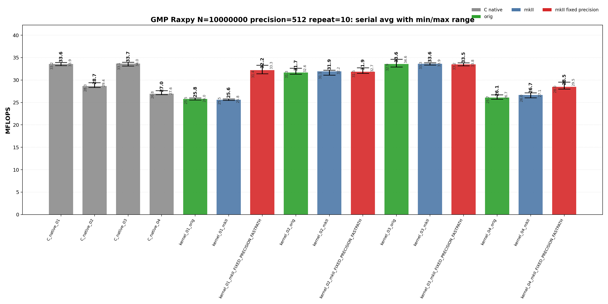
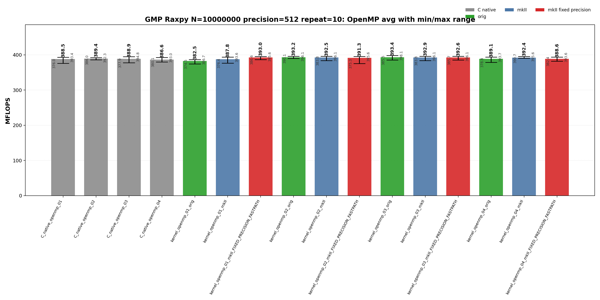
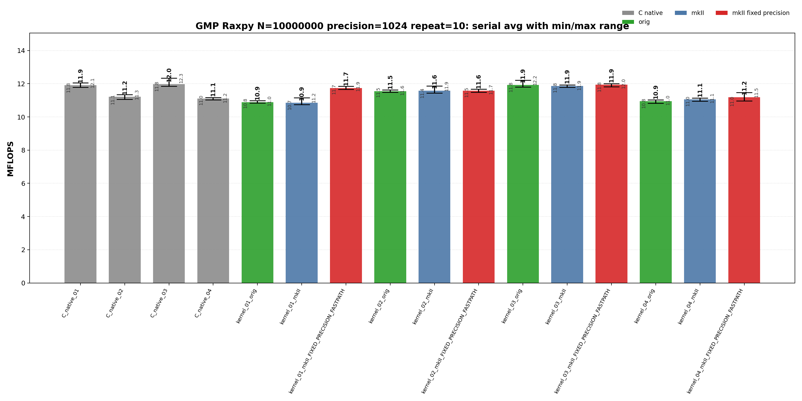
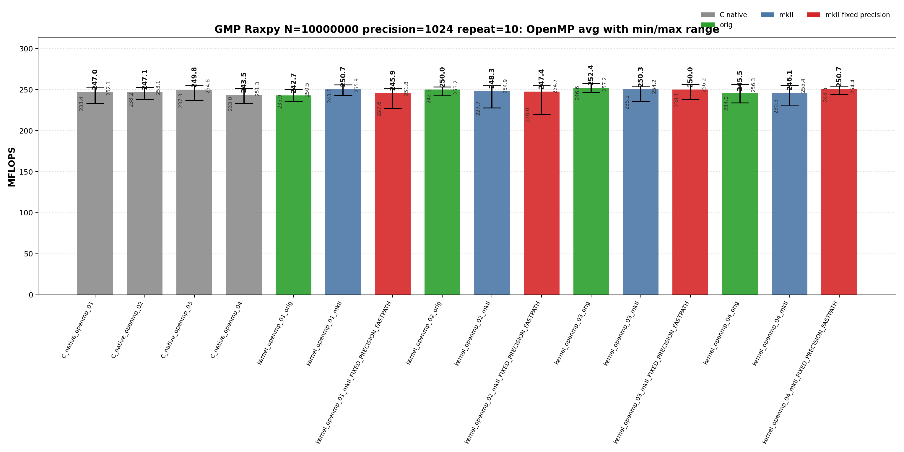

<!-- SPDX-License-Identifier: BSD-2-Clause -->
# 01_Raxpy

This benchmark measures GMP `mpf` RAXPY,

```text
y[i] <- alpha * x[i] + y[i]
```

for raw C GMP, upstream `gmpxx`, and `gmpxx_mkII` wrapper kernels. The purpose is to identify which source-level temporary lifetime and fixed-precision fastpath choices change the generated hot loop and the repeat-10 MFLOPS distribution at 512-bit and 1024-bit precision.

## Build

From the repository root:

```bash
cmake -S . -B build_bench_release -DCMAKE_BUILD_TYPE=Release
cmake --build build_bench_release -j --target Raxpy_gmp_C_native_01 Raxpy_gmp_C_native_02 Raxpy_gmp_C_native_03 Raxpy_gmp_C_native_04 Raxpy_gmp_C_native_openmp_01 Raxpy_gmp_C_native_openmp_02 Raxpy_gmp_C_native_openmp_03 Raxpy_gmp_C_native_openmp_04 Raxpy_gmp_kernel_03_mkII
```

The GMP Raxpy target set is built under:

```text
build_bench_release/benchmarks/gmp/01_Raxpy/
```

Each executable takes:

```text
<vector size> <precision-bits>
```

Example:

```bash
build_bench_release/benchmarks/gmp/01_Raxpy/Raxpy_gmp_kernel_03_mkII 10000000 1024
```

OpenMP variants use the same executable arguments. The recorded run used:

```bash
OMP_NUM_THREADS=32 OMP_PLACES=cores OMP_PROC_BIND=spread \
    build_bench_release/benchmarks/gmp/01_Raxpy/Raxpy_gmp_kernel_openmp_03_mkII 10000000 1024
```

The cross-benchmark runner can execute the GMP and MPFR `00_Rdot`, `01_Raxpy`, and `02_Rgemv` suites for both standard precisions with one command:

```bash
OMP_NUM_THREADS=32 OMP_PLACES=cores OMP_PROC_BIND=spread \
    benchmarks/run_all.sh build_bench_release 512,1024 10 10000000 10000000 4000 4000
```

The second argument is a precision list. `both` and `all` are aliases for `512,1024`; a single value such as `512` still runs only that precision. Per-benchmark results are written to `results_raw/run_all_p512_repeat10_<timestamp>/` and `results_raw/run_all_p1024_repeat10_<timestamp>/` under each benchmark directory.

## Benchmark Parameters

| Parameter | Meaning |
| --- | --- |
| `N` | Number of vector elements. |
| `precision` | Requested GMP `mpf` precision in bits for `alpha`, `x`, and `y`. |
| `repeat` | Number of timed process executions per executable. |
| `OMP_NUM_THREADS` | OpenMP worker count for `openmp` executables. |
| `OMP_PLACES`, `OMP_PROC_BIND` | OpenMP affinity controls used by the runner. |

The committed runs use `N=10000000`, `repeat=10`, `precision=512` and `precision=1024`, with `OMP_NUM_THREADS=32`, `OMP_PLACES=cores`, and `OMP_PROC_BIND=spread`.

## Variant Shapes

The timed body is `_Raxpy()`. The same numeric suffix is used for serial and OpenMP kernels; an `openmp` executable name means the same source-level shape is run over a static worker partition with per-worker temporaries where the source shape needs them.

| Variant | Transition from previous variant | Timed source shape | Temporary/resource policy | Purpose |
| --- | --- | --- | --- | --- |
| `01` | Baseline expression-update form. | `y[i] += alpha * x[i]` | Product is expressed as an ET expression in the update. | Test expression materialization and mkII fixed-precision scratch behavior. |
| `02` | `01 -> 02`: introduce a reusable product object and copy-then-multiply source. | `temp = alpha; temp *= x[i]; y[i] += temp` | One product object is initialized before the loop and reused. | Test explicit copy-then-multiply source shape. |
| `03` | `02 -> 03`: keep reusable product lifetime but assign from the product expression. | `temp = alpha * x[i]; y[i] += temp` | One product object is initialized before the loop and assigned from the product expression. | Main reusable-product wrapper spelling; closest to the raw C reusable-temporary baseline. |
| `04` | `03 -> 04`: move product object lifetime into the timed loop. | `mpf_class temp = alpha * x[i]; y[i] += temp` | Product object lifetime is inside the loop. | Stress per-iteration construction. |

Wrapper targets append `_orig`, `_mkII`, and `_mkII_FIXED_PRECISION_FASTPATH`. Raw C provides `C_native_01` through `C_native_04` and matching `C_native_openmp_01` through `C_native_openmp_04`. `C_native_01` and `C_native_03` are both direct reusable-temporary kernels; `03` exists as the numbered raw C comparison point for wrapper variant `03`.

## Source Transitions

`01 -> 02` replaces the expression update with an explicit reusable product object and copy-then-multiply source. `02 -> 03` keeps the reusable product lifetime but assigns it from the product expression, matching the raw reusable-product hot-loop class. `03 -> 04` moves product construction into the timed loop as an allocation/lifetime stress case. OpenMP variants keep the same numeric source shape and add static partitioning; `03` is the OpenMP comparison point for `C_native_openmp_03`.

## C Native Equivalent Kernels

| C native kernel | Closest wrapper kernel | Equivalence |
|-----------------|------------------------|-------------|
| `C_native_01`, `C_native_openmp_01` | `kernel_03_*`, `kernel_openmp_03_*` | Direct reusable temporary: one `mpf_t temp` outside the loop or per OpenMP worker, then `mpf_mul(temp, alpha, x[i])` and `mpf_add(y[i], y[i], temp)` per element. |
| `C_native_02`, `C_native_openmp_02` | `kernel_02_*`, `kernel_openmp_02_*` | Copy-then-multiply reusable temporary: `mpf_set(temp, alpha)`, `mpf_mul(temp, temp, x[i])`, then `mpf_add`. |
| `C_native_03`, `C_native_openmp_03` | `kernel_03_*`, `kernel_openmp_03_*` | Numbered raw C comparison point for wrapper `03`; same direct reusable-temporary hot-loop class as `C_native_01`. |
| `C_native_04`, `C_native_openmp_04` | `kernel_04_*`, `kernel_openmp_04_*` | Loop-local construction stress case: each element performs `mpf_init`, multiply, add, and `mpf_clear` inside the timed loop. |
| none | `kernel_01_*`, `kernel_openmp_01_*` | Expression-template spelling has no exact raw C source equivalent; compare against the direct reusable-temporary C class when analyzing generated code. |

## Recorded Run

### 512-bit run

| Field | Value |
|-------|-------|
| Run ID | `run_all_p512_repeat10_20260526_062542` |
| Date | 2026-05-26 |
| CPU | AMD Ryzen Threadripper 3970X 32-Core Processor |
| OS | Linux 6.8.0-94-generic x86_64 |
| Compiler | `c++ (Ubuntu 15.2.0-16ubuntu1) 15.2.0` |
| Build type | Release |
| Problem size | `N=10000000` |
| Precision | 512 bits |
| Repeat count | 10 |
| OpenMP | `OMP_NUM_THREADS=32`, `OMP_PLACES=cores`, `OMP_PROC_BIND=spread` |
| Default precision env | `GMPXX_DEFAULT_MPF_PRECISION_BITS=512` |
| Benchmark command | `OMP_NUM_THREADS=32 OMP_PLACES=cores OMP_PROC_BIND=spread benchmarks/run_all.sh build_bench_release 512,1024 10` |
| Raw result directory | `benchmarks/gmp/01_Raxpy/results_raw/run_all_p512_repeat10_20260526_062542/` |
| Raw log | `benchmarks/gmp/01_Raxpy/results_raw/run_all_p512_repeat10_20260526_062542/benchmark_raxpy_gmp_n10000000_p512_repeat10.log` |
| Raw CSV | `benchmarks/gmp/01_Raxpy/results_raw/run_all_p512_repeat10_20260526_062542/raw_raxpy_gmp_n10000000_p512_repeat10.csv` |
| Summary CSV | `benchmarks/gmp/01_Raxpy/results_raw/run_all_p512_repeat10_20260526_062542/summary_raxpy_gmp_n10000000_p512_repeat10.csv` |
| Correctness | 320 / 320 runs reported OK. |





Plot regeneration command:

```bash
python3 benchmarks/gmp/01_Raxpy/plot_repeat_summary.py \
    benchmarks/gmp/01_Raxpy/results_raw/run_all_p512_repeat10_20260526_062542/benchmark_raxpy_gmp_n10000000_p512_repeat10.log \
    --output-dir benchmarks/gmp/01_Raxpy/results_raw/run_all_p512_repeat10_20260526_062542 \
    --output-prefix raxpy_gmp_n10000000_p512_repeat10 \
    --title-prefix "GMP Raxpy N=10000000, precision=512, repeat=10"
```

### 1024-bit run

| Field | Value |
|-------|-------|
| Run ID | `run_all_p1024_repeat10_20260526_062542` |
| Date | 2026-05-26 |
| CPU | AMD Ryzen Threadripper 3970X 32-Core Processor |
| OS | Linux 6.8.0-94-generic x86_64 |
| Compiler | `c++ (Ubuntu 15.2.0-16ubuntu1) 15.2.0` |
| Build type | Release |
| Problem size | `N=10000000` |
| Precision | 1024 bits |
| Repeat count | 10 |
| OpenMP | `OMP_NUM_THREADS=32`, `OMP_PLACES=cores`, `OMP_PROC_BIND=spread` |
| Default precision env | `GMPXX_DEFAULT_MPF_PRECISION_BITS=1024` |
| Benchmark command | `OMP_NUM_THREADS=32 OMP_PLACES=cores OMP_PROC_BIND=spread benchmarks/run_all.sh build_bench_release 512,1024 10` |
| Raw result directory | `benchmarks/gmp/01_Raxpy/results_raw/run_all_p1024_repeat10_20260526_062542/` |
| Raw log | `benchmarks/gmp/01_Raxpy/results_raw/run_all_p1024_repeat10_20260526_062542/benchmark_raxpy_gmp_n10000000_p1024_repeat10.log` |
| Raw CSV | `benchmarks/gmp/01_Raxpy/results_raw/run_all_p1024_repeat10_20260526_062542/raw_raxpy_gmp_n10000000_p1024_repeat10.csv` |
| Summary CSV | `benchmarks/gmp/01_Raxpy/results_raw/run_all_p1024_repeat10_20260526_062542/summary_raxpy_gmp_n10000000_p1024_repeat10.csv` |
| Correctness | 320 / 320 runs reported OK. |





Plot regeneration command:

```bash
python3 benchmarks/gmp/01_Raxpy/plot_repeat_summary.py \
    benchmarks/gmp/01_Raxpy/results_raw/run_all_p1024_repeat10_20260526_062542/benchmark_raxpy_gmp_n10000000_p1024_repeat10.log \
    --output-dir benchmarks/gmp/01_Raxpy/results_raw/run_all_p1024_repeat10_20260526_062542 \
    --output-prefix raxpy_gmp_n10000000_p1024_repeat10 \
    --title-prefix "GMP Raxpy N=10000000, precision=1024, repeat=10"
```

## Resource or Bandwidth Estimates

The values below are model estimates derived from MFLOPS, not hardware-counter measurements. They count active limb bytes plus a header-inclusive object model. They exclude allocator metadata, cache-line overfetch, instruction fetch, and final OpenMP reduction traffic.

| Case | Representative best-avg variant | Avg MFLOPS | Active bytes/iteration | Header-inclusive bytes/iteration | Active GB/s | Header-inclusive GB/s |
| --- | --- | --- | --- | --- | --- | --- |
| 512-bit serial | `C_native_03` | 33.650 | 192 | 264 | 3.230 | 4.442 |
| 512-bit OpenMP | `kernel_openmp_03_orig` | 393.434 | 192 | 264 | 37.770 | 51.933 |
| 1024-bit serial | `C_native_03` | 11.967 | 384 | 456 | 2.298 | 2.728 |
| 1024-bit OpenMP | `kernel_openmp_03_orig` | 252.368 | 384 | 456 | 48.455 | 57.540 |

For `Raxpy`, the per-iteration byte model is a compact arithmetic-stream estimate. It is not a full cache-footprint or hardware-bandwidth measurement.

## Headline Results

The headline rows below are regenerated from the committed 512-bit and 1024-bit `run_all` summary CSV files.

| Precision | Class | Variant | Max MFLOPS | Avg MFLOPS | Interpretation |
| --- | --- | --- | --- | --- | --- |
| 512 | Best serial max | `kernel_03_orig` | 34.642 | 33.577 | Upstream gmpxx.h wrapper for the same numbered source shape. |
| 512 | Best serial average | `C_native_03` | 33.960 | 33.650 | Raw C reference for the numbered source shape. |
| 512 | Best OpenMP max | `kernel_openmp_03_orig` | 398.145 | 393.434 | Upstream gmpxx.h wrapper for the same numbered source shape. |
| 512 | Best OpenMP average | `kernel_openmp_03_orig` | 398.145 | 393.434 | Upstream gmpxx.h wrapper for the same numbered source shape. |
| 1024 | Best serial max | `C_native_03` | 12.335 | 11.967 | Raw C reference for the numbered source shape. |
| 1024 | Best serial average | `C_native_03` | 12.335 | 11.967 | Raw C reference for the numbered source shape. |
| 1024 | Best OpenMP max | `kernel_openmp_03_orig` | 257.164 | 252.368 | Upstream gmpxx.h wrapper for the same numbered source shape. |
| 1024 | Best OpenMP average | `kernel_openmp_03_orig` | 257.164 | 252.368 | Upstream gmpxx.h wrapper for the same numbered source shape. |

## Serial Results

### 512-bit serial interpretation

These rows are derived from `benchmarks/gmp/01_Raxpy/results_raw/run_all_p512_repeat10_20260526_062542/summary_raxpy_gmp_n10000000_p512_repeat10.csv`.

| Observation | Variant | Max MFLOPS | Avg MFLOPS | Min MFLOPS | Interpretation |
| --- | --- | --- | --- | --- | --- |
| Best raw C serial avg | `C_native_03` | 33.960 | 33.650 | 33.134 | Raw C reference for the numbered source shape. |
| Best upstream serial avg | `kernel_03_orig` | 34.642 | 33.577 | 32.917 | Upstream gmpxx.h wrapper for the same numbered source shape. |
| Best mkII serial avg | `kernel_03_mkII` | 33.864 | 33.603 | 33.344 | mkII wrapper baseline for the numbered source shape. |
| Best serial max | `kernel_03_orig` | 34.642 | 33.577 | 32.917 | Upstream gmpxx.h wrapper for the same numbered source shape. |

<details>
<summary>512-bit serial results sorted by Max MFLOPS</summary>

| Rank | Variant | Max MFLOPS | Avg MFLOPS | Min MFLOPS |
| --- | --- | --- | --- | --- |
| 1 | `kernel_03_orig` | 34.642 | 33.577 | 32.917 |
| 2 | `C_native_03` | 33.960 | 33.650 | 33.134 |
| 3 | `C_native_01` | 33.916 | 33.596 | 33.239 |
| 4 | `kernel_03_mkII` | 33.864 | 33.603 | 33.344 |
| 5 | `kernel_03_mkII_FIXED_PRECISION_FASTPATH` | 33.827 | 33.471 | 33.172 |
| 6 | `kernel_01_mkII_FIXED_PRECISION_FASTPATH` | 33.331 | 32.227 | 31.391 |
| 7 | `kernel_02_mkII_FIXED_PRECISION_FASTPATH` | 32.718 | 31.871 | 31.492 |
| 8 | `kernel_02_orig` | 32.639 | 31.691 | 31.318 |
| 9 | `kernel_02_mkII` | 32.186 | 31.926 | 31.113 |
| 10 | `kernel_04_mkII_FIXED_PRECISION_FASTPATH` | 29.548 | 28.496 | 28.014 |
| 11 | `C_native_02` | 29.411 | 28.667 | 28.337 |
| 12 | `C_native_04` | 27.648 | 26.951 | 26.767 |
| 13 | `kernel_04_mkII` | 27.136 | 26.680 | 26.030 |
| 14 | `kernel_04_orig` | 26.705 | 26.088 | 25.720 |
| 15 | `kernel_01_orig` | 25.992 | 25.773 | 25.541 |
| 16 | `kernel_01_mkII` | 25.793 | 25.614 | 25.451 |

</details>

<details>
<summary>512-bit serial results sorted by Avg MFLOPS</summary>

| Rank | Variant | Max MFLOPS | Avg MFLOPS | Min MFLOPS |
| --- | --- | --- | --- | --- |
| 1 | `C_native_03` | 33.960 | 33.650 | 33.134 |
| 2 | `kernel_03_mkII` | 33.864 | 33.603 | 33.344 |
| 3 | `C_native_01` | 33.916 | 33.596 | 33.239 |
| 4 | `kernel_03_orig` | 34.642 | 33.577 | 32.917 |
| 5 | `kernel_03_mkII_FIXED_PRECISION_FASTPATH` | 33.827 | 33.471 | 33.172 |
| 6 | `kernel_01_mkII_FIXED_PRECISION_FASTPATH` | 33.331 | 32.227 | 31.391 |
| 7 | `kernel_02_mkII` | 32.186 | 31.926 | 31.113 |
| 8 | `kernel_02_mkII_FIXED_PRECISION_FASTPATH` | 32.718 | 31.871 | 31.492 |
| 9 | `kernel_02_orig` | 32.639 | 31.691 | 31.318 |
| 10 | `C_native_02` | 29.411 | 28.667 | 28.337 |
| 11 | `kernel_04_mkII_FIXED_PRECISION_FASTPATH` | 29.548 | 28.496 | 28.014 |
| 12 | `C_native_04` | 27.648 | 26.951 | 26.767 |
| 13 | `kernel_04_mkII` | 27.136 | 26.680 | 26.030 |
| 14 | `kernel_04_orig` | 26.705 | 26.088 | 25.720 |
| 15 | `kernel_01_orig` | 25.992 | 25.773 | 25.541 |
| 16 | `kernel_01_mkII` | 25.793 | 25.614 | 25.451 |

</details>

### 1024-bit serial interpretation

These rows are derived from `benchmarks/gmp/01_Raxpy/results_raw/run_all_p1024_repeat10_20260526_062542/summary_raxpy_gmp_n10000000_p1024_repeat10.csv`.

| Observation | Variant | Max MFLOPS | Avg MFLOPS | Min MFLOPS | Interpretation |
| --- | --- | --- | --- | --- | --- |
| Best raw C serial avg | `C_native_03` | 12.335 | 11.967 | 11.848 | Raw C reference for the numbered source shape. |
| Best upstream serial avg | `kernel_03_orig` | 12.215 | 11.920 | 11.798 | Upstream gmpxx.h wrapper for the same numbered source shape. |
| Best mkII serial avg | `kernel_03_mkII_FIXED_PRECISION_FASTPATH` | 12.006 | 11.934 | 11.819 | Wrapper fixed-precision build; intended to remove repeated precision checks or scratch setup when the source shape allows it. |
| Best serial max | `C_native_03` | 12.335 | 11.967 | 11.848 | Raw C reference for the numbered source shape. |

<details>
<summary>1024-bit serial results sorted by Max MFLOPS</summary>

| Rank | Variant | Max MFLOPS | Avg MFLOPS | Min MFLOPS |
| --- | --- | --- | --- | --- |
| 1 | `C_native_03` | 12.335 | 11.967 | 11.848 |
| 2 | `kernel_03_orig` | 12.215 | 11.920 | 11.798 |
| 3 | `C_native_01` | 12.058 | 11.917 | 11.776 |
| 4 | `kernel_03_mkII_FIXED_PRECISION_FASTPATH` | 12.006 | 11.934 | 11.819 |
| 5 | `kernel_03_mkII` | 11.924 | 11.870 | 11.779 |
| 6 | `kernel_02_mkII` | 11.857 | 11.579 | 11.436 |
| 7 | `kernel_01_mkII_FIXED_PRECISION_FASTPATH` | 11.851 | 11.739 | 11.665 |
| 8 | `kernel_02_mkII_FIXED_PRECISION_FASTPATH` | 11.667 | 11.576 | 11.490 |
| 9 | `kernel_02_orig` | 11.624 | 11.539 | 11.489 |
| 10 | `kernel_04_mkII_FIXED_PRECISION_FASTPATH` | 11.474 | 11.186 | 10.959 |
| 11 | `C_native_02` | 11.346 | 11.211 | 11.056 |
| 12 | `C_native_04` | 11.167 | 11.105 | 11.024 |
| 13 | `kernel_01_mkII` | 11.158 | 10.853 | 10.740 |
| 14 | `kernel_04_mkII` | 11.137 | 11.062 | 10.955 |
| 15 | `kernel_04_orig` | 11.023 | 10.946 | 10.826 |
| 16 | `kernel_01_orig` | 10.977 | 10.884 | 10.829 |

</details>

<details>
<summary>1024-bit serial results sorted by Avg MFLOPS</summary>

| Rank | Variant | Max MFLOPS | Avg MFLOPS | Min MFLOPS |
| --- | --- | --- | --- | --- |
| 1 | `C_native_03` | 12.335 | 11.967 | 11.848 |
| 2 | `kernel_03_mkII_FIXED_PRECISION_FASTPATH` | 12.006 | 11.934 | 11.819 |
| 3 | `kernel_03_orig` | 12.215 | 11.920 | 11.798 |
| 4 | `C_native_01` | 12.058 | 11.917 | 11.776 |
| 5 | `kernel_03_mkII` | 11.924 | 11.870 | 11.779 |
| 6 | `kernel_01_mkII_FIXED_PRECISION_FASTPATH` | 11.851 | 11.739 | 11.665 |
| 7 | `kernel_02_mkII` | 11.857 | 11.579 | 11.436 |
| 8 | `kernel_02_mkII_FIXED_PRECISION_FASTPATH` | 11.667 | 11.576 | 11.490 |
| 9 | `kernel_02_orig` | 11.624 | 11.539 | 11.489 |
| 10 | `C_native_02` | 11.346 | 11.211 | 11.056 |
| 11 | `kernel_04_mkII_FIXED_PRECISION_FASTPATH` | 11.474 | 11.186 | 10.959 |
| 12 | `C_native_04` | 11.167 | 11.105 | 11.024 |
| 13 | `kernel_04_mkII` | 11.137 | 11.062 | 10.955 |
| 14 | `kernel_04_orig` | 11.023 | 10.946 | 10.826 |
| 15 | `kernel_01_orig` | 10.977 | 10.884 | 10.829 |
| 16 | `kernel_01_mkII` | 11.158 | 10.853 | 10.740 |

</details>

## OpenMP Results

### 512-bit OpenMP interpretation

These rows are derived from `benchmarks/gmp/01_Raxpy/results_raw/run_all_p512_repeat10_20260526_062542/summary_raxpy_gmp_n10000000_p512_repeat10.csv`.

| Observation | Variant | Max MFLOPS | Avg MFLOPS | Min MFLOPS | Interpretation |
| --- | --- | --- | --- | --- | --- |
| Best raw C OpenMP avg | `C_native_openmp_02` | 392.261 | 389.356 | 386.040 | Raw C OpenMP reference for the numbered source shape. |
| Best upstream OpenMP avg | `kernel_openmp_03_orig` | 398.145 | 393.434 | 385.462 | Upstream gmpxx.h wrapper for the same numbered source shape. |
| Best mkII OpenMP avg | `kernel_openmp_01_mkII_FIXED_PRECISION_FASTPATH` | 395.563 | 392.968 | 386.557 | Wrapper fixed-precision build; intended to remove repeated precision checks or scratch setup when the source shape allows it. |
| Best OpenMP max | `kernel_openmp_03_orig` | 398.145 | 393.434 | 385.462 | Upstream gmpxx.h wrapper for the same numbered source shape. |

<details>
<summary>512-bit OpenMP results sorted by Max MFLOPS</summary>

| Rank | Variant | Max MFLOPS | Avg MFLOPS | Min MFLOPS |
| --- | --- | --- | --- | --- |
| 1 | `kernel_openmp_03_orig` | 398.145 | 393.434 | 385.462 |
| 2 | `kernel_openmp_02_orig` | 396.150 | 393.152 | 390.111 |
| 3 | `kernel_openmp_02_mkII` | 396.135 | 392.502 | 383.754 |
| 4 | `kernel_openmp_03_mkII` | 396.096 | 392.859 | 383.768 |
| 5 | `kernel_openmp_03_mkII_FIXED_PRECISION_FASTPATH` | 396.059 | 392.607 | 385.689 |
| 6 | `kernel_openmp_04_mkII` | 395.608 | 392.389 | 390.682 |
| 7 | `kernel_openmp_02_mkII_FIXED_PRECISION_FASTPATH` | 395.591 | 391.350 | 375.256 |
| 8 | `kernel_openmp_01_mkII_FIXED_PRECISION_FASTPATH` | 395.563 | 392.968 | 386.557 |
| 9 | `C_native_openmp_03` | 394.757 | 388.852 | 377.907 |
| 10 | `kernel_openmp_04_orig` | 393.728 | 389.070 | 378.815 |
| 11 | `kernel_openmp_04_mkII_FIXED_PRECISION_FASTPATH` | 393.641 | 388.616 | 382.394 |
| 12 | `kernel_openmp_01_mkII` | 393.593 | 387.813 | 376.417 |
| 13 | `C_native_openmp_01` | 393.431 | 388.481 | 376.007 |
| 14 | `C_native_openmp_04` | 392.964 | 386.610 | 380.103 |
| 15 | `C_native_openmp_02` | 392.261 | 389.356 | 386.040 |
| 16 | `kernel_openmp_01_orig` | 386.724 | 382.509 | 374.492 |

</details>

<details>
<summary>512-bit OpenMP results sorted by Avg MFLOPS</summary>

| Rank | Variant | Max MFLOPS | Avg MFLOPS | Min MFLOPS |
| --- | --- | --- | --- | --- |
| 1 | `kernel_openmp_03_orig` | 398.145 | 393.434 | 385.462 |
| 2 | `kernel_openmp_02_orig` | 396.150 | 393.152 | 390.111 |
| 3 | `kernel_openmp_01_mkII_FIXED_PRECISION_FASTPATH` | 395.563 | 392.968 | 386.557 |
| 4 | `kernel_openmp_03_mkII` | 396.096 | 392.859 | 383.768 |
| 5 | `kernel_openmp_03_mkII_FIXED_PRECISION_FASTPATH` | 396.059 | 392.607 | 385.689 |
| 6 | `kernel_openmp_02_mkII` | 396.135 | 392.502 | 383.754 |
| 7 | `kernel_openmp_04_mkII` | 395.608 | 392.389 | 390.682 |
| 8 | `kernel_openmp_02_mkII_FIXED_PRECISION_FASTPATH` | 395.591 | 391.350 | 375.256 |
| 9 | `C_native_openmp_02` | 392.261 | 389.356 | 386.040 |
| 10 | `kernel_openmp_04_orig` | 393.728 | 389.070 | 378.815 |
| 11 | `C_native_openmp_03` | 394.757 | 388.852 | 377.907 |
| 12 | `kernel_openmp_04_mkII_FIXED_PRECISION_FASTPATH` | 393.641 | 388.616 | 382.394 |
| 13 | `C_native_openmp_01` | 393.431 | 388.481 | 376.007 |
| 14 | `kernel_openmp_01_mkII` | 393.593 | 387.813 | 376.417 |
| 15 | `C_native_openmp_04` | 392.964 | 386.610 | 380.103 |
| 16 | `kernel_openmp_01_orig` | 386.724 | 382.509 | 374.492 |

</details>

### 1024-bit OpenMP interpretation

These rows are derived from `benchmarks/gmp/01_Raxpy/results_raw/run_all_p1024_repeat10_20260526_062542/summary_raxpy_gmp_n10000000_p1024_repeat10.csv`.

| Observation | Variant | Max MFLOPS | Avg MFLOPS | Min MFLOPS | Interpretation |
| --- | --- | --- | --- | --- | --- |
| Best raw C OpenMP avg | `C_native_openmp_03` | 254.761 | 249.841 | 237.274 | Raw C OpenMP reference for the numbered source shape. |
| Best upstream OpenMP avg | `kernel_openmp_03_orig` | 257.164 | 252.368 | 246.586 | Upstream gmpxx.h wrapper for the same numbered source shape. |
| Best mkII OpenMP avg | `kernel_openmp_01_mkII` | 255.929 | 250.750 | 243.145 | mkII wrapper baseline for the numbered source shape. |
| Best OpenMP max | `kernel_openmp_03_orig` | 257.164 | 252.368 | 246.586 | Upstream gmpxx.h wrapper for the same numbered source shape. |

<details>
<summary>1024-bit OpenMP results sorted by Max MFLOPS</summary>

| Rank | Variant | Max MFLOPS | Avg MFLOPS | Min MFLOPS |
| --- | --- | --- | --- | --- |
| 1 | `kernel_openmp_03_orig` | 257.164 | 252.368 | 246.586 |
| 2 | `kernel_openmp_04_orig` | 256.301 | 245.529 | 234.002 |
| 3 | `kernel_openmp_03_mkII_FIXED_PRECISION_FASTPATH` | 256.219 | 250.018 | 238.130 |
| 4 | `kernel_openmp_01_mkII` | 255.929 | 250.750 | 243.145 |
| 5 | `kernel_openmp_04_mkII` | 255.398 | 246.145 | 230.303 |
| 6 | `kernel_openmp_02_mkII` | 254.896 | 248.300 | 227.679 |
| 7 | `C_native_openmp_03` | 254.761 | 249.841 | 237.274 |
| 8 | `kernel_openmp_02_mkII_FIXED_PRECISION_FASTPATH` | 254.728 | 247.378 | 220.017 |
| 9 | `kernel_openmp_04_mkII_FIXED_PRECISION_FASTPATH` | 254.394 | 250.728 | 244.279 |
| 10 | `kernel_openmp_03_mkII` | 254.242 | 250.305 | 235.150 |
| 11 | `kernel_openmp_02_orig` | 253.191 | 249.997 | 242.345 |
| 12 | `C_native_openmp_02` | 253.126 | 247.114 | 238.158 |
| 13 | `C_native_openmp_01` | 252.086 | 246.991 | 233.450 |
| 14 | `kernel_openmp_01_mkII_FIXED_PRECISION_FASTPATH` | 251.809 | 245.872 | 227.564 |
| 15 | `C_native_openmp_04` | 251.334 | 243.531 | 232.999 |
| 16 | `kernel_openmp_01_orig` | 250.508 | 242.703 | 235.922 |

</details>

<details>
<summary>1024-bit OpenMP results sorted by Avg MFLOPS</summary>

| Rank | Variant | Max MFLOPS | Avg MFLOPS | Min MFLOPS |
| --- | --- | --- | --- | --- |
| 1 | `kernel_openmp_03_orig` | 257.164 | 252.368 | 246.586 |
| 2 | `kernel_openmp_01_mkII` | 255.929 | 250.750 | 243.145 |
| 3 | `kernel_openmp_04_mkII_FIXED_PRECISION_FASTPATH` | 254.394 | 250.728 | 244.279 |
| 4 | `kernel_openmp_03_mkII` | 254.242 | 250.305 | 235.150 |
| 5 | `kernel_openmp_03_mkII_FIXED_PRECISION_FASTPATH` | 256.219 | 250.018 | 238.130 |
| 6 | `kernel_openmp_02_orig` | 253.191 | 249.997 | 242.345 |
| 7 | `C_native_openmp_03` | 254.761 | 249.841 | 237.274 |
| 8 | `kernel_openmp_02_mkII` | 254.896 | 248.300 | 227.679 |
| 9 | `kernel_openmp_02_mkII_FIXED_PRECISION_FASTPATH` | 254.728 | 247.378 | 220.017 |
| 10 | `C_native_openmp_02` | 253.126 | 247.114 | 238.158 |
| 11 | `C_native_openmp_01` | 252.086 | 246.991 | 233.450 |
| 12 | `kernel_openmp_04_mkII` | 255.398 | 246.145 | 230.303 |
| 13 | `kernel_openmp_01_mkII_FIXED_PRECISION_FASTPATH` | 251.809 | 245.872 | 227.564 |
| 14 | `kernel_openmp_04_orig` | 256.301 | 245.529 | 234.002 |
| 15 | `C_native_openmp_04` | 251.334 | 243.531 | 232.999 |
| 16 | `kernel_openmp_01_orig` | 250.508 | 242.703 | 235.922 |

</details>

## Hotpath Disassembly

Representative command shape:

```bash
objdump -Cd --no-show-raw-insn build_bench_release/benchmarks/gmp/01_Raxpy/<binary>
```

The disassembly is precision-independent for these runtime-precision kernels. The 512-bit and 1024-bit runs use the same source-level hot-loop shapes; only the limb work inside the GMP calls changes.

The snippets are representative, not exhaustive. They were selected to cover
the reusable raw C baseline, the upstream `orig` wrapper, the mkII wrapper, and
the corresponding OpenMP worker loop. Because this is a GMP report, the mkII
`kernel_03` snippets are shown next to the corresponding upstream `gmpxx.h`
`orig` snippets so the wrapper comparison is visible in the emitted loop.

`C_native_01` has one `mpf_t temp` initialized before the loop and cleared after the loop. The hot loop has exactly one `__gmpf_mul` and one `__gmpf_add` per element.

```asm
3c0d: call   __gmpf_init@plt
3c20: mov    %rbp,%rdx        # x[i]
3c23: mov    %r14,%rsi        # alpha
3c26: mov    %rsp,%rdi        # temp
3c2d: call   __gmpf_mul@plt
3c32: mov    %rbx,%rsi        # y[i]
3c35: mov    %rbx,%rdi        # y[i]
3c38: mov    %rsp,%rdx        # temp
3c3b: call   __gmpf_add@plt
3c40: add    $0x18,%rbp       # x++
3c44: add    $0x18,%rbx       # y++
3c4b: jne    3c20
3c50: call   __gmpf_clear@plt
```

`kernel_03_orig` lowers to the same hot-loop class as C native: reusable temporary outside the loop and one multiply/add pair inside the loop.

```asm
328d: call   __gmpf_init@plt
32a0: mov    %rbp,%rdx        # x[i]
32a3: mov    %r14,%rsi        # alpha
32a6: mov    %rsp,%rdi        # temp
32a9: call   __gmpf_mul@plt
32ae: mov    %rsp,%rdx        # temp
32b1: mov    %rbx,%rsi        # y[i]
32b4: mov    %rbx,%rdi        # y[i]
32b7: call   __gmpf_add@plt
32c0: add    $0x18,%rbp
32c4: add    $0x18,%rbx
32cb: jne    32a0
32d0: call   __gmpf_clear@plt
```

`kernel_03_mkII` also reaches the same arithmetic loop. The wrapper-owned default precision guard and `mpf_init2` occur before the loop; the loop body still has one backend multiply and one backend add per element.

```asm
5076: movzbl default_mpf_precision_guard,%eax
5089: test   %al,%al
509e: call   __gmpf_init2@plt
50c0: mov    %rbp,%rdx        # x[i]
50c3: mov    %r14,%rsi        # alpha
50c6: mov    %rsp,%rdi        # temp
50c9: call   __gmpf_mul@plt
50ce: mov    %rsp,%rdx        # temp
50d1: mov    %rbx,%rsi        # y[i]
50d4: mov    %rbx,%rdi        # y[i]
50d7: call   __gmpf_add@plt
50e0: add    $0x18,%rbp
50e4: add    $0x18,%rbx
50eb: jne    50c0
50f0: call   __gmpf_clear@plt
```

`kernel_openmp_03_orig` and `kernel_openmp_03_mkII` both use an OpenMP outlined worker. The hot worker loop is still one `mpf_mul` plus one `mpf_add`; the `GOMP_barrier` and `mpf_clear` are after the per-worker loop.

```asm
# kernel_openmp_03_orig worker
2f60: mov    0x8(%r15),%rsi   # alpha
2f64: mov    %r12,%rdx        # x[i]
2f67: lea    0x10(%rsp),%rdi  # temp
2f74: call   __gmpf_mul@plt
2f79: mov    %rbp,%rsi        # y[i]
2f7c: mov    %rbp,%rdi        # y[i]
2f7f: lea    0x10(%rsp),%rdx  # temp
2f84: call   __gmpf_add@plt
2f89: add    $0x18,%rbp
2f90: jne    2f60
2f92: call   GOMP_barrier@plt
2f9c: call   __gmpf_clear@plt

# kernel_openmp_03_mkII worker
4c70: mov    0x8(%r15),%rsi   # alpha
4c74: mov    %r13,%rdx        # x[i]
4c77: lea    0x10(%rsp),%rdi  # temp
4c84: call   __gmpf_mul@plt
4c89: mov    %rbp,%rsi        # y[i]
4c8c: mov    %rbp,%rdi        # y[i]
4c8f: lea    0x10(%rsp),%rdx  # temp
4c94: call   __gmpf_add@plt
4c99: add    $0x18,%rbp
4ca0: jne    4c70
4ca2: call   GOMP_barrier@plt
4cac: call   __gmpf_clear@plt
```

## Lessons Learned

- At 512 bits, the best serial average is `C_native_03` at 33.650 MFLOPS; the best OpenMP average is `kernel_openmp_03_orig` at 393.434 MFLOPS.
- At 1024 bits, the best serial average is `C_native_03` at 11.967 MFLOPS; the best OpenMP average is `kernel_openmp_03_orig` at 252.368 MFLOPS.
- For GMP `mpf`, source-level temporary lifetime remains the main performance boundary; reusable temporaries and fixed-precision builds define the top wrapper classes.
- OpenMP results should be interpreted by performance class and average MFLOPS because several variants have single-repeat spikes or drops.
- The 1024-bit run is now recorded from the same dual-precision runner as the 512-bit run, so README conclusions should compare both precision classes from the same run stamp.
