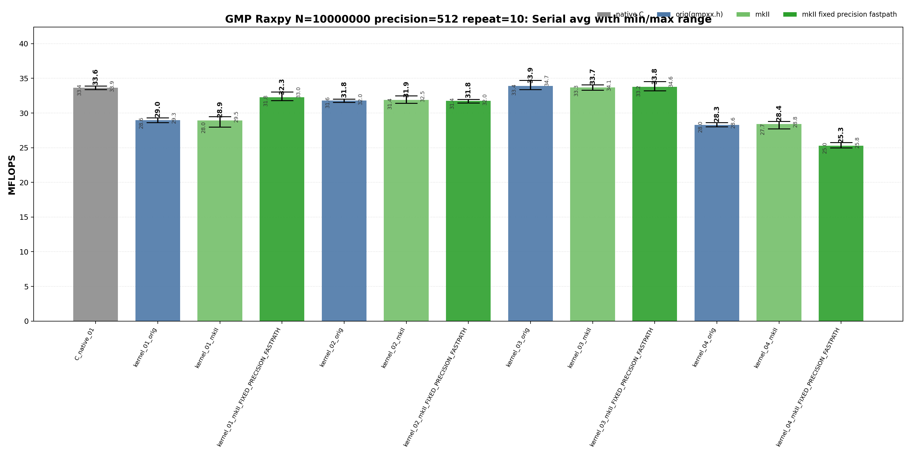
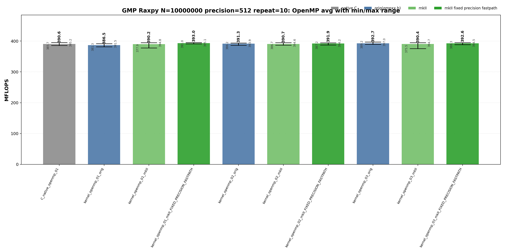

<!-- SPDX-License-Identifier: BSD-2-Clause -->
# 01_Raxpy

This benchmark measures GMP `mpf` RAXPY,

```text
y[i] <- alpha * x[i] + y[i]
```

for raw C GMP, upstream `gmpxx`, and `gmpxx_mkII` wrapper kernels. The purpose is to identify which source-level temporary lifetime and fixed-precision fastpath choices change the generated hot loop and the repeat-10 MFLOPS distribution.

## Build

From the repository root:

```bash
cmake -S . -B build_bench_release -DCMAKE_BUILD_TYPE=Release
cmake --build build_bench_release -j --target Raxpy_gmp_C_native_01 Raxpy_gmp_C_native_openmp_01 Raxpy_gmp_kernel_03_mkII
```

The full run used all GMP Raxpy targets under:

```text
build_bench_release/benchmarks/gmp/01_Raxpy/
```

Each executable takes:

```text
<vector size> <precision-bits>
```

Example:

```bash
build_bench_release/benchmarks/gmp/01_Raxpy/Raxpy_gmp_kernel_03_mkII 10000000 512
```

OpenMP variants use the same executable arguments. The recorded run used:

```bash
OMP_NUM_THREADS=32 OMP_PLACES=cores OMP_PROC_BIND=spread \
    build_bench_release/benchmarks/gmp/01_Raxpy/Raxpy_gmp_kernel_openmp_03_mkII 10000000 512
```

## Kernel Shapes

| Variant | Timed source shape | Temporary/resource policy | Purpose |
|---------|--------------------|---------------------------|---------|
| `01` | `y[i] += alpha * x[i]` | Product is expressed as an ET expression. | Test expression materialization and fixed-precision scratch behavior. |
| `02` | `temp = alpha; temp *= x[i]; y[i] += temp` | One reusable product object outside the loop. | Test explicit copy-then-multiply source shape. |
| `03` | `temp = alpha * x[i]; y[i] += temp` | One reusable product object outside the loop. | Test the closest C++ wrapper spelling to the raw C reusable-temp baseline. |
| `04` | `mpf_class temp = alpha * x[i]; y[i] += temp` | Product object lifetime is inside the loop. | Stress per-iteration construction. |
| `openmp_01` | Parallel `01` | OpenMP static partition; per-worker resources where applicable. | Compare expression spelling under parallel memory traffic. |
| `openmp_02` | Parallel `02` | One reusable product object per worker. | Compare explicit copy-then-multiply under OpenMP. |
| `openmp_03` | Parallel `03` | One reusable product object per worker. | Compare reusable-product wrapper source with raw C OpenMP. |

## C Native Equivalent Kernels

| C native kernel | Closest wrapper kernel | Equivalence |
|-----------------|------------------------|-------------|
| `C_native_01` | `kernel_03_orig`, `kernel_03_mkII`, `kernel_03_mkII_FIXED_PRECISION_FASTPATH` | Same timed hot-loop class: one reusable product temporary outside the loop, one `mpf_mul`, and one `mpf_add` per element. |
| `C_native_openmp_01` | `kernel_openmp_03_orig`, `kernel_openmp_03_mkII`, `kernel_openmp_03_mkII_FIXED_PRECISION_FASTPATH` | Same per-worker class: each worker owns one product temporary and updates a contiguous slice of `y`. |
| none | `kernel_01_*` | Expression-template spelling has no exact raw C source equivalent; the fixed-precision mkII build can still lower into the reusable-temp performance class. |
| none | `kernel_02_*` | Copy-then-multiply source shape is intentionally different from the raw C multiply-into-temp baseline. |
| none | `kernel_04_*` | Loop-local construction stress case; the raw C matrix does not include an init/clear-inside-loop equivalent. |

## Recorded Run

| Field | Value |
|-------|-------|
| Run ID | `raxpy_gmp_n10000000_p512_repeat10_20260522_214039` |
| Problem size | `N=10000000` |
| Precision | `512` bits |
| Repeat count | `10` |
| Compiler | `g++ (Ubuntu 15.2.0-16ubuntu1) 15.2.0` |
| Build type | `Release` |
| CPU | `AMD Ryzen Threadripper 3970X 32-Core Processor` |
| OS | `Linux 7c430536ccee 6.8.0-94-generic x86_64` |
| OpenMP | `OMP_NUM_THREADS=32`, `OMP_PLACES=cores`, `OMP_PROC_BIND=spread` |
| Raw directory | `benchmarks/gmp/01_Raxpy/results_raw/raxpy_gmp_n10000000_p512_repeat10_20260522_214039` |
| Raw log | `benchmarks/gmp/01_Raxpy/results_raw/raxpy_gmp_n10000000_p512_repeat10_20260522_214039/benchmark_raxpy_gmp_n10000000_p512_repeat10.log` |
| Raw CSV | `benchmarks/gmp/01_Raxpy/results_raw/raxpy_gmp_n10000000_p512_repeat10_20260522_214039/raw_raxpy_gmp_n10000000_p512_repeat10.csv` |
| Summary CSV | `benchmarks/gmp/01_Raxpy/results_raw/raxpy_gmp_n10000000_p512_repeat10_20260522_214039/summary_raxpy_gmp_n10000000_p512_repeat10.csv` |
| Correctness | All variants reported `Result OK` for all repeats. |

Plot regeneration:

```bash
python3 benchmarks/gmp/01_Raxpy/plot_repeat_summary.py \
    benchmarks/gmp/01_Raxpy/results_raw/raxpy_gmp_n10000000_p512_repeat10_20260522_214039/summary_raxpy_gmp_n10000000_p512_repeat10.csv \
    --output-prefix benchmarks/gmp/01_Raxpy/results_raw/raxpy_gmp_n10000000_p512_repeat10_20260522_214039/raxpy_gmp_n10000000_p512_repeat10 \
    --title-prefix "GMP Raxpy N=10000000 precision=512 repeat=10"
```





## Headline Results

| Metric | Variant | Value | Interpretation |
|--------|---------|-------|----------------|
| Best serial max | `kernel_03_orig` | 34.735 MFLOPS | Reusable product object is the best serial class. |
| Best serial average | `kernel_03_orig` | 33.908 MFLOPS | Same `03` reusable-product source is also best by repeat average. |
| Best OpenMP max | `kernel_openmp_03_orig` | 396.989 MFLOPS | OpenMP top variants differ by small run-to-run variance. |
| Best OpenMP average | `kernel_openmp_01_mkII_FIXED_PRECISION_FASTPATH` | 393.019 MFLOPS | Fixed-precision expression spelling has the best repeat average in this run. |
| Best average OpenMP / best average serial | `kernel_openmp_01_mkII_FIXED_PRECISION_FASTPATH` / `kernel_03_orig` | 11.59x | Parallel scaling is useful, but far from 32x because each update streams scattered GMP limb storage. |

## Serial Results

| Variant | Max MFLOPS | Avg MFLOPS | Min MFLOPS | Var MFLOPS | Stddev MFLOPS | Interpretation |
|---------|------------|------------|------------|------------|---------------|----------------|
| `C_native_01` | 33.910 | 33.634 | 33.378 | 0.032 | 0.180 | Raw C baseline with one `mpf_t temp` initialized outside the timed loop; one `mpf_mul` and one `mpf_add` per element. |
| `kernel_01_orig` | 29.329 | 28.969 | 28.620 | 0.059 | 0.243 | Expression spelling `y[i] += alpha * x[i]`; product materialization is controlled by upstream gmpxx expression lowering. |
| `kernel_01_mkII` | 29.504 | 28.928 | 27.968 | 0.220 | 0.469 | mkII expression spelling `y[i] += alpha * x[i]`; baseline expression path remains below the reusable-temp class in serial. |
| `kernel_01_mkII_FIXED_PRECISION_FASTPATH` | 33.042 | 32.259 | 31.806 | 0.137 | 0.370 | Expression spelling with fixed-precision scratch fastpath; removes enough wrapper overhead to approach the raw reusable-temp baseline. |
| `kernel_02_orig` | 32.026 | 31.802 | 31.560 | 0.020 | 0.141 | One reusable product object, copy `alpha` then multiply in place; avoids loop-local construction but has an extra copy source shape. |
| `kernel_02_mkII` | 32.468 | 31.869 | 31.412 | 0.066 | 0.258 | mkII copy-then-multiply reusable object; same performance class as upstream orig for this source shape. |
| `kernel_02_mkII_FIXED_PRECISION_FASTPATH` | 31.977 | 31.754 | 31.441 | 0.029 | 0.171 | Fixed-precision build does not materially change this explicit reusable-temp source shape. |
| `kernel_03_orig` | 34.735 | 33.908 | 33.389 | 0.198 | 0.445 | Reusable product object assigned from `alpha * x[i]`; closest C++ equivalent to the raw C reusable-temp kernel and best serial class in this run. |
| `kernel_03_mkII` | 34.056 | 33.682 | 33.287 | 0.051 | 0.225 | mkII reusable-product source; disassembly shows the same one `mpf_mul` plus one `mpf_add` hot loop class as C native. |
| `kernel_03_mkII_FIXED_PRECISION_FASTPATH` | 34.553 | 33.759 | 33.235 | 0.136 | 0.369 | Fixed-precision build keeps the same hot loop class as mkII `03`; differences are within serial run variance. |
| `kernel_04_orig` | 28.649 | 28.281 | 28.035 | 0.039 | 0.197 | Loop-local product object; temporary lifetime is inside the loop and remains expensive. |
| `kernel_04_mkII` | 28.792 | 28.409 | 27.724 | 0.106 | 0.326 | mkII loop-local product object; same slow class as upstream orig because source-level lifetime dominates. |
| `kernel_04_mkII_FIXED_PRECISION_FASTPATH` | 25.775 | 25.301 | 25.003 | 0.036 | 0.190 | Fixed-precision fastpath does not rescue the explicit loop-local construction shape in this run. |

<details>
<summary>Serial results sorted by Max MFLOPS</summary>

| Rank | Variant | Max MFLOPS | Avg MFLOPS | Min MFLOPS | Var MFLOPS |
|------|---------|------------|------------|------------|------------|
| 1 | `kernel_03_orig` | 34.735 | 33.908 | 33.389 | 0.198 |
| 2 | `kernel_03_mkII_FIXED_PRECISION_FASTPATH` | 34.553 | 33.759 | 33.235 | 0.136 |
| 3 | `kernel_03_mkII` | 34.056 | 33.682 | 33.287 | 0.051 |
| 4 | `C_native_01` | 33.910 | 33.634 | 33.378 | 0.032 |
| 5 | `kernel_01_mkII_FIXED_PRECISION_FASTPATH` | 33.042 | 32.259 | 31.806 | 0.137 |
| 6 | `kernel_02_mkII` | 32.468 | 31.869 | 31.412 | 0.066 |
| 7 | `kernel_02_orig` | 32.026 | 31.802 | 31.560 | 0.020 |
| 8 | `kernel_02_mkII_FIXED_PRECISION_FASTPATH` | 31.977 | 31.754 | 31.441 | 0.029 |
| 9 | `kernel_01_mkII` | 29.504 | 28.928 | 27.968 | 0.220 |
| 10 | `kernel_01_orig` | 29.329 | 28.969 | 28.620 | 0.059 |
| 11 | `kernel_04_mkII` | 28.792 | 28.409 | 27.724 | 0.106 |
| 12 | `kernel_04_orig` | 28.649 | 28.281 | 28.035 | 0.039 |
| 13 | `kernel_04_mkII_FIXED_PRECISION_FASTPATH` | 25.775 | 25.301 | 25.003 | 0.036 |

</details>

<details>
<summary>Serial results sorted by Avg MFLOPS</summary>

| Rank | Variant | Max MFLOPS | Avg MFLOPS | Min MFLOPS | Var MFLOPS |
|------|---------|------------|------------|------------|------------|
| 1 | `kernel_03_orig` | 34.735 | 33.908 | 33.389 | 0.198 |
| 2 | `kernel_03_mkII_FIXED_PRECISION_FASTPATH` | 34.553 | 33.759 | 33.235 | 0.136 |
| 3 | `kernel_03_mkII` | 34.056 | 33.682 | 33.287 | 0.051 |
| 4 | `C_native_01` | 33.910 | 33.634 | 33.378 | 0.032 |
| 5 | `kernel_01_mkII_FIXED_PRECISION_FASTPATH` | 33.042 | 32.259 | 31.806 | 0.137 |
| 6 | `kernel_02_mkII` | 32.468 | 31.869 | 31.412 | 0.066 |
| 7 | `kernel_02_orig` | 32.026 | 31.802 | 31.560 | 0.020 |
| 8 | `kernel_02_mkII_FIXED_PRECISION_FASTPATH` | 31.977 | 31.754 | 31.441 | 0.029 |
| 9 | `kernel_01_orig` | 29.329 | 28.969 | 28.620 | 0.059 |
| 10 | `kernel_01_mkII` | 29.504 | 28.928 | 27.968 | 0.220 |
| 11 | `kernel_04_mkII` | 28.792 | 28.409 | 27.724 | 0.106 |
| 12 | `kernel_04_orig` | 28.649 | 28.281 | 28.035 | 0.039 |
| 13 | `kernel_04_mkII_FIXED_PRECISION_FASTPATH` | 25.775 | 25.301 | 25.003 | 0.036 |

</details>

## OpenMP Results

| Variant | Max MFLOPS | Avg MFLOPS | Min MFLOPS | Var MFLOPS | Stddev MFLOPS | Interpretation |
|---------|------------|------------|------------|------------|---------------|----------------|
| `C_native_openmp_01` | 395.204 | 390.629 | 385.749 | 9.120 | 3.020 | Raw C OpenMP baseline; each worker reuses a private `mpf_t temp`, then updates its assigned contiguous `y` slice. |
| `kernel_openmp_01_orig` | 391.480 | 386.546 | 381.336 | 7.425 | 2.725 | OpenMP expression spelling; generated worker loop stays in the same broad class as the raw OpenMP baseline. |
| `kernel_openmp_01_mkII` | 394.816 | 390.218 | 377.921 | 19.320 | 4.395 | mkII OpenMP expression spelling; one low repeat creates higher variance, but max performance matches the top class. |
| `kernel_openmp_01_mkII_FIXED_PRECISION_FASTPATH` | 395.063 | 393.019 | 391.013 | 1.567 | 1.252 | OpenMP expression spelling with fixed-precision scratch; best average MFLOPS in this run and low variance. |
| `kernel_openmp_02_orig` | 393.950 | 391.322 | 386.174 | 6.306 | 2.511 | OpenMP copy-then-multiply reusable object; per-thread temp is outside the worker loop. |
| `kernel_openmp_02_mkII` | 394.626 | 390.735 | 386.714 | 6.079 | 2.466 | mkII OpenMP copy-then-multiply source; same performance class as orig and C native. |
| `kernel_openmp_02_mkII_FIXED_PRECISION_FASTPATH` | 394.185 | 391.939 | 387.192 | 3.474 | 1.864 | Fixed-precision build is still in the same OpenMP memory-traffic class. |
| `kernel_openmp_03_orig` | 396.989 | 392.657 | 389.225 | 4.681 | 2.164 | OpenMP reusable product object; best max MFLOPS in this run, but only marginally above other top-class OpenMP variants. |
| `kernel_openmp_03_mkII` | 394.688 | 390.391 | 375.463 | 27.591 | 5.253 | mkII OpenMP reusable-product source; one slow repeat increases variance while the max remains top-class. |
| `kernel_openmp_03_mkII_FIXED_PRECISION_FASTPATH` | 394.542 | 392.564 | 388.286 | 2.706 | 1.645 | Fixed-precision OpenMP reusable-product source; average is close to the best OpenMP class with lower variance than baseline mkII `03`. |

<details>
<summary>OpenMP results sorted by Max MFLOPS</summary>

| Rank | Variant | Max MFLOPS | Avg MFLOPS | Min MFLOPS | Var MFLOPS |
|------|---------|------------|------------|------------|------------|
| 1 | `kernel_openmp_03_orig` | 396.989 | 392.657 | 389.225 | 4.681 |
| 2 | `C_native_openmp_01` | 395.204 | 390.629 | 385.749 | 9.120 |
| 3 | `kernel_openmp_01_mkII_FIXED_PRECISION_FASTPATH` | 395.063 | 393.019 | 391.013 | 1.567 |
| 4 | `kernel_openmp_01_mkII` | 394.816 | 390.218 | 377.921 | 19.320 |
| 5 | `kernel_openmp_03_mkII` | 394.688 | 390.391 | 375.463 | 27.591 |
| 6 | `kernel_openmp_02_mkII` | 394.626 | 390.735 | 386.714 | 6.079 |
| 7 | `kernel_openmp_03_mkII_FIXED_PRECISION_FASTPATH` | 394.542 | 392.564 | 388.286 | 2.706 |
| 8 | `kernel_openmp_02_mkII_FIXED_PRECISION_FASTPATH` | 394.185 | 391.939 | 387.192 | 3.474 |
| 9 | `kernel_openmp_02_orig` | 393.950 | 391.322 | 386.174 | 6.306 |
| 10 | `kernel_openmp_01_orig` | 391.480 | 386.546 | 381.336 | 7.425 |

</details>

<details>
<summary>OpenMP results sorted by Avg MFLOPS</summary>

| Rank | Variant | Max MFLOPS | Avg MFLOPS | Min MFLOPS | Var MFLOPS |
|------|---------|------------|------------|------------|------------|
| 1 | `kernel_openmp_01_mkII_FIXED_PRECISION_FASTPATH` | 395.063 | 393.019 | 391.013 | 1.567 |
| 2 | `kernel_openmp_03_orig` | 396.989 | 392.657 | 389.225 | 4.681 |
| 3 | `kernel_openmp_03_mkII_FIXED_PRECISION_FASTPATH` | 394.542 | 392.564 | 388.286 | 2.706 |
| 4 | `kernel_openmp_02_mkII_FIXED_PRECISION_FASTPATH` | 394.185 | 391.939 | 387.192 | 3.474 |
| 5 | `kernel_openmp_02_orig` | 393.950 | 391.322 | 386.174 | 6.306 |
| 6 | `kernel_openmp_02_mkII` | 394.626 | 390.735 | 386.714 | 6.079 |
| 7 | `C_native_openmp_01` | 395.204 | 390.629 | 385.749 | 9.120 |
| 8 | `kernel_openmp_03_mkII` | 394.688 | 390.391 | 375.463 | 27.591 |
| 9 | `kernel_openmp_01_mkII` | 394.816 | 390.218 | 377.921 | 19.320 |
| 10 | `kernel_openmp_01_orig` | 391.480 | 386.546 | 381.336 | 7.425 |

</details>

## Memory Bandwidth Estimates

These are model estimates, not hardware-counter measurements. At 512-bit precision, this report assumes 8 used limbs per `mpf_t` value, 8 bytes per limb, and a 24-byte `mpf_t` header on this x86_64 build. The timed RAXPY loop reads `x`, reads and writes `y`, and keeps `alpha` hot.

| Model | Bytes/element |
|-------|---------------|
| Limb-only active traffic | `x` limbs read 64 B + `y` limbs read 64 B + `y` limbs write 64 B = 192 B |
| Header-inclusive active traffic | `x` header+limbs read 88 B + `y` header+limbs read 88 B + `y` header+limbs write 88 B = 264 B |
| Timed active footprint | `x` + `y` headers and limbs: about 1.76 GB for `N=10000000`, excluding allocator metadata. |
| Full check footprint | `x` + `y` + `yy`: about 2.64 GB, but `yy` is outside the timed RAXPY loop. |

Conversion formula:

```text
GB/s = MFLOPS * bytes_per_element / 2000
```

| Case | MFLOPS source | Bytes/element model | Estimated GB/s | Notes |
|------|---------------|---------------------|----------------|-------|
| Best serial average `kernel_03_orig` | 33.908 | Limb-only active traffic: 192 B/element | 3.26 | Model estimate, not hardware counters. |
| Best serial average `kernel_03_orig` | 33.908 | Header-inclusive active traffic: 264 B/element | 4.48 | Model estimate, not hardware counters. |
| Best OpenMP average `kernel_openmp_01_mkII_FIXED_PRECISION_FASTPATH` | 393.019 | Limb-only active traffic: 192 B/element | 37.73 | Model estimate, not hardware counters. |
| Best OpenMP average `kernel_openmp_01_mkII_FIXED_PRECISION_FASTPATH` | 393.019 | Header-inclusive active traffic: 264 B/element | 51.88 | Model estimate, not hardware counters. |
| Best OpenMP max `kernel_openmp_03_orig` | 396.989 | Limb-only active traffic: 192 B/element | 38.11 | Model estimate, not hardware counters. |
| Best OpenMP max `kernel_openmp_03_orig` | 396.989 | Header-inclusive active traffic: 264 B/element | 52.40 | Model estimate, not hardware counters. |

## Hotpath Disassembly

Representative command shape:

```bash
objdump -Cd --no-show-raw-insn build_bench_release/benchmarks/gmp/01_Raxpy/<binary>
```

`C_native_01` has one `mpf_t temp` initialized before the loop and cleared after the loop. The hot loop has exactly one `__gmpf_mul` and one `__gmpf_add` per element.

```asm
3c0d: call   __gmpf_init@plt
3c20: mov    %rbp,%rdx        # x[i]
3c23: mov    %r14,%rsi        # alpha
3c26: mov    %rsp,%rdi        # temp
3c2d: call   __gmpf_mul@plt
3c32: mov    %rbx,%rsi        # y[i]
3c35: mov    %rbx,%rdi        # y[i]
3c38: mov    %rsp,%rdx        # temp
3c3b: call   __gmpf_add@plt
3c40: add    $0x18,%rbp       # x++
3c44: add    $0x18,%rbx       # y++
3c4b: jne    3c20
3c50: call   __gmpf_clear@plt
```

`kernel_03_orig` lowers to the same hot-loop class as C native: reusable temporary outside the loop and one multiply/add pair inside the loop.

```asm
328d: call   __gmpf_init@plt
32a0: mov    %rbp,%rdx        # x[i]
32a3: mov    %r14,%rsi        # alpha
32a6: mov    %rsp,%rdi        # temp
32a9: call   __gmpf_mul@plt
32ae: mov    %rsp,%rdx        # temp
32b1: mov    %rbx,%rsi        # y[i]
32b4: mov    %rbx,%rdi        # y[i]
32b7: call   __gmpf_add@plt
32c0: add    $0x18,%rbp
32c4: add    $0x18,%rbx
32cb: jne    32a0
32d0: call   __gmpf_clear@plt
```

`kernel_03_mkII` also reaches the same arithmetic loop. The wrapper-owned default precision guard and `mpf_init2` occur before the loop; the loop body still has one backend multiply and one backend add per element.

```asm
5076: movzbl default_mpf_precision_guard,%eax
5089: test   %al,%al
509e: call   __gmpf_init2@plt
50c0: mov    %rbp,%rdx        # x[i]
50c3: mov    %r14,%rsi        # alpha
50c6: mov    %rsp,%rdi        # temp
50c9: call   __gmpf_mul@plt
50ce: mov    %rsp,%rdx        # temp
50d1: mov    %rbx,%rsi        # y[i]
50d4: mov    %rbx,%rdi        # y[i]
50d7: call   __gmpf_add@plt
50e0: add    $0x18,%rbp
50e4: add    $0x18,%rbx
50eb: jne    50c0
50f0: call   __gmpf_clear@plt
```

`kernel_openmp_03_orig` and `kernel_openmp_03_mkII` both use an OpenMP outlined worker. The hot worker loop is still one `mpf_mul` plus one `mpf_add`; the `GOMP_barrier` and `mpf_clear` are after the per-worker loop.

```asm
# kernel_openmp_03_orig worker
2f60: mov    0x8(%r15),%rsi   # alpha
2f64: mov    %r12,%rdx        # x[i]
2f67: lea    0x10(%rsp),%rdi  # temp
2f74: call   __gmpf_mul@plt
2f79: mov    %rbp,%rsi        # y[i]
2f7c: mov    %rbp,%rdi        # y[i]
2f7f: lea    0x10(%rsp),%rdx  # temp
2f84: call   __gmpf_add@plt
2f89: add    $0x18,%rbp
2f90: jne    2f60
2f92: call   GOMP_barrier@plt
2f9c: call   __gmpf_clear@plt

# kernel_openmp_03_mkII worker
4c70: mov    0x8(%r15),%rsi   # alpha
4c74: mov    %r13,%rdx        # x[i]
4c77: lea    0x10(%rsp),%rdi  # temp
4c84: call   __gmpf_mul@plt
4c89: mov    %rbp,%rsi        # y[i]
4c8c: mov    %rbp,%rdi        # y[i]
4c8f: lea    0x10(%rsp),%rdx  # temp
4c94: call   __gmpf_add@plt
4c99: add    $0x18,%rbp
4ca0: jne    4c70
4ca2: call   GOMP_barrier@plt
4cac: call   __gmpf_clear@plt
```

## Lessons Learned

The main serial boundary is temporary lifetime. `kernel_03` and C native share the practical reusable-product baseline, while `kernel_04` pays for loop-local product construction and drops into a slower class. `kernel_01_mkII_FIXED_PRECISION_FASTPATH` improves the expression spelling, but the explicit reusable-product source remains the clean serial baseline.

OpenMP changes the dominant boundary. Most OpenMP variants cluster around 390 MFLOPS average because the worker hot loop is the same multiply/add sequence and the workload streams `mpf_t` headers plus separately allocated limb storage. The best max and best average variants differ, so single-run ordering is less meaningful than performance class and variance.

The generated hot loop is the deciding evidence. For the important `03` variants, C native, upstream orig, and mkII all execute one backend multiply and one backend add per element with temporary initialization outside the hot loop. Wrapper syntax is not the bottleneck once the source shape makes temporary lifetime explicit.
