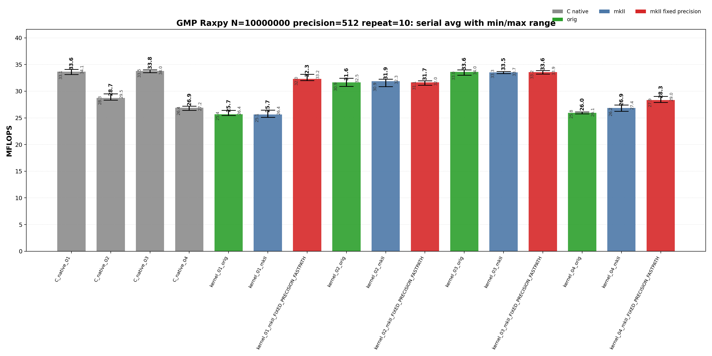
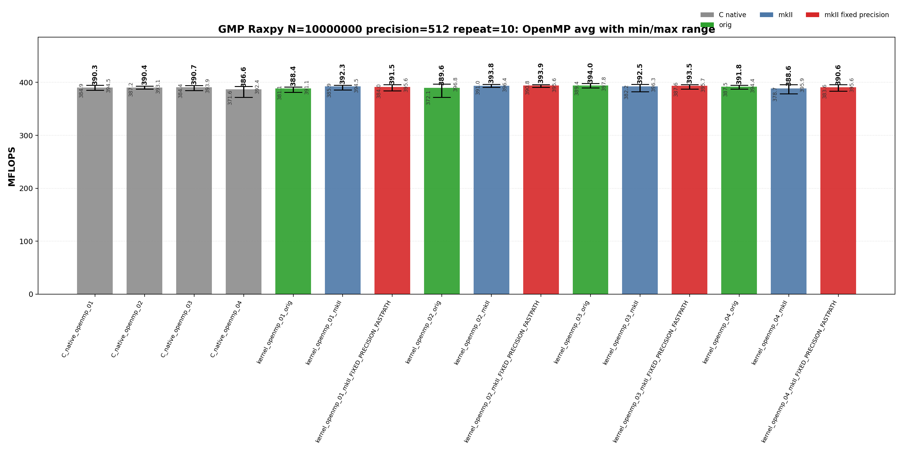

<!-- SPDX-License-Identifier: BSD-2-Clause -->
# 01_Raxpy

This benchmark measures GMP `mpf` RAXPY,

```text
y[i] <- alpha * x[i] + y[i]
```

for raw C GMP, upstream `gmpxx`, and `gmpxx_mkII` wrapper kernels. The purpose is to identify which source-level temporary lifetime and fixed-precision fastpath choices change the generated hot loop and the repeat-10 MFLOPS distribution at 512-bit and 1024-bit precision.

## Build

From the repository root:

```bash
cmake -S . -B build_bench_release -DCMAKE_BUILD_TYPE=Release
cmake --build build_bench_release -j --target Raxpy_gmp_C_native_01 Raxpy_gmp_C_native_02 Raxpy_gmp_C_native_03 Raxpy_gmp_C_native_04 Raxpy_gmp_C_native_openmp_01 Raxpy_gmp_C_native_openmp_02 Raxpy_gmp_C_native_openmp_03 Raxpy_gmp_C_native_openmp_04 Raxpy_gmp_kernel_03_mkII
```

The GMP Raxpy target set is built under:

```text
build_bench_release/benchmarks/gmp/01_Raxpy/
```

Each executable takes:

```text
<vector size> <precision-bits>
```

Example:

```bash
build_bench_release/benchmarks/gmp/01_Raxpy/Raxpy_gmp_kernel_03_mkII 10000000 1024
```

OpenMP variants use the same executable arguments. The recorded run used:

```bash
OMP_NUM_THREADS=32 OMP_PLACES=cores OMP_PROC_BIND=spread \
    build_bench_release/benchmarks/gmp/01_Raxpy/Raxpy_gmp_kernel_openmp_03_mkII 10000000 1024
```

The cross-benchmark runner can execute the GMP and MPFR `00_Rdot`, `01_Raxpy`, and `02_Rgemv` suites for both standard precisions with one command:

```bash
OMP_NUM_THREADS=32 OMP_PLACES=cores OMP_PROC_BIND=spread \
    benchmarks/run_all.sh build_bench_release 512,1024 10 10000000 10000000 4000 4000
```

The second argument is a precision list. `both` and `all` are aliases for `512,1024`; a single value such as `512` still runs only that precision. Per-benchmark results are written to `results_raw/run_all_p512_repeat10_<timestamp>/` and `results_raw/run_all_p1024_repeat10_<timestamp>/` under each benchmark directory.

## Benchmark Parameters

| Parameter | Meaning |
| --- | --- |
| `N` | Number of vector elements. |
| `precision` | Requested GMP `mpf` precision in bits for `alpha`, `x`, and `y`. |
| `repeat` | Number of timed process executions per executable. |
| `OMP_NUM_THREADS` | OpenMP worker count for `openmp` executables. |
| `OMP_PLACES`, `OMP_PROC_BIND` | OpenMP affinity controls used by the runner. |

The committed runs use `N=10000000`, `repeat=10`, `precision=512` and `precision=1024`, with `OMP_NUM_THREADS=32`, `OMP_PLACES=cores`, and `OMP_PROC_BIND=spread`.

## Variant Shapes

The timed body is `_Raxpy()`. The same numeric suffix is used for serial and OpenMP kernels; an `openmp` executable name means the same source-level shape is run over a static worker partition with per-worker temporaries where the source shape needs them.

| Variant | Transition from previous variant | Timed source shape | Temporary/resource policy | Purpose |
| --- | --- | --- | --- | --- |
| `01` | Baseline expression-update form. | `y[i] += alpha * x[i]` | Product is expressed as an ET expression in the update. | Test expression materialization and mkII fixed-precision scratch behavior. |
| `02` | `01 -> 02`: introduce a reusable product object and copy-then-multiply source. | `temp = alpha; temp *= x[i]; y[i] += temp` | One product object is initialized before the loop and reused. | Test explicit copy-then-multiply source shape. |
| `03` | `02 -> 03`: keep reusable product lifetime but assign from the product expression. | `temp = alpha * x[i]; y[i] += temp` | One product object is initialized before the loop and assigned from the product expression. | Main reusable-product wrapper spelling; closest to the raw C reusable-temporary baseline. |
| `04` | `03 -> 04`: move product object lifetime into the timed loop. | `mpf_class temp = alpha * x[i]; y[i] += temp` | Product object lifetime is inside the loop. | Stress per-iteration construction. |

Wrapper targets append `_orig`, `_mkII`, and `_mkII_FIXED_PRECISION_FASTPATH`. Raw C provides `C_native_01` through `C_native_04` and matching `C_native_openmp_01` through `C_native_openmp_04`. `C_native_01` and `C_native_03` are both direct reusable-temporary kernels; `03` exists as the numbered raw C comparison point for wrapper variant `03`.

## Source Transitions

`01 -> 02` replaces the expression update with an explicit reusable product object and copy-then-multiply source. `02 -> 03` keeps the reusable product lifetime but assigns it from the product expression, matching the raw reusable-product hot-loop class. `03 -> 04` moves product construction into the timed loop as an allocation/lifetime stress case. OpenMP variants keep the same numeric source shape and add static partitioning; `03` is the OpenMP comparison point for `C_native_openmp_03`.

## C Native Equivalent Kernels

| C native kernel | Closest wrapper kernel | Equivalence |
|-----------------|------------------------|-------------|
| `C_native_01`, `C_native_openmp_01` | `kernel_03_*`, `kernel_openmp_03_*` | Direct reusable temporary: one `mpf_t temp` outside the loop or per OpenMP worker, then `mpf_mul(temp, alpha, x[i])` and `mpf_add(y[i], y[i], temp)` per element. |
| `C_native_02`, `C_native_openmp_02` | `kernel_02_*`, `kernel_openmp_02_*` | Copy-then-multiply reusable temporary: `mpf_set(temp, alpha)`, `mpf_mul(temp, temp, x[i])`, then `mpf_add`. |
| `C_native_03`, `C_native_openmp_03` | `kernel_03_*`, `kernel_openmp_03_*` | Numbered raw C comparison point for wrapper `03`; same direct reusable-temporary hot-loop class as `C_native_01`. |
| `C_native_04`, `C_native_openmp_04` | `kernel_04_*`, `kernel_openmp_04_*` | Loop-local construction stress case: each element performs `mpf_init`, multiply, add, and `mpf_clear` inside the timed loop. |
| none | `kernel_01_*`, `kernel_openmp_01_*` | Expression-template spelling has no exact raw C source equivalent; compare against the direct reusable-temporary C class when analyzing generated code. |

## Recorded Run

```text
N = 10000000
precision = 512 bits and 1024 bits
repeat = 10
compiler = g++ (Ubuntu 15.2.0-16ubuntu1) 15.2.0
build type = Release
CPU = AMD Ryzen Threadripper 3970X 32-Core Processor
OS = Linux 6.8.0-94-generic x86_64
OMP_NUM_THREADS = 32
OMP_PLACES = cores
OMP_PROC_BIND = spread
all timed runs = Result OK
```

### 512-bit run

| Field | Value |
|-------|-------|
| Run ID | `run_all_p512_repeat10_20260525_224339` |
| Date | 2026-05-25 |
| CPU | AMD Ryzen Threadripper 3970X 32-Core Processor |
| OS | Linux 6.8.0-94-generic x86_64 |
| Compiler | `c++ (Ubuntu 15.2.0-16ubuntu1) 15.2.0` |
| Build type | Release |
| Problem size | `N=10000000` |
| Precision | 512 bits |
| Repeat count | 10 |
| OpenMP | `OMP_NUM_THREADS=32`, `OMP_PLACES=cores`, `OMP_PROC_BIND=spread` |
| Benchmark command | `OMP_NUM_THREADS=32 OMP_PLACES=cores OMP_PROC_BIND=spread benchmarks/run_all.sh build_bench_release 512 10 10000000 10000000 4000 4000` |
| Raw result directory | `benchmarks/gmp/01_Raxpy/results_raw/run_all_p512_repeat10_20260525_224339/` |
| Raw log | `benchmarks/gmp/01_Raxpy/results_raw/run_all_p512_repeat10_20260525_224339/benchmark_raxpy_gmp_n10000000_p512_repeat10.log` |
| Raw CSV | `benchmarks/gmp/01_Raxpy/results_raw/run_all_p512_repeat10_20260525_224339/raw_raxpy_gmp_n10000000_p512_repeat10.csv` |
| Summary CSV | `benchmarks/gmp/01_Raxpy/results_raw/run_all_p512_repeat10_20260525_224339/summary_raxpy_gmp_n10000000_p512_repeat10.csv` |
| Correctness | 320 / 320 runs reported OK. |





Plot regeneration command:

```bash
python3 benchmarks/gmp/01_Raxpy/plot_repeat_summary.py \
    benchmarks/gmp/01_Raxpy/results_raw/run_all_p512_repeat10_20260525_224339/benchmark_raxpy_gmp_n10000000_p512_repeat10.log \
    --output-dir benchmarks/gmp/01_Raxpy/results_raw/run_all_p512_repeat10_20260525_224339 \
    --output-prefix raxpy_gmp_n10000000_p512_repeat10 \
    --title-prefix "GMP Raxpy N=10000000, precision=512, repeat=10"
```

### 1024-bit run

No current 1024-bit `run_all` result directory is present under this benchmark's `results_raw/` tree. Run `benchmarks/run_all.sh build_bench_release 1024 10 10000000 10000000 4000 4000` or the default dual-precision command to regenerate this section.

## Resource or Bandwidth Estimates

The values below are model estimates derived from MFLOPS, not hardware-counter measurements. They use the current 512-bit `run_all` summary and count active limb bytes plus a header-inclusive model. They exclude allocator metadata, cache-line overfetch, instruction fetch, and final OpenMP reduction traffic.

| Case | Representative best-avg variant | Avg MFLOPS | Active bytes/iteration | Header-inclusive bytes/iteration | Active GB/s | Header-inclusive GB/s |
| --- | --- | --- | --- | --- | --- | --- |
| 512-bit serial | `C_native_03` | 33.780 | 192 | 264 | 3.243 | 4.459 |
| 512-bit OpenMP | `kernel_openmp_03_orig` | 394.012 | 192 | 264 | 37.825 | 52.010 |

For matrix-vector benchmarks, the per-iteration byte model is a compact active-data estimate for the arithmetic stream, not a full matrix-footprint or cache-reuse model.
## Headline Results

The 512-bit headline rows below are regenerated from `benchmarks/gmp/01_Raxpy/results_raw/run_all_p512_repeat10_20260525_224339/summary_raxpy_gmp_n10000000_p512_repeat10.csv`. No 1024-bit raw data is present in the current `results_raw/` tree, so 1024-bit result sections are placeholders until a fresh 1024-bit `run_all` result is collected.

| Precision | Class | Variant | Max MFLOPS | Avg MFLOPS | Interpretation |
| --- | --- | --- | --- | --- | --- |
| 512 | Best serial max | `C_native_01` | 34.097 | 33.649 | Single fastest serial repeat; compare with Avg MFLOPS for stability. |
| 512 | Best serial average | `C_native_03` | 33.995 | 33.780 | Raw C reference for the numbered source shape. |
| 512 | Best OpenMP max | `kernel_openmp_03_orig` | 397.831 | 394.012 | Single fastest OpenMP repeat; OpenMP rows should be interpreted by performance class. |
| 512 | Best OpenMP average | `kernel_openmp_03_orig` | 397.831 | 394.012 | Upstream gmpxx.h wrapper; useful as the C++ wrapper comparison point for the same numbered source shape. |
## Serial Results

### 512-bit serial interpretation

These rows are derived from `benchmarks/gmp/01_Raxpy/results_raw/run_all_p512_repeat10_20260525_224339/summary_raxpy_gmp_n10000000_p512_repeat10.csv`.

| Observation | Variant | Max MFLOPS | Avg MFLOPS | Min MFLOPS | Interpretation |
| --- | --- | --- | --- | --- | --- |
| Best raw C serial avg | `C_native_03` | 33.995 | 33.780 | 33.480 | Raw C reference for the numbered source shape. |
| Best upstream serial avg | `kernel_03_orig` | 34.003 | 33.623 | 32.987 | Upstream gmpxx.h wrapper; useful as the C++ wrapper comparison point for the same numbered source shape. |
| Best mkII serial avg | `kernel_03_mkII_FIXED_PRECISION_FASTPATH` | 33.880 | 33.560 | 33.223 | Wrapper fixed-precision build; intended to remove repeated precision checks or scratch setup when the source shape allows it. |
| Best serial max | `C_native_01` | 34.097 | 33.649 | 33.134 | Raw C reference for the numbered source shape. |

<details>
<summary>512-bit serial results sorted by Max MFLOPS</summary>

| Rank | Variant | Max MFLOPS | Avg MFLOPS | Min MFLOPS |
| --- | --- | --- | --- | --- |
| 1 | `C_native_01` | 34.097 | 33.649 | 33.134 |
| 2 | `kernel_03_orig` | 34.003 | 33.623 | 32.987 |
| 3 | `C_native_03` | 33.995 | 33.780 | 33.480 |
| 4 | `kernel_03_mkII_FIXED_PRECISION_FASTPATH` | 33.880 | 33.560 | 33.223 |
| 5 | `kernel_03_mkII` | 33.717 | 33.539 | 33.320 |
| 6 | `kernel_01_mkII_FIXED_PRECISION_FASTPATH` | 33.200 | 32.315 | 31.991 |
| 7 | `kernel_02_orig` | 32.455 | 31.649 | 30.919 |
| 8 | `kernel_02_mkII` | 32.255 | 31.874 | 30.872 |
| 9 | `kernel_02_mkII_FIXED_PRECISION_FASTPATH` | 31.952 | 31.670 | 31.135 |
| 10 | `C_native_02` | 29.524 | 28.742 | 28.350 |
| 11 | `kernel_04_mkII_FIXED_PRECISION_FASTPATH` | 29.031 | 28.333 | 27.902 |
| 12 | `kernel_04_mkII` | 27.436 | 26.867 | 26.239 |
| 13 | `C_native_04` | 27.213 | 26.902 | 26.409 |
| 14 | `kernel_01_mkII` | 26.447 | 25.657 | 25.105 |
| 15 | `kernel_01_orig` | 26.437 | 25.701 | 25.444 |
| 16 | `kernel_04_orig` | 26.128 | 25.960 | 25.777 |

</details>

<details>
<summary>512-bit serial results sorted by Avg MFLOPS</summary>

| Rank | Variant | Max MFLOPS | Avg MFLOPS | Min MFLOPS |
| --- | --- | --- | --- | --- |
| 1 | `C_native_03` | 33.995 | 33.780 | 33.480 |
| 2 | `C_native_01` | 34.097 | 33.649 | 33.134 |
| 3 | `kernel_03_orig` | 34.003 | 33.623 | 32.987 |
| 4 | `kernel_03_mkII_FIXED_PRECISION_FASTPATH` | 33.880 | 33.560 | 33.223 |
| 5 | `kernel_03_mkII` | 33.717 | 33.539 | 33.320 |
| 6 | `kernel_01_mkII_FIXED_PRECISION_FASTPATH` | 33.200 | 32.315 | 31.991 |
| 7 | `kernel_02_mkII` | 32.255 | 31.874 | 30.872 |
| 8 | `kernel_02_mkII_FIXED_PRECISION_FASTPATH` | 31.952 | 31.670 | 31.135 |
| 9 | `kernel_02_orig` | 32.455 | 31.649 | 30.919 |
| 10 | `C_native_02` | 29.524 | 28.742 | 28.350 |
| 11 | `kernel_04_mkII_FIXED_PRECISION_FASTPATH` | 29.031 | 28.333 | 27.902 |
| 12 | `C_native_04` | 27.213 | 26.902 | 26.409 |
| 13 | `kernel_04_mkII` | 27.436 | 26.867 | 26.239 |
| 14 | `kernel_04_orig` | 26.128 | 25.960 | 25.777 |
| 15 | `kernel_01_orig` | 26.437 | 25.701 | 25.444 |
| 16 | `kernel_01_mkII` | 26.447 | 25.657 | 25.105 |

</details>
### 1024-bit serial interpretation

No current 1024-bit `run_all` summary CSV is present under this benchmark's `results_raw/` tree. The serial table should be regenerated after a fresh 1024-bit run is collected.

## OpenMP Results

### 512-bit OpenMP interpretation

These rows are derived from `benchmarks/gmp/01_Raxpy/results_raw/run_all_p512_repeat10_20260525_224339/summary_raxpy_gmp_n10000000_p512_repeat10.csv`.

| Observation | Variant | Max MFLOPS | Avg MFLOPS | Min MFLOPS | Interpretation |
| --- | --- | --- | --- | --- | --- |
| Best raw C OpenMP avg | `C_native_openmp_03` | 393.918 | 390.732 | 384.428 | Raw C reference for the numbered source shape. |
| Best upstream OpenMP avg | `kernel_openmp_03_orig` | 397.831 | 394.012 | 389.433 | Upstream gmpxx.h wrapper; useful as the C++ wrapper comparison point for the same numbered source shape. |
| Best mkII OpenMP avg | `kernel_openmp_02_mkII_FIXED_PRECISION_FASTPATH` | 395.629 | 393.946 | 390.827 | Wrapper fixed-precision build; intended to remove repeated precision checks or scratch setup when the source shape allows it. |
| Best OpenMP max | `kernel_openmp_03_orig` | 397.831 | 394.012 | 389.433 | Upstream gmpxx.h wrapper; useful as the C++ wrapper comparison point for the same numbered source shape. |

<details>
<summary>512-bit OpenMP results sorted by Max MFLOPS</summary>

| Rank | Variant | Max MFLOPS | Avg MFLOPS | Min MFLOPS |
| --- | --- | --- | --- | --- |
| 1 | `kernel_openmp_03_orig` | 397.831 | 394.012 | 389.433 |
| 2 | `kernel_openmp_02_orig` | 396.833 | 389.636 | 372.086 |
| 3 | `kernel_openmp_02_mkII` | 396.447 | 393.790 | 390.984 |
| 4 | `kernel_openmp_03_mkII` | 396.286 | 392.485 | 382.200 |
| 5 | `kernel_openmp_04_mkII` | 395.936 | 388.639 | 378.717 |
| 6 | `kernel_openmp_03_mkII_FIXED_PRECISION_FASTPATH` | 395.722 | 393.461 | 387.615 |
| 7 | `kernel_openmp_02_mkII_FIXED_PRECISION_FASTPATH` | 395.629 | 393.946 | 390.827 |
| 8 | `kernel_openmp_04_mkII_FIXED_PRECISION_FASTPATH` | 395.599 | 390.642 | 383.619 |
| 9 | `kernel_openmp_01_mkII_FIXED_PRECISION_FASTPATH` | 395.585 | 391.514 | 384.035 |
| 10 | `kernel_openmp_01_mkII` | 394.523 | 392.267 | 385.875 |
| 11 | `C_native_openmp_01` | 394.466 | 390.262 | 384.909 |
| 12 | `kernel_openmp_04_orig` | 394.418 | 391.794 | 387.472 |
| 13 | `C_native_openmp_03` | 393.918 | 390.732 | 384.428 |
| 14 | `C_native_openmp_02` | 393.067 | 390.381 | 387.190 |
| 15 | `C_native_openmp_04` | 392.394 | 386.627 | 371.584 |
| 16 | `kernel_openmp_01_orig` | 391.058 | 388.364 | 381.094 |

</details>

<details>
<summary>512-bit OpenMP results sorted by Avg MFLOPS</summary>

| Rank | Variant | Max MFLOPS | Avg MFLOPS | Min MFLOPS |
| --- | --- | --- | --- | --- |
| 1 | `kernel_openmp_03_orig` | 397.831 | 394.012 | 389.433 |
| 2 | `kernel_openmp_02_mkII_FIXED_PRECISION_FASTPATH` | 395.629 | 393.946 | 390.827 |
| 3 | `kernel_openmp_02_mkII` | 396.447 | 393.790 | 390.984 |
| 4 | `kernel_openmp_03_mkII_FIXED_PRECISION_FASTPATH` | 395.722 | 393.461 | 387.615 |
| 5 | `kernel_openmp_03_mkII` | 396.286 | 392.485 | 382.200 |
| 6 | `kernel_openmp_01_mkII` | 394.523 | 392.267 | 385.875 |
| 7 | `kernel_openmp_04_orig` | 394.418 | 391.794 | 387.472 |
| 8 | `kernel_openmp_01_mkII_FIXED_PRECISION_FASTPATH` | 395.585 | 391.514 | 384.035 |
| 9 | `C_native_openmp_03` | 393.918 | 390.732 | 384.428 |
| 10 | `kernel_openmp_04_mkII_FIXED_PRECISION_FASTPATH` | 395.599 | 390.642 | 383.619 |
| 11 | `C_native_openmp_02` | 393.067 | 390.381 | 387.190 |
| 12 | `C_native_openmp_01` | 394.466 | 390.262 | 384.909 |
| 13 | `kernel_openmp_02_orig` | 396.833 | 389.636 | 372.086 |
| 14 | `kernel_openmp_04_mkII` | 395.936 | 388.639 | 378.717 |
| 15 | `kernel_openmp_01_orig` | 391.058 | 388.364 | 381.094 |
| 16 | `C_native_openmp_04` | 392.394 | 386.627 | 371.584 |

</details>
### 1024-bit OpenMP interpretation

No current 1024-bit `run_all` summary CSV is present under this benchmark's `results_raw/` tree. The OpenMP table should be regenerated after a fresh 1024-bit run is collected.

## Hotpath Disassembly

Representative command shape:

```bash
objdump -Cd --no-show-raw-insn build_bench_release/benchmarks/gmp/01_Raxpy/<binary>
```

The disassembly is precision-independent for these runtime-precision kernels. The 512-bit and 1024-bit runs use the same source-level hot-loop shapes; only the limb work inside the GMP calls changes.

The snippets are representative, not exhaustive. They were selected to cover
the reusable raw C baseline, the upstream `orig` wrapper, the mkII wrapper, and
the corresponding OpenMP worker loop. Because this is a GMP report, the mkII
`kernel_03` snippets are shown next to the corresponding upstream `gmpxx.h`
`orig` snippets so the wrapper comparison is visible in the emitted loop.

`C_native_01` has one `mpf_t temp` initialized before the loop and cleared after the loop. The hot loop has exactly one `__gmpf_mul` and one `__gmpf_add` per element.

```asm
3c0d: call   __gmpf_init@plt
3c20: mov    %rbp,%rdx        # x[i]
3c23: mov    %r14,%rsi        # alpha
3c26: mov    %rsp,%rdi        # temp
3c2d: call   __gmpf_mul@plt
3c32: mov    %rbx,%rsi        # y[i]
3c35: mov    %rbx,%rdi        # y[i]
3c38: mov    %rsp,%rdx        # temp
3c3b: call   __gmpf_add@plt
3c40: add    $0x18,%rbp       # x++
3c44: add    $0x18,%rbx       # y++
3c4b: jne    3c20
3c50: call   __gmpf_clear@plt
```

`kernel_03_orig` lowers to the same hot-loop class as C native: reusable temporary outside the loop and one multiply/add pair inside the loop.

```asm
328d: call   __gmpf_init@plt
32a0: mov    %rbp,%rdx        # x[i]
32a3: mov    %r14,%rsi        # alpha
32a6: mov    %rsp,%rdi        # temp
32a9: call   __gmpf_mul@plt
32ae: mov    %rsp,%rdx        # temp
32b1: mov    %rbx,%rsi        # y[i]
32b4: mov    %rbx,%rdi        # y[i]
32b7: call   __gmpf_add@plt
32c0: add    $0x18,%rbp
32c4: add    $0x18,%rbx
32cb: jne    32a0
32d0: call   __gmpf_clear@plt
```

`kernel_03_mkII` also reaches the same arithmetic loop. The wrapper-owned default precision guard and `mpf_init2` occur before the loop; the loop body still has one backend multiply and one backend add per element.

```asm
5076: movzbl default_mpf_precision_guard,%eax
5089: test   %al,%al
509e: call   __gmpf_init2@plt
50c0: mov    %rbp,%rdx        # x[i]
50c3: mov    %r14,%rsi        # alpha
50c6: mov    %rsp,%rdi        # temp
50c9: call   __gmpf_mul@plt
50ce: mov    %rsp,%rdx        # temp
50d1: mov    %rbx,%rsi        # y[i]
50d4: mov    %rbx,%rdi        # y[i]
50d7: call   __gmpf_add@plt
50e0: add    $0x18,%rbp
50e4: add    $0x18,%rbx
50eb: jne    50c0
50f0: call   __gmpf_clear@plt
```

`kernel_openmp_03_orig` and `kernel_openmp_03_mkII` both use an OpenMP outlined worker. The hot worker loop is still one `mpf_mul` plus one `mpf_add`; the `GOMP_barrier` and `mpf_clear` are after the per-worker loop.

```asm
# kernel_openmp_03_orig worker
2f60: mov    0x8(%r15),%rsi   # alpha
2f64: mov    %r12,%rdx        # x[i]
2f67: lea    0x10(%rsp),%rdi  # temp
2f74: call   __gmpf_mul@plt
2f79: mov    %rbp,%rsi        # y[i]
2f7c: mov    %rbp,%rdi        # y[i]
2f7f: lea    0x10(%rsp),%rdx  # temp
2f84: call   __gmpf_add@plt
2f89: add    $0x18,%rbp
2f90: jne    2f60
2f92: call   GOMP_barrier@plt
2f9c: call   __gmpf_clear@plt

# kernel_openmp_03_mkII worker
4c70: mov    0x8(%r15),%rsi   # alpha
4c74: mov    %r13,%rdx        # x[i]
4c77: lea    0x10(%rsp),%rdi  # temp
4c84: call   __gmpf_mul@plt
4c89: mov    %rbp,%rsi        # y[i]
4c8c: mov    %rbp,%rdi        # y[i]
4c8f: lea    0x10(%rsp),%rdx  # temp
4c94: call   __gmpf_add@plt
4c99: add    $0x18,%rbp
4ca0: jne    4c70
4ca2: call   GOMP_barrier@plt
4cac: call   __gmpf_clear@plt
```

## Lessons Learned

The main serial boundary remains temporary lifetime. `kernel_03` and C native share the practical reusable-product baseline, while `kernel_04` pays for loop-local product construction and drops into a slower class. At 1024 bits, mkII `kernel_03` and its fixed-precision build become the best serial average class in this run, but the hot loop is still the same one multiply plus one add per element.

OpenMP changes the dominant boundary. At 512 bits most OpenMP variants cluster around 390 MFLOPS average; at 1024 bits the best OpenMP average remains near 389 MFLOPS for `kernel_openmp_03_mkII`. The extra limb work is visible in serial but not a simple 2x OpenMP slowdown, which suggests that memory traffic, call overhead, and backend limb work are all contributing.

The generated hot loop is the deciding evidence. For the important `03` variants, C native, upstream orig, and mkII all execute one backend multiply and one backend add per element with temporary initialization outside the hot loop. Wrapper syntax is not the bottleneck once the source shape makes temporary lifetime explicit.
