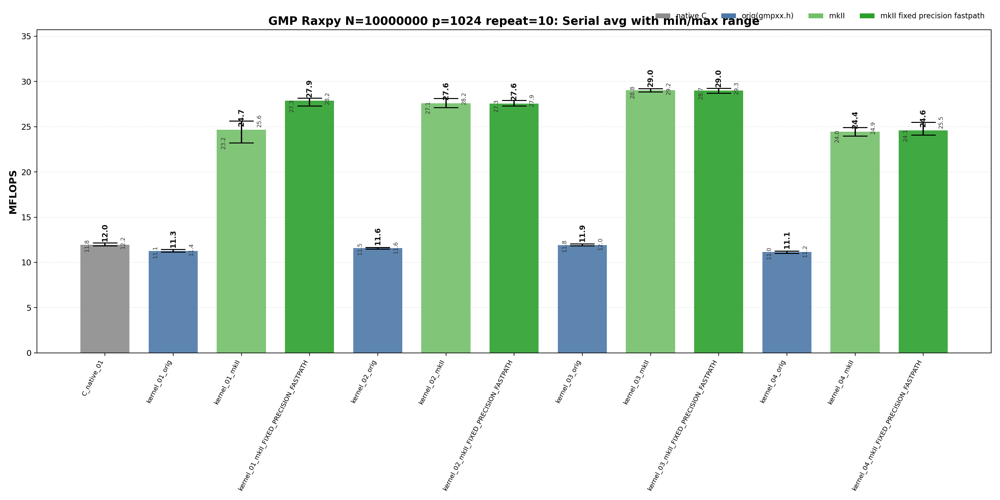
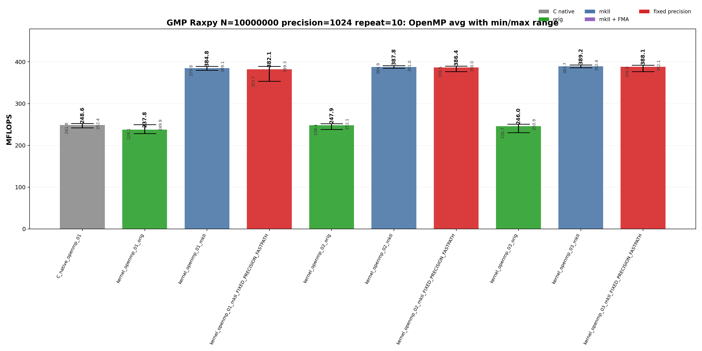

<!-- SPDX-License-Identifier: BSD-2-Clause -->
# 01_Raxpy

This benchmark measures GMP `mpf` RAXPY,

```text
y[i] <- alpha * x[i] + y[i]
```

for raw C GMP, upstream `gmpxx`, and `gmpxx_mkII` wrapper kernels. The purpose is to identify which source-level temporary lifetime and fixed-precision fastpath choices change the generated hot loop and the repeat-10 MFLOPS distribution at 512-bit and 1024-bit precision.

## Build

From the repository root:

```bash
cmake -S . -B build_bench_release -DCMAKE_BUILD_TYPE=Release
cmake --build build_bench_release -j --target Raxpy_gmp_C_native_01 Raxpy_gmp_C_native_openmp_01 Raxpy_gmp_kernel_03_mkII
```

The full run used all GMP Raxpy targets under:

```text
build_bench_release/benchmarks/gmp/01_Raxpy/
```

Each executable takes:

```text
<vector size> <precision-bits>
```

Example:

```bash
build_bench_release/benchmarks/gmp/01_Raxpy/Raxpy_gmp_kernel_03_mkII 10000000 1024
```

OpenMP variants use the same executable arguments. The recorded run used:

```bash
OMP_NUM_THREADS=32 OMP_PLACES=cores OMP_PROC_BIND=spread \
    build_bench_release/benchmarks/gmp/01_Raxpy/Raxpy_gmp_kernel_openmp_03_mkII 10000000 1024
```

## Kernel Shapes

| Variant | Timed source shape | Temporary/resource policy | Purpose |
|---------|--------------------|---------------------------|---------|
| `01` | `y[i] += alpha * x[i]` | Product is expressed as an ET expression. | Test expression materialization and fixed-precision scratch behavior. |
| `02` | `temp = alpha; temp *= x[i]; y[i] += temp` | One reusable product object outside the loop. | Test explicit copy-then-multiply source shape. |
| `03` | `temp = alpha * x[i]; y[i] += temp` | One reusable product object outside the loop. | Test the closest C++ wrapper spelling to the raw C reusable-temp baseline. |
| `04` | `mpf_class temp = alpha * x[i]; y[i] += temp` | Product object lifetime is inside the loop. | Stress per-iteration construction. |
| `openmp_01` | Parallel `01` | OpenMP static partition; per-worker resources where applicable. | Compare expression spelling under parallel memory traffic. |
| `openmp_02` | Parallel `02` | One reusable product object per worker. | Compare explicit copy-then-multiply under OpenMP. |
| `openmp_03` | Parallel `03` | One reusable product object per worker. | Compare reusable-product wrapper source with raw C OpenMP. |

## C Native Equivalent Kernels

| C native kernel | Closest wrapper kernel | Equivalence |
|-----------------|------------------------|-------------|
| `C_native_01` | `kernel_03_orig`, `kernel_03_mkII`, `kernel_03_mkII_FIXED_PRECISION_FASTPATH` | Same timed hot-loop class: one reusable product temporary outside the loop, one `mpf_mul`, and one `mpf_add` per element. |
| `C_native_openmp_01` | `kernel_openmp_03_orig`, `kernel_openmp_03_mkII`, `kernel_openmp_03_mkII_FIXED_PRECISION_FASTPATH` | Same per-worker class: each worker owns one product temporary and updates a contiguous slice of `y`. |
| none | `kernel_01_*` | Expression-template spelling has no exact raw C source equivalent; the fixed-precision mkII build can still lower into the reusable-temp performance class. |
| none | `kernel_02_*` | Copy-then-multiply source shape is intentionally different from the raw C multiply-into-temp baseline. |
| none | `kernel_04_*` | Loop-local construction stress case; the raw C matrix does not include an init/clear-inside-loop equivalent. |

## Recorded Run

```text
N = 10000000
precision = 512 bits and 1024 bits
repeat = 10
compiler = g++ (Ubuntu 15.2.0-16ubuntu1) 15.2.0
build type = Release
CPU = AMD Ryzen Threadripper 3970X 32-Core Processor
OS = Linux 6.8.0-94-generic x86_64
OMP_NUM_THREADS = 32
OMP_PLACES = cores
OMP_PROC_BIND = spread
all timed runs = Result OK
```

| Precision | Raw log | Raw CSV | Summary CSV | Serial plot | OpenMP plot |
|-----------|---------|---------|-------------|-------------|-------------|
| 512 | [log](results_raw/raxpy_gmp_n10000000_p512_repeat10_20260522_214039/benchmark_raxpy_gmp_n10000000_p512_repeat10.log) | [raw CSV](results_raw/raxpy_gmp_n10000000_p512_repeat10_20260522_214039/raw_raxpy_gmp_n10000000_p512_repeat10.csv) | [summary CSV](results_raw/raxpy_gmp_n10000000_p512_repeat10_20260522_214039/summary_raxpy_gmp_n10000000_p512_repeat10.csv) | [serial PNG](results_raw/raxpy_gmp_n10000000_p512_repeat10_20260522_214039/raxpy_gmp_n10000000_p512_repeat10_serial.png) | [OpenMP PNG](results_raw/raxpy_gmp_n10000000_p512_repeat10_20260522_214039/raxpy_gmp_n10000000_p512_repeat10_openmp.png) |
| 1024 | [log](results_raw/raxpy_gmp_n10000000_p1024_repeat10_20260523_073628/benchmark_raxpy_gmp_n10000000_p1024_repeat10.log) | [raw CSV](results_raw/raxpy_gmp_n10000000_p1024_repeat10_20260523_073628/raw_raxpy_gmp_n10000000_p1024_repeat10.csv) | [summary CSV](results_raw/raxpy_gmp_n10000000_p1024_repeat10_20260523_073628/summary_raxpy_gmp_n10000000_p1024_repeat10.csv) | [serial PNG](results_raw/raxpy_gmp_n10000000_p1024_repeat10_20260523_073628/raxpy_gmp_n10000000_p1024_repeat10_serial.png) | [OpenMP PNG](results_raw/raxpy_gmp_n10000000_p1024_repeat10_20260523_073628/raxpy_gmp_n10000000_p1024_repeat10_openmp.png) |

512-bit plots:


1024-bit plots:





Regenerate plots with:

```bash
python3 benchmarks/gmp/01_Raxpy/plot_repeat_summary.py \
    benchmarks/gmp/01_Raxpy/results_raw/raxpy_gmp_n10000000_p512_repeat10_20260522_214039/summary_raxpy_gmp_n10000000_p512_repeat10.csv \
    --output-prefix benchmarks/gmp/01_Raxpy/results_raw/raxpy_gmp_n10000000_p512_repeat10_20260522_214039/raxpy_gmp_n10000000_p512_repeat10 \
    --title-prefix "GMP Raxpy N=10000000 p=512 repeat=10"
```

```bash
python3 benchmarks/gmp/01_Raxpy/plot_repeat_summary.py \
    benchmarks/gmp/01_Raxpy/results_raw/raxpy_gmp_n10000000_p1024_repeat10_20260523_073628/summary_raxpy_gmp_n10000000_p1024_repeat10.csv \
    --output-prefix benchmarks/gmp/01_Raxpy/results_raw/raxpy_gmp_n10000000_p1024_repeat10_20260523_073628/raxpy_gmp_n10000000_p1024_repeat10 \
    --title-prefix "GMP Raxpy N=10000000 p=1024 repeat=10"
```

## Headline Results

| Precision | Class | Variant | Max MFLOPS | Avg MFLOPS | Interpretation |
|-----------|-------|---------|-----------:|-----------:|----------------|
| 512 | Best serial max | `kernel_03_orig` | 34.735 | 33.908 | Peak serial repeat for this precision. |
| 512 | Best serial average | `kernel_03_orig` | 34.735 | 33.908 | Best repeat-10 serial average for this precision. |
| 512 | Best OpenMP max | `kernel_openmp_03_orig` | 396.989 | 392.657 | Peak OpenMP repeat for this precision. |
| 512 | Best OpenMP average | `kernel_openmp_01_mkII_FIXED_PRECISION_FASTPATH` | 395.063 | 393.019 | Best repeat-10 OpenMP average for this precision. |
| 1024 | Best serial max | `kernel_03_mkII_FIXED_PRECISION_FASTPATH` | 29.268 | 28.994 | Peak serial repeat for this precision. |
| 1024 | Best serial average | `kernel_03_mkII` | 29.231 | 29.033 | Best repeat-10 serial average for this precision. |
| 1024 | Best OpenMP max | `kernel_openmp_03_mkII` | 392.388 | 389.155 | Peak OpenMP repeat for this precision. |
| 1024 | Best OpenMP average | `kernel_openmp_03_mkII` | 392.388 | 389.155 | Best repeat-10 OpenMP average for this precision. |

Precision scaling by best average:

| Mode | 512-bit best avg | 1024-bit best avg | 1024/512 ratio | Interpretation |
|------|-----------------:|------------------:|---------------:|----------------|
| Serial | 33.908 (`kernel_03_orig`) | 29.033 (`kernel_03_mkII`) | 0.856 | 1024-bit uses twice the limb count, so lower MFLOPS is expected; the OpenMP class remains much closer for streaming-heavy paths. |
| OpenMP | 393.019 (`kernel_openmp_01_mkII_FIXED_PRECISION_FASTPATH`) | 389.155 (`kernel_openmp_03_mkII`) | 0.990 | 1024-bit uses twice the limb count, so lower MFLOPS is expected; the OpenMP class remains much closer for streaming-heavy paths. |

## Serial Results

### 512-bit Serial Results

<details>
<summary>512-bit Serial results sorted by Max MFLOPS</summary>

| Rank | Variant | Max MFLOPS | Avg MFLOPS | Min MFLOPS | Var MFLOPS | Stddev MFLOPS |
|------|---------|-----------:|-----------:|-----------:|-----------:|--------------:|
| 1 | `kernel_03_orig` | 34.735 | 33.908 | 33.389 | 0.198 | 0.445 |
| 2 | `kernel_03_mkII_FIXED_PRECISION_FASTPATH` | 34.553 | 33.759 | 33.235 | 0.136 | 0.369 |
| 3 | `kernel_03_mkII` | 34.056 | 33.682 | 33.287 | 0.051 | 0.225 |
| 4 | `C_native_01` | 33.910 | 33.634 | 33.378 | 0.032 | 0.180 |
| 5 | `kernel_01_mkII_FIXED_PRECISION_FASTPATH` | 33.042 | 32.259 | 31.806 | 0.137 | 0.370 |
| 6 | `kernel_02_mkII` | 32.468 | 31.869 | 31.412 | 0.066 | 0.258 |
| 7 | `kernel_02_orig` | 32.026 | 31.802 | 31.560 | 0.020 | 0.141 |
| 8 | `kernel_02_mkII_FIXED_PRECISION_FASTPATH` | 31.977 | 31.754 | 31.441 | 0.029 | 0.171 |
| 9 | `kernel_01_mkII` | 29.504 | 28.928 | 27.968 | 0.220 | 0.469 |
| 10 | `kernel_01_orig` | 29.329 | 28.969 | 28.620 | 0.059 | 0.243 |
| 11 | `kernel_04_mkII` | 28.792 | 28.409 | 27.724 | 0.106 | 0.326 |
| 12 | `kernel_04_orig` | 28.649 | 28.281 | 28.035 | 0.039 | 0.197 |
| 13 | `kernel_04_mkII_FIXED_PRECISION_FASTPATH` | 25.775 | 25.301 | 25.003 | 0.036 | 0.190 |

</details>

<details>
<summary>512-bit Serial results sorted by Avg MFLOPS</summary>

| Rank | Variant | Max MFLOPS | Avg MFLOPS | Min MFLOPS | Var MFLOPS | Stddev MFLOPS |
|------|---------|-----------:|-----------:|-----------:|-----------:|--------------:|
| 1 | `kernel_03_orig` | 34.735 | 33.908 | 33.389 | 0.198 | 0.445 |
| 2 | `kernel_03_mkII_FIXED_PRECISION_FASTPATH` | 34.553 | 33.759 | 33.235 | 0.136 | 0.369 |
| 3 | `kernel_03_mkII` | 34.056 | 33.682 | 33.287 | 0.051 | 0.225 |
| 4 | `C_native_01` | 33.910 | 33.634 | 33.378 | 0.032 | 0.180 |
| 5 | `kernel_01_mkII_FIXED_PRECISION_FASTPATH` | 33.042 | 32.259 | 31.806 | 0.137 | 0.370 |
| 6 | `kernel_02_mkII` | 32.468 | 31.869 | 31.412 | 0.066 | 0.258 |
| 7 | `kernel_02_orig` | 32.026 | 31.802 | 31.560 | 0.020 | 0.141 |
| 8 | `kernel_02_mkII_FIXED_PRECISION_FASTPATH` | 31.977 | 31.754 | 31.441 | 0.029 | 0.171 |
| 9 | `kernel_01_orig` | 29.329 | 28.969 | 28.620 | 0.059 | 0.243 |
| 10 | `kernel_01_mkII` | 29.504 | 28.928 | 27.968 | 0.220 | 0.469 |
| 11 | `kernel_04_mkII` | 28.792 | 28.409 | 27.724 | 0.106 | 0.326 |
| 12 | `kernel_04_orig` | 28.649 | 28.281 | 28.035 | 0.039 | 0.197 |
| 13 | `kernel_04_mkII_FIXED_PRECISION_FASTPATH` | 25.775 | 25.301 | 25.003 | 0.036 | 0.190 |

</details>

### 1024-bit Serial Results

<details>
<summary>1024-bit Serial results sorted by Max MFLOPS</summary>

| Rank | Variant | Max MFLOPS | Avg MFLOPS | Min MFLOPS | Var MFLOPS | Stddev MFLOPS |
|------|---------|-----------:|-----------:|-----------:|-----------:|--------------:|
| 1 | `kernel_03_mkII_FIXED_PRECISION_FASTPATH` | 29.268 | 28.994 | 28.730 | 0.029 | 0.170 |
| 2 | `kernel_03_mkII` | 29.231 | 29.033 | 28.843 | 0.011 | 0.106 |
| 3 | `kernel_01_mkII_FIXED_PRECISION_FASTPATH` | 28.159 | 27.899 | 27.317 | 0.056 | 0.238 |
| 4 | `kernel_02_mkII` | 28.150 | 27.606 | 27.139 | 0.071 | 0.266 |
| 5 | `kernel_02_mkII_FIXED_PRECISION_FASTPATH` | 27.930 | 27.567 | 27.306 | 0.028 | 0.168 |
| 6 | `kernel_01_mkII` | 25.645 | 24.668 | 23.230 | 0.549 | 0.741 |
| 7 | `kernel_04_mkII_FIXED_PRECISION_FASTPATH` | 25.515 | 24.607 | 24.073 | 0.154 | 0.393 |
| 8 | `kernel_04_mkII` | 24.911 | 24.432 | 23.963 | 0.127 | 0.356 |
| 9 | `C_native_01` | 12.164 | 11.954 | 11.845 | 0.008 | 0.091 |
| 10 | `kernel_03_orig` | 12.044 | 11.919 | 11.829 | 0.004 | 0.065 |
| 11 | `kernel_02_orig` | 11.645 | 11.574 | 11.485 | 0.003 | 0.054 |
| 12 | `kernel_01_orig` | 11.433 | 11.263 | 11.147 | 0.006 | 0.076 |
| 13 | `kernel_04_orig` | 11.247 | 11.148 | 11.008 | 0.006 | 0.075 |

</details>

<details>
<summary>1024-bit Serial results sorted by Avg MFLOPS</summary>

| Rank | Variant | Max MFLOPS | Avg MFLOPS | Min MFLOPS | Var MFLOPS | Stddev MFLOPS |
|------|---------|-----------:|-----------:|-----------:|-----------:|--------------:|
| 1 | `kernel_03_mkII` | 29.231 | 29.033 | 28.843 | 0.011 | 0.106 |
| 2 | `kernel_03_mkII_FIXED_PRECISION_FASTPATH` | 29.268 | 28.994 | 28.730 | 0.029 | 0.170 |
| 3 | `kernel_01_mkII_FIXED_PRECISION_FASTPATH` | 28.159 | 27.899 | 27.317 | 0.056 | 0.238 |
| 4 | `kernel_02_mkII` | 28.150 | 27.606 | 27.139 | 0.071 | 0.266 |
| 5 | `kernel_02_mkII_FIXED_PRECISION_FASTPATH` | 27.930 | 27.567 | 27.306 | 0.028 | 0.168 |
| 6 | `kernel_01_mkII` | 25.645 | 24.668 | 23.230 | 0.549 | 0.741 |
| 7 | `kernel_04_mkII_FIXED_PRECISION_FASTPATH` | 25.515 | 24.607 | 24.073 | 0.154 | 0.393 |
| 8 | `kernel_04_mkII` | 24.911 | 24.432 | 23.963 | 0.127 | 0.356 |
| 9 | `C_native_01` | 12.164 | 11.954 | 11.845 | 0.008 | 0.091 |
| 10 | `kernel_03_orig` | 12.044 | 11.919 | 11.829 | 0.004 | 0.065 |
| 11 | `kernel_02_orig` | 11.645 | 11.574 | 11.485 | 0.003 | 0.054 |
| 12 | `kernel_01_orig` | 11.433 | 11.263 | 11.147 | 0.006 | 0.076 |
| 13 | `kernel_04_orig` | 11.247 | 11.148 | 11.008 | 0.006 | 0.075 |

</details>

## OpenMP Results

### 512-bit OpenMP Results

<details>
<summary>512-bit OpenMP results sorted by Max MFLOPS</summary>

| Rank | Variant | Max MFLOPS | Avg MFLOPS | Min MFLOPS | Var MFLOPS | Stddev MFLOPS |
|------|---------|-----------:|-----------:|-----------:|-----------:|--------------:|
| 1 | `kernel_openmp_03_orig` | 396.989 | 392.657 | 389.225 | 4.681 | 2.164 |
| 2 | `C_native_openmp_01` | 395.204 | 390.629 | 385.749 | 9.120 | 3.020 |
| 3 | `kernel_openmp_01_mkII_FIXED_PRECISION_FASTPATH` | 395.063 | 393.019 | 391.013 | 1.567 | 1.252 |
| 4 | `kernel_openmp_01_mkII` | 394.816 | 390.218 | 377.921 | 19.320 | 4.395 |
| 5 | `kernel_openmp_03_mkII` | 394.688 | 390.391 | 375.463 | 27.591 | 5.253 |
| 6 | `kernel_openmp_02_mkII` | 394.626 | 390.735 | 386.714 | 6.079 | 2.466 |
| 7 | `kernel_openmp_03_mkII_FIXED_PRECISION_FASTPATH` | 394.542 | 392.564 | 388.286 | 2.706 | 1.645 |
| 8 | `kernel_openmp_02_mkII_FIXED_PRECISION_FASTPATH` | 394.185 | 391.939 | 387.192 | 3.474 | 1.864 |
| 9 | `kernel_openmp_02_orig` | 393.950 | 391.322 | 386.174 | 6.306 | 2.511 |
| 10 | `kernel_openmp_01_orig` | 391.480 | 386.546 | 381.336 | 7.425 | 2.725 |

</details>

<details>
<summary>512-bit OpenMP results sorted by Avg MFLOPS</summary>

| Rank | Variant | Max MFLOPS | Avg MFLOPS | Min MFLOPS | Var MFLOPS | Stddev MFLOPS |
|------|---------|-----------:|-----------:|-----------:|-----------:|--------------:|
| 1 | `kernel_openmp_01_mkII_FIXED_PRECISION_FASTPATH` | 395.063 | 393.019 | 391.013 | 1.567 | 1.252 |
| 2 | `kernel_openmp_03_orig` | 396.989 | 392.657 | 389.225 | 4.681 | 2.164 |
| 3 | `kernel_openmp_03_mkII_FIXED_PRECISION_FASTPATH` | 394.542 | 392.564 | 388.286 | 2.706 | 1.645 |
| 4 | `kernel_openmp_02_mkII_FIXED_PRECISION_FASTPATH` | 394.185 | 391.939 | 387.192 | 3.474 | 1.864 |
| 5 | `kernel_openmp_02_orig` | 393.950 | 391.322 | 386.174 | 6.306 | 2.511 |
| 6 | `kernel_openmp_02_mkII` | 394.626 | 390.735 | 386.714 | 6.079 | 2.466 |
| 7 | `C_native_openmp_01` | 395.204 | 390.629 | 385.749 | 9.120 | 3.020 |
| 8 | `kernel_openmp_03_mkII` | 394.688 | 390.391 | 375.463 | 27.591 | 5.253 |
| 9 | `kernel_openmp_01_mkII` | 394.816 | 390.218 | 377.921 | 19.320 | 4.395 |
| 10 | `kernel_openmp_01_orig` | 391.480 | 386.546 | 381.336 | 7.425 | 2.725 |

</details>

### 1024-bit OpenMP Results

<details>
<summary>1024-bit OpenMP results sorted by Max MFLOPS</summary>

| Rank | Variant | Max MFLOPS | Avg MFLOPS | Min MFLOPS | Var MFLOPS | Stddev MFLOPS |
|------|---------|-----------:|-----------:|-----------:|-----------:|--------------:|
| 1 | `kernel_openmp_03_mkII` | 392.388 | 389.155 | 385.720 | 3.192 | 1.787 |
| 2 | `kernel_openmp_03_mkII_FIXED_PRECISION_FASTPATH` | 392.125 | 388.119 | 376.883 | 16.603 | 4.075 |
| 3 | `kernel_openmp_02_mkII` | 391.027 | 387.765 | 384.889 | 3.650 | 1.910 |
| 4 | `kernel_openmp_02_mkII_FIXED_PRECISION_FASTPATH` | 390.044 | 386.379 | 376.453 | 13.642 | 3.694 |
| 5 | `kernel_openmp_01_mkII_FIXED_PRECISION_FASTPATH` | 389.273 | 382.096 | 353.747 | 118.410 | 10.882 |
| 6 | `kernel_openmp_01_mkII` | 389.134 | 384.773 | 379.822 | 6.085 | 2.467 |
| 7 | `C_native_openmp_01` | 252.358 | 248.587 | 241.816 | 8.127 | 2.851 |
| 8 | `kernel_openmp_02_orig` | 252.065 | 247.884 | 238.401 | 21.411 | 4.627 |
| 9 | `kernel_openmp_03_orig` | 250.938 | 245.965 | 230.745 | 36.484 | 6.040 |
| 10 | `kernel_openmp_01_orig` | 249.890 | 237.823 | 228.122 | 48.304 | 6.950 |

</details>

<details>
<summary>1024-bit OpenMP results sorted by Avg MFLOPS</summary>

| Rank | Variant | Max MFLOPS | Avg MFLOPS | Min MFLOPS | Var MFLOPS | Stddev MFLOPS |
|------|---------|-----------:|-----------:|-----------:|-----------:|--------------:|
| 1 | `kernel_openmp_03_mkII` | 392.388 | 389.155 | 385.720 | 3.192 | 1.787 |
| 2 | `kernel_openmp_03_mkII_FIXED_PRECISION_FASTPATH` | 392.125 | 388.119 | 376.883 | 16.603 | 4.075 |
| 3 | `kernel_openmp_02_mkII` | 391.027 | 387.765 | 384.889 | 3.650 | 1.910 |
| 4 | `kernel_openmp_02_mkII_FIXED_PRECISION_FASTPATH` | 390.044 | 386.379 | 376.453 | 13.642 | 3.694 |
| 5 | `kernel_openmp_01_mkII` | 389.134 | 384.773 | 379.822 | 6.085 | 2.467 |
| 6 | `kernel_openmp_01_mkII_FIXED_PRECISION_FASTPATH` | 389.273 | 382.096 | 353.747 | 118.410 | 10.882 |
| 7 | `C_native_openmp_01` | 252.358 | 248.587 | 241.816 | 8.127 | 2.851 |
| 8 | `kernel_openmp_02_orig` | 252.065 | 247.884 | 238.401 | 21.411 | 4.627 |
| 9 | `kernel_openmp_03_orig` | 250.938 | 245.965 | 230.745 | 36.484 | 6.040 |
| 10 | `kernel_openmp_01_orig` | 249.890 | 237.823 | 228.122 | 48.304 | 6.950 |

</details>

## Memory Bandwidth Estimates

These are model estimates, not hardware-counter measurements. GMP `mpf_t` stores a 24-byte header in the vector and points to separately allocated limb storage. The active-limb model counts only requested precision limbs; the capacity model adds GMP mpf's extra precision limb on this build. The timed operation reads `x[i]`, reads `y[i]`, and writes `y[i]`; `alpha` is loop-invariant and excluded.

| Precision | Limb bytes/value | Active header bytes/value | Capacity bytes/value | Limb-only bytes/element | Active header-inclusive bytes/element | Capacity bytes/element |
|-----------|-----------------:|--------------------------:|---------------------:|------------------------:|--------------------------------------:|-----------------------:|
| 512 | 64 | 88 | 96 | 192 | 264 | 288 |
| 1024 | 128 | 152 | 160 | 384 | 456 | 480 |

Estimated bandwidth for representative average MFLOPS rows:

| Precision | Variant | Mode | Avg MFLOPS | Limb-only GB/s | Active header GB/s | Capacity GB/s |
|-----------|---------|------|-----------:|---------------:|-------------------:|--------------:|
| 512 | `C_native_01` | Serial | 33.634 | 3.23 | 4.44 | 4.84 |
| 512 | `kernel_03_orig` | Serial | 33.908 | 3.26 | 4.48 | 4.88 |
| 512 | `kernel_openmp_01_mkII_FIXED_PRECISION_FASTPATH` | OpenMP | 393.019 | 37.73 | 51.88 | 56.59 |
| 512 | `C_native_openmp_01` | OpenMP | 390.629 | 37.50 | 51.56 | 56.25 |
| 1024 | `C_native_01` | Serial | 11.954 | 2.30 | 2.73 | 2.87 |
| 1024 | `kernel_03_mkII` | Serial | 29.033 | 5.57 | 6.62 | 6.97 |
| 1024 | `kernel_openmp_03_mkII` | OpenMP | 389.155 | 74.72 | 88.73 | 93.40 |
| 1024 | `C_native_openmp_01` | OpenMP | 248.587 | 47.73 | 56.68 | 59.66 |

At 1024 bits the limb payload doubles, but the best OpenMP average stays close to the 512-bit value. That points to a mixed boundary: the hot loop still streams scattered limb storage, while the extra limb work is not yet enough to halve OpenMP MFLOPS for the best reusable-resource paths.

## Hotpath Disassembly

Representative command shape:

```bash
objdump -Cd --no-show-raw-insn build_bench_release/benchmarks/gmp/01_Raxpy/<binary>
```

The disassembly is precision-independent for these runtime-precision kernels. The 512-bit and 1024-bit runs use the same source-level hot-loop shapes; only the limb work inside the GMP calls changes.

`C_native_01` has one `mpf_t temp` initialized before the loop and cleared after the loop. The hot loop has exactly one `__gmpf_mul` and one `__gmpf_add` per element.

```asm
3c0d: call   __gmpf_init@plt
3c20: mov    %rbp,%rdx        # x[i]
3c23: mov    %r14,%rsi        # alpha
3c26: mov    %rsp,%rdi        # temp
3c2d: call   __gmpf_mul@plt
3c32: mov    %rbx,%rsi        # y[i]
3c35: mov    %rbx,%rdi        # y[i]
3c38: mov    %rsp,%rdx        # temp
3c3b: call   __gmpf_add@plt
3c40: add    $0x18,%rbp       # x++
3c44: add    $0x18,%rbx       # y++
3c4b: jne    3c20
3c50: call   __gmpf_clear@plt
```

`kernel_03_orig` lowers to the same hot-loop class as C native: reusable temporary outside the loop and one multiply/add pair inside the loop.

```asm
328d: call   __gmpf_init@plt
32a0: mov    %rbp,%rdx        # x[i]
32a3: mov    %r14,%rsi        # alpha
32a6: mov    %rsp,%rdi        # temp
32a9: call   __gmpf_mul@plt
32ae: mov    %rsp,%rdx        # temp
32b1: mov    %rbx,%rsi        # y[i]
32b4: mov    %rbx,%rdi        # y[i]
32b7: call   __gmpf_add@plt
32c0: add    $0x18,%rbp
32c4: add    $0x18,%rbx
32cb: jne    32a0
32d0: call   __gmpf_clear@plt
```

`kernel_03_mkII` also reaches the same arithmetic loop. The wrapper-owned default precision guard and `mpf_init2` occur before the loop; the loop body still has one backend multiply and one backend add per element.

```asm
5076: movzbl default_mpf_precision_guard,%eax
5089: test   %al,%al
509e: call   __gmpf_init2@plt
50c0: mov    %rbp,%rdx        # x[i]
50c3: mov    %r14,%rsi        # alpha
50c6: mov    %rsp,%rdi        # temp
50c9: call   __gmpf_mul@plt
50ce: mov    %rsp,%rdx        # temp
50d1: mov    %rbx,%rsi        # y[i]
50d4: mov    %rbx,%rdi        # y[i]
50d7: call   __gmpf_add@plt
50e0: add    $0x18,%rbp
50e4: add    $0x18,%rbx
50eb: jne    50c0
50f0: call   __gmpf_clear@plt
```

`kernel_openmp_03_orig` and `kernel_openmp_03_mkII` both use an OpenMP outlined worker. The hot worker loop is still one `mpf_mul` plus one `mpf_add`; the `GOMP_barrier` and `mpf_clear` are after the per-worker loop.

```asm
# kernel_openmp_03_orig worker
2f60: mov    0x8(%r15),%rsi   # alpha
2f64: mov    %r12,%rdx        # x[i]
2f67: lea    0x10(%rsp),%rdi  # temp
2f74: call   __gmpf_mul@plt
2f79: mov    %rbp,%rsi        # y[i]
2f7c: mov    %rbp,%rdi        # y[i]
2f7f: lea    0x10(%rsp),%rdx  # temp
2f84: call   __gmpf_add@plt
2f89: add    $0x18,%rbp
2f90: jne    2f60
2f92: call   GOMP_barrier@plt
2f9c: call   __gmpf_clear@plt

# kernel_openmp_03_mkII worker
4c70: mov    0x8(%r15),%rsi   # alpha
4c74: mov    %r13,%rdx        # x[i]
4c77: lea    0x10(%rsp),%rdi  # temp
4c84: call   __gmpf_mul@plt
4c89: mov    %rbp,%rsi        # y[i]
4c8c: mov    %rbp,%rdi        # y[i]
4c8f: lea    0x10(%rsp),%rdx  # temp
4c94: call   __gmpf_add@plt
4c99: add    $0x18,%rbp
4ca0: jne    4c70
4ca2: call   GOMP_barrier@plt
4cac: call   __gmpf_clear@plt
```

## Lessons Learned

The main serial boundary remains temporary lifetime. `kernel_03` and C native share the practical reusable-product baseline, while `kernel_04` pays for loop-local product construction and drops into a slower class. At 1024 bits, mkII `kernel_03` and its fixed-precision build become the best serial average class in this run, but the hot loop is still the same one multiply plus one add per element.

OpenMP changes the dominant boundary. At 512 bits most OpenMP variants cluster around 390 MFLOPS average; at 1024 bits the best OpenMP average remains near 389 MFLOPS for `kernel_openmp_03_mkII`. The extra limb work is visible in serial but not a simple 2x OpenMP slowdown, which suggests that memory traffic, call overhead, and backend limb work are all contributing.

The generated hot loop is the deciding evidence. For the important `03` variants, C native, upstream orig, and mkII all execute one backend multiply and one backend add per element with temporary initialization outside the hot loop. Wrapper syntax is not the bottleneck once the source shape makes temporary lifetime explicit.
