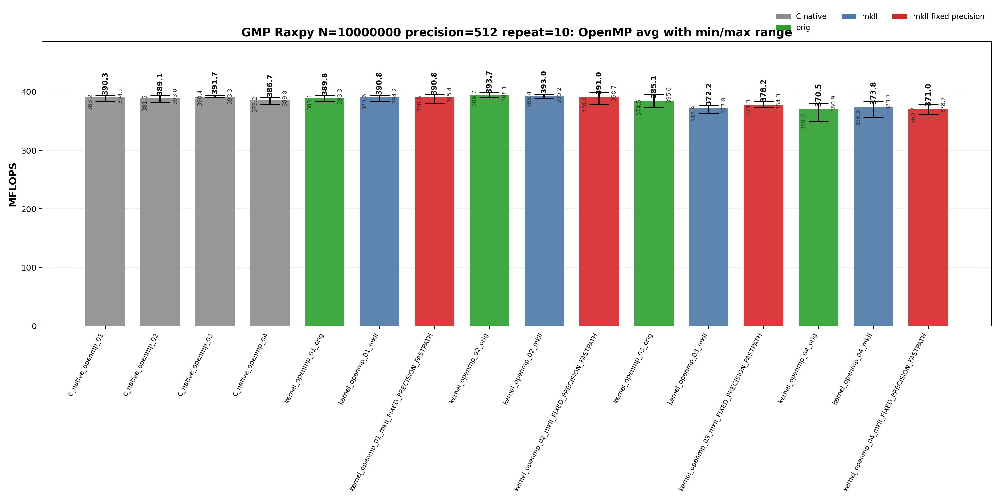
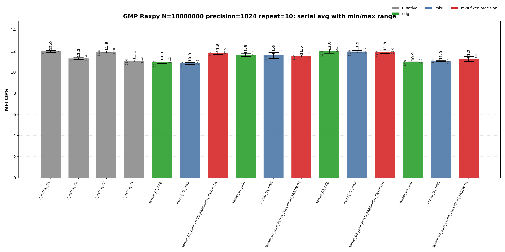

<!-- SPDX-License-Identifier: BSD-2-Clause -->
# 01_Raxpy

This benchmark measures GMP `mpf` RAXPY,

```text
y[i] <- alpha * x[i] + y[i]
```

for raw C GMP, upstream `gmpxx`, and `gmpxx_mkII` wrapper kernels. The purpose is to identify which source-level temporary lifetime and fixed-precision fastpath choices change the generated hot loop and the repeat-10 MFLOPS distribution at 512-bit and 1024-bit precision.

## Build

From the repository root:

```bash
cmake -S . -B build_bench_release -DCMAKE_BUILD_TYPE=Release
cmake --build build_bench_release -j --target Raxpy_gmp_C_native_01 Raxpy_gmp_C_native_02 Raxpy_gmp_C_native_03 Raxpy_gmp_C_native_04 Raxpy_gmp_C_native_openmp_01 Raxpy_gmp_C_native_openmp_02 Raxpy_gmp_C_native_openmp_03 Raxpy_gmp_C_native_openmp_04 Raxpy_gmp_kernel_03_mkII
```

The GMP Raxpy target set is built under:

```text
build_bench_release/benchmarks/gmp/01_Raxpy/
```

Each executable takes:

```text
<vector size> <precision-bits>
```

Example:

```bash
build_bench_release/benchmarks/gmp/01_Raxpy/Raxpy_gmp_kernel_03_mkII 10000000 1024
```

OpenMP variants use the same executable arguments. The recorded run used:

```bash
OMP_NUM_THREADS=32 OMP_PLACES=cores OMP_PROC_BIND=spread \
    build_bench_release/benchmarks/gmp/01_Raxpy/Raxpy_gmp_kernel_openmp_03_mkII 10000000 1024
```

The cross-benchmark runner can execute the GMP and MPFR `00_Rdot`, `01_Raxpy`, and `02_Rgemv` suites for both standard precisions with one command:

```bash
OMP_NUM_THREADS=32 OMP_PLACES=cores OMP_PROC_BIND=spread \
    benchmarks/run_all.sh build_bench_release 512,1024 10 10000000 10000000 4000 4000
```

The second argument is a precision list. `both` and `all` are aliases for `512,1024`; a single value such as `512` still runs only that precision. Per-benchmark results are written to `results_raw/run_all_p512_repeat10_<timestamp>/` and `results_raw/run_all_p1024_repeat10_<timestamp>/` under each benchmark directory.

## Benchmark Parameters

| Parameter | Meaning |
| --- | --- |
| `N` | Number of vector elements. |
| `precision` | Requested GMP `mpf` precision in bits for `alpha`, `x`, and `y`. |
| `repeat` | Number of timed process executions per executable. |
| `OMP_NUM_THREADS` | OpenMP worker count for `openmp` executables. |
| `OMP_PLACES`, `OMP_PROC_BIND` | OpenMP affinity controls used by the runner. |

The committed runs use `N=10000000`, `repeat=10`, `precision=512` and `precision=1024`, with `OMP_NUM_THREADS=32`, `OMP_PLACES=cores`, and `OMP_PROC_BIND=spread`.

## Variant Shapes

The timed body is `_Raxpy()`. The same numeric suffix is used for serial and OpenMP kernels; an `openmp` executable name means the same source-level shape is run over a static worker partition with per-worker temporaries where the source shape needs them.

| Variant | Transition from previous variant | Timed source shape | Temporary/resource policy | Purpose |
| --- | --- | --- | --- | --- |
| `01` | Baseline expression-update form. | `y[i] += alpha * x[i]` | Product is expressed as an ET expression in the update. | Test expression materialization and mkII fixed-precision scratch behavior. |
| `02` | `01 -> 02`: introduce a reusable product object and copy-then-multiply source. | `temp = alpha; temp *= x[i]; y[i] += temp` | One product object is initialized before the loop and reused. | Test explicit copy-then-multiply source shape. |
| `03` | `02 -> 03`: keep reusable product lifetime but assign from the product expression. | `temp = alpha * x[i]; y[i] += temp` | One product object is initialized before the loop and assigned from the product expression. | Main reusable-product wrapper spelling; closest to the raw C reusable-temporary baseline. |
| `04` | `03 -> 04`: move product object lifetime into the timed loop. | `mpf_class temp = alpha * x[i]; y[i] += temp` | Product object lifetime is inside the loop. | Stress per-iteration construction. |

Wrapper targets append `_orig`, `_mkII`, and `_mkII_FIXED_PRECISION_FASTPATH`. Raw C provides `C_native_01` through `C_native_04` and matching `C_native_openmp_01` through `C_native_openmp_04`. `C_native_01` and `C_native_03` are both direct reusable-temporary kernels; `03` exists as the numbered raw C comparison point for wrapper variant `03`.

## Source Transitions

`01 -> 02` replaces the expression update with an explicit reusable product object and copy-then-multiply source. `02 -> 03` keeps the reusable product lifetime but assigns it from the product expression, matching the raw reusable-product hot-loop class. `03 -> 04` moves product construction into the timed loop as an allocation/lifetime stress case. OpenMP variants keep the same numeric source shape and add static partitioning; `03` is the OpenMP comparison point for `C_native_openmp_03`.

## C Native Equivalent Kernels

| C native kernel | Closest wrapper kernel | Equivalence |
|-----------------|------------------------|-------------|
| `C_native_01`, `C_native_openmp_01` | `kernel_03_*`, `kernel_openmp_03_*` | Direct reusable temporary: one `mpf_t temp` outside the loop or per OpenMP worker, then `mpf_mul(temp, alpha, x[i])` and `mpf_add(y[i], y[i], temp)` per element. |
| `C_native_02`, `C_native_openmp_02` | `kernel_02_*`, `kernel_openmp_02_*` | Copy-then-multiply reusable temporary: `mpf_set(temp, alpha)`, `mpf_mul(temp, temp, x[i])`, then `mpf_add`. |
| `C_native_03`, `C_native_openmp_03` | `kernel_03_*`, `kernel_openmp_03_*` | Numbered raw C comparison point for wrapper `03`; same direct reusable-temporary hot-loop class as `C_native_01`. |
| `C_native_04`, `C_native_openmp_04` | `kernel_04_*`, `kernel_openmp_04_*` | Loop-local construction stress case: each element performs `mpf_init`, multiply, add, and `mpf_clear` inside the timed loop. |
| none | `kernel_01_*`, `kernel_openmp_01_*` | Expression-template spelling has no exact raw C source equivalent; compare against the direct reusable-temporary C class when analyzing generated code. |

## Recorded Run

### 512-bit run

| Field | Value |
|-------|-------|
| Run ID | `run_all_p512_repeat10_20260527_094954` |
| Date | 2026-05-27 |
| CPU | AMD Ryzen Threadripper 3970X 32-Core Processor |
| OS | Linux 6.8.0-94-generic x86_64 |
| Compiler | `c++ (Ubuntu 15.2.0-16ubuntu1) 15.2.0` |
| Build type | Release |
| Problem size | `N=10000000` |
| Precision | 512 bits |
| Repeat count | 10 |
| OpenMP | `OMP_NUM_THREADS=32`, `OMP_PLACES=cores`, `OMP_PROC_BIND=spread` |
| Default precision env | `GMPXX_DEFAULT_MPF_PRECISION_BITS=512` |
| Benchmark command | `OMP_NUM_THREADS=32 OMP_PLACES=cores OMP_PROC_BIND=spread benchmarks/run_all.sh build_bench_release 512,1024 10` |
| Raw result directory | `benchmarks/gmp/01_Raxpy/results_raw/run_all_p512_repeat10_20260527_094954/` |
| Raw log | `benchmarks/gmp/01_Raxpy/results_raw/run_all_p512_repeat10_20260527_094954/benchmark_raxpy_gmp_n10000000_p512_repeat10.log` |
| Raw CSV | `benchmarks/gmp/01_Raxpy/results_raw/run_all_p512_repeat10_20260527_094954/raw_raxpy_gmp_n10000000_p512_repeat10.csv` |
| Summary CSV | `benchmarks/gmp/01_Raxpy/results_raw/run_all_p512_repeat10_20260527_094954/summary_raxpy_gmp_n10000000_p512_repeat10.csv` |
| Correctness | 320 / 320 runs reported OK. |




Plot regeneration command:

```bash
python3 benchmarks/gmp/01_Raxpy/plot_repeat_summary.py \
    benchmarks/gmp/01_Raxpy/results_raw/run_all_p512_repeat10_20260527_094954/benchmark_raxpy_gmp_n10000000_p512_repeat10.log \
    --output-dir benchmarks/gmp/01_Raxpy/results_raw/run_all_p512_repeat10_20260527_094954 \
    --output-prefix raxpy_gmp_n10000000_p512_repeat10 \
    --title-prefix "GMP Raxpy N=10000000, precision=512, repeat=10"
```

### 1024-bit run

| Field | Value |
|-------|-------|
| Run ID | `run_all_p1024_repeat10_20260527_094954` |
| Date | 2026-05-27 |
| CPU | AMD Ryzen Threadripper 3970X 32-Core Processor |
| OS | Linux 6.8.0-94-generic x86_64 |
| Compiler | `c++ (Ubuntu 15.2.0-16ubuntu1) 15.2.0` |
| Build type | Release |
| Problem size | `N=10000000` |
| Precision | 1024 bits |
| Repeat count | 10 |
| OpenMP | `OMP_NUM_THREADS=32`, `OMP_PLACES=cores`, `OMP_PROC_BIND=spread` |
| Default precision env | `GMPXX_DEFAULT_MPF_PRECISION_BITS=1024` |
| Benchmark command | `OMP_NUM_THREADS=32 OMP_PLACES=cores OMP_PROC_BIND=spread benchmarks/run_all.sh build_bench_release 512,1024 10` |
| Raw result directory | `benchmarks/gmp/01_Raxpy/results_raw/run_all_p1024_repeat10_20260527_094954/` |
| Raw log | `benchmarks/gmp/01_Raxpy/results_raw/run_all_p1024_repeat10_20260527_094954/benchmark_raxpy_gmp_n10000000_p1024_repeat10.log` |
| Raw CSV | `benchmarks/gmp/01_Raxpy/results_raw/run_all_p1024_repeat10_20260527_094954/raw_raxpy_gmp_n10000000_p1024_repeat10.csv` |
| Summary CSV | `benchmarks/gmp/01_Raxpy/results_raw/run_all_p1024_repeat10_20260527_094954/summary_raxpy_gmp_n10000000_p1024_repeat10.csv` |
| Correctness | 320 / 320 runs reported OK. |




Plot regeneration command:

```bash
python3 benchmarks/gmp/01_Raxpy/plot_repeat_summary.py \
    benchmarks/gmp/01_Raxpy/results_raw/run_all_p1024_repeat10_20260527_094954/benchmark_raxpy_gmp_n10000000_p1024_repeat10.log \
    --output-dir benchmarks/gmp/01_Raxpy/results_raw/run_all_p1024_repeat10_20260527_094954 \
    --output-prefix raxpy_gmp_n10000000_p1024_repeat10 \
    --title-prefix "GMP Raxpy N=10000000, precision=1024, repeat=10"
```

## Resource or Bandwidth Estimates

The values below are model estimates derived from MFLOPS, not hardware-counter measurements. They count active limb bytes plus a header-inclusive object model. They exclude allocator metadata, cache-line overfetch, instruction fetch, and final OpenMP reduction traffic.

| Case | Representative best-avg variant | Avg MFLOPS | Active bytes/iteration | Header-inclusive bytes/iteration | Active GB/s | Header-inclusive GB/s |
| --- | --- | --- | --- | --- | --- | --- |
| 512-bit serial | `C_native_03` | 33.727 | 192 | 264 | 3.238 | 4.452 |
| 512-bit OpenMP | `kernel_openmp_02_orig` | 393.715 | 192 | 264 | 37.797 | 51.970 |
| 1024-bit serial | `C_native_01` | 11.970 | 384 | 456 | 2.298 | 2.729 |
| 1024-bit OpenMP | `kernel_openmp_02_orig` | 252.424 | 384 | 456 | 48.466 | 57.553 |

For `Raxpy`, the per-iteration byte model is a compact arithmetic-stream estimate. It is not a full cache-footprint or hardware-bandwidth measurement.

## Headline Results

The headline rows below are regenerated from the committed 512-bit and 1024-bit `run_all` summary CSV files.

| Precision | Class | Variant | Max MFLOPS | Avg MFLOPS | Interpretation |
| --- | --- | --- | --- | --- | --- |
| 512 | Best max serial | `C_native_01` | 34.532 | 33.607 | Raw C reference for the numbered source shape. |
| 512 | Best average serial | `C_native_03` | 34.040 | 33.727 | Raw C reference for the numbered source shape. |
| 512 | Best max OpenMP | `kernel_openmp_02_mkII_FIXED_PRECISION_FASTPATH` | 398.676 | 390.999 | mkII fixed-precision build; intended to remove repeated scratch setup when the source shape uses expression materialization. |
| 512 | Best average OpenMP | `kernel_openmp_02_orig` | 398.110 | 393.715 | Upstream gmpxx.h wrapper for the same numbered source shape. |
| 1024 | Best max serial | `kernel_03_orig` | 12.173 | 11.956 | Upstream gmpxx.h wrapper for the same numbered source shape. |
| 1024 | Best average serial | `C_native_01` | 12.042 | 11.970 | Raw C reference for the numbered source shape. |
| 1024 | Best max OpenMP | `kernel_openmp_03_mkII_FIXED_PRECISION_FASTPATH` | 258.272 | 251.931 | mkII fixed-precision build; intended to remove repeated scratch setup when the source shape uses expression materialization. |
| 1024 | Best average OpenMP | `kernel_openmp_02_orig` | 255.925 | 252.424 | Upstream gmpxx.h wrapper for the same numbered source shape. |

## Serial Results

### 512-bit serial interpretation

These rows are derived from `benchmarks/gmp/01_Raxpy/results_raw/run_all_p512_repeat10_20260527_094954/summary_raxpy_gmp_n10000000_p512_repeat10.csv`.

| Observation | Variant | Max MFLOPS | Avg MFLOPS | Min MFLOPS | Interpretation |
| --- | --- | --- | --- | --- | --- |
| Best raw C average | `C_native_03` | 34.040 | 33.727 | 33.457 | Raw C reference for the numbered source shape. |
| Best upstream average | `kernel_03_orig` | 34.213 | 33.553 | 32.986 | Upstream gmpxx.h wrapper for the same numbered source shape. |
| Best mkII baseline average | `kernel_03_mkII` | 33.900 | 33.665 | 33.341 | mkII wrapper baseline for the numbered source shape. |
| Best mkII fixed-precision average | `kernel_03_mkII_FIXED_PRECISION_FASTPATH` | 33.848 | 33.453 | 32.806 | mkII fixed-precision build; intended to remove repeated scratch setup when the source shape uses expression materialization. |
| Best max | `C_native_01` | 34.532 | 33.607 | 33.001 | Raw C reference for the numbered source shape. |

<details>
<summary>512-bit serial results sorted by Max MFLOPS</summary>

| Rank | Variant | Max MFLOPS | Avg MFLOPS | Min MFLOPS |
| --- | --- | --- | --- | --- |
| 1 | `C_native_01` | 34.532 | 33.607 | 33.001 |
| 2 | `kernel_03_orig` | 34.213 | 33.553 | 32.986 |
| 3 | `C_native_03` | 34.040 | 33.727 | 33.457 |
| 4 | `kernel_03_mkII` | 33.900 | 33.665 | 33.341 |
| 5 | `kernel_03_mkII_FIXED_PRECISION_FASTPATH` | 33.848 | 33.453 | 32.806 |
| 6 | `kernel_02_mkII_FIXED_PRECISION_FASTPATH` | 32.701 | 31.816 | 30.935 |
| 7 | `kernel_01_mkII_FIXED_PRECISION_FASTPATH` | 32.622 | 32.358 | 32.161 |
| 8 | `kernel_02_mkII` | 32.184 | 31.734 | 31.086 |
| 9 | `kernel_02_orig` | 31.860 | 31.603 | 30.904 |
| 10 | `C_native_02` | 29.328 | 28.757 | 28.619 |
| 11 | `kernel_04_mkII_FIXED_PRECISION_FASTPATH` | 28.793 | 28.445 | 27.815 |
| 12 | `kernel_04_mkII` | 27.567 | 26.923 | 26.296 |
| 13 | `C_native_04` | 27.366 | 27.072 | 26.537 |
| 14 | `kernel_01_orig` | 26.393 | 25.809 | 25.630 |
| 15 | `kernel_04_orig` | 26.161 | 25.904 | 25.498 |
| 16 | `kernel_01_mkII` | 26.082 | 25.655 | 25.387 |

</details>

<details>
<summary>512-bit serial results sorted by Avg MFLOPS</summary>

| Rank | Variant | Max MFLOPS | Avg MFLOPS | Min MFLOPS |
| --- | --- | --- | --- | --- |
| 1 | `C_native_03` | 34.040 | 33.727 | 33.457 |
| 2 | `kernel_03_mkII` | 33.900 | 33.665 | 33.341 |
| 3 | `C_native_01` | 34.532 | 33.607 | 33.001 |
| 4 | `kernel_03_orig` | 34.213 | 33.553 | 32.986 |
| 5 | `kernel_03_mkII_FIXED_PRECISION_FASTPATH` | 33.848 | 33.453 | 32.806 |
| 6 | `kernel_01_mkII_FIXED_PRECISION_FASTPATH` | 32.622 | 32.358 | 32.161 |
| 7 | `kernel_02_mkII_FIXED_PRECISION_FASTPATH` | 32.701 | 31.816 | 30.935 |
| 8 | `kernel_02_mkII` | 32.184 | 31.734 | 31.086 |
| 9 | `kernel_02_orig` | 31.860 | 31.603 | 30.904 |
| 10 | `C_native_02` | 29.328 | 28.757 | 28.619 |
| 11 | `kernel_04_mkII_FIXED_PRECISION_FASTPATH` | 28.793 | 28.445 | 27.815 |
| 12 | `C_native_04` | 27.366 | 27.072 | 26.537 |
| 13 | `kernel_04_mkII` | 27.567 | 26.923 | 26.296 |
| 14 | `kernel_04_orig` | 26.161 | 25.904 | 25.498 |
| 15 | `kernel_01_orig` | 26.393 | 25.809 | 25.630 |
| 16 | `kernel_01_mkII` | 26.082 | 25.655 | 25.387 |

</details>

### 1024-bit serial interpretation

These rows are derived from `benchmarks/gmp/01_Raxpy/results_raw/run_all_p1024_repeat10_20260527_094954/summary_raxpy_gmp_n10000000_p1024_repeat10.csv`.

| Observation | Variant | Max MFLOPS | Avg MFLOPS | Min MFLOPS | Interpretation |
| --- | --- | --- | --- | --- | --- |
| Best raw C average | `C_native_01` | 12.042 | 11.970 | 11.856 | Raw C reference for the numbered source shape. |
| Best upstream average | `kernel_03_orig` | 12.173 | 11.956 | 11.778 | Upstream gmpxx.h wrapper for the same numbered source shape. |
| Best mkII baseline average | `kernel_03_mkII` | 12.037 | 11.943 | 11.826 | mkII wrapper baseline for the numbered source shape. |
| Best mkII fixed-precision average | `kernel_03_mkII_FIXED_PRECISION_FASTPATH` | 12.021 | 11.923 | 11.749 | mkII fixed-precision build; intended to remove repeated scratch setup when the source shape uses expression materialization. |
| Best max | `kernel_03_orig` | 12.173 | 11.956 | 11.778 | Upstream gmpxx.h wrapper for the same numbered source shape. |

<details>
<summary>1024-bit serial results sorted by Max MFLOPS</summary>

| Rank | Variant | Max MFLOPS | Avg MFLOPS | Min MFLOPS |
| --- | --- | --- | --- | --- |
| 1 | `kernel_03_orig` | 12.173 | 11.956 | 11.778 |
| 2 | `C_native_01` | 12.042 | 11.970 | 11.856 |
| 3 | `kernel_03_mkII` | 12.037 | 11.943 | 11.826 |
| 4 | `kernel_03_mkII_FIXED_PRECISION_FASTPATH` | 12.021 | 11.923 | 11.749 |
| 5 | `C_native_03` | 12.009 | 11.921 | 11.827 |
| 6 | `kernel_01_mkII_FIXED_PRECISION_FASTPATH` | 11.996 | 11.766 | 11.668 |
| 7 | `kernel_02_mkII` | 11.867 | 11.599 | 11.299 |
| 8 | `kernel_02_orig` | 11.792 | 11.603 | 11.493 |
| 9 | `kernel_02_mkII_FIXED_PRECISION_FASTPATH` | 11.609 | 11.507 | 11.435 |
| 10 | `kernel_04_mkII_FIXED_PRECISION_FASTPATH` | 11.468 | 11.201 | 11.024 |
| 11 | `C_native_02` | 11.359 | 11.283 | 11.205 |
| 12 | `C_native_04` | 11.159 | 11.063 | 10.979 |
| 13 | `kernel_01_orig` | 11.151 | 10.950 | 10.816 |
| 14 | `kernel_04_mkII` | 11.081 | 11.038 | 10.999 |
| 15 | `kernel_04_orig` | 11.029 | 10.924 | 10.866 |
| 16 | `kernel_01_mkII` | 10.926 | 10.855 | 10.727 |

</details>

<details>
<summary>1024-bit serial results sorted by Avg MFLOPS</summary>

| Rank | Variant | Max MFLOPS | Avg MFLOPS | Min MFLOPS |
| --- | --- | --- | --- | --- |
| 1 | `C_native_01` | 12.042 | 11.970 | 11.856 |
| 2 | `kernel_03_orig` | 12.173 | 11.956 | 11.778 |
| 3 | `kernel_03_mkII` | 12.037 | 11.943 | 11.826 |
| 4 | `kernel_03_mkII_FIXED_PRECISION_FASTPATH` | 12.021 | 11.923 | 11.749 |
| 5 | `C_native_03` | 12.009 | 11.921 | 11.827 |
| 6 | `kernel_01_mkII_FIXED_PRECISION_FASTPATH` | 11.996 | 11.766 | 11.668 |
| 7 | `kernel_02_orig` | 11.792 | 11.603 | 11.493 |
| 8 | `kernel_02_mkII` | 11.867 | 11.599 | 11.299 |
| 9 | `kernel_02_mkII_FIXED_PRECISION_FASTPATH` | 11.609 | 11.507 | 11.435 |
| 10 | `C_native_02` | 11.359 | 11.283 | 11.205 |
| 11 | `kernel_04_mkII_FIXED_PRECISION_FASTPATH` | 11.468 | 11.201 | 11.024 |
| 12 | `C_native_04` | 11.159 | 11.063 | 10.979 |
| 13 | `kernel_04_mkII` | 11.081 | 11.038 | 10.999 |
| 14 | `kernel_01_orig` | 11.151 | 10.950 | 10.816 |
| 15 | `kernel_04_orig` | 11.029 | 10.924 | 10.866 |
| 16 | `kernel_01_mkII` | 10.926 | 10.855 | 10.727 |

</details>

## OpenMP Results

### 512-bit OpenMP interpretation

These rows are derived from `benchmarks/gmp/01_Raxpy/results_raw/run_all_p512_repeat10_20260527_094954/summary_raxpy_gmp_n10000000_p512_repeat10.csv`.

| Observation | Variant | Max MFLOPS | Avg MFLOPS | Min MFLOPS | Interpretation |
| --- | --- | --- | --- | --- | --- |
| Best raw C average | `C_native_openmp_03` | 393.294 | 391.712 | 390.355 | Raw C reference for the numbered source shape. |
| Best upstream average | `kernel_openmp_02_orig` | 398.110 | 393.715 | 389.671 | Upstream gmpxx.h wrapper for the same numbered source shape. |
| Best mkII baseline average | `kernel_openmp_02_mkII` | 395.212 | 393.028 | 388.399 | mkII wrapper baseline for the numbered source shape. |
| Best mkII fixed-precision average | `kernel_openmp_02_mkII_FIXED_PRECISION_FASTPATH` | 398.676 | 390.999 | 378.792 | mkII fixed-precision build; intended to remove repeated scratch setup when the source shape uses expression materialization. |
| Best max | `kernel_openmp_02_mkII_FIXED_PRECISION_FASTPATH` | 398.676 | 390.999 | 378.792 | mkII fixed-precision build; intended to remove repeated scratch setup when the source shape uses expression materialization. |

<details>
<summary>512-bit OpenMP results sorted by Max MFLOPS</summary>

| Rank | Variant | Max MFLOPS | Avg MFLOPS | Min MFLOPS |
| --- | --- | --- | --- | --- |
| 1 | `kernel_openmp_02_mkII_FIXED_PRECISION_FASTPATH` | 398.676 | 390.999 | 378.792 |
| 2 | `kernel_openmp_02_orig` | 398.110 | 393.715 | 389.671 |
| 3 | `kernel_openmp_03_orig` | 395.650 | 385.069 | 374.546 |
| 4 | `kernel_openmp_01_mkII_FIXED_PRECISION_FASTPATH` | 395.375 | 390.763 | 380.621 |
| 5 | `kernel_openmp_02_mkII` | 395.212 | 393.028 | 388.399 |
| 6 | `C_native_openmp_01` | 394.184 | 390.260 | 383.204 |
| 7 | `kernel_openmp_01_mkII` | 394.184 | 390.780 | 383.627 |
| 8 | `C_native_openmp_03` | 393.294 | 391.712 | 390.355 |
| 9 | `kernel_openmp_01_orig` | 393.263 | 389.767 | 383.097 |
| 10 | `C_native_openmp_02` | 393.041 | 389.132 | 381.527 |
| 11 | `C_native_openmp_04` | 389.768 | 386.716 | 379.249 |
| 12 | `kernel_openmp_03_mkII_FIXED_PRECISION_FASTPATH` | 384.252 | 378.210 | 374.286 |
| 13 | `kernel_openmp_04_mkII` | 383.657 | 373.845 | 356.612 |
| 14 | `kernel_openmp_04_orig` | 380.944 | 370.501 | 349.954 |
| 15 | `kernel_openmp_04_mkII_FIXED_PRECISION_FASTPATH` | 378.726 | 370.962 | 360.720 |
| 16 | `kernel_openmp_03_mkII` | 377.813 | 372.210 | 363.903 |

</details>

<details>
<summary>512-bit OpenMP results sorted by Avg MFLOPS</summary>

| Rank | Variant | Max MFLOPS | Avg MFLOPS | Min MFLOPS |
| --- | --- | --- | --- | --- |
| 1 | `kernel_openmp_02_orig` | 398.110 | 393.715 | 389.671 |
| 2 | `kernel_openmp_02_mkII` | 395.212 | 393.028 | 388.399 |
| 3 | `C_native_openmp_03` | 393.294 | 391.712 | 390.355 |
| 4 | `kernel_openmp_02_mkII_FIXED_PRECISION_FASTPATH` | 398.676 | 390.999 | 378.792 |
| 5 | `kernel_openmp_01_mkII` | 394.184 | 390.780 | 383.627 |
| 6 | `kernel_openmp_01_mkII_FIXED_PRECISION_FASTPATH` | 395.375 | 390.763 | 380.621 |
| 7 | `C_native_openmp_01` | 394.184 | 390.260 | 383.204 |
| 8 | `kernel_openmp_01_orig` | 393.263 | 389.767 | 383.097 |
| 9 | `C_native_openmp_02` | 393.041 | 389.132 | 381.527 |
| 10 | `C_native_openmp_04` | 389.768 | 386.716 | 379.249 |
| 11 | `kernel_openmp_03_orig` | 395.650 | 385.069 | 374.546 |
| 12 | `kernel_openmp_03_mkII_FIXED_PRECISION_FASTPATH` | 384.252 | 378.210 | 374.286 |
| 13 | `kernel_openmp_04_mkII` | 383.657 | 373.845 | 356.612 |
| 14 | `kernel_openmp_03_mkII` | 377.813 | 372.210 | 363.903 |
| 15 | `kernel_openmp_04_mkII_FIXED_PRECISION_FASTPATH` | 378.726 | 370.962 | 360.720 |
| 16 | `kernel_openmp_04_orig` | 380.944 | 370.501 | 349.954 |

</details>

### 1024-bit OpenMP interpretation

These rows are derived from `benchmarks/gmp/01_Raxpy/results_raw/run_all_p1024_repeat10_20260527_094954/summary_raxpy_gmp_n10000000_p1024_repeat10.csv`.

| Observation | Variant | Max MFLOPS | Avg MFLOPS | Min MFLOPS | Interpretation |
| --- | --- | --- | --- | --- | --- |
| Best raw C average | `C_native_openmp_01` | 254.303 | 250.963 | 243.147 | Raw C reference for the numbered source shape. |
| Best upstream average | `kernel_openmp_02_orig` | 255.925 | 252.424 | 247.928 | Upstream gmpxx.h wrapper for the same numbered source shape. |
| Best mkII baseline average | `kernel_openmp_03_mkII` | 257.138 | 251.842 | 234.889 | mkII wrapper baseline for the numbered source shape. |
| Best mkII fixed-precision average | `kernel_openmp_03_mkII_FIXED_PRECISION_FASTPATH` | 258.272 | 251.931 | 234.256 | mkII fixed-precision build; intended to remove repeated scratch setup when the source shape uses expression materialization. |
| Best max | `kernel_openmp_03_mkII_FIXED_PRECISION_FASTPATH` | 258.272 | 251.931 | 234.256 | mkII fixed-precision build; intended to remove repeated scratch setup when the source shape uses expression materialization. |

<details>
<summary>1024-bit OpenMP results sorted by Max MFLOPS</summary>

| Rank | Variant | Max MFLOPS | Avg MFLOPS | Min MFLOPS |
| --- | --- | --- | --- | --- |
| 1 | `kernel_openmp_03_mkII_FIXED_PRECISION_FASTPATH` | 258.272 | 251.931 | 234.256 |
| 2 | `kernel_openmp_01_orig` | 257.627 | 251.269 | 242.140 |
| 3 | `kernel_openmp_03_mkII` | 257.138 | 251.842 | 234.889 |
| 4 | `kernel_openmp_01_mkII_FIXED_PRECISION_FASTPATH` | 257.102 | 247.432 | 233.607 |
| 5 | `kernel_openmp_02_mkII_FIXED_PRECISION_FASTPATH` | 256.403 | 248.358 | 220.973 |
| 6 | `kernel_openmp_03_orig` | 256.283 | 251.659 | 236.785 |
| 7 | `kernel_openmp_02_orig` | 255.925 | 252.424 | 247.928 |
| 8 | `kernel_openmp_01_mkII` | 255.671 | 248.267 | 225.019 |
| 9 | `kernel_openmp_04_mkII` | 255.411 | 248.860 | 237.388 |
| 10 | `kernel_openmp_04_orig` | 255.347 | 245.560 | 228.527 |
| 11 | `kernel_openmp_02_mkII` | 255.255 | 249.735 | 237.499 |
| 12 | `kernel_openmp_04_mkII_FIXED_PRECISION_FASTPATH` | 255.174 | 249.359 | 227.121 |
| 13 | `C_native_openmp_03` | 254.636 | 250.255 | 242.818 |
| 14 | `C_native_openmp_01` | 254.303 | 250.963 | 243.147 |
| 15 | `C_native_openmp_02` | 253.915 | 250.415 | 238.285 |
| 16 | `C_native_openmp_04` | 252.726 | 247.630 | 232.443 |

</details>

<details>
<summary>1024-bit OpenMP results sorted by Avg MFLOPS</summary>

| Rank | Variant | Max MFLOPS | Avg MFLOPS | Min MFLOPS |
| --- | --- | --- | --- | --- |
| 1 | `kernel_openmp_02_orig` | 255.925 | 252.424 | 247.928 |
| 2 | `kernel_openmp_03_mkII_FIXED_PRECISION_FASTPATH` | 258.272 | 251.931 | 234.256 |
| 3 | `kernel_openmp_03_mkII` | 257.138 | 251.842 | 234.889 |
| 4 | `kernel_openmp_03_orig` | 256.283 | 251.659 | 236.785 |
| 5 | `kernel_openmp_01_orig` | 257.627 | 251.269 | 242.140 |
| 6 | `C_native_openmp_01` | 254.303 | 250.963 | 243.147 |
| 7 | `C_native_openmp_02` | 253.915 | 250.415 | 238.285 |
| 8 | `C_native_openmp_03` | 254.636 | 250.255 | 242.818 |
| 9 | `kernel_openmp_02_mkII` | 255.255 | 249.735 | 237.499 |
| 10 | `kernel_openmp_04_mkII_FIXED_PRECISION_FASTPATH` | 255.174 | 249.359 | 227.121 |
| 11 | `kernel_openmp_04_mkII` | 255.411 | 248.860 | 237.388 |
| 12 | `kernel_openmp_02_mkII_FIXED_PRECISION_FASTPATH` | 256.403 | 248.358 | 220.973 |
| 13 | `kernel_openmp_01_mkII` | 255.671 | 248.267 | 225.019 |
| 14 | `C_native_openmp_04` | 252.726 | 247.630 | 232.443 |
| 15 | `kernel_openmp_01_mkII_FIXED_PRECISION_FASTPATH` | 257.102 | 247.432 | 233.607 |
| 16 | `kernel_openmp_04_orig` | 255.347 | 245.560 | 228.527 |

</details>

## Hotpath Disassembly

Representative command:

```bash
objdump -Cd --no-show-raw-insn build_bench_release/benchmarks/gmp/01_Raxpy/Raxpy_gmp_kernel_03_mkII
```

The current representative hotpaths were rechecked against the C native,
upstream wrapper, and mkII binaries.

| Representative | Hotpath observation | Comparison point |
|----------------|---------------------|------------------|
| `C_native_03` | Reusable product object. The loop computes `temp = alpha * x[i]` with one `__gmpf_mul`, then updates `y[i]` with one `__gmpf_add`. No `mpf_init2` or `mpf_clear` appears in the element loop. | Raw reusable-product baseline. |
| `kernel_03_orig` | Same backend call sequence as `C_native_03`; upstream wrapper object lifetime is outside the timed loop. | Equivalent arithmetic hot loop to C native. |
| `kernel_03_mkII` | Same one-multiply plus one-add loop class as `C_native_03`; mkII precision work is outside the timed element loop. | Equivalent arithmetic hot loop to C native, with wrapper setup outside the loop. |
| `kernel_openmp_03_orig` / `kernel_openmp_03_mkII` | The OpenMP worker body keeps the same `__gmpf_mul` plus `__gmpf_add` sequence. Thread scheduling and barriers are outside the per-element arithmetic sequence. | Same arithmetic class as the serial reusable-product baseline. |

Representative excerpts from the current binaries:

```asm
# Raxpy_gmp_C_native_03::_Raxpy
28ad: call   __gmpf_init@plt
28b2: test   %r13,%r13
28b5: jle    28ed <_Raxpy+0x7d>
28c0: mov    %rbp,%rdx        # x[i]
28c3: mov    %r14,%rsi        # alpha
28c6: mov    %rsp,%rdi        # reusable product temp
28cd: call   __gmpf_mul@plt
28d2: mov    %rbx,%rsi        # y[i]
28d5: mov    %rbx,%rdi        # y[i] destination
28d8: mov    %rsp,%rdx        # product temp
28db: call   __gmpf_add@plt
28e0: add    $0x18,%rbp
28e4: add    $0x18,%rbx
28e8: cmp    %r15,%r13
28eb: jne    28c0 <_Raxpy+0x50>
28ed: mov    %rsp,%rdi
28f0: call   __gmpf_clear@plt
```

```asm
# Raxpy_gmp_kernel_03_orig::_Raxpy
272d: call   __gmpf_init@plt
2732: test   %r13,%r13
2735: jle    276d <_Raxpy+0x7d>
2740: mov    %rbp,%rdx        # x[i]
2743: mov    %r14,%rsi        # alpha
2746: mov    %rsp,%rdi        # reusable product temp
2749: call   __gmpf_mul@plt
274e: mov    %rsp,%rdx        # product temp
2751: mov    %rbx,%rsi        # y[i]
2754: mov    %rbx,%rdi        # y[i] destination
2757: call   __gmpf_add@plt
275c: add    $0x1,%r15
2760: add    $0x18,%rbp
2764: add    $0x18,%rbx
2768: cmp    %r15,%r13
276b: jne    2740 <_Raxpy+0x50>
276d: mov    %rsp,%rdi
2770: call   __gmpf_clear@plt
```

```asm
# Raxpy_gmp_kernel_03_mkII::_Raxpy
28d8: call   __gmpf_set_ui@plt
28dd: test   %r13,%r13
28e0: jle    291d <_Raxpy+0xad>
28f0: mov    %rbp,%rdx        # x[i]
28f3: mov    %r14,%rsi        # alpha
28f6: mov    %rsp,%rdi        # reusable product temp
28f9: call   __gmpf_mul@plt
28fe: mov    %rsp,%rdx        # product temp
2901: mov    %rbx,%rsi        # y[i]
2904: mov    %rbx,%rdi        # y[i] destination
2907: call   __gmpf_add@plt
290c: add    $0x1,%r15
2910: add    $0x18,%rbp
2914: add    $0x18,%rbx
2918: cmp    %r15,%r13
291b: jne    28f0 <_Raxpy+0x80>
291d: mov    %rsp,%rdi
2920: call   __gmpf_clear@plt
```

Counterexample without `FIXED_PRECISION_FASTPATH`: for this reusable-product
`03` source shape, the GMP precision fastpath is not what makes the mkII loop
C-equivalent. Removing it leaves the same inner arithmetic body: one reusable
product object, one `__gmpf_mul`, and one `__gmpf_add` per element.

```asm
# Raxpy_gmp_kernel_03_mkII_FIXED_PRECISION_FASTPATH::_Raxpy
29c0: mov    %rbp,%rdx        # x[i]
29c3: mov    %r14,%rsi        # alpha
29c6: mov    %rsp,%rdi        # reusable product temp
29c9: call   __gmpf_mul@plt
29ce: mov    %rsp,%rdx        # product temp
29d1: mov    %rbx,%rsi        # y[i]
29d4: mov    %rbx,%rdi        # y[i] destination
29d7: call   __gmpf_add@plt
29dc: add    $0x1,%r15
29e0: add    $0x18,%rbp
29e4: add    $0x18,%rbx
29eb: jne    29c0 <_Raxpy+0x80>
```

```asm
# Raxpy_gmp_kernel_03_mkII::_Raxpy
28f0: mov    %rbp,%rdx        # x[i]
28f3: mov    %r14,%rsi        # alpha
28f6: mov    %rsp,%rdi        # reusable product temp
28f9: call   __gmpf_mul@plt
28fe: mov    %rsp,%rdx        # product temp
2901: mov    %rbx,%rsi        # y[i]
2904: mov    %rbx,%rdi        # y[i] destination
2907: call   __gmpf_add@plt
290c: add    $0x1,%r15
2910: add    $0x18,%rbp
2914: add    $0x18,%rbx
291b: jne    28f0 <_Raxpy+0x80>
```

The three excerpts differ in setup details, but the timed arithmetic loop is the
same: reusable product temp, one `__gmpf_mul`, one `__gmpf_add`, then pointer
increments and loop branch.

## Lessons Learned

The reusable product object is the practical Raxpy baseline. C native,
upstream `gmpxx`, and mkII all reach the same backend call sequence once the
source avoids loop-local temporary construction.

For 512-bit serial runs, `C_native_01` has the highest max and `C_native_03`
has the highest average. Both are raw C reusable-product variants, so the
source-level lesson is reusable temporaries rather than the specific numbering
winner.

For 512-bit OpenMP runs, `kernel_openmp_02_mkII_FIXED_PRECISION_FASTPATH` has
the highest max while `kernel_openmp_02_orig` has the highest average. The
split is small and both variants keep the product object outside the element
loop.

For 1024-bit serial runs, `kernel_03_orig` has the highest max and
`C_native_01` has the highest average. Higher precision makes the backend call
cost dominate, and the reusable C/orig/mkII variants remain in the same
performance class.

For 1024-bit OpenMP runs, `kernel_openmp_03_mkII_FIXED_PRECISION_FASTPATH` has
the highest max while `kernel_openmp_02_orig` has the highest average. Read this
as OpenMP variance among reusable-product kernels, not as a stable difference in
GMP arithmetic.

The next meaningful optimization would need to change data layout or backend
traffic. Rewriting wrapper syntax without changing the emitted
`__gmpf_mul`/`__gmpf_add` loop is unlikely to create a new performance class.
