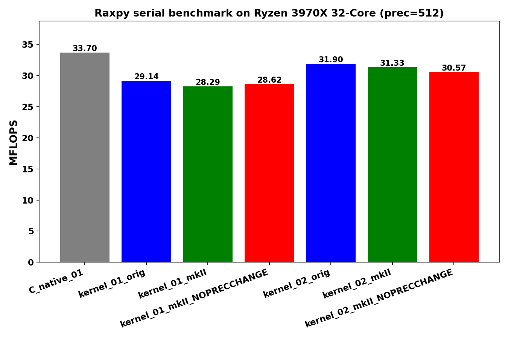
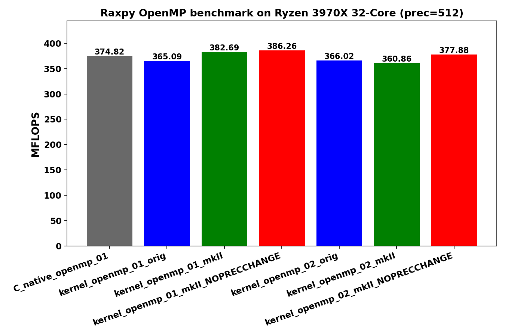

<!-- SPDX-License-Identifier: BSD-2-Clause -->

# 01_Raxpy

This directory benchmarks the GMP real AXPY operation

```text
y_i = y_i + alpha * x_i
```

with random `mpf` data at a fixed precision.  It compares raw `mpf_t`,
upstream `gmpxx.h`, and `gmpxx_mkII`.

## Build

From the repository root:

```bash
cmake -S . -B build_bench_release -DCMAKE_BUILD_TYPE=Release
cmake --build build_bench_release -j
```

The executables are created under:

```text
build_bench_release/benchmarks/gmp/01_Raxpy/
```

## Run

Run the whole GMP benchmark set through the top-level runner:

```bash
benchmarks/common/run_benchmarks.sh build_bench_release 512
```

That runner also executes Rdot, Rgemv, and Rgemm.  For a quick full-suite
smoke run, pass smaller dimensions:

```bash
benchmarks/common/run_benchmarks.sh build_bench_release 128 1000 1000 32 32 16 16 16 \
    benchmarks/gmp/results-smoke
```

The second vector-size argument is used for Raxpy.  Individual executables take:

```text
<vector size> <precision>
```

Example:

```bash
build_bench_release/benchmarks/gmp/01_Raxpy/Raxpy_gmp_kernel_03_mkII 10000000 512
```

For repeat runs, keep OpenMP affinity explicit:

```bash
OMP_NUM_THREADS=32 OMP_PLACES=cores OMP_PROC_BIND=spread \
build_bench_release/benchmarks/gmp/01_Raxpy/Raxpy_gmp_kernel_openmp_03_mkII \
    10000000 512
```

## Reading Results

Each executable prints `Elapsed time`, `MFLOPS`, `L1 Norm of difference`, and a
`Result OK` or `Result NG` check against the reference result.  Higher MFLOPS is
better when comparing runs with the same vector size, precision, compiler
flags, and machine.

Unlike the current Rdot executables, the Raxpy executables do not yet print a
timed-kernel GMP allocator profile.  The current analysis therefore relies on
source shape, release disassembly, MFLOPS, and the fact that every recorded
variant reports `Result OK`.

Variant names:

- `C_native`: raw `mpf_t` implementation.
- `C_native_openmp`: raw `mpf_t` implementation with OpenMP.
- `*_orig`: upstream `gmpxx.h`.
- `*_mkII`: this header with the default precision policy.
- `*_mkII_FIXED_PRECISION_FASTPATH`: this header with `GMPFRXX_MKII_ASSUME_FIXED_PRECISION_FASTPATH`.
- `*_openmp_*`: OpenMP variant where the eager benchmark provided one.

## Recorded go.sh Sample





The committed sample run uses the original `go.sh` dimensions:

```text
N = 100000000, precision = 512
```

Results are stored in [../results_raw/Linux_Ryzen_3970X_32-Core/](../results_raw/Linux_Ryzen_3970X_32-Core/):

- [Raw log](../results_raw/Linux_Ryzen_3970X_32-Core/benchmark_20260430_081331.log)
- [Serial plot](../results_raw/Linux_Ryzen_3970X_32-Core/benchmark_20260430_081331_Linux_Ryzen_3970X_32-Core_serial_Raxpy.png)
- [Serial PDF](../results_raw/Linux_Ryzen_3970X_32-Core/benchmark_20260430_081331_Linux_Ryzen_3970X_32-Core_serial_Raxpy.pdf)
- [OpenMP plot](../results_raw/Linux_Ryzen_3970X_32-Core/benchmark_20260430_081331_Linux_Ryzen_3970X_32-Core_openmp_Raxpy.png)
- [OpenMP PDF](../results_raw/Linux_Ryzen_3970X_32-Core/benchmark_20260430_081331_Linux_Ryzen_3970X_32-Core_openmp_Raxpy.pdf)

All Raxpy variants in that run report `Result OK`.

The OpenMP variants improve the timed AXPY body by about 11-14x in the
recorded run.  As with Rdot, total wall time is dominated by allocation,
random initialization, and verification for the 100000000-element vectors.
The serial `kernel_02` family is faster than `kernel_01` in this run, and the
`mkII`/`mkII_FIXED_PRECISION_FASTPATH` results stay close to the upstream `gmpxx.h`
variants.

That sample predates the `kernel_03`, `kernel_04`, and `kernel_openmp_03`
source-shape split.  New runs should use the common runner so the additional
variants are included.

## Recorded Repeat-10 Samples

The focused local repeat-10 runs used:

```text
precision = 512
OMP_NUM_THREADS = 32
OMP_PLACES = cores
OMP_PROC_BIND = spread
```

Results are stored in this directory:

- [N=1000000 raw log](results_raw/benchmark_raxpy_n1000000_p512_repeat10_20260515_142301.log)
- [N=1000000 CSV](results_raw/benchmark_raxpy_n1000000_p512_repeat10_20260515_142301.csv)
- [N=10000000 raw log](results_raw/benchmark_raxpy_n10000000_p512_repeat10_20260515_142725.log)
- [N=10000000 CSV](results_raw/benchmark_raxpy_n10000000_p512_repeat10_20260515_142725.csv)

All 23 variants report `Result OK` in all 10 runs for both vector sizes.

### N = 10000000

The larger run is the more stable Raxpy comparison because OpenMP startup and
short timed-loop noise are much smaller than in the N=1000000 run.

| Variant | Max MFLOPS | Avg MFLOPS | Min MFLOPS | Interpretation |
|---------|------------|------------|------------|----------------|
| `C_native_01` | 35.018 | 33.987 | 33.650 | Raw serial baseline. |
| `kernel_01_orig` | 29.989 | 29.301 | 28.535 | Expression-first source; product materialization remains costly. |
| `kernel_01_mkII` | 29.310 | 29.021 | 28.636 | Same performance class as upstream `kernel_01`. |
| `kernel_01_mkII_FIXED_PRECISION_FASTPATH` | 33.342 | 32.439 | 32.158 | Fastpath narrows most of the gap to C native. |
| `kernel_02_orig` | 32.767 | 31.994 | 31.672 | Reused product object with `temp = alpha; temp *= x[i]`; pays a copy of `alpha`. |
| `kernel_02_mkII` | 32.017 | 31.776 | 31.549 | Same source shape as upstream `kernel_02`. |
| `kernel_02_mkII_FIXED_PRECISION_FASTPATH` | 32.096 | 31.838 | 31.549 | Fastpath does not materially change this explicit reused-temp shape. |
| `kernel_03_orig` | 34.092 | 33.815 | 33.385 | Reused product object assigned from the expression. |
| `kernel_03_mkII` | 34.670 | 33.831 | 33.394 | Best default wrapper shape; same broad class as C native. |
| `kernel_03_mkII_FIXED_PRECISION_FASTPATH` | 33.996 | 33.584 | 33.243 | Same class as default `kernel_03`; no per-element construction remains to remove. |
| `kernel_04_orig` | 28.639 | 28.352 | 28.179 | Loop-local product object; intentionally allocation-heavy. |
| `kernel_04_mkII` | 28.774 | 28.347 | 27.966 | Same loop-local lifetime problem as upstream `kernel_04`. |
| `kernel_04_mkII_FIXED_PRECISION_FASTPATH` | 28.708 | 28.397 | 28.153 | Fastpath does not rescue explicit loop-local object construction. |
| `C_native_openmp_01` | 394.852 | 392.036 | 390.058 | Raw OpenMP baseline. |
| `kernel_openmp_01_orig` | 388.015 | 383.869 | 376.694 | Expression-first OpenMP source, still in the same broad class at N=10000000. |
| `kernel_openmp_01_mkII` | 392.292 | 388.232 | 381.875 | Default mkII OpenMP 01; close to C native for this larger vector. |
| `kernel_openmp_01_mkII_FIXED_PRECISION_FASTPATH` | 394.603 | 392.394 | 387.789 | Fastpath reaches the C native OpenMP range. |
| `kernel_openmp_02_orig` | 396.014 | 390.650 | 371.507 | Reused product object per thread with an explicit copy of `alpha`. |
| `kernel_openmp_02_mkII` | 394.085 | 390.414 | 379.509 | Same source shape as upstream OpenMP 02. |
| `kernel_openmp_02_mkII_FIXED_PRECISION_FASTPATH` | 394.174 | 391.085 | 382.559 | Same broad class; variation is mostly OpenMP noise. |
| `kernel_openmp_03_orig` | 396.093 | 392.837 | 389.932 | Reused expression-product object per thread. |
| `kernel_openmp_03_mkII` | 395.652 | 393.917 | 391.485 | Best average in this run, effectively C native OpenMP class. |
| `kernel_openmp_03_mkII_FIXED_PRECISION_FASTPATH` | 394.839 | 392.832 | 388.654 | Same class as default OpenMP 03. |

The main serial result is that `kernel_03` is the useful wrapper shape.  It
keeps product storage outside the loop and lets the loop reduce to one
`mpf_mul` plus one `mpf_add`, just like the C native implementation.
`kernel_04` is deliberately worse because it constructs the product object
inside the loop.

The main OpenMP result is different from Rdot: Raxpy has no reduction and no
final `critical` accumulation.  Each iteration writes an independent `y[i]`.
At N=10000000 all OpenMP source shapes run in a narrow range around 384-394
average MFLOPS.  The small ordering differences among C native, upstream
`gmpxx.h`, default `mkII`, and fixed-precision `mkII` should be read as
OpenMP/memory-system variance unless disassembly shows a different call
sequence.

### N = 1000000

The N=1000000 run is useful as a noise check.  It has the same correctness
result but more variation in OpenMP timings because the timed loop is short.

| Variant | Max MFLOPS | Avg MFLOPS | Min MFLOPS | Interpretation |
|---------|------------|------------|------------|----------------|
| `C_native_01` | 34.688 | 34.123 | 33.374 | Raw serial baseline, consistent with the larger run. |
| `kernel_03_mkII` | 34.256 | 33.992 | 33.642 | Same class as C native serial. |
| `kernel_04_mkII` | 28.766 | 28.496 | 28.121 | Loop-local product construction remains slower. |
| `C_native_openmp_01` | 276.262 | 263.095 | 248.973 | Raw OpenMP baseline for the shorter vector. |
| `kernel_openmp_03_mkII` | 276.148 | 244.324 | 216.526 | Same max class, but more run-to-run spread. |
| `kernel_openmp_03_mkII_FIXED_PRECISION_FASTPATH` | 273.727 | 252.460 | 214.295 | Same short-loop variance class. |

The shorter-vector data supports the same serial conclusion, but it should not
be overinterpreted for OpenMP.  With only 1000000 elements, the timed loop is
around a few milliseconds and affinity, first-touch placement, scheduling, and
verification effects are much easier to see.

## Kernel Shapes

The timed body is `_Raxpy()` in each benchmark executable.  The `Raxpy()`
helper in `Raxpy.hpp` is the post-run correctness reference and should not be
mixed with the timed-kernel source-shape comparison.

Raxpy is not a reduction.  Unlike Rdot, it has no final accumulator dependency
to break and no serial merge step; each iteration updates one independent
`y[i]`.  The useful wrapper stages therefore focus on expression fusion and
product-temporary lifetime rather than accumulator unrolling.

| Variant | Timed source shape | Temporary policy | Hotpath meaning |
|---------|--------------------|------------------|-----------------|
| `C_native_01` | `mpf_mul(temp, alpha, x[i]); mpf_add(y[i], y[i], temp);` | Raw `mpf_t` product object initialized once. | Baseline: one multiply and one add per element, no wrapper temporary. |
| `C_native_openmp_01` | Same raw `mpf_t` AXPY inside `#pragma omp for`. | Each iteration writes an independent `y[i]`. | Measures parallel raw-GMP throughput without reduction overhead. |
| `kernel_01` | `y[i] += alpha * x[i];` | Expression-first source shape. | Tests whether wrapper expression templates or fixed-precision fast paths can avoid materializing a product object. |
| `kernel_02` | `temp = alpha; temp *= x[i]; y[i] += temp;` | One reusable product object, assigned from `alpha` and multiplied in place. | Avoids per-iteration construction but pays an `mpf_set`-like copy of `alpha` each iteration. |
| `kernel_03` | `temp = alpha * x[i]; y[i] += temp;` | One reusable product object assigned from the product expression. | Best current wrapper shape: reusable storage with direct expression assignment. |
| `kernel_04` | `mpf_class temp = alpha * x[i]; y[i] += temp;` | Loop-local product object. | Deliberately allocation-heavy comparison point for product-object lifetime. |
| `kernel_openmp_01` | Parallel `y[i] += alpha * x[i];` | Expression-first source shape per element. | Parallel version of `kernel_01`; no reduction or critical section is needed. |
| `kernel_openmp_02` | Parallel `temp = alpha; temp *= x[i]; y[i] += temp;` | One private reusable product object per thread. | Parallel version of `kernel_02`; uses `schedule(static)` for contiguous chunks. |
| `kernel_openmp_03` | Parallel `temp = alpha * x[i]; y[i] += temp;` | One private reusable product object per thread. | Parallel version of `kernel_03`; useful for comparing expression assignment against in-place multiply under OpenMP. |

Four-way unrolled variants are intentionally not part of the current Raxpy
split.  Rdot uses unrolls to test accumulator dependency and reduction
behavior.  Raxpy already exposes independent destination updates, so `kernel_05`
and `kernel_06` should only be added if profiling shows real loop-overhead or
store/load scheduling headroom after the 01-04/OpenMP 01-03 split.

## Hotpath Expectations

The important serial comparison follows directly from the source shapes and the
Rdot disassembly pattern.

`C_native_01` and `kernel_03` should both reduce to this call class inside the
loop:

```text
mpf_mul(product, alpha, x[i])
mpf_add(y[i], y[i], product)
```

That is why `kernel_03_mkII` averages 33.831 MFLOPS while `C_native_01`
averages 33.987 MFLOPS in the N=10000000 repeat-10 run.

`kernel_02` keeps the product object outside the loop but computes the product
through an explicit copy of `alpha`:

```text
mpf_set(product, alpha)
mpf_mul(product, product, x[i])
mpf_add(y[i], y[i], product)
```

That extra copy keeps it behind `kernel_03`.

`kernel_04` constructs the product object inside the loop.  It is the Raxpy
counterpart to allocation-heavy Rdot source shapes and remains the slowest
serial family in the current run.

For OpenMP 03, the expected hot loop is also the same class as C native
OpenMP: one multiply, one add, pointer movement, and a loop branch.  Unlike
Rdot, there is no per-thread accumulator and no final `critical`, so once
product lifetime is under control the wrapper variants are mainly measuring
the same GMP arithmetic and memory traffic.

## Bandwidth Estimate

For 512-bit `mpf_t`, a lower-bound payload model counts only the mantissa data
for `x` and `y`:

```text
x read  = 64 bytes
y read  = 64 bytes
y write = 64 bytes
minimum payload = 192 bytes/element
```

Using the N=10000000 average MFLOPS:

| Variant | Avg MFLOPS | Avg Melem/s | Minimum payload GB/s | With product-temp local traffic GB/s |
|---------|------------|-------------|----------------------|--------------------------------------|
| `kernel_openmp_03_mkII` | 393.917 | 196.958 | 37.82 | 63.03 |
| `kernel_openmp_03_orig` | 392.837 | 196.419 | 37.71 | 62.85 |
| `C_native_openmp_01` | 392.036 | 196.018 | 37.64 | 62.73 |
| `kernel_openmp_03_mkII_FIXED_PRECISION_FASTPATH` | 392.832 | 196.416 | 37.71 | 62.85 |
| `C_native_01` | 33.987 | 16.993 | 3.26 | 5.44 |
| `kernel_03_mkII` | 33.831 | 16.915 | 3.25 | 5.41 |

The minimum payload number is the useful DRAM lower bound.  The product
temporary is per thread and should usually be cache resident, so the higher
number is better read as local cache traffic rather than required memory-bus
bandwidth.

## Lessons Learned

The current GMP Raxpy benchmark series is simpler than Rdot because Raxpy has
no reduction.  Once the loop writes independent `y[i]` elements, OpenMP can
parallelize the operation without a final GMP critical section.  The remaining
wrapper-specific question is product temporary lifetime.

The decisive source-shape distinction is:

| Shape | Result |
|-------|--------|
| `y[i] += alpha * x[i]` | Best source readability, but default expression materialization can still cost enough to lose to explicit reusable storage in serial. |
| `temp = alpha; temp *= x[i]; y[i] += temp` | Reuses storage but adds an explicit copy of `alpha` each iteration. |
| `temp = alpha * x[i]; y[i] += temp` with `temp` outside the loop | Recommended optimized wrapper shape; it matches the raw C native multiply-add call class. |
| `mpf_class temp = alpha * x[i]` inside the loop | Negative-result benchmark; it makes object lifetime intentionally bad and remains slow. |

`kernel_03` is therefore the recommended serial wrapper shape for this
`mpf_class`-compatible API.  It is explicit enough to control lifetime while
still using expression assignment for the product.

The OpenMP result is less sensitive than Rdot once N is large enough.  At
N=10000000, C native OpenMP, upstream OpenMP 03, default mkII OpenMP 03, and
fixed-precision mkII OpenMP 03 all sit around 392-394 average MFLOPS.  Small
ordering changes among them should be treated as run-to-run variance unless a
hotpath disassembly shows a different inner loop.

Four-way unroll 05/06 is not currently justified for Raxpy.  Rdot needed those
experiments to test accumulator dependency and product-temporary reuse.  Raxpy
already has independent destination updates and the current OpenMP 03 result
is in the C native range.  Keeping the suite at 01-04 plus OpenMP 01-03 makes
the source-shape comparison sharper; add 05/06 later only if profiling points
to a real remaining loop-level bottleneck.
