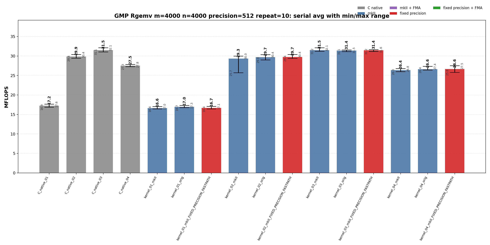
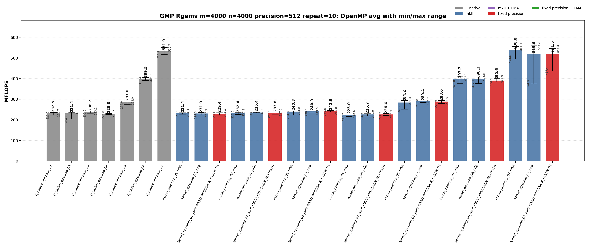

<!-- SPDX-License-Identifier: BSD-2-Clause -->

# 02_Rgemv

This directory benchmarks the GMP real dense matrix-vector product

```text
y <- alpha * A * x + beta * y
```

with fixed-precision `mpf_t`, upstream `gmpxx.h`, and `gmpxx_mkII` data. The
performance question is which source-level temporary policy and OpenMP work
partitioning shape determine the emitted GMP hot loop.

## Build

From the repository root:

```bash
cmake -S . -B build_bench_release -DCMAKE_BUILD_TYPE=Release
cmake --build build_bench_release -j
```

Executables are created under:

```text
build_bench_release/benchmarks/gmp/02_Rgemv/
```

Each executable takes `<rows m> <cols n> <precision>`. Example:

```bash
build_bench_release/benchmarks/gmp/02_Rgemv/Rgemv_gmp_kernel_03_mkII 4000 4000 512
```

The repeat-10 run used:

```bash
OMP_NUM_THREADS=32 OMP_PLACES=cores OMP_PROC_BIND=spread \
    benchmarks/gmp/02_Rgemv/run_repeat.sh build_bench_release 4000 4000 512 10
```

The mkII fixed-precision variants use `GMPFRXX_MKII_FAST_FIXED_PREC`;
executable suffixes keep the historical `FIXED_PRECISION_FASTPATH` label for
benchmark continuity.

## Kernel Shapes

The timed body is `_Rgemv()`. `A` is stored in column-major order. Serial
variants scale `y`, then sweep columns of `A`. OpenMP variants use row
partitioning, row blocking, or column partitioning to avoid concurrent writes to
`y`.

| Variant | Timed source shape | Temporary/resource policy | Purpose |
|---------|--------------------|---------------------------|---------|
| `01` | `y[i] += (alpha * x[j]) * A[i + j*lda]` | Product materializes inside the inner loop. Raw C initializes and clears a product `mpf_t` per matrix element. | Direct nested-expression stress case. |
| `02` | `temp = alpha; temp *= x[j]; templ = temp; templ *= A[i + j*lda]; y[i] += templ` | `temp` and `templ` are initialized before the loops and reused. | Copy-then-multiply reusable-temporary path. |
| `03` | `temp = alpha * x[j]; templ = temp * A[i + j*lda]; y[i] += templ` | `temp` and `templ` are initialized before the loops and assigned from product expressions. | Main optimized serial wrapper baseline. |
| `04` | Loop-local `temp = alpha * x[j]`; loop-local `templ = temp * A[i + j*lda]`; `y[i] += templ` | Product objects are constructed inside the loop nest. | Lifetime/allocation stress case. |
| `openmp_01` | Row-partitioned direct expression. | Per-thread inner-loop product materialization. | Race-free OpenMP version of `01`. |
| `openmp_02` | Row-partitioned copy-then-multiply. | Per-thread reusable `temp` and `templ`. | Race-free OpenMP version of `02`. |
| `openmp_03` | Row-partitioned expression assignment. | Per-thread reusable `temp` and `templ`. | Main row-partitioned OpenMP baseline. |
| `openmp_04` | Row-partitioned loop-local product objects. | Product objects are constructed in the row/column loop. | OpenMP lifetime/allocation stress case. |
| `openmp_05` | Precompute `scaled_x[j] = alpha * x[j]`, then row-partitioned update. | Shared read-only `scaled_x`, per-thread reusable product object. | Remove repeated `alpha * x[j]` from row-partitioned OpenMP. |
| `openmp_06` | 256-row blocks, then column loop and contiguous row loop inside each block. | Per-thread reusable `temp` and `prod`. | Restore contiguous `A` access inside each row block. |
| `openmp_07` | Column partitioning with thread-local partial `y` vectors and final reduction. | `num_threads * m` partial accumulators plus final reduction. | Keep serial-like column-major `A` streaming without racing on `y`. |

## C Native Equivalent Kernels

The mapping is based on the timed `_Rgemv()` hot-loop source shape, not just on
matching numeric suffixes.

| C native kernel | Equivalent C++ wrapper kernel(s) | Equivalence notes |
|-----------------|----------------------------------|-------------------|
| `C_native_01` | Closest to `kernel_01_*` | Raw C performs direct nested multiplication with a product `mpf_t` initialized and cleared for every matrix element. |
| `C_native_02` | `kernel_02_*` | Reusable `temp` and `templ` with explicit copy-then-multiply operations. |
| `C_native_03` | `kernel_03_*` | Reusable `temp_b` and `prod` assigned directly from product operations. This is the primary optimized serial C equivalent. |
| `C_native_04` | `kernel_04_*` | Loop-local `temp` and `templ` objects inside the loop nest. |
| `C_native_openmp_01` | `kernel_openmp_01_*` | Row-partitioned direct-expression stress shape. |
| `C_native_openmp_02` | `kernel_openmp_02_*` | Row-partitioned copy-then-multiply with per-thread reusable temporaries. |
| `C_native_openmp_03` | `kernel_openmp_03_*` | Row-partitioned expression-assignment path with per-thread reusable temporaries. |
| `C_native_openmp_04` | `kernel_openmp_04_*` | Row-partitioned loop-local product-object stress case. |
| `C_native_openmp_05` | `kernel_openmp_05_*` | Precomputed `scaled_x` row-partitioned path. |
| `C_native_openmp_06` | `kernel_openmp_06_*` | 256-row blocked row-partitioned path. |
| `C_native_openmp_07` | `kernel_openmp_07_*` | Column-partitioned thread-local partial-vector reduction path. |

`kernel_01_*` is an expression-template spelling, so its exact C native class is
confirmed by disassembly rather than by the suffix alone.

## Recorded Run

| Field | Value |
|-------|-------|
| Run ID | `rgemv_gmp_m4000_n4000_p512_repeat10_20260523_131832` |
| Date | 2026-05-23 |
| CPU | AMD Ryzen Threadripper 3970X 32-Core Processor |
| OS | Linux 6.8.0-94-generic x86_64 |
| Compiler | `c++ (Ubuntu 15.2.0-16ubuntu1) 15.2.0` |
| Build type | Release |
| Problem size | `m=4000`, `n=4000` |
| Precision | 512 bits |
| Repeat count | 10 |
| OpenMP | `OMP_NUM_THREADS=32`, `OMP_PLACES=cores`, `OMP_PROC_BIND=spread` |
| Raw result directory | `benchmarks/gmp/02_Rgemv/results_raw/rgemv_gmp_m4000_n4000_p512_repeat10_20260523_131832/` |
| Raw log | `benchmarks/gmp/02_Rgemv/results_raw/rgemv_gmp_m4000_n4000_p512_repeat10_20260523_131832/benchmark_rgemv_gmp_m4000_n4000_p512_repeat10.log` |
| Raw CSV | `benchmarks/gmp/02_Rgemv/results_raw/rgemv_gmp_m4000_n4000_p512_repeat10_20260523_131832/raw_rgemv_gmp_m4000_n4000_p512_repeat10.csv` |
| Summary CSV | `benchmarks/gmp/02_Rgemv/results_raw/rgemv_gmp_m4000_n4000_p512_repeat10_20260523_131832/summary_rgemv_gmp_m4000_n4000_p512_repeat10.csv` |
| Correctness | 440 / 440 runs reported `Result OK`. |





Plot regeneration command:

```bash
python3 benchmarks/gmp/02_Rgemv/plot_repeat_summary.py \
    benchmarks/gmp/02_Rgemv/results_raw/rgemv_gmp_m4000_n4000_p512_repeat10_20260523_131832/benchmark_rgemv_gmp_m4000_n4000_p512_repeat10.log \
    --output-dir benchmarks/gmp/02_Rgemv/results_raw/rgemv_gmp_m4000_n4000_p512_repeat10_20260523_131832 \
    --output-prefix rgemv_gmp_m4000_n4000_p512_repeat10 \
    --title-prefix "GMP Rgemv m=4000 n=4000 precision=512 repeat=10"
```

## Headline Results

| Observation | Evidence | Interpretation |
|-------------|----------|----------------|
| Best serial average | `kernel_03_mkII` at 31.493 MFLOPS avg, 32.097 max | The reusable product-object wrapper path matches the raw C reusable baseline and is the practical serial class. |
| Raw C serial baseline | `C_native_03` at 31.488 MFLOPS avg | The C native reusable-product loop has one `mpf_mul` and one `mpf_add` per matrix element, with temporary initialization outside the loop. |
| Best OpenMP average | `kernel_openmp_07_mkII` at 538.770 MFLOPS avg, 556.607 max | Column partitioning with per-thread partial y vectors is the top class in this run. |
| Best raw C OpenMP average | `C_native_openmp_07` at 531.855 MFLOPS avg | The raw C and mkII 07 kernels are in the same locality-driven class; wrapper overhead is outside the inner matrix loop. |
| OpenMP locality progression | `kernel_openmp_03_mkII_FIXED_PRECISION_FASTPATH` 242.913 avg -> `kernel_openmp_06_mkII` 397.721 avg -> `kernel_openmp_07_mkII` 538.770 avg | Work partitioning and matrix traversal dominate over small wrapper differences. |

## Serial Results

<details>
<summary>Serial results sorted by Max MFLOPS</summary>

| Rank | Variant | Max MFLOPS | Avg MFLOPS | Min MFLOPS |
|------|---------|------------|------------|------------|
| 1 | `C_native_03` | 32.115 | 31.488 | 31.062 |
| 2 | `kernel_03_mkII` | 32.097 | 31.493 | 31.211 |
| 3 | `kernel_03_mkII_FIXED_PRECISION_FASTPATH` | 31.623 | 31.440 | 31.180 |
| 4 | `kernel_03_orig` | 31.528 | 31.380 | 31.148 |
| 5 | `kernel_02_mkII_FIXED_PRECISION_FASTPATH` | 30.404 | 29.744 | 29.410 |
| 6 | `C_native_02` | 30.387 | 29.857 | 29.430 |
| 7 | `kernel_02_orig` | 30.360 | 29.694 | 29.003 |
| 8 | `kernel_02_mkII` | 29.982 | 29.323 | 25.688 |
| 9 | `C_native_04` | 27.834 | 27.513 | 27.279 |
| 10 | `kernel_04_mkII_FIXED_PRECISION_FASTPATH` | 27.517 | 26.634 | 25.808 |
| 11 | `kernel_04_orig` | 27.353 | 26.626 | 26.413 |
| 12 | `kernel_04_mkII` | 26.761 | 26.356 | 25.984 |
| 13 | `C_native_01` | 17.637 | 17.225 | 16.872 |
| 14 | `kernel_01_orig` | 17.325 | 16.966 | 16.740 |
| 15 | `kernel_01_mkII_FIXED_PRECISION_FASTPATH` | 17.076 | 16.680 | 16.404 |
| 16 | `kernel_01_mkII` | 17.043 | 16.628 | 16.406 |

</details>

<details>
<summary>Serial results sorted by Avg MFLOPS</summary>

| Rank | Variant | Max MFLOPS | Avg MFLOPS | Min MFLOPS |
|------|---------|------------|------------|------------|
| 1 | `kernel_03_mkII` | 32.097 | 31.493 | 31.211 |
| 2 | `C_native_03` | 32.115 | 31.488 | 31.062 |
| 3 | `kernel_03_mkII_FIXED_PRECISION_FASTPATH` | 31.623 | 31.440 | 31.180 |
| 4 | `kernel_03_orig` | 31.528 | 31.380 | 31.148 |
| 5 | `C_native_02` | 30.387 | 29.857 | 29.430 |
| 6 | `kernel_02_mkII_FIXED_PRECISION_FASTPATH` | 30.404 | 29.744 | 29.410 |
| 7 | `kernel_02_orig` | 30.360 | 29.694 | 29.003 |
| 8 | `kernel_02_mkII` | 29.982 | 29.323 | 25.688 |
| 9 | `C_native_04` | 27.834 | 27.513 | 27.279 |
| 10 | `kernel_04_mkII_FIXED_PRECISION_FASTPATH` | 27.517 | 26.634 | 25.808 |
| 11 | `kernel_04_orig` | 27.353 | 26.626 | 26.413 |
| 12 | `kernel_04_mkII` | 26.761 | 26.356 | 25.984 |
| 13 | `C_native_01` | 17.637 | 17.225 | 16.872 |
| 14 | `kernel_01_orig` | 17.325 | 16.966 | 16.740 |
| 15 | `kernel_01_mkII_FIXED_PRECISION_FASTPATH` | 17.076 | 16.680 | 16.404 |
| 16 | `kernel_01_mkII` | 17.043 | 16.628 | 16.406 |

</details>

## OpenMP Results

<details>
<summary>OpenMP results sorted by Max MFLOPS</summary>

| Rank | Variant | Max MFLOPS | Avg MFLOPS | Min MFLOPS |
|------|---------|------------|------------|------------|
| 1 | `kernel_openmp_07_orig` | 559.378 | 519.596 | 374.792 |
| 2 | `kernel_openmp_07_mkII` | 556.607 | 538.770 | 495.789 |
| 3 | `C_native_openmp_07` | 550.694 | 531.855 | 518.093 |
| 4 | `kernel_openmp_07_mkII_FIXED_PRECISION_FASTPATH` | 546.513 | 521.517 | 437.373 |
| 5 | `kernel_openmp_06_mkII` | 409.055 | 397.721 | 375.845 |
| 6 | `kernel_openmp_06_orig` | 408.469 | 398.298 | 377.383 |
| 7 | `C_native_openmp_06` | 405.261 | 399.521 | 390.403 |
| 8 | `kernel_openmp_06_mkII_FIXED_PRECISION_FASTPATH` | 399.869 | 390.597 | 384.109 |
| 9 | `kernel_openmp_05_mkII` | 294.479 | 284.226 | 251.896 |
| 10 | `kernel_openmp_05_mkII_FIXED_PRECISION_FASTPATH` | 293.894 | 288.642 | 279.633 |
| 11 | `C_native_openmp_05` | 292.961 | 287.014 | 273.963 |
| 12 | `kernel_openmp_05_orig` | 292.736 | 289.431 | 283.790 |
| 13 | `kernel_openmp_03_mkII_FIXED_PRECISION_FASTPATH` | 244.805 | 242.913 | 239.559 |
| 14 | `kernel_openmp_03_mkII` | 244.007 | 240.344 | 224.277 |
| 15 | `C_native_openmp_03` | 243.129 | 238.191 | 232.001 |
| 16 | `kernel_openmp_03_orig` | 243.046 | 240.935 | 237.979 |
| 17 | `kernel_openmp_02_mkII_FIXED_PRECISION_FASTPATH` | 237.602 | 233.812 | 227.467 |
| 18 | `C_native_openmp_02` | 237.313 | 231.448 | 204.129 |
| 19 | `kernel_openmp_02_orig` | 237.270 | 235.413 | 233.305 |
| 20 | `kernel_openmp_02_mkII` | 237.190 | 232.446 | 227.034 |
| 21 | `C_native_openmp_01` | 235.725 | 232.453 | 223.026 |
| 22 | `kernel_openmp_01_orig` | 235.476 | 231.027 | 224.262 |
| 23 | `kernel_openmp_01_mkII_FIXED_PRECISION_FASTPATH` | 234.394 | 229.400 | 223.129 |
| 24 | `kernel_openmp_01_mkII` | 234.343 | 231.374 | 227.523 |
| 25 | `C_native_openmp_04` | 230.739 | 227.975 | 225.808 |
| 26 | `kernel_openmp_04_mkII_FIXED_PRECISION_FASTPATH` | 230.478 | 226.435 | 221.157 |
| 27 | `kernel_openmp_04_orig` | 229.933 | 225.743 | 218.511 |
| 28 | `kernel_openmp_04_mkII` | 228.945 | 225.037 | 215.732 |

</details>

<details>
<summary>OpenMP results sorted by Avg MFLOPS</summary>

| Rank | Variant | Max MFLOPS | Avg MFLOPS | Min MFLOPS |
|------|---------|------------|------------|------------|
| 1 | `kernel_openmp_07_mkII` | 556.607 | 538.770 | 495.789 |
| 2 | `C_native_openmp_07` | 550.694 | 531.855 | 518.093 |
| 3 | `kernel_openmp_07_mkII_FIXED_PRECISION_FASTPATH` | 546.513 | 521.517 | 437.373 |
| 4 | `kernel_openmp_07_orig` | 559.378 | 519.596 | 374.792 |
| 5 | `C_native_openmp_06` | 405.261 | 399.521 | 390.403 |
| 6 | `kernel_openmp_06_orig` | 408.469 | 398.298 | 377.383 |
| 7 | `kernel_openmp_06_mkII` | 409.055 | 397.721 | 375.845 |
| 8 | `kernel_openmp_06_mkII_FIXED_PRECISION_FASTPATH` | 399.869 | 390.597 | 384.109 |
| 9 | `kernel_openmp_05_orig` | 292.736 | 289.431 | 283.790 |
| 10 | `kernel_openmp_05_mkII_FIXED_PRECISION_FASTPATH` | 293.894 | 288.642 | 279.633 |
| 11 | `C_native_openmp_05` | 292.961 | 287.014 | 273.963 |
| 12 | `kernel_openmp_05_mkII` | 294.479 | 284.226 | 251.896 |
| 13 | `kernel_openmp_03_mkII_FIXED_PRECISION_FASTPATH` | 244.805 | 242.913 | 239.559 |
| 14 | `kernel_openmp_03_orig` | 243.046 | 240.935 | 237.979 |
| 15 | `kernel_openmp_03_mkII` | 244.007 | 240.344 | 224.277 |
| 16 | `C_native_openmp_03` | 243.129 | 238.191 | 232.001 |
| 17 | `kernel_openmp_02_orig` | 237.270 | 235.413 | 233.305 |
| 18 | `kernel_openmp_02_mkII_FIXED_PRECISION_FASTPATH` | 237.602 | 233.812 | 227.467 |
| 19 | `C_native_openmp_01` | 235.725 | 232.453 | 223.026 |
| 20 | `kernel_openmp_02_mkII` | 237.190 | 232.446 | 227.034 |
| 21 | `C_native_openmp_02` | 237.313 | 231.448 | 204.129 |
| 22 | `kernel_openmp_01_mkII` | 234.343 | 231.374 | 227.523 |
| 23 | `kernel_openmp_01_orig` | 235.476 | 231.027 | 224.262 |
| 24 | `kernel_openmp_01_mkII_FIXED_PRECISION_FASTPATH` | 234.394 | 229.400 | 223.129 |
| 25 | `C_native_openmp_04` | 230.739 | 227.975 | 225.808 |
| 26 | `kernel_openmp_04_mkII_FIXED_PRECISION_FASTPATH` | 230.478 | 226.435 | 221.157 |
| 27 | `kernel_openmp_04_orig` | 229.933 | 225.743 | 218.511 |
| 28 | `kernel_openmp_04_mkII` | 228.945 | 225.037 | 215.732 |

</details>

## Memory Bandwidth Estimates

These are model estimates derived from MFLOPS, not hardware-counter
measurements. On this LP64 machine:

```text
sizeof(__mpf_struct) = 24 bytes
sizeof(mp_limb_t)    = 8 bytes
mpf_get_prec(x)      = 512 bits
used limbs           = 8
allocated limbs      = 9
```

For one matrix element at 512-bit precision:

```text
active mpf value bytes    = 24-byte header + 8 active limbs * 8 = 88 bytes
allocated mpf footprint   = 24-byte header + 9 allocated limbs * 8 = 96 bytes
A-only active stream GB/s = Avg MFLOPS * 0.044
A+y active logical GB/s   = Avg MFLOPS * 0.132
A+x+y active logical GB/s = Avg MFLOPS * 0.176
```

`A-only` is the minimum matrix stream implied by the reported MFLOPS. `A+y`
counts one logical read and one logical write of `y` per matrix element.
`A+x+y` additionally counts `x` per matrix element, which is an upper logical
model because `x` can be reused from cache. Using allocated footprint instead
of active limbs scales these estimates by `96 / 88 = 1.091`.

| Variant | Avg MFLOPS | Max MFLOPS | A-only avg GB/s | A+y avg GB/s | A+x+y avg GB/s |
|---------|-----------:|-----------:|----------------:|-------------:|---------------:|
| `kernel_openmp_07_mkII` | 538.770 | 556.607 | 23.71 | 71.12 | 94.82 |
| `C_native_openmp_07` | 531.855 | 550.694 | 23.40 | 70.20 | 93.61 |
| `kernel_openmp_07_mkII_FIXED_PRECISION_FASTPATH` | 521.517 | 546.513 | 22.95 | 68.84 | 91.79 |
| `kernel_openmp_07_orig` | 519.596 | 559.378 | 22.86 | 68.59 | 91.45 |
| `C_native_openmp_06` | 399.521 | 405.261 | 17.58 | 52.74 | 70.32 |
| `kernel_openmp_06_mkII` | 397.721 | 409.055 | 17.50 | 52.50 | 70.00 |
| `kernel_openmp_05_orig` | 289.431 | 292.736 | 12.73 | 38.20 | 50.94 |
| `kernel_openmp_03_mkII_FIXED_PRECISION_FASTPATH` | 242.913 | 244.805 | 10.69 | 32.06 | 42.75 |
| `kernel_03_mkII` | 31.493 | 32.097 | 1.39 | 4.16 | 5.54 |
| `C_native_03` | 31.488 | 32.115 | 1.39 | 4.16 | 5.54 |

## Hotpath Disassembly

Representative snippets were collected with:

```bash
objdump -Cd --no-show-raw-insn build_bench_release/benchmarks/gmp/02_Rgemv/<binary>
```

### `C_native_03`

Source: `benchmarks/gmp/02_Rgemv/Rgemv_gmp_C_native_03.cpp`.
The serial optimized C baseline initializes the product temporaries before the
loop. The inner matrix loop has one `__gmpf_mul` and one `__gmpf_add` per
matrix element; `__gmpf_clear` is after the loop.

```asm
55a0: mov    %r14,%rdx        # A[i + j*lda]
55a3: lea    0x40(%rsp),%rsi  # temp_b = alpha * x[j]
55a8: mov    %rbp,%rdi        # prod
55af: call   __gmpf_mul@plt
55b4: mov    %rbx,%rsi        # y[i]
55b7: mov    %rbx,%rdi        # y[i]
55ba: mov    %rbp,%rdx        # prod
55bd: call   __gmpf_add@plt
55c2: add    $0x18,%r14       # A++
55c6: add    $0x18,%rbx       # y++
55cd: jne    55a0
55f8: call   __gmpf_clear@plt
```

### `kernel_03_mkII`

Source: `benchmarks/gmp/02_Rgemv/Rgemv_gmp_kernel_03.cpp`.
The mkII reusable-product spelling emits the same arithmetic class as the raw C
baseline: one `__gmpf_mul` and one `__gmpf_add` per matrix element, with
clears outside the hot loop.

```asm
5600: mov    %r12,%rdx        # A[i + j*lda]
5603: lea    0x40(%rsp),%rsi  # temp_b
5608: mov    %r13,%rdi        # prod
560b: call   __gmpf_mul@plt
5610: mov    %r13,%rdx        # prod
5613: mov    %rbx,%rsi        # y[i]
5616: mov    %rbx,%rdi        # y[i]
5619: call   __gmpf_add@plt
561e: add    $0x1,%rbp
5622: add    $0x18,%r12       # A++
5626: add    $0x18,%rbx       # y++
562d: jne    5600
5656: call   __gmpf_clear@plt
```

### `kernel_openmp_07_mkII`

Source: `benchmarks/gmp/02_Rgemv/Rgemv_gmp_kernel_openmp_07.cpp`.
OpenMP 07 computes column partitions into per-thread partial `y` vectors. The
worker hot loop still has one `__gmpf_mul` and one `__gmpf_add` per matrix
element, but the matrix traversal preserves the column-major stream and avoids
racing on shared `y`.

```asm
40e0: mov    0x30(%rsp),%rax
40ed: mov    0x10(%rax),%rsi  # x[j]
40f1: call   __gmpf_mul@plt   # temp = alpha * x[j]
4120: mov    %r13,%rdx        # A[i + j*lda]
4123: mov    %r12,%rsi        # temp
4126: mov    %rbp,%rdi        # prod
412d: call   __gmpf_mul@plt
4132: mov    %rbx,%rsi        # partial_y[i]
4135: mov    %rbx,%rdi        # partial_y[i]
4138: mov    %rbp,%rdx        # prod
413b: call   __gmpf_add@plt
4140: add    $0x18,%r13       # A++
4144: add    $0x18,%rbx       # partial_y++
414b: jne    4120
4173: call   GOMP_barrier@plt
```

The hotpath explains the results: the serial 03 kernels differ mostly in C++
setup outside the timed inner loop, while OpenMP 07 changes the data traversal
and reduction structure.

## Lessons Learned

- The main serial boundary is temporary lifetime. `kernel_03_mkII`,
  `kernel_03_orig`, and `C_native_03` are the same reusable-product performance
  class.
- The fixed-precision fastpath does not create a new class for already reusable
  product objects. It matters more for expression forms that would otherwise
  materialize temporaries repeatedly.
- For OpenMP Rgemv, work partitioning dominates wrapper syntax. Row-partitioned
  03 stays near 240 MFLOPS, row-blocked 06 reaches about 398 MFLOPS, and
  column-partitioned 07 reaches the 520-540 MFLOPS class.
- `kernel_openmp_07_orig` has the highest single max but a much lower average;
  the 07 class should be judged by repeat averages, not one fastest run.
- The generated hot loop, not the source expression alone, is the useful
  comparison unit. Reusable temporaries and final reductions must be checked in
  disassembly.
