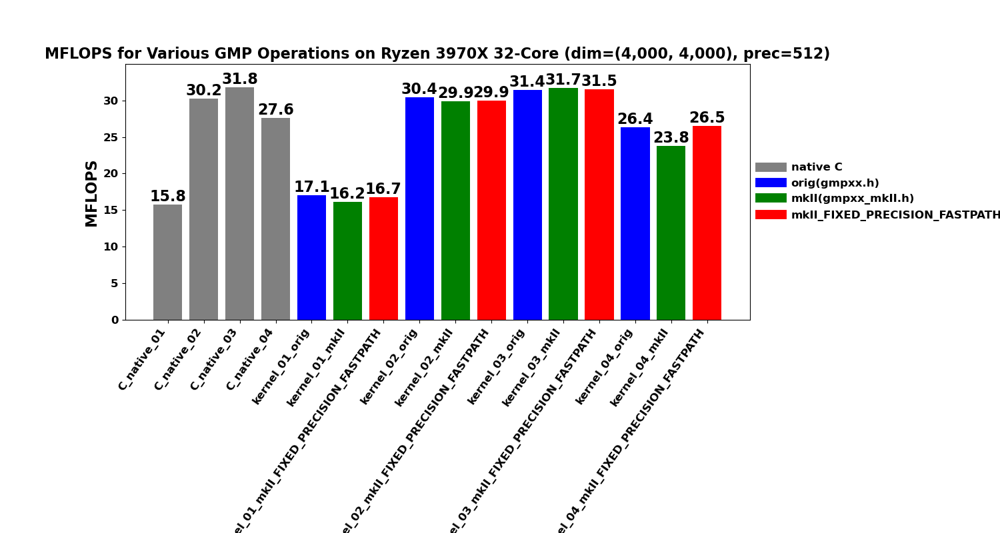
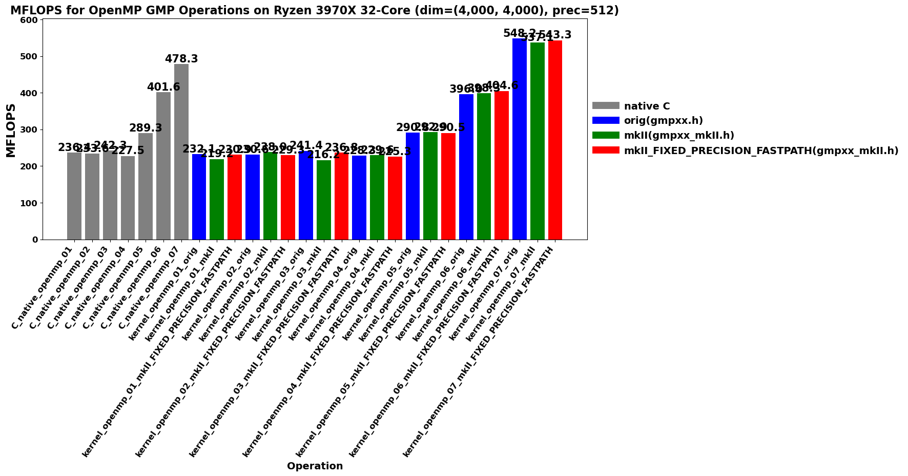

<!-- SPDX-License-Identifier: BSD-2-Clause -->

# 02_Rgemv

This directory benchmarks the GMP real dense matrix-vector product

```text
y = alpha * A * x + beta * y
```

with random `mpf` data at a fixed precision.  It compares raw `mpf_t`,
upstream `gmpxx.h`, `gmpxx_mkII`, and `gmpxx_mkII` built with
`GMPFRXX_MKII_ASSUME_FIXED_PRECISION_FASTPATH`.

This README follows the same structure as `../01_Raxpy/README.md`: build and
run instructions, result interpretation, variant catalogue, recorded samples,
memory bandwidth model, hotpath disassembly, and lessons learned.

## Build

From the repository root:

```bash
cmake -S . -B build_bench_release -DCMAKE_BUILD_TYPE=Release
cmake --build build_bench_release -j
```

The executables are created under:

```text
build_bench_release/benchmarks/gmp/02_Rgemv/
```

## Run

Run the whole benchmark set through the top-level runner:

```bash
benchmarks/common/run_benchmarks.sh build_bench_release 512
```

For a quick Rgemv-sized smoke run, pass smaller dimensions:

```bash
benchmarks/common/run_benchmarks.sh build_bench_release 128 1000 1000 32 32 16 16 16 \
    benchmarks/gmp/results-smoke
```

The `RGEMV_M RGEMV_N` runner arguments are used for Rgemv.  Individual
executables take:

```text
<rows m> <cols n> <precision>
```

Example:

```bash
build_bench_release/benchmarks/gmp/02_Rgemv/Rgemv_gmp_kernel_01_mkII 4000 4000 512
```

For OpenMP runs, keep affinity explicit:

```bash
OMP_NUM_THREADS=32 OMP_PLACES=cores OMP_PROC_BIND=spread \
build_bench_release/benchmarks/gmp/02_Rgemv/Rgemv_gmp_kernel_openmp_03_mkII \
    4000 4000 512
```

## Reading Results

Each executable prints `Elapsed time`, `MFLOPS`, `L1 Norm of difference`, and a
`Result OK` or `Result NG` check against the reference result.  Higher MFLOPS
is better when the correctness check is `Result OK`.

Suffix legend:

| Suffix | Meaning |
|---|---|
| `*_orig` | Upstream `gmpxx.h`. |
| `*_mkII` | This header with the default precision policy. |
| `*_mkII_FIXED_PRECISION_FASTPATH` | Build with `GMPFRXX_MKII_ASSUME_FIXED_PRECISION_FASTPATH`. |
| `*_openmp_*` | OpenMP variant. |

## Variants

C-native executables are raw `mpf_t` implementations.  C++ wrapper executables
exercise `gmpxx.h` / `gmpxx_mkII`.  Number suffixes are aligned across
implementations: `C_native_NN` is the raw counterpart of C++ `kernel_NN`, and
the same holds for `C_native_openmp_NN` and `kernel_openmp_NN`.

The timed body is `_Rgemv()` in each executable.  The `Rgemv()` helper in
`Rgemv.hpp` is the post-run correctness reference and should not be mixed
with the timed-kernel source-shape comparison.

The serial kernels use the same column-oriented update order as the reference
BLAS-style `Rgemv` routine, so they are close to a sequence of Raxpy updates.
The OpenMP kernels deliberately switch to row partitioning (or, in
kernel 07, column partitioning with a final reduction) because the
column-oriented update would otherwise write the same `y[i]` from multiple
threads.

### Serial kernels (column-major AXPY order)

| N | Source shape | Temporary policy | Hotpath meaning |
|---|---|---|---|
| 01 | `y[i] += (alpha * x[j]) * A[i + j*lda]`. | Inner-loop materialization of a product object (C++: expression-template node; C: `mpf_init`/`mpf_clear` per element). | Direct nested expression / inner-loop materialization stress case. |
| 02 | `temp = alpha; temp *= x[j]; templ = temp; templ *= A[i + j*lda]; y[i] += templ`. | Reusable `temp` and `templ`, copy-then-multiply. | Avoids loop-local construction but pays explicit copies. |
| 03 | `temp = alpha * x[j]; templ = temp * A[i + j*lda]; y[i] += templ`. | Reusable `temp` and `templ`, expression assignment. | Optimized serial baseline: reusable storage and direct product assignment. |
| 04 | Loop-local `temp = alpha * x[j]`; loop-local `templ = temp * A[i + j*lda]`; `y[i] += templ`. | `temp` and `templ` initialized/cleared in the inner loop. | Allocation/lifetime stress case. |

### OpenMP kernels (row-partitioned to avoid races on `y[i]`, except 07)

| N | Partitioning | Source shape | Temporary policy | Hotpath meaning |
|---|---|---|---|---|
| 01 | Row | Direct expression (same source shape as serial 01). | Per-thread inner-loop product materialization. | Safe OpenMP version of direct-expression source. |
| 02 | Row | Copy-then-multiply (same as serial 02). | Per-thread reusable `temp` and `templ`. | Safe OpenMP version of `kernel_02`. |
| 03 | Row | Expression assignment (same as serial 03). | Per-thread reusable `temp` and `templ`. | Optimized row-partitioned baseline. |
| 04 | Row | Loop-local expression assignment (same as serial 04). | Loop-local `temp` and `templ`. | OpenMP allocation/lifetime stress case. |
| 05 | Row | Precompute `scaled_x[j] = alpha * x[j]`, then `y[i] += scaled_x[j] * A[i + j*lda]`. | Shared read-only `scaled_x` vector, per-thread reusable `prod`. | Removes repeated `alpha*x[j]` from row-partitioned OpenMP. |
| 06 | Row, 256-row blocks | Each block owns `y[ib:iend]`, loops over `j`, then contiguous `i` inside the block. | Per-thread reusable `temp` and `prod`. | Restores contiguous `A` access inside each block; main OpenMP locality optimization. |
| 07 | Column | Thread-local partial `y` vectors, final reduction. | `num_threads * m` partial accumulators plus reduction. | Keeps serial-like column-major `A` stream without races, at high reduction cost. |

## Recorded Sample

One full local rerun on `Linux_Ryzen_3970X_32-Core` covers every current
serial and OpenMP Rgemv executable:

```text
M = 4000
N = 4000
precision = 512
OMP_NUM_THREADS = 32
OMP_PLACES = cores
OMP_PROC_BIND = spread
repeat = 1
```

- **20260516_135342**
  - [Raw log](results_raw/rgemv_gmp_m4000_n4000_p512_20260516_135342/benchmark_rgemv_gmp_m4000_n4000_p512.log)
  - [CSV summary](results_raw/rgemv_gmp_m4000_n4000_p512_20260516_135342/summary_rgemv_gmp_m4000_n4000_p512.csv)
  - [Serial plot](results_raw/rgemv_gmp_m4000_n4000_p512_20260516_135342/singlecore_operations_Linux_Ryzen_3970X_32-Core_4000_4000_512.png)
  - [OpenMP plot](results_raw/rgemv_gmp_m4000_n4000_p512_20260516_135342/openmp_operations_Linux_Ryzen_3970X_32-Core_4000_4000_512.png)

All 44 variants report `Result OK`.





### MFLOPS

| Variant | MFLOPS |
|---|---:|
| `C_native_01` | 15.763 |
| `C_native_02` | 30.217 |
| `C_native_03` | 31.796 |
| `C_native_04` | 27.557 |
| `kernel_01_orig` | 17.055 |
| `kernel_01_mkII` | 16.164 |
| `kernel_01_mkII_FIXED_PRECISION_FASTPATH` | 16.715 |
| `kernel_02_orig` | 30.412 |
| `kernel_02_mkII` | 29.881 |
| `kernel_02_mkII_FIXED_PRECISION_FASTPATH` | 29.930 |
| `kernel_03_orig` | 31.449 |
| `kernel_03_mkII` | 31.699 |
| `kernel_03_mkII_FIXED_PRECISION_FASTPATH` | 31.523 |
| `kernel_04_orig` | 26.360 |
| `kernel_04_mkII` | 23.808 |
| `kernel_04_mkII_FIXED_PRECISION_FASTPATH` | 26.536 |
| `C_native_openmp_01` | 236.437 |
| `C_native_openmp_02` | 233.591 |
| `C_native_openmp_03` | 242.287 |
| `C_native_openmp_04` | 227.481 |
| `C_native_openmp_05` | 289.323 |
| `C_native_openmp_06` | 401.599 |
| `C_native_openmp_07` | 478.256 |
| `kernel_openmp_01_orig` | 232.090 |
| `kernel_openmp_01_mkII` | 219.209 |
| `kernel_openmp_01_mkII_FIXED_PRECISION_FASTPATH` | 230.853 |
| `kernel_openmp_02_orig` | 230.637 |
| `kernel_openmp_02_mkII` | 237.991 |
| `kernel_openmp_02_mkII_FIXED_PRECISION_FASTPATH` | 229.291 |
| `kernel_openmp_03_orig` | 241.375 |
| `kernel_openmp_03_mkII` | 216.211 |
| `kernel_openmp_03_mkII_FIXED_PRECISION_FASTPATH` | 236.828 |
| `kernel_openmp_04_orig` | 228.304 |
| `kernel_openmp_04_mkII` | 229.615 |
| `kernel_openmp_04_mkII_FIXED_PRECISION_FASTPATH` | 225.301 |
| `kernel_openmp_05_orig` | 290.811 |
| `kernel_openmp_05_mkII` | 292.914 |
| `kernel_openmp_05_mkII_FIXED_PRECISION_FASTPATH` | 290.491 |
| `kernel_openmp_06_orig` | 396.049 |
| `kernel_openmp_06_mkII` | 398.313 |
| `kernel_openmp_06_mkII_FIXED_PRECISION_FASTPATH` | 404.639 |
| `kernel_openmp_07_orig` | 548.248 |
| `kernel_openmp_07_mkII` | 537.083 |
| `kernel_openmp_07_mkII_FIXED_PRECISION_FASTPATH` | 543.266 |

Headline reading:

- **Serial.** `kernel_03` is the useful wrapper shape (~31.5 MFLOPS, same
  class as raw C native).  `kernel_01` is roughly half because of inner-loop
  product materialization (see disassembly below).  `kernel_04` is slower
  by design because loop-local product objects are the stress case.
- **OpenMP, row-partitioned 0104.**  Most variants are in the 225-242 MFLOPS
  class, with the single `kernel_openmp_03_mkII` run lower at 216 MFLOPS.
  Row partitioning fixes the earlier OpenMP 02 correctness problem.
- **OpenMP 0507.**  Source-shape changes deliver substantial single-run
  gains over the row-partitioned 03 baseline: precomputed `alpha*x`
  (~290 MFLOPS), 256-row blocking (~400 MFLOPS), and column partitioning with
  thread-local reduction (~540-550 MFLOPS for wrappers).  These are single-run
  numbers, so repeat-count runs and hardware counters are needed before
  treating the 07 advantage as final.

### Superseded sample

An earlier sample from 20260430 lives under
[../results_raw/Linux_Ryzen_3970X_32-Core/](../results_raw/Linux_Ryzen_3970X_32-Core/)
([raw log](../results_raw/Linux_Ryzen_3970X_32-Core/benchmark_20260430_081331.log),
[serial plot](../results_raw/Linux_Ryzen_3970X_32-Core/benchmark_20260430_081331_Linux_Ryzen_3970X_32-Core_serial_Rgemv.png),
[OpenMP plot](../results_raw/Linux_Ryzen_3970X_32-Core/benchmark_20260430_081331_Linux_Ryzen_3970X_32-Core_openmp_Rgemv.png)).
That sample predates the current `kernel_03` / `kernel_04` /
`kernel_openmp_03` split and the row-partitioned OpenMP rewrite that removed
loop-local `mpf_init` / `mpf_clear` from the timed inner loops.  It is kept
for archival comparison only; new runs should use the current `go.sh` or
the common runner.

## Memory Bandwidth Estimate

This section estimates logical memory bandwidth from the same 512-bit run.
It is **not** a hardware-counter measurement.  It is a lower-bound model for
comparing kernel source shapes.

On this machine, `sizeof(__mpf_struct) = 24` bytes and `sizeof(mp_limb_t) = 8`
bytes.  For `mpf_init2(..., 512)`, GMP reports `_mp_prec = 9` limbs, while
the random benchmark inputs have 8 active limbs.  Therefore:

```text
active mpf value bytes    = 24-byte header + 8 active limbs * 8 = 88 bytes
allocated mpf footprint   = 24-byte header + 9 allocated limbs * 8 = 96 bytes
A-only active stream GB/s = MFLOPS * 0.044
A+y active logical GB/s   = MFLOPS * 0.132
A+x+y active logical GB/s = MFLOPS * 0.176
```

The `A-only` number is the minimum matrix stream implied by the reported
MFLOPS.  `A+y` also counts one read and one write of `y` per matrix element.
`A+x+y` additionally counts `x` for each matrix element; that is an upper
logical model for row-partitioned loops because `x` is small enough to be
heavily reused from cache.  These are active-limb estimates; using the
96-byte allocated footprint scales the numbers by `96/88 = 1.091`.

| Variant | MFLOPS | A-only GB/s | A+y GB/s | A+x+y GB/s |
|---|---:|---:|---:|---:|
| `kernel_openmp_03_mkII` | 216.211 | 9.513 | 28.540 | 38.053 |
| `kernel_openmp_05_mkII` | 292.914 | 12.888 | 38.665 | 51.553 |
| `kernel_openmp_06_mkII` | 398.313 | 17.526 | 52.577 | 70.103 |
| `kernel_openmp_07_mkII` | 537.083 | 23.632 | 70.895 | 94.527 |
| `C_native_openmp_07` | 478.256 | 21.043 | 63.130 | 84.173 |

The progression is consistent with the source-shape changes.  Kernel 05
removes repeated `alpha*x[j]` work but still uses row-partitioned strided
matrix access.  Kernel 06 restores contiguous `A` access inside each row
block.  Kernel 07 keeps the serial-like column-major `A` stream and pays for
thread-local `y` partial vectors plus final reduction.  Its logical
bandwidth estimate is high enough that repeat-count runs and hardware
counters are needed before treating the single-run ordering as final.

## Hotpath Disassembly

The snippets below are from Release binaries under
`build_bench_release/benchmarks/gmp/02_Rgemv/`.  They focus on the timed
`_Rgemv()` loop or, for OpenMP, the outlined loop body.

### `C_native_03`

Raw C native `C_native_03` initializes `temp` and `templ` once, scales `y`
once, then uses a column-major AXPY loop.  The inner loop is one `mpf_mul`
plus one `mpf_add`.  (This executable was named `C_native_01` when the
recorded single-run table was taken.)

```asm
56c0: mov    0x8(%rsp),%rdx       # x[j]
56c5: mov    0x20(%rsp),%rsi      # alpha
56ca: lea    0x40(%rsp),%rdi      # temp_b
56cf: call   __gmpf_mul@plt       # temp_b = alpha * x[j]

5700: mov    %r14,%rdx            # A[i + j*lda]
5703: lea    0x40(%rsp),%rsi      # temp_b
5708: mov    %rbp,%rdi            # prod
570f: call   __gmpf_mul@plt       # prod = temp_b * A
5714: mov    %rbx,%rsi            # y[i]
5717: mov    %rbx,%rdi            # y[i]
571a: mov    %rbp,%rdx            # prod
571d: call   __gmpf_add@plt       # y[i] += prod
5722: add    $0x18,%r14           # A++
5726: add    $0x18,%rbx           # y++
572d: jne    5700
```

### `kernel_01_mkII`

`kernel_01` is the direct nested-expression source shape.  The hotpath shows
why it is slower: the inner loop initializes and clears a product temporary
and enters expression evaluation before the final multiply/add.

```asm
57d0: mov    0x10(%rsp),%rax
57d5: mov    %rbx,%rdi            # y[i], used for precision
57e7: call   __gmpf_get_prec@plt
57ec: mov    %rbp,%rdi            # loop-local product
57f5: call   __gmpf_init2@plt
57fa: mov    0x18(%rsp),%rsi      # binary expression node
5805: call   mpf_evaluate<mul_op,...>
580a: mov    %r12,%rdx            # A[i + j*lda]
580d: mov    %rbp,%rsi            # evaluated alpha*x[j]
5813: call   __gmpf_mul@plt
5818: mov    %rbp,%rdx
581b: mov    %rbx,%rsi
5821: call   __gmpf_add@plt
5826: mov    %rbp,%rdi
5835: call   __gmpf_clear@plt
583f: jne    57d0
```

This explains the measured gap: `kernel_01_mkII` is 16.164 MFLOPS while
`kernel_03_mkII` is 31.699 MFLOPS in the 20260516_135342 run.

### `kernel_03_mkII`

`kernel_03` keeps `temp` and `templ` outside the loop.  After one-time
initialization, the inner loop is the same call class as C native: one
`mpf_mul` plus one `mpf_add`.

```asm
57c0: mov    0x8(%rsp),%rdx       # x[j]
57c5: mov    0x20(%rsp),%rsi      # alpha
57ca: lea    0x40(%rsp),%rdi      # temp
57cf: call   __gmpf_mul@plt       # temp = alpha * x[j]

5800: mov    %r12,%rdx            # A[i + j*lda]
5803: lea    0x40(%rsp),%rsi      # temp
5808: mov    %r13,%rdi            # templ
580b: call   __gmpf_mul@plt       # templ = temp * A
5810: mov    %r13,%rdx            # templ
5813: mov    %rbx,%rsi            # y[i]
5816: mov    %rbx,%rdi            # y[i]
5819: call   __gmpf_add@plt       # y[i] += templ
581e: add    $0x1,%rbp
5822: add    $0x18,%r12           # A++
5826: add    $0x18,%rbx           # y++
582d: jne    5800
```

This is why `kernel_03_mkII` is in the C native serial performance class.

### `kernel_openmp_03_mkII`

The OpenMP path is row-partitioned.  Each thread initializes private `temp`
and `templ` once.  For each owned row, it first scales `y[i]`, then loops
over columns.  The inner column loop has two multiplies and one add:

```asm
4020: mov    0x30(%r15),%rdx      # beta
4024: mov    %r14,%rsi            # y[i]
4027: mov    %r14,%rdi            # y[i]
402f: call   __gmpf_mul@plt       # y[i] *= beta

4070: mov    0x10(%rbx),%rsi      # alpha
4074: mov    0x8(%rsp),%rdi       # temp
4079: mov    %r15,%rdx            # x[j]
4084: call   __gmpf_mul@plt       # temp = alpha * x[j]
4089: mov    0x8(%rsp),%rsi       # temp
408e: mov    %r13,%rdx            # A[i + j*lda]
4091: mov    %rbp,%rdi            # templ
4094: call   __gmpf_mul@plt       # templ = temp * A
4099: mov    %rbp,%rdx            # templ
409c: mov    %r14,%rsi            # y[i]
409f: mov    %r14,%rdi            # y[i]
40a2: call   __gmpf_add@plt       # y[i] += templ
40a7: add    0x18(%rsp),%r13      # next A row-stride access
40b1: jne    4070
```

Compared with serial `kernel_03`, this row-partitioned OpenMP path
recomputes `alpha * x[j]` for each row instead of once per column.  That is
the price paid to avoid races on `y[i]`.  Despite the extra outer-loop work,
the 0104 row-partitioned OpenMP kernels are mostly in the 225-242 MFLOPS class
on 32 threads in the 20260516_135342 run.  Kernel 05 was added specifically to
remove this recomputation.

## Lessons Learned

- Serial: `kernel_03` (reusable expression-assignment temporaries) is the
  useful wrapper shape; the hot path reduces to the same GMP call class as
  C native.  `kernel_01` and `kernel_04` exist as deliberate stress cases
  for expression-template materialization and loop-local lifetime
  respectively.
- OpenMP: row partitioning avoids races on `y[i]` and puts kernels 0104
  mostly into the same 225-242 MFLOPS class.  Beyond that, source-shape changes
  scale up substantially in single runs ― precomputed `alpha*x` (kernel 05),
  256-row blocking (kernel 06), column partitioning with thread-local
  reduction (kernel 07).  Single-run ordering only; needs repeat-count
  confirmation.
- All variants in the 20260516_135342 full rerun report `Result OK`.
