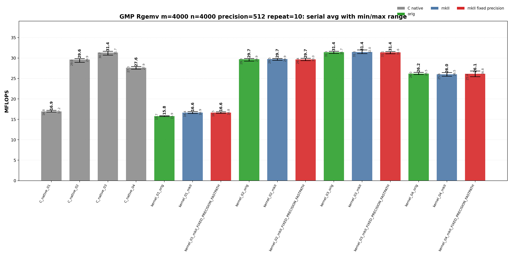
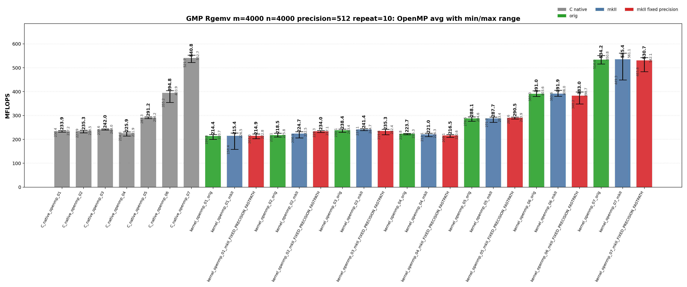
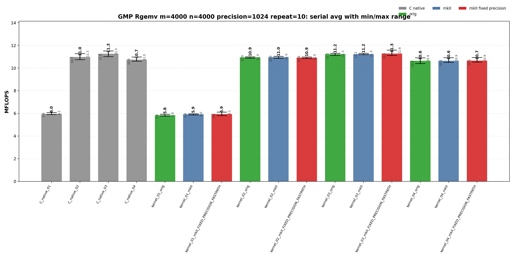
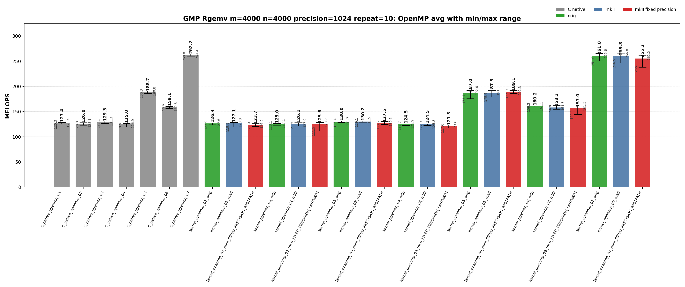

<!-- SPDX-License-Identifier: BSD-2-Clause -->

# 02_Rgemv

This directory benchmarks the GMP real dense matrix-vector product

```text
y <- alpha * A * x + beta * y
```

with fixed-precision `mpf_t`, upstream `gmpxx.h`, and `gmpxx_mkII` data. The
performance question is which source-level temporary policy and OpenMP work
partitioning shape determine the emitted GMP hot loop.

## Build

From the repository root:

```bash
cmake -S . -B build_bench_release -DCMAKE_BUILD_TYPE=Release
cmake --build build_bench_release -j
```

Executables are created under:

```text
build_bench_release/benchmarks/gmp/02_Rgemv/
```

Each executable takes `<rows m> <cols n> <precision>`. Example:

```bash
build_bench_release/benchmarks/gmp/02_Rgemv/Rgemv_gmp_kernel_03_mkII 4000 4000 512
```

The repeat-10 run used:

```bash
OMP_NUM_THREADS=32 OMP_PLACES=cores OMP_PROC_BIND=spread \
    benchmarks/gmp/02_Rgemv/run_repeat.sh build_bench_release 4000 4000 512 10
```

The mkII fixed-precision variants use `GMPFRXX_MKII_FAST_FIXED_PREC`;
executable suffixes keep the historical `FIXED_PRECISION_FASTPATH` label for
benchmark continuity.

The cross-benchmark runner can execute the GMP and MPFR `00_Rdot`, `01_Raxpy`, and `02_Rgemv` suites for both standard precisions with one command:

```bash
OMP_NUM_THREADS=32 OMP_PLACES=cores OMP_PROC_BIND=spread \
    benchmarks/run_all.sh build_bench_release 512,1024 10 10000000 10000000 4000 4000
```

The second argument is a precision list. `both` and `all` are aliases for `512,1024`; a single value such as `512` still runs only that precision. Per-benchmark results are written to `results_raw/run_all_p512_repeat10_<timestamp>/` and `results_raw/run_all_p1024_repeat10_<timestamp>/` under each benchmark directory.

## Benchmark Parameters

| Parameter | Meaning |
| --- | --- |
| `m` | Number of matrix rows and length of `y`. |
| `n` | Number of matrix columns and length of `x`. |
| `precision` | Requested GMP `mpf` precision in bits for matrix/vector/scalar inputs and temporaries. |
| `repeat` | Number of timed process executions per executable. |
| `OMP_NUM_THREADS` | OpenMP worker count for `openmp` executables. |
| `OMP_PLACES`, `OMP_PROC_BIND` | OpenMP affinity controls used by the runner. |

The committed runs use `m=4000`, `n=4000`, `repeat=10`, `precision=512` and `precision=1024`, with `OMP_NUM_THREADS=32`, `OMP_PLACES=cores`, and `OMP_PROC_BIND=spread`.

## Variant Shapes

The timed body is `_Rgemv()`. `A` is stored in column-major order. The same numeric suffix has the same source-level meaning for raw C, upstream C++, mkII, serial, and OpenMP targets when that execution mode implements it. Serial targets cover `01`-`04`; OpenMP targets cover `01`-`07`.

| Variant | Transition from previous variant | Timed source shape | Temporary/resource policy | Purpose |
| --- | --- | --- | --- | --- |
| `01` | Baseline nested-expression shape for serial and OpenMP. | `y[i] += (alpha * x[j]) * A[i + j*lda]` | Product materializes inside the inner loop. Raw C initializes and clears a product `mpf_t` per matrix element. | Direct nested-expression stress case. |
| `02` | `01 -> 02`: introduce reusable copy-then-multiply temporaries. | `temp = alpha; temp *= x[j]; templ = temp; templ *= A[i + j*lda]; y[i] += templ` | `temp` and `templ` are initialized before the loops and reused. | Copy-then-multiply reusable-temporary path. |
| `03` | `02 -> 03`: keep reusable storage but assign temporaries from product expressions. | `temp = alpha * x[j]; templ = temp * A[i + j*lda]; y[i] += templ` | `temp` and `templ` are initialized before the loops and assigned from product expressions. | Main optimized serial wrapper baseline. |
| `04` | `03 -> 04`: move product object lifetime into the loop nest. | Loop-local `temp = alpha * x[j]`; loop-local `templ = temp * A[i + j*lda]`; `y[i] += templ` | Product objects are constructed inside the loop nest. | Lifetime/allocation stress case. |
| `05` | OpenMP branch from row-partitioned `03`: precompute `alpha * x[j]`. | Precompute `scaled_x[j] = alpha * x[j]`, then row-partitioned update. | Shared read-only `scaled_x`, per-thread reusable product object. | Remove repeated `alpha * x[j]` from row-partitioned OpenMP. |
| `06` | `05 -> 06`: add fixed 256-row blocking. | 256-row blocks, then column loop and contiguous row loop inside each block. | Per-thread reusable `temp` and `prod`. | Restore contiguous `A` access inside each row block. |
| `07` | `06 -> 07`: switch ownership to column partitioning with final reduction. | Column partitioning with thread-local partial `y` vectors and final reduction. | `num_threads * m` partial accumulators plus final reduction. | Keep serial-like column-major `A` streaming without racing on `y`. |

## Source Transitions

`01 -> 02` replaces direct nested products with reusable copy-then-multiply temporaries while keeping the column-major update structure. `02 -> 03` keeps reusable storage but assigns temporaries from product expressions, which is the main serial optimized comparison point. `03 -> 04` moves product object lifetime into the loop nest as a construction stress case. OpenMP `05` branches from the row-partitioned reusable class by precomputing `alpha * x`; `05 -> 06` adds fixed 256-row blocking; `06 -> 07` changes ownership from rows to columns and uses thread-local partial `y` vectors plus final reduction.

## C Native Equivalent Kernels

The mapping is based on the timed `_Rgemv()` hot-loop source shape, not just on
matching numeric suffixes.

| C native kernel | Equivalent C++ wrapper kernel(s) | Equivalence notes |
|-----------------|----------------------------------|-------------------|
| `C_native_01` | Closest to `kernel_01_*` | Raw C performs direct nested multiplication with a product `mpf_t` initialized and cleared for every matrix element. |
| `C_native_02` | `kernel_02_*` | Reusable `temp` and `templ` with explicit copy-then-multiply operations. |
| `C_native_03` | `kernel_03_*` | Reusable `temp_b` and `prod` assigned directly from product operations. This is the primary optimized serial C equivalent. |
| `C_native_04` | `kernel_04_*` | Loop-local `temp` and `templ` objects inside the loop nest. |
| `C_native_openmp_01` | `kernel_openmp_01_*` | Row-partitioned direct-expression stress shape. |
| `C_native_openmp_02` | `kernel_openmp_02_*` | Row-partitioned copy-then-multiply with per-thread reusable temporaries. |
| `C_native_openmp_03` | `kernel_openmp_03_*` | Row-partitioned expression-assignment path with per-thread reusable temporaries. |
| `C_native_openmp_04` | `kernel_openmp_04_*` | Row-partitioned loop-local product-object stress case. |
| `C_native_openmp_05` | `kernel_openmp_05_*` | Precomputed `scaled_x` row-partitioned path. |
| `C_native_openmp_06` | `kernel_openmp_06_*` | 256-row blocked row-partitioned path. |
| `C_native_openmp_07` | `kernel_openmp_07_*` | Column-partitioned thread-local partial-vector reduction path. |

`kernel_01_*` is an expression-template spelling, so its exact C native class is
confirmed by disassembly rather than by the suffix alone.

## Recorded Run

### 512-bit run

| Field | Value |
|-------|-------|
| Run ID | `run_all_p512_repeat10_20260527_094954` |
| Date | 2026-05-27 |
| CPU | AMD Ryzen Threadripper 3970X 32-Core Processor |
| OS | Linux 6.8.0-94-generic x86_64 |
| Compiler | `c++ (Ubuntu 15.2.0-16ubuntu1) 15.2.0` |
| Build type | Release |
| Problem size | `m=4000`, `n=4000` |
| Precision | 512 bits |
| Repeat count | 10 |
| OpenMP | `OMP_NUM_THREADS=32`, `OMP_PLACES=cores`, `OMP_PROC_BIND=spread` |
| Default precision env | `GMPXX_DEFAULT_MPF_PRECISION_BITS=512` |
| Benchmark command | `OMP_NUM_THREADS=32 OMP_PLACES=cores OMP_PROC_BIND=spread benchmarks/run_all.sh build_bench_release 512,1024 10` |
| Raw result directory | `benchmarks/gmp/02_Rgemv/results_raw/run_all_p512_repeat10_20260527_094954/` |
| Raw log | `benchmarks/gmp/02_Rgemv/results_raw/run_all_p512_repeat10_20260527_094954/benchmark_rgemv_gmp_m4000_n4000_p512_repeat10.log` |
| Raw CSV | `benchmarks/gmp/02_Rgemv/results_raw/run_all_p512_repeat10_20260527_094954/raw_rgemv_gmp_m4000_n4000_p512_repeat10.csv` |
| Summary CSV | `benchmarks/gmp/02_Rgemv/results_raw/run_all_p512_repeat10_20260527_094954/summary_rgemv_gmp_m4000_n4000_p512_repeat10.csv` |
| Correctness | 440 / 440 runs reported OK. |





Plot regeneration command:

```bash
python3 benchmarks/gmp/02_Rgemv/plot_repeat_summary.py \
    benchmarks/gmp/02_Rgemv/results_raw/run_all_p512_repeat10_20260527_094954/benchmark_rgemv_gmp_m4000_n4000_p512_repeat10.log \
    --output-dir benchmarks/gmp/02_Rgemv/results_raw/run_all_p512_repeat10_20260527_094954 \
    --output-prefix rgemv_gmp_m4000_n4000_p512_repeat10 \
    --title-prefix "GMP Rgemv m=4000, n=4000, precision=512, repeat=10"
```

### 1024-bit run

| Field | Value |
|-------|-------|
| Run ID | `run_all_p1024_repeat10_20260527_094954` |
| Date | 2026-05-27 |
| CPU | AMD Ryzen Threadripper 3970X 32-Core Processor |
| OS | Linux 6.8.0-94-generic x86_64 |
| Compiler | `c++ (Ubuntu 15.2.0-16ubuntu1) 15.2.0` |
| Build type | Release |
| Problem size | `m=4000`, `n=4000` |
| Precision | 1024 bits |
| Repeat count | 10 |
| OpenMP | `OMP_NUM_THREADS=32`, `OMP_PLACES=cores`, `OMP_PROC_BIND=spread` |
| Default precision env | `GMPXX_DEFAULT_MPF_PRECISION_BITS=1024` |
| Benchmark command | `OMP_NUM_THREADS=32 OMP_PLACES=cores OMP_PROC_BIND=spread benchmarks/run_all.sh build_bench_release 512,1024 10` |
| Raw result directory | `benchmarks/gmp/02_Rgemv/results_raw/run_all_p1024_repeat10_20260527_094954/` |
| Raw log | `benchmarks/gmp/02_Rgemv/results_raw/run_all_p1024_repeat10_20260527_094954/benchmark_rgemv_gmp_m4000_n4000_p1024_repeat10.log` |
| Raw CSV | `benchmarks/gmp/02_Rgemv/results_raw/run_all_p1024_repeat10_20260527_094954/raw_rgemv_gmp_m4000_n4000_p1024_repeat10.csv` |
| Summary CSV | `benchmarks/gmp/02_Rgemv/results_raw/run_all_p1024_repeat10_20260527_094954/summary_rgemv_gmp_m4000_n4000_p1024_repeat10.csv` |
| Correctness | 440 / 440 runs reported OK. |





Plot regeneration command:

```bash
python3 benchmarks/gmp/02_Rgemv/plot_repeat_summary.py \
    benchmarks/gmp/02_Rgemv/results_raw/run_all_p1024_repeat10_20260527_094954/benchmark_rgemv_gmp_m4000_n4000_p1024_repeat10.log \
    --output-dir benchmarks/gmp/02_Rgemv/results_raw/run_all_p1024_repeat10_20260527_094954 \
    --output-prefix rgemv_gmp_m4000_n4000_p1024_repeat10 \
    --title-prefix "GMP Rgemv m=4000, n=4000, precision=1024, repeat=10"
```

## Resource or Bandwidth Estimates

The values below are model estimates derived from MFLOPS, not hardware-counter measurements. They count active limb bytes plus a header-inclusive object model. They exclude allocator metadata, cache-line overfetch, instruction fetch, and final OpenMP reduction traffic.

| Case | Representative best-avg variant | Avg MFLOPS | Active bytes/iteration | Header-inclusive bytes/iteration | Active GB/s | Header-inclusive GB/s |
| --- | --- | --- | --- | --- | --- | --- |
| 512-bit serial | `kernel_03_mkII` | 31.449 | 192 | 264 | 3.019 | 4.151 |
| 512-bit OpenMP | `C_native_openmp_07` | 540.759 | 192 | 264 | 51.913 | 71.380 |
| 1024-bit serial | `kernel_03_mkII_FIXED_PRECISION_FASTPATH` | 11.268 | 384 | 456 | 2.163 | 2.569 |
| 1024-bit OpenMP | `C_native_openmp_07` | 262.194 | 384 | 456 | 50.341 | 59.780 |

For `Rgemv`, the per-iteration byte model is a compact arithmetic-stream estimate. It is not a full cache-footprint or hardware-bandwidth measurement.

## Headline Results

The headline rows below are regenerated from the committed 512-bit and 1024-bit `run_all` summary CSV files.

| Precision | Class | Variant | Max MFLOPS | Avg MFLOPS | Interpretation |
| --- | --- | --- | --- | --- | --- |
| 512 | Best max serial | `kernel_03_mkII` | 31.991 | 31.449 | mkII wrapper baseline for the numbered source shape. |
| 512 | Best average serial | `kernel_03_mkII` | 31.991 | 31.449 | mkII wrapper baseline for the numbered source shape. |
| 512 | Best max OpenMP | `kernel_openmp_07_mkII` | 561.056 | 535.418 | mkII wrapper baseline for the numbered source shape. |
| 512 | Best average OpenMP | `C_native_openmp_07` | 552.697 | 540.759 | Raw C OpenMP column-partitioned class with per-thread partial vectors and final reduction outside the hot loop. |
| 1024 | Best max serial | `kernel_03_mkII_FIXED_PRECISION_FASTPATH` | 11.586 | 11.268 | mkII fixed-precision build; intended to remove repeated scratch setup when the source shape uses expression materialization. |
| 1024 | Best average serial | `kernel_03_mkII_FIXED_PRECISION_FASTPATH` | 11.586 | 11.268 | mkII fixed-precision build; intended to remove repeated scratch setup when the source shape uses expression materialization. |
| 1024 | Best max OpenMP | `kernel_openmp_07_mkII` | 266.001 | 259.771 | mkII wrapper baseline for the numbered source shape. |
| 1024 | Best average OpenMP | `C_native_openmp_07` | 264.362 | 262.194 | Raw C OpenMP column-partitioned class with per-thread partial vectors and final reduction outside the hot loop. |

## Serial Results

### 512-bit serial interpretation

These rows are derived from `benchmarks/gmp/02_Rgemv/results_raw/run_all_p512_repeat10_20260527_094954/summary_rgemv_gmp_m4000_n4000_p512_repeat10.csv`.

| Observation | Variant | Max MFLOPS | Avg MFLOPS | Min MFLOPS | Interpretation |
| --- | --- | --- | --- | --- | --- |
| Best raw C average | `C_native_03` | 31.672 | 31.356 | 30.726 | Raw C reference for the numbered source shape. |
| Best upstream average | `kernel_03_orig` | 31.681 | 31.420 | 31.116 | Upstream gmpxx.h wrapper for the same numbered source shape. |
| Best mkII baseline average | `kernel_03_mkII` | 31.991 | 31.449 | 31.084 | mkII wrapper baseline for the numbered source shape. |
| Best mkII fixed-precision average | `kernel_03_mkII_FIXED_PRECISION_FASTPATH` | 31.583 | 31.390 | 31.062 | mkII fixed-precision build; intended to remove repeated scratch setup when the source shape uses expression materialization. |
| Best max | `kernel_03_mkII` | 31.991 | 31.449 | 31.084 | mkII wrapper baseline for the numbered source shape. |

<details>
<summary>512-bit serial results sorted by Max MFLOPS</summary>

| Rank | Variant | Max MFLOPS | Avg MFLOPS | Min MFLOPS |
| --- | --- | --- | --- | --- |
| 1 | `kernel_03_mkII` | 31.991 | 31.449 | 31.084 |
| 2 | `kernel_03_orig` | 31.681 | 31.420 | 31.116 |
| 3 | `C_native_03` | 31.672 | 31.356 | 30.726 |
| 4 | `kernel_03_mkII_FIXED_PRECISION_FASTPATH` | 31.583 | 31.390 | 31.062 |
| 5 | `kernel_02_mkII_FIXED_PRECISION_FASTPATH` | 29.959 | 29.677 | 29.377 |
| 6 | `kernel_02_orig` | 29.924 | 29.709 | 29.259 |
| 7 | `kernel_02_mkII` | 29.920 | 29.741 | 29.475 |
| 8 | `C_native_02` | 29.875 | 29.625 | 28.952 |
| 9 | `C_native_04` | 27.945 | 27.628 | 27.291 |
| 10 | `kernel_04_mkII_FIXED_PRECISION_FASTPATH` | 26.818 | 26.135 | 25.427 |
| 11 | `kernel_04_orig` | 26.499 | 26.192 | 25.983 |
| 12 | `kernel_04_mkII` | 26.464 | 26.029 | 25.568 |
| 13 | `C_native_01` | 17.231 | 16.935 | 16.796 |
| 14 | `kernel_01_mkII` | 16.884 | 16.633 | 16.434 |
| 15 | `kernel_01_mkII_FIXED_PRECISION_FASTPATH` | 16.849 | 16.639 | 16.500 |
| 16 | `kernel_01_orig` | 15.914 | 15.795 | 15.701 |

</details>

<details>
<summary>512-bit serial results sorted by Avg MFLOPS</summary>

| Rank | Variant | Max MFLOPS | Avg MFLOPS | Min MFLOPS |
| --- | --- | --- | --- | --- |
| 1 | `kernel_03_mkII` | 31.991 | 31.449 | 31.084 |
| 2 | `kernel_03_orig` | 31.681 | 31.420 | 31.116 |
| 3 | `kernel_03_mkII_FIXED_PRECISION_FASTPATH` | 31.583 | 31.390 | 31.062 |
| 4 | `C_native_03` | 31.672 | 31.356 | 30.726 |
| 5 | `kernel_02_mkII` | 29.920 | 29.741 | 29.475 |
| 6 | `kernel_02_orig` | 29.924 | 29.709 | 29.259 |
| 7 | `kernel_02_mkII_FIXED_PRECISION_FASTPATH` | 29.959 | 29.677 | 29.377 |
| 8 | `C_native_02` | 29.875 | 29.625 | 28.952 |
| 9 | `C_native_04` | 27.945 | 27.628 | 27.291 |
| 10 | `kernel_04_orig` | 26.499 | 26.192 | 25.983 |
| 11 | `kernel_04_mkII_FIXED_PRECISION_FASTPATH` | 26.818 | 26.135 | 25.427 |
| 12 | `kernel_04_mkII` | 26.464 | 26.029 | 25.568 |
| 13 | `C_native_01` | 17.231 | 16.935 | 16.796 |
| 14 | `kernel_01_mkII_FIXED_PRECISION_FASTPATH` | 16.849 | 16.639 | 16.500 |
| 15 | `kernel_01_mkII` | 16.884 | 16.633 | 16.434 |
| 16 | `kernel_01_orig` | 15.914 | 15.795 | 15.701 |

</details>

### 1024-bit serial interpretation

These rows are derived from `benchmarks/gmp/02_Rgemv/results_raw/run_all_p1024_repeat10_20260527_094954/summary_rgemv_gmp_m4000_n4000_p1024_repeat10.csv`.

| Observation | Variant | Max MFLOPS | Avg MFLOPS | Min MFLOPS | Interpretation |
| --- | --- | --- | --- | --- | --- |
| Best raw C average | `C_native_03` | 11.506 | 11.264 | 11.005 | Raw C reference for the numbered source shape. |
| Best upstream average | `kernel_03_orig` | 11.298 | 11.228 | 11.105 | Upstream gmpxx.h wrapper for the same numbered source shape. |
| Best mkII baseline average | `kernel_03_mkII` | 11.301 | 11.233 | 11.188 | mkII wrapper baseline for the numbered source shape. |
| Best mkII fixed-precision average | `kernel_03_mkII_FIXED_PRECISION_FASTPATH` | 11.586 | 11.268 | 11.108 | mkII fixed-precision build; intended to remove repeated scratch setup when the source shape uses expression materialization. |
| Best max | `kernel_03_mkII_FIXED_PRECISION_FASTPATH` | 11.586 | 11.268 | 11.108 | mkII fixed-precision build; intended to remove repeated scratch setup when the source shape uses expression materialization. |

<details>
<summary>1024-bit serial results sorted by Max MFLOPS</summary>

| Rank | Variant | Max MFLOPS | Avg MFLOPS | Min MFLOPS |
| --- | --- | --- | --- | --- |
| 1 | `kernel_03_mkII_FIXED_PRECISION_FASTPATH` | 11.586 | 11.268 | 11.108 |
| 2 | `C_native_03` | 11.506 | 11.264 | 11.005 |
| 3 | `kernel_03_mkII` | 11.301 | 11.233 | 11.188 |
| 4 | `kernel_03_orig` | 11.298 | 11.228 | 11.105 |
| 5 | `C_native_02` | 11.278 | 10.974 | 10.741 |
| 6 | `kernel_02_mkII` | 11.034 | 10.958 | 10.854 |
| 7 | `kernel_02_orig` | 10.991 | 10.948 | 10.882 |
| 8 | `kernel_02_mkII_FIXED_PRECISION_FASTPATH` | 10.982 | 10.925 | 10.841 |
| 9 | `C_native_04` | 10.982 | 10.749 | 10.603 |
| 10 | `kernel_04_mkII_FIXED_PRECISION_FASTPATH` | 10.928 | 10.659 | 10.532 |
| 11 | `kernel_04_mkII` | 10.924 | 10.643 | 10.502 |
| 12 | `kernel_04_orig` | 10.908 | 10.631 | 10.402 |
| 13 | `kernel_01_mkII_FIXED_PRECISION_FASTPATH` | 6.113 | 5.945 | 5.807 |
| 14 | `C_native_01` | 6.078 | 5.955 | 5.890 |
| 15 | `kernel_01_mkII` | 5.966 | 5.918 | 5.869 |
| 16 | `kernel_01_orig` | 5.921 | 5.841 | 5.761 |

</details>

<details>
<summary>1024-bit serial results sorted by Avg MFLOPS</summary>

| Rank | Variant | Max MFLOPS | Avg MFLOPS | Min MFLOPS |
| --- | --- | --- | --- | --- |
| 1 | `kernel_03_mkII_FIXED_PRECISION_FASTPATH` | 11.586 | 11.268 | 11.108 |
| 2 | `C_native_03` | 11.506 | 11.264 | 11.005 |
| 3 | `kernel_03_mkII` | 11.301 | 11.233 | 11.188 |
| 4 | `kernel_03_orig` | 11.298 | 11.228 | 11.105 |
| 5 | `C_native_02` | 11.278 | 10.974 | 10.741 |
| 6 | `kernel_02_mkII` | 11.034 | 10.958 | 10.854 |
| 7 | `kernel_02_orig` | 10.991 | 10.948 | 10.882 |
| 8 | `kernel_02_mkII_FIXED_PRECISION_FASTPATH` | 10.982 | 10.925 | 10.841 |
| 9 | `C_native_04` | 10.982 | 10.749 | 10.603 |
| 10 | `kernel_04_mkII_FIXED_PRECISION_FASTPATH` | 10.928 | 10.659 | 10.532 |
| 11 | `kernel_04_mkII` | 10.924 | 10.643 | 10.502 |
| 12 | `kernel_04_orig` | 10.908 | 10.631 | 10.402 |
| 13 | `C_native_01` | 6.078 | 5.955 | 5.890 |
| 14 | `kernel_01_mkII_FIXED_PRECISION_FASTPATH` | 6.113 | 5.945 | 5.807 |
| 15 | `kernel_01_mkII` | 5.966 | 5.918 | 5.869 |
| 16 | `kernel_01_orig` | 5.921 | 5.841 | 5.761 |

</details>

## OpenMP Results

### 512-bit OpenMP interpretation

These rows are derived from `benchmarks/gmp/02_Rgemv/results_raw/run_all_p512_repeat10_20260527_094954/summary_rgemv_gmp_m4000_n4000_p512_repeat10.csv`.

| Observation | Variant | Max MFLOPS | Avg MFLOPS | Min MFLOPS | Interpretation |
| --- | --- | --- | --- | --- | --- |
| Best raw C average | `C_native_openmp_07` | 552.697 | 540.759 | 521.716 | Raw C OpenMP column-partitioned class with per-thread partial vectors and final reduction outside the hot loop. |
| Best upstream average | `kernel_openmp_07_orig` | 550.810 | 534.184 | 515.977 | Upstream gmpxx.h wrapper for the same numbered source shape. |
| Best mkII baseline average | `kernel_openmp_07_mkII` | 561.056 | 535.418 | 449.266 | mkII wrapper baseline for the numbered source shape. |
| Best mkII fixed-precision average | `kernel_openmp_07_mkII_FIXED_PRECISION_FASTPATH` | 542.132 | 530.656 | 483.767 | mkII fixed-precision build; intended to remove repeated scratch setup when the source shape uses expression materialization. |
| Best max | `kernel_openmp_07_mkII` | 561.056 | 535.418 | 449.266 | mkII wrapper baseline for the numbered source shape. |

<details>
<summary>512-bit OpenMP results sorted by Max MFLOPS</summary>

| Rank | Variant | Max MFLOPS | Avg MFLOPS | Min MFLOPS |
| --- | --- | --- | --- | --- |
| 1 | `kernel_openmp_07_mkII` | 561.056 | 535.418 | 449.266 |
| 2 | `C_native_openmp_07` | 552.697 | 540.759 | 521.716 |
| 3 | `kernel_openmp_07_orig` | 550.810 | 534.184 | 515.977 |
| 4 | `kernel_openmp_07_mkII_FIXED_PRECISION_FASTPATH` | 542.132 | 530.656 | 483.767 |
| 5 | `kernel_openmp_06_mkII` | 406.019 | 391.915 | 380.599 |
| 6 | `C_native_openmp_06` | 403.857 | 394.783 | 355.168 |
| 7 | `kernel_openmp_06_orig` | 403.591 | 391.015 | 380.001 |
| 8 | `kernel_openmp_06_mkII_FIXED_PRECISION_FASTPATH` | 398.682 | 382.963 | 348.218 |
| 9 | `kernel_openmp_05_orig` | 294.585 | 288.070 | 276.460 |
| 10 | `C_native_openmp_05` | 294.233 | 291.192 | 287.294 |
| 11 | `kernel_openmp_05_mkII_FIXED_PRECISION_FASTPATH` | 293.877 | 290.533 | 285.574 |
| 12 | `kernel_openmp_05_mkII` | 293.443 | 287.675 | 271.721 |
| 13 | `kernel_openmp_03_mkII` | 244.681 | 241.417 | 237.093 |
| 14 | `C_native_openmp_03` | 243.980 | 242.027 | 239.558 |
| 15 | `kernel_openmp_03_orig` | 243.407 | 238.432 | 230.128 |
| 16 | `kernel_openmp_03_mkII_FIXED_PRECISION_FASTPATH` | 242.362 | 235.305 | 219.620 |
| 17 | `C_native_openmp_02` | 238.517 | 235.266 | 227.920 |
| 18 | `C_native_openmp_01` | 237.194 | 233.946 | 230.423 |
| 19 | `kernel_openmp_02_mkII_FIXED_PRECISION_FASTPATH` | 237.096 | 233.974 | 229.308 |
| 20 | `kernel_openmp_02_mkII` | 232.542 | 224.652 | 206.136 |
| 21 | `C_native_openmp_04` | 231.851 | 225.861 | 213.988 |
| 22 | `kernel_openmp_01_mkII` | 226.519 | 215.355 | 158.379 |
| 23 | `kernel_openmp_04_mkII` | 226.329 | 220.989 | 212.109 |
| 24 | `kernel_openmp_02_orig` | 225.765 | 218.503 | 210.112 |
| 25 | `kernel_openmp_04_orig` | 225.264 | 223.697 | 219.755 |
| 26 | `kernel_openmp_01_mkII_FIXED_PRECISION_FASTPATH` | 222.813 | 214.929 | 202.975 |
| 27 | `kernel_openmp_01_orig` | 220.666 | 214.412 | 199.773 |
| 28 | `kernel_openmp_04_mkII_FIXED_PRECISION_FASTPATH` | 220.625 | 216.524 | 209.110 |

</details>

<details>
<summary>512-bit OpenMP results sorted by Avg MFLOPS</summary>

| Rank | Variant | Max MFLOPS | Avg MFLOPS | Min MFLOPS |
| --- | --- | --- | --- | --- |
| 1 | `C_native_openmp_07` | 552.697 | 540.759 | 521.716 |
| 2 | `kernel_openmp_07_mkII` | 561.056 | 535.418 | 449.266 |
| 3 | `kernel_openmp_07_orig` | 550.810 | 534.184 | 515.977 |
| 4 | `kernel_openmp_07_mkII_FIXED_PRECISION_FASTPATH` | 542.132 | 530.656 | 483.767 |
| 5 | `C_native_openmp_06` | 403.857 | 394.783 | 355.168 |
| 6 | `kernel_openmp_06_mkII` | 406.019 | 391.915 | 380.599 |
| 7 | `kernel_openmp_06_orig` | 403.591 | 391.015 | 380.001 |
| 8 | `kernel_openmp_06_mkII_FIXED_PRECISION_FASTPATH` | 398.682 | 382.963 | 348.218 |
| 9 | `C_native_openmp_05` | 294.233 | 291.192 | 287.294 |
| 10 | `kernel_openmp_05_mkII_FIXED_PRECISION_FASTPATH` | 293.877 | 290.533 | 285.574 |
| 11 | `kernel_openmp_05_orig` | 294.585 | 288.070 | 276.460 |
| 12 | `kernel_openmp_05_mkII` | 293.443 | 287.675 | 271.721 |
| 13 | `C_native_openmp_03` | 243.980 | 242.027 | 239.558 |
| 14 | `kernel_openmp_03_mkII` | 244.681 | 241.417 | 237.093 |
| 15 | `kernel_openmp_03_orig` | 243.407 | 238.432 | 230.128 |
| 16 | `kernel_openmp_03_mkII_FIXED_PRECISION_FASTPATH` | 242.362 | 235.305 | 219.620 |
| 17 | `C_native_openmp_02` | 238.517 | 235.266 | 227.920 |
| 18 | `kernel_openmp_02_mkII_FIXED_PRECISION_FASTPATH` | 237.096 | 233.974 | 229.308 |
| 19 | `C_native_openmp_01` | 237.194 | 233.946 | 230.423 |
| 20 | `C_native_openmp_04` | 231.851 | 225.861 | 213.988 |
| 21 | `kernel_openmp_02_mkII` | 232.542 | 224.652 | 206.136 |
| 22 | `kernel_openmp_04_orig` | 225.264 | 223.697 | 219.755 |
| 23 | `kernel_openmp_04_mkII` | 226.329 | 220.989 | 212.109 |
| 24 | `kernel_openmp_02_orig` | 225.765 | 218.503 | 210.112 |
| 25 | `kernel_openmp_04_mkII_FIXED_PRECISION_FASTPATH` | 220.625 | 216.524 | 209.110 |
| 26 | `kernel_openmp_01_mkII` | 226.519 | 215.355 | 158.379 |
| 27 | `kernel_openmp_01_mkII_FIXED_PRECISION_FASTPATH` | 222.813 | 214.929 | 202.975 |
| 28 | `kernel_openmp_01_orig` | 220.666 | 214.412 | 199.773 |

</details>

### 1024-bit OpenMP interpretation

These rows are derived from `benchmarks/gmp/02_Rgemv/results_raw/run_all_p1024_repeat10_20260527_094954/summary_rgemv_gmp_m4000_n4000_p1024_repeat10.csv`.

| Observation | Variant | Max MFLOPS | Avg MFLOPS | Min MFLOPS | Interpretation |
| --- | --- | --- | --- | --- | --- |
| Best raw C average | `C_native_openmp_07` | 264.362 | 262.194 | 260.030 | Raw C OpenMP column-partitioned class with per-thread partial vectors and final reduction outside the hot loop. |
| Best upstream average | `kernel_openmp_07_orig` | 265.590 | 261.027 | 250.984 | Upstream gmpxx.h wrapper for the same numbered source shape. |
| Best mkII baseline average | `kernel_openmp_07_mkII` | 266.001 | 259.771 | 246.548 | mkII wrapper baseline for the numbered source shape. |
| Best mkII fixed-precision average | `kernel_openmp_07_mkII_FIXED_PRECISION_FASTPATH` | 262.175 | 255.231 | 238.072 | mkII fixed-precision build; intended to remove repeated scratch setup when the source shape uses expression materialization. |
| Best max | `kernel_openmp_07_mkII` | 266.001 | 259.771 | 246.548 | mkII wrapper baseline for the numbered source shape. |

<details>
<summary>1024-bit OpenMP results sorted by Max MFLOPS</summary>

| Rank | Variant | Max MFLOPS | Avg MFLOPS | Min MFLOPS |
| --- | --- | --- | --- | --- |
| 1 | `kernel_openmp_07_mkII` | 266.001 | 259.771 | 246.548 |
| 2 | `kernel_openmp_07_orig` | 265.590 | 261.027 | 250.984 |
| 3 | `C_native_openmp_07` | 264.362 | 262.194 | 260.030 |
| 4 | `kernel_openmp_07_mkII_FIXED_PRECISION_FASTPATH` | 262.175 | 255.231 | 238.072 |
| 5 | `kernel_openmp_05_orig` | 192.586 | 187.017 | 175.735 |
| 6 | `kernel_openmp_05_mkII_FIXED_PRECISION_FASTPATH` | 192.277 | 189.118 | 186.031 |
| 7 | `kernel_openmp_05_mkII` | 191.628 | 187.313 | 179.400 |
| 8 | `C_native_openmp_05` | 190.792 | 188.731 | 186.278 |
| 9 | `kernel_openmp_06_mkII` | 161.842 | 158.272 | 154.752 |
| 10 | `kernel_openmp_06_mkII_FIXED_PRECISION_FASTPATH` | 161.342 | 157.023 | 144.414 |
| 11 | `kernel_openmp_06_orig` | 161.119 | 160.243 | 159.192 |
| 12 | `C_native_openmp_06` | 160.265 | 159.083 | 156.639 |
| 13 | `kernel_openmp_03_orig` | 131.743 | 130.037 | 128.433 |
| 14 | `kernel_openmp_03_mkII` | 131.512 | 130.204 | 129.147 |
| 15 | `C_native_openmp_03` | 131.337 | 129.309 | 127.054 |
| 16 | `kernel_openmp_03_mkII_FIXED_PRECISION_FASTPATH` | 130.547 | 127.517 | 124.699 |
| 17 | `kernel_openmp_01_mkII` | 128.771 | 127.105 | 119.792 |
| 18 | `kernel_openmp_02_mkII_FIXED_PRECISION_FASTPATH` | 128.693 | 125.558 | 111.488 |
| 19 | `C_native_openmp_01` | 128.362 | 127.437 | 125.314 |
| 20 | `C_native_openmp_02` | 128.128 | 125.978 | 123.271 |
| 21 | `kernel_openmp_02_mkII` | 127.869 | 126.107 | 121.492 |
| 22 | `kernel_openmp_01_orig` | 127.573 | 126.440 | 123.899 |
| 23 | `kernel_openmp_02_orig` | 127.058 | 125.050 | 123.058 |
| 24 | `C_native_openmp_04` | 126.863 | 125.009 | 119.507 |
| 25 | `kernel_openmp_01_mkII_FIXED_PRECISION_FASTPATH` | 125.969 | 123.671 | 121.030 |
| 26 | `kernel_openmp_04_orig` | 125.934 | 124.536 | 122.705 |
| 27 | `kernel_openmp_04_mkII` | 125.838 | 124.528 | 122.860 |
| 28 | `kernel_openmp_04_mkII_FIXED_PRECISION_FASTPATH` | 123.648 | 121.330 | 117.645 |

</details>

<details>
<summary>1024-bit OpenMP results sorted by Avg MFLOPS</summary>

| Rank | Variant | Max MFLOPS | Avg MFLOPS | Min MFLOPS |
| --- | --- | --- | --- | --- |
| 1 | `C_native_openmp_07` | 264.362 | 262.194 | 260.030 |
| 2 | `kernel_openmp_07_orig` | 265.590 | 261.027 | 250.984 |
| 3 | `kernel_openmp_07_mkII` | 266.001 | 259.771 | 246.548 |
| 4 | `kernel_openmp_07_mkII_FIXED_PRECISION_FASTPATH` | 262.175 | 255.231 | 238.072 |
| 5 | `kernel_openmp_05_mkII_FIXED_PRECISION_FASTPATH` | 192.277 | 189.118 | 186.031 |
| 6 | `C_native_openmp_05` | 190.792 | 188.731 | 186.278 |
| 7 | `kernel_openmp_05_mkII` | 191.628 | 187.313 | 179.400 |
| 8 | `kernel_openmp_05_orig` | 192.586 | 187.017 | 175.735 |
| 9 | `kernel_openmp_06_orig` | 161.119 | 160.243 | 159.192 |
| 10 | `C_native_openmp_06` | 160.265 | 159.083 | 156.639 |
| 11 | `kernel_openmp_06_mkII` | 161.842 | 158.272 | 154.752 |
| 12 | `kernel_openmp_06_mkII_FIXED_PRECISION_FASTPATH` | 161.342 | 157.023 | 144.414 |
| 13 | `kernel_openmp_03_mkII` | 131.512 | 130.204 | 129.147 |
| 14 | `kernel_openmp_03_orig` | 131.743 | 130.037 | 128.433 |
| 15 | `C_native_openmp_03` | 131.337 | 129.309 | 127.054 |
| 16 | `kernel_openmp_03_mkII_FIXED_PRECISION_FASTPATH` | 130.547 | 127.517 | 124.699 |
| 17 | `C_native_openmp_01` | 128.362 | 127.437 | 125.314 |
| 18 | `kernel_openmp_01_mkII` | 128.771 | 127.105 | 119.792 |
| 19 | `kernel_openmp_01_orig` | 127.573 | 126.440 | 123.899 |
| 20 | `kernel_openmp_02_mkII` | 127.869 | 126.107 | 121.492 |
| 21 | `C_native_openmp_02` | 128.128 | 125.978 | 123.271 |
| 22 | `kernel_openmp_02_mkII_FIXED_PRECISION_FASTPATH` | 128.693 | 125.558 | 111.488 |
| 23 | `kernel_openmp_02_orig` | 127.058 | 125.050 | 123.058 |
| 24 | `C_native_openmp_04` | 126.863 | 125.009 | 119.507 |
| 25 | `kernel_openmp_04_orig` | 125.934 | 124.536 | 122.705 |
| 26 | `kernel_openmp_04_mkII` | 125.838 | 124.528 | 122.860 |
| 27 | `kernel_openmp_01_mkII_FIXED_PRECISION_FASTPATH` | 125.969 | 123.671 | 121.030 |
| 28 | `kernel_openmp_04_mkII_FIXED_PRECISION_FASTPATH` | 123.648 | 121.330 | 117.645 |

</details>

## Hotpath Disassembly

Representative commands:

```bash
objdump -Cd --no-show-raw-insn build_bench_release/benchmarks/gmp/02_Rgemv/Rgemv_gmp_kernel_03_mkII
objdump -Cd --no-show-raw-insn build_bench_release/benchmarks/gmp/02_Rgemv/Rgemv_gmp_kernel_openmp_07_mkII
```

The current representative hotpaths were compared against the C native,
upstream wrapper, and mkII variants.

| Representative | Hotpath observation | Comparison point |
|----------------|---------------------|------------------|
| `C_native_03` | Column-major reusable-product loop. Each column forms `temp = alpha * x[j]`; the inner row loop has one `__gmpf_mul` and one `__gmpf_add` per matrix element. Temporary init/clear is outside the inner loop. | Raw serial comparison point for wrapper `03`. |
| `kernel_03_orig` | Same column-major reusable-product backend call sequence as `C_native_03`. | Equivalent arithmetic hot loop to C native. |
| `kernel_03_mkII` | Same inner-loop multiply/add sequence as `C_native_03`; mkII setup and precision handling are outside the matrix-element loop. | Equivalent arithmetic hot loop to C native, with wrapper setup outside the hot path. |
| `C_native_openmp_07` | Column partitioning with thread-local partial `y` vectors. The worker loop keeps the serial-like column-major stream and reduces partial vectors after the parallel work. | Raw OpenMP baseline for variant `07`. |
| `kernel_openmp_07_orig` / `kernel_openmp_07_mkII` | Same algorithmic structure as `C_native_openmp_07`: per-thread partial outputs, reusable temporaries, and final reduction outside the worker hot loop. | Equivalent arithmetic class to C native OpenMP `07`. |

Representative excerpts from the current binaries:

```asm
# Rgemv_gmp_C_native_03::_Rgemv, serial column-major inner loop
2930: mov    %r15,%rdx
2933: mov    %r15,%rdi
2936: mov    %rbx,%rsi
293d: call   __gmpf_mul@plt     # temp = alpha * x[j]
2942: add    $0x18,%r15
2949: jne    2930 <_Rgemv+0xb0>
2980: mov    0x8(%rsp),%rdx
2985: mov    0x20(%rsp),%rsi
298a: lea    0x40(%rsp),%rdi
298f: call   __gmpf_mul@plt     # product setup for column
2994: test   %r12,%r12
29c0: mov    %r14,%rdx          # A[i,j]
29c3: lea    0x40(%rsp),%rsi    # temp
29c8: mov    %rbp,%rdi          # product temp
29cf: call   __gmpf_mul@plt
29d4: mov    %rbx,%rsi          # y[i]
29d7: mov    %rbx,%rdi          # y[i] destination
29da: mov    %rbp,%rdx          # product temp
29dd: call   __gmpf_add@plt
29e2: add    $0x18,%r14
29e6: add    $0x18,%rbx
29ed: jne    29c0 <_Rgemv+0x140>
```

```asm
# Rgemv_gmp_kernel_03_orig::_Rgemv, serial column-major inner loop
2790: mov    0x8(%rsp),%rdx
2795: mov    0x20(%rsp),%rsi
279a: lea    0x40(%rsp),%rdi
279f: call   __gmpf_mul@plt     # temp = alpha * x[j]
27a4: test   %r14,%r14
27d0: mov    %r12,%rdx          # A[i,j]
27d3: lea    0x40(%rsp),%rsi    # temp
27d8: mov    %r13,%rdi          # product temp
27db: call   __gmpf_mul@plt
27e0: mov    %r13,%rdx          # product temp
27e3: mov    %rbx,%rsi          # y[i]
27e6: mov    %rbx,%rdi          # y[i] destination
27e9: call   __gmpf_add@plt
27ee: add    $0x1,%rbp
27f2: add    $0x18,%r12
27f6: add    $0x18,%rbx
27fd: jne    27d0 <_Rgemv+0x120>
```

```asm
# Rgemv_gmp_kernel_03_mkII::_Rgemv, serial column-major inner loop
29d0: mov    0x8(%rsp),%rdx
29d5: mov    0x20(%rsp),%rsi
29da: lea    0x40(%rsp),%rdi
29df: call   __gmpf_mul@plt     # temp = alpha * x[j]
29e4: test   %r14,%r14
2a10: mov    %r12,%rdx          # A[i,j]
2a13: lea    0x40(%rsp),%rsi    # temp
2a18: mov    %r13,%rdi          # product temp
2a1b: call   __gmpf_mul@plt
2a20: mov    %r13,%rdx          # product temp
2a23: mov    %rbx,%rsi          # y[i]
2a26: mov    %rbx,%rdi          # y[i] destination
2a29: call   __gmpf_add@plt
2a2e: add    $0x1,%rbp
2a32: add    $0x18,%r12
2a36: add    $0x18,%rbx
2a3d: jne    2a10 <_Rgemv+0x160>
```

```asm
# Rgemv_gmp_kernel_openmp_07_mkII::_Rgemv._omp_fn, worker loop
2ed0: mov    0x30(%rsp),%rax
2edd: mov    0x10(%rax),%rsi
2ee1: call   __gmpf_mul@plt     # temp = alpha * x[j]
2ee6: test   %r15,%r15
2f10: mov    %r13,%rdx          # A[i,j]
2f13: mov    %r12,%rsi          # temp
2f16: mov    %rbp,%rdi          # product temp
2f1d: call   __gmpf_mul@plt
2f22: mov    %rbx,%rsi          # partial_y[i]
2f25: mov    %rbx,%rdi          # partial_y[i] destination
2f28: mov    %rbp,%rdx          # product temp
2f2b: call   __gmpf_add@plt
2f30: add    $0x18,%r13
2f34: add    $0x18,%rbx
2f3b: jne    2f10 <_Rgemv._omp_fn+0x240>
2f63: call   GOMP_barrier@plt   # after worker hot loop
```

Counterexample without `FIXED_PRECISION_FASTPATH`: for serial `03`, removing
the GMP precision fastpath still leaves the same column-major inner loop. The
wrapper can already keep `temp` and `prod` outside the matrix-element loop, so
unprecisioning this source shape does not reintroduce per-element construction
or extra backend calls.

```asm
# Rgemv_gmp_kernel_03_mkII_FIXED_PRECISION_FASTPATH::_Rgemv
2a70: mov    0x8(%rsp),%rdx
2a75: mov    0x20(%rsp),%rsi
2a7a: lea    0x40(%rsp),%rdi
2a7f: call   __gmpf_mul@plt     # temp = alpha * x[j]
2ab0: mov    %r12,%rdx          # A[i,j]
2ab3: lea    0x40(%rsp),%rsi    # temp
2ab8: mov    %r13,%rdi          # product temp
2abb: call   __gmpf_mul@plt
2ac0: mov    %r13,%rdx          # product temp
2ac3: mov    %rbx,%rsi          # y[i]
2ac6: mov    %rbx,%rdi          # y[i] destination
2ac9: call   __gmpf_add@plt
2add: jne    2ab0 <_Rgemv+0x160>
2afd: jne    2a70 <_Rgemv+0x120>
```

```asm
# Rgemv_gmp_kernel_03_mkII::_Rgemv
29d0: mov    0x8(%rsp),%rdx
29d5: mov    0x20(%rsp),%rsi
29da: lea    0x40(%rsp),%rdi
29df: call   __gmpf_mul@plt     # temp = alpha * x[j]
2a10: mov    %r12,%rdx          # A[i,j]
2a13: lea    0x40(%rsp),%rsi    # temp
2a18: mov    %r13,%rdi          # product temp
2a1b: call   __gmpf_mul@plt
2a20: mov    %r13,%rdx          # product temp
2a23: mov    %rbx,%rsi          # y[i]
2a26: mov    %rbx,%rdi          # y[i] destination
2a29: call   __gmpf_add@plt
2a3d: jne    2a10 <_Rgemv+0x160>
2a5d: jne    29d0 <_Rgemv+0x120>
```

The serial C native, orig, and mkII excerpts all use the same column-major
arithmetic sequence. The OpenMP `07` excerpt keeps that arithmetic inside the
worker loop and moves synchronization outside the innermost multiply-add loop.

## Lessons Learned

Serial Rgemv is still dominated by the reusable column-major product shape.
For 512-bit serial runs, `kernel_03_mkII` leads both max and average, but the C
native, orig, and mkII `03` variants all disassemble to the same backend
arithmetic class.

For 1024-bit serial runs, `kernel_03_mkII_FIXED_PRECISION_FASTPATH` leads both
max and average. The fixed-precision build is useful here, but the underlying
inner loop is still the same column-major GMP multiply/add sequence.

The OpenMP `07` algorithm is a real source-level change: column partitioning
with thread-local partial `y` vectors avoids racing on `y` while preserving the
column-major stream.

For 512-bit OpenMP runs, `kernel_openmp_07_mkII` has the highest max while
`C_native_openmp_07` has the highest average. For 1024-bit OpenMP runs the same
split appears again. These variants share the same algorithmic class, so the
max/average inversion is best treated as OpenMP variance and wrapper-control
noise rather than a different arithmetic kernel.

The useful implementation lesson is algorithmic rather than syntactic: variant
`07` changes the parallel dataflow, while serial wrapper spelling mostly
collapses to the same GMP multiply/add hot loop.
