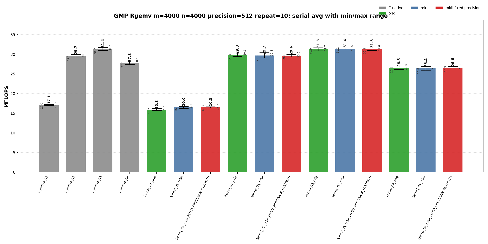
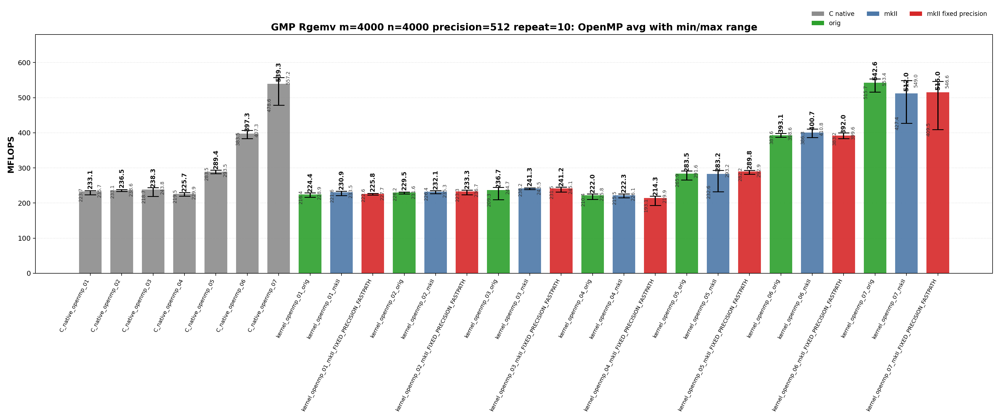

<!-- SPDX-License-Identifier: BSD-2-Clause -->

# 02_Rgemv

This directory benchmarks the GMP real dense matrix-vector product

```text
y <- alpha * A * x + beta * y
```

with fixed-precision `mpf_t`, upstream `gmpxx.h`, and `gmpxx_mkII` data. The
performance question is which source-level temporary policy and OpenMP work
partitioning shape determine the emitted GMP hot loop.

## Build

From the repository root:

```bash
cmake -S . -B build_bench_release -DCMAKE_BUILD_TYPE=Release
cmake --build build_bench_release -j
```

Executables are created under:

```text
build_bench_release/benchmarks/gmp/02_Rgemv/
```

Each executable takes `<rows m> <cols n> <precision>`. Example:

```bash
build_bench_release/benchmarks/gmp/02_Rgemv/Rgemv_gmp_kernel_03_mkII 4000 4000 512
```

The repeat-10 run used:

```bash
OMP_NUM_THREADS=32 OMP_PLACES=cores OMP_PROC_BIND=spread \
    benchmarks/gmp/02_Rgemv/run_repeat.sh build_bench_release 4000 4000 512 10
```

The mkII fixed-precision variants use `GMPFRXX_MKII_FAST_FIXED_PREC`;
executable suffixes keep the historical `FIXED_PRECISION_FASTPATH` label for
benchmark continuity.

The cross-benchmark runner can execute the GMP and MPFR `00_Rdot`, `01_Raxpy`, and `02_Rgemv` suites for both standard precisions with one command:

```bash
OMP_NUM_THREADS=32 OMP_PLACES=cores OMP_PROC_BIND=spread \
    benchmarks/run_all.sh build_bench_release 512,1024 10 10000000 10000000 4000 4000
```

The second argument is a precision list. `both` and `all` are aliases for `512,1024`; a single value such as `512` still runs only that precision. Per-benchmark results are written to `results_raw/run_all_p512_repeat10_<timestamp>/` and `results_raw/run_all_p1024_repeat10_<timestamp>/` under each benchmark directory.

## Benchmark Parameters

| Parameter | Meaning |
| --- | --- |
| `m` | Number of matrix rows and length of `y`. |
| `n` | Number of matrix columns and length of `x`. |
| `precision` | Requested GMP `mpf` precision in bits for matrix/vector/scalar inputs and temporaries. |
| `repeat` | Number of timed process executions per executable. |
| `OMP_NUM_THREADS` | OpenMP worker count for `openmp` executables. |
| `OMP_PLACES`, `OMP_PROC_BIND` | OpenMP affinity controls used by the runner. |

The committed runs use `m=4000`, `n=4000`, `repeat=10`, `precision=512` and `precision=1024`, with `OMP_NUM_THREADS=32`, `OMP_PLACES=cores`, and `OMP_PROC_BIND=spread`.

## Variant Shapes

The timed body is `_Rgemv()`. `A` is stored in column-major order. The same numeric suffix has the same source-level meaning for raw C, upstream C++, mkII, serial, and OpenMP targets when that execution mode implements it. Serial targets cover `01`-`04`; OpenMP targets cover `01`-`07`.

| Variant | Transition from previous variant | Timed source shape | Temporary/resource policy | Purpose |
| --- | --- | --- | --- | --- |
| `01` | Baseline nested-expression shape for serial and OpenMP. | `y[i] += (alpha * x[j]) * A[i + j*lda]` | Product materializes inside the inner loop. Raw C initializes and clears a product `mpf_t` per matrix element. | Direct nested-expression stress case. |
| `02` | `01 -> 02`: introduce reusable copy-then-multiply temporaries. | `temp = alpha; temp *= x[j]; templ = temp; templ *= A[i + j*lda]; y[i] += templ` | `temp` and `templ` are initialized before the loops and reused. | Copy-then-multiply reusable-temporary path. |
| `03` | `02 -> 03`: keep reusable storage but assign temporaries from product expressions. | `temp = alpha * x[j]; templ = temp * A[i + j*lda]; y[i] += templ` | `temp` and `templ` are initialized before the loops and assigned from product expressions. | Main optimized serial wrapper baseline. |
| `04` | `03 -> 04`: move product object lifetime into the loop nest. | Loop-local `temp = alpha * x[j]`; loop-local `templ = temp * A[i + j*lda]`; `y[i] += templ` | Product objects are constructed inside the loop nest. | Lifetime/allocation stress case. |
| `05` | OpenMP branch from row-partitioned `03`: precompute `alpha * x[j]`. | Precompute `scaled_x[j] = alpha * x[j]`, then row-partitioned update. | Shared read-only `scaled_x`, per-thread reusable product object. | Remove repeated `alpha * x[j]` from row-partitioned OpenMP. |
| `06` | `05 -> 06`: add fixed 256-row blocking. | 256-row blocks, then column loop and contiguous row loop inside each block. | Per-thread reusable `temp` and `prod`. | Restore contiguous `A` access inside each row block. |
| `07` | `06 -> 07`: switch ownership to column partitioning with final reduction. | Column partitioning with thread-local partial `y` vectors and final reduction. | `num_threads * m` partial accumulators plus final reduction. | Keep serial-like column-major `A` streaming without racing on `y`. |

## Source Transitions

`01 -> 02` replaces direct nested products with reusable copy-then-multiply temporaries while keeping the column-major update structure. `02 -> 03` keeps reusable storage but assigns temporaries from product expressions, which is the main serial optimized comparison point. `03 -> 04` moves product object lifetime into the loop nest as a construction stress case. OpenMP `05` branches from the row-partitioned reusable class by precomputing `alpha * x`; `05 -> 06` adds fixed 256-row blocking; `06 -> 07` changes ownership from rows to columns and uses thread-local partial `y` vectors plus final reduction.

## C Native Equivalent Kernels

The mapping is based on the timed `_Rgemv()` hot-loop source shape, not just on
matching numeric suffixes.

| C native kernel | Equivalent C++ wrapper kernel(s) | Equivalence notes |
|-----------------|----------------------------------|-------------------|
| `C_native_01` | Closest to `kernel_01_*` | Raw C performs direct nested multiplication with a product `mpf_t` initialized and cleared for every matrix element. |
| `C_native_02` | `kernel_02_*` | Reusable `temp` and `templ` with explicit copy-then-multiply operations. |
| `C_native_03` | `kernel_03_*` | Reusable `temp_b` and `prod` assigned directly from product operations. This is the primary optimized serial C equivalent. |
| `C_native_04` | `kernel_04_*` | Loop-local `temp` and `templ` objects inside the loop nest. |
| `C_native_openmp_01` | `kernel_openmp_01_*` | Row-partitioned direct-expression stress shape. |
| `C_native_openmp_02` | `kernel_openmp_02_*` | Row-partitioned copy-then-multiply with per-thread reusable temporaries. |
| `C_native_openmp_03` | `kernel_openmp_03_*` | Row-partitioned expression-assignment path with per-thread reusable temporaries. |
| `C_native_openmp_04` | `kernel_openmp_04_*` | Row-partitioned loop-local product-object stress case. |
| `C_native_openmp_05` | `kernel_openmp_05_*` | Precomputed `scaled_x` row-partitioned path. |
| `C_native_openmp_06` | `kernel_openmp_06_*` | 256-row blocked row-partitioned path. |
| `C_native_openmp_07` | `kernel_openmp_07_*` | Column-partitioned thread-local partial-vector reduction path. |

`kernel_01_*` is an expression-template spelling, so its exact C native class is
confirmed by disassembly rather than by the suffix alone.

## Recorded Run

### 512-bit run

| Field | Value |
|-------|-------|
| Run ID | `run_all_p512_repeat10_20260525_224339` |
| Date | 2026-05-25 |
| CPU | AMD Ryzen Threadripper 3970X 32-Core Processor |
| OS | Linux 6.8.0-94-generic x86_64 |
| Compiler | `c++ (Ubuntu 15.2.0-16ubuntu1) 15.2.0` |
| Build type | Release |
| Problem size | `m=4000`, `n=4000` |
| Precision | 512 bits |
| Repeat count | 10 |
| OpenMP | `OMP_NUM_THREADS=32`, `OMP_PLACES=cores`, `OMP_PROC_BIND=spread` |
| Benchmark command | `OMP_NUM_THREADS=32 OMP_PLACES=cores OMP_PROC_BIND=spread benchmarks/run_all.sh build_bench_release 512 10 10000000 10000000 4000 4000` |
| Raw result directory | `benchmarks/gmp/02_Rgemv/results_raw/run_all_p512_repeat10_20260525_224339/` |
| Raw log | `benchmarks/gmp/02_Rgemv/results_raw/run_all_p512_repeat10_20260525_224339/benchmark_rgemv_gmp_m4000_n4000_p512_repeat10.log` |
| Raw CSV | `benchmarks/gmp/02_Rgemv/results_raw/run_all_p512_repeat10_20260525_224339/raw_rgemv_gmp_m4000_n4000_p512_repeat10.csv` |
| Summary CSV | `benchmarks/gmp/02_Rgemv/results_raw/run_all_p512_repeat10_20260525_224339/summary_rgemv_gmp_m4000_n4000_p512_repeat10.csv` |
| Correctness | 440 / 440 runs reported OK. |





Plot regeneration command:

```bash
python3 benchmarks/gmp/02_Rgemv/plot_repeat_summary.py \
    benchmarks/gmp/02_Rgemv/results_raw/run_all_p512_repeat10_20260525_224339/benchmark_rgemv_gmp_m4000_n4000_p512_repeat10.log \
    --output-dir benchmarks/gmp/02_Rgemv/results_raw/run_all_p512_repeat10_20260525_224339 \
    --output-prefix rgemv_gmp_m4000_n4000_p512_repeat10 \
    --title-prefix "GMP Rgemv m=4000, n=4000, precision=512, repeat=10"
```

### 1024-bit run

No current 1024-bit `run_all` result directory is present under this benchmark's `results_raw/` tree. Run `benchmarks/run_all.sh build_bench_release 1024 10 10000000 10000000 4000 4000` or the default dual-precision command to regenerate this section.

## Resource or Bandwidth Estimates

The values below are model estimates derived from MFLOPS, not hardware-counter measurements. They use the current 512-bit `run_all` summary and count active limb bytes plus a header-inclusive model. They exclude allocator metadata, cache-line overfetch, instruction fetch, and final OpenMP reduction traffic.

| Case | Representative best-avg variant | Avg MFLOPS | Active bytes/iteration | Header-inclusive bytes/iteration | Active GB/s | Header-inclusive GB/s |
| --- | --- | --- | --- | --- | --- | --- |
| 512-bit serial | `C_native_03` | 31.366 | 192 | 264 | 3.011 | 4.140 |
| 512-bit OpenMP | `kernel_openmp_07_orig` | 542.565 | 192 | 264 | 52.086 | 71.619 |

For matrix-vector benchmarks, the per-iteration byte model is a compact active-data estimate for the arithmetic stream, not a full matrix-footprint or cache-reuse model.
## Headline Results

The 512-bit headline rows below are regenerated from `benchmarks/gmp/02_Rgemv/results_raw/run_all_p512_repeat10_20260525_224339/summary_rgemv_gmp_m4000_n4000_p512_repeat10.csv`. No 1024-bit raw data is present in the current `results_raw/` tree, so 1024-bit result sections are placeholders until a fresh 1024-bit `run_all` result is collected.

| Precision | Class | Variant | Max MFLOPS | Avg MFLOPS | Interpretation |
| --- | --- | --- | --- | --- | --- |
| 512 | Best serial max | `C_native_03` | 31.710 | 31.366 | Single fastest serial repeat; compare with Avg MFLOPS for stability. |
| 512 | Best serial average | `C_native_03` | 31.710 | 31.366 | Raw C reference for the numbered source shape. |
| 512 | Best OpenMP max | `C_native_openmp_07` | 557.161 | 539.340 | Single fastest OpenMP repeat; OpenMP rows should be interpreted by performance class. |
| 512 | Best OpenMP average | `kernel_openmp_07_orig` | 553.421 | 542.565 | Upstream gmpxx.h wrapper; useful as the C++ wrapper comparison point for the same numbered source shape. |
## Serial Results

### 512-bit serial interpretation

These rows are derived from `benchmarks/gmp/02_Rgemv/results_raw/run_all_p512_repeat10_20260525_224339/summary_rgemv_gmp_m4000_n4000_p512_repeat10.csv`.

| Observation | Variant | Max MFLOPS | Avg MFLOPS | Min MFLOPS | Interpretation |
| --- | --- | --- | --- | --- | --- |
| Best raw C serial avg | `C_native_03` | 31.710 | 31.366 | 30.963 | Raw C reference for the numbered source shape. |
| Best upstream serial avg | `kernel_03_orig` | 31.687 | 31.329 | 30.887 | Upstream gmpxx.h wrapper; useful as the C++ wrapper comparison point for the same numbered source shape. |
| Best mkII serial avg | `kernel_03_mkII` | 31.627 | 31.362 | 31.126 | Wrapper source for the numbered kernel shape; compare with raw C and disassembly for temporary lifetime. |
| Best serial max | `C_native_03` | 31.710 | 31.366 | 30.963 | Raw C reference for the numbered source shape. |

<details>
<summary>512-bit serial results sorted by Max MFLOPS</summary>

| Rank | Variant | Max MFLOPS | Avg MFLOPS | Min MFLOPS |
| --- | --- | --- | --- | --- |
| 1 | `C_native_03` | 31.710 | 31.366 | 30.963 |
| 2 | `kernel_03_orig` | 31.687 | 31.329 | 30.887 |
| 3 | `kernel_03_mkII_FIXED_PRECISION_FASTPATH` | 31.635 | 31.332 | 30.939 |
| 4 | `kernel_03_mkII` | 31.627 | 31.362 | 31.126 |
| 5 | `kernel_02_orig` | 30.561 | 29.837 | 29.442 |
| 6 | `kernel_02_mkII` | 30.415 | 29.669 | 29.122 |
| 7 | `kernel_02_mkII_FIXED_PRECISION_FASTPATH` | 29.970 | 29.624 | 29.294 |
| 8 | `C_native_02` | 29.967 | 29.651 | 29.115 |
| 9 | `C_native_04` | 28.540 | 27.760 | 27.452 |
| 10 | `kernel_04_mkII_FIXED_PRECISION_FASTPATH` | 26.912 | 26.594 | 26.335 |
| 11 | `kernel_04_mkII` | 26.907 | 26.444 | 25.831 |
| 12 | `kernel_04_orig` | 26.784 | 26.483 | 26.139 |
| 13 | `C_native_01` | 17.256 | 17.092 | 16.964 |
| 14 | `kernel_01_mkII` | 16.755 | 16.551 | 16.272 |
| 15 | `kernel_01_mkII_FIXED_PRECISION_FASTPATH` | 16.672 | 16.521 | 16.341 |
| 16 | `kernel_01_orig` | 16.195 | 15.828 | 15.683 |

</details>

<details>
<summary>512-bit serial results sorted by Avg MFLOPS</summary>

| Rank | Variant | Max MFLOPS | Avg MFLOPS | Min MFLOPS |
| --- | --- | --- | --- | --- |
| 1 | `C_native_03` | 31.710 | 31.366 | 30.963 |
| 2 | `kernel_03_mkII` | 31.627 | 31.362 | 31.126 |
| 3 | `kernel_03_mkII_FIXED_PRECISION_FASTPATH` | 31.635 | 31.332 | 30.939 |
| 4 | `kernel_03_orig` | 31.687 | 31.329 | 30.887 |
| 5 | `kernel_02_orig` | 30.561 | 29.837 | 29.442 |
| 6 | `kernel_02_mkII` | 30.415 | 29.669 | 29.122 |
| 7 | `C_native_02` | 29.967 | 29.651 | 29.115 |
| 8 | `kernel_02_mkII_FIXED_PRECISION_FASTPATH` | 29.970 | 29.624 | 29.294 |
| 9 | `C_native_04` | 28.540 | 27.760 | 27.452 |
| 10 | `kernel_04_mkII_FIXED_PRECISION_FASTPATH` | 26.912 | 26.594 | 26.335 |
| 11 | `kernel_04_orig` | 26.784 | 26.483 | 26.139 |
| 12 | `kernel_04_mkII` | 26.907 | 26.444 | 25.831 |
| 13 | `C_native_01` | 17.256 | 17.092 | 16.964 |
| 14 | `kernel_01_mkII` | 16.755 | 16.551 | 16.272 |
| 15 | `kernel_01_mkII_FIXED_PRECISION_FASTPATH` | 16.672 | 16.521 | 16.341 |
| 16 | `kernel_01_orig` | 16.195 | 15.828 | 15.683 |

</details>
### 1024-bit serial interpretation

No current 1024-bit `run_all` summary CSV is present under this benchmark's `results_raw/` tree. The serial table should be regenerated after a fresh 1024-bit run is collected.

## OpenMP Results

### 512-bit OpenMP interpretation

These rows are derived from `benchmarks/gmp/02_Rgemv/results_raw/run_all_p512_repeat10_20260525_224339/summary_rgemv_gmp_m4000_n4000_p512_repeat10.csv`.

| Observation | Variant | Max MFLOPS | Avg MFLOPS | Min MFLOPS | Interpretation |
| --- | --- | --- | --- | --- | --- |
| Best raw C OpenMP avg | `C_native_openmp_07` | 557.161 | 539.340 | 478.614 | Raw C OpenMP column-partitioned class with per-thread partial y vectors and final reduction outside the hot loop. |
| Best upstream OpenMP avg | `kernel_openmp_07_orig` | 553.421 | 542.565 | 515.745 | Upstream gmpxx.h wrapper; useful as the C++ wrapper comparison point for the same numbered source shape. |
| Best mkII OpenMP avg | `kernel_openmp_07_mkII_FIXED_PRECISION_FASTPATH` | 546.588 | 515.024 | 409.510 | Wrapper fixed-precision build; intended to remove repeated precision checks or scratch setup when the source shape allows it. |
| Best OpenMP max | `C_native_openmp_07` | 557.161 | 539.340 | 478.614 | Raw C OpenMP column-partitioned class with per-thread partial y vectors and final reduction outside the hot loop. |

<details>
<summary>512-bit OpenMP results sorted by Max MFLOPS</summary>

| Rank | Variant | Max MFLOPS | Avg MFLOPS | Min MFLOPS |
| --- | --- | --- | --- | --- |
| 1 | `C_native_openmp_07` | 557.161 | 539.340 | 478.614 |
| 2 | `kernel_openmp_07_orig` | 553.421 | 542.565 | 515.745 |
| 3 | `kernel_openmp_07_mkII` | 548.972 | 511.972 | 427.448 |
| 4 | `kernel_openmp_07_mkII_FIXED_PRECISION_FASTPATH` | 546.588 | 515.024 | 409.510 |
| 5 | `kernel_openmp_06_mkII` | 410.821 | 400.677 | 386.285 |
| 6 | `C_native_openmp_06` | 407.261 | 397.268 | 383.491 |
| 7 | `kernel_openmp_06_mkII_FIXED_PRECISION_FASTPATH` | 399.637 | 391.993 | 383.248 |
| 8 | `kernel_openmp_06_orig` | 398.615 | 393.140 | 387.591 |
| 9 | `C_native_openmp_05` | 293.460 | 289.427 | 283.491 |
| 10 | `kernel_openmp_05_mkII` | 293.239 | 283.224 | 232.562 |
| 11 | `kernel_openmp_05_mkII_FIXED_PRECISION_FASTPATH` | 292.942 | 289.789 | 282.250 |
| 12 | `kernel_openmp_05_orig` | 291.583 | 283.490 | 265.924 |
| 13 | `kernel_openmp_03_mkII_FIXED_PRECISION_FASTPATH` | 245.136 | 241.208 | 231.531 |
| 14 | `kernel_openmp_03_orig` | 244.653 | 236.656 | 209.305 |
| 15 | `C_native_openmp_03` | 243.776 | 238.346 | 218.681 |
| 16 | `kernel_openmp_03_mkII` | 243.492 | 241.263 | 238.174 |
| 17 | `C_native_openmp_02` | 238.553 | 236.498 | 233.050 |
| 18 | `kernel_openmp_02_mkII_FIXED_PRECISION_FASTPATH` | 236.736 | 233.270 | 223.304 |
| 19 | `C_native_openmp_01` | 235.674 | 233.121 | 223.737 |
| 20 | `kernel_openmp_02_mkII` | 235.263 | 232.124 | 226.426 |
| 21 | `kernel_openmp_01_mkII` | 233.451 | 230.891 | 221.616 |
| 22 | `kernel_openmp_02_orig` | 231.594 | 229.512 | 226.169 |
| 23 | `C_native_openmp_04` | 229.904 | 225.717 | 219.526 |
| 24 | `kernel_openmp_01_orig` | 228.860 | 224.380 | 216.375 |
| 25 | `kernel_openmp_01_mkII_FIXED_PRECISION_FASTPATH` | 227.704 | 225.797 | 222.648 |
| 26 | `kernel_openmp_04_mkII` | 226.145 | 222.326 | 215.465 |
| 27 | `kernel_openmp_04_orig` | 225.782 | 221.975 | 210.437 |
| 28 | `kernel_openmp_04_mkII_FIXED_PRECISION_FASTPATH` | 219.919 | 214.320 | 193.053 |

</details>

<details>
<summary>512-bit OpenMP results sorted by Avg MFLOPS</summary>

| Rank | Variant | Max MFLOPS | Avg MFLOPS | Min MFLOPS |
| --- | --- | --- | --- | --- |
| 1 | `kernel_openmp_07_orig` | 553.421 | 542.565 | 515.745 |
| 2 | `C_native_openmp_07` | 557.161 | 539.340 | 478.614 |
| 3 | `kernel_openmp_07_mkII_FIXED_PRECISION_FASTPATH` | 546.588 | 515.024 | 409.510 |
| 4 | `kernel_openmp_07_mkII` | 548.972 | 511.972 | 427.448 |
| 5 | `kernel_openmp_06_mkII` | 410.821 | 400.677 | 386.285 |
| 6 | `C_native_openmp_06` | 407.261 | 397.268 | 383.491 |
| 7 | `kernel_openmp_06_orig` | 398.615 | 393.140 | 387.591 |
| 8 | `kernel_openmp_06_mkII_FIXED_PRECISION_FASTPATH` | 399.637 | 391.993 | 383.248 |
| 9 | `kernel_openmp_05_mkII_FIXED_PRECISION_FASTPATH` | 292.942 | 289.789 | 282.250 |
| 10 | `C_native_openmp_05` | 293.460 | 289.427 | 283.491 |
| 11 | `kernel_openmp_05_orig` | 291.583 | 283.490 | 265.924 |
| 12 | `kernel_openmp_05_mkII` | 293.239 | 283.224 | 232.562 |
| 13 | `kernel_openmp_03_mkII` | 243.492 | 241.263 | 238.174 |
| 14 | `kernel_openmp_03_mkII_FIXED_PRECISION_FASTPATH` | 245.136 | 241.208 | 231.531 |
| 15 | `C_native_openmp_03` | 243.776 | 238.346 | 218.681 |
| 16 | `kernel_openmp_03_orig` | 244.653 | 236.656 | 209.305 |
| 17 | `C_native_openmp_02` | 238.553 | 236.498 | 233.050 |
| 18 | `kernel_openmp_02_mkII_FIXED_PRECISION_FASTPATH` | 236.736 | 233.270 | 223.304 |
| 19 | `C_native_openmp_01` | 235.674 | 233.121 | 223.737 |
| 20 | `kernel_openmp_02_mkII` | 235.263 | 232.124 | 226.426 |
| 21 | `kernel_openmp_01_mkII` | 233.451 | 230.891 | 221.616 |
| 22 | `kernel_openmp_02_orig` | 231.594 | 229.512 | 226.169 |
| 23 | `kernel_openmp_01_mkII_FIXED_PRECISION_FASTPATH` | 227.704 | 225.797 | 222.648 |
| 24 | `C_native_openmp_04` | 229.904 | 225.717 | 219.526 |
| 25 | `kernel_openmp_01_orig` | 228.860 | 224.380 | 216.375 |
| 26 | `kernel_openmp_04_mkII` | 226.145 | 222.326 | 215.465 |
| 27 | `kernel_openmp_04_orig` | 225.782 | 221.975 | 210.437 |
| 28 | `kernel_openmp_04_mkII_FIXED_PRECISION_FASTPATH` | 219.919 | 214.320 | 193.053 |

</details>
### 1024-bit OpenMP interpretation

No current 1024-bit `run_all` summary CSV is present under this benchmark's `results_raw/` tree. The OpenMP table should be regenerated after a fresh 1024-bit run is collected.

## Hotpath Disassembly

Representative snippets were collected with:

```bash
objdump -Cd --no-show-raw-insn build_bench_release/benchmarks/gmp/02_Rgemv/<binary>
```

The snippets are representative, not exhaustive. They were selected to cover
the reusable serial raw C baseline, the upstream `orig` wrapper counterpart,
the mkII wrapper counterpart, and the dominant OpenMP 07 worker class. Because
this is a GMP report, each mkII snippet used for the performance-class argument
is paired with the corresponding upstream `gmpxx.h` `orig` hot loop.

### `C_native_03`

Source: `benchmarks/gmp/02_Rgemv/Rgemv_gmp_C_native_03.cpp`.
The serial optimized C baseline initializes the product temporaries before the
loop. The inner matrix loop has one `__gmpf_mul` and one `__gmpf_add` per
matrix element; `__gmpf_clear` is after the loop.

```asm
55a0: mov    %r14,%rdx        # A[i + j*lda]
55a3: lea    0x40(%rsp),%rsi  # temp_b = alpha * x[j]
55a8: mov    %rbp,%rdi        # prod
55af: call   __gmpf_mul@plt
55b4: mov    %rbx,%rsi        # y[i]
55b7: mov    %rbx,%rdi        # y[i]
55ba: mov    %rbp,%rdx        # prod
55bd: call   __gmpf_add@plt
55c2: add    $0x18,%r14       # A++
55c6: add    $0x18,%rbx       # y++
55cd: jne    55a0
55f8: call   __gmpf_clear@plt
```

### `kernel_03_orig`

Source: `benchmarks/gmp/02_Rgemv/Rgemv_gmp_kernel_03.cpp` built against
upstream `gmpxx.h`. The upstream wrapper emits the same reusable-product inner
loop class as raw C: one `__gmpf_mul` and one `__gmpf_add` per matrix element,
with product objects outside the hot loop.

```asm
3dc0: mov    0x8(%rsp),%rdx
3dc5: mov    0x20(%rsp),%rsi
3dca: lea    0x40(%rsp),%rdi
3dcf: call   __gmpf_mul@plt   # temp_b = alpha * x[j]
...
3e00: mov    %r12,%rdx        # A[i + j*lda]
3e03: lea    0x40(%rsp),%rsi  # temp_b
3e08: mov    %r13,%rdi        # prod
3e0b: call   __gmpf_mul@plt
3e10: mov    %r13,%rdx        # prod
3e13: mov    %rbx,%rsi        # y[i]
3e16: mov    %rbx,%rdi        # y[i]
3e19: call   __gmpf_add@plt
3e1e: add    $0x1,%rbp
3e22: add    $0x18,%r12       # A++
3e26: add    $0x18,%rbx       # y++
3e2d: jne    3e00
```

### `kernel_03_mkII`

Source: `benchmarks/gmp/02_Rgemv/Rgemv_gmp_kernel_03.cpp`.
The mkII reusable-product spelling emits the same arithmetic class as the raw C
baseline and the upstream `kernel_03_orig` path: one `__gmpf_mul` and one
`__gmpf_add` per matrix element, with clears outside the hot loop.

```asm
5600: mov    %r12,%rdx        # A[i + j*lda]
5603: lea    0x40(%rsp),%rsi  # temp_b
5608: mov    %r13,%rdi        # prod
560b: call   __gmpf_mul@plt
5610: mov    %r13,%rdx        # prod
5613: mov    %rbx,%rsi        # y[i]
5616: mov    %rbx,%rdi        # y[i]
5619: call   __gmpf_add@plt
561e: add    $0x1,%rbp
5622: add    $0x18,%r12       # A++
5626: add    $0x18,%rbx       # y++
562d: jne    5600
5656: call   __gmpf_clear@plt
```

### `kernel_openmp_07_mkII`

Source: `benchmarks/gmp/02_Rgemv/Rgemv_gmp_kernel_openmp_07.cpp`.
OpenMP 07 computes column partitions into per-thread partial `y` vectors. The
worker hot loop still has one `__gmpf_mul` and one `__gmpf_add` per matrix
element, but the matrix traversal preserves the column-major stream and avoids
racing on shared `y`.

```asm
40e0: mov    0x30(%rsp),%rax
40ed: mov    0x10(%rax),%rsi  # x[j]
40f1: call   __gmpf_mul@plt   # temp = alpha * x[j]
4120: mov    %r13,%rdx        # A[i + j*lda]
4123: mov    %r12,%rsi        # temp
4126: mov    %rbp,%rdi        # prod
412d: call   __gmpf_mul@plt
4132: mov    %rbx,%rsi        # partial_y[i]
4135: mov    %rbx,%rdi        # partial_y[i]
4138: mov    %rbp,%rdx        # prod
413b: call   __gmpf_add@plt
4140: add    $0x18,%r13       # A++
4144: add    $0x18,%rbx       # partial_y++
414b: jne    4120
4173: call   GOMP_barrier@plt
```

### `kernel_openmp_07_orig`

Source: `benchmarks/gmp/02_Rgemv/Rgemv_gmp_kernel_openmp_07.cpp` built against
upstream `gmpxx.h`. It has the same worker-loop arithmetic class as the mkII
OpenMP 07 path: one product multiply and one partial-vector add per matrix
element, with the final reduction outside this hot loop.

```asm
3520: mov    %r14,%rdx        # A[i + j*lda]
3523: mov    %r13,%rsi        # temp
3526: mov    %rbp,%rdi        # prod
3529: add    $0x1,%r15
352d: call   __gmpf_mul@plt
3532: mov    %rbx,%rsi        # partial_y[i]
3535: mov    %rbx,%rdi        # partial_y[i]
3538: mov    %rbp,%rdx        # prod
353b: call   __gmpf_add@plt
3540: add    $0x18,%r14       # A++
3544: add    $0x18,%rbx       # partial_y++
354b: jne    3520
3573: call   GOMP_barrier@plt
```

The hotpath explains the results: the serial 03 kernels differ mostly in C++
setup outside the timed inner loop, while OpenMP 07 changes the data traversal
and reduction structure.

## Lessons Learned

- The main serial boundary is temporary lifetime. `kernel_03_mkII`,
  `kernel_03_orig`, and `C_native_03` are the same reusable-product performance
  class.
- The fixed-precision fastpath does not create a new class for already reusable
  product objects. It matters more for expression forms that would otherwise
  materialize temporaries repeatedly.
- For OpenMP Rgemv, work partitioning dominates wrapper syntax. Row-partitioned
  03 stays near 240 MFLOPS, row-blocked 06 reaches about 398 MFLOPS, and
  column-partitioned 07 reaches the 520-540 MFLOPS class.
- `kernel_openmp_07_orig` has the highest single max but a much lower average;
  the 07 class should be judged by repeat averages, not one fastest run.
- The generated hot loop, not the source expression alone, is the useful
  comparison unit. Reusable temporaries and final reductions must be checked in
  disassembly.
