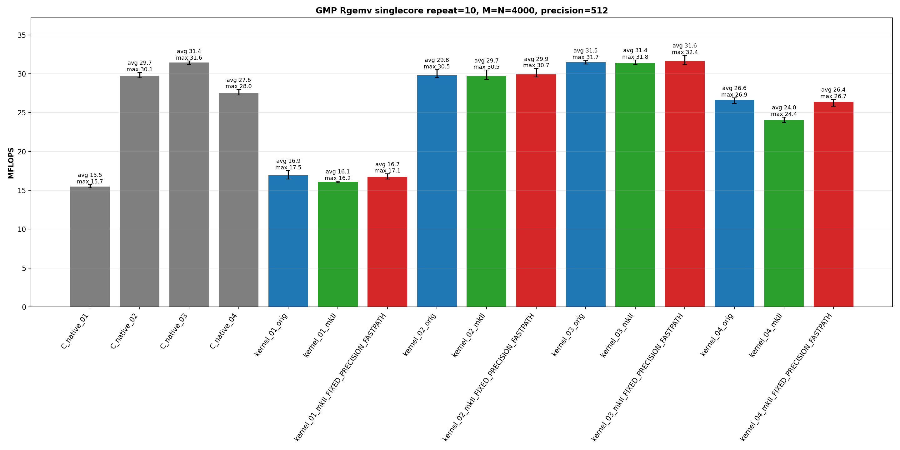
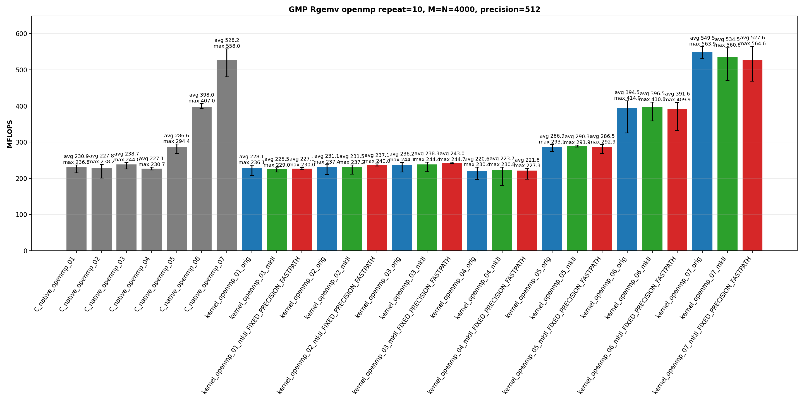

<!-- SPDX-License-Identifier: BSD-2-Clause -->

# 02_Rgemv

This directory benchmarks the GMP real dense matrix-vector product

```text
y = alpha * A * x + beta * y
```

with fixed-precision `mpf_t`, upstream `gmpxx.h`, and `gmpxx_mkII` data.  The
benchmark compares source-level kernel shapes, temporary lifetime, raw C
equivalent kernels, OpenMP partitioning strategies, and the
`GMPFRXX_MKII_ASSUME_FIXED_PRECISION_FASTPATH` build option.

## Build

From the repository root:

```bash
cmake -S . -B build_bench_release -DCMAKE_BUILD_TYPE=Release
cmake --build build_bench_release -j
```

Executables are created under:

```text
build_bench_release/benchmarks/gmp/02_Rgemv/
```

Each executable takes:

```text
<rows m> <cols n> <precision>
```

Example:

```bash
build_bench_release/benchmarks/gmp/02_Rgemv/Rgemv_gmp_kernel_03_mkII 4000 4000 512
```

For OpenMP runs, keep affinity explicit:

```bash
OMP_NUM_THREADS=32 OMP_PLACES=cores OMP_PROC_BIND=spread \
build_bench_release/benchmarks/gmp/02_Rgemv/Rgemv_gmp_kernel_openmp_06_mkII \
    4000 4000 512
```

The full committed matrix is driven by `benchmarks/gmp/02_Rgemv/go.sh` from
the executable directory.  The top-level `benchmarks/common/run_benchmarks.sh`
currently runs only a smaller Rgemv subset, so use `go.sh` when regenerating
the full 44-variant report.

## Benchmark Parameters

The benchmark command-line parameters are:

| Parameter | Meaning |
|-----------|---------|
| `m` | Number of rows in `A` and length of `y`. |
| `n` | Number of columns in `A` and length of `x`. |
| `precision` | GMP `mpf` precision in bits. |

The committed repeat run uses random inputs generated from a fixed seed.  Each
executable reports `Elapsed time`, `MFLOPS`, `L1 Norm of difference`, and
`Result OK` / `Result NG`.  MFLOPS is computed as:

```text
2 * m * n / elapsed_seconds / 1e6
```

The correctness reference is `Rgemv()` in `Rgemv.hpp`; the timed hot loop is
`_Rgemv()` in each executable.

Wrapper suffixes:

| Suffix | Meaning |
|--------|---------|
| `orig` | Upstream `gmpxx.h`. |
| `mkII` | This header with the default precision policy. |
| `mkII_FIXED_PRECISION_FASTPATH` | Build with `GMPFRXX_MKII_ASSUME_FIXED_PRECISION_FASTPATH`. |

## Variant Shapes

The serial kernels use the column-major AXPY order of the BLAS-style reference:
scale `y`, then sweep columns of `A`.  The row-partitioned OpenMP kernels use a
different traversal to avoid concurrent writes to the same `y[i]`; kernel `07`
uses column partitioning with thread-local partial `y` vectors and a final
reduction.

| Variant | Timed source shape | Temporary/resource policy | Purpose |
|---------|--------------------|---------------------------|---------|
| `01` | `y[i] += (alpha * x[j]) * A[i + j*lda]` | Product materializes inside the inner loop.  Raw C uses per-element `mpf_init2` / `mpf_clear`. | Direct nested-expression stress case. |
| `02` | `temp = alpha; temp *= x[j]; templ = temp; templ *= A[i + j*lda]; y[i] += templ` | `temp` and `templ` are initialized before the loops and reused; each multiply path begins with an explicit copy. | Reusable temporary path with copy-then-multiply source spelling. |
| `03` | `temp = alpha * x[j]; templ = temp * A[i + j*lda]; y[i] += templ` | `temp` and `templ` are initialized before the loops and assigned from product expressions. | Main optimized serial wrapper baseline. |
| `04` | Loop-local `temp = alpha * x[j]`; loop-local `templ = temp * A[i + j*lda]`; `y[i] += templ` | Product objects are constructed inside the loop nest. | Lifetime/allocation stress case. |
| `openmp_01` | Row-partitioned direct expression. | Per-thread inner-loop product materialization. | Race-free OpenMP version of `01`. |
| `openmp_02` | Row-partitioned copy-then-multiply. | Per-thread reusable `temp` and `templ`. | Race-free OpenMP version of `02`. |
| `openmp_03` | Row-partitioned expression assignment. | Per-thread reusable `temp` and `templ`. | Main row-partitioned OpenMP baseline. |
| `openmp_04` | Row-partitioned loop-local product objects. | Product objects are constructed in the row/column loop. | OpenMP lifetime/allocation stress case. |
| `openmp_05` | Precompute `scaled_x[j] = alpha * x[j]`, then row-partitioned update. | Shared read-only `scaled_x`, per-thread reusable product object. | Removes repeated `alpha * x[j]` from row-partitioned OpenMP. |
| `openmp_06` | 256-row blocks, then column loop and contiguous row loop inside the block. | Per-thread reusable `temp` and `prod`. | Restores contiguous `A` access inside each row block. |
| `openmp_07` | Column partitioning with thread-local partial `y` vectors and final reduction. | `num_threads * m` partial accumulators plus reduction. | Keeps the serial-like column-major `A` stream without racing on `y`. |

## C Native Equivalent Kernels

The mapping below is based on the timed `_Rgemv()` hot-loop source shape, not
just on matching numeric suffixes.

| C native kernel | Equivalent C++ wrapper kernel(s) | Equivalence notes |
|-----------------|----------------------------------|-------------------|
| `C_native_01` | Closest to `kernel_01_*` | Raw C performs direct nested multiplication with a product `mpf_t` initialized and cleared for every matrix element.  This is the C-level stress-case counterpart of the expression spelling. |
| `C_native_02` | `kernel_02_*` | Reusable `temp` and `templ` with explicit copy-then-multiply operations. |
| `C_native_03` | `kernel_03_*` | Reusable `temp_b` and `prod` assigned directly from product operations.  This is the primary C native equivalent for the optimized serial C++ path. |
| `C_native_04` | `kernel_04_*` | Loop-local `temp` and `templ` objects inside the loop nest. |
| `C_native_openmp_01` | `kernel_openmp_01_*` | Row-partitioned direct-expression stress shape. |
| `C_native_openmp_02` | `kernel_openmp_02_*` | Row-partitioned copy-then-multiply with per-thread reusable temporaries. |
| `C_native_openmp_03` | `kernel_openmp_03_*` | Row-partitioned expression-assignment path with per-thread reusable temporaries. |
| `C_native_openmp_04` | `kernel_openmp_04_*` | Row-partitioned loop-local product-object stress case. |
| `C_native_openmp_05` | `kernel_openmp_05_*` | Precomputed `scaled_x` row-partitioned path. |
| `C_native_openmp_06` | `kernel_openmp_06_*` | 256-row blocked row-partitioned path. |
| `C_native_openmp_07` | `kernel_openmp_07_*` | Column-partitioned thread-local partial-vector reduction path. |

`kernel_01_*` is an expression-template spelling, so the exact C native
equivalent depends on generated code.  In this benchmark it behaves like the
per-element materialization class; the fixed-precision fastpath can change the
cost of that class, so use hotpath disassembly before treating it as identical
to `C_native_01`.

## Recorded Run

The current checked-in GMP Rgemv data uses:

```text
M = 4000
N = 4000
precision = 512
repeat = 10
OMP_NUM_THREADS = 32
OMP_PLACES = cores
OMP_PROC_BIND = spread
CPU = AMD Ryzen Threadripper 3970X 32-Core Processor
```

Results are stored in:

```text
results_raw/rgemv_gmp_m4000_n4000_p512_repeat10_20260516_184101/
```

Files:

- [Raw log](results_raw/rgemv_gmp_m4000_n4000_p512_repeat10_20260516_184101/benchmark_rgemv_gmp_m4000_n4000_p512_repeat10.log)
- [Raw CSV](results_raw/rgemv_gmp_m4000_n4000_p512_repeat10_20260516_184101/raw_rgemv_gmp_m4000_n4000_p512_repeat10.csv)
- [Summary CSV](results_raw/rgemv_gmp_m4000_n4000_p512_repeat10_20260516_184101/summary_rgemv_gmp_m4000_n4000_p512_repeat10.csv)

All 44 variants reported `Result OK` in all 10 runs, for 440 successful timed
runs.





The committed plots were generated from the committed repeat-10 summary CSV
during the recorded benchmark workflow.  A standalone repeat-summary plotting
script for Rgemv is not currently checked in; regenerate the full report with
`go.sh` and the CSV summarizer used for the recorded run.

## Resource or Bandwidth Estimates

These are model estimates derived from MFLOPS, not hardware-counter
measurements.  On this LP64 machine:

```text
sizeof(__mpf_struct) = 24 bytes
sizeof(mp_limb_t)    = 8 bytes
mpf_get_prec(x)      = 512 bits
used limbs           = 8
allocated limbs      = 9
```

For one matrix element at 512-bit precision:

```text
active mpf value bytes    = 24-byte header + 8 active limbs * 8 = 88 bytes
allocated mpf footprint   = 24-byte header + 9 allocated limbs * 8 = 96 bytes
A-only active stream GB/s = MFLOPS * 0.044
A+y active logical GB/s   = MFLOPS * 0.132
A+x+y active logical GB/s = MFLOPS * 0.176
```

`A-only` is the minimum matrix stream implied by the reported MFLOPS.  `A+y`
also counts one read and one write of `y` per matrix element.  `A+x+y`
additionally counts `x` for each matrix element; this is an upper logical
model for row-partitioned loops because `x` is small enough to be reused from
cache.  These are active-limb estimates; using allocated footprint scales the
numbers by `96 / 88 = 1.091`.

| Variant | Avg MFLOPS | Max MFLOPS | A-only avg GB/s | A+y avg GB/s | A+x+y avg GB/s |
|---------|-----------:|-----------:|----------------:|-------------:|---------------:|
| `kernel_openmp_07_orig` | 549.526 | 563.892 | 24.18 | 72.54 | 96.72 |
| `kernel_openmp_07_mkII` | 534.525 | 560.611 | 23.52 | 70.56 | 94.08 |
| `C_native_openmp_07` | 528.177 | 558.040 | 23.24 | 69.72 | 92.96 |
| `kernel_openmp_06_mkII` | 396.516 | 410.777 | 17.45 | 52.34 | 69.79 |
| `C_native_openmp_06` | 397.996 | 406.983 | 17.51 | 52.54 | 70.05 |
| `kernel_openmp_05_mkII` | 290.307 | 291.918 | 12.77 | 38.32 | 51.09 |
| `kernel_openmp_03_mkII_FIXED_PRECISION_FASTPATH` | 242.990 | 244.656 | 10.69 | 32.07 | 42.77 |
| `kernel_03_mkII_FIXED_PRECISION_FASTPATH` | 31.621 | 32.362 | 1.39 | 4.17 | 5.57 |
| `C_native_03` | 31.449 | 31.650 | 1.38 | 4.15 | 5.54 |

The progression is consistent with the source shapes: `openmp_05` removes
repeated `alpha * x[j]`, `openmp_06` improves matrix locality with row blocks,
and `openmp_07` streams columns with thread-local partial results.

## Serial Results

Main interpretation table:

| Variant | Max MFLOPS | Avg MFLOPS | Min MFLOPS | Interpretation |
|---------|-----------:|-----------:|-----------:|----------------|
| `kernel_03_mkII_FIXED_PRECISION_FASTPATH` | 32.362 | 31.621 | 31.160 | Best serial average and maximum; reusable product temporaries with fixed-precision specialization. |
| `kernel_03_orig` | 31.735 | 31.487 | 31.243 | Upstream reusable-product wrapper path; same class as C native 03. |
| `C_native_03` | 31.650 | 31.449 | 31.193 | Raw reusable-product baseline. |
| `kernel_03_mkII` | 31.767 | 31.403 | 31.197 | mkII reusable-product path; same class as raw C and upstream. |
| `kernel_02_mkII_FIXED_PRECISION_FASTPATH` | 30.665 | 29.921 | 29.595 | Copy-then-multiply path; faster than direct expression but still below expression assignment. |
| `kernel_04_mkII` | 24.418 | 24.044 | 23.709 | Loop-local product objects remain expensive. |
| `kernel_01_mkII` | 16.169 | 16.084 | 15.941 | Direct nested expression materializes product work in the inner loop. |

<details>
<summary>Serial results sorted by Max MFLOPS</summary>

| Rank | Variant | Max MFLOPS | Avg MFLOPS | Min MFLOPS | Stdev |
|------|---------|-----------:|-----------:|-----------:|------:|
| 1 | `kernel_03_mkII_FIXED_PRECISION_FASTPATH` | 32.362 | 31.621 | 31.160 | 0.345 |
| 2 | `kernel_03_mkII` | 31.767 | 31.403 | 31.197 | 0.169 |
| 3 | `kernel_03_orig` | 31.735 | 31.487 | 31.243 | 0.197 |
| 4 | `C_native_03` | 31.650 | 31.449 | 31.193 | 0.163 |
| 5 | `kernel_02_mkII_FIXED_PRECISION_FASTPATH` | 30.665 | 29.921 | 29.595 | 0.308 |
| 6 | `kernel_02_orig` | 30.535 | 29.814 | 29.507 | 0.314 |
| 7 | `kernel_02_mkII` | 30.462 | 29.709 | 29.279 | 0.346 |
| 8 | `C_native_02` | 30.150 | 29.726 | 29.476 | 0.206 |
| 9 | `C_native_04` | 27.972 | 27.551 | 27.278 | 0.221 |
| 10 | `kernel_04_orig` | 26.889 | 26.610 | 26.195 | 0.202 |
| 11 | `kernel_04_mkII_FIXED_PRECISION_FASTPATH` | 26.695 | 26.361 | 25.827 | 0.290 |
| 12 | `kernel_04_mkII` | 24.418 | 24.044 | 23.709 | 0.196 |
| 13 | `kernel_01_orig` | 17.536 | 16.938 | 16.438 | 0.307 |
| 14 | `kernel_01_mkII_FIXED_PRECISION_FASTPATH` | 17.111 | 16.724 | 16.452 | 0.187 |
| 15 | `kernel_01_mkII` | 16.169 | 16.084 | 15.941 | 0.081 |
| 16 | `C_native_01` | 15.730 | 15.491 | 15.311 | 0.129 |

</details>

<details>
<summary>Serial results sorted by Avg MFLOPS</summary>

| Rank | Variant | Max MFLOPS | Avg MFLOPS | Min MFLOPS | Stdev |
|------|---------|-----------:|-----------:|-----------:|------:|
| 1 | `kernel_03_mkII_FIXED_PRECISION_FASTPATH` | 32.362 | 31.621 | 31.160 | 0.345 |
| 2 | `kernel_03_orig` | 31.735 | 31.487 | 31.243 | 0.197 |
| 3 | `C_native_03` | 31.650 | 31.449 | 31.193 | 0.163 |
| 4 | `kernel_03_mkII` | 31.767 | 31.403 | 31.197 | 0.169 |
| 5 | `kernel_02_mkII_FIXED_PRECISION_FASTPATH` | 30.665 | 29.921 | 29.595 | 0.308 |
| 6 | `kernel_02_orig` | 30.535 | 29.814 | 29.507 | 0.314 |
| 7 | `C_native_02` | 30.150 | 29.726 | 29.476 | 0.206 |
| 8 | `kernel_02_mkII` | 30.462 | 29.709 | 29.279 | 0.346 |
| 9 | `C_native_04` | 27.972 | 27.551 | 27.278 | 0.221 |
| 10 | `kernel_04_orig` | 26.889 | 26.610 | 26.195 | 0.202 |
| 11 | `kernel_04_mkII_FIXED_PRECISION_FASTPATH` | 26.695 | 26.361 | 25.827 | 0.290 |
| 12 | `kernel_04_mkII` | 24.418 | 24.044 | 23.709 | 0.196 |
| 13 | `kernel_01_orig` | 17.536 | 16.938 | 16.438 | 0.307 |
| 14 | `kernel_01_mkII_FIXED_PRECISION_FASTPATH` | 17.111 | 16.724 | 16.452 | 0.187 |
| 15 | `kernel_01_mkII` | 16.169 | 16.084 | 15.941 | 0.081 |
| 16 | `C_native_01` | 15.730 | 15.491 | 15.311 | 0.129 |

</details>

## Parallel Results

Main interpretation table:

| Variant | Max MFLOPS | Avg MFLOPS | Min MFLOPS | Interpretation |
|---------|-----------:|-----------:|-----------:|----------------|
| `kernel_openmp_07_orig` | 563.892 | 549.526 | 531.830 | Best OpenMP average; column partitioning keeps serial-like matrix streaming and uses thread-local partial vectors. |
| `kernel_openmp_07_mkII` | 560.611 | 534.525 | 470.334 | Same column-partitioned shape as raw C/openmp 07; larger run-to-run spread. |
| `C_native_openmp_07` | 558.040 | 528.177 | 480.708 | Raw column-partitioned partial-vector baseline. |
| `kernel_openmp_06_mkII` | 410.777 | 396.516 | 358.458 | 256-row blocking restores contiguous matrix access inside each row block. |
| `C_native_openmp_06` | 406.983 | 397.996 | 392.646 | Raw blocked row-partitioned baseline with the most stable top blocked runs. |
| `kernel_openmp_05_mkII` | 291.918 | 290.307 | 286.253 | Precomputed `alpha * x[j]` removes repeated scalar-vector work. |
| `kernel_openmp_03_mkII_FIXED_PRECISION_FASTPATH` | 244.656 | 242.990 | 241.108 | Best row-partitioned 01-04 wrapper class; still recomputes `alpha * x[j]` per row. |

<details>
<summary>OpenMP results sorted by Max MFLOPS</summary>

| Rank | Variant | Max MFLOPS | Avg MFLOPS | Min MFLOPS | Stdev |
|------|---------|-----------:|-----------:|-----------:|------:|
| 1 | `kernel_openmp_07_mkII_FIXED_PRECISION_FASTPATH` | 564.629 | 527.554 | 468.309 | 31.552 |
| 2 | `kernel_openmp_07_orig` | 563.892 | 549.526 | 531.830 | 10.159 |
| 3 | `kernel_openmp_07_mkII` | 560.611 | 534.525 | 470.334 | 29.042 |
| 4 | `C_native_openmp_07` | 558.040 | 528.177 | 480.708 | 27.133 |
| 5 | `kernel_openmp_06_orig` | 414.035 | 394.507 | 325.856 | 30.822 |
| 6 | `kernel_openmp_06_mkII` | 410.777 | 396.516 | 358.458 | 15.468 |
| 7 | `kernel_openmp_06_mkII_FIXED_PRECISION_FASTPATH` | 409.950 | 391.578 | 331.717 | 22.973 |
| 8 | `C_native_openmp_06` | 406.983 | 397.996 | 392.646 | 4.388 |
| 9 | `C_native_openmp_05` | 294.372 | 286.554 | 268.506 | 8.551 |
| 10 | `kernel_openmp_05_orig` | 293.125 | 286.904 | 274.131 | 5.783 |
| 11 | `kernel_openmp_05_mkII_FIXED_PRECISION_FASTPATH` | 292.881 | 286.489 | 268.560 | 8.873 |
| 12 | `kernel_openmp_05_mkII` | 291.918 | 290.307 | 286.253 | 1.900 |
| 13 | `kernel_openmp_03_mkII_FIXED_PRECISION_FASTPATH` | 244.656 | 242.990 | 241.108 | 1.267 |
| 14 | `kernel_openmp_03_mkII` | 244.387 | 238.327 | 218.131 | 9.571 |
| 15 | `kernel_openmp_03_orig` | 244.082 | 236.242 | 217.413 | 9.987 |
| 16 | `C_native_openmp_03` | 243.992 | 238.688 | 226.096 | 5.824 |
| 17 | `kernel_openmp_02_mkII_FIXED_PRECISION_FASTPATH` | 240.015 | 237.055 | 233.563 | 2.065 |
| 18 | `C_native_openmp_02` | 238.228 | 227.831 | 200.387 | 12.619 |
| 19 | `kernel_openmp_02_orig` | 237.418 | 231.093 | 210.708 | 10.642 |
| 20 | `kernel_openmp_02_mkII` | 237.155 | 231.486 | 211.020 | 9.110 |
| 21 | `C_native_openmp_01` | 236.777 | 230.868 | 215.268 | 8.071 |
| 22 | `kernel_openmp_01_orig` | 236.116 | 228.100 | 207.713 | 10.744 |
| 23 | `kernel_openmp_04_mkII` | 230.845 | 223.669 | 179.473 | 15.615 |
| 24 | `C_native_openmp_04` | 230.711 | 227.109 | 223.251 | 2.676 |
| 25 | `kernel_openmp_04_orig` | 230.413 | 220.591 | 196.724 | 13.252 |
| 26 | `kernel_openmp_01_mkII_FIXED_PRECISION_FASTPATH` | 229.961 | 227.107 | 224.489 | 1.887 |
| 27 | `kernel_openmp_01_mkII` | 228.969 | 225.501 | 217.327 | 3.982 |
| 28 | `kernel_openmp_04_mkII_FIXED_PRECISION_FASTPATH` | 227.273 | 221.751 | 197.720 | 8.622 |

</details>

<details>
<summary>OpenMP results sorted by Avg MFLOPS</summary>

| Rank | Variant | Max MFLOPS | Avg MFLOPS | Min MFLOPS | Stdev |
|------|---------|-----------:|-----------:|-----------:|------:|
| 1 | `kernel_openmp_07_orig` | 563.892 | 549.526 | 531.830 | 10.159 |
| 2 | `kernel_openmp_07_mkII` | 560.611 | 534.525 | 470.334 | 29.042 |
| 3 | `C_native_openmp_07` | 558.040 | 528.177 | 480.708 | 27.133 |
| 4 | `kernel_openmp_07_mkII_FIXED_PRECISION_FASTPATH` | 564.629 | 527.554 | 468.309 | 31.552 |
| 5 | `C_native_openmp_06` | 406.983 | 397.996 | 392.646 | 4.388 |
| 6 | `kernel_openmp_06_mkII` | 410.777 | 396.516 | 358.458 | 15.468 |
| 7 | `kernel_openmp_06_orig` | 414.035 | 394.507 | 325.856 | 30.822 |
| 8 | `kernel_openmp_06_mkII_FIXED_PRECISION_FASTPATH` | 409.950 | 391.578 | 331.717 | 22.973 |
| 9 | `kernel_openmp_05_mkII` | 291.918 | 290.307 | 286.253 | 1.900 |
| 10 | `kernel_openmp_05_orig` | 293.125 | 286.904 | 274.131 | 5.783 |
| 11 | `C_native_openmp_05` | 294.372 | 286.554 | 268.506 | 8.551 |
| 12 | `kernel_openmp_05_mkII_FIXED_PRECISION_FASTPATH` | 292.881 | 286.489 | 268.560 | 8.873 |
| 13 | `kernel_openmp_03_mkII_FIXED_PRECISION_FASTPATH` | 244.656 | 242.990 | 241.108 | 1.267 |
| 14 | `C_native_openmp_03` | 243.992 | 238.688 | 226.096 | 5.824 |
| 15 | `kernel_openmp_03_mkII` | 244.387 | 238.327 | 218.131 | 9.571 |
| 16 | `kernel_openmp_02_mkII_FIXED_PRECISION_FASTPATH` | 240.015 | 237.055 | 233.563 | 2.065 |
| 17 | `kernel_openmp_03_orig` | 244.082 | 236.242 | 217.413 | 9.987 |
| 18 | `kernel_openmp_02_mkII` | 237.155 | 231.486 | 211.020 | 9.110 |
| 19 | `kernel_openmp_02_orig` | 237.418 | 231.093 | 210.708 | 10.642 |
| 20 | `C_native_openmp_01` | 236.777 | 230.868 | 215.268 | 8.071 |
| 21 | `kernel_openmp_01_orig` | 236.116 | 228.100 | 207.713 | 10.744 |
| 22 | `C_native_openmp_02` | 238.228 | 227.831 | 200.387 | 12.619 |
| 23 | `C_native_openmp_04` | 230.711 | 227.109 | 223.251 | 2.676 |
| 24 | `kernel_openmp_01_mkII_FIXED_PRECISION_FASTPATH` | 229.961 | 227.107 | 224.489 | 1.887 |
| 25 | `kernel_openmp_01_mkII` | 228.969 | 225.501 | 217.327 | 3.982 |
| 26 | `kernel_openmp_04_mkII` | 230.845 | 223.669 | 179.473 | 15.615 |
| 27 | `kernel_openmp_04_mkII_FIXED_PRECISION_FASTPATH` | 227.273 | 221.751 | 197.720 | 8.622 |
| 28 | `kernel_openmp_04_orig` | 230.413 | 220.591 | 196.724 | 13.252 |

</details>

## Hotpath Disassembly

The snippets below are from Release binaries under
`build_bench_release/benchmarks/gmp/02_Rgemv/`.  They focus on `_Rgemv()` or,
for OpenMP, the outlined loop body.

### `C_native_03`

Raw C native `C_native_03` initializes `temp_b` and `prod` once, scales `y`
once, then uses a column-major AXPY loop.  The inner loop is one `mpf_mul`
plus one `mpf_add`.

```asm
56c0: mov    0x8(%rsp),%rdx       # x[j]
56c5: mov    0x20(%rsp),%rsi      # alpha
56ca: lea    0x40(%rsp),%rdi      # temp_b
56cf: call   __gmpf_mul@plt       # temp_b = alpha * x[j]

5700: mov    %r14,%rdx            # A[i + j*lda]
5703: lea    0x40(%rsp),%rsi      # temp_b
5708: mov    %rbp,%rdi            # prod
570f: call   __gmpf_mul@plt       # prod = temp_b * A
5714: mov    %rbx,%rsi            # y[i]
5717: mov    %rbx,%rdi            # y[i]
571a: mov    %rbp,%rdx            # prod
571d: call   __gmpf_add@plt       # y[i] += prod
5722: add    $0x18,%r14           # A++
5726: add    $0x18,%rbx           # y++
572d: jne    5700
```

### `kernel_01_mkII`

`kernel_01` is the direct nested-expression source shape.  The hotpath shows
the product object initialized and cleared in the inner loop before the final
multiply/add.

```asm
57d0: mov    0x10(%rsp),%rax
57d5: mov    %rbx,%rdi            # y[i], used for precision
57e7: call   __gmpf_get_prec@plt
57ec: mov    %rbp,%rdi            # loop-local product
57f5: call   __gmpf_init2@plt
57fa: mov    0x18(%rsp),%rsi      # binary expression node
5805: call   mpf_evaluate<mul_op,...>
580a: mov    %r12,%rdx            # A[i + j*lda]
580d: mov    %rbp,%rsi            # evaluated alpha*x[j]
5813: call   __gmpf_mul@plt
5818: mov    %rbp,%rdx
581b: mov    %rbx,%rsi
5821: call   __gmpf_add@plt
5826: mov    %rbp,%rdi
5835: call   __gmpf_clear@plt
583f: jne    57d0
```

This matches the measured gap: `kernel_01_mkII` averages 16.084 MFLOPS while
`kernel_03_mkII` averages 31.403 MFLOPS.

### `kernel_03_mkII`

`kernel_03` keeps `temp` and `templ` outside the loop.  After one-time
initialization, the inner loop is in the same call class as C native:
one `mpf_mul` plus one `mpf_add`.

```asm
57c0: mov    0x8(%rsp),%rdx       # x[j]
57c5: mov    0x20(%rsp),%rsi      # alpha
57ca: lea    0x40(%rsp),%rdi      # temp
57cf: call   __gmpf_mul@plt       # temp = alpha * x[j]

5800: mov    %r12,%rdx            # A[i + j*lda]
5803: lea    0x40(%rsp),%rsi      # temp
5808: mov    %r13,%rdi            # templ
580b: call   __gmpf_mul@plt       # templ = temp * A
5810: mov    %r13,%rdx            # templ
5813: mov    %rbx,%rsi            # y[i]
5816: mov    %rbx,%rdi            # y[i]
5819: call   __gmpf_add@plt       # y[i] += templ
581e: add    $0x1,%rbp
5822: add    $0x18,%r12           # A++
5826: add    $0x18,%rbx           # y++
582d: jne    5800
```

### `kernel_openmp_03_mkII`

The row-partitioned OpenMP path initializes private `temp` and `templ` once
per thread.  Each owned row scales `y[i]`, then loops over columns.  The inner
column loop has two multiplies and one add, and it strides through `A`.

```asm
4020: mov    0x30(%r15),%rdx      # beta
4024: mov    %r14,%rsi            # y[i]
4027: mov    %r14,%rdi            # y[i]
402f: call   __gmpf_mul@plt       # y[i] *= beta

4070: mov    0x10(%rbx),%rsi      # alpha
4074: mov    0x8(%rsp),%rdi       # temp
4079: mov    %r15,%rdx            # x[j]
4084: call   __gmpf_mul@plt       # temp = alpha * x[j]
4089: mov    0x8(%rsp),%rsi       # temp
408e: mov    %r13,%rdx            # A[i + j*lda]
4091: mov    %rbp,%rdi            # templ
4094: call   __gmpf_mul@plt       # templ = temp * A
4099: mov    %rbp,%rdx            # templ
409c: mov    %r14,%rsi            # y[i]
409f: mov    %r14,%rdi            # y[i]
40a2: call   __gmpf_add@plt       # y[i] += templ
40a7: add    0x18(%rsp),%r13      # next A row-stride access
40b1: jne    4070
```

Compared with serial `kernel_03`, this row-partitioned OpenMP path recomputes
`alpha * x[j]` for each row instead of once per column.  Kernel `openmp_05`
was added specifically to remove that recomputation.

## Lessons Learned

- The serial performance boundary is temporary lifetime.  `kernel_03` is the
  practical wrapper baseline because it keeps the product objects outside the
  hot loop and matches the raw reusable-object class.
- `kernel_01` and `kernel_04` are stress cases.  Their source shapes create or
  materialize products inside the loop nest, and the repeat-10 run puts them
  below reusable-temporary paths.
- Row-partitioned OpenMP `01..04` avoids races on `y[i]`, but it trades away
  the serial column-major stream and can recompute `alpha * x[j]` for each
  row.
- `openmp_05`, `openmp_06`, and `openmp_07` change the actual algorithmic
  work: precomputed `alpha*x`, row blocking for locality, and column
  partitioning with thread-local partial vectors.
- The fastest average path in this run is `kernel_openmp_07_orig`, but the
  broader lesson is that source-level partitioning dominates wrapper syntax
  once the hot loop has reusable temporaries.
- All 440 timed runs in the committed repeat-10 data report `Result OK`.
