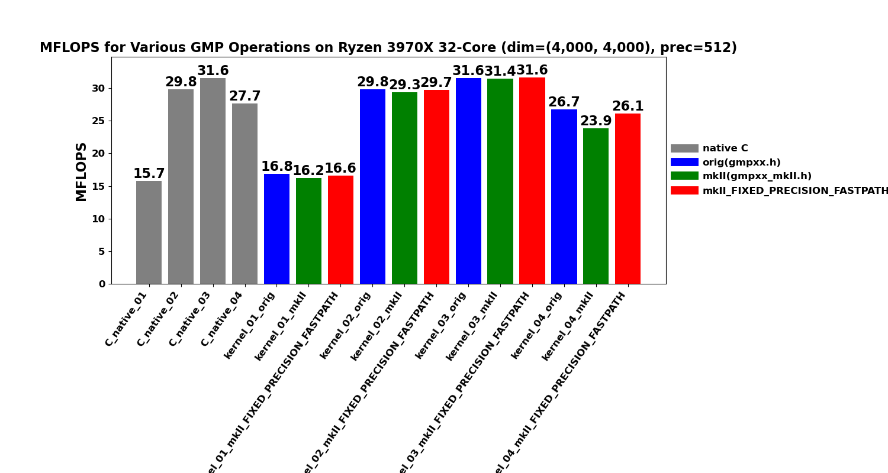

<!-- SPDX-License-Identifier: BSD-2-Clause -->

# 02_Rgemv

This directory benchmarks the GMP real dense matrix-vector product

```text
y = alpha * A * x + beta * y
```

with random `mpf` data at a fixed precision.  It compares raw `mpf_t`,
upstream `gmpxx.h`, `gmpxx_mkII`, and `gmpxx_mkII` built with
`GMPFRXX_MKII_ASSUME_FIXED_PRECISION_FASTPATH`.

This README follows the same structure as `../01_Raxpy/README.md`: build and
run instructions, result interpretation, recorded samples, kernel shapes,
hotpath disassembly, and lessons learned.

## Build

From the repository root:

```bash
cmake -S . -B build_bench_release -DCMAKE_BUILD_TYPE=Release
cmake --build build_bench_release -j
```

The executables are created under:

```text
build_bench_release/benchmarks/gmp/02_Rgemv/
```

## Run

Run the whole benchmark set through the top-level runner:

```bash
benchmarks/common/run_benchmarks.sh build_bench_release 512
```

For a quick Rgemv-sized smoke run, pass smaller dimensions:

```bash
benchmarks/common/run_benchmarks.sh build_bench_release 128 1000 1000 32 32 16 16 16 \
    benchmarks/gmp/results-smoke
```

The `RGEMV_M RGEMV_N` runner arguments are used for Rgemv.  Individual
executables take:

```text
<rows m> <cols n> <precision>
```

Example:

```bash
build_bench_release/benchmarks/gmp/02_Rgemv/Rgemv_gmp_kernel_01_mkII 4000 4000 512
```

For OpenMP runs, keep affinity explicit:

```bash
OMP_NUM_THREADS=32 OMP_PLACES=cores OMP_PROC_BIND=spread \
build_bench_release/benchmarks/gmp/02_Rgemv/Rgemv_gmp_kernel_openmp_03_mkII \
    4000 4000 512
```

## Reading Results

Each executable prints `Elapsed time`, `MFLOPS`, `L1 Norm of difference`, and a
`Result OK` or `Result NG` check against the reference result.  Higher MFLOPS is
better when the correctness check is `Result OK`.

Variant names:

- `C_native`: raw `mpf_t` implementation.
- `C_native_01`: raw `mpf_t` counterpart of C++ `kernel_01`; intentionally
  materializes a loop-local product object in the inner loop.
- `C_native_02`: raw `mpf_t` counterpart of C++ `kernel_02`; uses reusable
  temporaries with copy-then-multiply steps.
- `C_native_03`: raw `mpf_t` counterpart of C++ `kernel_03`; uses reusable
  temporaries assigned from product operations.
- `C_native_04`: raw `mpf_t` counterpart of C++ `kernel_04`; uses loop-local
  `temp` and `templ` objects.
- `C_native_openmp_01`: raw `mpf_t` OpenMP counterpart of C++
  `kernel_openmp_01`; intentionally materializes a loop-local product object
  in the inner loop.
- `C_native_openmp_02`: raw `mpf_t` OpenMP counterpart of C++
  `kernel_openmp_02`; uses per-thread reusable temporaries with
  copy-then-multiply steps.
- `C_native_openmp_03`: raw `mpf_t` OpenMP counterpart of C++
  `kernel_openmp_03`; uses per-thread reusable temporaries assigned from
  product operations.
- `C_native_openmp_04`: raw `mpf_t` OpenMP counterpart of C++
  `kernel_openmp_04`; uses loop-local `temp` and `templ` objects in the
  row-partitioned loop.
- `C_native_openmp_05`: raw `mpf_t` OpenMP counterpart of C++
  `kernel_openmp_05`; precomputes `alpha * x[j]` once before row partitioning.
- `C_native_openmp_06`: raw `mpf_t` OpenMP counterpart of C++
  `kernel_openmp_06`; uses 256-row blocks to recover contiguous `A` access
  inside each block.
- `C_native_openmp_07`: raw `mpf_t` OpenMP counterpart of C++
  `kernel_openmp_07`; partitions columns and reduces thread-local `y`
  accumulators.
- `*_orig`: upstream `gmpxx.h`.
- `*_mkII`: this header with the default precision policy.
- `*_mkII_FIXED_PRECISION_FASTPATH`: this header with `GMPFRXX_MKII_ASSUME_FIXED_PRECISION_FASTPATH`.
- `*_openmp_*`: OpenMP variant where the eager benchmark provided one.

Current C++ kernel source shapes:

| Kernel | Shape |
|---|---|
| `kernel_01` | Column-major AXPY form with direct expression use: `y[i] += (alpha * x[j]) * A[i + j * lda]`. |
| `kernel_02` | Column-major AXPY form with reusable `temp` and `templ`, using copy-then-multiply steps. |
| `kernel_03` | Column-major AXPY form with reusable `temp` and `templ`, assigning expression results into those objects. |
| `kernel_04` | Column-major AXPY form with loop-local temporary objects, matching the loop-local product-object style used in Raxpy. |
| `kernel_openmp_01` | Row-partitioned OpenMP direct-expression form. It avoids races on `y[i]` by giving each row to one thread. |
| `kernel_openmp_02` | Row-partitioned OpenMP form with per-thread reusable `temp` and `templ`, using copy-then-multiply steps. |
| `kernel_openmp_03` | Row-partitioned OpenMP form with per-thread reusable `temp` and `templ`, assigning expression results into those objects. |
| `kernel_openmp_04` | Row-partitioned OpenMP form with loop-local `temp` and `templ` objects. |
| `kernel_openmp_05` | Row-partitioned OpenMP form with a precomputed `scaled_x[j] = alpha * x[j]` vector. |
| `kernel_openmp_06` | Row-blocked OpenMP form with 256-row blocks and contiguous `A` access inside each block. |
| `kernel_openmp_07` | Column-partitioned OpenMP form with thread-local `y` partial vectors and a final reduction. |

The serial kernels use the same column-oriented update order as the reference
BLAS-style `Rgemv` routine, so they are close to a sequence of Raxpy updates.
The OpenMP kernels deliberately switch to row partitioning because the
column-oriented update would otherwise write the same `y[i]` from multiple
threads.  This makes the OpenMP kernels safe and keeps the benchmark focused on
GMP arithmetic and wrapper temporary behavior instead of synchronization.

The serial C native and C++ wrapper numbers are intentionally aligned:

| Number | C native executable | C++ wrapper executable family | Meaning |
|--------|---------------------|-------------------------------|---------|
| 01 | `Rgemv_gmp_C_native_01` | `Rgemv_gmp_kernel_01_*` | Direct expression / inner-loop materialization stress case. |
| 02 | `Rgemv_gmp_C_native_02` | `Rgemv_gmp_kernel_02_*` | Reusable temporaries with copy-then-multiply steps. |
| 03 | `Rgemv_gmp_C_native_03` | `Rgemv_gmp_kernel_03_*` | Reusable temporaries assigned from product operations. |
| 04 | `Rgemv_gmp_C_native_04` | `Rgemv_gmp_kernel_04_*` | Loop-local `temp` and `templ` objects. |

The OpenMP C native and C++ wrapper numbers are aligned the same way:

| Number | C native OpenMP executable | C++ wrapper OpenMP executable family | Meaning |
|--------|----------------------------|--------------------------------------|---------|
| 01 | `Rgemv_gmp_C_native_openmp_01` | `Rgemv_gmp_kernel_openmp_01_*` | Row-partitioned direct expression / inner-loop materialization stress case. |
| 02 | `Rgemv_gmp_C_native_openmp_02` | `Rgemv_gmp_kernel_openmp_02_*` | Row-partitioned reusable temporaries with copy-then-multiply steps. |
| 03 | `Rgemv_gmp_C_native_openmp_03` | `Rgemv_gmp_kernel_openmp_03_*` | Row-partitioned reusable temporaries assigned from product operations. |
| 04 | `Rgemv_gmp_C_native_openmp_04` | `Rgemv_gmp_kernel_openmp_04_*` | Row-partitioned loop-local `temp` and `templ` objects. |
| 05 | `Rgemv_gmp_C_native_openmp_05` | `Rgemv_gmp_kernel_openmp_05_*` | Row-partitioned loop with precomputed `alpha * x[j]`. |
| 06 | `Rgemv_gmp_C_native_openmp_06` | `Rgemv_gmp_kernel_openmp_06_*` | Row-blocked loop with 256-row blocks. |
| 07 | `Rgemv_gmp_C_native_openmp_07` | `Rgemv_gmp_kernel_openmp_07_*` | Column-partitioned loop with thread-local `y` reduction. |

## Recorded go.sh Sample


The committed sample run uses the original `go.sh` dimensions:

```text
M = 4000, N = 4000, precision = 512
```

Results are stored in [../results_raw/Linux_Ryzen_3970X_32-Core/](../results_raw/Linux_Ryzen_3970X_32-Core/):

- [Raw log](../results_raw/Linux_Ryzen_3970X_32-Core/benchmark_20260430_081331.log)
- [Serial plot](../results_raw/Linux_Ryzen_3970X_32-Core/benchmark_20260430_081331_Linux_Ryzen_3970X_32-Core_serial_Rgemv.png)
- [Serial PDF](../results_raw/Linux_Ryzen_3970X_32-Core/benchmark_20260430_081331_Linux_Ryzen_3970X_32-Core_serial_Rgemv.pdf)
- [OpenMP plot](../results_raw/Linux_Ryzen_3970X_32-Core/benchmark_20260430_081331_Linux_Ryzen_3970X_32-Core_openmp_Rgemv.png)
- [OpenMP PDF](../results_raw/Linux_Ryzen_3970X_32-Core/benchmark_20260430_081331_Linux_Ryzen_3970X_32-Core_openmp_Rgemv.pdf)

That sample predates the current `kernel_03`, `kernel_04`, and
`kernel_openmp_03` split.  It also predates the row-partitioned OpenMP rewrite
that removes loop-local `mpf_init`/`mpf_clear` from the timed inner loops.
New runs should use the current `go.sh` or the common runner so the expanded
kernel set is included.

## Recorded Refactored Sample

The focused local run used:

```text
M = 4000
N = 4000
precision = 512
OMP_NUM_THREADS = 32
OMP_PLACES = cores
OMP_PROC_BIND = spread
repeat = 1
```

Results are stored in this directory:

- [Raw log](results_raw/rgemv_gmp_m4000_n4000_p512_20260516_122201.log)
- [CSV summary](results_raw/rgemv_gmp_m4000_n4000_p512_summary_20260516_122201.csv)

All variants in this run report `Result OK`.

| Variant | MFLOPS | Interpretation |
|---------|-------:|----------------|
| `C_native_01` | Not in this run | Added after this run; raw counterpart of `kernel_01`. |
| `C_native_02` | Not in this run | Added after this run; raw counterpart of `kernel_02`. |
| `C_native_03` | 31.421 | Raw serial counterpart of `kernel_03`; this was named `C_native_01` when the run was recorded. |
| `C_native_04` | Not in this run | Added after this run; raw counterpart of `kernel_04`. |
| `C_native_openmp_01` | Not in this run | Added after this run; raw OpenMP counterpart of `kernel_openmp_01`. |
| `C_native_openmp_02` | Not in this run | Added after this run; raw OpenMP counterpart of `kernel_openmp_02`. |
| `C_native_openmp_03` | 241.372 | Raw OpenMP counterpart of `kernel_openmp_03`; this was named `C_native_openmp_01` when the run was recorded. |
| `C_native_openmp_04` | Not in this run | Added after this run; raw OpenMP counterpart of `kernel_openmp_04`. |
| `C_native_openmp_05` | Not in this run | Added after this run; precomputed `alpha*x` OpenMP candidate. |
| `C_native_openmp_06` | Not in this run | Added after this run; 256-row-blocked OpenMP candidate. |
| `C_native_openmp_07` | Not in this run | Added after this run; column-partitioned OpenMP candidate with thread-local reduction. |
| `kernel_01_orig` | 16.973 | Direct expression form; product expression materializes in the inner loop. |
| `kernel_01_mkII` | 16.016 | Same source shape as upstream `kernel_01`; slowest default wrapper path in this run. |
| `kernel_01_mkII_FIXED_PRECISION_FASTPATH` | 16.633 | Fastpath does not remove the source-shape cost here. |
| `kernel_02_orig` | 29.775 | Reusable `temp`/`templ` with copy-then-multiply steps. |
| `kernel_02_mkII` | 29.958 | Same class as C native, but still carries an explicit copy pattern. |
| `kernel_02_mkII_FIXED_PRECISION_FASTPATH` | 29.680 | Same class as default `kernel_02`. |
| `kernel_03_orig` | 32.014 | Best serial variant in this run. |
| `kernel_03_mkII` | 31.475 | Best serial mkII shape; same broad class as C native. |
| `kernel_03_mkII_FIXED_PRECISION_FASTPATH` | 31.392 | Same class as default `kernel_03`. |
| `kernel_04_orig` | 26.754 | Loop-local product objects are slower. |
| `kernel_04_mkII` | 23.400 | Loop-local temporary lifetime is costly for default mkII. |
| `kernel_04_mkII_FIXED_PRECISION_FASTPATH` | 26.581 | Fastpath helps, but this remains behind `kernel_03`. |
| `kernel_openmp_01_orig` | 234.026 | Row-partitioned OpenMP direct-expression form. |
| `kernel_openmp_01_mkII` | 226.587 | Same class, slightly slower in this single run. |
| `kernel_openmp_01_mkII_FIXED_PRECISION_FASTPATH` | 228.345 | Same class as default OpenMP 01. |
| `kernel_openmp_02_orig` | 235.763 | Row-partitioned reusable copy-then-multiply form. |
| `kernel_openmp_02_mkII` | 236.324 | Same class as upstream OpenMP 02. |
| `kernel_openmp_02_mkII_FIXED_PRECISION_FASTPATH` | 237.787 | Same class as default OpenMP 02. |
| `kernel_openmp_03_orig` | 241.843 | Best OpenMP variant in this run. |
| `kernel_openmp_03_mkII` | 240.741 | Best OpenMP mkII shape; effectively C native OpenMP class. |
| `kernel_openmp_03_mkII_FIXED_PRECISION_FASTPATH` | 240.693 | Same class as default OpenMP 03. |
| `kernel_openmp_04_orig` | Not in this run | Added after this run; row-partitioned loop-local object stress case. |
| `kernel_openmp_04_mkII` | Not in this run | Added after this run; row-partitioned loop-local object stress case. |
| `kernel_openmp_04_mkII_FIXED_PRECISION_FASTPATH` | Not in this run | Added after this run; row-partitioned loop-local object stress case. |
| `kernel_openmp_05_*` | Not in this run | Added after this run; precomputed `alpha*x` OpenMP candidate. |
| `kernel_openmp_06_*` | Not in this run | Added after this run; 256-row-blocked OpenMP candidate. |
| `kernel_openmp_07_*` | Not in this run | Added after this run; column-partitioned OpenMP candidate with thread-local reduction. |

The main serial result matches Raxpy: `kernel_03` is the useful wrapper shape.
It keeps product storage outside the inner loop and assigns expression results
into reusable objects.  `kernel_01` is much slower because the direct nested
expression causes inner-loop product materialization.  `kernel_04` is slower
because it deliberately makes loop-local product objects.

The main OpenMP result is that row partitioning fixes the earlier OpenMP 02
correctness problem and puts all OpenMP 01/02/03 variants into the same
230-242 MFLOPS class.  The best mkII OpenMP path is `kernel_openmp_03_mkII` at
240.741 MFLOPS, essentially the same as raw C native OpenMP in this single run.

## Recorded OpenMP 05-07 Sample

The focused local run after adding OpenMP kernels 05, 06, and 07 used:

```text
M = 4000
N = 4000
precision = 512
OMP_NUM_THREADS = 32
OMP_PLACES = cores
OMP_PROC_BIND = spread
repeat = 1
```

Results are stored in this directory:

- [Raw log](results_raw/rgemv_gmp_m4000_n4000_p512_20260516_132406/benchmark_rgemv_gmp_m4000_n4000_p512.log)
- [CSV summary](results_raw/rgemv_gmp_m4000_n4000_p512_20260516_132406/summary_rgemv_gmp_m4000_n4000_p512.csv)
- [Serial plot](results_raw/rgemv_gmp_m4000_n4000_p512_20260516_132406/singlecore_operations_Linux_Ryzen_3970X_32-Core_4000_4000_512.png)
- [OpenMP plot](results_raw/rgemv_gmp_m4000_n4000_p512_20260516_132406/openmp_operations_Linux_Ryzen_3970X_32-Core_4000_4000_512.png)




All variants in this run report `Result OK`.

| Variant | MFLOPS | Interpretation |
|---------|-------:|----------------|
| `C_native_03` | 31.554 | Best raw serial class; reusable product assignment. |
| `kernel_03_mkII_FIXED_PRECISION_FASTPATH` | 31.643 | Best wrapper serial result in this run. |
| `C_native_openmp_03` | 243.739 | Original optimized row-partitioned OpenMP baseline. |
| `kernel_openmp_03_mkII` | 244.651 | Wrapper matches the optimized row-partitioned baseline. |
| `C_native_openmp_05` | 284.074 | Precomputing `alpha*x[j]` helps row partitioning. |
| `kernel_openmp_05_mkII` | 293.997 | Best wrapper precomputed-scaled-x result. |
| `C_native_openmp_06` | 400.920 | 256-row blocking is a large improvement over plain row partitioning. |
| `kernel_openmp_06_mkII` | 403.952 | Wrapper row-blocked result matches raw C native. |
| `C_native_openmp_07` | 544.743 | Column partitioning with thread-local reduction is the best raw C native result. |
| `kernel_openmp_07_mkII` | 552.458 | Best result in this run. |

## Memory Bandwidth Estimate

This section estimates logical memory bandwidth from the same 512-bit run.  It
is not a hardware-counter measurement.  It is a lower-bound model for comparing
kernel source shapes.

On this machine, `sizeof(__mpf_struct) = 24` bytes and `sizeof(mp_limb_t) = 8`
bytes.  For `mpf_init2(..., 512)`, GMP reports `_mp_prec = 9` limbs, while the
random benchmark inputs have 8 active limbs.  Therefore:

```text
active mpf value bytes      = 24-byte header + 8 active limbs * 8 = 88 bytes
allocated mpf footprint     = 24-byte header + 9 allocated limbs * 8 = 96 bytes
A-only active stream GB/s   = MFLOPS * 0.044
A+y active logical GB/s     = MFLOPS * 0.132
A+x+y active logical GB/s   = MFLOPS * 0.176
```

The `A-only` number is the minimum matrix stream implied by the reported
MFLOPS.  The `A+y` number also counts one read and one write of `y` per matrix
element.  The `A+x+y` number additionally counts `x` for each matrix element;
that is an upper logical model for row-partitioned loops because `x` is small
enough to be heavily reused from cache.  These are active-limb estimates; using
the 96-byte allocated footprint scales the numbers by `96/88 = 1.091`.

| Variant | MFLOPS | A-only GB/s | A+y GB/s | A+x+y GB/s |
|---------|-------:|------------:|---------:|-----------:|
| `kernel_openmp_03_mkII` | 244.651 | 10.765 | 32.294 | 43.059 |
| `kernel_openmp_05_mkII` | 293.997 | 12.936 | 38.808 | 51.743 |
| `kernel_openmp_06_mkII` | 403.952 | 17.774 | 53.322 | 71.096 |
| `kernel_openmp_07_mkII` | 552.458 | 24.308 | 72.925 | 97.233 |
| `C_native_openmp_07` | 544.743 | 23.969 | 71.906 | 95.875 |

The progression is consistent with the source-shape changes.  Kernel 05
removes repeated `alpha*x[j]` work but still uses row-partitioned strided
matrix access.  Kernel 06 restores contiguous `A` access inside each row block.
Kernel 07 keeps the serial-like column-major `A` stream and pays for
thread-local `y` partial vectors plus final reduction.  Its logical bandwidth
estimate is high enough that repeat-count runs and hardware counters are needed
before treating the single-run ordering as final.

## Kernel Shapes

The timed body is `_Rgemv()` in each benchmark executable.  The `Rgemv()`
helper in `Rgemv.hpp` is the post-run correctness reference and should not be
mixed with the timed-kernel source-shape comparison.

| Variant | Timed source shape | Temporary policy | Hotpath meaning |
|---------|--------------------|------------------|-----------------|
| `C_native_01` | Column-major loop-local `product = (alpha * x[j]) * A[i + j*lda]; y[i] += product`. | Raw `mpf_t` `product` initialized and cleared in the inner loop. | Raw C counterpart of C++ `kernel_01`; deliberately mirrors inner-loop materialization. |
| `C_native_02` | Column-major `temp = alpha; temp *= x[j]; templ = temp; templ *= A[i + j*lda]; y[i] += templ`. | Raw `mpf_t` reusable `temp` and `templ`, copy-then-multiply. | Raw C counterpart of C++ `kernel_02`. |
| `C_native_03` | Column-major `temp = alpha * x[j]`; inner `templ = temp * A[i + j*lda]; y[i] += templ`. | Raw `mpf_t` reusable `temp` and `templ`, product assignment. | Raw C counterpart of C++ `kernel_03`; this is the optimized serial C baseline. |
| `C_native_04` | Column-major loop-local `temp = alpha * x[j]`; inner loop-local `templ = temp * A[i + j*lda]; y[i] += templ`. | Raw `mpf_t` `temp` initialized per column and `templ` initialized per matrix element. | Raw C counterpart of C++ `kernel_04`; loop-local object stress case. |
| `C_native_openmp_01` | Row-partitioned loop-local `product = (alpha * x[j]) * A[i + j*lda]; y[i] += product`. | Raw `mpf_t` `product` initialized and cleared in the inner loop. | Raw OpenMP counterpart of C++ `kernel_openmp_01`; deliberately mirrors inner-loop materialization. |
| `C_native_openmp_02` | Row-partitioned `temp = alpha; temp *= x[j]; templ = temp; templ *= A[i + j*lda]; y[i] += templ`. | Raw `mpf_t` reusable `temp` and `templ` per thread, copy-then-multiply. | Raw OpenMP counterpart of C++ `kernel_openmp_02`. |
| `C_native_openmp_03` | Row-partitioned `temp = alpha * x[j]; templ = temp * A[i + j*lda]; y[i] += templ`. | Raw `mpf_t` reusable `temp` and `templ` per thread, product assignment. | Raw OpenMP counterpart of C++ `kernel_openmp_03`; this is the optimized raw OpenMP baseline. |
| `C_native_openmp_04` | Row-partitioned loop-local `temp = alpha * x[j]`; loop-local `templ = temp * A[i + j*lda]; y[i] += templ`. | Raw `mpf_t` `temp` and `templ` initialized and cleared in the inner loop. | Raw OpenMP counterpart of C++ `kernel_openmp_04`; loop-local object stress case. |
| `C_native_openmp_05` | Precompute `scaled_x[j] = alpha * x[j]`, then row-partitioned `y[i] += scaled_x[j] * A[i + j*lda]`. | Raw `mpf_t` `scaled_x` vector and per-thread reusable `prod`. | Removes repeated `alpha*x[j]` from row-partitioned OpenMP. |
| `C_native_openmp_06` | 256-row blocked loop: each block owns `y[ib:iend]`, loops over `j`, then contiguous `i` inside the block. | Raw `mpf_t` per-thread reusable `temp` and `prod`. | Reduces `alpha*x[j]` recomputation and restores contiguous `A` access within each block. |
| `C_native_openmp_07` | Column-partitioned loop with per-thread partial `y` vectors and final reduction. | Raw `mpf_t` partial vectors sized `num_threads * m`. | Keeps column-major `A` access but pays large accumulator and reduction cost. |
| `kernel_01` | Column-major `y[i] += (alpha * x[j]) * A[i + j * lda]`. | Direct nested expression. | Tests expression-template materialization in the inner loop. |
| `kernel_02` | Column-major `temp = alpha; temp *= x[j]; templ = temp; templ *= A[i + j*lda]; y[i] += templ`. | Reusable `temp` and `templ`, copy-then-multiply. | Avoids loop-local construction but pays explicit copies. |
| `kernel_03` | Column-major `temp = alpha * x[j]; templ = temp * A[i + j*lda]; y[i] += templ`. | Reusable `temp` and `templ`, expression assignment. | Best serial wrapper shape: reusable storage and direct product assignment. |
| `kernel_04` | Column-major loop-local `mpf_class temp` and `mpf_class templ`. | Loop-local product objects. | Allocation/lifetime stress case; expected to be slower. |
| `kernel_openmp_01` | Row-partitioned direct expression. | One independent `y[i]` per thread chunk. | Safe OpenMP version of direct-expression source. |
| `kernel_openmp_02` | Row-partitioned reusable copy-then-multiply. | Private reusable `temp` and `templ` per thread. | Safe OpenMP version of `kernel_02`. |
| `kernel_openmp_03` | Row-partitioned reusable expression assignment. | Private reusable `temp` and `templ` per thread. | Safe OpenMP version of `kernel_03`; best OpenMP wrapper shape here. |
| `kernel_openmp_04` | Row-partitioned loop-local expression assignment. | Loop-local `temp` and `templ` objects. | Safe OpenMP version of `kernel_04`; allocation/lifetime stress case. |
| `kernel_openmp_05` | Precomputed `scaled_x[j] = alpha * x[j]`, followed by row-partitioned updates. | Shared read-only `scaled_x` vector and per-thread reusable `templ`. | Tests whether removing repeated `alpha*x[j]` helps row-partitioned OpenMP. |
| `kernel_openmp_06` | 256-row blocked updates. | Per-thread reusable `temp` and `templ`. | Tests row blocking as the main OpenMP locality optimization. |
| `kernel_openmp_07` | Column-partitioned updates into thread-local partial `y` vectors. | `num_threads * m` partial accumulators plus final reduction. | Tests serial-like column-major access without races, at high reduction cost. |

The serial and OpenMP source shapes are intentionally not identical.  Serial
Rgemv follows the BLAS-like column-major AXPY order.  OpenMP uses row
partitioning because the column-major update would make all threads contend on
the same `y` vector.

## Hotpath Disassembly

The snippets below are from Release binaries under
`build_bench_release/benchmarks/gmp/02_Rgemv/`.  They focus on the timed
`_Rgemv()` loop or, for OpenMP, the outlined loop body.

### `C_native_03`

Raw C native `C_native_03` initializes `temp` and `templ` once, scales `y`
once, then uses a column-major AXPY loop.  The inner loop is one `mpf_mul` plus
one `mpf_add`.  This executable was named `C_native_01` when the recorded
single-run table was taken.

```asm
56c0: mov    0x8(%rsp),%rdx       # x[j]
56c5: mov    0x20(%rsp),%rsi      # alpha
56ca: lea    0x40(%rsp),%rdi      # temp_b
56cf: call   __gmpf_mul@plt       # temp_b = alpha * x[j]

5700: mov    %r14,%rdx            # A[i + j*lda]
5703: lea    0x40(%rsp),%rsi      # temp_b
5708: mov    %rbp,%rdi            # prod
570f: call   __gmpf_mul@plt       # prod = temp_b * A
5714: mov    %rbx,%rsi            # y[i]
5717: mov    %rbx,%rdi            # y[i]
571a: mov    %rbp,%rdx            # prod
571d: call   __gmpf_add@plt       # y[i] += prod
5722: add    $0x18,%r14           # A++
5726: add    $0x18,%rbx           # y++
572d: jne    5700
```

### `kernel_01_mkII`

`kernel_01` is the direct nested-expression source shape.  The hotpath shows
why it is slower: the inner loop initializes and clears a product temporary and
enters expression evaluation before the final multiply/add.

```asm
57d0: mov    0x10(%rsp),%rax
57d5: mov    %rbx,%rdi            # y[i], used for precision
57e7: call   __gmpf_get_prec@plt
57ec: mov    %rbp,%rdi            # loop-local product
57f5: call   __gmpf_init2@plt
57fa: mov    0x18(%rsp),%rsi      # binary expression node
5805: call   mpf_evaluate<mul_op,...>
580a: mov    %r12,%rdx            # A[i + j*lda]
580d: mov    %rbp,%rsi            # evaluated alpha*x[j]
5813: call   __gmpf_mul@plt
5818: mov    %rbp,%rdx
581b: mov    %rbx,%rsi
5821: call   __gmpf_add@plt
5826: mov    %rbp,%rdi
5835: call   __gmpf_clear@plt
583f: jne    57d0
```

This explains the measured gap: `kernel_01_mkII` is 16.016 MFLOPS while
`kernel_03_mkII` is 31.475 MFLOPS in the recorded run.

### `kernel_03_mkII`

`kernel_03` keeps `temp` and `templ` outside the loop.  After one-time
initialization, the inner loop is the same call class as C native: one
`mpf_mul` plus one `mpf_add`.

```asm
57c0: mov    0x8(%rsp),%rdx       # x[j]
57c5: mov    0x20(%rsp),%rsi      # alpha
57ca: lea    0x40(%rsp),%rdi      # temp
57cf: call   __gmpf_mul@plt       # temp = alpha * x[j]

5800: mov    %r12,%rdx            # A[i + j*lda]
5803: lea    0x40(%rsp),%rsi      # temp
5808: mov    %r13,%rdi            # templ
580b: call   __gmpf_mul@plt       # templ = temp * A
5810: mov    %r13,%rdx            # templ
5813: mov    %rbx,%rsi            # y[i]
5816: mov    %rbx,%rdi            # y[i]
5819: call   __gmpf_add@plt       # y[i] += templ
581e: add    $0x1,%rbp
5822: add    $0x18,%r12           # A++
5826: add    $0x18,%rbx           # y++
582d: jne    5800
```

This is why `kernel_03_mkII` is in the C native serial performance class.

### `kernel_openmp_03_mkII`

The OpenMP path is row-partitioned.  Each thread initializes private `temp` and
`templ` once.  For each owned row, it first scales `y[i]`, then loops over
columns.  The inner column loop has two multiplies and one add:

```asm
4020: mov    0x30(%r15),%rdx      # beta
4024: mov    %r14,%rsi            # y[i]
4027: mov    %r14,%rdi            # y[i]
402f: call   __gmpf_mul@plt       # y[i] *= beta

4070: mov    0x10(%rbx),%rsi      # alpha
4074: mov    0x8(%rsp),%rdi       # temp
4079: mov    %r15,%rdx            # x[j]
4084: call   __gmpf_mul@plt       # temp = alpha * x[j]
4089: mov    0x8(%rsp),%rsi       # temp
408e: mov    %r13,%rdx            # A[i + j*lda]
4091: mov    %rbp,%rdi            # templ
4094: call   __gmpf_mul@plt       # templ = temp * A
4099: mov    %rbp,%rdx            # templ
409c: mov    %r14,%rsi            # y[i]
409f: mov    %r14,%rdi            # y[i]
40a2: call   __gmpf_add@plt       # y[i] += templ
40a7: add    0x18(%rsp),%r13      # next A row-stride access
40b1: jne    4070
```

Compared with serial `kernel_03`, this row-partitioned OpenMP path recomputes
`alpha * x[j]` for each row instead of once per column.  That is the price paid
to avoid races on `y[i]`.  Despite the extra outer-loop work, it reaches
240.741 MFLOPS on 32 threads in the recorded run.

## Lessons Learned

- The Raxpy README structure maps well to Rgemv, but Rgemv needs one extra
  distinction: serial and OpenMP use different traversal orders for correctness
  and race avoidance.
- Serial Rgemv should be read as a sequence of column-major Raxpy updates.
  With that shape, `kernel_03` is the useful wrapper source form.
- Direct nested expressions in `kernel_01` are not free.  The disassembly shows
  loop-local initialization, expression evaluation, and clearing in the hot
  path.
- Reusable expression-assignment temporaries in `kernel_03` reduce the hot path
  to the same GMP call class as C native.
- Loop-local product objects in `kernel_04` remain useful as a stress case, but
  they are not the optimization target.
- OpenMP Rgemv should partition rows unless a separate reduction or buffering
  scheme is introduced.  Column-major parallel AXPY would otherwise race on
  `y[i]`.
- The current row-partitioned OpenMP kernels are correctness-clean: every
  variant in the recorded refactored run reports `Result OK`.
