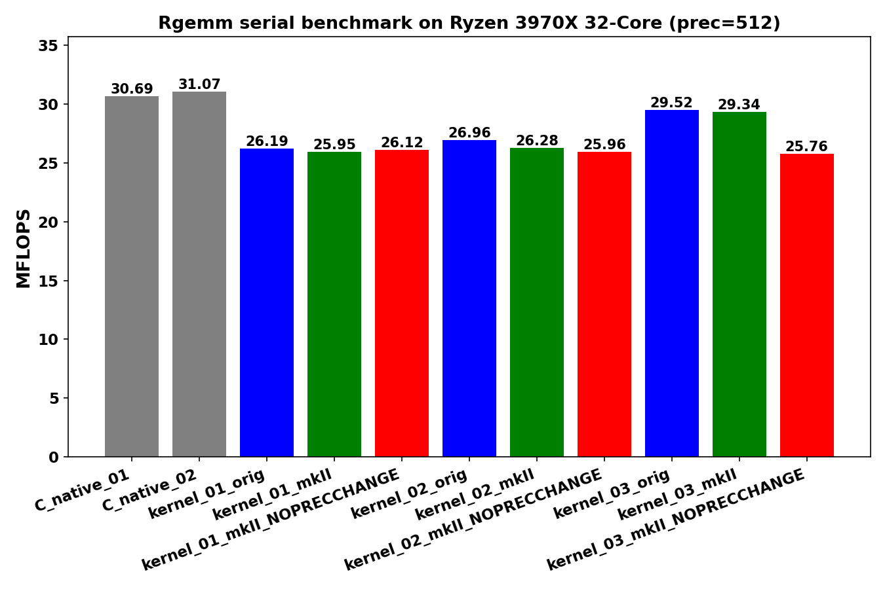
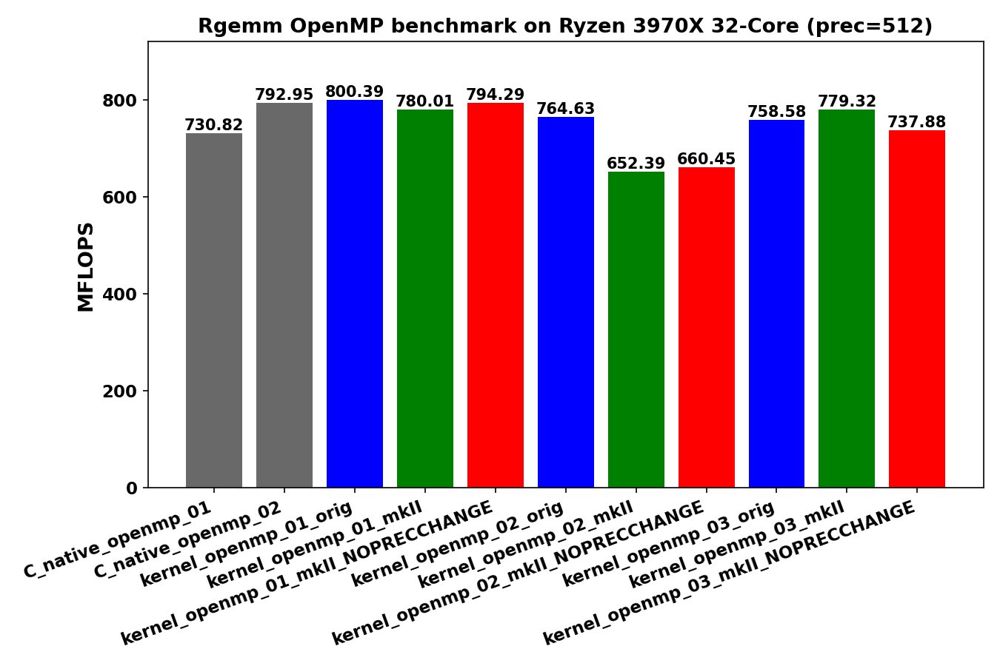
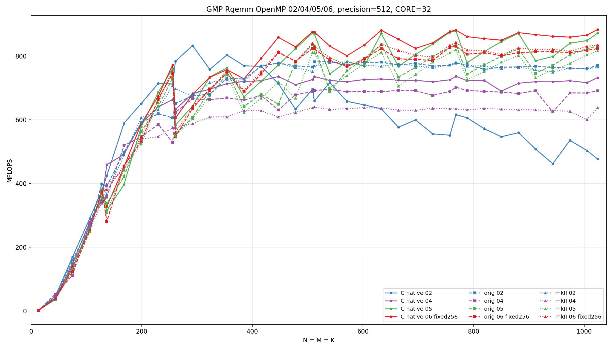
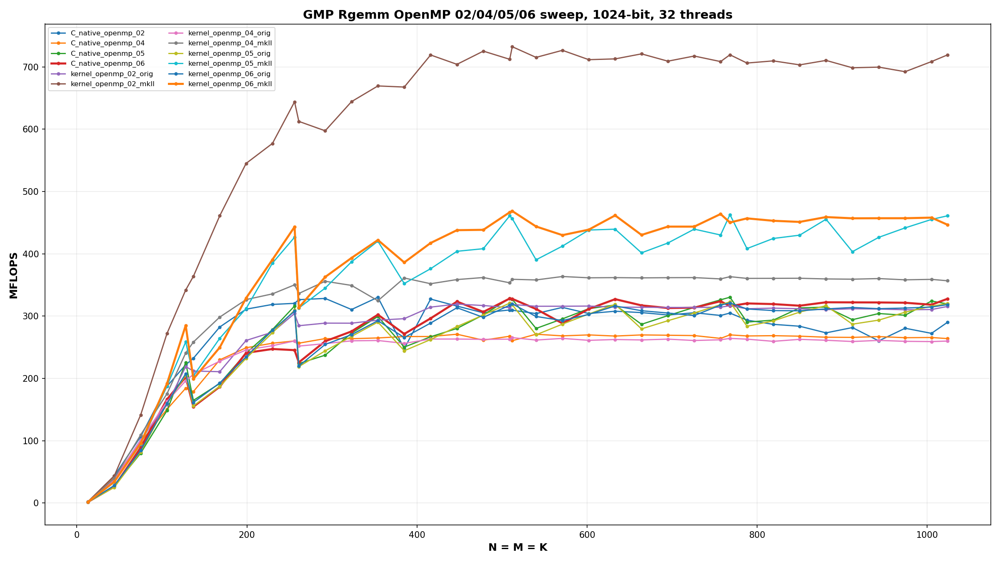

<!--
Copyright (c) 2026
     Nakata, Maho
     All rights reserved.

Redistribution and use in source and binary forms, with or without
modification, are permitted provided that the following conditions
are met:
1. Redistributions of source code must retain the above copyright
   notice, this list of conditions and the following disclaimer.
2. Redistributions in binary form must reproduce the above copyright
   notice, this list of conditions and the following disclaimer in the
   documentation and/or other materials provided with the distribution.

THIS SOFTWARE IS PROVIDED BY THE AUTHOR AND CONTRIBUTORS ``AS IS'' AND
ANY EXPRESS OR IMPLIED WARRANTIES, INCLUDING, BUT NOT LIMITED TO, THE
IMPLIED WARRANTIES OF MERCHANTABILITY AND FITNESS FOR A PARTICULAR PURPOSE
ARE DISCLAIMED.  IN NO EVENT SHALL THE AUTHOR OR CONTRIBUTORS BE LIABLE
FOR ANY DIRECT, INDIRECT, INCIDENTAL, SPECIAL, EXEMPLARY, OR CONSEQUENTIAL
DAMAGES (INCLUDING, BUT NOT LIMITED TO, PROCUREMENT OF SUBSTITUTE GOODS
OR SERVICES; LOSS OF USE, DATA, OR PROFITS; OR BUSINESS INTERRUPTION)
HOWEVER CAUSED AND ON ANY THEORY OF LIABILITY, WHETHER IN CONTRACT, STRICT
LIABILITY, OR TORT (INCLUDING NEGLIGENCE OR OTHERWISE) ARISING IN ANY WAY
OUT OF THE USE OF THIS SOFTWARE, EVEN IF ADVISED OF THE POSSIBILITY OF
SUCH DAMAGE.
-->

# 03_Rgemm

This directory benchmarks the GMP real dense matrix-matrix product

```text
C = alpha * A * B + beta * C
```

with random `mpf` data at a fixed precision.  It compares raw `mpf_t`,
upstream `gmpxx.h`, `gmpxx_mkII`, and `gmpxx_mkII` built with
`GMPFRXX_MKII_ASSUME_FIXED_PRECISION_FASTPATH`.

## Build

From the repository root:

```bash
cmake -S . -B build_bench_release -DCMAKE_BUILD_TYPE=Release
cmake --build build_bench_release -j
```

The executables are created under:

```text
build_bench_release/benchmarks/gmp/03_Rgemm/
```

## Run

Run the whole benchmark set through the top-level runner:

```bash
benchmarks/common/run_benchmarks.sh build_bench_release 512
```

For a quick Rgemm-sized smoke run, pass smaller dimensions:

```bash
benchmarks/common/run_benchmarks.sh build_bench_release 128 1000 1000 32 32 16 16 16 \
    benchmarks/gmp/results-smoke
```

The `RGEMM_M RGEMM_K RGEMM_N` runner arguments are used for Rgemm.  Individual
executables take:

```text
<rows m> <cols k> <cols n> <precision>
```

Example:

```bash
build_bench_release/benchmarks/gmp/03_Rgemm/Rgemm_gmp_kernel_01_mkII 500 500 500 512
```

## Reading Results

Each executable prints `Elapsed time`, `MFLOPS`, `L1 Norm of difference`, and a
`Result OK` or `Result NG` check against the reference result.  Higher MFLOPS is
better when the correctness check is `Result OK`.

Variant names:

- `C_native`: raw `mpf_t` implementation.
- `C_native_openmp`: raw `mpf_t` implementation with OpenMP.
- `*_orig`: upstream `gmpxx.h`.
- `*_mkII`: this header with the default precision policy.
- `*_mkII_FIXED_PRECISION_FASTPATH`: this header with `GMPFRXX_MKII_ASSUME_FIXED_PRECISION_FASTPATH`.
- `*_openmp_*`: OpenMP variant where the eager benchmark provided one.

## Recorded Sample Run





The committed sample run uses the legacy sample dimensions:

```text
M = 500, K = 500, N = 500, precision = 512
```

Results are stored in [../results_raw/Linux_Ryzen_3970X_32-Core/](../results_raw/Linux_Ryzen_3970X_32-Core/):

- [Raw log](../results_raw/Linux_Ryzen_3970X_32-Core/benchmark_20260430_081331.log)
- [Serial plot](../results_raw/Linux_Ryzen_3970X_32-Core/benchmark_20260430_081331_Linux_Ryzen_3970X_32-Core_serial_Rgemm.png)
- [Serial PDF](../results_raw/Linux_Ryzen_3970X_32-Core/benchmark_20260430_081331_Linux_Ryzen_3970X_32-Core_serial_Rgemm.pdf)
- [OpenMP plot](../results_raw/Linux_Ryzen_3970X_32-Core/benchmark_20260430_081331_Linux_Ryzen_3970X_32-Core_openmp_Rgemm.png)
- [OpenMP PDF](../results_raw/Linux_Ryzen_3970X_32-Core/benchmark_20260430_081331_Linux_Ryzen_3970X_32-Core_openmp_Rgemm.pdf)

All Rgemm variants in that run report `Result OK`.

OpenMP has the strongest effect here: the timed matrix-matrix body improves by
about 24-31x in the recorded run.  Rgemm has much higher arithmetic intensity
than the vector kernels, so the OpenMP speedup is closer to what one expects
from the available cores.  In serial mode, `kernel_03` is the fastest wrapper
family in this run, while OpenMP makes the differences between wrapper
variants smaller than the difference between serial and parallel execution.

## Recorded OpenMP 02/04/05/06 Sweep

Commit `f996de7` records a focused OpenMP sweep for Rgemm kernels `02`, `04`,
`05`, and `06` at 512-bit precision. The run used 32 OpenMP threads and square
matrices with sizes:

```text
N = M = K = 13 + 31*k, up to 1024
extra sizes: 128, 256, 512, 768, 1024
```

The result artifacts are:

- [CSV](../../results_raw/rgemm_gmp_openmp_02_04_05_06_step31_core32_512.csv)
- [Raw log](../../results_raw/rgemm_gmp_openmp_02_04_05_06_step31_core32_512.log)



All 456 runs report `Result OK`.

Kernel shapes:

| Kernel | Shape | Intent | Observed behavior |
|---|---|---|---|
| `02` | Rank-1 update, `j -> p -> i` | Reuse `alpha * B[p,j]` across all rows. | Simple and stable; strong at small and mid sizes, especially for wrapper variants. |
| `04` | 4x4 `C` tile accumulator | Accumulate a 4x4 output tile in scratch objects before writing back. | Usually weak for GMP `mpf_t`/`mpf_class`; the scratch accumulators are expensive objects, not CPU registers. |
| `05` | Four-column `B` panel | Compute `alpha * B[p,j:j+3]` once and stream it over all rows. | Strong large-size C native path and often competitive for wrappers. |
| `06` | Kernel `05` plus fixed 256-row blocking | Keep the four-column `B` panel and process rows in `min(M, 256)` chunks. | Best overall in the recorded sweep; also the best `gmpxx_mkII` wrapper result. |

Representative winners:

| Category | Variant | Size | MFLOPS |
|---|---:|---:|---:|
| Best overall | `Rgemm_gmp_C_native_openmp_06` | `N=1024` | `883.060` |
| Best `gmpxx_mkII` wrapper | `Rgemm_gmp_kernel_openmp_06_mkII` | `N=768` | `842.238` |
| Best upstream `gmpxx.h` wrapper | `Rgemm_gmp_kernel_openmp_05_orig` | `N=768` | `836.414` |

Selected-size winners:

| Size | Winner | MFLOPS |
|---:|---|---:|
| `128` | `Rgemm_gmp_kernel_openmp_02_mkII` | `399.283` |
| `256` | `Rgemm_gmp_C_native_openmp_06` | `772.462` |
| `512` | `Rgemm_gmp_C_native_openmp_06` | `874.884` |
| `768` | `Rgemm_gmp_C_native_openmp_06` | `881.138` |
| `1024` | `Rgemm_gmp_C_native_openmp_06` | `883.060` |

The main conclusion from this sweep is that the 4x4 accumulator form in
`kernel_04` does not translate well to GMP floating objects. In ordinary
floating-point GEMM this would map naturally to registers, but each GMP
accumulator is a managed multiple-precision object. The four-column panel in
`kernel_05` is a better match because it reuses a small number of scaled `B`
values without creating a 4x4 object accumulator. `kernel_06` keeps that
structure and adds row blocking, which improves OpenMP work granularity and
large-size behavior in this measurement.

## Recorded OpenMP 02/04/05/06 Sweep, 1024-bit Precision

The same focused OpenMP sweep was repeated at 1024-bit precision with the same
32-thread setup and the same square sizes:

```text
N = M = K = 13 + 31*k, up to 1024
extra sizes: 128, 256, 512, 768, 1024
```

The result artifacts are:

- [CSV](../../results_raw/rgemm_gmp_openmp_02_04_05_06_step31_core32_1024.csv)
- [Raw log](../../results_raw/rgemm_gmp_openmp_02_04_05_06_step31_core32_1024.log)



All 456 runs report `Result OK`. The summed timed-loop elapsed time in the CSV
is 750.337 seconds.

Representative winners:

| Category | Variant | Size | MFLOPS |
|---|---:|---:|---:|
| Best overall | `Rgemm_gmp_kernel_openmp_02_mkII` | `N=512` | `732.351` |
| Best `gmpxx_mkII` wrapper | `Rgemm_gmp_kernel_openmp_02_mkII` | `N=512` | `732.351` |
| Best upstream `gmpxx.h` wrapper | `Rgemm_gmp_kernel_openmp_05_orig` | `N=768` | `322.737` |
| Best C native path | `Rgemm_gmp_C_native_openmp_05` | `N=768` | `330.286` |

Selected-size winners:

| Size | Winner | MFLOPS |
|---:|---|---:|
| `128` | `Rgemm_gmp_kernel_openmp_02_mkII` | `341.896` |
| `256` | `Rgemm_gmp_kernel_openmp_02_mkII` | `643.923` |
| `512` | `Rgemm_gmp_kernel_openmp_02_mkII` | `732.351` |
| `768` | `Rgemm_gmp_kernel_openmp_02_mkII` | `719.399` |
| `1024` | `Rgemm_gmp_kernel_openmp_02_mkII` | `719.306` |

The 1024-bit result changes the ranking from the 512-bit sweep. At 512-bit,
large sizes favored `C_native_openmp_06`, while at 1024-bit
`kernel_openmp_02_mkII` dominates from the mid-size range through `N=1024`.
The rank-1 update shape in `kernel_02` reuses `alpha * B[p,j]` across all rows
without the 4x4 managed-object accumulator used by `kernel_04` and without the
extra panel scratch traffic used by `kernel_05` and `kernel_06`. With the
larger `mpf` precision, that lower scratch-object pressure matters more than
the row blocking that helped at 512-bit.

`kernel_04` remains the weakest design family in this sweep. Its 4x4
accumulator form is still a poor fit for GMP floating values because each
accumulator is a multiple-precision object with managed storage, not a CPU
register. The `05` and `06` panel forms are better than `04`, but at 1024-bit
they mostly settle in the 400-460 MFLOPS range for `gmpxx_mkII`, well below the
roughly 700-730 MFLOPS plateau reached by `kernel_openmp_02_mkII`.

## Current Variant Shapes

The current GMP Rgemm source matrix has raw C native, upstream `gmpxx.h`
`orig`, `gmpxx_mkII`, and `gmpxx_mkII_FIXED_PRECISION_FASTPATH` targets for
the same numbered source shapes.

| Variant | Transition from previous variant | Timed source shape | Temporary/resource policy | Purpose |
|---------|----------------------------------|--------------------|---------------------------|---------|
| `01` | Baseline | Row-dot form, `i -> j -> l`; each `C(i,j)` builds a dot product and then applies `alpha`. | A dot-product temporary is local to each output element. | Stress expression materialization in the direct mathematical spelling. |
| `02` | Change traversal | Rank-1 / column-major update, `j -> l -> i`; `alpha * B(l,j)` is reused across all rows. | One scaled-`B` temporary per `(l,j)` panel step. | Test the BLAS-like streaming update that reuses `alpha * B`. |
| `03` | Reuse temporaries explicitly | `temp = alpha; temp *= B(l,j); templ = temp; templ *= A(i,l); C += templ`. | `temp` and `templ` are created outside the timed inner loop and reused. | Compare wrapper code against a raw reusable-object C native baseline. |
| `04` | Add 4x4 output blocking | 4x4 `C` tile accumulator with Nath-style pointer redirection for edge tiles. | A 4x4 set of managed `mpf_class` accumulators plus scratch objects. | Test whether register-blocking ideas transfer to managed GMP objects. |
| `05` | Replace 4x4 accumulators with a 4-column panel | Precompute four `scaled_b` values and stream rows with one product object. | Four scaled-`B` scratch values and one reusable product object. | Reduce accumulator object pressure while preserving `B` reuse. |
| `06` | Add row blocking to `05` | Variant `05` with a fixed 256-row block. | Same panel scratch as `05`, applied per row block. | Test OpenMP granularity and cache behavior for the panel kernel. |

## C Native Equivalent Kernels

The raw C native and wrapper variants now use the same numbering. Equivalence
is based on the hot-loop source shape and the emitted GMP calls, not only on
the file name.

| C native kernel | Wrapper equivalent | Notes |
|-----------------|--------------------|-------|
| `Rgemm_gmp_C_native_01` | `Rgemm_gmp_kernel_01_orig`, `Rgemm_gmp_kernel_01_mkII` | Same row-dot source shape; wrapper expression handling can change the exact temporary path. |
| `Rgemm_gmp_C_native_02` | `Rgemm_gmp_kernel_02_orig`, `Rgemm_gmp_kernel_02_mkII` | Same rank-1 traversal. |
| `Rgemm_gmp_C_native_03` | `Rgemm_gmp_kernel_03_orig`, `Rgemm_gmp_kernel_03_mkII` | Closest exact hot-loop match: reusable `temp`/`templ` objects and one multiply/add update per element. |
| `Rgemm_gmp_C_native_04` | `Rgemm_gmp_kernel_04_orig`, `Rgemm_gmp_kernel_04_mkII` | Same 4x4 accumulator shape. |
| `Rgemm_gmp_C_native_05` | `Rgemm_gmp_kernel_05_orig`, `Rgemm_gmp_kernel_05_mkII` | Same 4-column panel shape. |
| `Rgemm_gmp_C_native_06` | `Rgemm_gmp_kernel_06_orig`, `Rgemm_gmp_kernel_06_mkII` | Same row-blocked 4-column panel shape. |

## Hotpath Disassembly

Representative disassembly was collected from the current Release build with:

```bash
objdump -Cd --no-show-raw-insn build_bench_release/benchmarks/gmp/03_Rgemm/<binary>
```

Addresses are build-specific. The relevant comparison is the backend call
sequence inside the timed loops.

| Kernel | Representative hot-loop calls | `mpf_init2` / `mpf_clear` in arithmetic loop | Interpretation |
|--------|-------------------------------|----------------------------------------------|----------------|
| `Rgemm_gmp_C_native_03` | `mpf_set`, `mpf_mul`, `mpf_add` | No | Raw reusable-object baseline. |
| `Rgemm_gmp_kernel_03_mkII` | `mpf_set`, `mpf_mul`, `mpf_add` | No | Same backend call class as C native `03`; wrapper work is outside the element loop. |
| `Rgemm_gmp_kernel_03_mkII_FIXED_PRECISION_FASTPATH` | `mpf_set`, `mpf_mul`, `mpf_add` | No | Same reusable-object hot loop; fixed precision is not the controlling factor for this source shape. |
| `Rgemm_gmp_kernel_openmp_06_mkII_FIXED_PRECISION_FASTPATH` | panel `mpf_set` / `mpf_mul`, row update `mpf_set` / `mpf_mul` / `mpf_add` | No | OpenMP outlined loop preserves the panel source shape; `GOMP_barrier` is outside the arithmetic element loop. |

### `Rgemm_gmp_C_native_03`

`Rgemm_gmp_C_native_03` is the raw C reusable temporary baseline. The outer
scaled-`B` step and the inner row update both use existing `mpf_t` objects.

```asm
2ad0: mov    0x28(%rsp),%rsi
2ad5: mov    %r15,%rdi
2ad8: call   __gmpf_set@plt
2add: mov    0x10(%rsp),%rdx
2ae2: mov    %r15,%rsi
2ae5: mov    %r15,%rdi
2ae8: call   __gmpf_mul@plt
...
2b10: mov    %r15,%rsi
2b13: mov    %r12,%rdi
2b16: add    $0x1,%r13
2b1a: call   __gmpf_set@plt
2b1f: mov    %rbp,%rdx
2b22: mov    %r12,%rsi
2b25: mov    %r12,%rdi
2b28: call   __gmpf_mul@plt
2b2d: mov    %rbx,%rsi
2b30: mov    %rbx,%rdi
2b33: mov    %r12,%rdx
2b36: call   __gmpf_add@plt
2b3b: add    $0x18,%rbp
2b3f: add    $0x18,%rbx
2b43: cmp    %r13,%r14
2b46: jne    2b10 <_Rgemm+0x1d0>
```

There is no `mpf_init2` or `mpf_clear` in the arithmetic loop.

### `Rgemm_gmp_kernel_03_mkII`

The mkII wrapper source has the same reusable-object shape and disassembles to
the same GMP call class as the raw C native `03` baseline.

```asm
2ae0: mov    0x20(%rsp),%rsi
2ae5: mov    %r14,%rdi
2ae8: call   __gmpf_set@plt
2aed: mov    0x8(%rsp),%rdx
2af2: mov    %r14,%rsi
2af5: mov    %r14,%rdi
2af8: call   __gmpf_mul@plt
...
2b20: mov    %r14,%rsi
2b23: mov    %rbp,%rdi
2b26: call   __gmpf_set@plt
2b2b: mov    %r13,%rdx
2b2e: mov    %rbp,%rsi
2b31: mov    %rbp,%rdi
2b34: call   __gmpf_mul@plt
2b39: mov    %rbp,%rdx
2b3c: mov    %rbx,%rsi
2b3f: mov    %rbx,%rdi
2b42: call   __gmpf_add@plt
2b47: add    $0x1,%r12
2b4b: add    $0x18,%rbx
2b4f: add    $0x18,%r13
2b53: cmp    %r12,%r15
2b56: jne    2b20 <_Rgemm+0x1d0>
```

This is the important equivalence point: for reusable temporaries, mkII does
not introduce a per-element construction or clear path.

### `Rgemm_gmp_kernel_03_mkII_FIXED_PRECISION_FASTPATH`

The fixed-precision target keeps the same loop body for this source shape.

```asm
2b80: mov    0x20(%rsp),%rsi
2b85: mov    %r14,%rdi
2b88: call   __gmpf_set@plt
2b8d: mov    0x8(%rsp),%rdx
2b92: mov    %r14,%rsi
2b95: mov    %r14,%rdi
2b98: call   __gmpf_mul@plt
...
2bc0: mov    %r14,%rsi
2bc3: mov    %rbp,%rdi
2bc6: call   __gmpf_set@plt
2bcb: mov    %r13,%rdx
2bce: mov    %rbp,%rsi
2bd1: mov    %rbp,%rdi
2bd4: call   __gmpf_mul@plt
2bd9: mov    %rbp,%rdx
2bdc: mov    %rbx,%rsi
2bdf: mov    %rbx,%rdi
2be2: call   __gmpf_add@plt
2be7: add    $0x1,%r12
2beb: add    $0x18,%rbx
2bef: add    $0x18,%r13
2bf3: cmp    %r12,%r15
2bf6: jne    2bc0 <_Rgemm+0x1d0>
```

For variant `03`, fixed precision is mostly a safety and expression-scratch
fastpath; the reusable temporary loop is already explicit enough that the
arithmetic call sequence does not change.

### `Rgemm_gmp_kernel_openmp_06_mkII_FIXED_PRECISION_FASTPATH`

The OpenMP row-blocked panel kernel appears in an outlined OpenMP function.
The representative arithmetic loop still uses the intended panel source shape.

```asm
3015: mov    0x28(%rsp),%rsi
301a: mov    %r12,%rdi
301d: add    $0x1,%rbp
3021: call   __gmpf_set@plt
3026: mov    %rbx,%rdx
3029: mov    %r12,%rsi
302c: mov    %r12,%rdi
302f: call   __gmpf_mul@plt
...
3097: mov    %rax,%rdi
309a: mov    %r13,%rsi
309d: add    $0x1,%r15
30a1: call   __gmpf_set@plt
30a6: mov    0x10(%rsp),%rsi
30ab: mov    %rbx,%rdx
30ae: mov    %rsi,%rdi
30b1: call   __gmpf_mul@plt
30b6: mov    0x10(%rsp),%rdx
30bb: mov    %rbp,%rsi
30be: mov    %rbp,%rdi
30c1: call   __gmpf_add@plt
30c6: cmp    %r15,(%rsp)
30ca: jle    3230 <...>
30d0: mov    0x10(%rsp),%rax
30d5: add    $0x18,%r13
30d9: add    %r14,%rbp
30dc: cmp    %rax,%r13
30df: jne    3097 <...>
```

`GOMP_barrier` is visible in the outlined function, but it is part of the
OpenMP worksharing structure, not the multiply/add element loop.

## Lessons Learned From Hotpath Comparison

The Rgemm wrapper/C native gap must be judged by source shape. Variant `03`
shows that a wrapper implementation with explicit reusable temporaries can
match the raw C native hot-loop class: existing objects are reused and the loop
contains the expected `mpf_set`, `mpf_mul`, and `mpf_add` calls.

The fixed-precision fastpath is not expected to move this particular
reusable-object loop much. It matters more for expression/scratch paths where
the wrapper would otherwise need repeated precision setup. For Rgemm `03`, the
dominant performance question is the matrix traversal and managed-object
scratch policy, not the syntax of the wrapper call.
