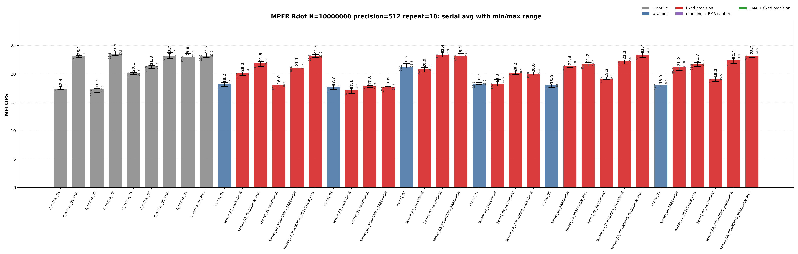
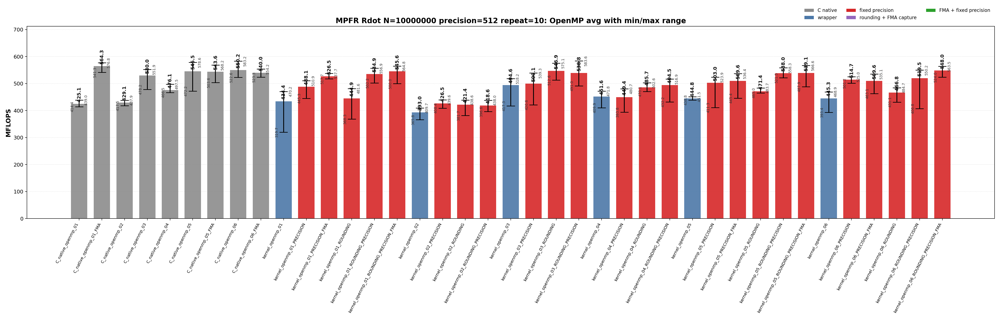
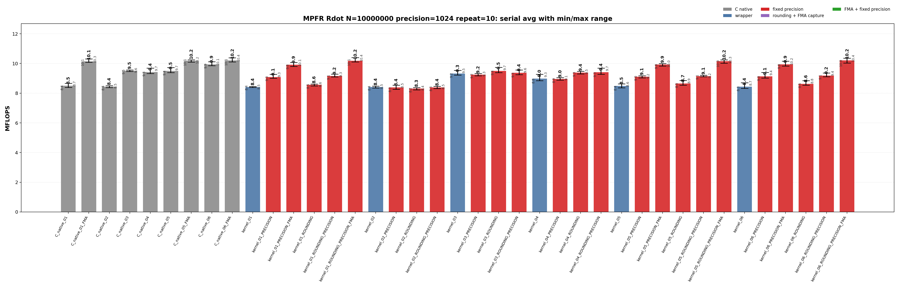
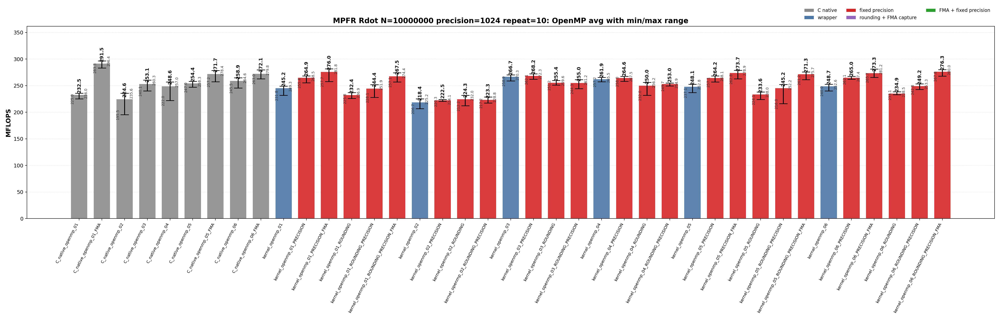

<!-- SPDX-License-Identifier: BSD-2-Clause -->

# 00_Rdot

This directory benchmarks the MPFR real dot product

```text
sum_i x_i * y_i
```

with raw MPFR C kernels and `mpfrxx::mpfr_class` wrapper kernels. The benchmark is organized like `benchmarks/mpfr/02_Rgemv`: numbered variants describe the source-level kernel shape, while suffixes describe source modifiers and build modifiers. The goal is to make temporary lifetime, rounding capture, FMA build options, fixed-precision assumptions, and OpenMP worker loops directly visible from the executable name and result class.

## Build

From the repository root:

```bash
cmake -S . -B build_bench_release -DCMAKE_BUILD_TYPE=Release
cmake --build build_bench_release -j
```

Executables are created under:

```text
build_bench_release/benchmarks/mpfr/00_Rdot/
```

Each executable takes `<vector size> <precision>`. Example:

```bash
build_bench_release/benchmarks/mpfr/00_Rdot/Rdot_mpfr_kernel_05_ROUNDING_PRECISION_FMA 10000000 512
```

The repeat runner uses the same source/build taxonomy:

```bash
OMP_NUM_THREADS=32 OMP_PLACES=cores OMP_PROC_BIND=spread \
    benchmarks/mpfr/00_Rdot/run_repeat.sh build_bench_release 10000000 512 10
```

MPFR Rdot wrapper targets omit a separate `mkII` implementation suffix because this directory has only the mkII wrapper implementation. The target suffixes separate source changes from build flags:

| Suffix | Kind | Meaning |
| --- | --- | --- |
| none | source baseline | Ordinary wrapper source for the numbered algorithm. |
| `ROUNDING` | source modifier | Captures `mpfrxx::evaluation_context` before the loop and uses `with_context` in the timed body. No compile-time flag is implied. |
| `PRECISION` | build modifier | Builds the same source with `GMPFRXX_MKII_FAST_FIXED_PREC`. |
| final `FMA` | build modifier | Builds the FMA-capturable source with `GMPFRXX_MKII_ENABLE_FMA`. |

The C native targets encode rounding and FMA directly in their source, so they do not split into `ROUNDING` and non-`ROUNDING` forms.

The cross-benchmark runner can execute the GMP and MPFR `00_Rdot`, `01_Raxpy`, and `02_Rgemv` suites for both standard precisions with one command:

```bash
OMP_NUM_THREADS=32 OMP_PLACES=cores OMP_PROC_BIND=spread \
    benchmarks/run_all.sh build_bench_release 512,1024 10 10000000 10000000 4000 4000
```

The second argument is a precision list. `both` and `all` are aliases for `512,1024`; a single value such as `512` still runs only that precision. Per-benchmark results are written to `results_raw/run_all_p512_repeat10_<timestamp>/` and `results_raw/run_all_p1024_repeat10_<timestamp>/` under each benchmark directory.

## Benchmark Parameters

| Parameter | Meaning |
| --- | --- |
| `N` | Number of vector elements. |
| `precision` | MPFR precision in bits for all input values and accumulators. |
| `repeat` | Number of timed process executions per executable. |
| `OMP_NUM_THREADS` | OpenMP worker count for `openmp` executables. |
| `OMP_PLACES`, `OMP_PROC_BIND` | OpenMP affinity controls used by the runner. |

The committed runs use `N=10000000`, `repeat=10`, `precision=512` and `precision=1024`, with `OMP_NUM_THREADS=32`, `OMP_PLACES=cores`, and `OMP_PROC_BIND=spread`.

## Variant Shapes

The timed body is `_Rdot()`. The numbered variant is written as a one-step transition: each row says what changed from the previous source shape and why that change is measured. `ROUNDING`, `PRECISION`, and final `FMA` suffixes modify the same numbered shape without changing the variant number.

| Variant | Transition from previous variant | Timed source shape | Temporary/resource policy | Purpose |
| --- | --- | --- | --- | --- |
| `01` | Starting point. | `acc += dx[i] * dy[i]` | Expression product is formed in the compound assignment. | Test the ET spelling. `FMA` builds can lower this source to one `mpfr_fma` call per element. |
| `02` | `01 -> 02`: force product materialization inside the loop. | `mpfr_class templ = dx[i] * dy[i]; acc += templ;` | Loop-local product object is constructed and destroyed inside every iteration. | Intentionally expensive control for temporary lifetime. |
| `03` | `02 -> 03`: move the product object outside the loop. | `templ = dx[i] * dy[i]; acc += templ;` | One product object is initialized before the loop and reused. | Main reusable-product split multiply/add wrapper shape. |
| `04` | `03 -> 04`: change product spelling to copy-then-multiply. | `templ = dx[i]; templ *= dy[i]; acc += templ;` | One product object is reused, but each iteration copies `dx[i]` before multiplication. | Separate product-object reuse from copy-then-multiply spelling. |
| `05` | `04 -> 05`: add accumulator unrolling and remove product materialization. | Four accumulators with direct `accN += dx[i+k] * dy[i+k]` updates. | No product object is materialized in the source. | FMA-capturable four-accumulator source. |
| `06` | `05 -> 06`: keep the direct-expression unrolled class for the second native FMA comparison point. | Four accumulators with direct `accN += dx[i+k] * dy[i+k]` updates. | No product object is materialized in the source. | Paired with `C_native_06_FMA`; expected to be in the same hot-loop class as `05`. |

Serial and OpenMP wrapper variants use the same numbering. OpenMP variants use per-thread partial accumulators and perform the final reduction outside the per-worker hot loop.

## Source Transitions

A variant number changes the source shape; suffixes then ask separate questions about rounding capture, FMA enablement, and fixed precision. For every numbered wrapper variant `01` through `06`, including the matching OpenMP variant, the generated wrapper target family is:

```text
<base>
<base>_PRECISION
<base>_ROUNDING
<base>_ROUNDING_PRECISION
```

`FMA` is a build modifier, not a separate source file. It is generated only for FMA-capturable source variants `01`, `05`, and `06`, always paired with fixed precision:

```text
<base>_PRECISION_FMA
<base>_ROUNDING_PRECISION_FMA
```

Variants `02` through `04` intentionally materialize product temporaries, so an FMA target for those source files would not measure the same source-level shape.

## C Native Equivalent Kernels

The mapping is based on the timed `_Rdot()` source shape and generated hot loop, not just on matching numeric suffixes. Raw C kernels encode rounding and FMA directly; wrapper kernels use suffixes to isolate those effects.

| C native kernel | Equivalent C++ wrapper kernel(s) | Equivalence basis |
| --- | --- | --- |
| `C_native_01` | closest to `kernel_02` | Legacy raw C loop-local product control. It is not the exact equivalent of wrapper `01` expression syntax. |
| `C_native_01_FMA` | `kernel_01_PRECISION_FMA`, `kernel_01_ROUNDING_PRECISION_FMA` | One `mpfr_fma` call per element when ET FMA capture succeeds. |
| `C_native_02` | `kernel_02`, `kernel_02_PRECISION`, `kernel_02_ROUNDING`, `kernel_02_ROUNDING_PRECISION` | Loop-local product object. |
| `C_native_03` | `kernel_03`, `kernel_03_PRECISION`, `kernel_03_ROUNDING`, `kernel_03_ROUNDING_PRECISION` | One reusable product object with split multiply/add. |
| `C_native_04` | `kernel_04`, `kernel_04_PRECISION`, `kernel_04_ROUNDING`, `kernel_04_ROUNDING_PRECISION` | Copy-then-multiply reusable product. |
| `C_native_05_FMA` | `kernel_05_PRECISION_FMA`, `kernel_05_ROUNDING_PRECISION_FMA` | Four accumulators with one direct `mpfr_fma`-class update per lane. |
| `C_native_06_FMA` | `kernel_06_PRECISION_FMA`, `kernel_06_ROUNDING_PRECISION_FMA` | Four accumulators with one direct `mpfr_fma`-class update per lane. |
| `C_native_openmp_NN` | `kernel_openmp_NN`, `kernel_openmp_NN_PRECISION`, `kernel_openmp_NN_ROUNDING`, `kernel_openmp_NN_ROUNDING_PRECISION` | Same OpenMP partitioning and non-FMA temporary policy as the raw C variant. |
| `C_native_openmp_NN_FMA` | `kernel_openmp_NN_PRECISION_FMA`, `kernel_openmp_NN_ROUNDING_PRECISION_FMA` for FMA-capable `NN` | Same OpenMP partitioning, with FMA-capturable wrapper source and FMA-enabled build. |

There is no exact raw C source equivalent for the non-FMA wrapper expression spelling `acc += dx[i] * dy[i]`; raw C must choose either split `mpfr_mul` plus `mpfr_add`, or fused `mpfr_fma`.

## Recorded Run

### 512-bit run

| Field | Value |
|-------|-------|
| Run ID | `rdot_mpfr_n10000000_p512_repeat10_20260525_090255` |
| Date | 2026-05-25 |
| CPU | AMD Ryzen Threadripper 3970X 32-Core Processor |
| OS | Linux 6.8.0-94-generic x86_64 |
| Compiler | `c++ (Ubuntu 15.2.0-16ubuntu1) 15.2.0` |
| Build type | Release |
| Problem size | `N=10000000` |
| Precision | 512 bits |
| Repeat count | 10 |
| OpenMP | `OMP_NUM_THREADS=32`, `OMP_PLACES=cores`, `OMP_PROC_BIND=spread` |
| Benchmark command | `OMP_NUM_THREADS=32 OMP_PLACES=cores OMP_PROC_BIND=spread benchmarks/mpfr/00_Rdot/run_repeat.sh build_bench_release 10000000 512 10` |
| Raw result directory | `benchmarks/mpfr/00_Rdot/results_raw/rdot_mpfr_n10000000_p512_repeat10_20260525_090255/` |
| Raw log | `benchmarks/mpfr/00_Rdot/results_raw/rdot_mpfr_n10000000_p512_repeat10_20260525_090255/benchmark_rdot_mpfr_n10000000_p512_repeat10.log` |
| Raw CSV | `benchmarks/mpfr/00_Rdot/results_raw/rdot_mpfr_n10000000_p512_repeat10_20260525_090255/raw_rdot_mpfr_n10000000_p512_repeat10.csv` |
| Summary CSV | `benchmarks/mpfr/00_Rdot/results_raw/rdot_mpfr_n10000000_p512_repeat10_20260525_090255/summary_rdot_mpfr_n10000000_p512_repeat10.csv` |
| Correctness | 780 / 780 runs reported `OK`. |





Plot regeneration command:

```bash
python3 benchmarks/mpfr/00_Rdot/plot_repeat_summary.py \
    benchmarks/mpfr/00_Rdot/results_raw/rdot_mpfr_n10000000_p512_repeat10_20260525_090255/benchmark_rdot_mpfr_n10000000_p512_repeat10.log \
    --output-dir benchmarks/mpfr/00_Rdot/results_raw/rdot_mpfr_n10000000_p512_repeat10_20260525_090255 \
    --output-prefix rdot_mpfr_n10000000_p512_repeat10 \
    --title-prefix "MPFR Rdot N=10000000 precision=512 repeat=10"
```

### 1024-bit run

| Field | Value |
|-------|-------|
| Run ID | `rdot_mpfr_n10000000_p1024_repeat10_20260525_123048` |
| Date | 2026-05-25 |
| CPU | AMD Ryzen Threadripper 3970X 32-Core Processor |
| OS | Linux 6.8.0-94-generic x86_64 |
| Compiler | `c++ (Ubuntu 15.2.0-16ubuntu1) 15.2.0` |
| Build type | Release |
| Problem size | `N=10000000` |
| Precision | 1024 bits |
| Repeat count | 10 |
| OpenMP | `OMP_NUM_THREADS=32`, `OMP_PLACES=cores`, `OMP_PROC_BIND=spread` |
| Benchmark command | `OMP_NUM_THREADS=32 OMP_PLACES=cores OMP_PROC_BIND=spread benchmarks/mpfr/00_Rdot/run_repeat.sh build_bench_release 10000000 1024 10` |
| Raw result directory | `benchmarks/mpfr/00_Rdot/results_raw/rdot_mpfr_n10000000_p1024_repeat10_20260525_123048/` |
| Raw log | `benchmarks/mpfr/00_Rdot/results_raw/rdot_mpfr_n10000000_p1024_repeat10_20260525_123048/benchmark_rdot_mpfr_n10000000_p1024_repeat10.log` |
| Raw CSV | `benchmarks/mpfr/00_Rdot/results_raw/rdot_mpfr_n10000000_p1024_repeat10_20260525_123048/raw_rdot_mpfr_n10000000_p1024_repeat10.csv` |
| Summary CSV | `benchmarks/mpfr/00_Rdot/results_raw/rdot_mpfr_n10000000_p1024_repeat10_20260525_123048/summary_rdot_mpfr_n10000000_p1024_repeat10.csv` |
| Correctness | 780 / 780 runs reported `OK`. |





Plot regeneration command:

```bash
python3 benchmarks/mpfr/00_Rdot/plot_repeat_summary.py \
    benchmarks/mpfr/00_Rdot/results_raw/rdot_mpfr_n10000000_p1024_repeat10_20260525_123048/benchmark_rdot_mpfr_n10000000_p1024_repeat10.log \
    --output-dir benchmarks/mpfr/00_Rdot/results_raw/rdot_mpfr_n10000000_p1024_repeat10_20260525_123048 \
    --output-prefix rdot_mpfr_n10000000_p1024_repeat10 \
    --title-prefix "MPFR Rdot N=10000000 precision=1024 repeat=10"
```

## Resource or Bandwidth Estimates

The values below are static model estimates derived from benchmark MFLOPS, not hardware-counter measurements. The MPFR model assumes a 32-byte `mpfr_t` header, 64-bit limbs, and active limb bytes from `ceil(precision / 64)`. It counts two input objects per Rdot iteration and excludes allocator metadata, cache-line overfetch, accumulator writes, instruction fetch, MPFR internal temporaries, pointer-chase latency, and OpenMP reduction traffic.

| Case | Representative best-avg variant | Avg MFLOPS | Active bytes/iter | Header-inclusive bytes/iter | Active GB/s | Header-inclusive GB/s |
| --- | --- | --- | --- | --- | --- | --- |
| 512-bit serial | `C_native_03` | 23.507 | 128 | 192 | 1.504 | 2.257 |
| 512-bit openmp | `C_native_openmp_01_FMA` | 564.268 | 128 | 192 | 36.113 | 54.170 |
| 1024-bit serial | `kernel_06_ROUNDING_PRECISION_FMA` | 10.209 | 256 | 320 | 1.307 | 1.633 |
| 1024-bit openmp | `C_native_openmp_01_FMA` | 291.529 | 256 | 320 | 37.316 | 46.645 |

## Headline Results

| Observation | Variant | Max MFLOPS | Avg MFLOPS | Interpretation |
| --- | --- | --- | --- | --- |
| 512-bit serial best average | `C_native_03` | 23.846 | 23.507 | Raw MPFR C split multiply/add or reusable-temporary reference. |
| 512-bit openmp best average | `C_native_openmp_01_FMA` | 576.832 | 564.268 | Raw MPFR C FMA reference; one fused backend update in the hot loop where the source shape allows it. |
| 1024-bit serial best average | `kernel_06_ROUNDING_PRECISION_FMA` | 10.362 | 10.209 | Wrapper source captures context and builds with fixed precision plus FMA; intended to remove lookup/check overhead and fuse the update. |
| 1024-bit openmp best average | `C_native_openmp_01_FMA` | 296.435 | 291.529 | Raw MPFR C FMA reference; one fused backend update in the hot loop where the source shape allows it. |

## Serial Results

### 512-bit serial interpretation

| Observation | Variant | Max MFLOPS | Avg MFLOPS | Min MFLOPS | Interpretation |
| --- | --- | --- | --- | --- | --- |
| Best raw C serial avg | `C_native_03` | 23.846 | 23.507 | 23.221 | Raw C reference class for this precision. |
| Best wrapper serial avg | `kernel_05_ROUNDING_PRECISION_FMA` | 24.031 | 23.393 | 22.932 | Best wrapper source/build class. |
| Best serial max | `kernel_05_ROUNDING_PRECISION_FMA` | 24.031 | 23.393 | 22.932 | Single fastest repeat; useful for class boundary only. |
| Best FMA serial avg | `kernel_05_ROUNDING_PRECISION_FMA` | 24.031 | 23.393 | 22.932 | FMA-capable class; compares against split multiply/add variants. |

<details>
<summary>512-bit serial results sorted by Max MFLOPS</summary>

| Rank | Variant | Max MFLOPS | Avg MFLOPS | Min MFLOPS |
| --- | --- | --- | --- | --- |
| 1 | `kernel_05_ROUNDING_PRECISION_FMA` | 24.031 | 23.393 | 22.932 |
| 2 | `kernel_06_ROUNDING_PRECISION_FMA` | 24.012 | 23.231 | 22.916 |
| 3 | `kernel_03_ROUNDING` | 23.882 | 23.377 | 22.959 |
| 4 | `C_native_03` | 23.846 | 23.507 | 23.221 |
| 5 | `C_native_05_FMA` | 23.730 | 23.210 | 22.706 |
| 6 | `C_native_06_FMA` | 23.649 | 23.189 | 22.921 |
| 7 | `kernel_03_ROUNDING_PRECISION` | 23.631 | 23.147 | 22.797 |
| 8 | `C_native_06` | 23.598 | 22.961 | 22.624 |
| 9 | `kernel_01_ROUNDING_PRECISION_FMA` | 23.459 | 23.187 | 22.881 |
| 10 | `C_native_01_FMA` | 23.243 | 23.112 | 22.876 |
| 11 | `kernel_06_ROUNDING_PRECISION` | 22.972 | 22.366 | 21.878 |
| 12 | `kernel_05_ROUNDING_PRECISION` | 22.448 | 22.287 | 21.750 |
| 13 | `kernel_01_PRECISION_FMA` | 22.215 | 21.916 | 21.306 |
| 14 | `kernel_06_PRECISION_FMA` | 22.041 | 21.710 | 21.281 |
| 15 | `kernel_05_PRECISION_FMA` | 22.008 | 21.700 | 21.375 |
| 16 | `kernel_03` | 21.804 | 21.287 | 21.077 |
| 17 | `kernel_06_PRECISION` | 21.779 | 21.151 | 20.646 |
| 18 | `kernel_05_PRECISION` | 21.773 | 21.352 | 21.175 |
| 19 | `C_native_05` | 21.488 | 21.317 | 20.931 |
| 20 | `kernel_01_ROUNDING_PRECISION` | 21.422 | 21.101 | 20.866 |
| 21 | `kernel_03_PRECISION` | 21.159 | 20.875 | 20.368 |
| 22 | `kernel_04_ROUNDING` | 20.510 | 20.158 | 19.948 |
| 23 | `kernel_01_PRECISION` | 20.396 | 20.165 | 19.698 |
| 24 | `kernel_04_ROUNDING_PRECISION` | 20.372 | 20.035 | 19.841 |
| 25 | `C_native_04` | 20.279 | 20.112 | 19.913 |
| 26 | `kernel_06_ROUNDING` | 19.502 | 19.174 | 18.699 |
| 27 | `kernel_05_ROUNDING` | 19.440 | 19.198 | 19.027 |
| 28 | `kernel_04_PRECISION` | 19.013 | 18.255 | 17.885 |
| 29 | `kernel_06` | 18.566 | 18.028 | 17.731 |
| 30 | `kernel_01` | 18.534 | 18.223 | 17.819 |
| 31 | `kernel_04` | 18.521 | 18.299 | 18.145 |
| 32 | `kernel_05` | 18.230 | 18.023 | 17.649 |
| 33 | `kernel_01_ROUNDING` | 18.214 | 17.976 | 17.678 |
| 34 | `kernel_02` | 18.111 | 17.680 | 17.300 |
| 35 | `kernel_02_ROUNDING` | 17.950 | 17.815 | 17.599 |
| 36 | `C_native_01` | 17.833 | 17.374 | 17.263 |
| 37 | `kernel_02_ROUNDING_PRECISION` | 17.750 | 17.627 | 17.306 |
| 38 | `kernel_02_PRECISION` | 17.739 | 17.128 | 16.594 |
| 39 | `C_native_02` | 17.473 | 17.275 | 16.732 |

</details>

<details>
<summary>512-bit serial results sorted by Avg MFLOPS</summary>

| Rank | Variant | Max MFLOPS | Avg MFLOPS | Min MFLOPS |
| --- | --- | --- | --- | --- |
| 1 | `C_native_03` | 23.846 | 23.507 | 23.221 |
| 2 | `kernel_05_ROUNDING_PRECISION_FMA` | 24.031 | 23.393 | 22.932 |
| 3 | `kernel_03_ROUNDING` | 23.882 | 23.377 | 22.959 |
| 4 | `kernel_06_ROUNDING_PRECISION_FMA` | 24.012 | 23.231 | 22.916 |
| 5 | `C_native_05_FMA` | 23.730 | 23.210 | 22.706 |
| 6 | `C_native_06_FMA` | 23.649 | 23.189 | 22.921 |
| 7 | `kernel_01_ROUNDING_PRECISION_FMA` | 23.459 | 23.187 | 22.881 |
| 8 | `kernel_03_ROUNDING_PRECISION` | 23.631 | 23.147 | 22.797 |
| 9 | `C_native_01_FMA` | 23.243 | 23.112 | 22.876 |
| 10 | `C_native_06` | 23.598 | 22.961 | 22.624 |
| 11 | `kernel_06_ROUNDING_PRECISION` | 22.972 | 22.366 | 21.878 |
| 12 | `kernel_05_ROUNDING_PRECISION` | 22.448 | 22.287 | 21.750 |
| 13 | `kernel_01_PRECISION_FMA` | 22.215 | 21.916 | 21.306 |
| 14 | `kernel_06_PRECISION_FMA` | 22.041 | 21.710 | 21.281 |
| 15 | `kernel_05_PRECISION_FMA` | 22.008 | 21.700 | 21.375 |
| 16 | `kernel_05_PRECISION` | 21.773 | 21.352 | 21.175 |
| 17 | `C_native_05` | 21.488 | 21.317 | 20.931 |
| 18 | `kernel_03` | 21.804 | 21.287 | 21.077 |
| 19 | `kernel_06_PRECISION` | 21.779 | 21.151 | 20.646 |
| 20 | `kernel_01_ROUNDING_PRECISION` | 21.422 | 21.101 | 20.866 |
| 21 | `kernel_03_PRECISION` | 21.159 | 20.875 | 20.368 |
| 22 | `kernel_01_PRECISION` | 20.396 | 20.165 | 19.698 |
| 23 | `kernel_04_ROUNDING` | 20.510 | 20.158 | 19.948 |
| 24 | `C_native_04` | 20.279 | 20.112 | 19.913 |
| 25 | `kernel_04_ROUNDING_PRECISION` | 20.372 | 20.035 | 19.841 |
| 26 | `kernel_05_ROUNDING` | 19.440 | 19.198 | 19.027 |
| 27 | `kernel_06_ROUNDING` | 19.502 | 19.174 | 18.699 |
| 28 | `kernel_04` | 18.521 | 18.299 | 18.145 |
| 29 | `kernel_04_PRECISION` | 19.013 | 18.255 | 17.885 |
| 30 | `kernel_01` | 18.534 | 18.223 | 17.819 |
| 31 | `kernel_06` | 18.566 | 18.028 | 17.731 |
| 32 | `kernel_05` | 18.230 | 18.023 | 17.649 |
| 33 | `kernel_01_ROUNDING` | 18.214 | 17.976 | 17.678 |
| 34 | `kernel_02_ROUNDING` | 17.950 | 17.815 | 17.599 |
| 35 | `kernel_02` | 18.111 | 17.680 | 17.300 |
| 36 | `kernel_02_ROUNDING_PRECISION` | 17.750 | 17.627 | 17.306 |
| 37 | `C_native_01` | 17.833 | 17.374 | 17.263 |
| 38 | `C_native_02` | 17.473 | 17.275 | 16.732 |
| 39 | `kernel_02_PRECISION` | 17.739 | 17.128 | 16.594 |

</details>

### 1024-bit serial interpretation

| Observation | Variant | Max MFLOPS | Avg MFLOPS | Min MFLOPS | Interpretation |
| --- | --- | --- | --- | --- | --- |
| Best raw C serial avg | `C_native_06_FMA` | 10.386 | 10.208 | 10.111 | Raw C reference class for this precision. |
| Best wrapper serial avg | `kernel_06_ROUNDING_PRECISION_FMA` | 10.362 | 10.209 | 10.032 | Best wrapper source/build class. |
| Best serial max | `kernel_01_ROUNDING_PRECISION_FMA` | 10.396 | 10.181 | 10.104 | Single fastest repeat; useful for class boundary only. |
| Best FMA serial avg | `kernel_06_ROUNDING_PRECISION_FMA` | 10.362 | 10.209 | 10.032 | FMA-capable class; compares against split multiply/add variants. |

<details>
<summary>1024-bit serial results sorted by Max MFLOPS</summary>

| Rank | Variant | Max MFLOPS | Avg MFLOPS | Min MFLOPS |
| --- | --- | --- | --- | --- |
| 1 | `kernel_01_ROUNDING_PRECISION_FMA` | 10.396 | 10.181 | 10.104 |
| 2 | `C_native_06_FMA` | 10.386 | 10.208 | 10.111 |
| 3 | `kernel_06_ROUNDING_PRECISION_FMA` | 10.362 | 10.209 | 10.032 |
| 4 | `C_native_01_FMA` | 10.308 | 10.142 | 10.085 |
| 5 | `kernel_05_ROUNDING_PRECISION_FMA` | 10.252 | 10.152 | 10.014 |
| 6 | `C_native_05_FMA` | 10.242 | 10.179 | 10.095 |
| 7 | `kernel_06_PRECISION_FMA` | 10.159 | 9.948 | 9.831 |
| 8 | `C_native_06` | 10.120 | 9.940 | 9.851 |
| 9 | `kernel_01_PRECISION_FMA` | 10.072 | 9.918 | 9.801 |
| 10 | `kernel_05_PRECISION_FMA` | 9.998 | 9.933 | 9.832 |
| 11 | `kernel_03_ROUNDING` | 9.740 | 9.505 | 9.392 |
| 12 | `C_native_05` | 9.727 | 9.506 | 9.388 |
| 13 | `kernel_04_ROUNDING_PRECISION` | 9.688 | 9.411 | 9.273 |
| 14 | `C_native_04` | 9.687 | 9.423 | 9.326 |
| 15 | `C_native_03` | 9.568 | 9.516 | 9.466 |
| 16 | `kernel_03_ROUNDING_PRECISION` | 9.561 | 9.371 | 9.251 |
| 17 | `kernel_03` | 9.534 | 9.320 | 9.219 |
| 18 | `kernel_04_ROUNDING` | 9.479 | 9.388 | 9.300 |
| 19 | `kernel_06_PRECISION` | 9.395 | 9.135 | 9.021 |
| 20 | `kernel_06_ROUNDING_PRECISION` | 9.359 | 9.188 | 9.106 |
| 21 | `kernel_03_PRECISION` | 9.325 | 9.242 | 9.178 |
| 22 | `kernel_01_ROUNDING_PRECISION` | 9.286 | 9.162 | 9.096 |
| 23 | `kernel_01_PRECISION` | 9.275 | 9.083 | 9.008 |
| 24 | `kernel_04` | 9.275 | 8.983 | 8.840 |
| 25 | `kernel_05_ROUNDING_PRECISION` | 9.205 | 9.148 | 9.113 |
| 26 | `kernel_05_PRECISION` | 9.166 | 9.106 | 9.035 |
| 27 | `kernel_04_PRECISION` | 9.051 | 8.960 | 8.881 |
| 28 | `kernel_05_ROUNDING` | 8.855 | 8.652 | 8.546 |
| 29 | `kernel_06_ROUNDING` | 8.844 | 8.633 | 8.537 |
| 30 | `kernel_06` | 8.703 | 8.443 | 8.325 |
| 31 | `C_native_01` | 8.666 | 8.499 | 8.388 |
| 32 | `kernel_05` | 8.631 | 8.495 | 8.361 |
| 33 | `kernel_01_ROUNDING` | 8.620 | 8.561 | 8.486 |
| 34 | `kernel_02_PRECISION` | 8.537 | 8.392 | 8.262 |
| 35 | `C_native_02` | 8.509 | 8.439 | 8.374 |
| 36 | `kernel_02` | 8.480 | 8.412 | 8.356 |
| 37 | `kernel_02_ROUNDING_PRECISION` | 8.466 | 8.390 | 8.318 |
| 38 | `kernel_01` | 8.454 | 8.416 | 8.382 |
| 39 | `kernel_02_ROUNDING` | 8.376 | 8.317 | 8.230 |

</details>

<details>
<summary>1024-bit serial results sorted by Avg MFLOPS</summary>

| Rank | Variant | Max MFLOPS | Avg MFLOPS | Min MFLOPS |
| --- | --- | --- | --- | --- |
| 1 | `kernel_06_ROUNDING_PRECISION_FMA` | 10.362 | 10.209 | 10.032 |
| 2 | `C_native_06_FMA` | 10.386 | 10.208 | 10.111 |
| 3 | `kernel_01_ROUNDING_PRECISION_FMA` | 10.396 | 10.181 | 10.104 |
| 4 | `C_native_05_FMA` | 10.242 | 10.179 | 10.095 |
| 5 | `kernel_05_ROUNDING_PRECISION_FMA` | 10.252 | 10.152 | 10.014 |
| 6 | `C_native_01_FMA` | 10.308 | 10.142 | 10.085 |
| 7 | `kernel_06_PRECISION_FMA` | 10.159 | 9.948 | 9.831 |
| 8 | `C_native_06` | 10.120 | 9.940 | 9.851 |
| 9 | `kernel_05_PRECISION_FMA` | 9.998 | 9.933 | 9.832 |
| 10 | `kernel_01_PRECISION_FMA` | 10.072 | 9.918 | 9.801 |
| 11 | `C_native_03` | 9.568 | 9.516 | 9.466 |
| 12 | `C_native_05` | 9.727 | 9.506 | 9.388 |
| 13 | `kernel_03_ROUNDING` | 9.740 | 9.505 | 9.392 |
| 14 | `C_native_04` | 9.687 | 9.423 | 9.326 |
| 15 | `kernel_04_ROUNDING_PRECISION` | 9.688 | 9.411 | 9.273 |
| 16 | `kernel_04_ROUNDING` | 9.479 | 9.388 | 9.300 |
| 17 | `kernel_03_ROUNDING_PRECISION` | 9.561 | 9.371 | 9.251 |
| 18 | `kernel_03` | 9.534 | 9.320 | 9.219 |
| 19 | `kernel_03_PRECISION` | 9.325 | 9.242 | 9.178 |
| 20 | `kernel_06_ROUNDING_PRECISION` | 9.359 | 9.188 | 9.106 |
| 21 | `kernel_01_ROUNDING_PRECISION` | 9.286 | 9.162 | 9.096 |
| 22 | `kernel_05_ROUNDING_PRECISION` | 9.205 | 9.148 | 9.113 |
| 23 | `kernel_06_PRECISION` | 9.395 | 9.135 | 9.021 |
| 24 | `kernel_05_PRECISION` | 9.166 | 9.106 | 9.035 |
| 25 | `kernel_01_PRECISION` | 9.275 | 9.083 | 9.008 |
| 26 | `kernel_04` | 9.275 | 8.983 | 8.840 |
| 27 | `kernel_04_PRECISION` | 9.051 | 8.960 | 8.881 |
| 28 | `kernel_05_ROUNDING` | 8.855 | 8.652 | 8.546 |
| 29 | `kernel_06_ROUNDING` | 8.844 | 8.633 | 8.537 |
| 30 | `kernel_01_ROUNDING` | 8.620 | 8.561 | 8.486 |
| 31 | `C_native_01` | 8.666 | 8.499 | 8.388 |
| 32 | `kernel_05` | 8.631 | 8.495 | 8.361 |
| 33 | `kernel_06` | 8.703 | 8.443 | 8.325 |
| 34 | `C_native_02` | 8.509 | 8.439 | 8.374 |
| 35 | `kernel_01` | 8.454 | 8.416 | 8.382 |
| 36 | `kernel_02` | 8.480 | 8.412 | 8.356 |
| 37 | `kernel_02_PRECISION` | 8.537 | 8.392 | 8.262 |
| 38 | `kernel_02_ROUNDING_PRECISION` | 8.466 | 8.390 | 8.318 |
| 39 | `kernel_02_ROUNDING` | 8.376 | 8.317 | 8.230 |

</details>

## OpenMP Results

### 512-bit OpenMP interpretation

| Observation | Variant | Max MFLOPS | Avg MFLOPS | Min MFLOPS | Interpretation |
| --- | --- | --- | --- | --- | --- |
| Best raw C OpenMP avg | `C_native_openmp_01_FMA` | 576.832 | 564.268 | 541.315 | Raw C OpenMP reference class. |
| Best wrapper OpenMP avg | `kernel_openmp_06_ROUNDING_PRECISION_FMA` | 563.547 | 548.041 | 523.953 | Best wrapper OpenMP source/build class. |
| Best OpenMP max | `kernel_openmp_03_ROUNDING_PRECISION` | 583.648 | 538.835 | 490.994 | Single fastest OpenMP repeat; average is more stable. |
| Best FMA OpenMP avg | `C_native_openmp_01_FMA` | 576.832 | 564.268 | 541.315 | FMA-capable OpenMP class. |

<details>
<summary>512-bit OpenMP results sorted by Max MFLOPS</summary>

| Rank | Variant | Max MFLOPS | Avg MFLOPS | Min MFLOPS |
| --- | --- | --- | --- | --- |
| 1 | `kernel_openmp_03_ROUNDING_PRECISION` | 583.648 | 538.835 | 490.994 |
| 2 | `C_native_openmp_06` | 583.170 | 550.178 | 522.573 |
| 3 | `C_native_openmp_05` | 578.623 | 545.506 | 472.223 |
| 4 | `C_native_openmp_01_FMA` | 576.832 | 564.268 | 541.315 |
| 5 | `kernel_openmp_03_ROUNDING` | 575.135 | 546.873 | 512.574 |
| 6 | `C_native_openmp_05_FMA` | 568.225 | 543.552 | 503.632 |
| 7 | `kernel_openmp_05_ROUNDING_PRECISION_FMA` | 566.589 | 539.070 | 487.906 |
| 8 | `kernel_openmp_01_ROUNDING_PRECISION_FMA` | 564.776 | 545.603 | 499.973 |
| 9 | `kernel_openmp_06_ROUNDING_PRECISION_FMA` | 563.547 | 548.041 | 523.953 |
| 10 | `kernel_openmp_05_ROUNDING_PRECISION` | 558.272 | 537.994 | 521.528 |
| 11 | `kernel_openmp_01_ROUNDING_PRECISION` | 556.948 | 534.937 | 502.216 |
| 12 | `C_native_openmp_06_FMA` | 554.163 | 539.959 | 523.347 |
| 13 | `C_native_openmp_03` | 551.911 | 530.037 | 478.228 |
| 14 | `kernel_openmp_06_ROUNDING_PRECISION` | 550.242 | 519.455 | 406.827 |
| 15 | `kernel_openmp_03_PRECISION` | 539.292 | 500.061 | 420.610 |
| 16 | `kernel_openmp_01_PRECISION_FMA` | 537.667 | 526.511 | 517.685 |
| 17 | `kernel_openmp_05_PRECISION_FMA` | 536.447 | 509.619 | 445.441 |
| 18 | `kernel_openmp_06_PRECISION_FMA` | 535.140 | 509.624 | 463.051 |
| 19 | `kernel_openmp_06_PRECISION` | 525.015 | 514.746 | 501.238 |
| 20 | `kernel_openmp_05_PRECISION` | 523.909 | 502.957 | 411.276 |
| 21 | `kernel_openmp_03` | 518.208 | 494.602 | 417.301 |
| 22 | `kernel_openmp_04_ROUNDING_PRECISION` | 516.888 | 494.547 | 432.183 |
| 23 | `kernel_openmp_01_PRECISION` | 510.880 | 488.131 | 445.312 |
| 24 | `kernel_openmp_04_ROUNDING` | 502.603 | 485.721 | 470.080 |
| 25 | `C_native_openmp_04` | 497.496 | 476.112 | 466.491 |
| 26 | `kernel_openmp_06_ROUNDING` | 484.680 | 466.818 | 431.129 |
| 27 | `kernel_openmp_05_ROUNDING` | 483.714 | 471.376 | 464.994 |
| 28 | `kernel_openmp_01_ROUNDING` | 481.586 | 444.934 | 368.349 |
| 29 | `kernel_openmp_04_PRECISION` | 480.704 | 449.372 | 393.781 |
| 30 | `kernel_openmp_04` | 471.835 | 451.627 | 409.926 |
| 31 | `kernel_openmp_01` | 470.213 | 434.399 | 319.656 |
| 32 | `kernel_openmp_06` | 468.897 | 445.277 | 393.448 |
| 33 | `kernel_openmp_05` | 451.481 | 444.785 | 438.796 |
| 34 | `kernel_openmp_02_PRECISION` | 439.554 | 426.484 | 408.426 |
| 35 | `C_native_openmp_01` | 439.010 | 425.076 | 414.381 |
| 36 | `kernel_openmp_02_ROUNDING` | 438.575 | 421.433 | 381.668 |
| 37 | `kernel_openmp_02_ROUNDING_PRECISION` | 438.027 | 418.649 | 396.602 |
| 38 | `C_native_openmp_02` | 437.908 | 429.125 | 417.540 |
| 39 | `kernel_openmp_02` | 409.678 | 393.033 | 365.796 |

</details>

<details>
<summary>512-bit OpenMP results sorted by Avg MFLOPS</summary>

| Rank | Variant | Max MFLOPS | Avg MFLOPS | Min MFLOPS |
| --- | --- | --- | --- | --- |
| 1 | `C_native_openmp_01_FMA` | 576.832 | 564.268 | 541.315 |
| 2 | `C_native_openmp_06` | 583.170 | 550.178 | 522.573 |
| 3 | `kernel_openmp_06_ROUNDING_PRECISION_FMA` | 563.547 | 548.041 | 523.953 |
| 4 | `kernel_openmp_03_ROUNDING` | 575.135 | 546.873 | 512.574 |
| 5 | `kernel_openmp_01_ROUNDING_PRECISION_FMA` | 564.776 | 545.603 | 499.973 |
| 6 | `C_native_openmp_05` | 578.623 | 545.506 | 472.223 |
| 7 | `C_native_openmp_05_FMA` | 568.225 | 543.552 | 503.632 |
| 8 | `C_native_openmp_06_FMA` | 554.163 | 539.959 | 523.347 |
| 9 | `kernel_openmp_05_ROUNDING_PRECISION_FMA` | 566.589 | 539.070 | 487.906 |
| 10 | `kernel_openmp_03_ROUNDING_PRECISION` | 583.648 | 538.835 | 490.994 |
| 11 | `kernel_openmp_05_ROUNDING_PRECISION` | 558.272 | 537.994 | 521.528 |
| 12 | `kernel_openmp_01_ROUNDING_PRECISION` | 556.948 | 534.937 | 502.216 |
| 13 | `C_native_openmp_03` | 551.911 | 530.037 | 478.228 |
| 14 | `kernel_openmp_01_PRECISION_FMA` | 537.667 | 526.511 | 517.685 |
| 15 | `kernel_openmp_06_ROUNDING_PRECISION` | 550.242 | 519.455 | 406.827 |
| 16 | `kernel_openmp_06_PRECISION` | 525.015 | 514.746 | 501.238 |
| 17 | `kernel_openmp_06_PRECISION_FMA` | 535.140 | 509.624 | 463.051 |
| 18 | `kernel_openmp_05_PRECISION_FMA` | 536.447 | 509.619 | 445.441 |
| 19 | `kernel_openmp_05_PRECISION` | 523.909 | 502.957 | 411.276 |
| 20 | `kernel_openmp_03_PRECISION` | 539.292 | 500.061 | 420.610 |
| 21 | `kernel_openmp_03` | 518.208 | 494.602 | 417.301 |
| 22 | `kernel_openmp_04_ROUNDING_PRECISION` | 516.888 | 494.547 | 432.183 |
| 23 | `kernel_openmp_01_PRECISION` | 510.880 | 488.131 | 445.312 |
| 24 | `kernel_openmp_04_ROUNDING` | 502.603 | 485.721 | 470.080 |
| 25 | `C_native_openmp_04` | 497.496 | 476.112 | 466.491 |
| 26 | `kernel_openmp_05_ROUNDING` | 483.714 | 471.376 | 464.994 |
| 27 | `kernel_openmp_06_ROUNDING` | 484.680 | 466.818 | 431.129 |
| 28 | `kernel_openmp_04` | 471.835 | 451.627 | 409.926 |
| 29 | `kernel_openmp_04_PRECISION` | 480.704 | 449.372 | 393.781 |
| 30 | `kernel_openmp_06` | 468.897 | 445.277 | 393.448 |
| 31 | `kernel_openmp_01_ROUNDING` | 481.586 | 444.934 | 368.349 |
| 32 | `kernel_openmp_05` | 451.481 | 444.785 | 438.796 |
| 33 | `kernel_openmp_01` | 470.213 | 434.399 | 319.656 |
| 34 | `C_native_openmp_02` | 437.908 | 429.125 | 417.540 |
| 35 | `kernel_openmp_02_PRECISION` | 439.554 | 426.484 | 408.426 |
| 36 | `C_native_openmp_01` | 439.010 | 425.076 | 414.381 |
| 37 | `kernel_openmp_02_ROUNDING` | 438.575 | 421.433 | 381.668 |
| 38 | `kernel_openmp_02_ROUNDING_PRECISION` | 438.027 | 418.649 | 396.602 |
| 39 | `kernel_openmp_02` | 409.678 | 393.033 | 365.796 |

</details>

### 1024-bit OpenMP interpretation

| Observation | Variant | Max MFLOPS | Avg MFLOPS | Min MFLOPS | Interpretation |
| --- | --- | --- | --- | --- | --- |
| Best raw C OpenMP avg | `C_native_openmp_01_FMA` | 296.435 | 291.529 | 283.255 | Raw C OpenMP reference class. |
| Best wrapper OpenMP avg | `kernel_openmp_06_ROUNDING_PRECISION_FMA` | 280.008 | 276.299 | 267.776 | Best wrapper OpenMP source/build class. |
| Best OpenMP max | `C_native_openmp_01_FMA` | 296.435 | 291.529 | 283.255 | Single fastest OpenMP repeat; average is more stable. |
| Best FMA OpenMP avg | `C_native_openmp_01_FMA` | 296.435 | 291.529 | 283.255 | FMA-capable OpenMP class. |

<details>
<summary>1024-bit OpenMP results sorted by Max MFLOPS</summary>

| Rank | Variant | Max MFLOPS | Avg MFLOPS | Min MFLOPS |
| --- | --- | --- | --- | --- |
| 1 | `C_native_openmp_01_FMA` | 296.435 | 291.529 | 283.255 |
| 2 | `kernel_openmp_01_PRECISION_FMA` | 281.805 | 275.982 | 257.652 |
| 3 | `kernel_openmp_06_PRECISION_FMA` | 281.193 | 273.252 | 265.669 |
| 4 | `kernel_openmp_06_ROUNDING_PRECISION_FMA` | 280.008 | 276.299 | 267.776 |
| 5 | `C_native_openmp_06_FMA` | 279.809 | 272.073 | 262.957 |
| 6 | `kernel_openmp_05_PRECISION_FMA` | 278.911 | 273.715 | 262.759 |
| 7 | `C_native_openmp_05_FMA` | 278.350 | 271.697 | 257.242 |
| 8 | `kernel_openmp_05_ROUNDING_PRECISION_FMA` | 275.661 | 271.331 | 261.171 |
| 9 | `kernel_openmp_01_ROUNDING_PRECISION_FMA` | 274.389 | 267.486 | 257.087 |
| 10 | `kernel_openmp_03_PRECISION` | 272.314 | 268.247 | 262.082 |
| 11 | `kernel_openmp_03` | 270.260 | 266.661 | 258.882 |
| 12 | `kernel_openmp_01_PRECISION` | 268.463 | 264.902 | 255.405 |
| 13 | `kernel_openmp_05_PRECISION` | 268.141 | 264.235 | 257.086 |
| 14 | `kernel_openmp_04_PRECISION` | 267.493 | 264.584 | 258.027 |
| 15 | `kernel_openmp_06_PRECISION` | 267.449 | 264.975 | 262.140 |
| 16 | `kernel_openmp_04` | 265.508 | 261.885 | 257.240 |
| 17 | `C_native_openmp_06` | 264.642 | 258.928 | 245.463 |
| 18 | `kernel_openmp_03_ROUNDING_PRECISION` | 261.187 | 254.998 | 244.279 |
| 19 | `C_native_openmp_03` | 260.340 | 253.114 | 240.122 |
| 20 | `kernel_openmp_03_ROUNDING` | 259.555 | 255.408 | 251.228 |
| 21 | `C_native_openmp_05` | 258.261 | 254.355 | 246.977 |
| 22 | `C_native_openmp_04` | 256.989 | 248.591 | 222.024 |
| 23 | `kernel_openmp_04_ROUNDING` | 256.180 | 249.963 | 232.036 |
| 24 | `kernel_openmp_04_ROUNDING_PRECISION` | 254.942 | 252.957 | 249.655 |
| 25 | `kernel_openmp_06_ROUNDING_PRECISION` | 253.275 | 249.192 | 242.834 |
| 26 | `kernel_openmp_05` | 252.842 | 248.074 | 237.090 |
| 27 | `kernel_openmp_06` | 252.638 | 248.663 | 239.984 |
| 28 | `kernel_openmp_05_ROUNDING_PRECISION` | 252.189 | 245.178 | 216.011 |
| 29 | `kernel_openmp_01_ROUNDING_PRECISION` | 251.864 | 244.428 | 228.111 |
| 30 | `kernel_openmp_01` | 249.275 | 245.162 | 231.778 |
| 31 | `kernel_openmp_06_ROUNDING` | 238.460 | 234.892 | 233.142 |
| 32 | `kernel_openmp_05_ROUNDING` | 237.951 | 233.553 | 224.057 |
| 33 | `kernel_openmp_01_ROUNDING` | 236.886 | 232.414 | 225.793 |
| 34 | `C_native_openmp_01` | 235.959 | 232.452 | 225.009 |
| 35 | `C_native_openmp_02` | 235.634 | 224.590 | 195.543 |
| 36 | `kernel_openmp_02_ROUNDING` | 231.999 | 224.283 | 212.186 |
| 37 | `kernel_openmp_02_ROUNDING_PRECISION` | 228.769 | 223.294 | 217.201 |
| 38 | `kernel_openmp_02` | 225.169 | 218.410 | 206.706 |
| 39 | `kernel_openmp_02_PRECISION` | 224.137 | 222.517 | 220.321 |

</details>

<details>
<summary>1024-bit OpenMP results sorted by Avg MFLOPS</summary>

| Rank | Variant | Max MFLOPS | Avg MFLOPS | Min MFLOPS |
| --- | --- | --- | --- | --- |
| 1 | `C_native_openmp_01_FMA` | 296.435 | 291.529 | 283.255 |
| 2 | `kernel_openmp_06_ROUNDING_PRECISION_FMA` | 280.008 | 276.299 | 267.776 |
| 3 | `kernel_openmp_01_PRECISION_FMA` | 281.805 | 275.982 | 257.652 |
| 4 | `kernel_openmp_05_PRECISION_FMA` | 278.911 | 273.715 | 262.759 |
| 5 | `kernel_openmp_06_PRECISION_FMA` | 281.193 | 273.252 | 265.669 |
| 6 | `C_native_openmp_06_FMA` | 279.809 | 272.073 | 262.957 |
| 7 | `C_native_openmp_05_FMA` | 278.350 | 271.697 | 257.242 |
| 8 | `kernel_openmp_05_ROUNDING_PRECISION_FMA` | 275.661 | 271.331 | 261.171 |
| 9 | `kernel_openmp_03_PRECISION` | 272.314 | 268.247 | 262.082 |
| 10 | `kernel_openmp_01_ROUNDING_PRECISION_FMA` | 274.389 | 267.486 | 257.087 |
| 11 | `kernel_openmp_03` | 270.260 | 266.661 | 258.882 |
| 12 | `kernel_openmp_06_PRECISION` | 267.449 | 264.975 | 262.140 |
| 13 | `kernel_openmp_01_PRECISION` | 268.463 | 264.902 | 255.405 |
| 14 | `kernel_openmp_04_PRECISION` | 267.493 | 264.584 | 258.027 |
| 15 | `kernel_openmp_05_PRECISION` | 268.141 | 264.235 | 257.086 |
| 16 | `kernel_openmp_04` | 265.508 | 261.885 | 257.240 |
| 17 | `C_native_openmp_06` | 264.642 | 258.928 | 245.463 |
| 18 | `kernel_openmp_03_ROUNDING` | 259.555 | 255.408 | 251.228 |
| 19 | `kernel_openmp_03_ROUNDING_PRECISION` | 261.187 | 254.998 | 244.279 |
| 20 | `C_native_openmp_05` | 258.261 | 254.355 | 246.977 |
| 21 | `C_native_openmp_03` | 260.340 | 253.114 | 240.122 |
| 22 | `kernel_openmp_04_ROUNDING_PRECISION` | 254.942 | 252.957 | 249.655 |
| 23 | `kernel_openmp_04_ROUNDING` | 256.180 | 249.963 | 232.036 |
| 24 | `kernel_openmp_06_ROUNDING_PRECISION` | 253.275 | 249.192 | 242.834 |
| 25 | `kernel_openmp_06` | 252.638 | 248.663 | 239.984 |
| 26 | `C_native_openmp_04` | 256.989 | 248.591 | 222.024 |
| 27 | `kernel_openmp_05` | 252.842 | 248.074 | 237.090 |
| 28 | `kernel_openmp_05_ROUNDING_PRECISION` | 252.189 | 245.178 | 216.011 |
| 29 | `kernel_openmp_01` | 249.275 | 245.162 | 231.778 |
| 30 | `kernel_openmp_01_ROUNDING_PRECISION` | 251.864 | 244.428 | 228.111 |
| 31 | `kernel_openmp_06_ROUNDING` | 238.460 | 234.892 | 233.142 |
| 32 | `kernel_openmp_05_ROUNDING` | 237.951 | 233.553 | 224.057 |
| 33 | `C_native_openmp_01` | 235.959 | 232.452 | 225.009 |
| 34 | `kernel_openmp_01_ROUNDING` | 236.886 | 232.414 | 225.793 |
| 35 | `C_native_openmp_02` | 235.634 | 224.590 | 195.543 |
| 36 | `kernel_openmp_02_ROUNDING` | 231.999 | 224.283 | 212.186 |
| 37 | `kernel_openmp_02_ROUNDING_PRECISION` | 228.769 | 223.294 | 217.201 |
| 38 | `kernel_openmp_02_PRECISION` | 224.137 | 222.517 | 220.321 |
| 39 | `kernel_openmp_02` | 225.169 | 218.410 | 206.706 |

</details>

## Comparison with GMP version

| Case | GMP best avg MFLOPS | MPFR best avg MFLOPS | MPFR/GMP avg ratio | Interpretation |
| --- | --- | --- | --- | --- |
| 512-bit serial | `kernel_06_mkII` 32.941 | `C_native_03` 23.507 | 0.714 | MPFR has explicit rounding and range semantics; GMP `mpf` uses GMP floating-point semantics, so this is a performance-class comparison, not a semantic equivalence claim. |
| 512-bit openmp | `kernel_openmp_03_mkII_FIXED_PRECISION_FASTPATH` 573.316 | `C_native_openmp_01_FMA` 564.268 | 0.984 | MPFR has explicit rounding and range semantics; GMP `mpf` uses GMP floating-point semantics, so this is a performance-class comparison, not a semantic equivalence claim. |
| 1024-bit serial | `kernel_06_mkII_FIXED_PRECISION_FASTPATH` 28.439 | `kernel_06_ROUNDING_PRECISION_FMA` 10.209 | 0.359 | MPFR has explicit rounding and range semantics; GMP `mpf` uses GMP floating-point semantics, so this is a performance-class comparison, not a semantic equivalence claim. |
| 1024-bit openmp | `kernel_openmp_03_mkII` 563.553 | `C_native_openmp_01_FMA` 291.529 | 0.517 | MPFR has explicit rounding and range semantics; GMP `mpf` uses GMP floating-point semantics, so this is a performance-class comparison, not a semantic equivalence claim. |

The GMP 1024-bit mkII entries are precision-suspicious in the current data, so the MPFR/GMP ratios for GMP mkII 1024-bit should not be used as a backend-performance conclusion until that audit is complete.

## Hotpath Disassembly

The representative disassembly checks are unchanged by this result refresh because the kernel sources did not change during the repeat-10 run. Regenerate snippets with:

```bash
objdump -Cd --no-show-raw-insn build_bench_release/benchmarks/mpfr/00_Rdot/Rdot_mpfr_C_native_01_FMA
objdump -Cd --no-show-raw-insn build_bench_release/benchmarks/mpfr/00_Rdot/Rdot_mpfr_kernel_02
objdump -Cd --no-show-raw-insn build_bench_release/benchmarks/mpfr/00_Rdot/Rdot_mpfr_kernel_03
objdump -Cd --no-show-raw-insn build_bench_release/benchmarks/mpfr/00_Rdot/Rdot_mpfr_kernel_05_ROUNDING_PRECISION_FMA
objdump -Cd --no-show-raw-insn build_bench_release/benchmarks/mpfr/00_Rdot/Rdot_mpfr_kernel_openmp_06_PRECISION_FMA
```

| Kernel class | Expected hot-loop check |
| --- | --- |
| `C_native_01_FMA` | One `mpfr_fma` call per element with rounding captured outside the loop. |
| `kernel_02` | Loop-local product object can leave `mpfr_init2` / `mpfr_clear` in the hot loop. |
| `kernel_03` | Reusable product object should leave split `mpfr_mul` plus `mpfr_add` in the loop with construction outside. |
| `kernel_03_ROUNDING_PRECISION` | Context-bound reusable product path should avoid per-iteration default rounding lookup. |
| `kernel_05_ROUNDING_PRECISION_FMA` / `kernel_06_ROUNDING_PRECISION_FMA` | Context-bound unrolled expression should lower lane updates to `mpfr_fma` when FMA capture succeeds. |
| OpenMP FMA worker loop | Per-thread accumulation remains in the worker hot loop; final reduction is outside the worker hot path. |

The 512-bit and 1024-bit data both show the same broad call-sequence boundary: FMA-capable sources form the top serial MPFR class, while OpenMP results are dominated by worker-loop shape and run-to-run variance.

## Lessons Learned

- MPFR Rdot performance is controlled by source-level temporary lifetime and whether the expression can lower to `mpfr_fma`.
- `kernel_02` remains the intentionally expensive loop-local temporary control in both serial and OpenMP runs.
- Reusable split multiply/add sources (`03` and `04`) are stable non-FMA baselines.
- At 512 bits, the best serial average is still the raw reusable split path, while the best serial max comes from a wrapper FMA source; at 1024 bits, wrapper FMA sources form the best serial class.
- OpenMP FMA helps, but the raw C OpenMP FMA baseline remains the best 1024-bit average in this run.
- `ROUNDING` source variants do not automatically improve OpenMP performance; in several 1024-bit OpenMP classes they are lower than the matching precision-only target.
- Interpret OpenMP by performance class and average MFLOPS, because individual repeats show visible scheduler and affinity variance even with `OMP_PLACES=cores` and `OMP_PROC_BIND=spread`.
