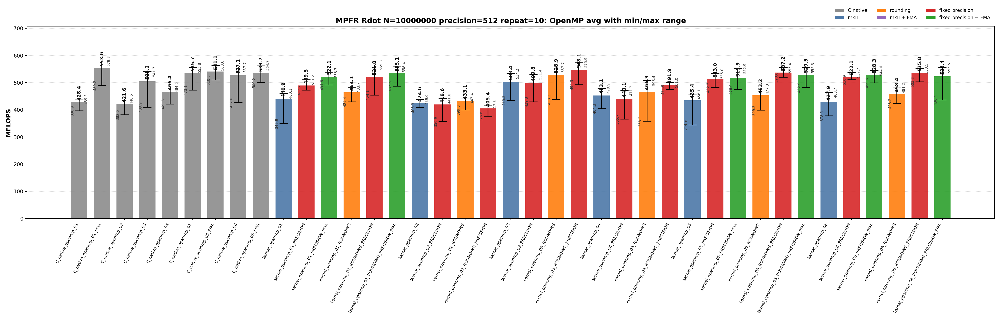

<!-- SPDX-License-Identifier: BSD-2-Clause -->

# 00_Rdot

This directory benchmarks the MPFR real dot product

```text
sum_i x_i * y_i
```

with raw MPFR C kernels and `mpfrxx::mpfr_class` wrapper kernels. The benchmark is organized like `benchmarks/mpfr/02_Rgemv`: numbered variants describe the source-level kernel shape, while suffixes describe source modifiers and build modifiers. The goal is to make temporary lifetime, rounding capture, FMA build options, fixed-precision assumptions, and OpenMP worker loops directly visible from the executable name and result class.

## Build

From the repository root:

```bash
cmake -S . -B build_bench_release -DCMAKE_BUILD_TYPE=Release
cmake --build build_bench_release -j
```

Executables are created under:

```text
build_bench_release/benchmarks/mpfr/00_Rdot/
```

Each executable takes `<vector size> <precision>`. Example:

```bash
build_bench_release/benchmarks/mpfr/00_Rdot/Rdot_mpfr_kernel_05_ROUNDING_PRECISION_FMA 10000000 512
```

The repeat runner uses the same source/build taxonomy:

```bash
OMP_NUM_THREADS=32 OMP_PLACES=cores OMP_PROC_BIND=spread \
    benchmarks/mpfr/00_Rdot/run_repeat.sh build_bench_release 10000000 512 10
```

MPFR Rdot wrapper targets omit a separate `mkII` implementation suffix because this directory has only the mkII wrapper implementation. The target suffixes separate source changes from build flags:

| Suffix | Kind | Meaning |
| --- | --- | --- |
| none | source baseline | Ordinary wrapper source for the numbered algorithm. |
| `ROUNDING` | source modifier | Captures `mpfrxx::evaluation_context` before the loop and uses `with_context` in the timed body. No compile-time flag is implied. |
| `PRECISION` | build modifier | Builds the same source with `GMPFRXX_MKII_FAST_FIXED_PREC`. |
| final `FMA` | build modifier | Builds the FMA-capturable source with `GMPFRXX_MKII_ENABLE_FMA`. |

The C native targets encode rounding and FMA directly in their source, so they do not split into `ROUNDING` and non-`ROUNDING` forms.

The cross-benchmark runner can execute the GMP and MPFR `00_Rdot`, `01_Raxpy`, and `02_Rgemv` suites for both standard precisions with one command:

```bash
OMP_NUM_THREADS=32 OMP_PLACES=cores OMP_PROC_BIND=spread \
    benchmarks/run_all.sh build_bench_release 512,1024 10 10000000 10000000 4000 4000
```

The second argument is a precision list. `both` and `all` are aliases for `512,1024`; a single value such as `512` still runs only that precision. Per-benchmark results are written to `results_raw/run_all_p512_repeat10_<timestamp>/` and `results_raw/run_all_p1024_repeat10_<timestamp>/` under each benchmark directory.

## Benchmark Parameters

| Parameter | Meaning |
| --- | --- |
| `N` | Number of vector elements. |
| `precision` | MPFR precision in bits for all input values and accumulators. |
| `repeat` | Number of timed process executions per executable. |
| `OMP_NUM_THREADS` | OpenMP worker count for `openmp` executables. |
| `OMP_PLACES`, `OMP_PROC_BIND` | OpenMP affinity controls used by the runner. |

The committed runs use `N=10000000`, `repeat=10`, `precision=512` and `precision=1024`, with `OMP_NUM_THREADS=32`, `OMP_PLACES=cores`, and `OMP_PROC_BIND=spread`.

## Variant Shapes

The timed body is `_Rdot()`. The numbered variant is written as a one-step transition: each row says what changed from the previous source shape and why that change is measured. `ROUNDING`, `PRECISION`, and final `FMA` suffixes modify the same numbered shape without changing the variant number.

| Variant | Transition from previous variant | Timed source shape | Temporary/resource policy | Purpose |
| --- | --- | --- | --- | --- |
| `01` | Starting point. | `acc += dx[i] * dy[i]` | Expression product is formed in the compound assignment. | Test the ET spelling. `FMA` builds can lower this source to one `mpfr_fma` call per element. |
| `02` | `01 -> 02`: force product materialization inside the loop. | `mpfr_class templ = dx[i] * dy[i]; acc += templ;` | Loop-local product object is constructed and destroyed inside every iteration. | Intentionally expensive control for temporary lifetime. |
| `03` | `02 -> 03`: move the product object outside the loop. | `templ = dx[i] * dy[i]; acc += templ;` | One product object is initialized before the loop and reused. | Main reusable-product split multiply/add wrapper shape. |
| `04` | `03 -> 04`: change product spelling to copy-then-multiply. | `templ = dx[i]; templ *= dy[i]; acc += templ;` | One product object is reused, but each iteration copies `dx[i]` before multiplication. | Separate product-object reuse from copy-then-multiply spelling. |
| `05` | `04 -> 05`: add accumulator unrolling and remove product materialization. | Four accumulators with direct `accN += dx[i+k] * dy[i+k]` updates. | No product object is materialized in the source. | FMA-capturable four-accumulator source. |
| `06` | `05 -> 06`: keep the direct-expression unrolled class for the second native FMA comparison point. | Four accumulators with direct `accN += dx[i+k] * dy[i+k]` updates. | No product object is materialized in the source. | Paired with `C_native_06_FMA`; expected to be in the same hot-loop class as `05`. |

Serial and OpenMP wrapper variants use the same numbering. OpenMP variants use per-thread partial accumulators and perform the final reduction outside the per-worker hot loop.

## Source Transitions

A variant number changes the source shape; suffixes then ask separate questions about rounding capture, FMA enablement, and fixed precision. For every numbered wrapper variant `01` through `06`, including the matching OpenMP variant, the generated wrapper target family is:

```text
<base>
<base>_PRECISION
<base>_ROUNDING
<base>_ROUNDING_PRECISION
```

`FMA` is a build modifier, not a separate source file. It is generated only for FMA-capturable source variants `01`, `05`, and `06`, always paired with fixed precision:

```text
<base>_PRECISION_FMA
<base>_ROUNDING_PRECISION_FMA
```

Variants `02` through `04` intentionally materialize product temporaries, so an FMA target for those source files would not measure the same source-level shape.

## C Native Equivalent Kernels

The mapping is based on the timed `_Rdot()` source shape and generated hot loop, not just on matching numeric suffixes. Raw C kernels encode rounding and FMA directly; wrapper kernels use suffixes to isolate those effects.

| C native kernel | Equivalent C++ wrapper kernel(s) | Equivalence basis |
| --- | --- | --- |
| `C_native_01` | closest to `kernel_02` | Legacy raw C loop-local product control. It is not the exact equivalent of wrapper `01` expression syntax. |
| `C_native_01_FMA` | `kernel_01_PRECISION_FMA`, `kernel_01_ROUNDING_PRECISION_FMA` | One `mpfr_fma` call per element when ET FMA capture succeeds. |
| `C_native_02` | `kernel_02`, `kernel_02_PRECISION`, `kernel_02_ROUNDING`, `kernel_02_ROUNDING_PRECISION` | Loop-local product object. |
| `C_native_03` | `kernel_03`, `kernel_03_PRECISION`, `kernel_03_ROUNDING`, `kernel_03_ROUNDING_PRECISION` | One reusable product object with split multiply/add. |
| `C_native_04` | `kernel_04`, `kernel_04_PRECISION`, `kernel_04_ROUNDING`, `kernel_04_ROUNDING_PRECISION` | Copy-then-multiply reusable product. |
| `C_native_05_FMA` | `kernel_05_PRECISION_FMA`, `kernel_05_ROUNDING_PRECISION_FMA` | Four accumulators with one direct `mpfr_fma`-class update per lane. |
| `C_native_06_FMA` | `kernel_06_PRECISION_FMA`, `kernel_06_ROUNDING_PRECISION_FMA` | Four accumulators with one direct `mpfr_fma`-class update per lane. |
| `C_native_openmp_NN` | `kernel_openmp_NN`, `kernel_openmp_NN_PRECISION`, `kernel_openmp_NN_ROUNDING`, `kernel_openmp_NN_ROUNDING_PRECISION` | Same OpenMP partitioning and non-FMA temporary policy as the raw C variant. |
| `C_native_openmp_NN_FMA` | `kernel_openmp_NN_PRECISION_FMA`, `kernel_openmp_NN_ROUNDING_PRECISION_FMA` for FMA-capable `NN` | Same OpenMP partitioning, with FMA-capturable wrapper source and FMA-enabled build. |

There is no exact raw C source equivalent for the non-FMA wrapper expression spelling `acc += dx[i] * dy[i]`; raw C must choose either split `mpfr_mul` plus `mpfr_add`, or fused `mpfr_fma`.

## Recorded Run

### 512-bit run

| Field | Value |
|-------|-------|
| Run ID | `run_all_p512_repeat10_20260525_224339` |
| Date | 2026-05-25 |
| CPU | AMD Ryzen Threadripper 3970X 32-Core Processor |
| OS | Linux 6.8.0-94-generic x86_64 |
| Compiler | `c++ (Ubuntu 15.2.0-16ubuntu1) 15.2.0` |
| Build type | Release |
| Problem size | `N=10000000` |
| Precision | 512 bits |
| Repeat count | 10 |
| OpenMP | `OMP_NUM_THREADS=32`, `OMP_PLACES=cores`, `OMP_PROC_BIND=spread` |
| Benchmark command | `OMP_NUM_THREADS=32 OMP_PLACES=cores OMP_PROC_BIND=spread benchmarks/run_all.sh build_bench_release 512 10 10000000 10000000 4000 4000` |
| Raw result directory | `benchmarks/mpfr/00_Rdot/results_raw/run_all_p512_repeat10_20260525_224339/` |
| Raw log | `benchmarks/mpfr/00_Rdot/results_raw/run_all_p512_repeat10_20260525_224339/benchmark_rdot_mpfr_n10000000_p512_repeat10.log` |
| Raw CSV | `benchmarks/mpfr/00_Rdot/results_raw/run_all_p512_repeat10_20260525_224339/raw_rdot_mpfr_n10000000_p512_repeat10.csv` |
| Summary CSV | `benchmarks/mpfr/00_Rdot/results_raw/run_all_p512_repeat10_20260525_224339/summary_rdot_mpfr_n10000000_p512_repeat10.csv` |
| Correctness | 780 / 780 runs reported OK. |




Plot regeneration command:

```bash
python3 benchmarks/mpfr/00_Rdot/plot_repeat_summary.py \
    benchmarks/mpfr/00_Rdot/results_raw/run_all_p512_repeat10_20260525_224339/benchmark_rdot_mpfr_n10000000_p512_repeat10.log \
    --output-dir benchmarks/mpfr/00_Rdot/results_raw/run_all_p512_repeat10_20260525_224339 \
    --output-prefix rdot_mpfr_n10000000_p512_repeat10 \
    --title-prefix "MPFR Rdot N=10000000, precision=512, repeat=10"
```

### 1024-bit run

No current 1024-bit `run_all` result directory is present under this benchmark's `results_raw/` tree. Run `benchmarks/run_all.sh build_bench_release 1024 10 10000000 10000000 4000 4000` or the default dual-precision command to regenerate this section.

## Resource or Bandwidth Estimates

The values below are model estimates derived from MFLOPS, not hardware-counter measurements. They use the current 512-bit `run_all` summary and count active limb bytes plus a header-inclusive model. They exclude allocator metadata, cache-line overfetch, instruction fetch, and final OpenMP reduction traffic.

| Case | Representative best-avg variant | Avg MFLOPS | Active bytes/iteration | Header-inclusive bytes/iteration | Active GB/s | Header-inclusive GB/s |
| --- | --- | --- | --- | --- | --- | --- |
| 512-bit serial | `C_native_06` | 23.711 | 128 | 192 | 1.518 | 2.276 |
| 512-bit OpenMP | `C_native_openmp_01_FMA` | 553.604 | 128 | 192 | 35.431 | 53.146 |

For matrix-vector benchmarks, the per-iteration byte model is a compact active-data estimate for the arithmetic stream, not a full matrix-footprint or cache-reuse model.
## Headline Results

The 512-bit headline rows below are regenerated from `benchmarks/mpfr/00_Rdot/results_raw/run_all_p512_repeat10_20260525_224339/summary_rdot_mpfr_n10000000_p512_repeat10.csv`. No 1024-bit raw data is present in the current `results_raw/` tree, so 1024-bit result sections are placeholders until a fresh 1024-bit `run_all` result is collected.

| Precision | Class | Variant | Max MFLOPS | Avg MFLOPS | Interpretation |
| --- | --- | --- | --- | --- | --- |
| 512 | Best serial max | `C_native_01_FMA` | 23.941 | 23.192 | Single fastest serial repeat; compare with Avg MFLOPS for stability. |
| 512 | Best serial average | `C_native_06` | 23.876 | 23.711 | Raw C reference for the numbered source shape. |
| 512 | Best OpenMP max | `C_native_openmp_01_FMA` | 579.812 | 553.604 | Single fastest OpenMP repeat; OpenMP rows should be interpreted by performance class. |
| 512 | Best OpenMP average | `C_native_openmp_01_FMA` | 579.812 | 553.604 | Raw C MPFR FMA reference; the hot loop uses the fused backend operation where the source shape permits it. |
## Serial Results

### 512-bit serial interpretation

These rows are derived from `benchmarks/mpfr/00_Rdot/results_raw/run_all_p512_repeat10_20260525_224339/summary_rdot_mpfr_n10000000_p512_repeat10.csv`.

| Observation | Variant | Max MFLOPS | Avg MFLOPS | Min MFLOPS | Interpretation |
| --- | --- | --- | --- | --- | --- |
| Best raw C serial avg | `C_native_06` | 23.876 | 23.711 | 23.483 | Raw C reference for the numbered source shape. |
| Best mkII serial avg | `kernel_03_ROUNDING` | 23.564 | 23.323 | 22.738 | Wrapper source captures rounding/context outside the loop; checks whether default-rounding lookup was part of the hot path. |
| Best serial max | `C_native_01_FMA` | 23.941 | 23.192 | 22.448 | Raw C MPFR FMA reference; the hot loop uses the fused backend operation where the source shape permits it. |

<details>
<summary>512-bit serial results sorted by Max MFLOPS</summary>

| Rank | Variant | Max MFLOPS | Avg MFLOPS | Min MFLOPS |
| --- | --- | --- | --- | --- |
| 1 | `C_native_01_FMA` | 23.941 | 23.192 | 22.448 |
| 2 | `C_native_06` | 23.876 | 23.711 | 23.483 |
| 3 | `C_native_03` | 23.827 | 23.528 | 23.181 |
| 4 | `kernel_06_ROUNDING_PRECISION_FMA` | 23.656 | 23.211 | 22.979 |
| 5 | `C_native_05_FMA` | 23.636 | 23.119 | 22.628 |
| 6 | `kernel_03_ROUNDING` | 23.564 | 23.323 | 22.738 |
| 7 | `kernel_05_ROUNDING_PRECISION_FMA` | 23.475 | 23.275 | 23.039 |
| 8 | `kernel_01_ROUNDING_PRECISION_FMA` | 23.353 | 23.117 | 22.859 |
| 9 | `kernel_03_ROUNDING_PRECISION` | 23.221 | 22.993 | 22.666 |
| 10 | `C_native_06_FMA` | 23.213 | 23.043 | 22.694 |
| 11 | `kernel_01_ROUNDING_PRECISION` | 22.962 | 22.342 | 22.129 |
| 12 | `kernel_06_ROUNDING_PRECISION` | 22.831 | 22.343 | 22.096 |
| 13 | `kernel_06_PRECISION_FMA` | 22.741 | 22.138 | 21.703 |
| 14 | `kernel_05_ROUNDING_PRECISION` | 22.660 | 22.325 | 22.131 |
| 15 | `kernel_01_PRECISION_FMA` | 22.574 | 22.187 | 21.903 |
| 16 | `kernel_05_PRECISION_FMA` | 22.305 | 21.865 | 21.290 |
| 17 | `C_native_05` | 21.893 | 21.393 | 21.116 |
| 18 | `kernel_03` | 21.695 | 21.361 | 20.792 |
| 19 | `kernel_01_PRECISION` | 21.680 | 21.219 | 21.000 |
| 20 | `kernel_05_PRECISION` | 21.256 | 20.955 | 20.399 |
| 21 | `kernel_03_PRECISION` | 21.171 | 20.956 | 20.649 |
| 22 | `kernel_06_PRECISION` | 21.067 | 20.791 | 20.344 |
| 23 | `kernel_04_ROUNDING_PRECISION` | 20.422 | 20.015 | 19.834 |
| 24 | `kernel_04_ROUNDING` | 20.257 | 20.095 | 19.946 |
| 25 | `C_native_04` | 19.555 | 19.379 | 19.205 |
| 26 | `kernel_01_ROUNDING` | 19.499 | 19.235 | 18.962 |
| 27 | `C_native_01` | 19.459 | 19.288 | 18.919 |
| 28 | `C_native_02` | 19.328 | 19.130 | 18.916 |
| 29 | `kernel_04` | 19.046 | 18.455 | 18.096 |
| 30 | `kernel_01` | 18.759 | 18.365 | 17.970 |
| 31 | `kernel_06_ROUNDING` | 18.620 | 18.327 | 18.083 |
| 32 | `kernel_05_ROUNDING` | 18.604 | 18.443 | 18.307 |
| 33 | `kernel_04_PRECISION` | 18.558 | 18.384 | 18.210 |
| 34 | `kernel_05` | 18.176 | 17.722 | 17.315 |
| 35 | `kernel_02_ROUNDING` | 18.137 | 17.895 | 17.678 |
| 36 | `kernel_06` | 17.948 | 17.671 | 17.500 |
| 37 | `kernel_02` | 17.797 | 17.580 | 17.430 |
| 38 | `kernel_02_ROUNDING_PRECISION` | 17.701 | 17.377 | 16.842 |
| 39 | `kernel_02_PRECISION` | 17.329 | 17.152 | 16.789 |

</details>

<details>
<summary>512-bit serial results sorted by Avg MFLOPS</summary>

| Rank | Variant | Max MFLOPS | Avg MFLOPS | Min MFLOPS |
| --- | --- | --- | --- | --- |
| 1 | `C_native_06` | 23.876 | 23.711 | 23.483 |
| 2 | `C_native_03` | 23.827 | 23.528 | 23.181 |
| 3 | `kernel_03_ROUNDING` | 23.564 | 23.323 | 22.738 |
| 4 | `kernel_05_ROUNDING_PRECISION_FMA` | 23.475 | 23.275 | 23.039 |
| 5 | `kernel_06_ROUNDING_PRECISION_FMA` | 23.656 | 23.211 | 22.979 |
| 6 | `C_native_01_FMA` | 23.941 | 23.192 | 22.448 |
| 7 | `C_native_05_FMA` | 23.636 | 23.119 | 22.628 |
| 8 | `kernel_01_ROUNDING_PRECISION_FMA` | 23.353 | 23.117 | 22.859 |
| 9 | `C_native_06_FMA` | 23.213 | 23.043 | 22.694 |
| 10 | `kernel_03_ROUNDING_PRECISION` | 23.221 | 22.993 | 22.666 |
| 11 | `kernel_06_ROUNDING_PRECISION` | 22.831 | 22.343 | 22.096 |
| 12 | `kernel_01_ROUNDING_PRECISION` | 22.962 | 22.342 | 22.129 |
| 13 | `kernel_05_ROUNDING_PRECISION` | 22.660 | 22.325 | 22.131 |
| 14 | `kernel_01_PRECISION_FMA` | 22.574 | 22.187 | 21.903 |
| 15 | `kernel_06_PRECISION_FMA` | 22.741 | 22.138 | 21.703 |
| 16 | `kernel_05_PRECISION_FMA` | 22.305 | 21.865 | 21.290 |
| 17 | `C_native_05` | 21.893 | 21.393 | 21.116 |
| 18 | `kernel_03` | 21.695 | 21.361 | 20.792 |
| 19 | `kernel_01_PRECISION` | 21.680 | 21.219 | 21.000 |
| 20 | `kernel_03_PRECISION` | 21.171 | 20.956 | 20.649 |
| 21 | `kernel_05_PRECISION` | 21.256 | 20.955 | 20.399 |
| 22 | `kernel_06_PRECISION` | 21.067 | 20.791 | 20.344 |
| 23 | `kernel_04_ROUNDING` | 20.257 | 20.095 | 19.946 |
| 24 | `kernel_04_ROUNDING_PRECISION` | 20.422 | 20.015 | 19.834 |
| 25 | `C_native_04` | 19.555 | 19.379 | 19.205 |
| 26 | `C_native_01` | 19.459 | 19.288 | 18.919 |
| 27 | `kernel_01_ROUNDING` | 19.499 | 19.235 | 18.962 |
| 28 | `C_native_02` | 19.328 | 19.130 | 18.916 |
| 29 | `kernel_04` | 19.046 | 18.455 | 18.096 |
| 30 | `kernel_05_ROUNDING` | 18.604 | 18.443 | 18.307 |
| 31 | `kernel_04_PRECISION` | 18.558 | 18.384 | 18.210 |
| 32 | `kernel_01` | 18.759 | 18.365 | 17.970 |
| 33 | `kernel_06_ROUNDING` | 18.620 | 18.327 | 18.083 |
| 34 | `kernel_02_ROUNDING` | 18.137 | 17.895 | 17.678 |
| 35 | `kernel_05` | 18.176 | 17.722 | 17.315 |
| 36 | `kernel_06` | 17.948 | 17.671 | 17.500 |
| 37 | `kernel_02` | 17.797 | 17.580 | 17.430 |
| 38 | `kernel_02_ROUNDING_PRECISION` | 17.701 | 17.377 | 16.842 |
| 39 | `kernel_02_PRECISION` | 17.329 | 17.152 | 16.789 |

</details>
### 1024-bit serial interpretation

No current 1024-bit `run_all` summary CSV is present under this benchmark's `results_raw/` tree. The serial table should be regenerated after a fresh 1024-bit run is collected.

## OpenMP Results

### 512-bit OpenMP interpretation

These rows are derived from `benchmarks/mpfr/00_Rdot/results_raw/run_all_p512_repeat10_20260525_224339/summary_rdot_mpfr_n10000000_p512_repeat10.csv`.

| Observation | Variant | Max MFLOPS | Avg MFLOPS | Min MFLOPS | Interpretation |
| --- | --- | --- | --- | --- | --- |
| Best raw C OpenMP avg | `C_native_openmp_01_FMA` | 579.812 | 553.604 | 489.189 | Raw C MPFR FMA reference; the hot loop uses the fused backend operation where the source shape permits it. |
| Best mkII OpenMP avg | `kernel_openmp_03_ROUNDING_PRECISION` | 575.851 | 548.120 | 492.300 | Wrapper source with loop-external context plus fixed-precision build assumptions; intended to remove rounding lookup and precision checks from the hot path. |
| Best OpenMP max | `C_native_openmp_01_FMA` | 579.812 | 553.604 | 489.189 | Raw C MPFR FMA reference; the hot loop uses the fused backend operation where the source shape permits it. |

<details>
<summary>512-bit OpenMP results sorted by Max MFLOPS</summary>

| Rank | Variant | Max MFLOPS | Avg MFLOPS | Min MFLOPS |
| --- | --- | --- | --- | --- |
| 1 | `C_native_openmp_01_FMA` | 579.812 | 553.604 | 489.189 |
| 2 | `kernel_openmp_03_ROUNDING_PRECISION` | 575.851 | 548.120 | 492.300 |
| 3 | `kernel_openmp_01_ROUNDING_PRECISION` | 565.347 | 521.800 | 454.136 |
| 4 | `C_native_openmp_06_FMA` | 564.706 | 533.698 | 500.225 |
| 5 | `C_native_openmp_05_FMA` | 563.611 | 541.142 | 510.460 |
| 6 | `kernel_openmp_01_ROUNDING_PRECISION_FMA` | 558.438 | 535.050 | 487.595 |
| 7 | `C_native_openmp_06` | 557.678 | 527.149 | 426.974 |
| 8 | `kernel_openmp_03_ROUNDING` | 557.651 | 528.912 | 438.191 |
| 9 | `C_native_openmp_05` | 555.777 | 535.720 | 473.068 |
| 10 | `kernel_openmp_06_ROUNDING_PRECISION_FMA` | 555.467 | 523.374 | 436.432 |
| 11 | `kernel_openmp_05_ROUNDING_PRECISION` | 555.411 | 537.155 | 520.563 |
| 12 | `kernel_openmp_05_ROUNDING_PRECISION_FMA` | 555.278 | 529.522 | 482.889 |
| 13 | `kernel_openmp_06_ROUNDING_PRECISION` | 553.545 | 535.812 | 503.345 |
| 14 | `kernel_openmp_05_PRECISION_FMA` | 552.905 | 515.941 | 475.978 |
| 15 | `kernel_openmp_06_PRECISION_FMA` | 544.594 | 528.255 | 499.615 |
| 16 | `C_native_openmp_03` | 541.686 | 505.206 | 409.882 |
| 17 | `kernel_openmp_01_PRECISION_FMA` | 538.748 | 522.128 | 491.604 |
| 18 | `kernel_openmp_06_PRECISION` | 537.664 | 522.147 | 510.858 |
| 19 | `kernel_openmp_05_PRECISION` | 535.004 | 513.022 | 482.495 |
| 20 | `kernel_openmp_03` | 534.161 | 503.360 | 435.259 |
| 21 | `kernel_openmp_03_PRECISION` | 531.357 | 499.836 | 429.799 |
| 22 | `kernel_openmp_01_PRECISION` | 511.152 | 489.464 | 472.654 |
| 23 | `kernel_openmp_04_ROUNDING` | 508.439 | 466.877 | 358.201 |
| 24 | `kernel_openmp_04_ROUNDING_PRECISION` | 501.005 | 491.882 | 474.897 |
| 25 | `C_native_openmp_04` | 484.518 | 466.357 | 421.307 |
| 26 | `kernel_openmp_01_ROUNDING` | 483.735 | 464.146 | 429.433 |
| 27 | `kernel_openmp_06_ROUNDING` | 481.229 | 458.405 | 423.210 |
| 28 | `kernel_openmp_04` | 479.851 | 453.086 | 404.336 |
| 29 | `kernel_openmp_05_ROUNDING` | 477.305 | 453.173 | 399.285 |
| 30 | `kernel_openmp_04_PRECISION` | 471.163 | 440.074 | 365.725 |
| 31 | `kernel_openmp_06` | 463.668 | 427.924 | 378.460 |
| 32 | `kernel_openmp_01` | 460.065 | 440.875 | 349.931 |
| 33 | `kernel_openmp_05` | 458.116 | 435.431 | 344.931 |
| 34 | `kernel_openmp_02_ROUNDING` | 443.403 | 433.072 | 399.817 |
| 35 | `kernel_openmp_02_PRECISION` | 441.604 | 419.619 | 356.932 |
| 36 | `C_native_openmp_02` | 440.543 | 421.612 | 382.533 |
| 37 | `C_native_openmp_01` | 439.528 | 428.440 | 396.856 |
| 38 | `kernel_openmp_02` | 438.959 | 424.567 | 408.333 |
| 39 | `kernel_openmp_02_ROUNDING_PRECISION` | 417.273 | 405.373 | 376.568 |

</details>

<details>
<summary>512-bit OpenMP results sorted by Avg MFLOPS</summary>

| Rank | Variant | Max MFLOPS | Avg MFLOPS | Min MFLOPS |
| --- | --- | --- | --- | --- |
| 1 | `C_native_openmp_01_FMA` | 579.812 | 553.604 | 489.189 |
| 2 | `kernel_openmp_03_ROUNDING_PRECISION` | 575.851 | 548.120 | 492.300 |
| 3 | `C_native_openmp_05_FMA` | 563.611 | 541.142 | 510.460 |
| 4 | `kernel_openmp_05_ROUNDING_PRECISION` | 555.411 | 537.155 | 520.563 |
| 5 | `kernel_openmp_06_ROUNDING_PRECISION` | 553.545 | 535.812 | 503.345 |
| 6 | `C_native_openmp_05` | 555.777 | 535.720 | 473.068 |
| 7 | `kernel_openmp_01_ROUNDING_PRECISION_FMA` | 558.438 | 535.050 | 487.595 |
| 8 | `C_native_openmp_06_FMA` | 564.706 | 533.698 | 500.225 |
| 9 | `kernel_openmp_05_ROUNDING_PRECISION_FMA` | 555.278 | 529.522 | 482.889 |
| 10 | `kernel_openmp_03_ROUNDING` | 557.651 | 528.912 | 438.191 |
| 11 | `kernel_openmp_06_PRECISION_FMA` | 544.594 | 528.255 | 499.615 |
| 12 | `C_native_openmp_06` | 557.678 | 527.149 | 426.974 |
| 13 | `kernel_openmp_06_ROUNDING_PRECISION_FMA` | 555.467 | 523.374 | 436.432 |
| 14 | `kernel_openmp_06_PRECISION` | 537.664 | 522.147 | 510.858 |
| 15 | `kernel_openmp_01_PRECISION_FMA` | 538.748 | 522.128 | 491.604 |
| 16 | `kernel_openmp_01_ROUNDING_PRECISION` | 565.347 | 521.800 | 454.136 |
| 17 | `kernel_openmp_05_PRECISION_FMA` | 552.905 | 515.941 | 475.978 |
| 18 | `kernel_openmp_05_PRECISION` | 535.004 | 513.022 | 482.495 |
| 19 | `C_native_openmp_03` | 541.686 | 505.206 | 409.882 |
| 20 | `kernel_openmp_03` | 534.161 | 503.360 | 435.259 |
| 21 | `kernel_openmp_03_PRECISION` | 531.357 | 499.836 | 429.799 |
| 22 | `kernel_openmp_04_ROUNDING_PRECISION` | 501.005 | 491.882 | 474.897 |
| 23 | `kernel_openmp_01_PRECISION` | 511.152 | 489.464 | 472.654 |
| 24 | `kernel_openmp_04_ROUNDING` | 508.439 | 466.877 | 358.201 |
| 25 | `C_native_openmp_04` | 484.518 | 466.357 | 421.307 |
| 26 | `kernel_openmp_01_ROUNDING` | 483.735 | 464.146 | 429.433 |
| 27 | `kernel_openmp_06_ROUNDING` | 481.229 | 458.405 | 423.210 |
| 28 | `kernel_openmp_05_ROUNDING` | 477.305 | 453.173 | 399.285 |
| 29 | `kernel_openmp_04` | 479.851 | 453.086 | 404.336 |
| 30 | `kernel_openmp_01` | 460.065 | 440.875 | 349.931 |
| 31 | `kernel_openmp_04_PRECISION` | 471.163 | 440.074 | 365.725 |
| 32 | `kernel_openmp_05` | 458.116 | 435.431 | 344.931 |
| 33 | `kernel_openmp_02_ROUNDING` | 443.403 | 433.072 | 399.817 |
| 34 | `C_native_openmp_01` | 439.528 | 428.440 | 396.856 |
| 35 | `kernel_openmp_06` | 463.668 | 427.924 | 378.460 |
| 36 | `kernel_openmp_02` | 438.959 | 424.567 | 408.333 |
| 37 | `C_native_openmp_02` | 440.543 | 421.612 | 382.533 |
| 38 | `kernel_openmp_02_PRECISION` | 441.604 | 419.619 | 356.932 |
| 39 | `kernel_openmp_02_ROUNDING_PRECISION` | 417.273 | 405.373 | 376.568 |

</details>
### 1024-bit OpenMP interpretation

No current 1024-bit `run_all` summary CSV is present under this benchmark's `results_raw/` tree. The OpenMP table should be regenerated after a fresh 1024-bit run is collected.

## Comparison with GMP version

The rows below compare the current 512-bit `run_all` data for `00_Rdot`. This is a performance-class comparison; GMP `mpf` and MPFR have different precision and rounding semantics.

| Class | GMP best-avg variant | GMP Avg MFLOPS | MPFR best-avg variant | MPFR Avg MFLOPS | MPFR/GMP |
| --- | --- | --- | --- | --- | --- |
| Best serial average | `C_native_03` | 32.770 | `C_native_06` | 23.711 | 0.724x |
| Best OpenMP average | `kernel_openmp_03_mkII_FIXED_PRECISION_FASTPATH` | 578.766 | `C_native_openmp_01_FMA` | 553.604 | 0.957x |

## Hotpath Disassembly

The representative disassembly checks are unchanged by this result refresh because the kernel sources did not change during the repeat-10 run. Regenerate snippets with:

```bash
objdump -Cd --no-show-raw-insn build_bench_release/benchmarks/mpfr/00_Rdot/Rdot_mpfr_C_native_01_FMA
objdump -Cd --no-show-raw-insn build_bench_release/benchmarks/mpfr/00_Rdot/Rdot_mpfr_kernel_02
objdump -Cd --no-show-raw-insn build_bench_release/benchmarks/mpfr/00_Rdot/Rdot_mpfr_kernel_03
objdump -Cd --no-show-raw-insn build_bench_release/benchmarks/mpfr/00_Rdot/Rdot_mpfr_kernel_05_ROUNDING_PRECISION_FMA
objdump -Cd --no-show-raw-insn build_bench_release/benchmarks/mpfr/00_Rdot/Rdot_mpfr_kernel_openmp_06_PRECISION_FMA
```

| Kernel class | Expected hot-loop check |
| --- | --- |
| `C_native_01_FMA` | One `mpfr_fma` call per element with rounding captured outside the loop. |
| `kernel_02` | Loop-local product object can leave `mpfr_init2` / `mpfr_clear` in the hot loop. |
| `kernel_03` | Reusable product object should leave split `mpfr_mul` plus `mpfr_add` in the loop with construction outside. |
| `kernel_03_ROUNDING_PRECISION` | Context-bound reusable product path should avoid per-iteration default rounding lookup. |
| `kernel_05_ROUNDING_PRECISION_FMA` / `kernel_06_ROUNDING_PRECISION_FMA` | Context-bound unrolled expression should lower lane updates to `mpfr_fma` when FMA capture succeeds. |
| OpenMP FMA worker loop | Per-thread accumulation remains in the worker hot loop; final reduction is outside the worker hot path. |

The 512-bit and 1024-bit data both show the same broad call-sequence boundary: FMA-capable sources form the top serial MPFR class, while OpenMP results are dominated by worker-loop shape and run-to-run variance.

## Lessons Learned

- MPFR Rdot performance is controlled by source-level temporary lifetime and whether the expression can lower to `mpfr_fma`.
- `kernel_02` remains the intentionally expensive loop-local temporary control in both serial and OpenMP runs.
- Reusable split multiply/add sources (`03` and `04`) are stable non-FMA baselines.
- At 512 bits, the best serial average is still the raw reusable split path, while the best serial max comes from a wrapper FMA source; at 1024 bits, wrapper FMA sources form the best serial class.
- OpenMP FMA helps, but the raw C OpenMP FMA baseline remains the best 1024-bit average in this run.
- `ROUNDING` source variants do not automatically improve OpenMP performance; in several 1024-bit OpenMP classes they are lower than the matching precision-only target.
- Interpret OpenMP by performance class and average MFLOPS, because individual repeats show visible scheduler and affinity variance even with `OMP_PLACES=cores` and `OMP_PROC_BIND=spread`.
