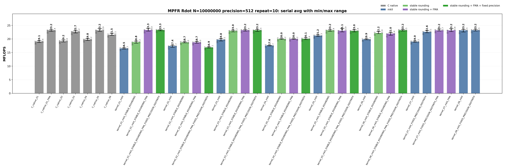
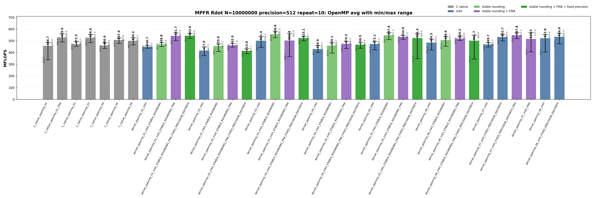

<!-- SPDX-License-Identifier: BSD-2-Clause -->

# 00_Rdot

This directory benchmarks the MPFR real dot product

```text
sum_i x_i * y_i
```

with fixed-precision `mpfr_t` and `mpfrxx::mpfr_class` data.  The benchmark is
kept parallel to `benchmarks/gmp/00_Rdot/`: every kernel shape is a standalone
translation unit and the timed function is `_Rdot()`, so source shape,
optimization flags, and hotpath disassembly can be compared directly.

## Build

From the repository root:

```bash
cmake -S . -B build_bench_release -DCMAKE_BUILD_TYPE=Release
cmake --build build_bench_release -j
```

Executables are created under:

```text
build_bench_release/benchmarks/mpfr/00_Rdot/
```

Each executable takes:

```text
<vector size> <precision>
```

Example:

```bash
build_bench_release/benchmarks/mpfr/00_Rdot/Rdot_mpfr_kernel_03_mkII 10000000 512
```

## Kernel Shapes

Kernel numbers `01..06` intentionally match GMP Rdot.  MPFR-specific explicit
context kernels are added as `07` and `08`.  The same number means the same
source-level shape for serial and OpenMP wrapper kernels.

| Variant | Timed source shape | Temporary/resource policy | Purpose |
|---------|--------------------|---------------------------|---------|
| `01` | `acc += dx[i] * dy[i]` | Expression product is formed in the compound assignment. | Test the ET spelling.  FMA builds can lower this source to one `mpfr_fma` call per element. |
| `02` | `mpfr_class templ = dx[i] * dy[i]; acc += templ;` | Loop-local product object is constructed and destroyed inside every iteration. | Intentionally expensive control for temporary lifetime. |
| `03` | `templ = dx[i] * dy[i]; acc += templ;` | One product object is initialized before the loop and reused. | Main non-FMA reusable-product wrapper shape. |
| `04` | `templ = dx[i]; templ *= dy[i]; acc += templ;` | One product object is reused, but each iteration copies `dx[i]` before multiplication. | Separate product-object reuse from copy-then-multiply spelling. |
| `05` | Four accumulators with one reused product object. | Four accumulators share one product temporary. | Test accumulator unrolling while keeping one product temporary. |
| `06` | Four accumulators with four reused product objects. | Four accumulators and four independent product temporaries are reused. | Test accumulator unrolling plus independent product temporaries. |
| `07` | `with_context(acc, precision, rnd) += dx[i] * dy[i]` | Rounding is captured before the loop, and fixed-precision targets compile out context precision checks. | Context-bound `01`; FMA builds can lower this to `mpfr_fma`. |
| `08` | `with_context(templ, precision, rnd) = dx[i] * dy[i]; with_context(acc, precision, rnd) += templ;` | One product object is reused, rounding is cached before the loop, and fixed-precision targets compile out context precision checks. | Context-bound `03`; raw-C-like non-FMA reusable-product control. |

Raw C baselines use:

```text
Rdot_mpfr_C_native_NN
Rdot_mpfr_C_native_openmp_NN
```

The raw FMA baseline is intentionally a separate source file:

```text
Rdot_mpfr_C_native_01_FMA
Rdot_mpfr_C_native_openmp_01_FMA
```

There is no exact raw C non-FMA equivalent for the C++ expression spelling
`acc += dx[i] * dy[i]`.  Raw C has to choose either a split `mpfr_mul` plus
`mpfr_add` sequence, which is equivalent to a product-temporary source shape,
or a fused `mpfr_fma` call, which is equivalent to FMA-enabled `01` and `07`.

Wrapper suffixes are cumulative:

| Suffix | Build option | Meaning |
|--------|--------------|---------|
| `mkII` | none | Generic wrapper expression path. |
| `STABLE_ROUNDING` | `GMPFRXX_MKII_ASSUME_STABLE_MPFR_ROUNDING_MODE` | Avoids the generic default-rounding lookup path and uses the wrapper stable rounding path. |
| `STABLE_ROUNDING_FMA` | stable rounding + `MPFRXX_ENABLE_FMA` | Allows expression shapes such as `acc += dx[i] * dy[i]` to lower to `mpfr_fma`. |
| `STABLE_ROUNDING_FMA_FIXED_PRECISION_FASTPATH` | stable rounding + FMA + `GMPFRXX_MKII_ASSUME_FIXED_PRECISION_FASTPATH` | Enables fixed-precision wrapper specialization where applicable. |

Context-bound kernels are explicit targets.  The primary context comparison
points are the fixed-precision targets because the source intentionally assumes
that the context precision matches the destination precision:

```text
Rdot_mpfr_kernel_07_mkII
Rdot_mpfr_kernel_07_mkII_FIXED_PRECISION_FASTPATH
Rdot_mpfr_kernel_07_mkII_FMA
Rdot_mpfr_kernel_07_mkII_FIXED_PRECISION_FASTPATH_FMA
Rdot_mpfr_kernel_08_mkII
Rdot_mpfr_kernel_08_mkII_FIXED_PRECISION_FASTPATH
Rdot_mpfr_kernel_openmp_07_mkII
Rdot_mpfr_kernel_openmp_07_mkII_FIXED_PRECISION_FASTPATH
Rdot_mpfr_kernel_openmp_07_mkII_FMA
Rdot_mpfr_kernel_openmp_07_mkII_FIXED_PRECISION_FASTPATH_FMA
Rdot_mpfr_kernel_openmp_08_mkII
Rdot_mpfr_kernel_openmp_08_mkII_FIXED_PRECISION_FASTPATH
```

## C Native Equivalent Kernels

The C native executables are the reference hot-loop shapes for the C++ wrapper
kernels.  The mapping is based on the timed `_Rdot()` body, not on the
post-run correctness reference.

| C native kernel | Equivalent C++ wrapper kernel(s) | Equivalence basis |
|-----------------|----------------------------------|-------------------|
| No exact non-FMA raw C kernel | `kernel_01_mkII`, `kernel_01_mkII_STABLE_ROUNDING` | `01` is an expression-template source spelling.  Non-FMA generated code must be classified by disassembly, not by raw C source spelling. |
| `C_native_01_FMA` | `kernel_01_mkII_STABLE_ROUNDING_FMA`, `kernel_01_mkII_STABLE_ROUNDING_FMA_FIXED_PRECISION_FASTPATH`, `kernel_07_mkII_FIXED_PRECISION_FASTPATH_FMA` | One `mpfr_fma` call per element.  Raw C passes a cached local `rnd`; explicit-context `07` also passes loop-local cached rounding. |
| `C_native_02` | `kernel_02_*` | Loop-local product object: create product inside every iteration, add it, then destroy it. |
| `C_native_03` | `kernel_03_*`, `kernel_08_mkII_FIXED_PRECISION_FASTPATH` | One product object is initialized before the loop and reused with direct product assignment.  `08` is the explicit-context version of this split multiply/add shape. |
| `C_native_04` | `kernel_04_*` | One product object is reused, but each iteration copies `dx[i]` before multiplying by `dy[i]`. |
| `C_native_05` | `kernel_05_*` | Four accumulators with one reused product object.  This is an unrolling/control variant, not a required wrapper API shape. |
| `C_native_06` | `kernel_06_*` | Four accumulators with four reused product objects.  This is an unrolling/control variant, not a required wrapper API shape. |
| `C_native_openmp_01_FMA` | `kernel_openmp_01_*_FMA`, `kernel_openmp_07_mkII_FIXED_PRECISION_FASTPATH_FMA` | OpenMP one-call FMA equivalent. |
| `C_native_openmp_02` | `kernel_openmp_02_*` | OpenMP loop-local product object. |
| `C_native_openmp_03` | `kernel_openmp_03_*`, `kernel_openmp_08_mkII_FIXED_PRECISION_FASTPATH` | OpenMP reusable-product split multiply/add shape. |
| `C_native_openmp_04` | `kernel_openmp_04_*` | OpenMP copy-then-multiply shape. |
| `C_native_openmp_05` | `kernel_openmp_05_*` | OpenMP four-accumulator, one-product control. |
| `C_native_openmp_06` | `kernel_openmp_06_*` | OpenMP four-accumulator, four-product control. |

`C_native_01` and `C_native_openmp_01` are legacy raw C loop-local-product
controls retained for old result comparability.  They should not be used as the
exact source-level equivalent of wrapper `01`; use `C_native_01_FMA` for the
FMA-lowered `01`/`07` comparison and `C_native_02` for loop-local product
materialization.

## Recorded Run

The current checked-in MPFR Rdot data was regenerated from scratch after
removing older result directories.

```text
N = 10000000
precision = 512
repeat = 10
OMP_NUM_THREADS = 32
OMP_PLACES = cores
OMP_PROC_BIND = spread
CPU = AMD Ryzen Threadripper 3970X 32-Core Processor
```

Results are stored in:

```text
results_raw/rdot_mpfr_n10000000_p512_repeat10_20260518_185352/
```

Files:

- [Raw log](results_raw/rdot_mpfr_n10000000_p512_repeat10_20260518_185352/benchmark_rdot_mpfr_n10000000_p512_repeat10.log)
- [Raw CSV](results_raw/rdot_mpfr_n10000000_p512_repeat10_20260518_185352/raw_rdot_mpfr_n10000000_p512_repeat10.csv)
- [Summary CSV](results_raw/rdot_mpfr_n10000000_p512_repeat10_20260518_185352/summary_rdot_mpfr_n10000000_p512_repeat10.csv)

The sweep covers 74 variants and 740 timed runs.  Every timed run reported
`OK`.

The plots show average MFLOPS as vertical bars.  The black range line on each
bar is the observed min-to-max interval across the 10 repeats; labels show the
average and the range endpoints.





The images can be regenerated with:

```bash
python3 benchmarks/mpfr/00_Rdot/plot_repeat_summary.py \
    benchmarks/mpfr/00_Rdot/results_raw/rdot_mpfr_n10000000_p512_repeat10_20260518_185352/benchmark_rdot_mpfr_n10000000_p512_repeat10.log \
    --output-dir benchmarks/mpfr/00_Rdot/results_raw/rdot_mpfr_n10000000_p512_repeat10_20260518_185352 \
    --output-prefix rdot_mpfr_n10000000_p512_repeat10 \
    --title-prefix "MPFR Rdot N=10000000 precision=512 repeat=10"
```

## Headline Results

| Class | Best average variant | Max MFLOPS | Avg MFLOPS | Min MFLOPS | Notes |
|-------|----------------------|-----------:|-----------:|-----------:|-------|
| Serial wrapper | `kernel_01_mkII_STABLE_ROUNDING_FMA` | 23.971 | 23.303 | 22.895 | Best serial wrapper average; expression FMA source shape. |
| Serial raw C | `C_native_05` | 23.887 | 23.191 | 22.806 | Best serial raw C average in this run. |
| OpenMP wrapper | `kernel_openmp_03_mkII_STABLE_ROUNDING` | 580.968 | 556.611 | 526.784 | Best OpenMP wrapper average; reusable-product stable-rounding non-FMA shape. |
| OpenMP raw C | `C_native_openmp_01_FMA` | 560.833 | 529.899 | 490.431 | Best OpenMP raw C average; FMA with cached rounding. |

## Serial Results

Main interpretation table:

| Variant | Max MFLOPS | Avg MFLOPS | Min MFLOPS | Interpretation |
|---------|-----------:|-----------:|-----------:|----------------|
| `kernel_01_mkII_STABLE_ROUNDING_FMA` | 23.971 | 23.303 | 22.895 | Best serial wrapper average in this run; expression spelling lowers to one MPFR FMA call. |
| `kernel_01_mkII_STABLE_ROUNDING_FMA_FIXED_PRECISION_FASTPATH` | 23.411 | 23.291 | 23.006 | Same FMA source class; fixed precision does not create a separate serial performance tier here. |
| `kernel_08_mkII_FIXED_PRECISION_FASTPATH` | 23.531 | 23.211 | 22.933 | Explicit-context reusable-product non-FMA path; matches the raw `C_native_03` call shape. |
| `kernel_07_mkII_FIXED_PRECISION_FASTPATH_FMA` | 23.659 | 23.188 | 22.927 | Explicit-context FMA path with cached rounding and fixed-precision context checks compiled out. |
| `C_native_01_FMA` | 23.377 | 23.173 | 22.820 | Raw C FMA baseline with rounding loaded before the loop. |
| `C_native_03` | 23.176 | 22.745 | 22.238 | Raw C reusable-product non-FMA baseline. |
| `kernel_01_mkII` | 16.718 | 16.523 | 16.297 | Generic wrapper expression path; product materialization and generic rounding delivery are both visible. |

<details>
<summary>Serial results sorted by Max MFLOPS</summary>

| Rank | Variant | Max MFLOPS | Avg MFLOPS | Min MFLOPS |
|------|---------|-----------:|-----------:|-----------:|
| 1 | `kernel_01_mkII_STABLE_ROUNDING_FMA` | 23.971 | 23.303 | 22.895 |
| 2 | `kernel_05_mkII_STABLE_ROUNDING_FMA` | 23.908 | 23.064 | 22.631 |
| 3 | `C_native_05` | 23.887 | 23.191 | 22.806 |
| 4 | `kernel_07_mkII_FMA` | 23.846 | 23.196 | 22.762 |
| 5 | `kernel_07_mkII_FIXED_PRECISION_FASTPATH_FMA` | 23.659 | 23.188 | 22.927 |
| 6 | `kernel_08_mkII_FIXED_PRECISION_FASTPATH` | 23.531 | 23.211 | 22.933 |
| 7 | `kernel_08_mkII` | 23.509 | 23.203 | 22.597 |
| 8 | `kernel_06_mkII_STABLE_ROUNDING_FMA_FIXED_PRECISION_FASTPATH` | 23.505 | 23.215 | 22.944 |
| 9 | `kernel_03_mkII_STABLE_ROUNDING_FMA_FIXED_PRECISION_FASTPATH` | 23.493 | 23.209 | 22.823 |
| 10 | `kernel_03_mkII_STABLE_ROUNDING_FMA` | 23.422 | 23.208 | 22.904 |
| 11 | `kernel_01_mkII_STABLE_ROUNDING_FMA_FIXED_PRECISION_FASTPATH` | 23.411 | 23.291 | 23.006 |
| 12 | `kernel_05_mkII_STABLE_ROUNDING_FMA_FIXED_PRECISION_FASTPATH` | 23.397 | 22.970 | 22.631 |
| 13 | `kernel_05_mkII_STABLE_ROUNDING` | 23.384 | 23.169 | 22.809 |
| 14 | `C_native_01_FMA` | 23.377 | 23.173 | 22.820 |
| 15 | `kernel_03_mkII_STABLE_ROUNDING` | 23.230 | 22.967 | 22.641 |
| 16 | `C_native_03` | 23.176 | 22.745 | 22.238 |
| 17 | `kernel_07_mkII_FIXED_PRECISION_FASTPATH` | 23.093 | 22.627 | 22.280 |
| 18 | `kernel_06_mkII_STABLE_ROUNDING` | 22.808 | 22.193 | 21.982 |
| 19 | `kernel_06_mkII_STABLE_ROUNDING_FMA` | 22.358 | 21.960 | 21.371 |
| 20 | `C_native_06` | 22.149 | 21.545 | 21.326 |
| 21 | `kernel_05_mkII` | 21.473 | 21.191 | 20.923 |
| 22 | `kernel_04_mkII_STABLE_ROUNDING_FMA_FIXED_PRECISION_FASTPATH` | 20.407 | 20.052 | 19.809 |
| 23 | `C_native_04` | 20.193 | 19.787 | 19.472 |
| 24 | `kernel_04_mkII_STABLE_ROUNDING_FMA` | 20.171 | 20.015 | 19.857 |
| 25 | `kernel_04_mkII_STABLE_ROUNDING` | 20.165 | 20.014 | 19.893 |
| 26 | `kernel_03_mkII` | 20.113 | 19.772 | 19.264 |
| 27 | `kernel_06_mkII` | 20.054 | 19.883 | 19.719 |
| 28 | `C_native_02` | 19.613 | 19.200 | 18.902 |
| 29 | `C_native_01` | 19.392 | 19.077 | 18.706 |
| 30 | `kernel_07_mkII` | 19.247 | 18.976 | 18.775 |
| 31 | `kernel_01_mkII_STABLE_ROUNDING` | 19.219 | 18.849 | 18.452 |
| 32 | `kernel_02_mkII_STABLE_ROUNDING_FMA` | 19.006 | 18.743 | 18.447 |
| 33 | `kernel_02_mkII_STABLE_ROUNDING` | 18.963 | 18.726 | 18.578 |
| 34 | `kernel_04_mkII` | 17.705 | 17.609 | 17.460 |
| 35 | `kernel_02_mkII` | 17.691 | 17.405 | 16.953 |
| 36 | `kernel_02_mkII_STABLE_ROUNDING_FMA_FIXED_PRECISION_FASTPATH` | 17.067 | 16.867 | 16.666 |
| 37 | `kernel_01_mkII` | 16.718 | 16.523 | 16.297 |

</details>

<details>
<summary>Serial results sorted by Avg MFLOPS</summary>

| Rank | Variant | Max MFLOPS | Avg MFLOPS | Min MFLOPS |
|------|---------|-----------:|-----------:|-----------:|
| 1 | `kernel_01_mkII_STABLE_ROUNDING_FMA` | 23.971 | 23.303 | 22.895 |
| 2 | `kernel_01_mkII_STABLE_ROUNDING_FMA_FIXED_PRECISION_FASTPATH` | 23.411 | 23.291 | 23.006 |
| 3 | `kernel_06_mkII_STABLE_ROUNDING_FMA_FIXED_PRECISION_FASTPATH` | 23.505 | 23.215 | 22.944 |
| 4 | `kernel_08_mkII_FIXED_PRECISION_FASTPATH` | 23.531 | 23.211 | 22.933 |
| 5 | `kernel_03_mkII_STABLE_ROUNDING_FMA_FIXED_PRECISION_FASTPATH` | 23.493 | 23.209 | 22.823 |
| 6 | `kernel_03_mkII_STABLE_ROUNDING_FMA` | 23.422 | 23.208 | 22.904 |
| 7 | `kernel_08_mkII` | 23.509 | 23.203 | 22.597 |
| 8 | `kernel_07_mkII_FMA` | 23.846 | 23.196 | 22.762 |
| 9 | `C_native_05` | 23.887 | 23.191 | 22.806 |
| 10 | `kernel_07_mkII_FIXED_PRECISION_FASTPATH_FMA` | 23.659 | 23.188 | 22.927 |
| 11 | `C_native_01_FMA` | 23.377 | 23.173 | 22.820 |
| 12 | `kernel_05_mkII_STABLE_ROUNDING` | 23.384 | 23.169 | 22.809 |
| 13 | `kernel_05_mkII_STABLE_ROUNDING_FMA` | 23.908 | 23.064 | 22.631 |
| 14 | `kernel_05_mkII_STABLE_ROUNDING_FMA_FIXED_PRECISION_FASTPATH` | 23.397 | 22.970 | 22.631 |
| 15 | `kernel_03_mkII_STABLE_ROUNDING` | 23.230 | 22.967 | 22.641 |
| 16 | `C_native_03` | 23.176 | 22.745 | 22.238 |
| 17 | `kernel_07_mkII_FIXED_PRECISION_FASTPATH` | 23.093 | 22.627 | 22.280 |
| 18 | `kernel_06_mkII_STABLE_ROUNDING` | 22.808 | 22.193 | 21.982 |
| 19 | `kernel_06_mkII_STABLE_ROUNDING_FMA` | 22.358 | 21.960 | 21.371 |
| 20 | `C_native_06` | 22.149 | 21.545 | 21.326 |
| 21 | `kernel_05_mkII` | 21.473 | 21.191 | 20.923 |
| 22 | `kernel_04_mkII_STABLE_ROUNDING_FMA_FIXED_PRECISION_FASTPATH` | 20.407 | 20.052 | 19.809 |
| 23 | `kernel_04_mkII_STABLE_ROUNDING_FMA` | 20.171 | 20.015 | 19.857 |
| 24 | `kernel_04_mkII_STABLE_ROUNDING` | 20.165 | 20.014 | 19.893 |
| 25 | `kernel_06_mkII` | 20.054 | 19.883 | 19.719 |
| 26 | `C_native_04` | 20.193 | 19.787 | 19.472 |
| 27 | `kernel_03_mkII` | 20.113 | 19.772 | 19.264 |
| 28 | `C_native_02` | 19.613 | 19.200 | 18.902 |
| 29 | `C_native_01` | 19.392 | 19.077 | 18.706 |
| 30 | `kernel_07_mkII` | 19.247 | 18.976 | 18.775 |
| 31 | `kernel_01_mkII_STABLE_ROUNDING` | 19.219 | 18.849 | 18.452 |
| 32 | `kernel_02_mkII_STABLE_ROUNDING_FMA` | 19.006 | 18.743 | 18.447 |
| 33 | `kernel_02_mkII_STABLE_ROUNDING` | 18.963 | 18.726 | 18.578 |
| 34 | `kernel_04_mkII` | 17.705 | 17.609 | 17.460 |
| 35 | `kernel_02_mkII` | 17.691 | 17.405 | 16.953 |
| 36 | `kernel_02_mkII_STABLE_ROUNDING_FMA_FIXED_PRECISION_FASTPATH` | 17.067 | 16.867 | 16.666 |
| 37 | `kernel_01_mkII` | 16.718 | 16.523 | 16.297 |

</details>

## OpenMP Results

Main interpretation table:

| Variant | Max MFLOPS | Avg MFLOPS | Min MFLOPS | Interpretation |
|---------|-----------:|-----------:|-----------:|----------------|
| `kernel_openmp_03_mkII_STABLE_ROUNDING` | 580.968 | 556.611 | 526.784 | Best OpenMP wrapper average in this run; reusable-product non-FMA shape with stable rounding. |
| `kernel_openmp_07_mkII_FIXED_PRECISION_FASTPATH_FMA` | 571.162 | 547.781 | 518.448 | Best explicit-context OpenMP FMA average; cached rounding and fixed-precision context fastpath. |
| `kernel_openmp_05_mkII_STABLE_ROUNDING` | 571.322 | 547.562 | 509.699 | Four accumulators with one reusable product; in the same OpenMP performance class as the best wrapper path. |
| `kernel_openmp_01_mkII_STABLE_ROUNDING_FMA_FIXED_PRECISION_FASTPATH` | 564.409 | 543.555 | 520.229 | Expression FMA path with stable rounding and fixed precision; good average but not a new tier. |
| `C_native_openmp_01_FMA` | 560.833 | 529.899 | 490.431 | Raw OpenMP FMA baseline with cached rounding. |
| `C_native_openmp_03` | 554.008 | 526.554 | 484.274 | Raw OpenMP reusable-product non-FMA baseline. |
| `kernel_openmp_08_mkII_FIXED_PRECISION_FASTPATH` | 564.860 | 534.604 | 474.897 | Explicit-context OpenMP reusable-product path; performance is in the same broad class but shows run-to-run variance. |
| `kernel_openmp_01_mkII` | 459.456 | 449.741 | 437.011 | Generic OpenMP wrapper expression path remains below stable/FMA/context paths. |

<details>
<summary>OpenMP results sorted by Max MFLOPS</summary>

| Rank | Variant | Max MFLOPS | Avg MFLOPS | Min MFLOPS |
|------|---------|-----------:|-----------:|-----------:|
| 1 | `kernel_openmp_03_mkII_STABLE_ROUNDING` | 580.968 | 556.611 | 526.784 |
| 2 | `kernel_openmp_07_mkII_FMA` | 572.504 | 515.532 | 406.245 |
| 3 | `kernel_openmp_05_mkII_STABLE_ROUNDING` | 571.322 | 547.562 | 509.699 |
| 4 | `kernel_openmp_07_mkII_FIXED_PRECISION_FASTPATH_FMA` | 571.162 | 547.781 | 518.448 |
| 5 | `kernel_openmp_01_mkII_STABLE_ROUNDING_FMA` | 567.889 | 541.665 | 501.317 |
| 6 | `kernel_openmp_08_mkII_FIXED_PRECISION_FASTPATH` | 564.860 | 534.604 | 474.897 |
| 7 | `kernel_openmp_01_mkII_STABLE_ROUNDING_FMA_FIXED_PRECISION_FASTPATH` | 564.409 | 543.555 | 520.229 |
| 8 | `kernel_openmp_03_mkII_STABLE_ROUNDING_FMA` | 563.851 | 502.770 | 366.032 |
| 9 | `C_native_openmp_01_FMA` | 560.833 | 529.899 | 490.431 |
| 10 | `kernel_openmp_05_mkII_STABLE_ROUNDING_FMA_FIXED_PRECISION_FASTPATH` | 560.573 | 523.392 | 347.864 |
| 11 | `kernel_openmp_08_mkII` | 554.823 | 522.809 | 404.124 |
| 12 | `kernel_openmp_07_mkII_FIXED_PRECISION_FASTPATH` | 554.040 | 532.668 | 499.483 |
| 13 | `C_native_openmp_03` | 554.008 | 526.554 | 484.274 |
| 14 | `kernel_openmp_06_mkII_STABLE_ROUNDING_FMA_FIXED_PRECISION_FASTPATH` | 548.982 | 501.663 | 344.512 |
| 15 | `kernel_openmp_05_mkII_STABLE_ROUNDING_FMA` | 547.920 | 534.858 | 512.967 |
| 16 | `kernel_openmp_06_mkII_STABLE_ROUNDING_FMA` | 540.752 | 520.222 | 502.648 |
| 17 | `kernel_openmp_03_mkII_STABLE_ROUNDING_FMA_FIXED_PRECISION_FASTPATH` | 538.668 | 523.097 | 501.050 |
| 18 | `kernel_openmp_06_mkII_STABLE_ROUNDING` | 537.735 | 506.566 | 453.438 |
| 19 | `kernel_openmp_03_mkII` | 536.324 | 501.388 | 444.184 |
| 20 | `C_native_openmp_06` | 526.053 | 500.211 | 466.262 |
| 21 | `C_native_openmp_05` | 524.641 | 507.572 | 477.498 |
| 22 | `kernel_openmp_06_mkII` | 514.388 | 484.467 | 422.362 |
| 23 | `kernel_openmp_04_mkII_STABLE_ROUNDING_FMA` | 496.276 | 474.326 | 434.087 |
| 24 | `kernel_openmp_05_mkII` | 494.978 | 472.119 | 422.540 |
| 25 | `C_native_openmp_02` | 494.338 | 472.454 | 452.200 |
| 26 | `C_native_openmp_01` | 486.863 | 456.682 | 337.634 |
| 27 | `kernel_openmp_07_mkII` | 485.274 | 469.745 | 446.742 |
| 28 | `kernel_openmp_04_mkII_STABLE_ROUNDING` | 484.660 | 459.138 | 395.840 |
| 29 | `C_native_openmp_04` | 483.981 | 460.913 | 435.189 |
| 30 | `kernel_openmp_04_mkII_STABLE_ROUNDING_FMA_FIXED_PRECISION_FASTPATH` | 483.957 | 466.548 | 437.000 |
| 31 | `kernel_openmp_01_mkII_STABLE_ROUNDING` | 483.188 | 469.841 | 451.342 |
| 32 | `kernel_openmp_02_mkII_STABLE_ROUNDING_FMA` | 477.787 | 461.961 | 446.121 |
| 33 | `kernel_openmp_02_mkII_STABLE_ROUNDING` | 474.071 | 455.858 | 408.092 |
| 34 | `kernel_openmp_01_mkII` | 459.456 | 449.741 | 437.011 |
| 35 | `kernel_openmp_04_mkII` | 459.377 | 429.911 | 402.319 |
| 36 | `kernel_openmp_02_mkII` | 447.055 | 417.038 | 373.535 |
| 37 | `kernel_openmp_02_mkII_STABLE_ROUNDING_FMA_FIXED_PRECISION_FASTPATH` | 433.301 | 413.781 | 390.272 |

</details>

<details>
<summary>OpenMP results sorted by Avg MFLOPS</summary>

| Rank | Variant | Max MFLOPS | Avg MFLOPS | Min MFLOPS |
|------|---------|-----------:|-----------:|-----------:|
| 1 | `kernel_openmp_03_mkII_STABLE_ROUNDING` | 580.968 | 556.611 | 526.784 |
| 2 | `kernel_openmp_07_mkII_FIXED_PRECISION_FASTPATH_FMA` | 571.162 | 547.781 | 518.448 |
| 3 | `kernel_openmp_05_mkII_STABLE_ROUNDING` | 571.322 | 547.562 | 509.699 |
| 4 | `kernel_openmp_01_mkII_STABLE_ROUNDING_FMA_FIXED_PRECISION_FASTPATH` | 564.409 | 543.555 | 520.229 |
| 5 | `kernel_openmp_01_mkII_STABLE_ROUNDING_FMA` | 567.889 | 541.665 | 501.317 |
| 6 | `kernel_openmp_05_mkII_STABLE_ROUNDING_FMA` | 547.920 | 534.858 | 512.967 |
| 7 | `kernel_openmp_08_mkII_FIXED_PRECISION_FASTPATH` | 564.860 | 534.604 | 474.897 |
| 8 | `kernel_openmp_07_mkII_FIXED_PRECISION_FASTPATH` | 554.040 | 532.668 | 499.483 |
| 9 | `C_native_openmp_01_FMA` | 560.833 | 529.899 | 490.431 |
| 10 | `C_native_openmp_03` | 554.008 | 526.554 | 484.274 |
| 11 | `kernel_openmp_05_mkII_STABLE_ROUNDING_FMA_FIXED_PRECISION_FASTPATH` | 560.573 | 523.392 | 347.864 |
| 12 | `kernel_openmp_03_mkII_STABLE_ROUNDING_FMA_FIXED_PRECISION_FASTPATH` | 538.668 | 523.097 | 501.050 |
| 13 | `kernel_openmp_08_mkII` | 554.823 | 522.809 | 404.124 |
| 14 | `kernel_openmp_06_mkII_STABLE_ROUNDING_FMA` | 540.752 | 520.222 | 502.648 |
| 15 | `kernel_openmp_07_mkII_FMA` | 572.504 | 515.532 | 406.245 |
| 16 | `C_native_openmp_05` | 524.641 | 507.572 | 477.498 |
| 17 | `kernel_openmp_06_mkII_STABLE_ROUNDING` | 537.735 | 506.566 | 453.438 |
| 18 | `kernel_openmp_03_mkII_STABLE_ROUNDING_FMA` | 563.851 | 502.770 | 366.032 |
| 19 | `kernel_openmp_06_mkII_STABLE_ROUNDING_FMA_FIXED_PRECISION_FASTPATH` | 548.982 | 501.663 | 344.512 |
| 20 | `kernel_openmp_03_mkII` | 536.324 | 501.388 | 444.184 |
| 21 | `C_native_openmp_06` | 526.053 | 500.211 | 466.262 |
| 22 | `kernel_openmp_06_mkII` | 514.388 | 484.467 | 422.362 |
| 23 | `kernel_openmp_04_mkII_STABLE_ROUNDING_FMA` | 496.276 | 474.326 | 434.087 |
| 24 | `C_native_openmp_02` | 494.338 | 472.454 | 452.200 |
| 25 | `kernel_openmp_05_mkII` | 494.978 | 472.119 | 422.540 |
| 26 | `kernel_openmp_01_mkII_STABLE_ROUNDING` | 483.188 | 469.841 | 451.342 |
| 27 | `kernel_openmp_07_mkII` | 485.274 | 469.745 | 446.742 |
| 28 | `kernel_openmp_04_mkII_STABLE_ROUNDING_FMA_FIXED_PRECISION_FASTPATH` | 483.957 | 466.548 | 437.000 |
| 29 | `kernel_openmp_02_mkII_STABLE_ROUNDING_FMA` | 477.787 | 461.961 | 446.121 |
| 30 | `C_native_openmp_04` | 483.981 | 460.913 | 435.189 |
| 31 | `kernel_openmp_04_mkII_STABLE_ROUNDING` | 484.660 | 459.138 | 395.840 |
| 32 | `C_native_openmp_01` | 486.863 | 456.682 | 337.634 |
| 33 | `kernel_openmp_02_mkII_STABLE_ROUNDING` | 474.071 | 455.858 | 408.092 |
| 34 | `kernel_openmp_01_mkII` | 459.456 | 449.741 | 437.011 |
| 35 | `kernel_openmp_04_mkII` | 459.377 | 429.911 | 402.319 |
| 36 | `kernel_openmp_02_mkII` | 447.055 | 417.038 | 373.535 |
| 37 | `kernel_openmp_02_mkII_STABLE_ROUNDING_FMA_FIXED_PRECISION_FASTPATH` | 433.301 | 413.781 | 390.272 |

</details>

## Memory Bandwidth Estimates

The benchmark reports one dot-product operation as two FLOPs per element.  At
512-bit precision each MPFR mantissa has 8 limbs, or 64 bytes.  The minimum
payload stream for an Rdot element is therefore two input mantissas:

```text
payload bytes per element = 2 * 64 = 128 bytes
payload GB/s = MFLOPS * 128 / 2 / 1000 = MFLOPS * 0.064
```

That is a lower bound.  MPFR array traversal also reads each `mpfr_t` header to
get the `_mpfr_d` pointer before reaching the limb payload.  Counting only that
pointer adds 8 bytes per input object, or 16 bytes per dot-product element:

```text
payload + data-pointer bytes per element = 128 + 2 * 8 = 144 bytes
payload + data-pointer GB/s = MFLOPS * 144 / 2 / 1000 = MFLOPS * 0.072
```

For reference, counting the full 32-byte `mpfr_t` headers for both inputs gives
192 bytes per element:

```text
payload + full-header bytes per element = 128 + 2 * 32 = 192 bytes
payload + full-header GB/s = MFLOPS * 192 / 2 / 1000 = MFLOPS * 0.096
```

These estimates still ignore allocator locality, cache-line overfetch,
write-allocate effects for temporaries, and per-thread partial reductions.

| Variant | Avg MFLOPS | Limb payload GB/s | Limb + `_mpfr_d` pointer GB/s | Limb + full `mpfr_t` header GB/s |
|---------|-----------:|------------------:|------------------------------:|---------------------------------:|
| `kernel_openmp_03_mkII_STABLE_ROUNDING` | 556.611 | 35.623 | 40.076 | 53.435 |
| `kernel_openmp_07_mkII_FIXED_PRECISION_FASTPATH_FMA` | 547.781 | 35.058 | 39.440 | 52.587 |
| `kernel_openmp_05_mkII_STABLE_ROUNDING` | 547.562 | 35.044 | 39.424 | 52.566 |
| `kernel_openmp_01_mkII_STABLE_ROUNDING_FMA_FIXED_PRECISION_FASTPATH` | 543.555 | 34.788 | 39.136 | 52.181 |
| `C_native_openmp_01_FMA` | 529.899 | 33.914 | 38.153 | 50.870 |
| `C_native_openmp_03` | 526.554 | 33.699 | 37.912 | 50.549 |
| `kernel_openmp_08_mkII_FIXED_PRECISION_FASTPATH` | 534.604 | 34.215 | 38.491 | 51.322 |

The top MPFR OpenMP Rdot kernels use roughly 34-36 GB/s by the limb-only model,
39-41 GB/s when `_mpfr_d` pointer reads are included, and 51-54 GB/s if the
full `mpfr_t` input headers are counted.  These are model estimates derived
from MFLOPS, not hardware-counter measurements.  The achieved MFLOPS are still
controlled by MPFR call cost, rounding delivery, limb arithmetic, and reduction
structure; bandwidth estimates alone are not enough to explain the ranking.

## Hotpath Disassembly

The disassembly separates three effects that are easy to confuse in source
form: FMA fusion, product-temporary reuse, and rounding-mode delivery.

| Variant | Timed call shape | Rounding delivery | Result in this run |
|---------|------------------|-------------------|--------------------|
| `C_native_01_FMA` | one `mpfr_fma` per element | cached register | Serial raw FMA baseline, `23.173` Avg MFLOPS. |
| `C_native_03` | `mpfr_mul` + `mpfr_add` per element | cached register | Raw reusable-product non-FMA baseline, `22.745` Avg MFLOPS. |
| `kernel_01_mkII_STABLE_ROUNDING_FMA` | one `mpfr_fma` per element | TLS load in loop | Best serial wrapper average, `23.303` Avg MFLOPS. |
| `kernel_openmp_03_mkII_STABLE_ROUNDING` | `mpfr_mul` + `mpfr_add` per element | TLS load before each call | Best OpenMP wrapper average, `580.968` Max and `556.611` Avg MFLOPS. |
| `kernel_07_mkII_FIXED_PRECISION_FASTPATH_FMA` | one `mpfr_fma` per element | cached context register | Explicit-context fixed-precision FMA path, `23.188` Avg MFLOPS. |
| `kernel_08_mkII_FIXED_PRECISION_FASTPATH` | `mpfr_mul` + `mpfr_add` per element | cached context register | Explicit-context counterpart to `C_native_03`, `23.211` Avg MFLOPS. |

The raw C FMA baseline loads the default rounding mode once before the loop and
passes the cached register to `mpfr_fma`:

```asm
# Rdot_mpfr_C_native_01_FMA::_Rdot
3a19: call   mpfr_get_default_rounding_mode@plt
3a29: mov    %eax,%r12d       # cached rounding
...
3a50: mov    %rbx,%rdx        # y[i]
3a53: mov    %r15,%rsi        # x[i]
3a56: mov    %r12d,%r8d       # cached rounding
3a59: mov    %rbp,%rcx        # accumulator addend
3a5c: mov    %rbp,%rdi        # accumulator destination
3a6b: call   mpfr_fma@plt
3a73: jne    3a50
```

The raw C reusable-product non-FMA baseline is `C_native_03`.  It hoists
`mpfr_get_default_rounding_mode()` out of the loop and then runs one
`mpfr_mul` into `templ` plus one `mpfr_add` into the accumulator per element.
This is the raw C kernel that corresponds to `kernel_08_mkII_FIXED_PRECISION_FASTPATH`.

```asm
# Rdot_mpfr_C_native_03::_Rdot
398b: call   mpfr_get_default_rounding_mode@plt
399e: mov    %eax,%r12d       # cached rounding
...
39f0: mov    %rbp,%rdx        # y[i]
39f3: mov    %rbx,%rsi        # x[i]
39f6: mov    %r12d,%ecx       # cached rounding
39f9: mov    %r13,%rdi        # product destination
39fc: call   mpfr_mul@plt
3a01: mov    %r12d,%ecx       # cached rounding
3a04: mov    %r13,%rdx        # product
3a07: mov    %r14,%rsi        # accumulator addend
3a0a: mov    %r14,%rdi        # accumulator destination
3a19: call   mpfr_add@plt
3a22: jne    39f0
```

The stable wrapper FMA path has the same arithmetic call shape, but the generic
stable-rounding route still loads the rounding value from TLS in the loop:

```asm
# Rdot_mpfr_kernel_01_mkII_STABLE_ROUNDING_FMA::_Rdot
38b0: mov    %r13,%rcx        # accumulator addend
38b3: mov    %rbp,%rdx        # y[i]
38b6: mov    %r12,%rsi        # x[i]
38b9: mov    %r13,%rdi        # accumulator destination
38bc: mov    %fs:0xfffffffffffffffc,%r8d
38c5: call   mpfr_fma@plt
38d9: jne    38b0
```

The OpenMP `kernel_openmp_03_mkII_STABLE_ROUNDING` hot loop is not an FMA loop.
It is the reusable-product non-FMA source shape: one `mpfr_mul` into the
thread-local product object, then one `mpfr_add` into the thread-local
accumulator.  In this build the stable-rounding path still appears as a TLS
load before both MPFR calls.  Its `556.611` Avg MFLOPS is the highest OpenMP wrapper average in this
run.

```asm
# Rdot_mpfr_kernel_openmp_03_mkII_STABLE_ROUNDING::_Rdot._omp_fn.0
3970: mov    %rbx,%rdx        # y[i]
3973: mov    %r14,%rsi        # x[i]
3976: mov    %r12,%rdi        # product destination
3979: add    $0x1,%r15
397d: mov    %fs:0xfffffffffffffffc,%ecx  # TLS rounding load
3985: add    $0x20,%r14       # x++
3989: add    $0x20,%rbx       # y++
398d: call   mpfr_mul@plt
3992: mov    %r12,%rdx        # product
3995: mov    %rbp,%rsi        # accumulator addend
3998: mov    %rbp,%rdi        # accumulator destination
399b: mov    %fs:0xfffffffffffffffc,%ecx  # TLS rounding load
39a3: call   mpfr_add@plt
39a8: cmp    %r15,%r13
39ab: jne    3970
39ad: call   GOMP_barrier@plt
39b2: call   GOMP_critical_start@plt
39bc: mov    %fs:0xfffffffffffffffc,%ecx  # final reduction rounding
39ce: call   mpfr_add@plt
39d3: call   GOMP_critical_end@plt
```

The explicit-context fixed-precision FMA kernel captures the rounding mode
before the loop and keeps it in a register.  The fixed-precision target also
removes the context precision check from this benchmark source path.

```asm
# Rdot_mpfr_kernel_07_mkII_FIXED_PRECISION_FASTPATH_FMA::_Rdot
375c: call   mpfr_get_default_rounding_mode@plt
3767: mov    %eax,%r15d       # context rounding
...
3790: mov    %r15d,%r8d       # cached context rounding
3793: mov    %r12,%rcx        # accumulator addend
3796: mov    %rbp,%rdx        # y[i]
3799: mov    %rbx,%rsi        # x[i]
379c: mov    %r12,%rdi        # accumulator destination
379f: call   mpfr_fma@plt
37b3: jne    3790
```

The explicit-context fixed-precision reusable-product kernel is the wrapper
counterpart to `C_native_03`: one `mpfr_mul`, one `mpfr_add`, and cached
rounding in a register for both calls.  It does not call `mpfr_fma`; the point
of `08` is to test whether the wrapper can match the raw C non-FMA
reusable-product hotpath while using an explicit context.

```asm
# Rdot_mpfr_kernel_08_mkII_FIXED_PRECISION_FASTPATH::_Rdot
378f: call   mpfr_get_default_rounding_mode@plt
379a: mov    %eax,%r15d       # context rounding
...
37f0: mov    %r15d,%ecx       # cached context rounding
37f3: mov    %r12,%rdx        # y[i]
37f6: mov    %rbx,%rsi        # x[i]
37f9: mov    %r14,%rdi        # product destination
37fc: call   mpfr_mul@plt
3801: mov    %r15d,%ecx       # cached context rounding
3804: mov    %r14,%rdx        # product
3807: mov    %r13,%rsi        # accumulator addend
380a: mov    %r13,%rdi        # accumulator destination
380d: call   mpfr_add@plt
3822: jne    37f0
```

The key difference from GMP is that MPFR always takes an explicit rounding mode
argument.  Raw C and explicit-context wrapper kernels can keep that mode in a
register.  Generic wrapper kernels must either use the generic default lookup
path or rely on a stable-rounding build path that may still show a TLS load in
the disassembly.

## Comparison with GMP Rdot

GMP `mpf` arithmetic does not pass a rounding mode to every hot operation.
After product temporary construction is removed, the GMP wrapper hotpath can get
very close to the raw C loop.

MPFR has an extra policy axis.  Avoiding product temporary materialization is
necessary, but not sufficient: the hot loop also needs a stable or explicit
rounding source.  The current data show three useful MPFR tiers:

| Tier | Representative | Avg MFLOPS | Meaning |
|------|----------------|-----------:|---------|
| Generic wrapper expression | `kernel_01_mkII` | 16.523 | Product materialization and generic rounding delivery are both visible. |
| Stable reusable product | `kernel_03_mkII_STABLE_ROUNDING` | 22.967 | Reused product object plus stable rounding reaches raw non-FMA C range. |
| Stable or explicit FMA | `kernel_01_mkII_STABLE_ROUNDING_FMA`, `kernel_07_mkII_FIXED_PRECISION_FASTPATH_FMA` | 23.303, 23.188 | One `mpfr_fma` per element; explicit context removes the TLS load. |

## Lessons Learned

`kernel_01` is the source shape that tests MPFR FMA fusion.  The expression
`acc += dx[i] * dy[i]` preserves the multiply-add pattern; in an FMA-enabled
build the hotpath can become one `mpfr_fma` call per element.  In this run it
also has the best serial wrapper average.

`kernel_02` is the intentionally bad wrapper shape.  It constructs a product
object inside every iteration, so neither OpenMP nor FMA-oriented build flags
can turn it into the raw C hotpath.

`kernel_03` is the main non-FMA wrapper shape.  It reuses one product object and
can reach the raw C non-FMA range once rounding delivery is stabilized.  The
OpenMP `kernel_03_mkII_STABLE_ROUNDING` variant has the best wrapper average in
this run.

`kernel_04` shows that reusing an object is not enough.  The copy-then-multiply
source shape adds MPFR state movement and stays behind the cleaner reusable
product path.

`kernel_05` and `kernel_06` are controls for unrolling and product temporary
policy.  They can be useful as performance probes, but the `FMA` suffix on
these builds does not mean the loop actually calls `mpfr_fma`; the source shape
and disassembly decide that.

`kernel_07` is the explicit-context version of `kernel_01`.  It captures
rounding outside the loop and, with FMA enabled, produces the closest wrapper
hotpath to raw C FMA.  The fixed-precision target removes context precision
checks, but the measured difference is within the same serial performance
class.

`kernel_08` is the explicit-context version of `kernel_03`.  It is the clean
non-FMA control for the same API idea: one reused product object, one multiply,
one add, and no per-iteration default-rounding lookup.

OpenMP results should be read by average and min/max range, not by max alone.
The best wrapper OpenMP average in this run is
`kernel_openmp_03_mkII_STABLE_ROUNDING` at `556.611 MFLOPS`, ahead of
`C_native_openmp_03` at `526.554 MFLOPS` and close to raw FMA at
`529.899 MFLOPS`.  The range remains wide enough that single-run maxima are not
stable evidence.
