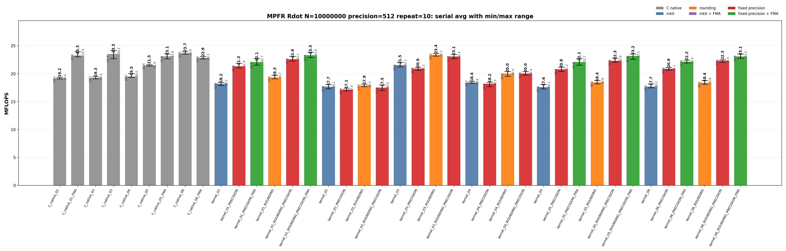
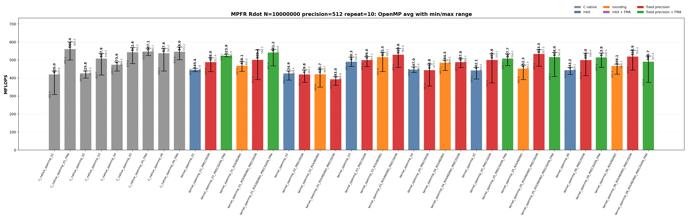
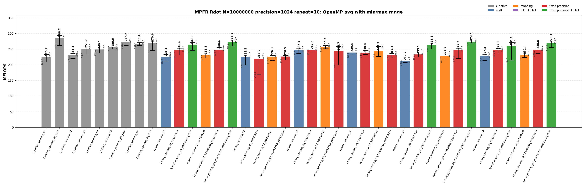

<!-- SPDX-License-Identifier: BSD-2-Clause -->

# 00_Rdot

This directory benchmarks the MPFR real dot product

```text
sum_i x_i * y_i
```

with raw MPFR C kernels and `mpfrxx::mpfr_class` wrapper kernels. The benchmark is organized like `benchmarks/mpfr/02_Rgemv`: numbered variants describe the source-level kernel shape, while suffixes describe source modifiers and build modifiers. The goal is to make temporary lifetime, rounding capture, FMA build options, fixed-precision assumptions, and OpenMP worker loops directly visible from the executable name and result class.

## Build

From the repository root:

```bash
cmake -S . -B build_bench_release -DCMAKE_BUILD_TYPE=Release
cmake --build build_bench_release -j
```

Executables are created under:

```text
build_bench_release/benchmarks/mpfr/00_Rdot/
```

Each executable takes `<vector size> <precision>`. Example:

```bash
build_bench_release/benchmarks/mpfr/00_Rdot/Rdot_mpfr_kernel_05_ROUNDING_PRECISION_FMA 10000000 512
```

The repeat runner uses the same source/build taxonomy:

```bash
OMP_NUM_THREADS=32 OMP_PLACES=cores OMP_PROC_BIND=spread \
    benchmarks/mpfr/00_Rdot/run_repeat.sh build_bench_release 10000000 512 10
```

MPFR Rdot wrapper targets omit a separate `mkII` implementation suffix because this directory has only the mkII wrapper implementation. The target suffixes separate source changes from build flags:

| Suffix | Kind | Meaning |
| --- | --- | --- |
| none | source baseline | Ordinary wrapper source for the numbered algorithm. |
| `ROUNDING` | source modifier | Captures an explicit `mpfr_rnd_t` before the loop and uses `with_rounding` in the timed body. No compile-time flag is implied. |
| `PRECISION` | build modifier | Builds the same source with `GMPFRXX_MKII_FAST_FIXED_PREC`. |
| final `FMA` | build modifier | Builds the FMA-capturable source with `GMPFRXX_MKII_ENABLE_FMA`. |

The C native targets encode rounding and FMA directly in their source, so they do not split into `ROUNDING` and non-`ROUNDING` forms.

The cross-benchmark runner can execute the GMP and MPFR `00_Rdot`, `01_Raxpy`, and `02_Rgemv` suites for both standard precisions with one command:

```bash
OMP_NUM_THREADS=32 OMP_PLACES=cores OMP_PROC_BIND=spread \
    benchmarks/run_all.sh build_bench_release 512,1024 10 10000000 10000000 4000 4000
```

The second argument is a precision list. `both` and `all` are aliases for `512,1024`; a single value such as `512` still runs only that precision. Per-benchmark results are written to `results_raw/run_all_p512_repeat10_<timestamp>/` and `results_raw/run_all_p1024_repeat10_<timestamp>/` under each benchmark directory.

## Benchmark Parameters

| Parameter | Meaning |
| --- | --- |
| `N` | Number of vector elements. |
| `precision` | MPFR precision in bits for all input values and accumulators. |
| `repeat` | Number of timed process executions per executable. |
| `OMP_NUM_THREADS` | OpenMP worker count for `openmp` executables. |
| `OMP_PLACES`, `OMP_PROC_BIND` | OpenMP affinity controls used by the runner. |

The committed runs use `N=10000000`, `repeat=10`, `precision=512` and `precision=1024`, with `OMP_NUM_THREADS=32`, `OMP_PLACES=cores`, and `OMP_PROC_BIND=spread`.

## Variant Shapes

The timed body is `_Rdot()`. The numbered variant is written as a one-step transition: each row says what changed from the previous source shape and why that change is measured. `ROUNDING`, `PRECISION`, and final `FMA` suffixes modify the same numbered shape without changing the variant number.

| Variant | Transition from previous variant | Timed source shape | Temporary/resource policy | Purpose |
| --- | --- | --- | --- | --- |
| `01` | Starting point. | `acc += dx[i] * dy[i]` | Expression product is formed in the compound assignment. | Test the ET spelling. `FMA` builds can lower this source to one `mpfr_fma` call per element. |
| `02` | `01 -> 02`: force product materialization inside the loop. | `mpfr_class templ = dx[i] * dy[i]; acc += templ;` | Loop-local product object is constructed and destroyed inside every iteration. | Intentionally expensive control for temporary lifetime. |
| `03` | `02 -> 03`: move the product object outside the loop. | `templ = dx[i] * dy[i]; acc += templ;` | One product object is initialized before the loop and reused. | Main reusable-product split multiply/add wrapper shape. |
| `04` | `03 -> 04`: change product spelling to copy-then-multiply. | `templ = dx[i]; templ *= dy[i]; acc += templ;` | One product object is reused, but each iteration copies `dx[i]` before multiplication. | Separate product-object reuse from copy-then-multiply spelling. |
| `05` | `04 -> 05`: add accumulator unrolling and remove product materialization. | Four accumulators with direct `accN += dx[i+k] * dy[i+k]` updates. | No product object is materialized in the source. | FMA-capturable four-accumulator source. |
| `06` | `05 -> 06`: keep the direct-expression unrolled class for the second native FMA comparison point. | Four accumulators with direct `accN += dx[i+k] * dy[i+k]` updates. | No product object is materialized in the source. | Paired with `C_native_06_FMA`; expected to be in the same hot-loop class as `05`. |

Serial and OpenMP wrapper variants use the same numbering. OpenMP variants use per-thread partial accumulators and perform the final reduction outside the per-worker hot loop.

## Source Transitions

A variant number changes the source shape; suffixes then ask separate questions about rounding capture, FMA enablement, and fixed precision. For every numbered wrapper variant `01` through `06`, including the matching OpenMP variant, the generated wrapper target family is:

```text
<base>
<base>_PRECISION
<base>_ROUNDING
<base>_ROUNDING_PRECISION
```

`FMA` is a build modifier, not a separate source file. It is generated only for FMA-capturable source variants `01`, `05`, and `06`, always paired with fixed precision:

```text
<base>_PRECISION_FMA
<base>_ROUNDING_PRECISION_FMA
```

Variants `02` through `04` intentionally materialize product temporaries, so an FMA target for those source files would not measure the same source-level shape.

## C Native Equivalent Kernels

The mapping is based on the timed `_Rdot()` source shape and generated hot loop, not just on matching numeric suffixes. Raw C kernels encode rounding and FMA directly; wrapper kernels use suffixes to isolate those effects.

| C native kernel | Equivalent C++ wrapper kernel(s) | Equivalence basis |
| --- | --- | --- |
| `C_native_01` | closest to `kernel_02` | Legacy raw C loop-local product control. It is not the exact equivalent of wrapper `01` expression syntax. |
| `C_native_01_FMA` | `kernel_01_PRECISION_FMA`, `kernel_01_ROUNDING_PRECISION_FMA` | One `mpfr_fma` call per element when ET FMA capture succeeds. |
| `C_native_02` | `kernel_02`, `kernel_02_PRECISION`, `kernel_02_ROUNDING`, `kernel_02_ROUNDING_PRECISION` | Loop-local product object. |
| `C_native_03` | `kernel_03`, `kernel_03_PRECISION`, `kernel_03_ROUNDING`, `kernel_03_ROUNDING_PRECISION` | One reusable product object with split multiply/add. |
| `C_native_04` | `kernel_04`, `kernel_04_PRECISION`, `kernel_04_ROUNDING`, `kernel_04_ROUNDING_PRECISION` | Copy-then-multiply reusable product. |
| `C_native_05_FMA` | `kernel_05_PRECISION_FMA`, `kernel_05_ROUNDING_PRECISION_FMA` | Four accumulators with one direct `mpfr_fma`-class update per lane. |
| `C_native_06_FMA` | `kernel_06_PRECISION_FMA`, `kernel_06_ROUNDING_PRECISION_FMA` | Four accumulators with one direct `mpfr_fma`-class update per lane. |
| `C_native_openmp_NN` | `kernel_openmp_NN`, `kernel_openmp_NN_PRECISION`, `kernel_openmp_NN_ROUNDING`, `kernel_openmp_NN_ROUNDING_PRECISION` | Same OpenMP partitioning and non-FMA temporary policy as the raw C variant. |
| `C_native_openmp_NN_FMA` | `kernel_openmp_NN_PRECISION_FMA`, `kernel_openmp_NN_ROUNDING_PRECISION_FMA` for FMA-capable `NN` | Same OpenMP partitioning, with FMA-capturable wrapper source and FMA-enabled build. |

There is no exact raw C source equivalent for the non-FMA wrapper expression spelling `acc += dx[i] * dy[i]`; raw C must choose either split `mpfr_mul` plus `mpfr_add`, or fused `mpfr_fma`.

## Recorded Run

### 512-bit run

| Field | Value |
|-------|-------|
| Run ID | `run_all_p512_repeat10_20260527_094954` |
| Date | 2026-05-27 |
| CPU | AMD Ryzen Threadripper 3970X 32-Core Processor |
| OS | Linux 6.8.0-94-generic x86_64 |
| Compiler | `c++ (Ubuntu 15.2.0-16ubuntu1) 15.2.0` |
| Build type | Release |
| Problem size | `N=10000000` |
| Precision | 512 bits |
| Repeat count | 10 |
| OpenMP | `OMP_NUM_THREADS=32`, `OMP_PLACES=cores`, `OMP_PROC_BIND=spread` |
| Default precision env | `MPFRXX_DEFAULT_PRECISION_BITS=512` |
| Benchmark command | `OMP_NUM_THREADS=32 OMP_PLACES=cores OMP_PROC_BIND=spread benchmarks/run_all.sh build_bench_release 512,1024 10` |
| Raw result directory | `benchmarks/mpfr/00_Rdot/results_raw/run_all_p512_repeat10_20260527_094954/` |
| Raw log | `benchmarks/mpfr/00_Rdot/results_raw/run_all_p512_repeat10_20260527_094954/benchmark_rdot_mpfr_n10000000_p512_repeat10.log` |
| Raw CSV | `benchmarks/mpfr/00_Rdot/results_raw/run_all_p512_repeat10_20260527_094954/raw_rdot_mpfr_n10000000_p512_repeat10.csv` |
| Summary CSV | `benchmarks/mpfr/00_Rdot/results_raw/run_all_p512_repeat10_20260527_094954/summary_rdot_mpfr_n10000000_p512_repeat10.csv` |
| Correctness | 780 / 780 runs reported OK. |





Plot regeneration command:

```bash
python3 benchmarks/mpfr/00_Rdot/plot_repeat_summary.py \
    benchmarks/mpfr/00_Rdot/results_raw/run_all_p512_repeat10_20260527_094954/benchmark_rdot_mpfr_n10000000_p512_repeat10.log \
    --output-dir benchmarks/mpfr/00_Rdot/results_raw/run_all_p512_repeat10_20260527_094954 \
    --output-prefix rdot_mpfr_n10000000_p512_repeat10 \
    --title-prefix "MPFR Rdot N=10000000, precision=512, repeat=10"
```

### 1024-bit run

| Field | Value |
|-------|-------|
| Run ID | `run_all_p1024_repeat10_20260527_094954` |
| Date | 2026-05-27 |
| CPU | AMD Ryzen Threadripper 3970X 32-Core Processor |
| OS | Linux 6.8.0-94-generic x86_64 |
| Compiler | `c++ (Ubuntu 15.2.0-16ubuntu1) 15.2.0` |
| Build type | Release |
| Problem size | `N=10000000` |
| Precision | 1024 bits |
| Repeat count | 10 |
| OpenMP | `OMP_NUM_THREADS=32`, `OMP_PLACES=cores`, `OMP_PROC_BIND=spread` |
| Default precision env | `MPFRXX_DEFAULT_PRECISION_BITS=1024` |
| Benchmark command | `OMP_NUM_THREADS=32 OMP_PLACES=cores OMP_PROC_BIND=spread benchmarks/run_all.sh build_bench_release 512,1024 10` |
| Raw result directory | `benchmarks/mpfr/00_Rdot/results_raw/run_all_p1024_repeat10_20260527_094954/` |
| Raw log | `benchmarks/mpfr/00_Rdot/results_raw/run_all_p1024_repeat10_20260527_094954/benchmark_rdot_mpfr_n10000000_p1024_repeat10.log` |
| Raw CSV | `benchmarks/mpfr/00_Rdot/results_raw/run_all_p1024_repeat10_20260527_094954/raw_rdot_mpfr_n10000000_p1024_repeat10.csv` |
| Summary CSV | `benchmarks/mpfr/00_Rdot/results_raw/run_all_p1024_repeat10_20260527_094954/summary_rdot_mpfr_n10000000_p1024_repeat10.csv` |
| Correctness | 780 / 780 runs reported OK. |




Plot regeneration command:

```bash
python3 benchmarks/mpfr/00_Rdot/plot_repeat_summary.py \
    benchmarks/mpfr/00_Rdot/results_raw/run_all_p1024_repeat10_20260527_094954/benchmark_rdot_mpfr_n10000000_p1024_repeat10.log \
    --output-dir benchmarks/mpfr/00_Rdot/results_raw/run_all_p1024_repeat10_20260527_094954 \
    --output-prefix rdot_mpfr_n10000000_p1024_repeat10 \
    --title-prefix "MPFR Rdot N=10000000, precision=1024, repeat=10"
```

## Resource or Bandwidth Estimates

The values below are model estimates derived from MFLOPS, not hardware-counter measurements. They count active limb bytes plus a header-inclusive object model. They exclude allocator metadata, cache-line overfetch, instruction fetch, and final OpenMP reduction traffic.

| Case | Representative best-avg variant | Avg MFLOPS | Active bytes/iteration | Header-inclusive bytes/iteration | Active GB/s | Header-inclusive GB/s |
| --- | --- | --- | --- | --- | --- | --- |
| 512-bit serial | `C_native_06` | 23.688 | 128 | 192 | 1.516 | 2.274 |
| 512-bit OpenMP | `C_native_openmp_01_FMA` | 560.417 | 128 | 192 | 35.867 | 53.800 |
| 1024-bit serial | `kernel_05_ROUNDING_PRECISION_FMA` | 10.183 | 256 | 320 | 1.303 | 1.629 |
| 1024-bit OpenMP | `C_native_openmp_01_FMA` | 286.659 | 256 | 320 | 36.692 | 45.865 |

For `Rdot`, the per-iteration byte model is a compact arithmetic-stream estimate. It is not a full cache-footprint or hardware-bandwidth measurement.

## Headline Results

The headline rows below are regenerated from the committed 512-bit and 1024-bit `run_all` summary CSV files.

| Precision | Class | Variant | Max MFLOPS | Avg MFLOPS | Interpretation |
| --- | --- | --- | --- | --- | --- |
| 512 | Best max serial | `C_native_03` | 24.172 | 23.544 | Raw C reference for the numbered source shape. |
| 512 | Best average serial | `C_native_06` | 23.936 | 23.688 | Raw C reference for the numbered source shape. |
| 512 | Best max OpenMP | `C_native_openmp_01_FMA` | 600.518 | 560.417 | Raw C FMA reference; the hot loop uses the fused backend operation where the source shape permits it. |
| 512 | Best average OpenMP | `C_native_openmp_01_FMA` | 600.518 | 560.417 | Raw C FMA reference; the hot loop uses the fused backend operation where the source shape permits it. |
| 1024 | Best max serial | `kernel_05_ROUNDING_PRECISION_FMA` | 10.425 | 10.183 | Wrapper fixed-precision FMA build for an FMA-capturable expression shape. |
| 1024 | Best average serial | `kernel_05_ROUNDING_PRECISION_FMA` | 10.425 | 10.183 | Wrapper fixed-precision FMA build for an FMA-capturable expression shape. |
| 1024 | Best max OpenMP | `C_native_openmp_01_FMA` | 293.591 | 286.659 | Raw C FMA reference; the hot loop uses the fused backend operation where the source shape permits it. |
| 1024 | Best average OpenMP | `C_native_openmp_01_FMA` | 293.591 | 286.659 | Raw C FMA reference; the hot loop uses the fused backend operation where the source shape permits it. |

## Serial Results

### 512-bit serial interpretation

These rows are derived from `benchmarks/mpfr/00_Rdot/results_raw/run_all_p512_repeat10_20260527_094954/summary_rdot_mpfr_n10000000_p512_repeat10.csv`.

| Observation | Variant | Max MFLOPS | Avg MFLOPS | Min MFLOPS | Interpretation |
| --- | --- | --- | --- | --- | --- |
| Best raw C average | `C_native_06` | 23.936 | 23.688 | 23.497 | Raw C reference for the numbered source shape. |
| Best wrapper baseline average | `kernel_03` | 22.067 | 21.533 | 21.199 | Wrapper baseline for the numbered source shape. |
| Best wrapper rounding average | `kernel_03_ROUNDING` | 23.655 | 23.392 | 23.154 | Wrapper source captures rounding outside the loop to avoid default-rounding lookup in the timed body. |
| Best wrapper precision average | `kernel_03_ROUNDING_PRECISION` | 23.441 | 23.103 | 22.695 | Wrapper source captures rounding outside the loop and uses the fixed-precision build. |
| Best wrapper FMA average | `kernel_01_ROUNDING_PRECISION_FMA` | 23.855 | 23.286 | 22.895 | Wrapper fixed-precision FMA build for an FMA-capturable expression shape. |
| Best max | `C_native_03` | 24.172 | 23.544 | 22.683 | Raw C reference for the numbered source shape. |

<details>
<summary>512-bit serial results sorted by Max MFLOPS</summary>

| Rank | Variant | Max MFLOPS | Avg MFLOPS | Min MFLOPS |
| --- | --- | --- | --- | --- |
| 1 | `C_native_03` | 24.172 | 23.544 | 22.683 |
| 2 | `C_native_01_FMA` | 23.944 | 23.257 | 23.016 |
| 3 | `C_native_06` | 23.936 | 23.688 | 23.497 |
| 4 | `kernel_01_ROUNDING_PRECISION_FMA` | 23.855 | 23.286 | 22.895 |
| 5 | `kernel_03_ROUNDING` | 23.655 | 23.392 | 23.154 |
| 6 | `C_native_05_FMA` | 23.563 | 23.130 | 22.636 |
| 7 | `kernel_06_ROUNDING_PRECISION_FMA` | 23.525 | 23.085 | 22.772 |
| 8 | `kernel_05_ROUNDING_PRECISION_FMA` | 23.517 | 23.181 | 22.591 |
| 9 | `kernel_03_ROUNDING_PRECISION` | 23.441 | 23.103 | 22.695 |
| 10 | `kernel_01_ROUNDING_PRECISION` | 23.122 | 22.603 | 22.275 |
| 11 | `C_native_06_FMA` | 23.092 | 22.864 | 22.640 |
| 12 | `kernel_05_ROUNDING_PRECISION` | 22.782 | 22.330 | 22.030 |
| 13 | `kernel_01_PRECISION_FMA` | 22.743 | 22.076 | 21.517 |
| 14 | `kernel_05_PRECISION_FMA` | 22.737 | 22.099 | 21.527 |
| 15 | `kernel_06_ROUNDING_PRECISION` | 22.466 | 22.310 | 22.030 |
| 16 | `kernel_06_PRECISION_FMA` | 22.430 | 22.162 | 21.922 |
| 17 | `kernel_03` | 22.067 | 21.533 | 21.199 |
| 18 | `kernel_01_PRECISION` | 21.882 | 21.317 | 21.025 |
| 19 | `C_native_05` | 21.621 | 21.509 | 21.382 |
| 20 | `kernel_05_PRECISION` | 21.179 | 20.807 | 20.401 |
| 21 | `kernel_03_PRECISION` | 21.153 | 20.901 | 20.629 |
| 22 | `kernel_06_PRECISION` | 21.116 | 20.879 | 20.636 |
| 23 | `kernel_04_ROUNDING` | 20.384 | 20.033 | 19.548 |
| 24 | `kernel_04_ROUNDING_PRECISION` | 20.363 | 20.035 | 19.773 |
| 25 | `C_native_04` | 20.040 | 19.500 | 19.320 |
| 26 | `kernel_01_ROUNDING` | 19.735 | 19.323 | 19.095 |
| 27 | `C_native_02` | 19.509 | 19.282 | 19.092 |
| 28 | `C_native_01` | 19.377 | 19.223 | 19.062 |
| 29 | `kernel_06_ROUNDING` | 18.785 | 18.390 | 18.112 |
| 30 | `kernel_05_ROUNDING` | 18.760 | 18.442 | 18.182 |
| 31 | `kernel_04` | 18.635 | 18.427 | 18.307 |
| 32 | `kernel_04_PRECISION` | 18.470 | 18.208 | 17.676 |
| 33 | `kernel_01` | 18.456 | 18.226 | 17.884 |
| 34 | `kernel_06` | 18.172 | 17.680 | 17.484 |
| 35 | `kernel_02_ROUNDING` | 18.132 | 17.886 | 17.674 |
| 36 | `kernel_05` | 18.114 | 17.598 | 17.285 |
| 37 | `kernel_02` | 18.102 | 17.683 | 17.306 |
| 38 | `kernel_02_ROUNDING_PRECISION` | 17.996 | 17.507 | 17.016 |
| 39 | `kernel_02_PRECISION` | 17.405 | 17.142 | 16.918 |

</details>

<details>
<summary>512-bit serial results sorted by Avg MFLOPS</summary>

| Rank | Variant | Max MFLOPS | Avg MFLOPS | Min MFLOPS |
| --- | --- | --- | --- | --- |
| 1 | `C_native_06` | 23.936 | 23.688 | 23.497 |
| 2 | `C_native_03` | 24.172 | 23.544 | 22.683 |
| 3 | `kernel_03_ROUNDING` | 23.655 | 23.392 | 23.154 |
| 4 | `kernel_01_ROUNDING_PRECISION_FMA` | 23.855 | 23.286 | 22.895 |
| 5 | `C_native_01_FMA` | 23.944 | 23.257 | 23.016 |
| 6 | `kernel_05_ROUNDING_PRECISION_FMA` | 23.517 | 23.181 | 22.591 |
| 7 | `C_native_05_FMA` | 23.563 | 23.130 | 22.636 |
| 8 | `kernel_03_ROUNDING_PRECISION` | 23.441 | 23.103 | 22.695 |
| 9 | `kernel_06_ROUNDING_PRECISION_FMA` | 23.525 | 23.085 | 22.772 |
| 10 | `C_native_06_FMA` | 23.092 | 22.864 | 22.640 |
| 11 | `kernel_01_ROUNDING_PRECISION` | 23.122 | 22.603 | 22.275 |
| 12 | `kernel_05_ROUNDING_PRECISION` | 22.782 | 22.330 | 22.030 |
| 13 | `kernel_06_ROUNDING_PRECISION` | 22.466 | 22.310 | 22.030 |
| 14 | `kernel_06_PRECISION_FMA` | 22.430 | 22.162 | 21.922 |
| 15 | `kernel_05_PRECISION_FMA` | 22.737 | 22.099 | 21.527 |
| 16 | `kernel_01_PRECISION_FMA` | 22.743 | 22.076 | 21.517 |
| 17 | `kernel_03` | 22.067 | 21.533 | 21.199 |
| 18 | `C_native_05` | 21.621 | 21.509 | 21.382 |
| 19 | `kernel_01_PRECISION` | 21.882 | 21.317 | 21.025 |
| 20 | `kernel_03_PRECISION` | 21.153 | 20.901 | 20.629 |
| 21 | `kernel_06_PRECISION` | 21.116 | 20.879 | 20.636 |
| 22 | `kernel_05_PRECISION` | 21.179 | 20.807 | 20.401 |
| 23 | `kernel_04_ROUNDING_PRECISION` | 20.363 | 20.035 | 19.773 |
| 24 | `kernel_04_ROUNDING` | 20.384 | 20.033 | 19.548 |
| 25 | `C_native_04` | 20.040 | 19.500 | 19.320 |
| 26 | `kernel_01_ROUNDING` | 19.735 | 19.323 | 19.095 |
| 27 | `C_native_02` | 19.509 | 19.282 | 19.092 |
| 28 | `C_native_01` | 19.377 | 19.223 | 19.062 |
| 29 | `kernel_05_ROUNDING` | 18.760 | 18.442 | 18.182 |
| 30 | `kernel_04` | 18.635 | 18.427 | 18.307 |
| 31 | `kernel_06_ROUNDING` | 18.785 | 18.390 | 18.112 |
| 32 | `kernel_01` | 18.456 | 18.226 | 17.884 |
| 33 | `kernel_04_PRECISION` | 18.470 | 18.208 | 17.676 |
| 34 | `kernel_02_ROUNDING` | 18.132 | 17.886 | 17.674 |
| 35 | `kernel_02` | 18.102 | 17.683 | 17.306 |
| 36 | `kernel_06` | 18.172 | 17.680 | 17.484 |
| 37 | `kernel_05` | 18.114 | 17.598 | 17.285 |
| 38 | `kernel_02_ROUNDING_PRECISION` | 17.996 | 17.507 | 17.016 |
| 39 | `kernel_02_PRECISION` | 17.405 | 17.142 | 16.918 |

</details>

### 1024-bit serial interpretation

These rows are derived from `benchmarks/mpfr/00_Rdot/results_raw/run_all_p1024_repeat10_20260527_094954/summary_rdot_mpfr_n10000000_p1024_repeat10.csv`.

| Observation | Variant | Max MFLOPS | Avg MFLOPS | Min MFLOPS | Interpretation |
| --- | --- | --- | --- | --- | --- |
| Best raw C average | `C_native_01_FMA` | 10.396 | 10.150 | 10.038 | Raw C FMA reference; the hot loop uses the fused backend operation where the source shape permits it. |
| Best wrapper baseline average | `kernel_03` | 9.343 | 9.276 | 9.207 | Wrapper baseline for the numbered source shape. |
| Best wrapper rounding average | `kernel_03_ROUNDING_PRECISION` | 9.522 | 9.456 | 9.391 | Wrapper source captures rounding outside the loop and uses the fixed-precision build. |
| Best wrapper precision average | `kernel_03_ROUNDING_PRECISION` | 9.522 | 9.456 | 9.391 | Wrapper source captures rounding outside the loop and uses the fixed-precision build. |
| Best wrapper FMA average | `kernel_05_ROUNDING_PRECISION_FMA` | 10.425 | 10.183 | 10.084 | Wrapper fixed-precision FMA build for an FMA-capturable expression shape. |
| Best max | `kernel_05_ROUNDING_PRECISION_FMA` | 10.425 | 10.183 | 10.084 | Wrapper fixed-precision FMA build for an FMA-capturable expression shape. |

<details>
<summary>1024-bit serial results sorted by Max MFLOPS</summary>

| Rank | Variant | Max MFLOPS | Avg MFLOPS | Min MFLOPS |
| --- | --- | --- | --- | --- |
| 1 | `kernel_05_ROUNDING_PRECISION_FMA` | 10.425 | 10.183 | 10.084 |
| 2 | `C_native_01_FMA` | 10.396 | 10.150 | 10.038 |
| 3 | `C_native_05_FMA` | 10.380 | 10.113 | 9.970 |
| 4 | `kernel_01_ROUNDING_PRECISION_FMA` | 10.244 | 10.127 | 10.016 |
| 5 | `kernel_06_ROUNDING_PRECISION_FMA` | 10.240 | 10.148 | 10.038 |
| 6 | `C_native_06_FMA` | 10.215 | 10.083 | 9.931 |
| 7 | `C_native_06` | 10.051 | 9.949 | 9.859 |
| 8 | `kernel_06_PRECISION_FMA` | 10.050 | 9.924 | 9.853 |
| 9 | `kernel_05_PRECISION_FMA` | 10.039 | 9.912 | 9.776 |
| 10 | `kernel_01_PRECISION_FMA` | 9.995 | 9.922 | 9.828 |
| 11 | `C_native_04` | 9.619 | 9.380 | 9.281 |
| 12 | `C_native_03` | 9.585 | 9.497 | 9.425 |
| 13 | `C_native_05` | 9.584 | 9.482 | 9.387 |
| 14 | `kernel_03_ROUNDING_PRECISION` | 9.522 | 9.456 | 9.391 |
| 15 | `kernel_03_ROUNDING` | 9.470 | 9.417 | 9.339 |
| 16 | `kernel_04_ROUNDING_PRECISION` | 9.428 | 9.355 | 9.281 |
| 17 | `kernel_04_ROUNDING` | 9.427 | 9.377 | 9.318 |
| 18 | `kernel_01_ROUNDING_PRECISION` | 9.388 | 9.287 | 9.215 |
| 19 | `kernel_03` | 9.343 | 9.276 | 9.207 |
| 20 | `kernel_03_PRECISION` | 9.336 | 9.292 | 9.221 |
| 21 | `kernel_05_ROUNDING_PRECISION` | 9.270 | 9.199 | 9.106 |
| 22 | `kernel_06_ROUNDING_PRECISION` | 9.265 | 9.176 | 9.063 |
| 23 | `kernel_06_PRECISION` | 9.243 | 9.165 | 9.072 |
| 24 | `kernel_05_PRECISION` | 9.222 | 9.170 | 9.090 |
| 25 | `kernel_01_PRECISION` | 9.206 | 9.111 | 9.026 |
| 26 | `kernel_04` | 9.075 | 9.002 | 8.950 |
| 27 | `kernel_04_PRECISION` | 9.037 | 8.970 | 8.863 |
| 28 | `kernel_06_ROUNDING` | 8.885 | 8.672 | 8.568 |
| 29 | `C_native_02` | 8.770 | 8.566 | 8.515 |
| 30 | `kernel_05_ROUNDING` | 8.686 | 8.624 | 8.543 |
| 31 | `C_native_01` | 8.634 | 8.583 | 8.534 |
| 32 | `kernel_06` | 8.608 | 8.498 | 8.378 |
| 33 | `kernel_01` | 8.597 | 8.500 | 8.446 |
| 34 | `kernel_01_ROUNDING` | 8.588 | 8.510 | 8.470 |
| 35 | `kernel_05` | 8.575 | 8.494 | 8.406 |
| 36 | `kernel_02_ROUNDING` | 8.519 | 8.362 | 8.222 |
| 37 | `kernel_02_ROUNDING_PRECISION` | 8.494 | 8.409 | 8.337 |
| 38 | `kernel_02_PRECISION` | 8.443 | 8.374 | 8.281 |
| 39 | `kernel_02` | 8.431 | 8.375 | 8.307 |

</details>

<details>
<summary>1024-bit serial results sorted by Avg MFLOPS</summary>

| Rank | Variant | Max MFLOPS | Avg MFLOPS | Min MFLOPS |
| --- | --- | --- | --- | --- |
| 1 | `kernel_05_ROUNDING_PRECISION_FMA` | 10.425 | 10.183 | 10.084 |
| 2 | `C_native_01_FMA` | 10.396 | 10.150 | 10.038 |
| 3 | `kernel_06_ROUNDING_PRECISION_FMA` | 10.240 | 10.148 | 10.038 |
| 4 | `kernel_01_ROUNDING_PRECISION_FMA` | 10.244 | 10.127 | 10.016 |
| 5 | `C_native_05_FMA` | 10.380 | 10.113 | 9.970 |
| 6 | `C_native_06_FMA` | 10.215 | 10.083 | 9.931 |
| 7 | `C_native_06` | 10.051 | 9.949 | 9.859 |
| 8 | `kernel_06_PRECISION_FMA` | 10.050 | 9.924 | 9.853 |
| 9 | `kernel_01_PRECISION_FMA` | 9.995 | 9.922 | 9.828 |
| 10 | `kernel_05_PRECISION_FMA` | 10.039 | 9.912 | 9.776 |
| 11 | `C_native_03` | 9.585 | 9.497 | 9.425 |
| 12 | `C_native_05` | 9.584 | 9.482 | 9.387 |
| 13 | `kernel_03_ROUNDING_PRECISION` | 9.522 | 9.456 | 9.391 |
| 14 | `kernel_03_ROUNDING` | 9.470 | 9.417 | 9.339 |
| 15 | `C_native_04` | 9.619 | 9.380 | 9.281 |
| 16 | `kernel_04_ROUNDING` | 9.427 | 9.377 | 9.318 |
| 17 | `kernel_04_ROUNDING_PRECISION` | 9.428 | 9.355 | 9.281 |
| 18 | `kernel_03_PRECISION` | 9.336 | 9.292 | 9.221 |
| 19 | `kernel_01_ROUNDING_PRECISION` | 9.388 | 9.287 | 9.215 |
| 20 | `kernel_03` | 9.343 | 9.276 | 9.207 |
| 21 | `kernel_05_ROUNDING_PRECISION` | 9.270 | 9.199 | 9.106 |
| 22 | `kernel_06_ROUNDING_PRECISION` | 9.265 | 9.176 | 9.063 |
| 23 | `kernel_05_PRECISION` | 9.222 | 9.170 | 9.090 |
| 24 | `kernel_06_PRECISION` | 9.243 | 9.165 | 9.072 |
| 25 | `kernel_01_PRECISION` | 9.206 | 9.111 | 9.026 |
| 26 | `kernel_04` | 9.075 | 9.002 | 8.950 |
| 27 | `kernel_04_PRECISION` | 9.037 | 8.970 | 8.863 |
| 28 | `kernel_06_ROUNDING` | 8.885 | 8.672 | 8.568 |
| 29 | `kernel_05_ROUNDING` | 8.686 | 8.624 | 8.543 |
| 30 | `C_native_01` | 8.634 | 8.583 | 8.534 |
| 31 | `C_native_02` | 8.770 | 8.566 | 8.515 |
| 32 | `kernel_01_ROUNDING` | 8.588 | 8.510 | 8.470 |
| 33 | `kernel_01` | 8.597 | 8.500 | 8.446 |
| 34 | `kernel_06` | 8.608 | 8.498 | 8.378 |
| 35 | `kernel_05` | 8.575 | 8.494 | 8.406 |
| 36 | `kernel_02_ROUNDING_PRECISION` | 8.494 | 8.409 | 8.337 |
| 37 | `kernel_02` | 8.431 | 8.375 | 8.307 |
| 38 | `kernel_02_PRECISION` | 8.443 | 8.374 | 8.281 |
| 39 | `kernel_02_ROUNDING` | 8.519 | 8.362 | 8.222 |

</details>

## OpenMP Results

### 512-bit OpenMP interpretation

These rows are derived from `benchmarks/mpfr/00_Rdot/results_raw/run_all_p512_repeat10_20260527_094954/summary_rdot_mpfr_n10000000_p512_repeat10.csv`.

| Observation | Variant | Max MFLOPS | Avg MFLOPS | Min MFLOPS | Interpretation |
| --- | --- | --- | --- | --- | --- |
| Best raw C average | `C_native_openmp_01_FMA` | 600.518 | 560.417 | 500.235 | Raw C FMA reference; the hot loop uses the fused backend operation where the source shape permits it. |
| Best wrapper baseline average | `kernel_openmp_03` | 516.756 | 490.294 | 464.448 | Wrapper baseline for the numbered source shape. |
| Best wrapper rounding average | `kernel_openmp_05_ROUNDING_PRECISION` | 557.501 | 533.461 | 465.454 | Wrapper source captures rounding outside the loop and uses the fixed-precision build. |
| Best wrapper precision average | `kernel_openmp_05_ROUNDING_PRECISION` | 557.501 | 533.461 | 465.454 | Wrapper source captures rounding outside the loop and uses the fixed-precision build. |
| Best wrapper FMA average | `kernel_openmp_01_ROUNDING_PRECISION_FMA` | 559.780 | 541.192 | 467.392 | Wrapper fixed-precision FMA build for an FMA-capturable expression shape. |
| Best max | `C_native_openmp_01_FMA` | 600.518 | 560.417 | 500.235 | Raw C FMA reference; the hot loop uses the fused backend operation where the source shape permits it. |

<details>
<summary>512-bit OpenMP results sorted by Max MFLOPS</summary>

| Rank | Variant | Max MFLOPS | Avg MFLOPS | Min MFLOPS |
| --- | --- | --- | --- | --- |
| 1 | `C_native_openmp_01_FMA` | 600.518 | 560.417 | 500.235 |
| 2 | `C_native_openmp_06_FMA` | 572.219 | 546.030 | 501.606 |
| 3 | `C_native_openmp_05` | 569.225 | 542.556 | 479.928 |
| 4 | `C_native_openmp_05_FMA` | 565.742 | 547.085 | 524.524 |
| 5 | `C_native_openmp_06` | 565.260 | 537.629 | 438.332 |
| 6 | `kernel_openmp_03_ROUNDING_PRECISION` | 563.435 | 529.627 | 459.353 |
| 7 | `kernel_openmp_01_ROUNDING_PRECISION_FMA` | 559.780 | 541.192 | 467.392 |
| 8 | `kernel_openmp_05_ROUNDING_PRECISION` | 557.501 | 533.461 | 465.454 |
| 9 | `kernel_openmp_01_ROUNDING_PRECISION` | 556.252 | 500.416 | 390.989 |
| 10 | `kernel_openmp_06_ROUNDING_PRECISION` | 554.163 | 518.896 | 443.918 |
| 11 | `kernel_openmp_03_ROUNDING` | 543.052 | 515.460 | 435.827 |
| 12 | `kernel_openmp_05_ROUNDING_PRECISION_FMA` | 541.935 | 516.000 | 408.448 |
| 13 | `kernel_openmp_06_PRECISION_FMA` | 538.453 | 513.897 | 459.001 |
| 14 | `kernel_openmp_06_PRECISION` | 538.037 | 498.966 | 412.913 |
| 15 | `C_native_openmp_03` | 536.475 | 507.944 | 416.704 |
| 16 | `kernel_openmp_05_PRECISION_FMA` | 534.341 | 507.661 | 468.736 |
| 17 | `kernel_openmp_05_PRECISION` | 533.706 | 499.829 | 372.715 |
| 18 | `kernel_openmp_01_PRECISION_FMA` | 531.525 | 523.932 | 518.092 |
| 19 | `kernel_openmp_06_ROUNDING_PRECISION_FMA` | 521.921 | 490.724 | 375.795 |
| 20 | `kernel_openmp_03_PRECISION` | 519.111 | 498.981 | 463.049 |
| 21 | `kernel_openmp_03` | 516.756 | 490.294 | 464.448 |
| 22 | `kernel_openmp_01_PRECISION` | 511.945 | 488.001 | 435.513 |
| 23 | `kernel_openmp_04_ROUNDING_PRECISION` | 508.127 | 487.612 | 457.468 |
| 24 | `kernel_openmp_04_ROUNDING` | 499.516 | 484.484 | 442.056 |
| 25 | `kernel_openmp_01_ROUNDING` | 490.495 | 468.131 | 437.314 |
| 26 | `C_native_openmp_04` | 489.517 | 473.938 | 438.748 |
| 27 | `kernel_openmp_04_PRECISION` | 477.704 | 443.817 | 355.559 |
| 28 | `kernel_openmp_06_ROUNDING` | 476.723 | 466.138 | 421.445 |
| 29 | `kernel_openmp_05_ROUNDING` | 471.874 | 452.260 | 390.793 |
| 30 | `kernel_openmp_04` | 461.927 | 447.006 | 430.872 |
| 31 | `kernel_openmp_06` | 459.144 | 443.243 | 419.895 |
| 32 | `kernel_openmp_05` | 458.992 | 442.113 | 394.095 |
| 33 | `kernel_openmp_01` | 452.836 | 445.382 | 435.203 |
| 34 | `kernel_openmp_02_ROUNDING` | 449.680 | 420.679 | 349.571 |
| 35 | `kernel_openmp_02_PRECISION` | 445.230 | 419.804 | 375.795 |
| 36 | `kernel_openmp_02` | 439.508 | 424.928 | 388.495 |
| 37 | `C_native_openmp_02` | 439.302 | 425.755 | 399.767 |
| 38 | `C_native_openmp_01` | 438.847 | 419.957 | 308.386 |
| 39 | `kernel_openmp_02_ROUNDING_PRECISION` | 408.847 | 393.007 | 360.021 |

</details>

<details>
<summary>512-bit OpenMP results sorted by Avg MFLOPS</summary>

| Rank | Variant | Max MFLOPS | Avg MFLOPS | Min MFLOPS |
| --- | --- | --- | --- | --- |
| 1 | `C_native_openmp_01_FMA` | 600.518 | 560.417 | 500.235 |
| 2 | `C_native_openmp_05_FMA` | 565.742 | 547.085 | 524.524 |
| 3 | `C_native_openmp_06_FMA` | 572.219 | 546.030 | 501.606 |
| 4 | `C_native_openmp_05` | 569.225 | 542.556 | 479.928 |
| 5 | `kernel_openmp_01_ROUNDING_PRECISION_FMA` | 559.780 | 541.192 | 467.392 |
| 6 | `C_native_openmp_06` | 565.260 | 537.629 | 438.332 |
| 7 | `kernel_openmp_05_ROUNDING_PRECISION` | 557.501 | 533.461 | 465.454 |
| 8 | `kernel_openmp_03_ROUNDING_PRECISION` | 563.435 | 529.627 | 459.353 |
| 9 | `kernel_openmp_01_PRECISION_FMA` | 531.525 | 523.932 | 518.092 |
| 10 | `kernel_openmp_06_ROUNDING_PRECISION` | 554.163 | 518.896 | 443.918 |
| 11 | `kernel_openmp_05_ROUNDING_PRECISION_FMA` | 541.935 | 516.000 | 408.448 |
| 12 | `kernel_openmp_03_ROUNDING` | 543.052 | 515.460 | 435.827 |
| 13 | `kernel_openmp_06_PRECISION_FMA` | 538.453 | 513.897 | 459.001 |
| 14 | `C_native_openmp_03` | 536.475 | 507.944 | 416.704 |
| 15 | `kernel_openmp_05_PRECISION_FMA` | 534.341 | 507.661 | 468.736 |
| 16 | `kernel_openmp_01_ROUNDING_PRECISION` | 556.252 | 500.416 | 390.989 |
| 17 | `kernel_openmp_05_PRECISION` | 533.706 | 499.829 | 372.715 |
| 18 | `kernel_openmp_03_PRECISION` | 519.111 | 498.981 | 463.049 |
| 19 | `kernel_openmp_06_PRECISION` | 538.037 | 498.966 | 412.913 |
| 20 | `kernel_openmp_06_ROUNDING_PRECISION_FMA` | 521.921 | 490.724 | 375.795 |
| 21 | `kernel_openmp_03` | 516.756 | 490.294 | 464.448 |
| 22 | `kernel_openmp_01_PRECISION` | 511.945 | 488.001 | 435.513 |
| 23 | `kernel_openmp_04_ROUNDING_PRECISION` | 508.127 | 487.612 | 457.468 |
| 24 | `kernel_openmp_04_ROUNDING` | 499.516 | 484.484 | 442.056 |
| 25 | `C_native_openmp_04` | 489.517 | 473.938 | 438.748 |
| 26 | `kernel_openmp_01_ROUNDING` | 490.495 | 468.131 | 437.314 |
| 27 | `kernel_openmp_06_ROUNDING` | 476.723 | 466.138 | 421.445 |
| 28 | `kernel_openmp_05_ROUNDING` | 471.874 | 452.260 | 390.793 |
| 29 | `kernel_openmp_04` | 461.927 | 447.006 | 430.872 |
| 30 | `kernel_openmp_01` | 452.836 | 445.382 | 435.203 |
| 31 | `kernel_openmp_04_PRECISION` | 477.704 | 443.817 | 355.559 |
| 32 | `kernel_openmp_06` | 459.144 | 443.243 | 419.895 |
| 33 | `kernel_openmp_05` | 458.992 | 442.113 | 394.095 |
| 34 | `C_native_openmp_02` | 439.302 | 425.755 | 399.767 |
| 35 | `kernel_openmp_02` | 439.508 | 424.928 | 388.495 |
| 36 | `kernel_openmp_02_ROUNDING` | 449.680 | 420.679 | 349.571 |
| 37 | `C_native_openmp_01` | 438.847 | 419.957 | 308.386 |
| 38 | `kernel_openmp_02_PRECISION` | 445.230 | 419.804 | 375.795 |
| 39 | `kernel_openmp_02_ROUNDING_PRECISION` | 408.847 | 393.007 | 360.021 |

</details>

### 1024-bit OpenMP interpretation

These rows are derived from `benchmarks/mpfr/00_Rdot/results_raw/run_all_p1024_repeat10_20260527_094954/summary_rdot_mpfr_n10000000_p1024_repeat10.csv`.

| Observation | Variant | Max MFLOPS | Avg MFLOPS | Min MFLOPS | Interpretation |
| --- | --- | --- | --- | --- | --- |
| Best raw C average | `C_native_openmp_01_FMA` | 293.591 | 286.659 | 262.342 | Raw C FMA reference; the hot loop uses the fused backend operation where the source shape permits it. |
| Best wrapper baseline average | `kernel_openmp_03` | 251.667 | 247.243 | 236.787 | Wrapper baseline for the numbered source shape. |
| Best wrapper rounding average | `kernel_openmp_03_ROUNDING` | 261.787 | 256.865 | 251.893 | Wrapper source captures rounding outside the loop to avoid default-rounding lookup in the timed body. |
| Best wrapper precision average | `kernel_openmp_06_ROUNDING_PRECISION` | 253.224 | 248.842 | 236.179 | Wrapper source captures rounding outside the loop and uses the fixed-precision build. |
| Best wrapper FMA average | `kernel_openmp_05_ROUNDING_PRECISION_FMA` | 279.075 | 274.179 | 269.293 | Wrapper fixed-precision FMA build for an FMA-capturable expression shape. |
| Best max | `C_native_openmp_01_FMA` | 293.591 | 286.659 | 262.342 | Raw C FMA reference; the hot loop uses the fused backend operation where the source shape permits it. |

<details>
<summary>1024-bit OpenMP results sorted by Max MFLOPS</summary>

| Rank | Variant | Max MFLOPS | Avg MFLOPS | Min MFLOPS |
| --- | --- | --- | --- | --- |
| 1 | `C_native_openmp_01_FMA` | 293.591 | 286.659 | 262.342 |
| 2 | `kernel_openmp_01_ROUNDING_PRECISION_FMA` | 279.657 | 272.713 | 259.758 |
| 3 | `C_native_openmp_05_FMA` | 279.440 | 272.249 | 261.916 |
| 4 | `kernel_openmp_05_ROUNDING_PRECISION_FMA` | 279.075 | 274.179 | 269.293 |
| 5 | `kernel_openmp_06_ROUNDING_PRECISION_FMA` | 276.672 | 270.118 | 255.156 |
| 6 | `C_native_openmp_06_FMA` | 276.225 | 270.608 | 245.563 |
| 7 | `kernel_openmp_01_PRECISION_FMA` | 272.164 | 264.445 | 245.560 |
| 8 | `C_native_openmp_06` | 272.130 | 266.436 | 261.876 |
| 9 | `kernel_openmp_06_PRECISION_FMA` | 272.025 | 261.195 | 214.699 |
| 10 | `kernel_openmp_05_PRECISION_FMA` | 270.399 | 263.075 | 250.765 |
| 11 | `kernel_openmp_03_ROUNDING` | 261.787 | 256.865 | 251.893 |
| 12 | `C_native_openmp_03` | 259.493 | 251.719 | 230.907 |
| 13 | `kernel_openmp_04_ROUNDING` | 259.016 | 243.547 | 226.909 |
| 14 | `kernel_openmp_03_ROUNDING_PRECISION` | 258.417 | 243.722 | 199.314 |
| 15 | `C_native_openmp_05` | 257.774 | 255.543 | 251.534 |
| 16 | `C_native_openmp_04` | 256.438 | 249.140 | 237.607 |
| 17 | `kernel_openmp_01_ROUNDING_PRECISION` | 255.291 | 248.577 | 238.018 |
| 18 | `kernel_openmp_03_PRECISION` | 254.114 | 247.630 | 241.401 |
| 19 | `kernel_openmp_06_ROUNDING_PRECISION` | 253.224 | 248.842 | 236.179 |
| 20 | `kernel_openmp_05_ROUNDING_PRECISION` | 253.049 | 247.230 | 220.217 |
| 21 | `kernel_openmp_06_PRECISION` | 252.544 | 246.999 | 234.988 |
| 22 | `kernel_openmp_01_PRECISION` | 251.708 | 246.628 | 231.665 |
| 23 | `kernel_openmp_03` | 251.667 | 247.243 | 236.787 |
| 24 | `kernel_openmp_04_PRECISION` | 245.729 | 238.823 | 233.151 |
| 25 | `kernel_openmp_04` | 244.848 | 239.415 | 230.814 |
| 26 | `kernel_openmp_05_PRECISION` | 241.706 | 233.085 | 225.388 |
| 27 | `kernel_openmp_01_ROUNDING` | 238.532 | 231.257 | 222.530 |
| 28 | `kernel_openmp_06_ROUNDING` | 237.490 | 232.379 | 223.565 |
| 29 | `kernel_openmp_04_ROUNDING_PRECISION` | 236.817 | 231.754 | 222.367 |
| 30 | `C_native_openmp_02` | 236.748 | 231.276 | 220.215 |
| 31 | `kernel_openmp_05_ROUNDING` | 235.146 | 228.248 | 215.838 |
| 32 | `C_native_openmp_01` | 233.333 | 225.730 | 209.788 |
| 33 | `kernel_openmp_01` | 233.333 | 225.562 | 211.760 |
| 34 | `kernel_openmp_06` | 232.747 | 227.507 | 213.617 |
| 35 | `kernel_openmp_02` | 231.908 | 224.482 | 199.257 |
| 36 | `kernel_openmp_02_ROUNDING` | 230.520 | 226.278 | 213.640 |
| 37 | `kernel_openmp_02_ROUNDING_PRECISION` | 230.453 | 226.454 | 216.091 |
| 38 | `kernel_openmp_02_PRECISION` | 228.623 | 218.851 | 168.574 |
| 39 | `kernel_openmp_05` | 215.944 | 212.670 | 207.474 |

</details>

<details>
<summary>1024-bit OpenMP results sorted by Avg MFLOPS</summary>

| Rank | Variant | Max MFLOPS | Avg MFLOPS | Min MFLOPS |
| --- | --- | --- | --- | --- |
| 1 | `C_native_openmp_01_FMA` | 293.591 | 286.659 | 262.342 |
| 2 | `kernel_openmp_05_ROUNDING_PRECISION_FMA` | 279.075 | 274.179 | 269.293 |
| 3 | `kernel_openmp_01_ROUNDING_PRECISION_FMA` | 279.657 | 272.713 | 259.758 |
| 4 | `C_native_openmp_05_FMA` | 279.440 | 272.249 | 261.916 |
| 5 | `C_native_openmp_06_FMA` | 276.225 | 270.608 | 245.563 |
| 6 | `kernel_openmp_06_ROUNDING_PRECISION_FMA` | 276.672 | 270.118 | 255.156 |
| 7 | `C_native_openmp_06` | 272.130 | 266.436 | 261.876 |
| 8 | `kernel_openmp_01_PRECISION_FMA` | 272.164 | 264.445 | 245.560 |
| 9 | `kernel_openmp_05_PRECISION_FMA` | 270.399 | 263.075 | 250.765 |
| 10 | `kernel_openmp_06_PRECISION_FMA` | 272.025 | 261.195 | 214.699 |
| 11 | `kernel_openmp_03_ROUNDING` | 261.787 | 256.865 | 251.893 |
| 12 | `C_native_openmp_05` | 257.774 | 255.543 | 251.534 |
| 13 | `C_native_openmp_03` | 259.493 | 251.719 | 230.907 |
| 14 | `C_native_openmp_04` | 256.438 | 249.140 | 237.607 |
| 15 | `kernel_openmp_06_ROUNDING_PRECISION` | 253.224 | 248.842 | 236.179 |
| 16 | `kernel_openmp_01_ROUNDING_PRECISION` | 255.291 | 248.577 | 238.018 |
| 17 | `kernel_openmp_03_PRECISION` | 254.114 | 247.630 | 241.401 |
| 18 | `kernel_openmp_03` | 251.667 | 247.243 | 236.787 |
| 19 | `kernel_openmp_05_ROUNDING_PRECISION` | 253.049 | 247.230 | 220.217 |
| 20 | `kernel_openmp_06_PRECISION` | 252.544 | 246.999 | 234.988 |
| 21 | `kernel_openmp_01_PRECISION` | 251.708 | 246.628 | 231.665 |
| 22 | `kernel_openmp_03_ROUNDING_PRECISION` | 258.417 | 243.722 | 199.314 |
| 23 | `kernel_openmp_04_ROUNDING` | 259.016 | 243.547 | 226.909 |
| 24 | `kernel_openmp_04` | 244.848 | 239.415 | 230.814 |
| 25 | `kernel_openmp_04_PRECISION` | 245.729 | 238.823 | 233.151 |
| 26 | `kernel_openmp_05_PRECISION` | 241.706 | 233.085 | 225.388 |
| 27 | `kernel_openmp_06_ROUNDING` | 237.490 | 232.379 | 223.565 |
| 28 | `kernel_openmp_04_ROUNDING_PRECISION` | 236.817 | 231.754 | 222.367 |
| 29 | `C_native_openmp_02` | 236.748 | 231.276 | 220.215 |
| 30 | `kernel_openmp_01_ROUNDING` | 238.532 | 231.257 | 222.530 |
| 31 | `kernel_openmp_05_ROUNDING` | 235.146 | 228.248 | 215.838 |
| 32 | `kernel_openmp_06` | 232.747 | 227.507 | 213.617 |
| 33 | `kernel_openmp_02_ROUNDING_PRECISION` | 230.453 | 226.454 | 216.091 |
| 34 | `kernel_openmp_02_ROUNDING` | 230.520 | 226.278 | 213.640 |
| 35 | `C_native_openmp_01` | 233.333 | 225.730 | 209.788 |
| 36 | `kernel_openmp_01` | 233.333 | 225.562 | 211.760 |
| 37 | `kernel_openmp_02` | 231.908 | 224.482 | 199.257 |
| 38 | `kernel_openmp_02_PRECISION` | 228.623 | 218.851 | 168.574 |
| 39 | `kernel_openmp_05` | 215.944 | 212.670 | 207.474 |

</details>

## Comparison with GMP version

MPFR and GMP `mpf` do not implement the same numerical contract. MPFR carries explicit rounding and range behavior, while GMP `mpf` follows GMP's floating-point model. The comparison below uses the same problem size, precision, repeat count, and OpenMP settings, and reports best average MFLOPS from the committed run.

| Precision | Mode | GMP best avg | MPFR best avg | MPFR / GMP | Interpretation |
| --- | --- | --- | --- | --- | --- |
| 512 | serial | `kernel_06_mkII_FIXED_PRECISION_FASTPATH` 32.961 | `C_native_06` 23.688 | 0.719 | MPFR pays explicit rounding/range semantics, but FMA and rounding-capture paths narrow the gap when the hot loop matches the raw C arithmetic class. |
| 512 | OpenMP | `kernel_openmp_03_mkII` 573.121 | `C_native_openmp_01_FMA` 560.417 | 0.978 | MPFR pays explicit rounding/range semantics, but FMA and rounding-capture paths narrow the gap when the hot loop matches the raw C arithmetic class. |
| 1024 | serial | `kernel_06_mkII_FIXED_PRECISION_FASTPATH` 11.897 | `kernel_05_ROUNDING_PRECISION_FMA` 10.183 | 0.856 | MPFR pays explicit rounding/range semantics, but FMA and rounding-capture paths narrow the gap when the hot loop matches the raw C arithmetic class. |
| 1024 | OpenMP | `kernel_openmp_03_mkII` 315.184 | `C_native_openmp_01_FMA` 286.659 | 0.909 | MPFR pays explicit rounding/range semantics, but FMA and rounding-capture paths narrow the gap when the hot loop matches the raw C arithmetic class. |

## Hotpath Disassembly

Representative commands:

```bash
objdump -Cd --no-show-raw-insn build_bench_release/benchmarks/mpfr/00_Rdot/Rdot_mpfr_C_native_01_FMA
objdump -Cd --no-show-raw-insn build_bench_release/benchmarks/mpfr/00_Rdot/Rdot_mpfr_kernel_01_ROUNDING_PRECISION_FMA
objdump -Cd --no-show-raw-insn build_bench_release/benchmarks/mpfr/00_Rdot/Rdot_mpfr_kernel_03_ROUNDING_PRECISION
```

The refreshed disassembly confirms the arithmetic class, but it does not make
the wrapper binaries byte-for-byte equivalent to raw C. The important check is
whether the hot arithmetic loop is one `mpfr_fma` call or split
`mpfr_mul`/`mpfr_add`, and whether init/clear is in the element loop.

| Representative | Hotpath observation | Comparison point |
|----------------|---------------------|------------------|
| `C_native_01_FMA` | Rounding is cached before the loop; the element loop has one `mpfr_fma` per element. Accumulator init/clear is outside the loop. | Raw FMA baseline. |
| `kernel_01_ROUNDING_PRECISION_FMA` | The arithmetic hot loop reaches `mpfr_fma` with cached rounding. Default-state setup remains in the binary, but not in the quoted element loop. | Closest mkII FMA equivalent. |
| `C_native_03` | Reusable product object with one `mpfr_mul` followed by one `mpfr_add` per element. | Raw split multiply/add baseline. |
| `kernel_03_ROUNDING_PRECISION` | Same split arithmetic class as `C_native_03`; no per-element `mpfr_init2`/`mpfr_clear` in the intended reusable-temporary loop. | Closest mkII reusable-temp equivalent. |
| `kernel_openmp_03_ROUNDING_PRECISION` | Worker loop uses the reusable split multiply/add class. Final reduction is outside the per-thread element loop. | Best max OpenMP wrapper class in the 512-bit run. |

Representative excerpts from the current binaries:

```asm
# Rdot_mpfr_C_native_01_FMA::_Rdot
2b99: call   mpfr_get_default_rounding_mode@plt
2ba9: mov    %eax,%r12d         # cached rounding mode
2bc8: test   %r13,%r13
2bcb: jle    2bf5 <_Rdot+0xa5>
2bd0: mov    %rbx,%rdx          # x/y operand
2bd3: mov    %r15,%rsi          # x/y operand
2bd6: mov    %r12d,%r8d         # cached rounding
2bd9: mov    %rbp,%rcx          # accumulator addend
2bdc: mov    %rbp,%rdi          # accumulator destination
2bdf: add    $0x1,%r14
2be3: add    $0x20,%r15
2be7: add    $0x20,%rbx
2beb: call   mpfr_fma@plt
2bf0: cmp    %r14,%r13
2bf3: jne    2bd0 <_Rdot+0x80>
2c05: call   mpfr_clear@plt
```

```asm
# Rdot_mpfr_kernel_01_ROUNDING_PRECISION_FMA::_Rdot
2d03: test   %r12,%r12
2d06: jle    2d35 <_Rdot+0xe5>
2d10: mov    %r13d,%r8d         # cached rounding
2d13: mov    %rbp,%rcx          # accumulator addend
2d16: mov    %r14,%rdx          # dy[i]
2d19: mov    %rbx,%rsi          # dx[i]
2d1c: mov    %rbp,%rdi          # accumulator destination
2d1f: call   mpfr_fma@plt
2d24: add    $0x1,%r15
2d28: add    $0x20,%rbx
2d2c: add    $0x20,%r14
2d30: cmp    %r15,%r12
2d33: jne    2d10 <_Rdot+0xc0>
2d49: add    $0x58,%rsp
```

```asm
# Rdot_mpfr_kernel_03_ROUNDING_PRECISION::_Rdot
32e5: xor    %r12d,%r12d
32e8: cmpq   $0x0,(%rsp)
32ed: jle    3324 <_Rdot+0x124>
32f0: mov    %r15d,%ecx         # cached rounding
32f3: mov    %rbp,%rdx          # dy[i]
32f6: mov    %rbx,%rsi          # dx[i]
32f9: mov    %r14,%rdi          # reusable product temp
32fc: call   mpfr_mul@plt
3301: mov    %r15d,%ecx         # cached rounding
3304: mov    %r14,%rdx          # product temp
3307: mov    %r13,%rsi          # accumulator
330a: mov    %r13,%rdi          # accumulator destination
330d: call   mpfr_add@plt
3312: add    $0x1,%r12
3316: add    $0x20,%rbx
331a: add    $0x20,%rbp
3322: jne    32f0 <_Rdot+0xf0>
3327: call   mpfr_clear@plt
```

Suffix-removal check for the same `03` source shape: the quoted
`Rdot_mpfr_kernel_03_ROUNDING_PRECISION::_Rdot` loop above is the cached
reference. After the `with_rounding(value, rnd)` API change, `ROUNDING` is the
visible hot-loop change for this explicit reusable-temporary source. Removing
`PRECISION` does not change the `03` arithmetic loop because both accumulator
and product temporaries already have fixed precision outside the loop.

| Target | Removed cache assumption | Disassembly evidence | Meaning |
|--------|--------------------------|----------------------|---------|
| `kernel_03_PRECISION` | `ROUNDING` | The element loop calls `mpfr_get_default_rounding_mode` before both `mpfr_mul` and `mpfr_add`. | Fixed precision alone does not cache rounding. |
| `kernel_03_ROUNDING` | `PRECISION` | The element loop is the same cached-rounding split `mpfr_mul` plus `mpfr_add` loop as `ROUNDING_PRECISION`. | For this explicit temporary source, fixed precision does not change the quoted hot loop. |
| `kernel_03` | `ROUNDING` and `PRECISION` | The element loop calls `mpfr_get_default_rounding_mode` before both arithmetic calls. | This is the fully uncached reusable-product baseline for the same numbered source shape. |

The `cmpb $0x0,%fs:...` instruction is the generated check for the
DSO-local `static thread_local bool initialized` used by
`initialize_mpfr_defaults_for_current_thread()`. On Linux x86-64, `%fs` is the
TLS base and the displayed displacement is a build/link-specific TLS offset,
not a meaningful absolute address. This guard is not MPFR arithmetic and is not
the rounding value passed to an MPFR operation.

In the `PRECISION` and vanilla excerpts, the first `mpfr_get_default_rounding_mode`
call following the TLS initialization-flag check belongs to the first-use
MPFR-default initialization/refresh path. Once that per-thread flag is set, the
branch skips that guarded refresh call. The later `mpfr_get_default_rounding_mode`
call is the actual rounding value passed to the MPFR operation. Because this
source shape is split `mpfr_mul` plus `mpfr_add`, removing `ROUNDING` leaves one
steady-state rounding lookup for each arithmetic operation in the element loop.

```asm
# Rdot_mpfr_kernel_03_PRECISION::_Rdot
3390: cmpb   $0x0,%fs:0xfffffffffffffff8
33b3: call   mpfr_get_default_rounding_mode@plt  # first-use default refresh path
33c0: call   mpfr_get_default_rounding_mode@plt  # rounding for mpfr_mul
33c5: mov    %rbx,%rdx          # dy[i]
33c8: mov    %rbp,%rsi          # dx[i]
33cb: mov    %r14,%rdi          # reusable product temp
33ce: mov    %eax,%ecx          # uncached rounding
33d0: call   mpfr_mul@plt
33f4: call   mpfr_get_default_rounding_mode@plt  # first-use default refresh path
3401: call   mpfr_get_default_rounding_mode@plt  # rounding for mpfr_add
3406: mov    %r14,%rdx          # product temp
3409: mov    %r13,%rsi          # accumulator
340c: mov    %r13,%rdi          # accumulator destination
340f: mov    %eax,%ecx          # uncached rounding
3411: call   mpfr_add@plt
3425: jne    3390 <_Rdot+0x130>
```

```asm
# Rdot_mpfr_kernel_03_ROUNDING::_Rdot
2df0: mov    %r15d,%ecx         # cached rounding
2df3: mov    %rbp,%rdx          # dy[i]
2df6: mov    %rbx,%rsi          # dx[i]
2df9: mov    %r14,%rdi          # reusable product temp
2dfc: call   mpfr_mul@plt
2e01: mov    %r15d,%ecx         # cached rounding
2e04: mov    %r14,%rdx          # product temp
2e07: mov    %r13,%rsi          # accumulator
2e0a: mov    %r13,%rdi          # accumulator destination
2e0d: call   mpfr_add@plt
2e12: add    $0x1,%r12
2e16: add    $0x20,%rbx
2e1a: add    $0x20,%rbp
2e22: jne    2df0 <_Rdot+0xf0>
```

```asm
# Rdot_mpfr_kernel_03::_Rdot
2e90: cmpb   $0x0,%fs:0xfffffffffffffff8
2eb3: call   mpfr_get_default_rounding_mode@plt  # first-use default refresh path
2ec0: call   mpfr_get_default_rounding_mode@plt  # rounding for mpfr_mul
2ec5: mov    %rbx,%rdx          # dy[i]
2ec8: mov    %rbp,%rsi          # dx[i]
2ecb: mov    %r14,%rdi          # reusable product temp
2ece: mov    %eax,%ecx          # uncached rounding
2ed0: call   mpfr_mul@plt
2ef4: call   mpfr_get_default_rounding_mode@plt  # first-use default refresh path
2f01: call   mpfr_get_default_rounding_mode@plt  # rounding for mpfr_add
2f06: mov    %r14,%rdx          # product temp
2f09: mov    %r13,%rsi          # accumulator
2f0c: mov    %r13,%rdi          # accumulator destination
2f0f: mov    %eax,%ecx          # uncached rounding
2f11: call   mpfr_add@plt
2f25: jne    2e90 <_Rdot+0x130>
```

The FMA wrapper reaches the same arithmetic call class as C native FMA. The
reusable-temp wrapper reaches the split `mpfr_mul` plus `mpfr_add` class.
For explicit reusable temporaries, `ROUNDING` removes the per-operation
rounding lookup; `PRECISION` is mainly visible in expression/scratch paths such
as `01`, not in this quoted `03` loop.

## Lessons Learned

The source-level boundary is whether the timed loop is FMA-captured or split
multiply/add, and whether the product object is reusable. MPFR rounding
handling matters, but the generated backend call sequence still controls the
main performance class.

For 512-bit serial runs, the max winner (`C_native_03`) and average winner
(`C_native_06`) are separated by about 0.6% in average MFLOPS. That is not a
strong unrolling result; both are reusable split multiply/add classes.

For 512-bit OpenMP runs, `C_native_openmp_01_FMA` leads both max and average.
The wrapper FMA paths are close, but this run still gives the clean raw C FMA
loop the headline position.

For 1024-bit serial runs, the FMA-captured wrapper variants win, with
`kernel_05_ROUNDING_PRECISION_FMA` leading both max and average. This is best
read as an FMA-capture result; the four-accumulator spelling is not a new
backend arithmetic operation.

For 1024-bit OpenMP runs, `C_native_openmp_01_FMA` leads both max and average.
The larger precision makes backend arithmetic dominate more strongly, but the
raw C FMA loop still has the least wrapper control around it.

Compared with GMP, MPFR is still slower in serial mode because every arithmetic
operation carries MPFR precision and rounding semantics. The gap narrows at
1024 bits and under OpenMP because backend arithmetic dominates more of the
runtime.
