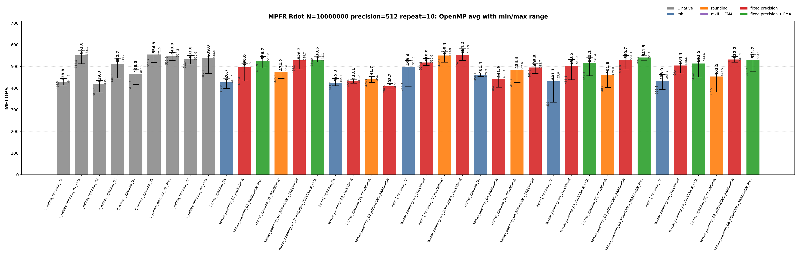
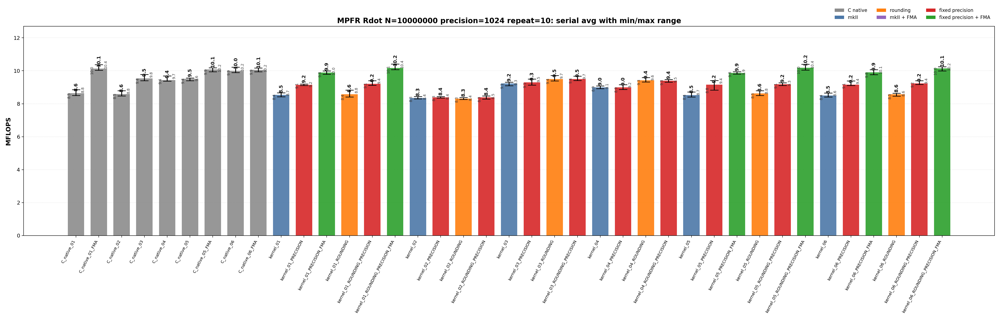
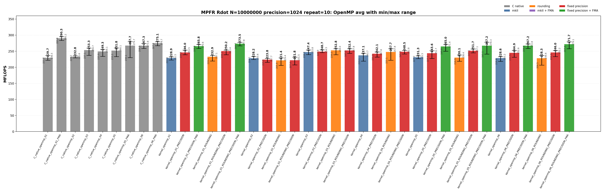

<!-- SPDX-License-Identifier: BSD-2-Clause -->

# 00_Rdot

This directory benchmarks the MPFR real dot product

```text
sum_i x_i * y_i
```

with raw MPFR C kernels and `mpfrxx::mpfr_class` wrapper kernels. The benchmark is organized like `benchmarks/mpfr/02_Rgemv`: numbered variants describe the source-level kernel shape, while suffixes describe source modifiers and build modifiers. The goal is to make temporary lifetime, rounding capture, FMA build options, fixed-precision assumptions, and OpenMP worker loops directly visible from the executable name and result class.

## Build

From the repository root:

```bash
cmake -S . -B build_bench_release -DCMAKE_BUILD_TYPE=Release
cmake --build build_bench_release -j
```

Executables are created under:

```text
build_bench_release/benchmarks/mpfr/00_Rdot/
```

Each executable takes `<vector size> <precision>`. Example:

```bash
build_bench_release/benchmarks/mpfr/00_Rdot/Rdot_mpfr_kernel_05_ROUNDING_PRECISION_FMA 10000000 512
```

The repeat runner uses the same source/build taxonomy:

```bash
OMP_NUM_THREADS=32 OMP_PLACES=cores OMP_PROC_BIND=spread \
    benchmarks/mpfr/00_Rdot/run_repeat.sh build_bench_release 10000000 512 10
```

MPFR Rdot wrapper targets omit a separate `mkII` implementation suffix because this directory has only the mkII wrapper implementation. The target suffixes separate source changes from build flags:

| Suffix | Kind | Meaning |
| --- | --- | --- |
| none | source baseline | Ordinary wrapper source for the numbered algorithm. |
| `ROUNDING` | source modifier | Captures `mpfrxx::evaluation_context` before the loop and uses `with_context` in the timed body. No compile-time flag is implied. |
| `PRECISION` | build modifier | Builds the same source with `GMPFRXX_MKII_FAST_FIXED_PREC`. |
| final `FMA` | build modifier | Builds the FMA-capturable source with `GMPFRXX_MKII_ENABLE_FMA`. |

The C native targets encode rounding and FMA directly in their source, so they do not split into `ROUNDING` and non-`ROUNDING` forms.

The cross-benchmark runner can execute the GMP and MPFR `00_Rdot`, `01_Raxpy`, and `02_Rgemv` suites for both standard precisions with one command:

```bash
OMP_NUM_THREADS=32 OMP_PLACES=cores OMP_PROC_BIND=spread \
    benchmarks/run_all.sh build_bench_release 512,1024 10 10000000 10000000 4000 4000
```

The second argument is a precision list. `both` and `all` are aliases for `512,1024`; a single value such as `512` still runs only that precision. Per-benchmark results are written to `results_raw/run_all_p512_repeat10_<timestamp>/` and `results_raw/run_all_p1024_repeat10_<timestamp>/` under each benchmark directory.

## Benchmark Parameters

| Parameter | Meaning |
| --- | --- |
| `N` | Number of vector elements. |
| `precision` | MPFR precision in bits for all input values and accumulators. |
| `repeat` | Number of timed process executions per executable. |
| `OMP_NUM_THREADS` | OpenMP worker count for `openmp` executables. |
| `OMP_PLACES`, `OMP_PROC_BIND` | OpenMP affinity controls used by the runner. |

The committed runs use `N=10000000`, `repeat=10`, `precision=512` and `precision=1024`, with `OMP_NUM_THREADS=32`, `OMP_PLACES=cores`, and `OMP_PROC_BIND=spread`.

## Variant Shapes

The timed body is `_Rdot()`. The numbered variant is written as a one-step transition: each row says what changed from the previous source shape and why that change is measured. `ROUNDING`, `PRECISION`, and final `FMA` suffixes modify the same numbered shape without changing the variant number.

| Variant | Transition from previous variant | Timed source shape | Temporary/resource policy | Purpose |
| --- | --- | --- | --- | --- |
| `01` | Starting point. | `acc += dx[i] * dy[i]` | Expression product is formed in the compound assignment. | Test the ET spelling. `FMA` builds can lower this source to one `mpfr_fma` call per element. |
| `02` | `01 -> 02`: force product materialization inside the loop. | `mpfr_class templ = dx[i] * dy[i]; acc += templ;` | Loop-local product object is constructed and destroyed inside every iteration. | Intentionally expensive control for temporary lifetime. |
| `03` | `02 -> 03`: move the product object outside the loop. | `templ = dx[i] * dy[i]; acc += templ;` | One product object is initialized before the loop and reused. | Main reusable-product split multiply/add wrapper shape. |
| `04` | `03 -> 04`: change product spelling to copy-then-multiply. | `templ = dx[i]; templ *= dy[i]; acc += templ;` | One product object is reused, but each iteration copies `dx[i]` before multiplication. | Separate product-object reuse from copy-then-multiply spelling. |
| `05` | `04 -> 05`: add accumulator unrolling and remove product materialization. | Four accumulators with direct `accN += dx[i+k] * dy[i+k]` updates. | No product object is materialized in the source. | FMA-capturable four-accumulator source. |
| `06` | `05 -> 06`: keep the direct-expression unrolled class for the second native FMA comparison point. | Four accumulators with direct `accN += dx[i+k] * dy[i+k]` updates. | No product object is materialized in the source. | Paired with `C_native_06_FMA`; expected to be in the same hot-loop class as `05`. |

Serial and OpenMP wrapper variants use the same numbering. OpenMP variants use per-thread partial accumulators and perform the final reduction outside the per-worker hot loop.

## Source Transitions

A variant number changes the source shape; suffixes then ask separate questions about rounding capture, FMA enablement, and fixed precision. For every numbered wrapper variant `01` through `06`, including the matching OpenMP variant, the generated wrapper target family is:

```text
<base>
<base>_PRECISION
<base>_ROUNDING
<base>_ROUNDING_PRECISION
```

`FMA` is a build modifier, not a separate source file. It is generated only for FMA-capturable source variants `01`, `05`, and `06`, always paired with fixed precision:

```text
<base>_PRECISION_FMA
<base>_ROUNDING_PRECISION_FMA
```

Variants `02` through `04` intentionally materialize product temporaries, so an FMA target for those source files would not measure the same source-level shape.

## C Native Equivalent Kernels

The mapping is based on the timed `_Rdot()` source shape and generated hot loop, not just on matching numeric suffixes. Raw C kernels encode rounding and FMA directly; wrapper kernels use suffixes to isolate those effects.

| C native kernel | Equivalent C++ wrapper kernel(s) | Equivalence basis |
| --- | --- | --- |
| `C_native_01` | closest to `kernel_02` | Legacy raw C loop-local product control. It is not the exact equivalent of wrapper `01` expression syntax. |
| `C_native_01_FMA` | `kernel_01_PRECISION_FMA`, `kernel_01_ROUNDING_PRECISION_FMA` | One `mpfr_fma` call per element when ET FMA capture succeeds. |
| `C_native_02` | `kernel_02`, `kernel_02_PRECISION`, `kernel_02_ROUNDING`, `kernel_02_ROUNDING_PRECISION` | Loop-local product object. |
| `C_native_03` | `kernel_03`, `kernel_03_PRECISION`, `kernel_03_ROUNDING`, `kernel_03_ROUNDING_PRECISION` | One reusable product object with split multiply/add. |
| `C_native_04` | `kernel_04`, `kernel_04_PRECISION`, `kernel_04_ROUNDING`, `kernel_04_ROUNDING_PRECISION` | Copy-then-multiply reusable product. |
| `C_native_05_FMA` | `kernel_05_PRECISION_FMA`, `kernel_05_ROUNDING_PRECISION_FMA` | Four accumulators with one direct `mpfr_fma`-class update per lane. |
| `C_native_06_FMA` | `kernel_06_PRECISION_FMA`, `kernel_06_ROUNDING_PRECISION_FMA` | Four accumulators with one direct `mpfr_fma`-class update per lane. |
| `C_native_openmp_NN` | `kernel_openmp_NN`, `kernel_openmp_NN_PRECISION`, `kernel_openmp_NN_ROUNDING`, `kernel_openmp_NN_ROUNDING_PRECISION` | Same OpenMP partitioning and non-FMA temporary policy as the raw C variant. |
| `C_native_openmp_NN_FMA` | `kernel_openmp_NN_PRECISION_FMA`, `kernel_openmp_NN_ROUNDING_PRECISION_FMA` for FMA-capable `NN` | Same OpenMP partitioning, with FMA-capturable wrapper source and FMA-enabled build. |

There is no exact raw C source equivalent for the non-FMA wrapper expression spelling `acc += dx[i] * dy[i]`; raw C must choose either split `mpfr_mul` plus `mpfr_add`, or fused `mpfr_fma`.

## Recorded Run

### 512-bit run

| Field | Value |
|-------|-------|
| Run ID | `run_all_p512_repeat10_20260526_062542` |
| Date | 2026-05-26 |
| CPU | AMD Ryzen Threadripper 3970X 32-Core Processor |
| OS | Linux 6.8.0-94-generic x86_64 |
| Compiler | `c++ (Ubuntu 15.2.0-16ubuntu1) 15.2.0` |
| Build type | Release |
| Problem size | `N=10000000` |
| Precision | 512 bits |
| Repeat count | 10 |
| OpenMP | `OMP_NUM_THREADS=32`, `OMP_PLACES=cores`, `OMP_PROC_BIND=spread` |
| Default precision env | `MPFRXX_DEFAULT_PRECISION_BITS=512` |
| Benchmark command | `OMP_NUM_THREADS=32 OMP_PLACES=cores OMP_PROC_BIND=spread benchmarks/run_all.sh build_bench_release 512,1024 10` |
| Raw result directory | `benchmarks/mpfr/00_Rdot/results_raw/run_all_p512_repeat10_20260526_062542/` |
| Raw log | `benchmarks/mpfr/00_Rdot/results_raw/run_all_p512_repeat10_20260526_062542/benchmark_rdot_mpfr_n10000000_p512_repeat10.log` |
| Raw CSV | `benchmarks/mpfr/00_Rdot/results_raw/run_all_p512_repeat10_20260526_062542/raw_rdot_mpfr_n10000000_p512_repeat10.csv` |
| Summary CSV | `benchmarks/mpfr/00_Rdot/results_raw/run_all_p512_repeat10_20260526_062542/summary_rdot_mpfr_n10000000_p512_repeat10.csv` |
| Correctness | 780 / 780 runs reported OK. |




Plot regeneration command:

```bash
python3 benchmarks/mpfr/00_Rdot/plot_repeat_summary.py \
    benchmarks/mpfr/00_Rdot/results_raw/run_all_p512_repeat10_20260526_062542/benchmark_rdot_mpfr_n10000000_p512_repeat10.log \
    --output-dir benchmarks/mpfr/00_Rdot/results_raw/run_all_p512_repeat10_20260526_062542 \
    --output-prefix rdot_mpfr_n10000000_p512_repeat10 \
    --title-prefix "MPFR Rdot N=10000000, precision=512, repeat=10"
```

### 1024-bit run

| Field | Value |
|-------|-------|
| Run ID | `run_all_p1024_repeat10_20260526_062542` |
| Date | 2026-05-26 |
| CPU | AMD Ryzen Threadripper 3970X 32-Core Processor |
| OS | Linux 6.8.0-94-generic x86_64 |
| Compiler | `c++ (Ubuntu 15.2.0-16ubuntu1) 15.2.0` |
| Build type | Release |
| Problem size | `N=10000000` |
| Precision | 1024 bits |
| Repeat count | 10 |
| OpenMP | `OMP_NUM_THREADS=32`, `OMP_PLACES=cores`, `OMP_PROC_BIND=spread` |
| Default precision env | `MPFRXX_DEFAULT_PRECISION_BITS=1024` |
| Benchmark command | `OMP_NUM_THREADS=32 OMP_PLACES=cores OMP_PROC_BIND=spread benchmarks/run_all.sh build_bench_release 512,1024 10` |
| Raw result directory | `benchmarks/mpfr/00_Rdot/results_raw/run_all_p1024_repeat10_20260526_062542/` |
| Raw log | `benchmarks/mpfr/00_Rdot/results_raw/run_all_p1024_repeat10_20260526_062542/benchmark_rdot_mpfr_n10000000_p1024_repeat10.log` |
| Raw CSV | `benchmarks/mpfr/00_Rdot/results_raw/run_all_p1024_repeat10_20260526_062542/raw_rdot_mpfr_n10000000_p1024_repeat10.csv` |
| Summary CSV | `benchmarks/mpfr/00_Rdot/results_raw/run_all_p1024_repeat10_20260526_062542/summary_rdot_mpfr_n10000000_p1024_repeat10.csv` |
| Correctness | 780 / 780 runs reported OK. |





Plot regeneration command:

```bash
python3 benchmarks/mpfr/00_Rdot/plot_repeat_summary.py \
    benchmarks/mpfr/00_Rdot/results_raw/run_all_p1024_repeat10_20260526_062542/benchmark_rdot_mpfr_n10000000_p1024_repeat10.log \
    --output-dir benchmarks/mpfr/00_Rdot/results_raw/run_all_p1024_repeat10_20260526_062542 \
    --output-prefix rdot_mpfr_n10000000_p1024_repeat10 \
    --title-prefix "MPFR Rdot N=10000000, precision=1024, repeat=10"
```

## Resource or Bandwidth Estimates

The values below are model estimates derived from MFLOPS, not hardware-counter measurements. They count active limb bytes plus a header-inclusive object model. They exclude allocator metadata, cache-line overfetch, instruction fetch, and final OpenMP reduction traffic.

| Case | Representative best-avg variant | Avg MFLOPS | Active bytes/iteration | Header-inclusive bytes/iteration | Active GB/s | Header-inclusive GB/s |
| --- | --- | --- | --- | --- | --- | --- |
| 512-bit serial | `C_native_06` | 23.718 | 128 | 192 | 1.518 | 2.277 |
| 512-bit OpenMP | `C_native_openmp_05` | 554.889 | 128 | 192 | 35.513 | 53.269 |
| 1024-bit serial | `kernel_05_ROUNDING_PRECISION_FMA` | 10.185 | 256 | 320 | 1.304 | 1.630 |
| 1024-bit OpenMP | `C_native_openmp_01_FMA` | 290.313 | 256 | 320 | 37.160 | 46.450 |

For `Rdot`, the per-iteration byte model is a compact arithmetic-stream estimate. It is not a full cache-footprint or hardware-bandwidth measurement.

## Headline Results

The headline rows below are regenerated from the committed 512-bit and 1024-bit `run_all` summary CSV files.

| Precision | Class | Variant | Max MFLOPS | Avg MFLOPS | Interpretation |
| --- | --- | --- | --- | --- | --- |
| 512 | Best serial max | `C_native_03` | 24.256 | 23.606 | Raw C reference for the numbered source shape. |
| 512 | Best serial average | `C_native_06` | 23.939 | 23.718 | Raw C reference for the numbered source shape. |
| 512 | Best OpenMP max | `kernel_openmp_03_ROUNDING_PRECISION` | 581.890 | 554.157 | Wrapper source with loop-external rounding/context plus fixed-precision build assumptions. |
| 512 | Best OpenMP average | `C_native_openmp_05` | 571.017 | 554.889 | Raw C OpenMP reference for the numbered source shape. |
| 1024 | Best serial max | `kernel_01_ROUNDING_PRECISION_FMA` | 10.409 | 10.166 | Wrapper source with loop-external rounding and fixed-precision FMA build. |
| 1024 | Best serial average | `kernel_05_ROUNDING_PRECISION_FMA` | 10.396 | 10.185 | Wrapper source with loop-external rounding and fixed-precision FMA build. |
| 1024 | Best OpenMP max | `C_native_openmp_01_FMA` | 295.173 | 290.313 | Raw C FMA reference; the hot loop uses the fused backend operation where the source shape permits it. |
| 1024 | Best OpenMP average | `C_native_openmp_01_FMA` | 295.173 | 290.313 | Raw C FMA reference; the hot loop uses the fused backend operation where the source shape permits it. |

## Serial Results

### 512-bit serial interpretation

These rows are derived from `benchmarks/mpfr/00_Rdot/results_raw/run_all_p512_repeat10_20260526_062542/summary_rdot_mpfr_n10000000_p512_repeat10.csv`.

| Observation | Variant | Max MFLOPS | Avg MFLOPS | Min MFLOPS | Interpretation |
| --- | --- | --- | --- | --- | --- |
| Best raw C serial avg | `C_native_06` | 23.939 | 23.718 | 23.490 | Raw C reference for the numbered source shape. |
| Best wrapper serial avg | `kernel_03_ROUNDING` | 24.229 | 23.457 | 22.958 | Wrapper source captures rounding/context outside the loop to avoid default-rounding lookup in the timed body. |
| Best serial max | `C_native_03` | 24.256 | 23.606 | 23.191 | Raw C reference for the numbered source shape. |

<details>
<summary>512-bit serial results sorted by Max MFLOPS</summary>

| Rank | Variant | Max MFLOPS | Avg MFLOPS | Min MFLOPS |
| --- | --- | --- | --- | --- |
| 1 | `C_native_03` | 24.256 | 23.606 | 23.191 |
| 2 | `kernel_03_ROUNDING` | 24.229 | 23.457 | 22.958 |
| 3 | `C_native_06` | 23.939 | 23.718 | 23.490 |
| 4 | `kernel_05_ROUNDING_PRECISION_FMA` | 23.816 | 23.261 | 22.970 |
| 5 | `kernel_06_ROUNDING_PRECISION_FMA` | 23.587 | 23.226 | 22.747 |
| 6 | `kernel_01_ROUNDING_PRECISION_FMA` | 23.473 | 23.205 | 22.980 |
| 7 | `kernel_03_ROUNDING_PRECISION` | 23.418 | 23.081 | 22.794 |
| 8 | `C_native_06_FMA` | 23.416 | 23.099 | 22.736 |
| 9 | `C_native_01_FMA` | 23.412 | 23.134 | 22.814 |
| 10 | `C_native_05_FMA` | 23.341 | 22.902 | 22.432 |
| 11 | `kernel_05_ROUNDING_PRECISION` | 22.957 | 22.426 | 22.016 |
| 12 | `kernel_06_ROUNDING_PRECISION` | 22.514 | 22.244 | 21.952 |
| 13 | `kernel_01_PRECISION_FMA` | 22.492 | 22.083 | 21.483 |
| 14 | `kernel_01_ROUNDING_PRECISION` | 22.467 | 22.261 | 22.094 |
| 15 | `kernel_05_PRECISION_FMA` | 22.447 | 22.188 | 21.403 |
| 16 | `kernel_06_PRECISION_FMA` | 22.412 | 22.120 | 21.750 |
| 17 | `kernel_03` | 21.991 | 21.500 | 20.770 |
| 18 | `C_native_05` | 21.589 | 21.427 | 21.175 |
| 19 | `kernel_05_PRECISION` | 21.420 | 20.899 | 20.497 |
| 20 | `kernel_01_PRECISION` | 21.393 | 21.167 | 20.874 |
| 21 | `kernel_06_PRECISION` | 21.318 | 20.941 | 20.417 |
| 22 | `kernel_03_PRECISION` | 21.222 | 20.891 | 20.565 |
| 23 | `kernel_04_ROUNDING_PRECISION` | 20.193 | 20.006 | 19.742 |
| 24 | `kernel_04_ROUNDING` | 20.153 | 20.035 | 19.791 |
| 25 | `C_native_04` | 19.909 | 19.479 | 19.117 |
| 26 | `kernel_01_ROUNDING` | 19.751 | 19.276 | 19.078 |
| 27 | `C_native_02` | 19.502 | 19.247 | 18.678 |
| 28 | `C_native_01` | 19.478 | 19.251 | 18.970 |
| 29 | `kernel_05_ROUNDING` | 19.142 | 18.446 | 18.168 |
| 30 | `kernel_06_ROUNDING` | 19.078 | 18.480 | 18.023 |
| 31 | `kernel_04` | 18.873 | 18.409 | 17.755 |
| 32 | `kernel_04_PRECISION` | 18.657 | 18.283 | 18.107 |
| 33 | `kernel_01` | 18.604 | 18.304 | 18.002 |
| 34 | `kernel_02` | 18.305 | 17.693 | 17.442 |
| 35 | `kernel_02_ROUNDING` | 18.053 | 17.826 | 17.551 |
| 36 | `kernel_02_ROUNDING_PRECISION` | 18.027 | 17.582 | 17.384 |
| 37 | `kernel_05` | 17.796 | 17.664 | 17.468 |
| 38 | `kernel_06` | 17.785 | 17.587 | 17.230 |
| 39 | `kernel_02_PRECISION` | 17.309 | 16.971 | 16.451 |

</details>

<details>
<summary>512-bit serial results sorted by Avg MFLOPS</summary>

| Rank | Variant | Max MFLOPS | Avg MFLOPS | Min MFLOPS |
| --- | --- | --- | --- | --- |
| 1 | `C_native_06` | 23.939 | 23.718 | 23.490 |
| 2 | `C_native_03` | 24.256 | 23.606 | 23.191 |
| 3 | `kernel_03_ROUNDING` | 24.229 | 23.457 | 22.958 |
| 4 | `kernel_05_ROUNDING_PRECISION_FMA` | 23.816 | 23.261 | 22.970 |
| 5 | `kernel_06_ROUNDING_PRECISION_FMA` | 23.587 | 23.226 | 22.747 |
| 6 | `kernel_01_ROUNDING_PRECISION_FMA` | 23.473 | 23.205 | 22.980 |
| 7 | `C_native_01_FMA` | 23.412 | 23.134 | 22.814 |
| 8 | `C_native_06_FMA` | 23.416 | 23.099 | 22.736 |
| 9 | `kernel_03_ROUNDING_PRECISION` | 23.418 | 23.081 | 22.794 |
| 10 | `C_native_05_FMA` | 23.341 | 22.902 | 22.432 |
| 11 | `kernel_05_ROUNDING_PRECISION` | 22.957 | 22.426 | 22.016 |
| 12 | `kernel_01_ROUNDING_PRECISION` | 22.467 | 22.261 | 22.094 |
| 13 | `kernel_06_ROUNDING_PRECISION` | 22.514 | 22.244 | 21.952 |
| 14 | `kernel_05_PRECISION_FMA` | 22.447 | 22.188 | 21.403 |
| 15 | `kernel_06_PRECISION_FMA` | 22.412 | 22.120 | 21.750 |
| 16 | `kernel_01_PRECISION_FMA` | 22.492 | 22.083 | 21.483 |
| 17 | `kernel_03` | 21.991 | 21.500 | 20.770 |
| 18 | `C_native_05` | 21.589 | 21.427 | 21.175 |
| 19 | `kernel_01_PRECISION` | 21.393 | 21.167 | 20.874 |
| 20 | `kernel_06_PRECISION` | 21.318 | 20.941 | 20.417 |
| 21 | `kernel_05_PRECISION` | 21.420 | 20.899 | 20.497 |
| 22 | `kernel_03_PRECISION` | 21.222 | 20.891 | 20.565 |
| 23 | `kernel_04_ROUNDING` | 20.153 | 20.035 | 19.791 |
| 24 | `kernel_04_ROUNDING_PRECISION` | 20.193 | 20.006 | 19.742 |
| 25 | `C_native_04` | 19.909 | 19.479 | 19.117 |
| 26 | `kernel_01_ROUNDING` | 19.751 | 19.276 | 19.078 |
| 27 | `C_native_01` | 19.478 | 19.251 | 18.970 |
| 28 | `C_native_02` | 19.502 | 19.247 | 18.678 |
| 29 | `kernel_06_ROUNDING` | 19.078 | 18.480 | 18.023 |
| 30 | `kernel_05_ROUNDING` | 19.142 | 18.446 | 18.168 |
| 31 | `kernel_04` | 18.873 | 18.409 | 17.755 |
| 32 | `kernel_01` | 18.604 | 18.304 | 18.002 |
| 33 | `kernel_04_PRECISION` | 18.657 | 18.283 | 18.107 |
| 34 | `kernel_02_ROUNDING` | 18.053 | 17.826 | 17.551 |
| 35 | `kernel_02` | 18.305 | 17.693 | 17.442 |
| 36 | `kernel_05` | 17.796 | 17.664 | 17.468 |
| 37 | `kernel_06` | 17.785 | 17.587 | 17.230 |
| 38 | `kernel_02_ROUNDING_PRECISION` | 18.027 | 17.582 | 17.384 |
| 39 | `kernel_02_PRECISION` | 17.309 | 16.971 | 16.451 |

</details>

### 1024-bit serial interpretation

These rows are derived from `benchmarks/mpfr/00_Rdot/results_raw/run_all_p1024_repeat10_20260526_062542/summary_rdot_mpfr_n10000000_p1024_repeat10.csv`.

| Observation | Variant | Max MFLOPS | Avg MFLOPS | Min MFLOPS | Interpretation |
| --- | --- | --- | --- | --- | --- |
| Best raw C serial avg | `C_native_01_FMA` | 10.375 | 10.127 | 10.029 | Raw C FMA reference; the hot loop uses the fused backend operation where the source shape permits it. |
| Best wrapper serial avg | `kernel_05_ROUNDING_PRECISION_FMA` | 10.396 | 10.185 | 10.049 | Wrapper source with loop-external rounding and fixed-precision FMA build. |
| Best serial max | `kernel_01_ROUNDING_PRECISION_FMA` | 10.409 | 10.166 | 10.069 | Wrapper source with loop-external rounding and fixed-precision FMA build. |

<details>
<summary>1024-bit serial results sorted by Max MFLOPS</summary>

| Rank | Variant | Max MFLOPS | Avg MFLOPS | Min MFLOPS |
| --- | --- | --- | --- | --- |
| 1 | `kernel_01_ROUNDING_PRECISION_FMA` | 10.409 | 10.166 | 10.069 |
| 2 | `kernel_05_ROUNDING_PRECISION_FMA` | 10.396 | 10.185 | 10.049 |
| 3 | `C_native_01_FMA` | 10.375 | 10.127 | 10.029 |
| 4 | `kernel_06_ROUNDING_PRECISION_FMA` | 10.247 | 10.144 | 9.990 |
| 5 | `C_native_06` | 10.221 | 9.998 | 9.896 |
| 6 | `C_native_05_FMA` | 10.180 | 10.086 | 9.943 |
| 7 | `C_native_06_FMA` | 10.166 | 10.056 | 9.943 |
| 8 | `kernel_06_PRECISION_FMA` | 10.062 | 9.909 | 9.768 |
| 9 | `kernel_01_PRECISION_FMA` | 9.990 | 9.890 | 9.792 |
| 10 | `kernel_05_PRECISION_FMA` | 9.945 | 9.866 | 9.798 |
| 11 | `C_native_03` | 9.772 | 9.539 | 9.394 |
| 12 | `kernel_03_ROUNDING` | 9.719 | 9.503 | 9.387 |
| 13 | `C_native_04` | 9.690 | 9.438 | 9.368 |
| 14 | `kernel_03_ROUNDING_PRECISION` | 9.671 | 9.495 | 9.409 |
| 15 | `kernel_04_ROUNDING` | 9.594 | 9.418 | 9.324 |
| 16 | `C_native_05` | 9.561 | 9.511 | 9.396 |
| 17 | `kernel_03_PRECISION` | 9.495 | 9.296 | 9.137 |
| 18 | `kernel_04_ROUNDING_PRECISION` | 9.471 | 9.393 | 9.308 |
| 19 | `kernel_05_PRECISION` | 9.405 | 9.152 | 8.831 |
| 20 | `kernel_01_ROUNDING_PRECISION` | 9.393 | 9.207 | 9.114 |
| 21 | `kernel_06_ROUNDING_PRECISION` | 9.393 | 9.235 | 9.165 |
| 22 | `kernel_06_PRECISION` | 9.388 | 9.156 | 9.103 |
| 23 | `kernel_03` | 9.310 | 9.234 | 9.096 |
| 24 | `kernel_05_ROUNDING_PRECISION` | 9.268 | 9.186 | 9.102 |
| 25 | `kernel_01_PRECISION` | 9.194 | 9.150 | 9.103 |
| 26 | `kernel_04_PRECISION` | 9.153 | 8.990 | 8.863 |
| 27 | `kernel_04` | 9.079 | 8.994 | 8.923 |
| 28 | `C_native_01` | 8.849 | 8.635 | 8.498 |
| 29 | `kernel_01_ROUNDING` | 8.827 | 8.579 | 8.408 |
| 30 | `C_native_02` | 8.791 | 8.585 | 8.477 |
| 31 | `kernel_05_ROUNDING` | 8.788 | 8.629 | 8.506 |
| 32 | `kernel_05` | 8.709 | 8.528 | 8.416 |
| 33 | `kernel_01` | 8.670 | 8.535 | 8.428 |
| 34 | `kernel_06` | 8.647 | 8.495 | 8.412 |
| 35 | `kernel_06_ROUNDING` | 8.641 | 8.581 | 8.458 |
| 36 | `kernel_02_ROUNDING_PRECISION` | 8.470 | 8.383 | 8.283 |
| 37 | `kernel_02_PRECISION` | 8.443 | 8.390 | 8.345 |
| 38 | `kernel_02` | 8.436 | 8.347 | 8.292 |
| 39 | `kernel_02_ROUNDING` | 8.367 | 8.310 | 8.264 |

</details>

<details>
<summary>1024-bit serial results sorted by Avg MFLOPS</summary>

| Rank | Variant | Max MFLOPS | Avg MFLOPS | Min MFLOPS |
| --- | --- | --- | --- | --- |
| 1 | `kernel_05_ROUNDING_PRECISION_FMA` | 10.396 | 10.185 | 10.049 |
| 2 | `kernel_01_ROUNDING_PRECISION_FMA` | 10.409 | 10.166 | 10.069 |
| 3 | `kernel_06_ROUNDING_PRECISION_FMA` | 10.247 | 10.144 | 9.990 |
| 4 | `C_native_01_FMA` | 10.375 | 10.127 | 10.029 |
| 5 | `C_native_05_FMA` | 10.180 | 10.086 | 9.943 |
| 6 | `C_native_06_FMA` | 10.166 | 10.056 | 9.943 |
| 7 | `C_native_06` | 10.221 | 9.998 | 9.896 |
| 8 | `kernel_06_PRECISION_FMA` | 10.062 | 9.909 | 9.768 |
| 9 | `kernel_01_PRECISION_FMA` | 9.990 | 9.890 | 9.792 |
| 10 | `kernel_05_PRECISION_FMA` | 9.945 | 9.866 | 9.798 |
| 11 | `C_native_03` | 9.772 | 9.539 | 9.394 |
| 12 | `C_native_05` | 9.561 | 9.511 | 9.396 |
| 13 | `kernel_03_ROUNDING` | 9.719 | 9.503 | 9.387 |
| 14 | `kernel_03_ROUNDING_PRECISION` | 9.671 | 9.495 | 9.409 |
| 15 | `C_native_04` | 9.690 | 9.438 | 9.368 |
| 16 | `kernel_04_ROUNDING` | 9.594 | 9.418 | 9.324 |
| 17 | `kernel_04_ROUNDING_PRECISION` | 9.471 | 9.393 | 9.308 |
| 18 | `kernel_03_PRECISION` | 9.495 | 9.296 | 9.137 |
| 19 | `kernel_06_ROUNDING_PRECISION` | 9.393 | 9.235 | 9.165 |
| 20 | `kernel_03` | 9.310 | 9.234 | 9.096 |
| 21 | `kernel_01_ROUNDING_PRECISION` | 9.393 | 9.207 | 9.114 |
| 22 | `kernel_05_ROUNDING_PRECISION` | 9.268 | 9.186 | 9.102 |
| 23 | `kernel_06_PRECISION` | 9.388 | 9.156 | 9.103 |
| 24 | `kernel_05_PRECISION` | 9.405 | 9.152 | 8.831 |
| 25 | `kernel_01_PRECISION` | 9.194 | 9.150 | 9.103 |
| 26 | `kernel_04` | 9.079 | 8.994 | 8.923 |
| 27 | `kernel_04_PRECISION` | 9.153 | 8.990 | 8.863 |
| 28 | `C_native_01` | 8.849 | 8.635 | 8.498 |
| 29 | `kernel_05_ROUNDING` | 8.788 | 8.629 | 8.506 |
| 30 | `C_native_02` | 8.791 | 8.585 | 8.477 |
| 31 | `kernel_06_ROUNDING` | 8.641 | 8.581 | 8.458 |
| 32 | `kernel_01_ROUNDING` | 8.827 | 8.579 | 8.408 |
| 33 | `kernel_01` | 8.670 | 8.535 | 8.428 |
| 34 | `kernel_05` | 8.709 | 8.528 | 8.416 |
| 35 | `kernel_06` | 8.647 | 8.495 | 8.412 |
| 36 | `kernel_02_PRECISION` | 8.443 | 8.390 | 8.345 |
| 37 | `kernel_02_ROUNDING_PRECISION` | 8.470 | 8.383 | 8.283 |
| 38 | `kernel_02` | 8.436 | 8.347 | 8.292 |
| 39 | `kernel_02_ROUNDING` | 8.367 | 8.310 | 8.264 |

</details>

## OpenMP Results

### 512-bit OpenMP interpretation

These rows are derived from `benchmarks/mpfr/00_Rdot/results_raw/run_all_p512_repeat10_20260526_062542/summary_rdot_mpfr_n10000000_p512_repeat10.csv`.

| Observation | Variant | Max MFLOPS | Avg MFLOPS | Min MFLOPS | Interpretation |
| --- | --- | --- | --- | --- | --- |
| Best raw C OpenMP avg | `C_native_openmp_05` | 571.017 | 554.889 | 518.692 | Raw C OpenMP reference for the numbered source shape. |
| Best wrapper OpenMP avg | `kernel_openmp_03_ROUNDING_PRECISION` | 581.890 | 554.157 | 528.044 | Wrapper source with loop-external rounding/context plus fixed-precision build assumptions. |
| Best OpenMP max | `kernel_openmp_03_ROUNDING_PRECISION` | 581.890 | 554.157 | 528.044 | Wrapper source with loop-external rounding/context plus fixed-precision build assumptions. |

<details>
<summary>512-bit OpenMP results sorted by Max MFLOPS</summary>

| Rank | Variant | Max MFLOPS | Avg MFLOPS | Min MFLOPS |
| --- | --- | --- | --- | --- |
| 1 | `kernel_openmp_03_ROUNDING_PRECISION` | 581.890 | 554.157 | 528.044 |
| 2 | `C_native_openmp_01_FMA` | 573.147 | 551.607 | 512.782 |
| 3 | `C_native_openmp_05` | 571.017 | 554.889 | 518.692 |
| 4 | `kernel_openmp_03_ROUNDING` | 568.624 | 550.412 | 519.468 |
| 5 | `C_native_openmp_05_FMA` | 564.159 | 549.880 | 527.936 |
| 6 | `C_native_openmp_06_FMA` | 558.456 | 538.971 | 467.403 |
| 7 | `kernel_openmp_06_ROUNDING_PRECISION_FMA` | 554.125 | 531.684 | 475.907 |
| 8 | `kernel_openmp_05_ROUNDING_PRECISION_FMA` | 552.063 | 541.525 | 528.713 |
| 9 | `kernel_openmp_05_ROUNDING_PRECISION` | 551.059 | 530.692 | 488.037 |
| 10 | `C_native_openmp_06` | 550.573 | 533.040 | 511.415 |
| 11 | `kernel_openmp_01_ROUNDING_PRECISION` | 548.716 | 528.240 | 488.075 |
| 12 | `kernel_openmp_06_ROUNDING_PRECISION` | 545.936 | 532.184 | 519.461 |
| 13 | `kernel_openmp_01_PRECISION_FMA` | 545.835 | 526.750 | 493.938 |
| 14 | `kernel_openmp_01_ROUNDING_PRECISION_FMA` | 545.135 | 530.626 | 520.986 |
| 15 | `kernel_openmp_06_PRECISION_FMA` | 544.578 | 513.472 | 451.186 |
| 16 | `kernel_openmp_05_PRECISION_FMA` | 540.380 | 515.113 | 457.489 |
| 17 | `C_native_openmp_03` | 538.201 | 512.729 | 446.749 |
| 18 | `kernel_openmp_03_PRECISION` | 536.551 | 518.629 | 504.242 |
| 19 | `kernel_openmp_05_PRECISION` | 532.188 | 503.532 | 438.778 |
| 20 | `kernel_openmp_03` | 528.038 | 498.362 | 406.860 |
| 21 | `kernel_openmp_06_PRECISION` | 525.798 | 504.374 | 469.435 |
| 22 | `kernel_openmp_01_PRECISION` | 515.294 | 495.997 | 433.436 |
| 23 | `kernel_openmp_04_ROUNDING_PRECISION` | 512.694 | 495.549 | 468.213 |
| 24 | `kernel_openmp_04_ROUNDING` | 502.611 | 484.405 | 425.892 |
| 25 | `kernel_openmp_01_ROUNDING` | 488.646 | 474.199 | 445.255 |
| 26 | `C_native_openmp_04` | 487.477 | 466.002 | 416.449 |
| 27 | `kernel_openmp_05_ROUNDING` | 479.020 | 461.580 | 403.806 |
| 28 | `kernel_openmp_06_ROUNDING` | 475.515 | 453.522 | 382.528 |
| 29 | `kernel_openmp_04` | 469.865 | 461.352 | 454.116 |
| 30 | `kernel_openmp_04_PRECISION` | 466.274 | 441.903 | 404.105 |
| 31 | `kernel_openmp_06` | 462.661 | 433.023 | 393.383 |
| 32 | `kernel_openmp_05` | 455.626 | 431.125 | 335.409 |
| 33 | `kernel_openmp_02_ROUNDING` | 453.997 | 441.672 | 426.370 |
| 34 | `kernel_openmp_02` | 445.366 | 425.257 | 411.220 |
| 35 | `C_native_openmp_01` | 444.437 | 428.776 | 414.499 |
| 36 | `kernel_openmp_01` | 443.738 | 426.661 | 397.830 |
| 37 | `kernel_openmp_02_PRECISION` | 440.988 | 433.083 | 422.599 |
| 38 | `C_native_openmp_02` | 435.925 | 419.004 | 381.929 |
| 39 | `kernel_openmp_02_ROUNDING_PRECISION` | 422.031 | 408.195 | 396.015 |

</details>

<details>
<summary>512-bit OpenMP results sorted by Avg MFLOPS</summary>

| Rank | Variant | Max MFLOPS | Avg MFLOPS | Min MFLOPS |
| --- | --- | --- | --- | --- |
| 1 | `C_native_openmp_05` | 571.017 | 554.889 | 518.692 |
| 2 | `kernel_openmp_03_ROUNDING_PRECISION` | 581.890 | 554.157 | 528.044 |
| 3 | `C_native_openmp_01_FMA` | 573.147 | 551.607 | 512.782 |
| 4 | `kernel_openmp_03_ROUNDING` | 568.624 | 550.412 | 519.468 |
| 5 | `C_native_openmp_05_FMA` | 564.159 | 549.880 | 527.936 |
| 6 | `kernel_openmp_05_ROUNDING_PRECISION_FMA` | 552.063 | 541.525 | 528.713 |
| 7 | `C_native_openmp_06_FMA` | 558.456 | 538.971 | 467.403 |
| 8 | `C_native_openmp_06` | 550.573 | 533.040 | 511.415 |
| 9 | `kernel_openmp_06_ROUNDING_PRECISION` | 545.936 | 532.184 | 519.461 |
| 10 | `kernel_openmp_06_ROUNDING_PRECISION_FMA` | 554.125 | 531.684 | 475.907 |
| 11 | `kernel_openmp_05_ROUNDING_PRECISION` | 551.059 | 530.692 | 488.037 |
| 12 | `kernel_openmp_01_ROUNDING_PRECISION_FMA` | 545.135 | 530.626 | 520.986 |
| 13 | `kernel_openmp_01_ROUNDING_PRECISION` | 548.716 | 528.240 | 488.075 |
| 14 | `kernel_openmp_01_PRECISION_FMA` | 545.835 | 526.750 | 493.938 |
| 15 | `kernel_openmp_03_PRECISION` | 536.551 | 518.629 | 504.242 |
| 16 | `kernel_openmp_05_PRECISION_FMA` | 540.380 | 515.113 | 457.489 |
| 17 | `kernel_openmp_06_PRECISION_FMA` | 544.578 | 513.472 | 451.186 |
| 18 | `C_native_openmp_03` | 538.201 | 512.729 | 446.749 |
| 19 | `kernel_openmp_06_PRECISION` | 525.798 | 504.374 | 469.435 |
| 20 | `kernel_openmp_05_PRECISION` | 532.188 | 503.532 | 438.778 |
| 21 | `kernel_openmp_03` | 528.038 | 498.362 | 406.860 |
| 22 | `kernel_openmp_01_PRECISION` | 515.294 | 495.997 | 433.436 |
| 23 | `kernel_openmp_04_ROUNDING_PRECISION` | 512.694 | 495.549 | 468.213 |
| 24 | `kernel_openmp_04_ROUNDING` | 502.611 | 484.405 | 425.892 |
| 25 | `kernel_openmp_01_ROUNDING` | 488.646 | 474.199 | 445.255 |
| 26 | `C_native_openmp_04` | 487.477 | 466.002 | 416.449 |
| 27 | `kernel_openmp_05_ROUNDING` | 479.020 | 461.580 | 403.806 |
| 28 | `kernel_openmp_04` | 469.865 | 461.352 | 454.116 |
| 29 | `kernel_openmp_06_ROUNDING` | 475.515 | 453.522 | 382.528 |
| 30 | `kernel_openmp_04_PRECISION` | 466.274 | 441.903 | 404.105 |
| 31 | `kernel_openmp_02_ROUNDING` | 453.997 | 441.672 | 426.370 |
| 32 | `kernel_openmp_02_PRECISION` | 440.988 | 433.083 | 422.599 |
| 33 | `kernel_openmp_06` | 462.661 | 433.023 | 393.383 |
| 34 | `kernel_openmp_05` | 455.626 | 431.125 | 335.409 |
| 35 | `C_native_openmp_01` | 444.437 | 428.776 | 414.499 |
| 36 | `kernel_openmp_01` | 443.738 | 426.661 | 397.830 |
| 37 | `kernel_openmp_02` | 445.366 | 425.257 | 411.220 |
| 38 | `C_native_openmp_02` | 435.925 | 419.004 | 381.929 |
| 39 | `kernel_openmp_02_ROUNDING_PRECISION` | 422.031 | 408.195 | 396.015 |

</details>

### 1024-bit OpenMP interpretation

These rows are derived from `benchmarks/mpfr/00_Rdot/results_raw/run_all_p1024_repeat10_20260526_062542/summary_rdot_mpfr_n10000000_p1024_repeat10.csv`.

| Observation | Variant | Max MFLOPS | Avg MFLOPS | Min MFLOPS | Interpretation |
| --- | --- | --- | --- | --- | --- |
| Best raw C OpenMP avg | `C_native_openmp_01_FMA` | 295.173 | 290.313 | 283.752 | Raw C FMA reference; the hot loop uses the fused backend operation where the source shape permits it. |
| Best wrapper OpenMP avg | `kernel_openmp_01_ROUNDING_PRECISION_FMA` | 277.796 | 273.519 | 266.700 | Wrapper source with loop-external rounding and fixed-precision FMA build. |
| Best OpenMP max | `C_native_openmp_01_FMA` | 295.173 | 290.313 | 283.752 | Raw C FMA reference; the hot loop uses the fused backend operation where the source shape permits it. |

<details>
<summary>1024-bit OpenMP results sorted by Max MFLOPS</summary>

| Rank | Variant | Max MFLOPS | Avg MFLOPS | Min MFLOPS |
| --- | --- | --- | --- | --- |
| 1 | `C_native_openmp_01_FMA` | 295.173 | 290.313 | 283.752 |
| 2 | `C_native_openmp_06_FMA` | 279.738 | 275.057 | 267.311 |
| 3 | `C_native_openmp_05_FMA` | 279.722 | 267.725 | 230.090 |
| 4 | `kernel_openmp_06_ROUNDING_PRECISION_FMA` | 279.146 | 271.719 | 257.644 |
| 5 | `kernel_openmp_05_ROUNDING_PRECISION_FMA` | 278.304 | 267.249 | 241.095 |
| 6 | `kernel_openmp_01_ROUNDING_PRECISION_FMA` | 277.796 | 273.519 | 266.700 |
| 7 | `C_native_openmp_06` | 273.815 | 267.342 | 258.530 |
| 8 | `kernel_openmp_06_PRECISION_FMA` | 272.776 | 267.241 | 258.595 |
| 9 | `kernel_openmp_05_PRECISION_FMA` | 271.378 | 264.963 | 249.817 |
| 10 | `kernel_openmp_01_PRECISION_FMA` | 270.616 | 265.823 | 258.783 |
| 11 | `C_native_openmp_05` | 260.098 | 251.778 | 233.277 |
| 12 | `C_native_openmp_03` | 259.728 | 253.344 | 237.056 |
| 13 | `kernel_openmp_03_ROUNDING` | 257.977 | 252.756 | 239.036 |
| 14 | `kernel_openmp_04_ROUNDING` | 257.790 | 247.682 | 222.050 |
| 15 | `kernel_openmp_03_ROUNDING_PRECISION` | 257.760 | 252.360 | 243.208 |
| 16 | `kernel_openmp_05_ROUNDING_PRECISION` | 257.073 | 251.671 | 245.106 |
| 17 | `C_native_openmp_04` | 256.055 | 249.273 | 233.934 |
| 18 | `kernel_openmp_03_PRECISION` | 254.495 | 248.732 | 245.903 |
| 19 | `kernel_openmp_03` | 253.830 | 247.390 | 239.277 |
| 20 | `kernel_openmp_01_PRECISION` | 253.519 | 245.987 | 239.229 |
| 21 | `kernel_openmp_01_ROUNDING_PRECISION` | 253.449 | 250.230 | 239.126 |
| 22 | `kernel_openmp_04_ROUNDING_PRECISION` | 252.797 | 248.493 | 241.340 |
| 23 | `kernel_openmp_06_PRECISION` | 252.613 | 244.923 | 231.452 |
| 24 | `kernel_openmp_06_ROUNDING_PRECISION` | 252.179 | 246.045 | 233.318 |
| 25 | `kernel_openmp_05_PRECISION` | 251.719 | 243.634 | 227.511 |
| 26 | `kernel_openmp_04_PRECISION` | 247.605 | 242.064 | 231.488 |
| 27 | `kernel_openmp_04` | 243.705 | 237.116 | 219.131 |
| 28 | `kernel_openmp_05_ROUNDING` | 238.446 | 230.091 | 218.889 |
| 29 | `kernel_openmp_01_ROUNDING` | 237.126 | 232.933 | 219.450 |
| 30 | `kernel_openmp_06_ROUNDING` | 236.561 | 228.310 | 206.512 |
| 31 | `C_native_openmp_01` | 236.518 | 229.683 | 221.731 |
| 32 | `C_native_openmp_02` | 235.584 | 232.787 | 229.244 |
| 33 | `kernel_openmp_05` | 235.467 | 231.340 | 227.025 |
| 34 | `kernel_openmp_02` | 233.635 | 228.175 | 224.117 |
| 35 | `kernel_openmp_06` | 233.189 | 228.619 | 218.556 |
| 36 | `kernel_openmp_01` | 232.523 | 228.871 | 222.589 |
| 37 | `kernel_openmp_02_ROUNDING_PRECISION` | 231.540 | 221.830 | 207.576 |
| 38 | `kernel_openmp_02_ROUNDING` | 229.371 | 221.365 | 205.855 |
| 39 | `kernel_openmp_02_PRECISION` | 227.712 | 223.829 | 215.454 |

</details>

<details>
<summary>1024-bit OpenMP results sorted by Avg MFLOPS</summary>

| Rank | Variant | Max MFLOPS | Avg MFLOPS | Min MFLOPS |
| --- | --- | --- | --- | --- |
| 1 | `C_native_openmp_01_FMA` | 295.173 | 290.313 | 283.752 |
| 2 | `C_native_openmp_06_FMA` | 279.738 | 275.057 | 267.311 |
| 3 | `kernel_openmp_01_ROUNDING_PRECISION_FMA` | 277.796 | 273.519 | 266.700 |
| 4 | `kernel_openmp_06_ROUNDING_PRECISION_FMA` | 279.146 | 271.719 | 257.644 |
| 5 | `C_native_openmp_05_FMA` | 279.722 | 267.725 | 230.090 |
| 6 | `C_native_openmp_06` | 273.815 | 267.342 | 258.530 |
| 7 | `kernel_openmp_05_ROUNDING_PRECISION_FMA` | 278.304 | 267.249 | 241.095 |
| 8 | `kernel_openmp_06_PRECISION_FMA` | 272.776 | 267.241 | 258.595 |
| 9 | `kernel_openmp_01_PRECISION_FMA` | 270.616 | 265.823 | 258.783 |
| 10 | `kernel_openmp_05_PRECISION_FMA` | 271.378 | 264.963 | 249.817 |
| 11 | `C_native_openmp_03` | 259.728 | 253.344 | 237.056 |
| 12 | `kernel_openmp_03_ROUNDING` | 257.977 | 252.756 | 239.036 |
| 13 | `kernel_openmp_03_ROUNDING_PRECISION` | 257.760 | 252.360 | 243.208 |
| 14 | `C_native_openmp_05` | 260.098 | 251.778 | 233.277 |
| 15 | `kernel_openmp_05_ROUNDING_PRECISION` | 257.073 | 251.671 | 245.106 |
| 16 | `kernel_openmp_01_ROUNDING_PRECISION` | 253.449 | 250.230 | 239.126 |
| 17 | `C_native_openmp_04` | 256.055 | 249.273 | 233.934 |
| 18 | `kernel_openmp_03_PRECISION` | 254.495 | 248.732 | 245.903 |
| 19 | `kernel_openmp_04_ROUNDING_PRECISION` | 252.797 | 248.493 | 241.340 |
| 20 | `kernel_openmp_04_ROUNDING` | 257.790 | 247.682 | 222.050 |
| 21 | `kernel_openmp_03` | 253.830 | 247.390 | 239.277 |
| 22 | `kernel_openmp_06_ROUNDING_PRECISION` | 252.179 | 246.045 | 233.318 |
| 23 | `kernel_openmp_01_PRECISION` | 253.519 | 245.987 | 239.229 |
| 24 | `kernel_openmp_06_PRECISION` | 252.613 | 244.923 | 231.452 |
| 25 | `kernel_openmp_05_PRECISION` | 251.719 | 243.634 | 227.511 |
| 26 | `kernel_openmp_04_PRECISION` | 247.605 | 242.064 | 231.488 |
| 27 | `kernel_openmp_04` | 243.705 | 237.116 | 219.131 |
| 28 | `kernel_openmp_01_ROUNDING` | 237.126 | 232.933 | 219.450 |
| 29 | `C_native_openmp_02` | 235.584 | 232.787 | 229.244 |
| 30 | `kernel_openmp_05` | 235.467 | 231.340 | 227.025 |
| 31 | `kernel_openmp_05_ROUNDING` | 238.446 | 230.091 | 218.889 |
| 32 | `C_native_openmp_01` | 236.518 | 229.683 | 221.731 |
| 33 | `kernel_openmp_01` | 232.523 | 228.871 | 222.589 |
| 34 | `kernel_openmp_06` | 233.189 | 228.619 | 218.556 |
| 35 | `kernel_openmp_06_ROUNDING` | 236.561 | 228.310 | 206.512 |
| 36 | `kernel_openmp_02` | 233.635 | 228.175 | 224.117 |
| 37 | `kernel_openmp_02_PRECISION` | 227.712 | 223.829 | 215.454 |
| 38 | `kernel_openmp_02_ROUNDING_PRECISION` | 231.540 | 221.830 | 207.576 |
| 39 | `kernel_openmp_02_ROUNDING` | 229.371 | 221.365 | 205.855 |

</details>

## Comparison with GMP version

| Precision | Mode | Best MPFR Avg MFLOPS | Best GMP Avg MFLOPS | MPFR/GMP | Interpretation |
|-----------|------|----------------------|---------------------|----------|----------------|
| 512 | Serial | 23.718 | 32.851 | 0.722x | MPFR still pays rounding/exponent semantics even when the source uses reusable temporaries. |
| 512 | OpenMP | 554.889 | 578.143 | 0.960x | Parallelism hides much of the per-element wrapper difference; both are in a backend-call limited streaming class. |
| 1024 | Serial | 10.185 | 11.908 | 0.855x | Higher precision raises GMP arithmetic cost too, so the MPFR/GMP gap narrows. |
| 1024 | OpenMP | 290.313 | 316.496 | 0.917x | MPFR remains close but does not overtake the simpler GMP OpenMP class in this run. |

The comparison is based on the committed summary CSVs for the same run id. The
OpenMP ratios should be read as performance classes, not single-run rankings.

## Hotpath Disassembly

Representative commands:

```bash
objdump -Cd --no-show-raw-insn build_bench_release/benchmarks/mpfr/00_Rdot/Rdot_mpfr_C_native_01_FMA
objdump -Cd --no-show-raw-insn build_bench_release/benchmarks/mpfr/00_Rdot/Rdot_mpfr_kernel_01_ROUNDING_PRECISION_FMA
objdump -Cd --no-show-raw-insn build_bench_release/benchmarks/mpfr/00_Rdot/Rdot_mpfr_kernel_03_ROUNDING_PRECISION
```

The refreshed disassembly confirms the arithmetic class, but it does not make
the wrapper binaries byte-for-byte equivalent to raw C. The important check is
whether the hot arithmetic loop is one `mpfr_fma` call or split
`mpfr_mul`/`mpfr_add`, and whether init/clear is in the element loop.

| Representative | Hotpath observation | Comparison point |
|----------------|---------------------|------------------|
| `C_native_01_FMA` | Rounding is cached before the loop; the element loop has one `mpfr_fma` per element. Accumulator init/clear is outside the loop. | Raw FMA baseline. |
| `kernel_01_ROUNDING_PRECISION_FMA` | The arithmetic hot loop reaches `mpfr_fma`. The wrapper binary still contains default-state and precision guard/fallback calls outside or around the fast path, so it is the same arithmetic class as C native, not identical control flow. | Closest mkII FMA equivalent. |
| `C_native_03` | Reusable product object with one `mpfr_mul` followed by one `mpfr_add` per element. | Raw split multiply/add baseline. |
| `kernel_03_ROUNDING_PRECISION` | Same split arithmetic class as `C_native_03`; no per-element `mpfr_init2`/`mpfr_clear` in the intended reusable-temporary loop. | Closest mkII reusable-temp equivalent. |
| `kernel_openmp_03_ROUNDING_PRECISION` | Worker loop uses the reusable split multiply/add class. Final reduction is outside the per-thread element loop. | Best max OpenMP wrapper class in the 512-bit run. |

Representative excerpts from the current binaries:

```asm
# Rdot_mpfr_C_native_01_FMA::_Rdot
2b99: call   mpfr_get_default_rounding_mode@plt
2ba9: mov    %eax,%r12d         # cached rounding mode
2bc8: test   %r13,%r13
2bcb: jle    2bf5 <_Rdot+0xa5>
2bd0: mov    %rbx,%rdx          # x/y operand
2bd3: mov    %r15,%rsi          # x/y operand
2bd6: mov    %r12d,%r8d         # cached rounding
2bd9: mov    %rbp,%rcx          # accumulator addend
2bdc: mov    %rbp,%rdi          # accumulator destination
2bdf: add    $0x1,%r14
2be3: add    $0x20,%r15
2be7: add    $0x20,%rbx
2beb: call   mpfr_fma@plt
2bf0: cmp    %r14,%r13
2bf3: jne    2bd0 <_Rdot+0x80>
2c05: call   mpfr_clear@plt
```

```asm
# Rdot_mpfr_kernel_01_ROUNDING_PRECISION_FMA::_Rdot
2d03: test   %r12,%r12
2d06: jle    2d35 <_Rdot+0xe5>
2d10: mov    %r13d,%r8d         # context rounding
2d13: mov    %rbp,%rcx          # accumulator addend
2d16: mov    %r14,%rdx          # dy[i]
2d19: mov    %rbx,%rsi          # dx[i]
2d1c: mov    %rbp,%rdi          # accumulator destination
2d1f: call   mpfr_fma@plt
2d24: add    $0x1,%r15
2d28: add    $0x20,%rbx
2d2c: add    $0x20,%r14
2d30: cmp    %r15,%r12
2d33: jne    2d10 <_Rdot+0xc0>
2d49: add    $0x58,%rsp
```

```asm
# Rdot_mpfr_kernel_03_ROUNDING_PRECISION::_Rdot
32e5: xor    %r12d,%r12d
32e8: cmpq   $0x0,(%rsp)
32ed: jle    3324 <_Rdot+0x124>
32f0: mov    %r15d,%ecx         # context rounding
32f3: mov    %rbp,%rdx          # dy[i]
32f6: mov    %rbx,%rsi          # dx[i]
32f9: mov    %r14,%rdi          # reusable product temp
32fc: call   mpfr_mul@plt
3301: mov    %r15d,%ecx         # context rounding
3304: mov    %r14,%rdx          # product temp
3307: mov    %r13,%rsi          # accumulator
330a: mov    %r13,%rdi          # accumulator destination
330d: call   mpfr_add@plt
3312: add    $0x1,%r12
3316: add    $0x20,%rbx
331a: add    $0x20,%rbp
3322: jne    32f0 <_Rdot+0xf0>
3327: call   mpfr_clear@plt
```

Suffix-removal check for the same `03` source shape: the quoted
`Rdot_mpfr_kernel_03_ROUNDING_PRECISION::_Rdot` loop above is the cached
reference. Removing either suffix reintroduces the corresponding dynamic work.

| Target | Removed cache assumption | Disassembly evidence | Meaning |
|--------|--------------------------|----------------------|---------|
| `kernel_03_PRECISION` | `ROUNDING` | The element loop calls `mpfr_get_default_rounding_mode` before both `mpfr_mul` and `mpfr_add`. | Fixed precision alone does not cache rounding. |
| `kernel_03_ROUNDING` | `PRECISION` | The fast path must compare destination and temporary precision before taking the loop; fallback paths remain live. | Cached rounding alone does not prove fixed precision. |

```asm
# Rdot_mpfr_kernel_03_PRECISION::_Rdot
3390: cmpb   $0x0,%fs:0xfffffffffffffff8
33b3: call   mpfr_get_default_rounding_mode@plt
33c0: call   mpfr_get_default_rounding_mode@plt
33c5: mov    %rbx,%rdx          # dy[i]
33c8: mov    %rbp,%rsi          # dx[i]
33cb: mov    %r14,%rdi          # reusable product temp
33ce: mov    %eax,%ecx          # uncached rounding
33d0: call   mpfr_mul@plt
33f4: call   mpfr_get_default_rounding_mode@plt
3401: call   mpfr_get_default_rounding_mode@plt
3406: mov    %r14,%rdx          # product temp
3409: mov    %r13,%rsi          # accumulator
340c: mov    %r13,%rdi          # accumulator destination
340f: mov    %eax,%ecx          # uncached rounding
3411: call   mpfr_add@plt
3425: jne    3390 <_Rdot+0x130>
```

```asm
# Rdot_mpfr_kernel_03_ROUNDING::_Rdot
2e85: cmp    0x0(%r13),%rbp     # accumulator precision guard
2e89: jne    37e7 <_Rdot+0xa47> # fallback if precision differs
2e8f: cmp    0x50(%rsp),%rbp    # reusable temp precision guard
2e94: jne    2903 <_Rdot.cold+0x11e>
2eb0: mov    %r15d,%ecx         # cached rounding
2eb3: mov    %rbp,%rdx          # dy[i]
2eb6: mov    %rbx,%rsi          # dx[i]
2eb9: mov    %r14,%rdi          # reusable product temp
2ebc: call   mpfr_mul@plt
2ec1: mov    %r15d,%ecx         # cached rounding
2ec4: mov    %r14,%rdx          # product temp
2ec7: mov    %r13,%rsi          # accumulator
2eca: mov    %r13,%rdi          # accumulator destination
2ecd: call   mpfr_add@plt
2ee3: jne    2eb0 <_Rdot+0x110>
```

The FMA wrapper reaches the same arithmetic call class as C native FMA. The
reusable-temp wrapper reaches the split `mpfr_mul` plus `mpfr_add` class. Extra
wrapper guard/fallback paths are outside these quoted fast-loop excerpts.

## Lessons Learned

The source-level boundary is whether the timed loop is FMA-captured or split
multiply/add, and whether the product object is reusable. MPFR rounding/context
handling matters, but the generated backend call sequence still controls the
main performance class.

For 512-bit serial runs, the max winner (`C_native_03`) and average winner
(`C_native_06`) are separated by about 0.5% in average MFLOPS. That is not a
strong unrolling result; both are reusable split multiply/add classes.

For 512-bit OpenMP runs, the max winner (`kernel_openmp_03_ROUNDING_PRECISION`)
and average winner (`C_native_openmp_05`) differ by about 0.1% in average
MFLOPS. Treat them as the same OpenMP performance class.

For 1024-bit serial runs, the FMA-captured wrapper variants win. The max winner
(`kernel_01_ROUNDING_PRECISION_FMA`) and average winner
(`kernel_05_ROUNDING_PRECISION_FMA`) differ by less than 0.2% in average MFLOPS,
so the lesson is FMA capture, not a durable four-accumulator advantage.

Compared with GMP, MPFR is still slower in serial mode because every arithmetic
operation carries MPFR precision and rounding semantics. The gap narrows at
1024 bits and under OpenMP because backend arithmetic dominates more of the
runtime.
