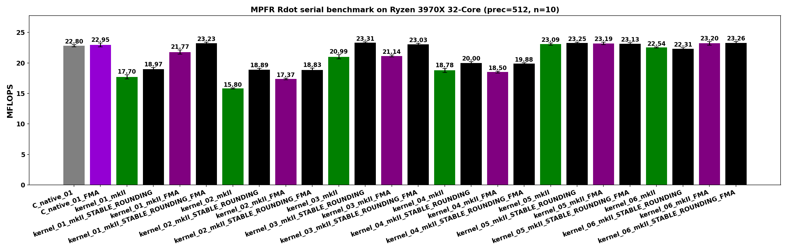
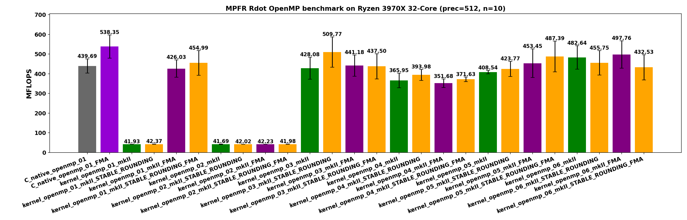

<!-- SPDX-License-Identifier: BSD-2-Clause -->

# 00_Rdot

This directory benchmarks the MPFR real dot product

```text
sum_i x_i * y_i
```

with random `mpfr_t` / `mpfrxx::mpfr_class` data at a fixed precision.  The
layout intentionally mirrors `benchmarks/gmp/00_Rdot/`: each kernel shape is a
standalone translation unit, so hotpath disassembly can be read without a
shared benchmark harness obscuring the loop.

## Build

From the repository root:

```bash
cmake -S . -B build_bench_release -DCMAKE_BUILD_TYPE=Release
cmake --build build_bench_release -j
```

The executables are created under:

```text
build_bench_release/benchmarks/mpfr/00_Rdot/
```

## Run

Run the MPFR benchmark set through the MPFR runner:

```bash
benchmarks/common/run_mpfr_benchmarks.sh build_bench_release 512 \
    10000000 benchmarks/mpfr/results_raw/Linux_Ryzen_3970X_32-Core 10
```

The first size argument is used for Rdot.  Individual executables take:

```text
<vector size> <precision>
```

Example:

```bash
build_bench_release/benchmarks/mpfr/00_Rdot/Rdot_mpfr_kernel_03_mkII 1000000 512
```

## Reading Results

Each executable prints `Elapsed time` and `MFLOPS`.  Higher MFLOPS is better
when comparing runs with the same vector size, precision, compiler flags,
rounding mode, and machine.

The timed kernel also prints:

```text
BENCH_ALLOC_COUNTS label=timed_kernel alloc=... realloc=... free=...
```

For MPFR Rdot this is useful for separating arithmetic call cost from
per-iteration temporary allocation.  The native FMA variants use standalone
source files with `mpfr_fma`, so their rounding behavior is intentionally
different from the non-FMA `mpfr_mul` plus `mpfr_add` native kernels.  Wrapper
FMA variants keep the same wrapper benchmark source and enable fusion through
the expression-template build option.

Variant names:

- `C_native`: raw `mpfr_t` implementation.
- `C_native_01_FMA`: raw `mpfr_t` implementation using `mpfr_fma`.
- `C_native_openmp`: raw `mpfr_t` implementation with OpenMP.
- `*_mkII`: this header with the normal MPFR wrapper rounding policy.
- `*_STABLE_ROUNDING`: wrapper build with
  `GMPFRXX_MKII_ASSUME_STABLE_MPFR_ROUNDING_MODE`.
- `*_FMA`: build with `MPFRXX_ENABLE_FMA`.
- `*_STABLE_ROUNDING_FMA`: stable wrapper rounding plus `mpfr_fma`.

## Kernel Shapes

The timed body is `_Rdot()` in each benchmark executable.  `Rdot.hpp` is only
the post-run correctness reference.

| Variant | Timed source shape | Temporary policy | Hotpath meaning |
|---------|--------------------|------------------|-----------------|
| `C_native_01` | `mpfr_mul(templ, dx[i], dy[i], rnd); mpfr_add(temp, temp, templ, rnd);` | `temp` and `templ` are initialized once outside the loop. | Baseline: one `mpfr_mul` and one `mpfr_add` per element, with `rnd` cached before the loop. |
| `C_native_01_FMA` | `mpfr_fma(temp, dx[i], dy[i], temp, rnd);` | `temp` is initialized once outside the loop. | Raw MPFR fused baseline: one MPFR arithmetic call per element and one final rounding per multiply-add. |
| `C_native_openmp_01` | Same raw `mpfr_t` dot product inside `#pragma omp for`. | Each thread owns `temp` and `templ`; final accumulation uses `critical`. | Measures parallel raw-MPFR throughput and final reduction overhead. |
| `kernel_01` | `temp += dx[i] * dy[i];` | Expression-friendly source. The multiply result can be materialized as a scoped temporary each iteration. | Tests wrapper expression overhead and rounding lookup overhead from the shortest source form. |
| `kernel_02` | `mpfr_class templ = dx[i] * dy[i]; temp += templ;` | A new product object is constructed inside every iteration. | Deliberately allocation-heavy wrapper form. |
| `kernel_03` | `templ = dx[i] * dy[i]; temp += templ;` | One product object is constructed before the loop and reused. | Closest non-FMA wrapper source shape to the raw `mpfr_mul` plus `mpfr_add` baseline. |
| `kernel_04` | `templ = dx[i]; templ *= dy[i]; temp += templ;` | One product object is reused, but each iteration copies `dx[i]` before multiplying. | Separates reusable object lifetime from expression assignment. |
| `kernel_05` | Four-way unroll with `acc0..acc3` and one reused product object. | Four accumulators are initialized before the loop; one product temporary is reused. | Tests whether accumulator dependency limits the serial MPFR loop. |
| `kernel_06` | Four-way unroll with `acc0..acc3` and `templ0..templ3`. | Four accumulators and four product temporaries are initialized before the loop. | Separates accumulator unroll from product-temporary reuse and alias effects. |
| `kernel_openmp_01` | Per-thread `partial += dx[i] * dy[i];` | One accumulator per thread; final accumulation uses `critical`. | Parallel version of the expression-friendly `kernel_01` shape. |
| `kernel_openmp_02` | Per-thread loop-local product object, then `partial += templ;` | Product object construction remains inside the loop. | Parallel version of the allocation-heavy `kernel_02` shape. |
| `kernel_openmp_03` | Per-thread `templ = dx[i] * dy[i]; partial += templ;` | One reusable product object per thread. | Parallel version of the reusable-expression-product `kernel_03` shape. |
| `kernel_openmp_04` | Per-thread `templ = dx[i]; templ *= dy[i]; partial += templ;` | One reusable product object per thread plus a per-iteration copy. | Parallel version of `kernel_04`. |
| `kernel_openmp_05` | Per-thread four-way unroll with `acc0..acc3` and one product object. | Per-thread accumulators are reused; the tail loop follows the GMP OpenMP 05 shape. | Tests whether unroll helps once OpenMP already exposes thread parallelism. |
| `kernel_openmp_06` | Per-thread four-way unroll with `acc0..acc3` and `templ0..templ3`. | Four product objects per thread are reused; the tail loop follows the GMP OpenMP 06 shape. | Tests whether independent product temporaries improve the OpenMP 05 shape. |

## MPFR-Specific Analysis

MPFR differs from GMP `mpf` in one important way: every arithmetic call receives
an explicit rounding mode.  The raw C native kernels load
`mpfr_get_default_rounding_mode()` once before the timed loop and pass the
cached `mpfr_rnd_t` to every `mpfr_*` call.

The generic wrapper expression path normally obtains the current evaluation
context for each operation.  In normal builds that can mean repeated default
rounding lookups.  `*_STABLE_ROUNDING` removes the function-call lookup by using
the wrapper's cached thread-local rounding value, but it can still leave a TLS
load in the loop.  Therefore the closest wrapper hotpath to the non-FMA C
native loop is expected to be one of the reusable-product shapes:

```text
kernel_03_mkII_STABLE_ROUNDING
kernel_05_mkII_STABLE_ROUNDING
kernel_06_mkII_STABLE_ROUNDING
```

For FMA, the closest wrapper hotpath is the source shape that preserves the
multiply-add expression until evaluation:

```text
kernel_01_mkII_STABLE_ROUNDING_FMA
```

After the MPFR Rdot sources were aligned with the GMP Rdot 01-06 source shapes,
this distinction became visible in disassembly: only source that preserves the
algebraic pattern `acc += dx[i] * dy[i]` can lower to one `mpfr_fma` call.
Kernels that first materialize an explicit product object remain `mpfr_mul`
plus `mpfr_add`, even in an `*_FMA` build.

The FMA variants should not be treated as merely faster versions of the
non-FMA variants.  `mpfr_fma(a, b, c, d, rnd)` computes the fused
multiply-add with a single final rounding, while `mpfr_mul` followed by
`mpfr_add` rounds twice.  A small nonzero `DIFF` against the non-FMA reference
is expected.

The C native FMA and non-FMA benchmarks intentionally do not share a source
file.  `Rdot_mpfr_C_native_01.cpp` contains the explicit `mpfr_mul` plus
`mpfr_add` loop, while `Rdot_mpfr_C_native_01_FMA.cpp` contains the explicit
`mpfr_fma` loop.  The OpenMP native pair follows the same split.  This keeps
hotpath disassembly honest: there is no source-level `#ifdef` hiding the
operation mix being measured.

## Hotpath Disassembly Notes

The aligned MPFR Rdot repeat-10 run used:

```text
N = 10000000, precision = 512, repeat = 10, OMP_NUM_THREADS = 32
```

with results stored under
`../results_raw/rdot_n1e7_512_aligned_repeat10_omp32_20260514/`.  All 52
variants reported `DIFF OK`.  The key disassembly result is that the fastest
wrapper paths are close to C native only after two separate costs are removed:
loop-local product allocation and repeated rounding-mode lookup.

| Variant | Hot loop | Rounding delivery | Meaning |
|---------|----------|-------------------|---------|
| `C_native_01` | `mpfr_mul` + `mpfr_add` | `rnd` cached in a register | Raw non-FMA baseline. |
| `C_native_01_FMA` | `mpfr_fma` | `rnd` cached in a register | Raw FMA baseline and the cleanest hotpath. |
| `kernel_01_mkII` | `mpfr_get_default_rounding_mode` + `mpfr_init2` + `mpfr_mul` + `mpfr_add` + `mpfr_clear` | Function call per element | The product expression is materialized as a temporary every iteration. |
| `kernel_01_mkII_STABLE_ROUNDING_FMA` | `mpfr_fma` | TLS load per element | Closest mkII path to C native FMA; the remaining visible delta is rounding delivery. |
| `kernel_03_mkII_STABLE_ROUNDING` | `mpfr_mul` + `mpfr_add` | TLS load per MPFR call | Reuses one product object, so there is no loop allocation, but it is still non-FMA. |
| `kernel_06_mkII_STABLE_ROUNDING_FMA` | 4x `mpfr_mul` + 4x `mpfr_add` | TLS load per MPFR call | Four-way unrolled product temporaries; despite the `FMA` suffix, this source shape does not fuse. |

The native FMA baseline loads rounding once before the loop:

```asm
# C_native_01_FMA
# Baseline: one mpfr_fma call per element.
# Rounding mode is loaded once before the loop and passed in a register.

3b99: call   mpfr_get_default_rounding_mode@plt
...
3bd6: mov    %r12d,%r8d       # cached rounding mode
3beb: call   mpfr_fma@plt
3bf3: jne    3bd0
```

The closest wrapper FMA path has the same arithmetic call shape, but still
loads the cached wrapper rounding value from TLS in the loop:

```asm
# kernel_01_mkII_STABLE_ROUNDING_FMA
# Same operation shape as C_native_01_FMA.
# Difference: rounding mode is loaded from TLS inside the loop.

3a4c: mov    %fs:0xfffffffffffffffc,%r8d  # TLS rounding load
3a55: call   mpfr_fma@plt
3a69: jne    3a40
```

That difference is small but measurable.  In the aligned serial run,
`C_native_01_FMA` averaged `23.32262 MFLOPS`, while
`kernel_01_mkII_STABLE_ROUNDING_FMA` averaged `23.21117 MFLOPS`.

The unfused wrapper `kernel_01_mkII` is a different problem.  It pays for
rounding lookup, initialization, multiplication, addition, and clearing on
every element:

```asm
# kernel_01_mkII
# Bad path: expression temporary is materialized each iteration.

3a28: call   mpfr_get_default_rounding_mode@plt
3a37: call   mpfr_init2@plt
3a48: call   mpfr_mul@plt
3a59: call   mpfr_add@plt
3a6d: call   mpfr_clear@plt
3a77: jne    3a20
```

This explains the allocation count and performance: `kernel_01_mkII` performs
`10000001` timed allocations and averaged `17.59429 MFLOPS` in the aligned
serial run.

The reusable-product `kernel_03_mkII_STABLE_ROUNDING` removes the
`mpfr_init2` / `mpfr_clear` traffic from the loop, but it remains a two-call
non-FMA hotpath:

```asm
# kernel_03_mkII_STABLE_ROUNDING
# Reuses one product temporary.
# No init/clear in the loop, but still two MPFR calls per element.

3a40: mov    %fs:0xfffffffffffffffc,%ecx
3a51: call   mpfr_mul@plt
3a56: mov    %fs:0xfffffffffffffffc,%ecx
3a67: call   mpfr_add@plt
```

The most important naming caveat is `kernel_06_mkII_STABLE_ROUNDING_FMA`.
The executable is built with the FMA option, but the source materializes
product temporaries before accumulation.  The hot loop therefore remains
four `mpfr_mul` calls followed by four `mpfr_add` calls:

```asm
# kernel_06_mkII_STABLE_ROUNDING_FMA
# Not actually FMA in the hot loop.
# The explicit temporaries force mul/add, then the loop is 4-way unrolled.

3cf6: call   mpfr_mul@plt
3d10: call   mpfr_mul@plt
3d2a: call   mpfr_mul@plt
3d44: call   mpfr_mul@plt
3d5f: call   mpfr_add@plt
3d79: call   mpfr_add@plt
3d9b: call   mpfr_add@plt
3db5: call   mpfr_add@plt
3dcb: jne    3ce0
```

Its strong serial score, `23.62357 average MFLOPS` and `24.0904 max MFLOPS`,
should therefore not be interpreted as `mpfr_fma` winning.  It is an unrolled
`mpfr_mul` plus `mpfr_add` wrapper shape with stable rounding and reusable
temporaries.  The actual C native FMA comparison is
`kernel_01_mkII_STABLE_ROUNDING_FMA` versus `C_native_01_FMA`.

## Recorded Repeat-10 Sample





The current committed sample run uses:

```text
N = 10000000, precision = 512, repeat = 10, OMP_NUM_THREADS = 32
```

Results are stored in
[../results_raw/rdot_n1e7_512_repeat10_20260514/](../results_raw/rdot_n1e7_512_repeat10_20260514/):

- [Raw log](../results_raw/rdot_n1e7_512_repeat10_20260514/benchmark_rdot_n1e7_512_repeat10.log)
- [Summary CSV](../results_raw/rdot_n1e7_512_repeat10_20260514/summary_rdot_n1e7_512_repeat10.csv)
- [Serial plot](../results_raw/rdot_n1e7_512_repeat10_20260514/benchmark_rdot_n1e7_512_repeat10_Linux_Ryzen_3970X_32-Core_serial_Rdot.png)
- [Serial summary plot](../results_raw/rdot_n1e7_512_repeat10_20260514/benchmark_rdot_n1e7_512_repeat10_Linux_Ryzen_3970X_32-Core_serial_summary.png)
- [OpenMP plot](../results_raw/rdot_n1e7_512_repeat10_20260514/benchmark_rdot_n1e7_512_repeat10_Linux_Ryzen_3970X_32-Core_openmp_Rdot.png)
- [OpenMP summary plot](../results_raw/rdot_n1e7_512_repeat10_20260514/benchmark_rdot_n1e7_512_repeat10_Linux_Ryzen_3970X_32-Core_openmp_summary.png)

All 52 Rdot variants reported `DIFF OK` in all 10 runs.

These numbers are a historical baseline from the pre-alignment MPFR Rdot
layout.  The wrapper 01-06 sources have since been aligned with the GMP Rdot
01-06 source shapes, and the C native FMA/non-FMA implementations have been
split into separate source files.  Re-run the benchmark before using this table
as a current performance ranking.

Top serial results:

| Variant | Max MFLOPS | Avg MFLOPS | Min MFLOPS | Timed allocs |
|---------|-----------:|-----------:|-----------:|-------------:|
| `kernel_06_mkII_STABLE_ROUNDING_FMA` | 23.815 | 23.260 | 22.939 | 4 |
| `kernel_01_mkII_STABLE_ROUNDING_FMA` | 23.658 | 23.229 | 23.025 | 1 |
| `kernel_05_mkII_STABLE_ROUNDING` | 23.596 | 23.246 | 22.943 | 2 |
| `C_native_01_FMA` | 23.595 | 22.953 | 22.639 | 1 |
| `kernel_03_mkII_STABLE_ROUNDING` | 23.477 | 23.308 | 23.080 | 2 |
| `C_native_01` | 23.119 | 22.804 | 22.519 | 2 |

The serial result is mostly a hotpath-shape result.  `kernel_01_mkII` and
`kernel_02_mkII` allocate a product temporary every element and fall to about
18 and 16 MFLOPS.  `kernel_03_mkII_STABLE_ROUNDING` reuses the product object
and removes the repeated rounding function call, so it reaches the C native
range in that historical run.

Top OpenMP results:

| Variant | Max MFLOPS | Avg MFLOPS | Min MFLOPS | Timed allocs |
|---------|-----------:|-----------:|-----------:|-------------:|
| `C_native_openmp_01_FMA` | 593.061 | 538.348 | 439.478 | 32 |
| `kernel_openmp_06_mkII_FMA` | 576.080 | 497.760 | 391.769 | 129 |
| `kernel_openmp_03_mkII_STABLE_ROUNDING` | 567.727 | 509.774 | 394.801 | 65 |
| `kernel_openmp_05_mkII_STABLE_ROUNDING_FMA` | 566.721 | 487.393 | 373.277 | 129 |
| `kernel_openmp_06_mkII` | 545.387 | 482.642 | 402.270 | 258 |
| `C_native_openmp_01` | 539.014 | 439.687 | 417.864 | 64 |

OpenMP has high run-to-run variance in this benchmark, so max MFLOPS should
not be read alone.  By average MFLOPS, the best wrapper result in this run is
`kernel_openmp_03_mkII_STABLE_ROUNDING`.  The allocation-heavy OpenMP `01` and
`02` non-FMA shapes stay near 40-42 MFLOPS; OpenMP does not rescue a
per-element product allocation pattern.  FMA rescues `kernel_openmp_01` because
the source expression can fuse, but it does not rescue `kernel_openmp_02`
because the loop-local `mpfr_class templ` is explicitly constructed.

## Comparison with GMP

The MPFR and GMP Rdot benchmarks should not be read as the same optimization
problem with different backend names.  GMP `mpf` arithmetic has no explicit
rounding-mode argument in the hot operation calls.  Once the wrapper avoids
per-element `mpf_init2` / `mpf_clear` traffic, the remaining GMP `mpf` hotpath
can get very close to the raw C loop: load operands, call `mpf_mul`, call
`mpf_add`, advance pointers.

MPFR is stricter.  Every operation needs an `mpfr_rnd_t`:

```cpp
mpfr_mul(templ, dx[i], dy[i], rnd);
mpfr_add(acc, acc, templ, rnd);
```

The raw C native MPFR kernels can load `rnd` once before the timed loop and
keep it in a register.  A generic wrapper expression cannot assume that
rounding is immutable unless the build or an explicit scope says so.  Without
that assumption, each wrapper operation has to recover the current evaluation
context, which means a repeated rounding-mode lookup.  With
`GMPFRXX_MKII_ASSUME_STABLE_MPFR_ROUNDING_MODE`, the function call is removed,
but the generic path can still leave a thread-local cached rounding load in the
loop.  That TLS load is smaller than `mpfr_get_default_rounding_mode()`, but it
is still not the same as C native code passing a loop-invariant register.

This is the practical MPFR limit for the generic expression-template path:
after product allocation is removed, rounding delivery becomes visible.  The
serial result shows it clearly:

| Shape | Avg MFLOPS | What it shows |
|-------|-----------:|---------------|
| `C_native_01` | 22.804 | C baseline with `rnd` cached before the loop. |
| `kernel_03_mkII` | 21.055 | Product object is reused, but normal wrapper rounding context remains. |
| `kernel_03_mkII_STABLE_ROUNDING` | 23.308 | Product object is reused and rounding lookup is reduced to the stable path. |

So the GMP lesson, "remove temporary materialization and the wrapper can match
C native", is incomplete for MPFR.  The MPFR version is: remove temporary
materialization first, then hoist or stabilize rounding delivery.  If rounding
is still recovered through the generic context path, the wrapper can remain
behind even with zero per-element allocation.

The wrapper `kernel_05` / `kernel_06` variants are now source-shape controls
matching the GMP Rdot unroll experiments.  They do not call raw MPFR functions
directly and they do not cache `rnd` in benchmark source.  This makes them
useful for measuring whether four accumulators and one or four reusable product
objects help the wrapper path, while raw MPFR call overhead remains isolated in
the C native benchmarks.

OpenMP makes the same distinction larger.  Allocation-heavy MPFR wrapper
shapes (`kernel_openmp_01_mkII` and `kernel_openmp_02_mkII`) sit near
`40-42 MFLOPS`, far below raw C OpenMP, because every thread is still creating
millions of product objects.  Once allocation is removed, the best wrapper
OpenMP result is `kernel_openmp_03_mkII_STABLE_ROUNDING` with
`509.774 average MFLOPS`, close to but still below `C_native_openmp_01_FMA`
at `538.348 average MFLOPS`.  Some of that gap is the same rounding-delivery
issue; some is ordinary OpenMP variance and wrapper code shape.

FMA changes the comparison again.  GMP `mpf` Rdot does not have the same
standardized rounded FMA story.  MPFR has `mpfr_fma`, so `kernel_01` can become
a good source shape when the expression `partial += dx[i] * dy[i]` is fused.
That is why `kernel_01_mkII_STABLE_ROUNDING_FMA` reaches `23.229 average
MFLOPS` serially even though non-FMA `kernel_01_mkII` is allocation-heavy.
`kernel_02` does not get the same benefit because the user-visible source has
already forced a loop-local `mpfr_class templ`.

In short:

- GMP `mpf`: after allocation traffic is removed, wrapper overhead can mostly
  collapse to raw GMP call overhead.
- MPFR: after allocation traffic is removed, rounding-mode delivery remains a
  first-class hotpath concern.
- C native MPFR has the best possible rounding path because `rnd` is cached
  once before the loop.
- Stable rounding narrows the wrapper gap, but generic wrapper code may still
  pay TLS/context cost unless the implementation has a specialized path that
  hoists `rnd` into the kernel loop.

## Lessons Learned

MPFR Rdot has a different primary bottleneck profile from GMP `mpf` Rdot.  In
GMP, the central wrapper question is usually whether expression materialization
creates repeated `mpf_init2` / `mpf_clear` traffic.  In MPFR, that question is
still important, but it is not enough: every arithmetic operation also carries
an explicit rounding-mode argument.  A wrapper hotpath that repeatedly asks for
the current rounding context can lose even after product allocation has been
removed.

`kernel_03` is the most useful wrapper source shape for non-FMA dot products.
It keeps readable wrapper code:

```cpp
templ = dx[i] * dy[i];
partial += templ;
```

while moving product-object construction outside the timed loop.  With normal
rounding lookup, serial `kernel_03_mkII` averages only `21.055 MFLOPS`; with
stable rounding, `kernel_03_mkII_STABLE_ROUNDING` averages `23.308 MFLOPS`,
which is in the C native serial range.  The lesson is that reusable temporaries
and cached rounding must be considered together for MPFR wrappers.

`kernel_01` shows the positive and negative sides of expression templates.  In
the non-FMA build, `temp += dx[i] * dy[i]` still materializes a product
temporary each iteration and averages `17.701 MFLOPS`.  In the FMA build, the
same source can be recognized as a fused multiply-add; allocation drops to one
timed object and `kernel_01_mkII_STABLE_ROUNDING_FMA` averages
`23.229 MFLOPS`.  This is the case where the expression-template form is the
right source shape: it preserves the algebraic pattern needed for fusion.

`kernel_02` is the cautionary counterexample.  It explicitly constructs
`mpfr_class templ` inside the loop, so the allocation has already been forced by
the source.  FMA cannot rescue it: `kernel_02_mkII_FMA` still performs
`10000001` timed allocations and averages `17.369 MFLOPS`; the OpenMP FMA
variant remains near `42 MFLOPS`.  For MPFR kernels, avoid loop-local wrapper
object construction unless that object is deliberately being measured.

`kernel_04` is not allocation-heavy, but it is still the wrong shape for this
operation.  The copy-then-multiply form:

```cpp
templ = dx[i];
templ *= dy[i];
partial += templ;
```

adds extra MPFR state movement before the multiply.  Stable rounding helps the
rounding lookup part, but serial `kernel_04_mkII_STABLE_ROUNDING` averages only
`20.023 MFLOPS`, below `kernel_03_mkII_STABLE_ROUNDING`.  Reusing an object is
necessary, but the update pattern still matters.

`kernel_05` and `kernel_06` are useful as wrapper control experiments, not as
the preferred source style.  They now match the GMP Rdot unroll shapes:
`kernel_05` uses four accumulators and one reusable product object, while
`kernel_06` uses four accumulators and four reusable product objects.  They
answer a narrower question than the C native baselines: whether unrolling and
independent wrapper temporaries help after allocation traffic has already been
reduced.  Raw MPFR FMA/non-FMA call overhead should be read from the C native
benchmarks instead.

OpenMP results must be read with both max and average.  The timed section is
short once the kernel scales, and the run-to-run spread is large.  For example,
`kernel_openmp_06_mkII_FMA` reaches `576.080 MFLOPS` max but averages
`497.760 MFLOPS`; `kernel_openmp_03_mkII_STABLE_ROUNDING` has a lower max
(`567.727 MFLOPS`) but a higher wrapper average (`509.774 MFLOPS`).  This is
why the README records both numbers and does not rank OpenMP variants by max
alone.

The best practical MPFR Rdot wrapper direction after this run is:

- For scalar serial code, prefer `kernel_03`-style reusable product objects
  plus stable rounding when FMA is not being requested.
- For expression-first user code, keep `kernel_01`-style source available
  because it exposes the multiply-add pattern needed by the FMA fastpath.
- For OpenMP, avoid allocation-heavy `01`/`02` non-FMA shapes.  Use either a
  reusable product object per thread (`kernel_openmp_03`) or a fused
  multiply-add source shape that removes per-element product materialization.
- Treat `05`/`06` as benchmark controls for unroll and wrapper temporary
  policy, not as the first API shape to recommend.

The full executable wall time in this benchmark is not the value being ranked.
Every run initializes two `10000000`-element vectors and then computes a serial
reference after the timed kernel.  The plots and tables rank only the timed
`_Rdot()` loop.  This is intentional, but it should be remembered when
comparing OpenMP variants: the total process wall time changes much less than
the timed-loop MFLOPS.
