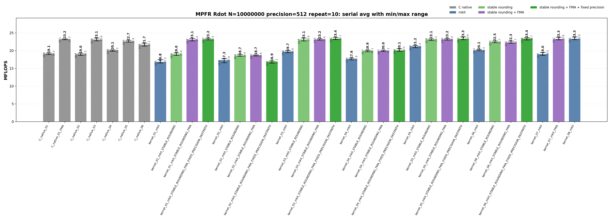
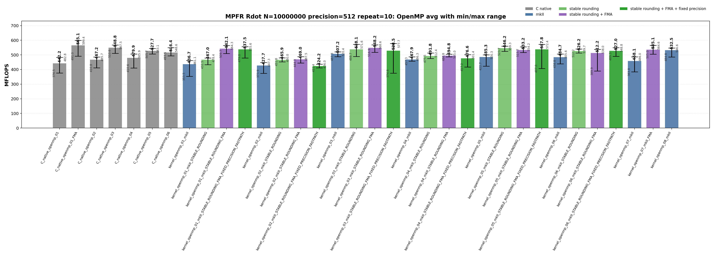

<!-- SPDX-License-Identifier: BSD-2-Clause -->

# 00_Rdot

This directory benchmarks the MPFR real dot product

```text
sum_i x_i * y_i
```

with fixed-precision `mpfr_t` and `mpfrxx::mpfr_class` data.  The benchmark is
kept parallel to `benchmarks/gmp/00_Rdot/`: every kernel shape is a standalone
translation unit and the timed function is `_Rdot()`, so source shape,
optimization flags, and hotpath disassembly can be compared directly.

## Build

From the repository root:

```bash
cmake -S . -B build_bench_release -DCMAKE_BUILD_TYPE=Release
cmake --build build_bench_release -j
```

Executables are created under:

```text
build_bench_release/benchmarks/mpfr/00_Rdot/
```

Each executable takes:

```text
<vector size> <precision>
```

Example:

```bash
build_bench_release/benchmarks/mpfr/00_Rdot/Rdot_mpfr_kernel_03_mkII 10000000 512
```

## Kernel Shapes

Kernel numbers `01..06` intentionally match GMP Rdot.  MPFR-specific context
kernels are added as `07` and `08`.

| Kernel | Timed source shape | Purpose |
|--------|--------------------|---------|
| `01` | `acc += dx[i] * dy[i]` | Expression form.  FMA builds can lower this source to one `mpfr_fma` call per element. |
| `02` | `mpfr_class templ = dx[i] * dy[i]; acc += templ;` | Loop-local product object; intentionally expensive control. |
| `03` | `templ = dx[i] * dy[i]; acc += templ;` | One product object initialized outside the loop and reused. |
| `04` | `templ = dx[i]; templ *= dy[i]; acc += templ;` | Reused product object with copy-then-multiply source shape. |
| `05` | Four accumulators with one reused product object. | Tests accumulator unrolling while keeping one product temporary. |
| `06` | Four accumulators with four reused product objects. | Tests accumulator unrolling plus independent product temporaries. |
| `07` | `with_context(acc, ctx) += dx[i] * dy[i]` | Context-bound `01`; rounding is captured before the loop.  FMA builds can lower this to `mpfr_fma`. |
| `08` | `with_context(templ, ctx) = dx[i] * dy[i]; with_context(acc, ctx) += templ;` | Context-bound `03`; one product object is reused and loop operations use cached context rounding. |

Raw C baselines use:

```text
Rdot_mpfr_C_native_NN
Rdot_mpfr_C_native_openmp_NN
```

The raw FMA baseline is intentionally a separate source file:

```text
Rdot_mpfr_C_native_01_FMA
Rdot_mpfr_C_native_openmp_01_FMA
```

Wrapper suffixes are cumulative:

| Suffix | Build option | Meaning |
|--------|--------------|---------|
| `mkII` | none | Generic wrapper expression path. |
| `STABLE_ROUNDING` | `GMPFRXX_MKII_ASSUME_STABLE_MPFR_ROUNDING_MODE` | Avoids the generic default-rounding lookup path and uses the wrapper stable rounding path. |
| `STABLE_ROUNDING_FMA` | stable rounding + `MPFRXX_ENABLE_FMA` | Allows expression shapes such as `acc += dx[i] * dy[i]` to lower to `mpfr_fma`. |
| `STABLE_ROUNDING_FMA_FIXED_PRECISION_FASTPATH` | stable rounding + FMA + `GMPFRXX_MKII_ASSUME_FIXED_PRECISION_FASTPATH` | Enables fixed-precision wrapper specialization where applicable. |

Context-bound kernels are explicit targets:

```text
Rdot_mpfr_kernel_07_mkII
Rdot_mpfr_kernel_07_mkII_FMA
Rdot_mpfr_kernel_08_mkII
Rdot_mpfr_kernel_openmp_07_mkII
Rdot_mpfr_kernel_openmp_07_mkII_FMA
Rdot_mpfr_kernel_openmp_08_mkII
```

## Recorded Run

The current checked-in MPFR Rdot data was regenerated from scratch after
removing older result directories.

```text
N = 10000000
precision = 512
repeat = 10
OMP_NUM_THREADS = 32
OMP_PLACES = cores
OMP_PROC_BIND = spread
CPU = AMD Ryzen Threadripper 3970X 32-Core Processor
```

Results are stored in:

```text
results_raw/rdot_mpfr_n10000000_p512_repeat10_20260517_121244/
```

Files:

- [Raw log](results_raw/rdot_mpfr_n10000000_p512_repeat10_20260517_121244/benchmark_rdot_mpfr_n10000000_p512_repeat10.log)
- [Raw CSV](results_raw/rdot_mpfr_n10000000_p512_repeat10_20260517_121244/raw_rdot_mpfr_n10000000_p512_repeat10.csv)
- [Summary CSV](results_raw/rdot_mpfr_n10000000_p512_repeat10_20260517_121244/summary_rdot_mpfr_n10000000_p512_repeat10.csv)

The sweep covers 68 variants and 680 timed runs.  Every timed run reported
`OK`.

The plots show average MFLOPS as vertical bars.  The black range line on each
bar is the observed min-to-max interval across the 10 repeats; labels show the
average and the range endpoints.





The images can be regenerated with:

```bash
python3 benchmarks/mpfr/00_Rdot/plot_repeat_summary.py \
    benchmarks/mpfr/00_Rdot/results_raw/rdot_mpfr_n10000000_p512_repeat10_20260517_121244/benchmark_rdot_mpfr_n10000000_p512_repeat10.log \
    --output-dir benchmarks/mpfr/00_Rdot/results_raw/rdot_mpfr_n10000000_p512_repeat10_20260517_121244 \
    --output-prefix rdot_mpfr_n10000000_p512_repeat10 \
    --title-prefix "MPFR Rdot N=10000000 precision=512 repeat=10"
```

## Headline Results

| Class | Best average variant | Max MFLOPS | Avg MFLOPS | Min MFLOPS | Notes |
|-------|----------------------|-----------:|-----------:|-----------:|-------|
| Serial wrapper | `kernel_06_mkII_STABLE_ROUNDING_FMA_FIXED_PRECISION_FASTPATH` | 23.655 | 23.412 | 23.005 | Best serial average; unrolled reused-temporary source shape. |
| Serial raw C | `C_native_01_FMA` | 23.324 | 23.205 | 23.095 | Raw FMA baseline with rounding loaded before the loop. |
| OpenMP wrapper | `kernel_openmp_03_mkII_STABLE_ROUNDING_FMA` | 568.638 | 548.163 | 516.927 | Best wrapper OpenMP average; essentially tied with raw reusable-product C. |
| OpenMP raw C | `C_native_openmp_01_FMA` | 599.371 | 565.068 | 491.029 | Best OpenMP average overall. |

## Serial Results

| Rank | Variant | Max MFLOPS | Avg MFLOPS | Min MFLOPS |
|------|---------|-----------:|-----------:|-----------:|
| 1 | `kernel_06_mkII_STABLE_ROUNDING_FMA_FIXED_PRECISION_FASTPATH` | 23.655 | 23.412 | 23.005 |
| 2 | `kernel_03_mkII_STABLE_ROUNDING_FMA_FIXED_PRECISION_FASTPATH` | 23.736 | 23.380 | 23.134 |
| 3 | `kernel_08_mkII` | 23.905 | 23.332 | 23.080 |
| 4 | `kernel_05_mkII_STABLE_ROUNDING_FMA_FIXED_PRECISION_FASTPATH` | 23.910 | 23.313 | 23.077 |
| 5 | `kernel_07_mkII_FMA` | 23.803 | 23.299 | 23.060 |
| 6 | `kernel_01_mkII_STABLE_ROUNDING_FMA_FIXED_PRECISION_FASTPATH` | 23.476 | 23.219 | 23.028 |
| 7 | `C_native_01_FMA` | 23.324 | 23.205 | 23.095 |
| 8 | `kernel_05_mkII_STABLE_ROUNDING_FMA` | 23.399 | 23.205 | 22.972 |
| 9 | `kernel_03_mkII_STABLE_ROUNDING_FMA` | 23.360 | 23.171 | 22.979 |
| 10 | `kernel_05_mkII_STABLE_ROUNDING` | 23.341 | 23.149 | 22.860 |
| 11 | `kernel_01_mkII_STABLE_ROUNDING_FMA` | 23.431 | 23.128 | 22.739 |
| 12 | `C_native_03` | 23.558 | 23.122 | 22.764 |
| 13 | `kernel_03_mkII_STABLE_ROUNDING` | 23.555 | 23.110 | 22.711 |
| 14 | `C_native_05` | 22.921 | 22.651 | 22.420 |
| 15 | `kernel_06_mkII_STABLE_ROUNDING` | 22.715 | 22.494 | 22.230 |
| 16 | `kernel_06_mkII_STABLE_ROUNDING_FMA` | 22.688 | 22.329 | 22.070 |
| 17 | `C_native_06` | 22.106 | 21.679 | 21.273 |
| 18 | `kernel_05_mkII` | 21.434 | 21.186 | 20.837 |
| 19 | `kernel_06_mkII` | 20.297 | 20.111 | 19.997 |
| 20 | `C_native_04` | 20.215 | 20.090 | 19.814 |
| 21 | `kernel_04_mkII_STABLE_ROUNDING_FMA_FIXED_PRECISION_FASTPATH` | 20.536 | 20.056 | 19.818 |
| 22 | `kernel_04_mkII_STABLE_ROUNDING_FMA` | 20.109 | 19.960 | 19.739 |
| 23 | `kernel_04_mkII_STABLE_ROUNDING` | 20.099 | 19.945 | 19.701 |
| 24 | `kernel_03_mkII` | 20.044 | 19.739 | 19.425 |
| 25 | `C_native_01` | 19.332 | 19.136 | 18.882 |
| 26 | `C_native_02` | 19.309 | 19.038 | 18.660 |
| 27 | `kernel_01_mkII_STABLE_ROUNDING` | 19.366 | 19.037 | 18.637 |
| 28 | `kernel_07_mkII` | 19.482 | 19.028 | 18.659 |
| 29 | `kernel_02_mkII_STABLE_ROUNDING_FMA` | 18.805 | 18.699 | 18.474 |
| 30 | `kernel_02_mkII_STABLE_ROUNDING` | 18.908 | 18.653 | 18.395 |
| 31 | `kernel_04_mkII` | 17.906 | 17.638 | 17.421 |
| 32 | `kernel_02_mkII` | 17.760 | 17.306 | 16.602 |
| 33 | `kernel_02_mkII_STABLE_ROUNDING_FMA_FIXED_PRECISION_FASTPATH` | 17.071 | 16.874 | 16.459 |
| 34 | `kernel_01_mkII` | 17.475 | 16.832 | 16.531 |

## OpenMP Results

| Rank | Variant | Max MFLOPS | Avg MFLOPS | Min MFLOPS |
|------|---------|-----------:|-----------:|-----------:|
| 1 | `C_native_openmp_01_FMA` | 599.371 | 565.068 | 491.029 |
| 2 | `C_native_openmp_03` | 567.461 | 548.785 | 510.559 |
| 3 | `kernel_openmp_03_mkII_STABLE_ROUNDING_FMA` | 568.638 | 548.163 | 516.927 |
| 4 | `kernel_openmp_05_mkII_STABLE_ROUNDING` | 559.280 | 546.197 | 523.651 |
| 5 | `kernel_openmp_01_mkII_STABLE_ROUNDING_FMA` | 564.284 | 542.083 | 509.687 |
| 6 | `kernel_openmp_03_mkII_STABLE_ROUNDING` | 571.617 | 538.091 | 488.745 |
| 7 | `kernel_openmp_05_mkII_STABLE_ROUNDING_FMA_FIXED_PRECISION_FASTPATH` | 572.399 | 537.769 | 407.027 |
| 8 | `kernel_openmp_01_mkII_STABLE_ROUNDING_FMA_FIXED_PRECISION_FASTPATH` | 555.579 | 537.461 | 479.025 |
| 9 | `kernel_openmp_07_mkII_FMA` | 564.612 | 535.071 | 504.976 |
| 10 | `kernel_openmp_05_mkII_STABLE_ROUNDING_FMA` | 554.247 | 533.233 | 515.723 |
| 11 | `kernel_openmp_08_mkII` | 546.618 | 532.549 | 484.783 |
| 12 | `kernel_openmp_03_mkII_STABLE_ROUNDING_FMA_FIXED_PRECISION_FASTPATH` | 577.677 | 528.507 | 374.785 |
| 13 | `C_native_openmp_05` | 543.066 | 527.735 | 505.663 |
| 14 | `kernel_openmp_06_mkII_STABLE_ROUNDING_FMA_FIXED_PRECISION_FASTPATH` | 548.766 | 527.031 | 489.298 |
| 15 | `kernel_openmp_06_mkII_STABLE_ROUNDING` | 539.661 | 526.163 | 512.191 |
| 16 | `C_native_openmp_06` | 548.620 | 516.422 | 493.478 |
| 17 | `kernel_openmp_06_mkII_STABLE_ROUNDING_FMA` | 538.030 | 512.247 | 389.938 |
| 18 | `kernel_openmp_03_mkII` | 520.383 | 507.215 | 487.346 |
| 19 | `kernel_openmp_04_mkII_STABLE_ROUNDING_FMA` | 504.952 | 494.796 | 486.827 |
| 20 | `kernel_openmp_04_mkII_STABLE_ROUNDING` | 512.408 | 491.774 | 475.495 |
| 21 | `kernel_openmp_05_mkII` | 500.336 | 485.274 | 422.739 |
| 22 | `kernel_openmp_06_mkII` | 505.554 | 484.693 | 438.794 |
| 23 | `C_native_openmp_04` | 505.948 | 479.875 | 410.641 |
| 24 | `kernel_openmp_04_mkII_STABLE_ROUNDING_FMA_FIXED_PRECISION_FASTPATH` | 501.401 | 476.643 | 417.224 |
| 25 | `kernel_openmp_02_mkII_STABLE_ROUNDING_FMA` | 487.543 | 468.988 | 444.340 |
| 26 | `kernel_openmp_04_mkII` | 486.301 | 467.858 | 457.260 |
| 27 | `C_native_openmp_02` | 485.736 | 467.198 | 410.805 |
| 28 | `kernel_openmp_01_mkII_STABLE_ROUNDING` | 478.444 | 466.996 | 432.482 |
| 29 | `kernel_openmp_02_mkII_STABLE_ROUNDING` | 480.049 | 465.877 | 451.819 |
| 30 | `kernel_openmp_07_mkII` | 485.979 | 458.131 | 383.817 |
| 31 | `C_native_openmp_01` | 482.773 | 442.207 | 376.491 |
| 32 | `kernel_openmp_01_mkII` | 461.086 | 436.675 | 353.538 |
| 33 | `kernel_openmp_02_mkII` | 447.325 | 427.659 | 373.885 |
| 34 | `kernel_openmp_02_mkII_STABLE_ROUNDING_FMA_FIXED_PRECISION_FASTPATH` | 436.041 | 424.231 | 411.352 |

## Memory Bandwidth Estimates

The benchmark reports one dot-product operation as two FLOPs per element.  At
512-bit precision each MPFR mantissa has 8 limbs, or 64 bytes.  The minimum
payload stream for an Rdot element is therefore two input mantissas:

```text
payload bytes per element = 2 * 64 = 128 bytes
payload GB/s = MFLOPS * 128 / 2 / 1000 = MFLOPS * 0.064
```

This ignores `mpfr_t` headers, limb pointer chasing, allocator locality, and
per-thread partial reductions, so it is a lower bound on memory traffic.

| Variant | Avg MFLOPS | Payload GB/s |
|---------|-----------:|-------------:|
| `C_native_openmp_01_FMA` | 565.068 | 36.164 |
| `C_native_openmp_03` | 548.785 | 35.122 |
| `kernel_openmp_03_mkII_STABLE_ROUNDING_FMA` | 548.163 | 35.082 |
| `kernel_openmp_05_mkII_STABLE_ROUNDING` | 546.197 | 34.957 |
| `kernel_openmp_01_mkII_STABLE_ROUNDING_FMA` | 542.083 | 34.693 |
| `kernel_openmp_07_mkII_FMA` | 535.071 | 34.244 |

The top MPFR OpenMP Rdot kernels use roughly 34-36 GB/s of payload bandwidth by
this lower-bound model.  The achieved MFLOPS are still dominated by MPFR call
cost, rounding delivery, limb arithmetic, and reduction structure; the payload
bandwidth estimate alone is not enough to explain the ranking.

## Hotpath Disassembly

The raw C FMA baseline loads the default rounding mode once before the loop and
passes the cached register to `mpfr_fma`:

```asm
# Rdot_mpfr_C_native_01_FMA::_Rdot
3a19: call   mpfr_get_default_rounding_mode@plt
3a29: mov    %eax,%r12d       # cached rounding
...
3a50: mov    %rbx,%rdx        # y[i]
3a53: mov    %r15,%rsi        # x[i]
3a56: mov    %r12d,%r8d       # cached rounding
3a59: mov    %rbp,%rcx        # accumulator addend
3a5c: mov    %rbp,%rdi        # accumulator destination
3a6b: call   mpfr_fma@plt
3a73: jne    3a50
```

The stable wrapper FMA path has the same arithmetic call shape, but the generic
stable-rounding route still loads the rounding value from TLS in the loop:

```asm
# Rdot_mpfr_kernel_01_mkII_STABLE_ROUNDING_FMA::_Rdot
38b0: mov    %r13,%rcx        # accumulator addend
38b3: mov    %rbp,%rdx        # y[i]
38b6: mov    %r12,%rsi        # x[i]
38b9: mov    %r13,%rdi        # accumulator destination
38bc: mov    %fs:0xfffffffffffffffc,%r8d
38c5: call   mpfr_fma@plt
38d9: jne    38b0
```

The explicit-context FMA kernel captures the rounding mode before the loop and
keeps it in a register, matching the raw C rounding-delivery shape:

```asm
# Rdot_mpfr_kernel_07_mkII_FMA::_Rdot
390c: call   mpfr_get_default_rounding_mode@plt
3917: mov    %eax,%r15d       # context rounding
...
3950: mov    %r15d,%r8d       # cached context rounding
3953: mov    %r12,%rcx        # accumulator addend
3956: mov    %rbp,%rdx        # y[i]
3959: mov    %rbx,%rsi        # x[i]
395c: mov    %r12,%rdi        # accumulator destination
395f: call   mpfr_fma@plt
3973: jne    3950
```

The explicit-context reusable-product kernel is the non-FMA control: one
`mpfr_mul`, one `mpfr_add`, and cached rounding in a register for both calls:

```asm
# Rdot_mpfr_kernel_08_mkII::_Rdot
394f: call   mpfr_get_default_rounding_mode@plt
395a: mov    %eax,%r15d       # context rounding
...
39c0: mov    %r15d,%ecx       # cached context rounding
39c3: mov    %r12,%rdx        # y[i]
39c6: mov    %rbx,%rsi        # x[i]
39c9: mov    %r14,%rdi        # product destination
39cc: call   mpfr_mul@plt
39d1: mov    %r15d,%ecx       # cached context rounding
39d4: mov    %r14,%rdx        # product
39d7: mov    %r13,%rsi        # accumulator addend
39da: mov    %r13,%rdi        # accumulator destination
39dd: call   mpfr_add@plt
39f2: jne    39c0
```

The key difference from GMP is that MPFR always takes an explicit rounding mode
argument.  Raw C and explicit-context wrapper kernels can keep that mode in a
register.  Generic wrapper kernels must either use the generic default lookup
path or rely on a stable-rounding build path that may still show a TLS load in
the disassembly.

## Comparison with GMP Rdot

GMP `mpf` arithmetic does not pass a rounding mode to every hot operation.
After product temporary construction is removed, the GMP wrapper hotpath can get
very close to the raw C loop.

MPFR has an extra policy axis.  Avoiding product temporary materialization is
necessary, but not sufficient: the hot loop also needs a stable or explicit
rounding source.  The current data show three useful MPFR tiers:

| Tier | Representative | Avg MFLOPS | Meaning |
|------|----------------|-----------:|---------|
| Generic wrapper expression | `kernel_01_mkII` | 16.832 | Product materialization and generic rounding delivery are both visible. |
| Stable reusable product | `kernel_03_mkII_STABLE_ROUNDING` | 23.110 | Reused product object plus stable rounding reaches raw non-FMA C range. |
| Stable or explicit FMA | `kernel_01_mkII_STABLE_ROUNDING_FMA`, `kernel_07_mkII_FMA` | 23.128, 23.299 | One `mpfr_fma` per element; explicit context removes the TLS load. |

## Lessons Learned

`kernel_01` is the source shape that tests MPFR FMA fusion.  The expression
`acc += dx[i] * dy[i]` preserves the multiply-add pattern; in an FMA-enabled
build the hotpath can become one `mpfr_fma` call per element.

`kernel_02` is the intentionally bad wrapper shape.  It constructs a product
object inside every iteration, so neither OpenMP nor FMA-oriented build flags
can turn it into the raw C hotpath.

`kernel_03` is the main non-FMA wrapper shape.  It reuses one product object and
can reach the raw C non-FMA range once rounding delivery is stabilized.

`kernel_04` shows that reusing an object is not enough.  The copy-then-multiply
source shape adds MPFR state movement and stays behind the cleaner reusable
product path.

`kernel_05` and `kernel_06` are controls for unrolling and product temporary
policy.  They can be useful as performance probes, but the `FMA` suffix on
these builds does not mean the loop actually calls `mpfr_fma`; the source shape
and disassembly decide that.

`kernel_07` is the explicit-context version of `kernel_01`.  It captures
rounding outside the loop and, with FMA enabled, produces the closest wrapper
hotpath to raw C FMA.

`kernel_08` is the explicit-context version of `kernel_03`.  It is the clean
non-FMA control for the same API idea: one reused product object, one multiply,
one add, and no per-iteration default-rounding lookup.

OpenMP results should be read by average and min/max range, not by max alone.
The best wrapper OpenMP average in this run is
`kernel_openmp_03_mkII_STABLE_ROUNDING_FMA` at `548.163 MFLOPS`, close to
`C_native_openmp_03` at `548.785 MFLOPS` and behind raw FMA at
`565.068 MFLOPS`.  The range remains wide enough that single-run maxima are not
stable evidence.

The full executable wall time is not the ranking metric.  Each executable also
initializes large vectors and computes a serial reference after the timed
kernel.  The plots and tables rank only the timed `_Rdot()` loop.
