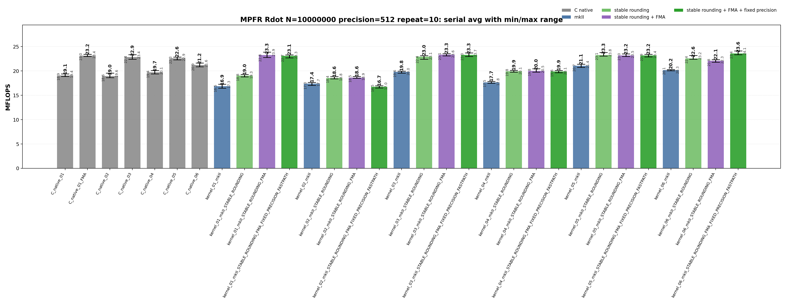
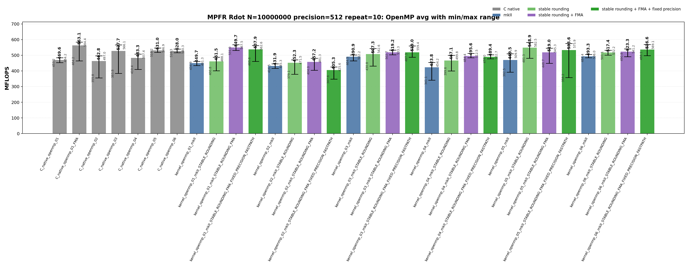

<!-- SPDX-License-Identifier: BSD-2-Clause -->

# 00_Rdot

This directory benchmarks the MPFR real dot product

```text
sum_i x_i * y_i
```

with fixed-precision `mpfr_t` and `mpfrxx::mpfr_class` data.  The source
layout intentionally mirrors `benchmarks/gmp/00_Rdot/`: each kernel shape is a
standalone translation unit, so the hot loop can be inspected directly with
`objdump`.

## Build

From the repository root:

```bash
cmake -S . -B build_bench_release -DCMAKE_BUILD_TYPE=Release
cmake --build build_bench_release -j
```

Executables are created under:

```text
build_bench_release/benchmarks/mpfr/00_Rdot/
```

Each executable takes:

```text
<vector size> <precision>
```

Example:

```bash
build_bench_release/benchmarks/mpfr/00_Rdot/Rdot_mpfr_kernel_03_mkII 10000000 512
```

## Kernel Shapes

The timed body is `_Rdot()`.  Kernel numbers are aligned with GMP Rdot for
`01..06`.

| Kernel | Timed source shape | Temporary policy |
|--------|--------------------|------------------|
| `01` | `acc += dx[i] * dy[i]` expression form. | Preserves the multiply-add expression; FMA builds can lower this to `mpfr_fma`. |
| `02` | `mpfr_class templ = dx[i] * dy[i]; acc += templ;` | Product object is constructed inside every iteration. |
| `03` | `templ = dx[i] * dy[i]; acc += templ;` | One product object is initialized before the loop and reused. |
| `04` | `templ = dx[i]; templ *= dy[i]; acc += templ;` | One product object is reused, but every iteration copies `dx[i]` before multiplication. |
| `05` | Four accumulators with one reused product object. | Tests accumulator dependency with a single product temporary. |
| `06` | Four accumulators with four reused product objects. | Separates accumulator unrolling from product temporary reuse. |

Raw C kernels use:

```text
Rdot_mpfr_C_native_NN
Rdot_mpfr_C_native_openmp_NN
```

The explicit raw FMA baseline is intentionally a separate source file:

```text
Rdot_mpfr_C_native_01_FMA
Rdot_mpfr_C_native_openmp_01_FMA
```

Wrapper kernels use:

```text
Rdot_mpfr_kernel_NN_mkII
Rdot_mpfr_kernel_NN_mkII_STABLE_ROUNDING
Rdot_mpfr_kernel_NN_mkII_STABLE_ROUNDING_FMA
Rdot_mpfr_kernel_NN_mkII_STABLE_ROUNDING_FMA_FIXED_PRECISION_FASTPATH
Rdot_mpfr_kernel_openmp_NN_mkII
Rdot_mpfr_kernel_openmp_NN_mkII_STABLE_ROUNDING
Rdot_mpfr_kernel_openmp_NN_mkII_STABLE_ROUNDING_FMA
Rdot_mpfr_kernel_openmp_NN_mkII_STABLE_ROUNDING_FMA_FIXED_PRECISION_FASTPATH
```

The wrapper suffixes are cumulative:

| Suffix | Build option | Meaning |
|--------|--------------|---------|
| `mkII` | none | Generic wrapper expression path. |
| `STABLE_ROUNDING` | `GMPFRXX_MKII_ASSUME_STABLE_MPFR_ROUNDING_MODE` | Uses the wrapper's cached thread-local rounding value instead of the generic default-rounding lookup path. |
| `STABLE_ROUNDING_FMA` | stable rounding + `MPFRXX_ENABLE_FMA` | Allows expression shapes such as `acc += dx[i] * dy[i]` to lower to `mpfr_fma`. |
| `STABLE_ROUNDING_FMA_FIXED_PRECISION_FASTPATH` | stable rounding + FMA + `GMPFRXX_MKII_ASSUME_FIXED_PRECISION_FASTPATH` | Assumes fixed precision for specialized wrapper evaluation paths. |

## Recorded Run

This README reports the current repeat-10 run:

```text
N = 10000000
precision = 512
repeat = 10
OMP_NUM_THREADS = 32
OMP_PLACES = cores
OMP_PROC_BIND = spread
CPU = AMD Ryzen Threadripper 3970X 32-Core Processor
```

Results are stored in:

```text
results_raw/rdot_mpfr_n10000000_p512_repeat10_20260517_090826/
```

Files:

- [Raw log](results_raw/rdot_mpfr_n10000000_p512_repeat10_20260517_090826/benchmark_rdot_mpfr_n10000000_p512_repeat10.log)
- [Raw CSV](results_raw/rdot_mpfr_n10000000_p512_repeat10_20260517_090826/raw_rdot_mpfr_n10000000_p512_repeat10.csv)
- [Summary CSV](results_raw/rdot_mpfr_n10000000_p512_repeat10_20260517_090826/summary_rdot_mpfr_n10000000_p512_repeat10.csv)

All 62 variants report `OK` in all 10 runs.

The plots below show average MFLOPS as vertical bars.  The black range line on
each bar is the observed min-to-max interval across the 10 repeats; the large
label is the average and the small labels mark min and max.





The images can be regenerated with:

```bash
python3 benchmarks/mpfr/00_Rdot/plot_repeat_summary.py \
    benchmarks/mpfr/00_Rdot/results_raw/rdot_mpfr_n10000000_p512_repeat10_20260517_090826/benchmark_rdot_mpfr_n10000000_p512_repeat10.log \
    --output-dir benchmarks/mpfr/00_Rdot/results_raw/rdot_mpfr_n10000000_p512_repeat10_20260517_090826 \
    --output-prefix rdot_mpfr_n10000000_p512_repeat10 \
    --title-prefix "MPFR Rdot N=10000000 precision=512 repeat=10"
```

## Serial Results

| Variant | Max MFLOPS | Avg MFLOPS | Min MFLOPS | Interpretation |
|---------|-----------:|-----------:|-----------:|----------------|
| `kernel_06_mkII_STABLE_ROUNDING_FMA_FIXED_PRECISION_FASTPATH` | 24.140 | 23.595 | 23.352 | Best serial average in this run; four-way unrolled product-temporary shape. |
| `kernel_03_mkII_STABLE_ROUNDING_FMA` | 23.554 | 23.332 | 23.093 | Reused product object with stable rounding; source does not preserve the original FMA expression. |
| `kernel_03_mkII_STABLE_ROUNDING_FMA_FIXED_PRECISION_FASTPATH` | 23.733 | 23.303 | 22.991 | Same source shape as `03`, with fixed-precision specialization. |
| `kernel_05_mkII_STABLE_ROUNDING` | 23.806 | 23.260 | 23.078 | Four accumulators, one product object. |
| `kernel_01_mkII_STABLE_ROUNDING_FMA` | 23.875 | 23.255 | 22.774 | Closest wrapper source shape to raw FMA: one `mpfr_fma` per element. |
| `C_native_01_FMA` | 23.420 | 23.156 | 22.989 | Raw C FMA baseline with rounding cached before the loop. |
| `kernel_03_mkII_STABLE_ROUNDING` | 23.149 | 22.950 | 22.435 | Closest non-FMA wrapper path to raw reusable-product C. |
| `C_native_03` | 23.365 | 22.850 | 22.420 | Raw C reusable-product non-FMA baseline. |
| `C_native_01` | 19.411 | 19.091 | 18.882 | Raw C expression-shaped non-FMA baseline. |
| `kernel_01_mkII` | 17.295 | 16.866 | 16.479 | Generic wrapper expression path materializes a product object in the loop. |
| `kernel_02_mkII` | 17.664 | 17.430 | 17.048 | Explicit loop-local product object remains expensive. |

<details>
<summary>Serial results sorted by Avg MFLOPS</summary>

| Rank | Variant | Max MFLOPS | Avg MFLOPS | Min MFLOPS |
|------|---------|-----------:|-----------:|-----------:|
| 1 | `kernel_06_mkII_STABLE_ROUNDING_FMA_FIXED_PRECISION_FASTPATH` | 24.140 | 23.595 | 23.352 |
| 2 | `kernel_03_mkII_STABLE_ROUNDING_FMA` | 23.554 | 23.332 | 23.093 |
| 3 | `kernel_03_mkII_STABLE_ROUNDING_FMA_FIXED_PRECISION_FASTPATH` | 23.733 | 23.303 | 22.991 |
| 4 | `kernel_05_mkII_STABLE_ROUNDING` | 23.806 | 23.260 | 23.078 |
| 5 | `kernel_01_mkII_STABLE_ROUNDING_FMA` | 23.875 | 23.255 | 22.774 |
| 6 | `kernel_05_mkII_STABLE_ROUNDING_FMA_FIXED_PRECISION_FASTPATH` | 23.447 | 23.202 | 22.895 |
| 7 | `kernel_05_mkII_STABLE_ROUNDING_FMA` | 23.502 | 23.174 | 22.997 |
| 8 | `C_native_01_FMA` | 23.420 | 23.156 | 22.989 |
| 9 | `kernel_01_mkII_STABLE_ROUNDING_FMA_FIXED_PRECISION_FASTPATH` | 23.313 | 23.088 | 22.703 |
| 10 | `kernel_03_mkII_STABLE_ROUNDING` | 23.149 | 22.950 | 22.435 |
| 11 | `C_native_03` | 23.365 | 22.850 | 22.420 |
| 12 | `C_native_05` | 22.865 | 22.605 | 22.311 |

</details>

## OpenMP Results

| Variant | Max MFLOPS | Avg MFLOPS | Min MFLOPS | Interpretation |
|---------|-----------:|-----------:|-----------:|----------------|
| `C_native_openmp_01_FMA` | 584.437 | 563.132 | 464.160 | Best OpenMP average in this run; raw FMA with cached rounding. |
| `kernel_openmp_01_mkII_STABLE_ROUNDING_FMA` | 567.522 | 549.652 | 531.013 | Best wrapper OpenMP average; expression source lowers to FMA. |
| `kernel_openmp_05_mkII_STABLE_ROUNDING` | 582.471 | 548.917 | 481.320 | Best non-FMA wrapper OpenMP average; four accumulators with one product object. |
| `kernel_openmp_01_mkII_STABLE_ROUNDING_FMA_FIXED_PRECISION_FASTPATH` | 562.597 | 537.939 | 460.631 | Same source shape as `01`; fixed-precision specialization did not beat stable FMA here. |
| `kernel_openmp_06_mkII_STABLE_ROUNDING_FMA_FIXED_PRECISION_FASTPATH` | 569.073 | 536.570 | 498.109 | Four accumulators and four products; strong but not dominant. |
| `C_native_openmp_05` | 546.894 | 531.039 | 518.222 | Raw C unrolled non-FMA baseline. |
| `C_native_openmp_03` | 566.095 | 527.707 | 383.832 | Raw C reusable-product baseline with visible OpenMP variance. |
| `kernel_openmp_03_mkII_STABLE_ROUNDING_FMA` | 533.324 | 519.212 | 502.653 | Reused product wrapper shape; FMA option does not turn this source into `mpfr_fma`. |
| `kernel_openmp_03_mkII_STABLE_ROUNDING` | 542.645 | 507.284 | 430.795 | Non-FMA reusable-product wrapper baseline. |
| `kernel_openmp_01_mkII` | 461.294 | 449.703 | 434.876 | Generic expression path is far behind stable FMA. |

<details>
<summary>OpenMP results sorted by Avg MFLOPS</summary>

| Rank | Variant | Max MFLOPS | Avg MFLOPS | Min MFLOPS |
|------|---------|-----------:|-----------:|-----------:|
| 1 | `C_native_openmp_01_FMA` | 584.437 | 563.132 | 464.160 |
| 2 | `kernel_openmp_01_mkII_STABLE_ROUNDING_FMA` | 567.522 | 549.652 | 531.013 |
| 3 | `kernel_openmp_05_mkII_STABLE_ROUNDING` | 582.471 | 548.917 | 481.320 |
| 4 | `kernel_openmp_01_mkII_STABLE_ROUNDING_FMA_FIXED_PRECISION_FASTPATH` | 562.597 | 537.939 | 460.631 |
| 5 | `kernel_openmp_06_mkII_STABLE_ROUNDING_FMA_FIXED_PRECISION_FASTPATH` | 569.073 | 536.570 | 498.109 |
| 6 | `kernel_openmp_05_mkII_STABLE_ROUNDING_FMA_FIXED_PRECISION_FASTPATH` | 575.943 | 533.640 | 358.176 |
| 7 | `C_native_openmp_05` | 546.894 | 531.039 | 518.222 |
| 8 | `C_native_openmp_06` | 540.322 | 528.023 | 516.316 |
| 9 | `C_native_openmp_03` | 566.095 | 527.707 | 383.832 |
| 10 | `kernel_openmp_06_mkII_STABLE_ROUNDING_FMA` | 541.169 | 523.279 | 490.821 |
| 11 | `kernel_openmp_03_mkII_STABLE_ROUNDING_FMA` | 533.324 | 519.212 | 502.653 |
| 12 | `kernel_openmp_03_mkII_STABLE_ROUNDING_FMA_FIXED_PRECISION_FASTPATH` | 559.385 | 518.987 | 487.339 |

</details>

## Memory Bandwidth Estimates

These are model estimates derived from MFLOPS, not hardware-counter
measurements.  For 512-bit MPFR data in this build:

```text
sizeof(__mpfr_struct) = 32 bytes
sizeof(mp_limb_t)     = 8 bytes
active limbs          = 8
```

Rdot performs two floating operations per element.  A lower-bound active-limb
traffic estimate is:

```text
active-limb GB/s      = MFLOPS * (2 inputs * 8 limbs * 8 bytes) / 2000
                      = MFLOPS * 0.064
header-inclusive GB/s = MFLOPS * (2 inputs * (32 + 8 * 8) bytes) / 2000
                      = MFLOPS * 0.096
```

Representative paths:

| Variant | Avg MFLOPS | Active-limb GB/s | Header-inclusive GB/s |
|---------|-----------:|-----------------:|----------------------:|
| `kernel_06_mkII_STABLE_ROUNDING_FMA_FIXED_PRECISION_FASTPATH` | 23.595 | 1.51 | 2.27 |
| `C_native_01_FMA` | 23.156 | 1.48 | 2.22 |
| `C_native_openmp_01_FMA` | 563.132 | 36.04 | 54.06 |
| `kernel_openmp_01_mkII_STABLE_ROUNDING_FMA` | 549.652 | 35.18 | 52.77 |
| `kernel_openmp_05_mkII_STABLE_ROUNDING` | 548.917 | 35.13 | 52.70 |

The OpenMP top paths are already in a memory-traffic range where pointer
layout, NUMA placement, and run-to-run scheduler variance matter.

## Hotpath Disassembly

The raw FMA baseline has one `mpfr_fma` call per element.  Rounding is loaded
once before the loop and kept in a register:

```asm
# Rdot_mpfr_C_native_01_FMA
3a19: call   mpfr_get_default_rounding_mode@plt
...
3a50: mov    %rbx,%rdx        # y input
3a53: mov    %r15,%rsi        # x input
3a56: mov    %r12d,%r8d       # cached rounding
3a59: mov    %rbp,%rcx        # accumulator addend
3a5c: mov    %rbp,%rdi        # accumulator destination
3a6b: call   mpfr_fma@plt
3a73: jne    3a50
```

The closest wrapper FMA source shape is `kernel_01` with stable rounding and
FMA enabled.  It also has one `mpfr_fma` call per element, but rounding is
loaded from wrapper TLS inside the loop:

```asm
# Rdot_mpfr_kernel_01_mkII_STABLE_ROUNDING_FMA
38b0: mov    %r13,%rcx        # accumulator addend
38b3: mov    %rbp,%rdx        # y input
38b6: mov    %r12,%rsi        # x input
38b9: mov    %r13,%rdi        # accumulator destination
38bc: mov    %fs:0xfffffffffffffffc,%r8d
38c5: call   mpfr_fma@plt
38d9: jne    38b0
```

The generic `kernel_01_mkII` path is not close to C native.  It performs a
rounding lookup, initializes a product object, multiplies, adds, and clears the
product object inside the loop:

```asm
# Rdot_mpfr_kernel_01_mkII
3898: call   mpfr_get_default_rounding_mode@plt
38a7: call   mpfr_init2@plt
38b8: call   mpfr_mul@plt
38c9: call   mpfr_add@plt
38dd: call   mpfr_clear@plt
38e7: jne    3890
```

For non-FMA reusable-product code, C native keeps rounding in a register:

```asm
# Rdot_mpfr_C_native_03
399f: mov    %eax,%r12d       # cached rounding
...
39f6: mov    %r12d,%ecx
39fc: call   mpfr_mul@plt
3a01: mov    %r12d,%ecx
3a19: call   mpfr_add@plt
3a22: jne    39f0
```

The wrapper `kernel_03_mkII_STABLE_ROUNDING` removes loop-local product
construction, but the hot loop still loads rounding from TLS for each MPFR
operation:

```asm
# Rdot_mpfr_kernel_03_mkII_STABLE_ROUNDING
38b0: mov    %fs:0xfffffffffffffffc,%ecx
38c1: call   mpfr_mul@plt
38c6: mov    %fs:0xfffffffffffffffc,%ecx
38d7: call   mpfr_add@plt
38eb: jne    38b0
```

The `06` fixed-precision path is useful as a source-shape control.  It is
unrolled and uses reused product objects, but this source no longer preserves
the original multiply-add expression, so the hot loop remains `mpfr_mul` plus
`mpfr_add` rather than `mpfr_fma`:

```asm
# Rdot_mpfr_kernel_06_mkII_STABLE_ROUNDING_FMA_FIXED_PRECISION_FASTPATH
3aa0: mov    %fs:0xfffffffffffffffc,%ecx
3ab6: call   mpfr_mul@plt
3abb: mov    %fs:0xfffffffffffffffc,%ecx
3ad0: call   mpfr_mul@plt
3ad5: mov    %fs:0xfffffffffffffffc,%ecx
3aea: call   mpfr_mul@plt
3aef: mov    %fs:0xfffffffffffffffc,%ecx
3b04: call   mpfr_mul@plt
3b09: mov    %fs:0xfffffffffffffffc,%ecx
3b1f: call   mpfr_add@plt
3b29: mov    %fs:0xfffffffffffffffc,%ecx
3b39: call   mpfr_add@plt
3b3e: mov    %fs:0xfffffffffffffffc,%ecx
3b5b: call   mpfr_add@plt
3b65: mov    %fs:0xfffffffffffffffc,%ecx
3b75: call   mpfr_add@plt
3b8b: jne    3aa0
```

## Comparison with GMP Rdot

GMP `mpf` arithmetic does not pass an explicit rounding mode to every hot
operation.  After repeated temporary construction is removed, the GMP wrapper
hotpath can get very close to the raw C loop.

MPFR is different.  Every `mpfr_mul`, `mpfr_add`, and `mpfr_fma` call receives
an `mpfr_rnd_t`.  Raw C can load that value once before the loop.  A generic
wrapper expression cannot assume the rounding context is immutable unless the
build or an explicit scope says so.  Stable rounding removes the function-call
lookup path, but the generic wrapper loop can still contain a TLS load.

This run shows the practical split:

| Shape | Avg MFLOPS | What it shows |
|-------|-----------:|---------------|
| `C_native_03` | 22.850 | Raw non-FMA reusable-product loop with cached rounding. |
| `kernel_03_mkII` | 19.815 | Product object is reused, but generic rounding delivery remains visible. |
| `kernel_03_mkII_STABLE_ROUNDING` | 22.950 | Product object is reused and rounding delivery is reduced to the stable path. |
| `C_native_01_FMA` | 23.156 | Raw FMA loop with cached rounding. |
| `kernel_01_mkII_STABLE_ROUNDING_FMA` | 23.255 | Wrapper FMA loop; remaining difference is within run noise here. |

The GMP lesson is mostly "avoid product temporary materialization."  The MPFR
lesson is stricter: avoid product temporary materialization and make rounding
delivery explicit, stable, or specialized.

## Lessons Learned

`kernel_01` is the right source shape for testing FMA fusion.  The expression
`acc += dx[i] * dy[i]` keeps the multiply-add pattern intact.  In a stable FMA
build, the disassembly shows one `mpfr_fma` call per element, which is the
same arithmetic call shape as `C_native_01_FMA`.

`kernel_02` is deliberately the bad wrapper shape.  It constructs a product
object inside every iteration, so neither OpenMP nor FMA-oriented build flags
can turn it into the raw C hotpath.

`kernel_03` is the most useful non-FMA wrapper source shape.  It reuses one
product object, avoids loop-local construction, and reaches the raw C non-FMA
range only when rounding delivery is also stabilized.

`kernel_04` proves that reusing an object is not enough.  The copy-then-multiply
source shape adds extra MPFR state movement and stays behind the cleaner
`kernel_03` path.

`kernel_05` and `kernel_06` are controls for unrolling and product temporary
policy.  They are useful for explaining source-shape effects, but the suffix
`FMA` on these builds does not imply that the hot loop actually calls
`mpfr_fma`; the disassembly decides that.

OpenMP results should be read by average and range, not max alone.  The best
wrapper OpenMP average in this run is `kernel_openmp_01_mkII_STABLE_ROUNDING_FMA`
at `549.652 MFLOPS`, close to `C_native_openmp_01_FMA` at `563.132 MFLOPS`.
Several non-FMA reusable-product paths are also in the same class, but the
run-to-run spread is large enough that a single max value is misleading.

The full executable wall time is not the ranked metric.  Each run initializes
large vectors and computes a serial reference after the timed kernel.  The
plots and tables rank only the timed `_Rdot()` loop.
