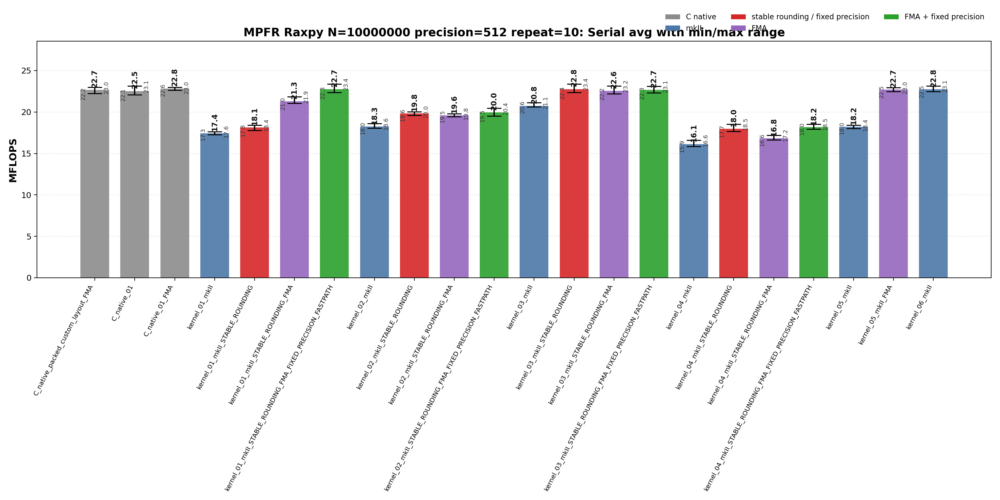
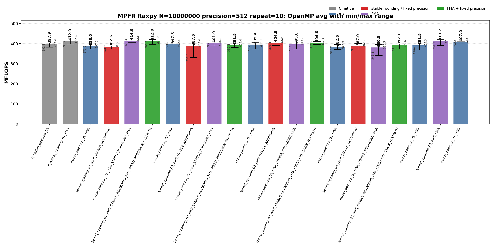
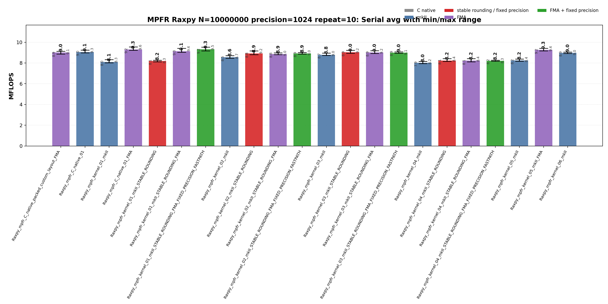
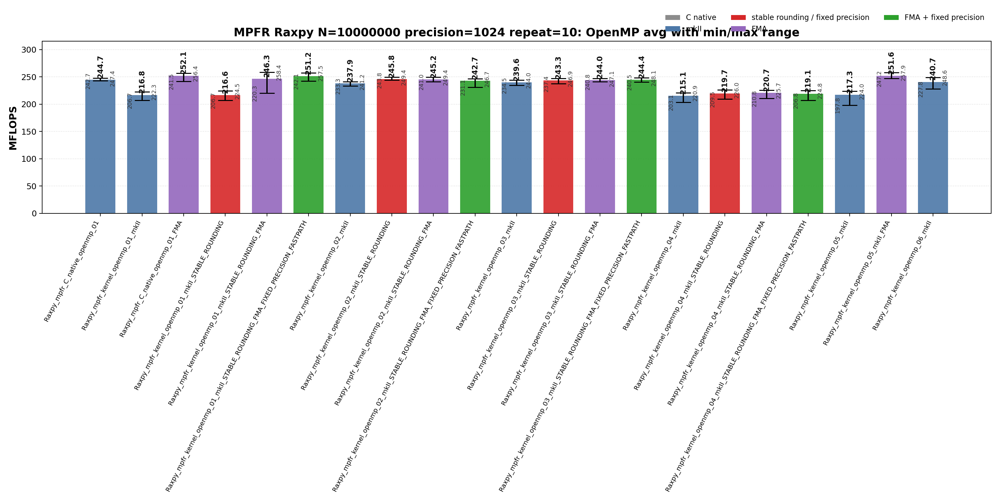

<!-- SPDX-License-Identifier: BSD-2-Clause -->

# 01_Raxpy

This directory benchmarks the MPFR real AXPY operation

```text
y_i = y_i + alpha * x_i
```

for fixed-precision `mpfr_t` and `mpfrxx::mpfr_class` vectors. The benchmark compares raw C MPFR kernels, expression-template wrapper kernels, explicit rounding/context source variants, FMA-capable builds, fixed-precision builds, and OpenMP worker loops at 512-bit and 1024-bit precision.

## Build

From the repository root:

```bash
cmake -S . -B build_bench_release -DCMAKE_BUILD_TYPE=Release
cmake --build build_bench_release -j --target Raxpy_mpfr_C_native_01 Raxpy_mpfr_C_native_02 Raxpy_mpfr_C_native_03 Raxpy_mpfr_C_native_04 Raxpy_mpfr_C_native_01_FMA Raxpy_mpfr_C_native_openmp_01 Raxpy_mpfr_C_native_openmp_02 Raxpy_mpfr_C_native_openmp_03 Raxpy_mpfr_C_native_openmp_04 Raxpy_mpfr_C_native_openmp_01_FMA Raxpy_mpfr_kernel_01_ROUNDING_PRECISION_FMA Raxpy_mpfr_kernel_openmp_01_ROUNDING_PRECISION_FMA
```

The MPFR Raxpy target set is built under:

```text
build_bench_release/benchmarks/mpfr/01_Raxpy/
```

Each executable takes:

```text
<vector size> <precision-bits>
```

Example:

```bash
build_bench_release/benchmarks/mpfr/01_Raxpy/Raxpy_mpfr_kernel_01_ROUNDING_PRECISION_FMA 10000000 1024
```

## Benchmark Parameters

| Parameter | Meaning |
| --- | --- |
| `N` | Number of vector elements. |
| `precision` | MPFR precision in bits for `alpha`, `x`, and `y`. |
| `repeat` | Number of timed process executions per executable. |
| `OMP_NUM_THREADS` | OpenMP worker count for `openmp` executables. |
| `OMP_PLACES`, `OMP_PROC_BIND` | OpenMP affinity controls used by the runner. |

The committed runs use `N=10000000`, `repeat=10`, `precision=512` and `precision=1024`, with `OMP_NUM_THREADS=32`, `OMP_PLACES=cores`, and `OMP_PROC_BIND=spread`.

## Variant Shapes

The timed body is `_Raxpy()`. The same numeric suffix is used for serial and OpenMP kernels. `ROUNDING`, `PRECISION`, and final `FMA` suffixes modify these numbered shapes without changing the variant number.

| Variant | Transition from previous variant | Timed source shape | Temporary/resource policy | Purpose |
| --- | --- | --- | --- | --- |
| `01` | Baseline direct-expression shape. | `y[i] += alpha * x[i]` | No explicit product object in source. | Direct expression form; FMA builds can lower this source to one `mpfr_fma` call per element. |
| `02` | `01 -> 02`: introduce reusable product storage and copy-then-multiply source. | `temp = alpha; temp *= x[i]; y[i] += temp` | One product object is initialized before the loop and reused. | Test copy-then-multiply source shape with reusable storage. |
| `03` | `02 -> 03`: keep reusable product storage but assign from `alpha * x[i]`. | `temp = alpha * x[i]; y[i] += temp` | One product object is initialized before the loop and assigned each iteration. | Test expression product materialization into reusable storage. |
| `04` | `03 -> 04`: move product construction into the timed loop. | `mpfr_class temp = alpha * x[i]; y[i] += temp` | Product object is constructed inside the timed loop. | Intentionally expensive control for per-iteration construction. |

Wrapper suffixes separate source changes from build flags:

| Suffix | Compile definition | Meaning |
| --- | --- | --- |
| none | none | Baseline wrapper source for the numbered algorithm. |
| `PRECISION` | `GMPFRXX_MKII_FAST_FIXED_PREC` | Builds the same source with fixed-precision assumptions. |
| `ROUNDING` | none | Uses an explicit `mpfrxx::evaluation_context` source file and avoids default-rounding lookup in the timed loop. |
| `ROUNDING_PRECISION` | `GMPFRXX_MKII_FAST_FIXED_PREC` | Builds the explicit-context source with fixed-precision assumptions. |
| final `FMA` | `GMPFRXX_MKII_ENABLE_FMA` | Builds an FMA-capturable source shape with FMA enabled. |

FMA targets are generated only for direct-expression variant `01`, where the source can lower to one `mpfr_fma` call.

## Source Transitions

`01` is the FMA-capturable wrapper source in this benchmark because the product remains in the update expression. `01 -> 02` introduces an explicit reusable product object and copy-then-multiply source. `02 -> 03` keeps reusable storage but assigns it from `alpha * x[i]`, matching the raw split multiply/add reusable-product class. `03 -> 04` moves product construction into the loop as a lifetime stress case. `ROUNDING` variants are separate source files that capture `mpfrxx::evaluation_context` before the loop; `PRECISION` and final `FMA` are build modifiers, not new variant numbers.

## C Native Equivalent Kernels

| C native kernel | Closest wrapper kernel | Equivalence note |
|-----------------|------------------------|------------------|
| `C_native_01`, `C_native_openmp_01` | `kernel_03`, `kernel_03_PRECISION`, `kernel_03_ROUNDING`, `kernel_03_ROUNDING_PRECISION`; OpenMP equivalents | Split `mpfr_mul` + `mpfr_add` with one reusable product object outside the loop or per OpenMP worker. |
| `C_native_02`, `C_native_openmp_02` | `kernel_02`, `kernel_02_PRECISION`, `kernel_02_ROUNDING`, `kernel_02_ROUNDING_PRECISION`; OpenMP equivalents | Copy-then-multiply reusable temporary: `mpfr_set(temp, alpha, rnd)`, `mpfr_mul(temp, temp, x[i], rnd)`, then `mpfr_add`. |
| `C_native_03`, `C_native_openmp_03` | `kernel_03`, `kernel_03_PRECISION`, `kernel_03_ROUNDING`, `kernel_03_ROUNDING_PRECISION`; OpenMP equivalents | Numbered raw C comparison point for wrapper `03`; same direct reusable-temporary hot-loop class as `C_native_01`. |
| `C_native_04`, `C_native_openmp_04` | `kernel_04`, `kernel_04_PRECISION`, `kernel_04_ROUNDING`, `kernel_04_ROUNDING_PRECISION`; OpenMP equivalents | Loop-local construction stress case: each element performs `mpfr_init`, multiply, add, and `mpfr_clear` inside the timed loop. |
| `C_native_01_FMA`, `C_native_openmp_01_FMA` | `kernel_01_PRECISION_FMA`, `kernel_01_ROUNDING_PRECISION_FMA`; OpenMP equivalents | One `mpfr_fma` per element when the wrapper source shape is direct. |
| `C_native_packed_custom_layout_FMA` | none | Same arithmetic as `C_native_01_FMA`, but with packed MPFR header+limb storage. |

## Recorded Run

```text
N = 10000000
precision = 512 bits and 1024 bits
repeat = 10
compiler = g++ (Ubuntu 15.2.0-16ubuntu1) 15.2.0
build type = Release
CPU = AMD Ryzen Threadripper 3970X 32-Core Processor
OS = Linux 6.8.0-94-generic x86_64
OMP_NUM_THREADS = 32
OMP_PLACES = cores
OMP_PROC_BIND = spread
all timed runs = Result OK
```

The committed numerical runs below predate the `ROUNDING` / `PRECISION` target-name cleanup. The source shapes are still useful as historical data, but the full repeat-10 matrix should be regenerated before comparing the new executable names directly.

### 512-bit run

| Precision | Raw log | Raw CSV | Summary CSV | Serial plot | OpenMP plot |
|-----------|---------|---------|-------------|-------------|-------------|
| 512 | [log](results_raw/raxpy_mpfr_n10000000_p512_repeat10_20260522_221824/benchmark_raxpy_mpfr_n10000000_p512_repeat10.log) | [raw CSV](results_raw/raxpy_mpfr_n10000000_p512_repeat10_20260522_221824/raw_raxpy_mpfr_n10000000_p512_repeat10.csv) | [summary CSV](results_raw/raxpy_mpfr_n10000000_p512_repeat10_20260522_221824/summary_raxpy_mpfr_n10000000_p512_repeat10.csv) | [serial PNG](results_raw/raxpy_mpfr_n10000000_p512_repeat10_20260522_221824/raxpy_mpfr_n10000000_p512_repeat10_serial.png) | [OpenMP PNG](results_raw/raxpy_mpfr_n10000000_p512_repeat10_20260522_221824/raxpy_mpfr_n10000000_p512_repeat10_openmp.png) |
| 1024 | [log](results_raw/raxpy_mpfr_n10000000_p1024_repeat10_20260523_083427/benchmark_raxpy_mpfr_n10000000_p1024_repeat10.log) | [raw CSV](results_raw/raxpy_mpfr_n10000000_p1024_repeat10_20260523_083427/raw_raxpy_mpfr_n10000000_p1024_repeat10.csv) | [summary CSV](results_raw/raxpy_mpfr_n10000000_p1024_repeat10_20260523_083427/summary_raxpy_mpfr_n10000000_p1024_repeat10.csv) | [serial PNG](results_raw/raxpy_mpfr_n10000000_p1024_repeat10_20260523_083427/raxpy_mpfr_n10000000_p1024_repeat10_serial.png) | [OpenMP PNG](results_raw/raxpy_mpfr_n10000000_p1024_repeat10_20260523_083427/raxpy_mpfr_n10000000_p1024_repeat10_openmp.png) |

512-bit plots:





### 1024-bit run

1024-bit plots:





Regenerate plots with:

```bash
python3 benchmarks/mpfr/01_Raxpy/plot_repeat_summary.py \
    benchmarks/mpfr/01_Raxpy/results_raw/raxpy_mpfr_n10000000_p512_repeat10_20260522_221824/summary_raxpy_mpfr_n10000000_p512_repeat10.csv \
    --output-prefix benchmarks/mpfr/01_Raxpy/results_raw/raxpy_mpfr_n10000000_p512_repeat10_20260522_221824/raxpy_mpfr_n10000000_p512_repeat10 \
    --title-prefix "MPFR Raxpy N=10000000 p=512 repeat=10"
```

```bash
python3 benchmarks/mpfr/01_Raxpy/plot_repeat_summary.py \
    benchmarks/mpfr/01_Raxpy/results_raw/raxpy_mpfr_n10000000_p1024_repeat10_20260523_083427/summary_raxpy_mpfr_n10000000_p1024_repeat10.csv \
    --output-prefix benchmarks/mpfr/01_Raxpy/results_raw/raxpy_mpfr_n10000000_p1024_repeat10_20260523_083427/raxpy_mpfr_n10000000_p1024_repeat10 \
    --title-prefix "MPFR Raxpy N=10000000 p=1024 repeat=10"
```


## Resource or Bandwidth Estimates

These are model estimates, not hardware-counter measurements. MPFR stores a 32-byte `mpfr_t` header in the vector and points to limb storage. The timed operation reads `x[i]`, reads `y[i]`, and writes `y[i]`; `alpha` is loop-invariant and excluded.

| Precision | Limb bytes/value | Header-inclusive bytes/value | Limb-only bytes/element | Header-inclusive bytes/element |
|-----------|-----------------:|-----------------------------:|------------------------:|-------------------------------:|
| 512 | 64 | 96 | 192 | 288 |
| 1024 | 128 | 160 | 384 | 480 |

Estimated bandwidth for representative average MFLOPS rows:

| Precision | Variant | Mode | Avg MFLOPS | Limb-only GB/s | Header-inclusive GB/s |
|-----------|---------|------|-----------:|---------------:|----------------------:|
| 512 | `C_native_01_FMA` | Serial | 22.823 | 2.19 | 3.29 |
| 512 | `C_native_openmp_01_FMA` | OpenMP | 412.005 | 39.55 | 59.33 |
| 512 | `kernel_openmp_01_mkII_STABLE_ROUNDING_FMA` | OpenMP | 414.601 | 39.80 | 59.70 |
| 1024 | `C_native_01_FMA` | Serial | 9.304 | 1.79 | 2.23 |
| 1024 | `C_native_openmp_01_FMA` | OpenMP | 252.101 | 48.40 | 60.50 |

1024-bit MPFR doubles the limb payload from 64 to 128 bytes per value. The best OpenMP FMA class drops from about 415 MFLOPS to about 252 MFLOPS, so the extra precision work is visible, but the throughput does not fall by 2x because the benchmark still contains substantial streaming and call-overhead components.

## Headline Results

| Precision | Class | Variant | Max MFLOPS | Avg MFLOPS | Interpretation |
|-----------|-------|---------|-----------:|-----------:|----------------|
| 512 | Best serial max | `kernel_03_mkII_STABLE_ROUNDING` | 23.398 | 22.766 | Peak serial repeat for this precision. |
| 512 | Best serial average | `C_native_01_FMA` | 22.975 | 22.823 | Best repeat-10 serial average for this precision. |
| 512 | Best OpenMP max | `C_native_openmp_01_FMA` | 422.647 | 412.005 | Peak OpenMP repeat for this precision. |
| 512 | Best OpenMP average | `kernel_openmp_01_mkII_STABLE_ROUNDING_FMA` | 422.613 | 414.601 | Best repeat-10 OpenMP average for this precision. |
| 1024 | Best serial max | `C_native_01_FMA` | 9.555 | 9.304 | Peak serial repeat for this precision. |
| 1024 | Best serial average | `kernel_01_mkII_STABLE_ROUNDING_FMA_FIXED_PRECISION_FASTPATH` | 9.525 | 9.315 | Best repeat-10 serial average for this precision. |
| 1024 | Best OpenMP max | `kernel_openmp_01_mkII_STABLE_ROUNDING_FMA` | 258.391 | 246.258 | Peak OpenMP repeat for this precision. |
| 1024 | Best OpenMP average | `C_native_openmp_01_FMA` | 256.361 | 252.101 | Best repeat-10 OpenMP average for this precision. |

Precision scaling by best average:

| Mode | 512-bit best avg | 1024-bit best avg | 1024/512 ratio | Interpretation |
|------|-----------------:|------------------:|---------------:|----------------|
| Serial | 22.823 (`C_native_01_FMA`) | 9.315 (`kernel_01_mkII_STABLE_ROUNDING_FMA_FIXED_PRECISION_FASTPATH`) | 0.408 | 1024-bit uses twice the limb count, so lower MFLOPS is expected; the OpenMP class remains much closer for streaming-heavy paths. |
| OpenMP | 414.601 (`kernel_openmp_01_mkII_STABLE_ROUNDING_FMA`) | 252.101 (`C_native_openmp_01_FMA`) | 0.608 | 1024-bit uses twice the limb count, so lower MFLOPS is expected; the OpenMP class remains much closer for streaming-heavy paths. |

## Serial Results

### 512-bit serial interpretation

<details>
<summary>512-bit Serial results sorted by Max MFLOPS</summary>

| Rank | Variant | Max MFLOPS | Avg MFLOPS | Min MFLOPS | Var MFLOPS | Stddev MFLOPS |
|------|---------|-----------:|-----------:|-----------:|-----------:|--------------:|
| 1 | `kernel_03_mkII_STABLE_ROUNDING` | 23.398 | 22.766 | 22.353 | 0.105 | 0.323 |
| 2 | `kernel_01_mkII_STABLE_ROUNDING_FMA_FIXED_PRECISION_FASTPATH` | 23.392 | 22.735 | 22.338 | 0.119 | 0.345 |
| 3 | `kernel_03_mkII_STABLE_ROUNDING_FMA` | 23.151 | 22.555 | 22.197 | 0.059 | 0.242 |
| 4 | `kernel_06_mkII` | 23.149 | 22.756 | 22.493 | 0.031 | 0.175 |
| 5 | `C_native_01` | 23.139 | 22.533 | 22.091 | 0.071 | 0.267 |
| 6 | `kernel_03_mkII_STABLE_ROUNDING_FMA_FIXED_PRECISION_FASTPATH` | 23.122 | 22.684 | 22.310 | 0.054 | 0.232 |
| 7 | `C_native_01_FMA` | 22.975 | 22.823 | 22.631 | 0.017 | 0.131 |
| 8 | `C_native_packed_custom_layout_FMA` | 22.975 | 22.674 | 22.224 | 0.041 | 0.202 |
| 9 | `kernel_05_mkII_FMA` | 22.967 | 22.727 | 22.472 | 0.027 | 0.164 |
| 10 | `kernel_01_mkII_STABLE_ROUNDING_FMA` | 21.862 | 21.301 | 21.037 | 0.050 | 0.223 |
| 11 | `kernel_03_mkII` | 21.143 | 20.753 | 20.617 | 0.022 | 0.148 |
| 12 | `kernel_02_mkII_STABLE_ROUNDING_FMA_FIXED_PRECISION_FASTPATH` | 20.449 | 19.965 | 19.524 | 0.064 | 0.254 |
| 13 | `kernel_02_mkII_STABLE_ROUNDING` | 20.041 | 19.826 | 19.604 | 0.015 | 0.122 |
| 14 | `kernel_02_mkII_STABLE_ROUNDING_FMA` | 19.805 | 19.607 | 19.453 | 0.011 | 0.104 |
| 15 | `kernel_02_mkII` | 18.595 | 18.256 | 18.043 | 0.026 | 0.161 |
| 16 | `kernel_04_mkII_STABLE_ROUNDING` | 18.537 | 17.991 | 17.677 | 0.045 | 0.211 |
| 17 | `kernel_04_mkII_STABLE_ROUNDING_FMA_FIXED_PRECISION_FASTPATH` | 18.532 | 18.178 | 17.953 | 0.024 | 0.154 |
| 18 | `kernel_01_mkII_STABLE_ROUNDING` | 18.429 | 18.136 | 17.773 | 0.048 | 0.220 |
| 19 | `kernel_05_mkII` | 18.422 | 18.227 | 18.033 | 0.016 | 0.127 |
| 20 | `kernel_01_mkII` | 17.630 | 17.439 | 17.269 | 0.009 | 0.096 |
| 21 | `kernel_04_mkII_STABLE_ROUNDING_FMA` | 17.208 | 16.835 | 16.620 | 0.039 | 0.198 |
| 22 | `kernel_04_mkII` | 16.591 | 16.127 | 15.850 | 0.046 | 0.214 |

</details>

<details>
<summary>512-bit Serial results sorted by Avg MFLOPS</summary>

| Rank | Variant | Max MFLOPS | Avg MFLOPS | Min MFLOPS | Var MFLOPS | Stddev MFLOPS |
|------|---------|-----------:|-----------:|-----------:|-----------:|--------------:|
| 1 | `C_native_01_FMA` | 22.975 | 22.823 | 22.631 | 0.017 | 0.131 |
| 2 | `kernel_03_mkII_STABLE_ROUNDING` | 23.398 | 22.766 | 22.353 | 0.105 | 0.323 |
| 3 | `kernel_06_mkII` | 23.149 | 22.756 | 22.493 | 0.031 | 0.175 |
| 4 | `kernel_01_mkII_STABLE_ROUNDING_FMA_FIXED_PRECISION_FASTPATH` | 23.392 | 22.735 | 22.338 | 0.119 | 0.345 |
| 5 | `kernel_05_mkII_FMA` | 22.967 | 22.727 | 22.472 | 0.027 | 0.164 |
| 6 | `kernel_03_mkII_STABLE_ROUNDING_FMA_FIXED_PRECISION_FASTPATH` | 23.122 | 22.684 | 22.310 | 0.054 | 0.232 |
| 7 | `C_native_packed_custom_layout_FMA` | 22.975 | 22.674 | 22.224 | 0.041 | 0.202 |
| 8 | `kernel_03_mkII_STABLE_ROUNDING_FMA` | 23.151 | 22.555 | 22.197 | 0.059 | 0.242 |
| 9 | `C_native_01` | 23.139 | 22.533 | 22.091 | 0.071 | 0.267 |
| 10 | `kernel_01_mkII_STABLE_ROUNDING_FMA` | 21.862 | 21.301 | 21.037 | 0.050 | 0.223 |
| 11 | `kernel_03_mkII` | 21.143 | 20.753 | 20.617 | 0.022 | 0.148 |
| 12 | `kernel_02_mkII_STABLE_ROUNDING_FMA_FIXED_PRECISION_FASTPATH` | 20.449 | 19.965 | 19.524 | 0.064 | 0.254 |
| 13 | `kernel_02_mkII_STABLE_ROUNDING` | 20.041 | 19.826 | 19.604 | 0.015 | 0.122 |
| 14 | `kernel_02_mkII_STABLE_ROUNDING_FMA` | 19.805 | 19.607 | 19.453 | 0.011 | 0.104 |
| 15 | `kernel_02_mkII` | 18.595 | 18.256 | 18.043 | 0.026 | 0.161 |
| 16 | `kernel_05_mkII` | 18.422 | 18.227 | 18.033 | 0.016 | 0.127 |
| 17 | `kernel_04_mkII_STABLE_ROUNDING_FMA_FIXED_PRECISION_FASTPATH` | 18.532 | 18.178 | 17.953 | 0.024 | 0.154 |
| 18 | `kernel_01_mkII_STABLE_ROUNDING` | 18.429 | 18.136 | 17.773 | 0.048 | 0.220 |
| 19 | `kernel_04_mkII_STABLE_ROUNDING` | 18.537 | 17.991 | 17.677 | 0.045 | 0.211 |
| 20 | `kernel_01_mkII` | 17.630 | 17.439 | 17.269 | 0.009 | 0.096 |
| 21 | `kernel_04_mkII_STABLE_ROUNDING_FMA` | 17.208 | 16.835 | 16.620 | 0.039 | 0.198 |
| 22 | `kernel_04_mkII` | 16.591 | 16.127 | 15.850 | 0.046 | 0.214 |

</details>

### 1024-bit serial interpretation

<details>
<summary>1024-bit Serial results sorted by Max MFLOPS</summary>

| Rank | Variant | Max MFLOPS | Avg MFLOPS | Min MFLOPS | Var MFLOPS | Stddev MFLOPS |
|------|---------|-----------:|-----------:|-----------:|-----------:|--------------:|
| 1 | `C_native_01_FMA` | 9.555 | 9.304 | 9.229 | 0.008 | 0.089 |
| 2 | `kernel_01_mkII_STABLE_ROUNDING_FMA_FIXED_PRECISION_FASTPATH` | 9.525 | 9.315 | 9.176 | 0.011 | 0.103 |
| 3 | `kernel_05_mkII_FMA` | 9.420 | 9.270 | 9.175 | 0.006 | 0.076 |
| 4 | `kernel_01_mkII_STABLE_ROUNDING_FMA` | 9.413 | 9.133 | 9.029 | 0.010 | 0.100 |
| 5 | `C_native_01` | 9.251 | 9.054 | 8.980 | 0.005 | 0.073 |
| 6 | `kernel_03_mkII_STABLE_ROUNDING` | 9.232 | 9.032 | 8.932 | 0.007 | 0.084 |
| 7 | `kernel_03_mkII_STABLE_ROUNDING_FMA` | 9.189 | 9.018 | 8.917 | 0.005 | 0.069 |
| 8 | `kernel_02_mkII_STABLE_ROUNDING` | 9.178 | 8.926 | 8.811 | 0.009 | 0.096 |
| 9 | `C_native_packed_custom_layout_FMA` | 9.130 | 9.011 | 8.871 | 0.004 | 0.065 |
| 10 | `kernel_03_mkII_STABLE_ROUNDING_FMA_FIXED_PRECISION_FASTPATH` | 9.069 | 9.001 | 8.947 | 0.002 | 0.045 |
| 11 | `kernel_06_mkII` | 9.049 | 8.978 | 8.912 | 0.002 | 0.046 |
| 12 | `kernel_02_mkII_STABLE_ROUNDING_FMA_FIXED_PRECISION_FASTPATH` | 9.024 | 8.919 | 8.864 | 0.002 | 0.045 |
| 13 | `kernel_02_mkII_STABLE_ROUNDING_FMA` | 8.972 | 8.871 | 8.796 | 0.003 | 0.053 |
| 14 | `kernel_03_mkII` | 8.955 | 8.790 | 8.720 | 0.005 | 0.071 |
| 15 | `kernel_02_mkII` | 8.705 | 8.556 | 8.457 | 0.004 | 0.065 |
| 16 | `kernel_04_mkII_STABLE_ROUNDING` | 8.415 | 8.234 | 8.147 | 0.008 | 0.092 |
| 17 | `kernel_04_mkII_STABLE_ROUNDING_FMA` | 8.413 | 8.237 | 8.114 | 0.006 | 0.075 |
| 18 | `kernel_05_mkII` | 8.381 | 8.246 | 8.179 | 0.004 | 0.060 |
| 19 | `kernel_01_mkII` | 8.327 | 8.104 | 8.016 | 0.007 | 0.085 |
| 20 | `kernel_01_mkII_STABLE_ROUNDING` | 8.275 | 8.189 | 8.107 | 0.003 | 0.051 |
| 21 | `kernel_04_mkII_STABLE_ROUNDING_FMA_FIXED_PRECISION_FASTPATH` | 8.274 | 8.208 | 8.167 | 0.001 | 0.036 |
| 22 | `kernel_04_mkII` | 8.161 | 8.027 | 7.949 | 0.003 | 0.053 |

</details>

<details>
<summary>1024-bit Serial results sorted by Avg MFLOPS</summary>

| Rank | Variant | Max MFLOPS | Avg MFLOPS | Min MFLOPS | Var MFLOPS | Stddev MFLOPS |
|------|---------|-----------:|-----------:|-----------:|-----------:|--------------:|
| 1 | `kernel_01_mkII_STABLE_ROUNDING_FMA_FIXED_PRECISION_FASTPATH` | 9.525 | 9.315 | 9.176 | 0.011 | 0.103 |
| 2 | `C_native_01_FMA` | 9.555 | 9.304 | 9.229 | 0.008 | 0.089 |
| 3 | `kernel_05_mkII_FMA` | 9.420 | 9.270 | 9.175 | 0.006 | 0.076 |
| 4 | `kernel_01_mkII_STABLE_ROUNDING_FMA` | 9.413 | 9.133 | 9.029 | 0.010 | 0.100 |
| 5 | `C_native_01` | 9.251 | 9.054 | 8.980 | 0.005 | 0.073 |
| 6 | `kernel_03_mkII_STABLE_ROUNDING` | 9.232 | 9.032 | 8.932 | 0.007 | 0.084 |
| 7 | `kernel_03_mkII_STABLE_ROUNDING_FMA` | 9.189 | 9.018 | 8.917 | 0.005 | 0.069 |
| 8 | `C_native_packed_custom_layout_FMA` | 9.130 | 9.011 | 8.871 | 0.004 | 0.065 |
| 9 | `kernel_03_mkII_STABLE_ROUNDING_FMA_FIXED_PRECISION_FASTPATH` | 9.069 | 9.001 | 8.947 | 0.002 | 0.045 |
| 10 | `kernel_06_mkII` | 9.049 | 8.978 | 8.912 | 0.002 | 0.046 |
| 11 | `kernel_02_mkII_STABLE_ROUNDING` | 9.178 | 8.926 | 8.811 | 0.009 | 0.096 |
| 12 | `kernel_02_mkII_STABLE_ROUNDING_FMA_FIXED_PRECISION_FASTPATH` | 9.024 | 8.919 | 8.864 | 0.002 | 0.045 |
| 13 | `kernel_02_mkII_STABLE_ROUNDING_FMA` | 8.972 | 8.871 | 8.796 | 0.003 | 0.053 |
| 14 | `kernel_03_mkII` | 8.955 | 8.790 | 8.720 | 0.005 | 0.071 |
| 15 | `kernel_02_mkII` | 8.705 | 8.556 | 8.457 | 0.004 | 0.065 |
| 16 | `kernel_05_mkII` | 8.381 | 8.246 | 8.179 | 0.004 | 0.060 |
| 17 | `kernel_04_mkII_STABLE_ROUNDING_FMA` | 8.413 | 8.237 | 8.114 | 0.006 | 0.075 |
| 18 | `kernel_04_mkII_STABLE_ROUNDING` | 8.415 | 8.234 | 8.147 | 0.008 | 0.092 |
| 19 | `kernel_04_mkII_STABLE_ROUNDING_FMA_FIXED_PRECISION_FASTPATH` | 8.274 | 8.208 | 8.167 | 0.001 | 0.036 |
| 20 | `kernel_01_mkII_STABLE_ROUNDING` | 8.275 | 8.189 | 8.107 | 0.003 | 0.051 |
| 21 | `kernel_01_mkII` | 8.327 | 8.104 | 8.016 | 0.007 | 0.085 |
| 22 | `kernel_04_mkII` | 8.161 | 8.027 | 7.949 | 0.003 | 0.053 |

</details>

## OpenMP Results

### 512-bit OpenMP interpretation

<details>
<summary>512-bit OpenMP results sorted by Max MFLOPS</summary>

| Rank | Variant | Max MFLOPS | Avg MFLOPS | Min MFLOPS | Var MFLOPS | Stddev MFLOPS |
|------|---------|-----------:|-----------:|-----------:|-----------:|--------------:|
| 1 | `C_native_openmp_01_FMA` | 422.647 | 412.005 | 397.239 | 45.560 | 6.750 |
| 2 | `kernel_openmp_01_mkII_STABLE_ROUNDING_FMA` | 422.613 | 414.601 | 404.807 | 30.961 | 5.564 |
| 3 | `kernel_openmp_05_mkII_FMA` | 421.818 | 413.181 | 391.186 | 84.907 | 9.215 |
| 4 | `kernel_openmp_01_mkII_STABLE_ROUNDING_FMA_FIXED_PRECISION_FASTPATH` | 420.011 | 412.811 | 396.439 | 58.378 | 7.641 |
| 5 | `kernel_openmp_03_mkII_STABLE_ROUNDING_FMA` | 413.187 | 395.771 | 372.361 | 131.640 | 11.473 |
| 6 | `kernel_openmp_03_mkII_STABLE_ROUNDING` | 412.930 | 404.865 | 391.492 | 43.049 | 6.561 |
| 7 | `kernel_openmp_06_mkII` | 412.276 | 406.960 | 402.329 | 8.767 | 2.961 |
| 8 | `kernel_openmp_03_mkII_STABLE_ROUNDING_FMA_FIXED_PRECISION_FASTPATH` | 410.457 | 404.020 | 395.976 | 24.756 | 4.976 |
| 9 | `kernel_openmp_02_mkII_STABLE_ROUNDING_FMA` | 408.120 | 401.023 | 389.165 | 35.026 | 5.918 |
| 10 | `kernel_openmp_03_mkII` | 405.126 | 395.355 | 372.712 | 99.632 | 9.982 |
| 11 | `kernel_openmp_02_mkII_STABLE_ROUNDING_FMA_FIXED_PRECISION_FASTPATH` | 404.445 | 391.459 | 380.405 | 87.876 | 9.374 |
| 12 | `kernel_openmp_02_mkII_STABLE_ROUNDING` | 404.415 | 387.554 | 331.484 | 461.276 | 21.477 |
| 13 | `C_native_openmp_01` | 404.358 | 397.921 | 382.053 | 36.185 | 6.015 |
| 14 | `kernel_openmp_05_mkII` | 404.269 | 391.510 | 368.697 | 105.857 | 10.289 |
| 15 | `kernel_openmp_02_mkII` | 402.761 | 397.517 | 393.693 | 10.690 | 3.270 |
| 16 | `kernel_openmp_04_mkII_STABLE_ROUNDING` | 401.977 | 387.049 | 369.021 | 106.410 | 10.316 |
| 17 | `kernel_openmp_04_mkII_STABLE_ROUNDING_FMA_FIXED_PRECISION_FASTPATH` | 399.565 | 392.081 | 373.498 | 67.905 | 8.240 |
| 18 | `kernel_openmp_01_mkII` | 397.552 | 388.010 | 372.971 | 59.407 | 7.708 |
| 19 | `kernel_openmp_04_mkII_STABLE_ROUNDING_FMA` | 395.495 | 380.476 | 341.166 | 289.604 | 17.018 |
| 20 | `kernel_openmp_04_mkII` | 394.886 | 382.610 | 370.230 | 59.005 | 7.681 |
| 21 | `kernel_openmp_01_mkII_STABLE_ROUNDING` | 388.881 | 382.625 | 374.177 | 24.528 | 4.953 |

</details>

<details>
<summary>512-bit OpenMP results sorted by Avg MFLOPS</summary>

| Rank | Variant | Max MFLOPS | Avg MFLOPS | Min MFLOPS | Var MFLOPS | Stddev MFLOPS |
|------|---------|-----------:|-----------:|-----------:|-----------:|--------------:|
| 1 | `kernel_openmp_01_mkII_STABLE_ROUNDING_FMA` | 422.613 | 414.601 | 404.807 | 30.961 | 5.564 |
| 2 | `kernel_openmp_05_mkII_FMA` | 421.818 | 413.181 | 391.186 | 84.907 | 9.215 |
| 3 | `kernel_openmp_01_mkII_STABLE_ROUNDING_FMA_FIXED_PRECISION_FASTPATH` | 420.011 | 412.811 | 396.439 | 58.378 | 7.641 |
| 4 | `C_native_openmp_01_FMA` | 422.647 | 412.005 | 397.239 | 45.560 | 6.750 |
| 5 | `kernel_openmp_06_mkII` | 412.276 | 406.960 | 402.329 | 8.767 | 2.961 |
| 6 | `kernel_openmp_03_mkII_STABLE_ROUNDING` | 412.930 | 404.865 | 391.492 | 43.049 | 6.561 |
| 7 | `kernel_openmp_03_mkII_STABLE_ROUNDING_FMA_FIXED_PRECISION_FASTPATH` | 410.457 | 404.020 | 395.976 | 24.756 | 4.976 |
| 8 | `kernel_openmp_02_mkII_STABLE_ROUNDING_FMA` | 408.120 | 401.023 | 389.165 | 35.026 | 5.918 |
| 9 | `C_native_openmp_01` | 404.358 | 397.921 | 382.053 | 36.185 | 6.015 |
| 10 | `kernel_openmp_02_mkII` | 402.761 | 397.517 | 393.693 | 10.690 | 3.270 |
| 11 | `kernel_openmp_03_mkII_STABLE_ROUNDING_FMA` | 413.187 | 395.771 | 372.361 | 131.640 | 11.473 |
| 12 | `kernel_openmp_03_mkII` | 405.126 | 395.355 | 372.712 | 99.632 | 9.982 |
| 13 | `kernel_openmp_04_mkII_STABLE_ROUNDING_FMA_FIXED_PRECISION_FASTPATH` | 399.565 | 392.081 | 373.498 | 67.905 | 8.240 |
| 14 | `kernel_openmp_05_mkII` | 404.269 | 391.510 | 368.697 | 105.857 | 10.289 |
| 15 | `kernel_openmp_02_mkII_STABLE_ROUNDING_FMA_FIXED_PRECISION_FASTPATH` | 404.445 | 391.459 | 380.405 | 87.876 | 9.374 |
| 16 | `kernel_openmp_01_mkII` | 397.552 | 388.010 | 372.971 | 59.407 | 7.708 |
| 17 | `kernel_openmp_02_mkII_STABLE_ROUNDING` | 404.415 | 387.554 | 331.484 | 461.276 | 21.477 |
| 18 | `kernel_openmp_04_mkII_STABLE_ROUNDING` | 401.977 | 387.049 | 369.021 | 106.410 | 10.316 |
| 19 | `kernel_openmp_01_mkII_STABLE_ROUNDING` | 388.881 | 382.625 | 374.177 | 24.528 | 4.953 |
| 20 | `kernel_openmp_04_mkII` | 394.886 | 382.610 | 370.230 | 59.005 | 7.681 |
| 21 | `kernel_openmp_04_mkII_STABLE_ROUNDING_FMA` | 395.495 | 380.476 | 341.166 | 289.604 | 17.018 |

</details>

### 1024-bit OpenMP interpretation

<details>
<summary>1024-bit OpenMP results sorted by Max MFLOPS</summary>

| Rank | Variant | Max MFLOPS | Avg MFLOPS | Min MFLOPS | Var MFLOPS | Stddev MFLOPS |
|------|---------|-----------:|-----------:|-----------:|-----------:|--------------:|
| 1 | `kernel_openmp_01_mkII_STABLE_ROUNDING_FMA` | 258.391 | 246.258 | 220.340 | 172.317 | 13.127 |
| 2 | `kernel_openmp_05_mkII_FMA` | 257.902 | 251.567 | 247.225 | 13.278 | 3.644 |
| 3 | `kernel_openmp_01_mkII_STABLE_ROUNDING_FMA_FIXED_PRECISION_FASTPATH` | 257.519 | 251.175 | 242.115 | 23.406 | 4.838 |
| 4 | `C_native_openmp_01_FMA` | 256.361 | 252.101 | 241.479 | 23.022 | 4.798 |
| 5 | `kernel_openmp_02_mkII_STABLE_ROUNDING` | 249.422 | 245.761 | 243.830 | 2.450 | 1.565 |
| 6 | `kernel_openmp_02_mkII_STABLE_ROUNDING_FMA` | 249.382 | 245.225 | 241.009 | 6.803 | 2.608 |
| 7 | `kernel_openmp_06_mkII` | 248.596 | 240.716 | 227.820 | 27.710 | 5.264 |
| 8 | `kernel_openmp_03_mkII_STABLE_ROUNDING_FMA_FIXED_PRECISION_FASTPATH` | 248.119 | 244.436 | 240.526 | 5.884 | 2.426 |
| 9 | `C_native_openmp_01` | 247.423 | 244.719 | 242.700 | 2.489 | 1.578 |
| 10 | `kernel_openmp_03_mkII_STABLE_ROUNDING_FMA` | 247.078 | 243.982 | 240.779 | 5.342 | 2.311 |
| 11 | `kernel_openmp_03_mkII_STABLE_ROUNDING` | 246.854 | 243.348 | 237.407 | 7.287 | 2.700 |
| 12 | `kernel_openmp_02_mkII_STABLE_ROUNDING_FMA_FIXED_PRECISION_FASTPATH` | 246.658 | 242.667 | 231.067 | 18.904 | 4.348 |
| 13 | `kernel_openmp_03_mkII` | 243.988 | 239.630 | 234.461 | 7.844 | 2.801 |
| 14 | `kernel_openmp_02_mkII` | 241.189 | 237.876 | 233.294 | 6.493 | 2.548 |
| 15 | `kernel_openmp_04_mkII_STABLE_ROUNDING` | 226.014 | 219.683 | 209.480 | 25.508 | 5.051 |
| 16 | `kernel_openmp_04_mkII_STABLE_ROUNDING_FMA` | 225.673 | 220.669 | 210.751 | 16.497 | 4.062 |
| 17 | `kernel_openmp_04_mkII_STABLE_ROUNDING_FMA_FIXED_PRECISION_FASTPATH` | 224.838 | 219.073 | 206.807 | 36.127 | 6.011 |
| 18 | `kernel_openmp_01_mkII_STABLE_ROUNDING` | 224.539 | 216.630 | 206.711 | 42.233 | 6.499 |
| 19 | `kernel_openmp_05_mkII` | 223.985 | 217.284 | 197.772 | 61.560 | 7.846 |
| 20 | `kernel_openmp_01_mkII` | 222.326 | 216.774 | 206.693 | 23.415 | 4.839 |
| 21 | `kernel_openmp_04_mkII` | 220.873 | 215.097 | 203.137 | 39.175 | 6.259 |

</details>

<details>
<summary>1024-bit OpenMP results sorted by Avg MFLOPS</summary>

| Rank | Variant | Max MFLOPS | Avg MFLOPS | Min MFLOPS | Var MFLOPS | Stddev MFLOPS |
|------|---------|-----------:|-----------:|-----------:|-----------:|--------------:|
| 1 | `C_native_openmp_01_FMA` | 256.361 | 252.101 | 241.479 | 23.022 | 4.798 |
| 2 | `kernel_openmp_05_mkII_FMA` | 257.902 | 251.567 | 247.225 | 13.278 | 3.644 |
| 3 | `kernel_openmp_01_mkII_STABLE_ROUNDING_FMA_FIXED_PRECISION_FASTPATH` | 257.519 | 251.175 | 242.115 | 23.406 | 4.838 |
| 4 | `kernel_openmp_01_mkII_STABLE_ROUNDING_FMA` | 258.391 | 246.258 | 220.340 | 172.317 | 13.127 |
| 5 | `kernel_openmp_02_mkII_STABLE_ROUNDING` | 249.422 | 245.761 | 243.830 | 2.450 | 1.565 |
| 6 | `kernel_openmp_02_mkII_STABLE_ROUNDING_FMA` | 249.382 | 245.225 | 241.009 | 6.803 | 2.608 |
| 7 | `C_native_openmp_01` | 247.423 | 244.719 | 242.700 | 2.489 | 1.578 |
| 8 | `kernel_openmp_03_mkII_STABLE_ROUNDING_FMA_FIXED_PRECISION_FASTPATH` | 248.119 | 244.436 | 240.526 | 5.884 | 2.426 |
| 9 | `kernel_openmp_03_mkII_STABLE_ROUNDING_FMA` | 247.078 | 243.982 | 240.779 | 5.342 | 2.311 |
| 10 | `kernel_openmp_03_mkII_STABLE_ROUNDING` | 246.854 | 243.348 | 237.407 | 7.287 | 2.700 |
| 11 | `kernel_openmp_02_mkII_STABLE_ROUNDING_FMA_FIXED_PRECISION_FASTPATH` | 246.658 | 242.667 | 231.067 | 18.904 | 4.348 |
| 12 | `kernel_openmp_06_mkII` | 248.596 | 240.716 | 227.820 | 27.710 | 5.264 |
| 13 | `kernel_openmp_03_mkII` | 243.988 | 239.630 | 234.461 | 7.844 | 2.801 |
| 14 | `kernel_openmp_02_mkII` | 241.189 | 237.876 | 233.294 | 6.493 | 2.548 |
| 15 | `kernel_openmp_04_mkII_STABLE_ROUNDING_FMA` | 225.673 | 220.669 | 210.751 | 16.497 | 4.062 |
| 16 | `kernel_openmp_04_mkII_STABLE_ROUNDING` | 226.014 | 219.683 | 209.480 | 25.508 | 5.051 |
| 17 | `kernel_openmp_04_mkII_STABLE_ROUNDING_FMA_FIXED_PRECISION_FASTPATH` | 224.838 | 219.073 | 206.807 | 36.127 | 6.011 |
| 18 | `kernel_openmp_05_mkII` | 223.985 | 217.284 | 197.772 | 61.560 | 7.846 |
| 19 | `kernel_openmp_01_mkII` | 222.326 | 216.774 | 206.693 | 23.415 | 4.839 |
| 20 | `kernel_openmp_01_mkII_STABLE_ROUNDING` | 224.539 | 216.630 | 206.711 | 42.233 | 6.499 |
| 21 | `kernel_openmp_04_mkII` | 220.873 | 215.097 | 203.137 | 39.175 | 6.259 |

</details>

## Comparison with GMP version

The MPFR and GMP Raxpy runs should be compared by source-level class, not only by the fastest headline row. The closest split multiply/add class is `C_native_01` on both sides; MPFR FMA rows are a distinct backend operation with no GMP `mpf_t` equivalent in this benchmark.

| Precision | Comparison point | GMP average | MPFR average | Interpretation |
|-----------|------------------|------------:|-------------:|----------------|
| 512 | Serial split C native | 33.634 MFLOPS | 22.533 MFLOPS | Closest split-loop comparison; GMP is faster in serial for both precisions. |
| 512 | OpenMP split C native | 390.629 MFLOPS | 397.921 MFLOPS | Same broad streaming class; 512-bit is close, while 1024-bit favors GMP in this run. |
| 512 | OpenMP fused C native | none | 412.005 MFLOPS | MPFR-only FMA class; not directly comparable to GMP split Raxpy. |
| 512 | Best OpenMP wrapper | 393.019 MFLOPS (`kernel_openmp_01_mkII_FIXED_PRECISION_FASTPATH`) | 414.601 MFLOPS (`kernel_openmp_01_mkII_STABLE_ROUNDING_FMA`) | Best-wrapper comparison mixes available backend operations, so interpret through the hotpath class. |
| 1024 | Serial split C native | 11.954 MFLOPS | 9.054 MFLOPS | Closest split-loop comparison; GMP is faster in serial for both precisions. |
| 1024 | OpenMP split C native | 248.587 MFLOPS | 244.719 MFLOPS | Same broad streaming class; 512-bit is close, while 1024-bit favors GMP in this run. |
| 1024 | OpenMP fused C native | none | 252.101 MFLOPS | MPFR-only FMA class; not directly comparable to GMP split Raxpy. |
| 1024 | Best OpenMP wrapper | 389.155 MFLOPS (`kernel_openmp_03_mkII`) | 252.101 MFLOPS (`C_native_openmp_01_FMA`) | Best-wrapper comparison mixes available backend operations, so interpret through the hotpath class. |

At 512 bits, MPFR OpenMP FMA paths can edge past the GMP OpenMP split class because `mpfr_fma` removes the explicit product temporary. At 1024 bits, GMP OpenMP reusable-product paths stay around 389 MFLOPS average, while the best MPFR OpenMP FMA average is about 252 MFLOPS. The extra MPFR limb work and rounding-aware backend path are therefore visible at 1024 bits even though the source-level wrapper overhead remains outside the timed loop.

## Hotpath Disassembly

Representative command shape:

```bash
objdump -Cd --no-show-raw-insn build_bench_release/benchmarks/mpfr/01_Raxpy/<executable>
```

Addresses are build-specific; the relevant evidence is the backend call sequence, where reusable temporaries are initialized and cleared, and whether rounding is cached or read inside the loop. The 512-bit and 1024-bit runs use the same emitted loop structure; precision changes the limb work inside the MPFR calls.

The snippets are representative, not exhaustive. They were selected to cover
the split raw C baseline, the raw FMA baseline, the reusable-product mkII
wrapper path, and the matching OpenMP worker. For MPFR Raxpy, the central
question is whether the source shape becomes one `mpfr_fma` per element or
remains a split `mpfr_mul` + `mpfr_add` loop, and whether rounding is cached in
a register or read through TLS.

`Raxpy_mpfr_C_native_01` has one reusable `mpfr_t` product object. It is initialized before the timed loop, the rounding mode is cached once, and the loop body has one `mpfr_mul` plus one `mpfr_add` per element. The temporary is cleared after the loop.

```asm
49db: lea    0x10(%rsp),%rdi   # reusable temp
49e9: call   mpfr_init@plt
49ee: call   mpfr_get_default_rounding_mode@plt
49f3: mov    %eax,%r13d        # cached rounding

4a10: mov    %rbp,%rdx         # x[i]
4a13: mov    %r13d,%ecx        # cached rounding
4a16: mov    %r15,%rsi         # alpha
4a1d: lea    0x10(%rsp),%rdi   # temp
4a22: add    $0x20,%rbp        # x++
4a26: call   mpfr_mul@plt
4a2b: mov    %rbx,%rsi         # y[i]
4a2e: mov    %rbx,%rdi         # y[i]
4a31: mov    %r13d,%ecx        # cached rounding
4a34: lea    0x10(%rsp),%rdx   # temp
4a39: add    $0x20,%rbx        # y++
4a3d: call   mpfr_add@plt
4a47: jne    4a10

4a49: lea    0x10(%rsp),%rdi   # reusable temp
4a4e: call   mpfr_clear@plt
```

`Raxpy_mpfr_C_native_01_FMA` is the raw FMA baseline. There is no reusable product temporary in this source shape, so no `mpfr_init`/`mpfr_clear` appears around the hot loop; the loop has one `mpfr_fma` per element and uses the cached rounding register.

```asm
49ca: call   mpfr_get_default_rounding_mode@plt
49cf: mov    %eax,%r14d        # cached rounding

49e0: mov    %rbx,%rcx         # y[i] addend
49e3: mov    %rbp,%rdx         # x[i]
49e6: mov    %rbx,%rdi         # y[i] destination
49e9: mov    %r14d,%r8d        # cached rounding
49ec: mov    %r13,%rsi         # alpha
49f3: add    $0x20,%rbx        # y++
49f7: add    $0x20,%rbp        # x++
49fb: call   mpfr_fma@plt
4a03: jne    49e0
```

`Raxpy_mpfr_kernel_03_mkII_STABLE_ROUNDING_FMA_FIXED_PRECISION_FASTPATH` stays in the split multiply/add class even in an FMA-enabled build, because source variant `03` explicitly materializes `temp = alpha * x[i]` before adding it to `y[i]`. The wrapper initializes one reusable `mpfr_class` product object before the loop and clears it after the loop. Compared with C native split mode, the loop still has one `mpfr_mul` and one `mpfr_add`, but it also carries stable-rounding TLS loads and first-use initialization checks.

```asm
60f5: mov    %r13,%rdi         # reusable temp
60f8: call   mpfr_init2@plt
610c: mov    %fs:0xfffffffffffffffc,%edx
6116: mov    %r13,%rdi         # temp
6119: call   mpfr_set_ui@plt

6130: mov    %fs:0xfffffffffffffffc,%ecx  # stable rounding TLS load
6138: mov    %rbp,%rdx                    # x[i]
613b: mov    %r15,%rsi                    # alpha
613e: mov    %r13,%rdi                    # temp
6141: call   mpfr_mul@plt
6146: cmpb   $0x0,%fs:0xfffffffffffffff8  # defaults-initialized check
6151: mov    %fs:0xfffffffffffffffc,%ecx  # stable rounding TLS load
6159: mov    %r13,%rdx                    # temp
615c: mov    %rbx,%rsi                    # y[i]
615f: mov    %rbx,%rdi                    # y[i]
6162: call   mpfr_add@plt
616b: add    $0x20,%rbx                   # y++
616f: add    $0x20,%rbp                   # x++
6176: je     61e0
6178: cmpb   $0x0,%fs:0xfffffffffffffff8
6181: jne    6130

61e0: mov    %r13,%rdi                    # reusable temp
61e3: call   mpfr_clear@plt
```

`Raxpy_mpfr_kernel_openmp_03_mkII_STABLE_ROUNDING` uses an OpenMP outlined worker. Each worker initializes one reusable product object before its slice, runs the same split multiply/add loop, then reaches `GOMP_barrier` and clears the worker local temporary after the hot loop.

```asm
5644: mov    %r13,%rdi         # worker-local temp
5647: call   mpfr_init2@plt
565b: mov    %fs:0xfffffffffffffffc,%edx
5665: mov    %r13,%rdi         # temp
5668: call   mpfr_set_ui@plt

56c8: mov    %fs:0xfffffffffffffffc,%ecx  # stable rounding TLS load
56d0: mov    %r12,%rdx                    # x[i]
56d3: mov    %r14,%rsi                    # alpha
56d6: mov    %r13,%rdi                    # temp
56d9: call   mpfr_mul@plt
56de: cmpb   $0x0,%fs:0xfffffffffffffff8  # defaults-initialized check
56e9: mov    %fs:0xfffffffffffffffc,%ecx  # stable rounding TLS load
56f1: mov    %rbp,%rsi                    # y[i]
56f4: mov    %rbp,%rdi                    # y[i]
56f7: mov    %r13,%rdx                    # temp
56fe: call   mpfr_add@plt
5703: add    $0x20,%rbp                   # y++
5707: add    $0x20,%r12                   # x++
5710: je     5780
571f: jne    56c8

5780: call   GOMP_barrier@plt
5785: mov    %r13,%rdi                    # worker-local temp
5788: call   mpfr_clear@plt
```

The important comparison with the GMP Raxpy disassembly is structural: the split MPFR variants mirror the GMP reusable-temporary pattern, but MPFR carries rounding-mode operands and, in wrapper paths, default-state TLS checks. Direct FMA variants are a different source-level class: they remove the product temporary entirely and therefore do not show init/clear around the hot loop.

## Lessons Learned

The primary source-level boundary is whether the hot loop reaches one direct `mpfr_fma` per element or remains a split `mpfr_mul` + `mpfr_add` path. Direct expression kernels (`01`) and explicit-context direct kernels (`05`) can enter the FMA class; reusable-product kernels (`03`/`06`) stay in the split class by construction.

Stable rounding and fixed-precision assumptions matter only when they change the emitted hot loop or remove repeated wrapper work. They do not make a loop-local temporary (`04`) competitive with reusable-resource or direct-FMA shapes.

Precision changes the relative backend picture. At 512 bits, the best MPFR OpenMP FMA wrapper average is slightly above the GMP best OpenMP average. At 1024 bits, the best MPFR OpenMP average falls to the 250 MFLOPS class while the best GMP OpenMP reusable-product average remains near 389 MFLOPS. The MPFR FMA source shape still removes a product temporary, but the higher limb cost and MPFR rounding-aware operation dominate more strongly at 1024 bits.

The best serial and OpenMP variants are close enough that single-run maxima are less important than performance classes. The repeat-10 variance shows that OpenMP ranking should be interpreted by average and hotpath shape, not by one maximum number.
