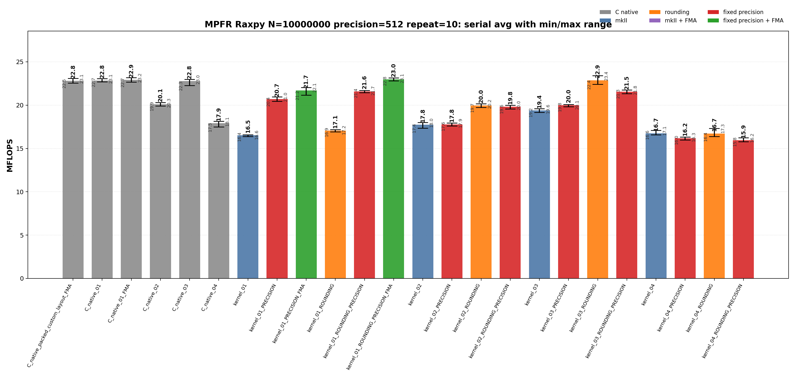
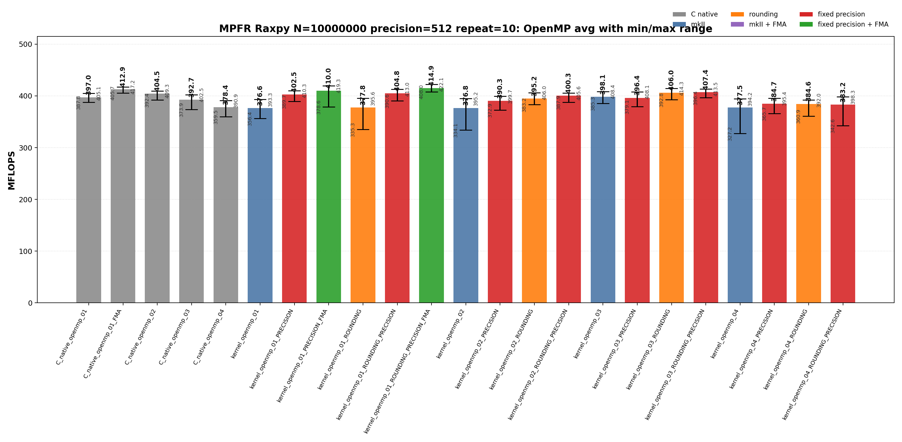
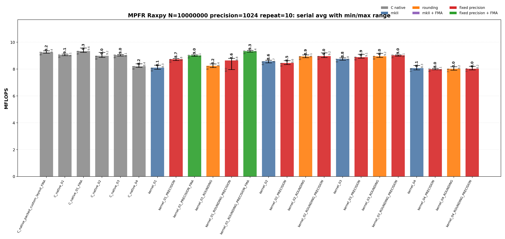
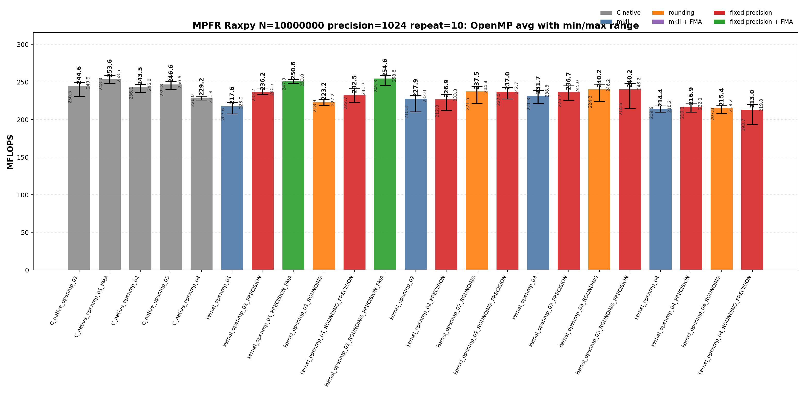

<!-- SPDX-License-Identifier: BSD-2-Clause -->

# 01_Raxpy

This directory benchmarks the MPFR real AXPY operation

```text
y_i = y_i + alpha * x_i
```

for fixed-precision `mpfr_t` and `mpfrxx::mpfr_class` vectors. The benchmark compares raw C MPFR kernels, expression-template wrapper kernels, explicit rounding/context source variants, FMA-capable builds, fixed-precision builds, and OpenMP worker loops at 512-bit and 1024-bit precision.

## Build

From the repository root:

```bash
cmake -S . -B build_bench_release -DCMAKE_BUILD_TYPE=Release
cmake --build build_bench_release -j --target Raxpy_mpfr_C_native_01 Raxpy_mpfr_C_native_02 Raxpy_mpfr_C_native_03 Raxpy_mpfr_C_native_04 Raxpy_mpfr_C_native_01_FMA Raxpy_mpfr_C_native_openmp_01 Raxpy_mpfr_C_native_openmp_02 Raxpy_mpfr_C_native_openmp_03 Raxpy_mpfr_C_native_openmp_04 Raxpy_mpfr_C_native_openmp_01_FMA Raxpy_mpfr_kernel_01_ROUNDING_PRECISION_FMA Raxpy_mpfr_kernel_openmp_01_ROUNDING_PRECISION_FMA
```

The MPFR Raxpy target set is built under:

```text
build_bench_release/benchmarks/mpfr/01_Raxpy/
```

Each executable takes:

```text
<vector size> <precision-bits>
```

Example:

```bash
build_bench_release/benchmarks/mpfr/01_Raxpy/Raxpy_mpfr_kernel_01_ROUNDING_PRECISION_FMA 10000000 1024
```

The cross-benchmark runner can execute the GMP and MPFR `00_Rdot`, `01_Raxpy`, and `02_Rgemv` suites for both standard precisions with one command:

```bash
OMP_NUM_THREADS=32 OMP_PLACES=cores OMP_PROC_BIND=spread \
    benchmarks/run_all.sh build_bench_release 512,1024 10 10000000 10000000 4000 4000
```

The second argument is a precision list. `both` and `all` are aliases for `512,1024`; a single value such as `512` still runs only that precision. Per-benchmark results are written to `results_raw/run_all_p512_repeat10_<timestamp>/` and `results_raw/run_all_p1024_repeat10_<timestamp>/` under each benchmark directory.

## Benchmark Parameters

| Parameter | Meaning |
| --- | --- |
| `N` | Number of vector elements. |
| `precision` | MPFR precision in bits for `alpha`, `x`, and `y`. |
| `repeat` | Number of timed process executions per executable. |
| `OMP_NUM_THREADS` | OpenMP worker count for `openmp` executables. |
| `OMP_PLACES`, `OMP_PROC_BIND` | OpenMP affinity controls used by the runner. |

The committed runs use `N=10000000`, `repeat=10`, `precision=512` and `precision=1024`, with `OMP_NUM_THREADS=32`, `OMP_PLACES=cores`, and `OMP_PROC_BIND=spread`.

## Variant Shapes

The timed body is `_Raxpy()`. The same numeric suffix is used for serial and OpenMP kernels. `ROUNDING`, `PRECISION`, and final `FMA` suffixes modify these numbered shapes without changing the variant number.

| Variant | Transition from previous variant | Timed source shape | Temporary/resource policy | Purpose |
| --- | --- | --- | --- | --- |
| `01` | Baseline direct-expression shape. | `y[i] += alpha * x[i]` | No explicit product object in source. | Direct expression form; FMA builds can lower this source to one `mpfr_fma` call per element. |
| `02` | `01 -> 02`: introduce reusable product storage and copy-then-multiply source. | `temp = alpha; temp *= x[i]; y[i] += temp` | One product object is initialized before the loop and reused. | Test copy-then-multiply source shape with reusable storage. |
| `03` | `02 -> 03`: keep reusable product storage but assign from `alpha * x[i]`. | `temp = alpha * x[i]; y[i] += temp` | One product object is initialized before the loop and assigned each iteration. | Test expression product materialization into reusable storage. |
| `04` | `03 -> 04`: move product construction into the timed loop. | `mpfr_class temp = alpha * x[i]; y[i] += temp` | Product object is constructed inside the timed loop. | Intentionally expensive control for per-iteration construction. |

Wrapper suffixes separate source changes from build flags:

| Suffix | Compile definition | Meaning |
| --- | --- | --- |
| none | none | Baseline wrapper source for the numbered algorithm. |
| `PRECISION` | `GMPFRXX_MKII_FAST_FIXED_PREC` | Builds the same source with fixed-precision assumptions. |
| `ROUNDING` | none | Uses an explicit `mpfrxx::evaluation_context` source file and avoids default-rounding lookup in the timed loop. |
| `ROUNDING_PRECISION` | `GMPFRXX_MKII_FAST_FIXED_PREC` | Builds the explicit-context source with fixed-precision assumptions. |
| final `FMA` | `GMPFRXX_MKII_ENABLE_FMA` | Builds an FMA-capturable source shape with FMA enabled. |

FMA targets are generated only for direct-expression variant `01`, where the source can lower to one `mpfr_fma` call.

## Source Transitions

`01` is the FMA-capturable wrapper source in this benchmark because the product remains in the update expression. `01 -> 02` introduces an explicit reusable product object and copy-then-multiply source. `02 -> 03` keeps reusable storage but assigns it from `alpha * x[i]`, matching the raw split multiply/add reusable-product class. `03 -> 04` moves product construction into the loop as a lifetime stress case. `ROUNDING` variants are separate source files that capture `mpfrxx::evaluation_context` before the loop; `PRECISION` and final `FMA` are build modifiers, not new variant numbers.

## C Native Equivalent Kernels

| C native kernel | Closest wrapper kernel | Equivalence note |
|-----------------|------------------------|------------------|
| `C_native_01`, `C_native_openmp_01` | `kernel_03`, `kernel_03_PRECISION`, `kernel_03_ROUNDING`, `kernel_03_ROUNDING_PRECISION`; OpenMP equivalents | Split `mpfr_mul` + `mpfr_add` with one reusable product object outside the loop or per OpenMP worker. |
| `C_native_02`, `C_native_openmp_02` | `kernel_02`, `kernel_02_PRECISION`, `kernel_02_ROUNDING`, `kernel_02_ROUNDING_PRECISION`; OpenMP equivalents | Copy-then-multiply reusable temporary: `mpfr_set(temp, alpha, rnd)`, `mpfr_mul(temp, temp, x[i], rnd)`, then `mpfr_add`. |
| `C_native_03`, `C_native_openmp_03` | `kernel_03`, `kernel_03_PRECISION`, `kernel_03_ROUNDING`, `kernel_03_ROUNDING_PRECISION`; OpenMP equivalents | Numbered raw C comparison point for wrapper `03`; same direct reusable-temporary hot-loop class as `C_native_01`. |
| `C_native_04`, `C_native_openmp_04` | `kernel_04`, `kernel_04_PRECISION`, `kernel_04_ROUNDING`, `kernel_04_ROUNDING_PRECISION`; OpenMP equivalents | Loop-local construction stress case: each element performs `mpfr_init`, multiply, add, and `mpfr_clear` inside the timed loop. |
| `C_native_01_FMA`, `C_native_openmp_01_FMA` | `kernel_01_PRECISION_FMA`, `kernel_01_ROUNDING_PRECISION_FMA`; OpenMP equivalents | One `mpfr_fma` per element when the wrapper source shape is direct. |
| `C_native_packed_custom_layout_FMA` | none | Same arithmetic as `C_native_01_FMA`, but with packed MPFR header+limb storage. |

## Recorded Run

### 512-bit run

| Field | Value |
|-------|-------|
| Run ID | `run_all_p512_repeat10_20260526_062542` |
| Date | 2026-05-26 |
| CPU | AMD Ryzen Threadripper 3970X 32-Core Processor |
| OS | Linux 6.8.0-94-generic x86_64 |
| Compiler | `c++ (Ubuntu 15.2.0-16ubuntu1) 15.2.0` |
| Build type | Release |
| Problem size | `N=10000000` |
| Precision | 512 bits |
| Repeat count | 10 |
| OpenMP | `OMP_NUM_THREADS=32`, `OMP_PLACES=cores`, `OMP_PROC_BIND=spread` |
| Default precision env | `MPFRXX_DEFAULT_PRECISION_BITS=512` |
| Benchmark command | `OMP_NUM_THREADS=32 OMP_PLACES=cores OMP_PROC_BIND=spread benchmarks/run_all.sh build_bench_release 512,1024 10` |
| Raw result directory | `benchmarks/mpfr/01_Raxpy/results_raw/run_all_p512_repeat10_20260526_062542/` |
| Raw log | `benchmarks/mpfr/01_Raxpy/results_raw/run_all_p512_repeat10_20260526_062542/benchmark_raxpy_mpfr_n10000000_p512_repeat10.log` |
| Raw CSV | `benchmarks/mpfr/01_Raxpy/results_raw/run_all_p512_repeat10_20260526_062542/raw_raxpy_mpfr_n10000000_p512_repeat10.csv` |
| Summary CSV | `benchmarks/mpfr/01_Raxpy/results_raw/run_all_p512_repeat10_20260526_062542/summary_raxpy_mpfr_n10000000_p512_repeat10.csv` |
| Correctness | 470 / 470 runs reported OK. |





Plot regeneration command:

```bash
python3 benchmarks/mpfr/01_Raxpy/plot_repeat_summary.py \
    benchmarks/mpfr/01_Raxpy/results_raw/run_all_p512_repeat10_20260526_062542/benchmark_raxpy_mpfr_n10000000_p512_repeat10.log \
    --output-dir benchmarks/mpfr/01_Raxpy/results_raw/run_all_p512_repeat10_20260526_062542 \
    --output-prefix raxpy_mpfr_n10000000_p512_repeat10 \
    --title-prefix "MPFR Raxpy N=10000000, precision=512, repeat=10"
```

### 1024-bit run

| Field | Value |
|-------|-------|
| Run ID | `run_all_p1024_repeat10_20260526_062542` |
| Date | 2026-05-26 |
| CPU | AMD Ryzen Threadripper 3970X 32-Core Processor |
| OS | Linux 6.8.0-94-generic x86_64 |
| Compiler | `c++ (Ubuntu 15.2.0-16ubuntu1) 15.2.0` |
| Build type | Release |
| Problem size | `N=10000000` |
| Precision | 1024 bits |
| Repeat count | 10 |
| OpenMP | `OMP_NUM_THREADS=32`, `OMP_PLACES=cores`, `OMP_PROC_BIND=spread` |
| Default precision env | `MPFRXX_DEFAULT_PRECISION_BITS=1024` |
| Benchmark command | `OMP_NUM_THREADS=32 OMP_PLACES=cores OMP_PROC_BIND=spread benchmarks/run_all.sh build_bench_release 512,1024 10` |
| Raw result directory | `benchmarks/mpfr/01_Raxpy/results_raw/run_all_p1024_repeat10_20260526_062542/` |
| Raw log | `benchmarks/mpfr/01_Raxpy/results_raw/run_all_p1024_repeat10_20260526_062542/benchmark_raxpy_mpfr_n10000000_p1024_repeat10.log` |
| Raw CSV | `benchmarks/mpfr/01_Raxpy/results_raw/run_all_p1024_repeat10_20260526_062542/raw_raxpy_mpfr_n10000000_p1024_repeat10.csv` |
| Summary CSV | `benchmarks/mpfr/01_Raxpy/results_raw/run_all_p1024_repeat10_20260526_062542/summary_raxpy_mpfr_n10000000_p1024_repeat10.csv` |
| Correctness | 470 / 470 runs reported OK. |





Plot regeneration command:

```bash
python3 benchmarks/mpfr/01_Raxpy/plot_repeat_summary.py \
    benchmarks/mpfr/01_Raxpy/results_raw/run_all_p1024_repeat10_20260526_062542/benchmark_raxpy_mpfr_n10000000_p1024_repeat10.log \
    --output-dir benchmarks/mpfr/01_Raxpy/results_raw/run_all_p1024_repeat10_20260526_062542 \
    --output-prefix raxpy_mpfr_n10000000_p1024_repeat10 \
    --title-prefix "MPFR Raxpy N=10000000, precision=1024, repeat=10"
```

## Resource or Bandwidth Estimates

The values below are model estimates derived from MFLOPS, not hardware-counter measurements. They count active limb bytes plus a header-inclusive object model. They exclude allocator metadata, cache-line overfetch, instruction fetch, and final OpenMP reduction traffic.

| Case | Representative best-avg variant | Avg MFLOPS | Active bytes/iteration | Header-inclusive bytes/iteration | Active GB/s | Header-inclusive GB/s |
| --- | --- | --- | --- | --- | --- | --- |
| 512-bit serial | `kernel_01_ROUNDING_PRECISION_FMA` | 22.981 | 192 | 288 | 2.206 | 3.309 |
| 512-bit OpenMP | `kernel_openmp_01_ROUNDING_PRECISION_FMA` | 414.911 | 192 | 288 | 39.831 | 59.747 |
| 1024-bit serial | `C_native_01_FMA` | 9.341 | 384 | 480 | 1.794 | 2.242 |
| 1024-bit OpenMP | `kernel_openmp_01_ROUNDING_PRECISION_FMA` | 254.585 | 384 | 480 | 48.880 | 61.100 |

For `Raxpy`, the per-iteration byte model is a compact arithmetic-stream estimate. It is not a full cache-footprint or hardware-bandwidth measurement.

## Headline Results

The headline rows below are regenerated from the committed 512-bit and 1024-bit `run_all` summary CSV files.

| Precision | Class | Variant | Max MFLOPS | Avg MFLOPS | Interpretation |
| --- | --- | --- | --- | --- | --- |
| 512 | Best serial max | `kernel_03_ROUNDING` | 23.402 | 22.875 | Wrapper source captures rounding/context outside the loop to avoid default-rounding lookup in the timed body. |
| 512 | Best serial average | `kernel_01_ROUNDING_PRECISION_FMA` | 23.147 | 22.981 | Wrapper source with loop-external rounding and fixed-precision FMA build. |
| 512 | Best OpenMP max | `kernel_openmp_01_ROUNDING_PRECISION_FMA` | 422.132 | 414.911 | Wrapper source with loop-external rounding and fixed-precision FMA build. |
| 512 | Best OpenMP average | `kernel_openmp_01_ROUNDING_PRECISION_FMA` | 422.132 | 414.911 | Wrapper source with loop-external rounding and fixed-precision FMA build. |
| 1024 | Best serial max | `C_native_01_FMA` | 9.572 | 9.341 | Raw C FMA reference; the hot loop uses the fused backend operation where the source shape permits it. |
| 1024 | Best serial average | `C_native_01_FMA` | 9.572 | 9.341 | Raw C FMA reference; the hot loop uses the fused backend operation where the source shape permits it. |
| 1024 | Best OpenMP max | `kernel_openmp_01_ROUNDING_PRECISION_FMA` | 258.848 | 254.585 | Wrapper source with loop-external rounding and fixed-precision FMA build. |
| 1024 | Best OpenMP average | `kernel_openmp_01_ROUNDING_PRECISION_FMA` | 258.848 | 254.585 | Wrapper source with loop-external rounding and fixed-precision FMA build. |

## Serial Results

### 512-bit serial interpretation

These rows are derived from `benchmarks/mpfr/01_Raxpy/results_raw/run_all_p512_repeat10_20260526_062542/summary_raxpy_mpfr_n10000000_p512_repeat10.csv`.

| Observation | Variant | Max MFLOPS | Avg MFLOPS | Min MFLOPS | Interpretation |
| --- | --- | --- | --- | --- | --- |
| Best raw C serial avg | `C_native_01_FMA` | 23.184 | 22.930 | 22.661 | Raw C FMA reference; the hot loop uses the fused backend operation where the source shape permits it. |
| Best wrapper serial avg | `kernel_01_ROUNDING_PRECISION_FMA` | 23.147 | 22.981 | 22.812 | Wrapper source with loop-external rounding and fixed-precision FMA build. |
| Best serial max | `kernel_03_ROUNDING` | 23.402 | 22.875 | 22.396 | Wrapper source captures rounding/context outside the loop to avoid default-rounding lookup in the timed body. |

<details>
<summary>512-bit serial results sorted by Max MFLOPS</summary>

| Rank | Variant | Max MFLOPS | Avg MFLOPS | Min MFLOPS |
| --- | --- | --- | --- | --- |
| 1 | `kernel_03_ROUNDING` | 23.402 | 22.875 | 22.396 |
| 2 | `C_native_01_FMA` | 23.184 | 22.930 | 22.661 |
| 3 | `kernel_01_ROUNDING_PRECISION_FMA` | 23.147 | 22.981 | 22.812 |
| 4 | `C_native_packed_custom_layout_FMA` | 23.089 | 22.819 | 22.549 |
| 5 | `C_native_01` | 23.078 | 22.846 | 22.687 |
| 6 | `C_native_03` | 22.984 | 22.768 | 22.265 |
| 7 | `kernel_01_PRECISION_FMA` | 22.050 | 21.709 | 21.168 |
| 8 | `kernel_03_ROUNDING_PRECISION` | 21.757 | 21.543 | 21.340 |
| 9 | `kernel_01_ROUNDING_PRECISION` | 21.707 | 21.585 | 21.437 |
| 10 | `kernel_01_PRECISION` | 20.971 | 20.714 | 20.445 |
| 11 | `C_native_02` | 20.302 | 20.107 | 19.899 |
| 12 | `kernel_02_ROUNDING` | 20.164 | 19.977 | 19.725 |
| 13 | `kernel_03_PRECISION` | 20.073 | 19.989 | 19.817 |
| 14 | `kernel_02_ROUNDING_PRECISION` | 19.994 | 19.816 | 19.574 |
| 15 | `kernel_03` | 19.585 | 19.404 | 19.179 |
| 16 | `C_native_04` | 18.137 | 17.925 | 17.483 |
| 17 | `kernel_02` | 17.994 | 17.756 | 17.352 |
| 18 | `kernel_02_PRECISION` | 17.950 | 17.773 | 17.602 |
| 19 | `kernel_04_ROUNDING` | 17.322 | 16.721 | 16.378 |
| 20 | `kernel_01_ROUNDING` | 17.165 | 17.056 | 16.913 |
| 21 | `kernel_04` | 17.078 | 16.743 | 16.583 |
| 22 | `kernel_01` | 16.580 | 16.515 | 16.370 |
| 23 | `kernel_04_PRECISION` | 16.332 | 16.171 | 15.996 |
| 24 | `kernel_04_ROUNDING_PRECISION` | 16.239 | 15.950 | 15.784 |

</details>

<details>
<summary>512-bit serial results sorted by Avg MFLOPS</summary>

| Rank | Variant | Max MFLOPS | Avg MFLOPS | Min MFLOPS |
| --- | --- | --- | --- | --- |
| 1 | `kernel_01_ROUNDING_PRECISION_FMA` | 23.147 | 22.981 | 22.812 |
| 2 | `C_native_01_FMA` | 23.184 | 22.930 | 22.661 |
| 3 | `kernel_03_ROUNDING` | 23.402 | 22.875 | 22.396 |
| 4 | `C_native_01` | 23.078 | 22.846 | 22.687 |
| 5 | `C_native_packed_custom_layout_FMA` | 23.089 | 22.819 | 22.549 |
| 6 | `C_native_03` | 22.984 | 22.768 | 22.265 |
| 7 | `kernel_01_PRECISION_FMA` | 22.050 | 21.709 | 21.168 |
| 8 | `kernel_01_ROUNDING_PRECISION` | 21.707 | 21.585 | 21.437 |
| 9 | `kernel_03_ROUNDING_PRECISION` | 21.757 | 21.543 | 21.340 |
| 10 | `kernel_01_PRECISION` | 20.971 | 20.714 | 20.445 |
| 11 | `C_native_02` | 20.302 | 20.107 | 19.899 |
| 12 | `kernel_03_PRECISION` | 20.073 | 19.989 | 19.817 |
| 13 | `kernel_02_ROUNDING` | 20.164 | 19.977 | 19.725 |
| 14 | `kernel_02_ROUNDING_PRECISION` | 19.994 | 19.816 | 19.574 |
| 15 | `kernel_03` | 19.585 | 19.404 | 19.179 |
| 16 | `C_native_04` | 18.137 | 17.925 | 17.483 |
| 17 | `kernel_02_PRECISION` | 17.950 | 17.773 | 17.602 |
| 18 | `kernel_02` | 17.994 | 17.756 | 17.352 |
| 19 | `kernel_01_ROUNDING` | 17.165 | 17.056 | 16.913 |
| 20 | `kernel_04` | 17.078 | 16.743 | 16.583 |
| 21 | `kernel_04_ROUNDING` | 17.322 | 16.721 | 16.378 |
| 22 | `kernel_01` | 16.580 | 16.515 | 16.370 |
| 23 | `kernel_04_PRECISION` | 16.332 | 16.171 | 15.996 |
| 24 | `kernel_04_ROUNDING_PRECISION` | 16.239 | 15.950 | 15.784 |

</details>

### 1024-bit serial interpretation

These rows are derived from `benchmarks/mpfr/01_Raxpy/results_raw/run_all_p1024_repeat10_20260526_062542/summary_raxpy_mpfr_n10000000_p1024_repeat10.csv`.

| Observation | Variant | Max MFLOPS | Avg MFLOPS | Min MFLOPS | Interpretation |
| --- | --- | --- | --- | --- | --- |
| Best raw C serial avg | `C_native_01_FMA` | 9.572 | 9.341 | 9.251 | Raw C FMA reference; the hot loop uses the fused backend operation where the source shape permits it. |
| Best wrapper serial avg | `kernel_01_ROUNDING_PRECISION_FMA` | 9.404 | 9.332 | 9.276 | Wrapper source with loop-external rounding and fixed-precision FMA build. |
| Best serial max | `C_native_01_FMA` | 9.572 | 9.341 | 9.251 | Raw C FMA reference; the hot loop uses the fused backend operation where the source shape permits it. |

<details>
<summary>1024-bit serial results sorted by Max MFLOPS</summary>

| Rank | Variant | Max MFLOPS | Avg MFLOPS | Min MFLOPS |
| --- | --- | --- | --- | --- |
| 1 | `C_native_01_FMA` | 9.572 | 9.341 | 9.251 |
| 2 | `kernel_01_ROUNDING_PRECISION_FMA` | 9.404 | 9.332 | 9.276 |
| 3 | `C_native_packed_custom_layout_FMA` | 9.369 | 9.244 | 9.186 |
| 4 | `C_native_02` | 9.249 | 8.993 | 8.880 |
| 5 | `kernel_02_ROUNDING_PRECISION` | 9.216 | 8.974 | 8.865 |
| 6 | `kernel_03_ROUNDING` | 9.177 | 8.960 | 8.879 |
| 7 | `C_native_01` | 9.119 | 9.055 | 9.003 |
| 8 | `kernel_03_PRECISION` | 9.105 | 8.891 | 8.818 |
| 9 | `C_native_03` | 9.092 | 9.037 | 8.975 |
| 10 | `kernel_01_PRECISION_FMA` | 9.066 | 9.019 | 8.954 |
| 11 | `kernel_03_ROUNDING_PRECISION` | 9.066 | 9.021 | 8.973 |
| 12 | `kernel_02_ROUNDING` | 9.060 | 8.946 | 8.851 |
| 13 | `kernel_03` | 8.845 | 8.761 | 8.668 |
| 14 | `kernel_01_ROUNDING_PRECISION` | 8.802 | 8.644 | 7.967 |
| 15 | `kernel_01_PRECISION` | 8.793 | 8.737 | 8.643 |
| 16 | `kernel_02` | 8.671 | 8.590 | 8.464 |
| 17 | `kernel_02_PRECISION` | 8.629 | 8.453 | 8.346 |
| 18 | `C_native_04` | 8.402 | 8.215 | 8.125 |
| 19 | `kernel_01_ROUNDING` | 8.384 | 8.245 | 8.116 |
| 20 | `kernel_01` | 8.291 | 8.108 | 7.987 |
| 21 | `kernel_04` | 8.271 | 8.067 | 7.949 |
| 22 | `kernel_04_ROUNDING_PRECISION` | 8.212 | 8.023 | 7.946 |
| 23 | `kernel_04_ROUNDING` | 8.175 | 8.029 | 7.922 |
| 24 | `kernel_04_PRECISION` | 8.058 | 7.996 | 7.956 |

</details>

<details>
<summary>1024-bit serial results sorted by Avg MFLOPS</summary>

| Rank | Variant | Max MFLOPS | Avg MFLOPS | Min MFLOPS |
| --- | --- | --- | --- | --- |
| 1 | `C_native_01_FMA` | 9.572 | 9.341 | 9.251 |
| 2 | `kernel_01_ROUNDING_PRECISION_FMA` | 9.404 | 9.332 | 9.276 |
| 3 | `C_native_packed_custom_layout_FMA` | 9.369 | 9.244 | 9.186 |
| 4 | `C_native_01` | 9.119 | 9.055 | 9.003 |
| 5 | `C_native_03` | 9.092 | 9.037 | 8.975 |
| 6 | `kernel_03_ROUNDING_PRECISION` | 9.066 | 9.021 | 8.973 |
| 7 | `kernel_01_PRECISION_FMA` | 9.066 | 9.019 | 8.954 |
| 8 | `C_native_02` | 9.249 | 8.993 | 8.880 |
| 9 | `kernel_02_ROUNDING_PRECISION` | 9.216 | 8.974 | 8.865 |
| 10 | `kernel_03_ROUNDING` | 9.177 | 8.960 | 8.879 |
| 11 | `kernel_02_ROUNDING` | 9.060 | 8.946 | 8.851 |
| 12 | `kernel_03_PRECISION` | 9.105 | 8.891 | 8.818 |
| 13 | `kernel_03` | 8.845 | 8.761 | 8.668 |
| 14 | `kernel_01_PRECISION` | 8.793 | 8.737 | 8.643 |
| 15 | `kernel_01_ROUNDING_PRECISION` | 8.802 | 8.644 | 7.967 |
| 16 | `kernel_02` | 8.671 | 8.590 | 8.464 |
| 17 | `kernel_02_PRECISION` | 8.629 | 8.453 | 8.346 |
| 18 | `kernel_01_ROUNDING` | 8.384 | 8.245 | 8.116 |
| 19 | `C_native_04` | 8.402 | 8.215 | 8.125 |
| 20 | `kernel_01` | 8.291 | 8.108 | 7.987 |
| 21 | `kernel_04` | 8.271 | 8.067 | 7.949 |
| 22 | `kernel_04_ROUNDING` | 8.175 | 8.029 | 7.922 |
| 23 | `kernel_04_ROUNDING_PRECISION` | 8.212 | 8.023 | 7.946 |
| 24 | `kernel_04_PRECISION` | 8.058 | 7.996 | 7.956 |

</details>

## OpenMP Results

### 512-bit OpenMP interpretation

These rows are derived from `benchmarks/mpfr/01_Raxpy/results_raw/run_all_p512_repeat10_20260526_062542/summary_raxpy_mpfr_n10000000_p512_repeat10.csv`.

| Observation | Variant | Max MFLOPS | Avg MFLOPS | Min MFLOPS | Interpretation |
| --- | --- | --- | --- | --- | --- |
| Best raw C OpenMP avg | `C_native_openmp_01_FMA` | 417.176 | 412.853 | 405.694 | Raw C FMA reference; the hot loop uses the fused backend operation where the source shape permits it. |
| Best wrapper OpenMP avg | `kernel_openmp_01_ROUNDING_PRECISION_FMA` | 422.132 | 414.911 | 407.995 | Wrapper source with loop-external rounding and fixed-precision FMA build. |
| Best OpenMP max | `kernel_openmp_01_ROUNDING_PRECISION_FMA` | 422.132 | 414.911 | 407.995 | Wrapper source with loop-external rounding and fixed-precision FMA build. |

<details>
<summary>512-bit OpenMP results sorted by Max MFLOPS</summary>

| Rank | Variant | Max MFLOPS | Avg MFLOPS | Min MFLOPS |
| --- | --- | --- | --- | --- |
| 1 | `kernel_openmp_01_ROUNDING_PRECISION_FMA` | 422.132 | 414.911 | 407.995 |
| 2 | `kernel_openmp_01_PRECISION_FMA` | 419.332 | 409.979 | 378.593 |
| 3 | `C_native_openmp_01_FMA` | 417.176 | 412.853 | 405.694 |
| 4 | `kernel_openmp_03_ROUNDING` | 414.323 | 405.983 | 392.753 |
| 5 | `kernel_openmp_03_ROUNDING_PRECISION` | 413.459 | 407.387 | 396.400 |
| 6 | `kernel_openmp_01_ROUNDING_PRECISION` | 413.039 | 404.752 | 390.571 |
| 7 | `kernel_openmp_01_PRECISION` | 410.271 | 402.514 | 389.655 |
| 8 | `C_native_openmp_02` | 409.302 | 404.520 | 392.442 |
| 9 | `kernel_openmp_03` | 408.402 | 398.086 | 385.342 |
| 10 | `kernel_openmp_03_PRECISION` | 408.082 | 396.351 | 379.142 |
| 11 | `kernel_openmp_02_ROUNDING` | 405.982 | 395.169 | 383.243 |
| 12 | `kernel_openmp_02_ROUNDING_PRECISION` | 405.561 | 400.317 | 387.902 |
| 13 | `C_native_openmp_01` | 405.061 | 397.022 | 387.804 |
| 14 | `C_native_openmp_03` | 402.492 | 392.680 | 373.895 |
| 15 | `kernel_openmp_02_PRECISION` | 399.675 | 390.308 | 372.866 |
| 16 | `kernel_openmp_04_ROUNDING_PRECISION` | 398.287 | 383.151 | 342.628 |
| 17 | `kernel_openmp_01_ROUNDING` | 395.612 | 377.816 | 335.276 |
| 18 | `kernel_openmp_04_PRECISION` | 395.430 | 384.678 | 365.743 |
| 19 | `kernel_openmp_02` | 395.162 | 376.781 | 334.097 |
| 20 | `kernel_openmp_04` | 394.209 | 377.495 | 327.217 |
| 21 | `kernel_openmp_01` | 393.293 | 376.624 | 356.355 |
| 22 | `kernel_openmp_04_ROUNDING` | 391.991 | 384.622 | 360.931 |
| 23 | `C_native_openmp_04` | 390.891 | 378.376 | 359.518 |

</details>

<details>
<summary>512-bit OpenMP results sorted by Avg MFLOPS</summary>

| Rank | Variant | Max MFLOPS | Avg MFLOPS | Min MFLOPS |
| --- | --- | --- | --- | --- |
| 1 | `kernel_openmp_01_ROUNDING_PRECISION_FMA` | 422.132 | 414.911 | 407.995 |
| 2 | `C_native_openmp_01_FMA` | 417.176 | 412.853 | 405.694 |
| 3 | `kernel_openmp_01_PRECISION_FMA` | 419.332 | 409.979 | 378.593 |
| 4 | `kernel_openmp_03_ROUNDING_PRECISION` | 413.459 | 407.387 | 396.400 |
| 5 | `kernel_openmp_03_ROUNDING` | 414.323 | 405.983 | 392.753 |
| 6 | `kernel_openmp_01_ROUNDING_PRECISION` | 413.039 | 404.752 | 390.571 |
| 7 | `C_native_openmp_02` | 409.302 | 404.520 | 392.442 |
| 8 | `kernel_openmp_01_PRECISION` | 410.271 | 402.514 | 389.655 |
| 9 | `kernel_openmp_02_ROUNDING_PRECISION` | 405.561 | 400.317 | 387.902 |
| 10 | `kernel_openmp_03` | 408.402 | 398.086 | 385.342 |
| 11 | `C_native_openmp_01` | 405.061 | 397.022 | 387.804 |
| 12 | `kernel_openmp_03_PRECISION` | 408.082 | 396.351 | 379.142 |
| 13 | `kernel_openmp_02_ROUNDING` | 405.982 | 395.169 | 383.243 |
| 14 | `C_native_openmp_03` | 402.492 | 392.680 | 373.895 |
| 15 | `kernel_openmp_02_PRECISION` | 399.675 | 390.308 | 372.866 |
| 16 | `kernel_openmp_04_PRECISION` | 395.430 | 384.678 | 365.743 |
| 17 | `kernel_openmp_04_ROUNDING` | 391.991 | 384.622 | 360.931 |
| 18 | `kernel_openmp_04_ROUNDING_PRECISION` | 398.287 | 383.151 | 342.628 |
| 19 | `C_native_openmp_04` | 390.891 | 378.376 | 359.518 |
| 20 | `kernel_openmp_01_ROUNDING` | 395.612 | 377.816 | 335.276 |
| 21 | `kernel_openmp_04` | 394.209 | 377.495 | 327.217 |
| 22 | `kernel_openmp_02` | 395.162 | 376.781 | 334.097 |
| 23 | `kernel_openmp_01` | 393.293 | 376.624 | 356.355 |

</details>

### 1024-bit OpenMP interpretation

These rows are derived from `benchmarks/mpfr/01_Raxpy/results_raw/run_all_p1024_repeat10_20260526_062542/summary_raxpy_mpfr_n10000000_p1024_repeat10.csv`.

| Observation | Variant | Max MFLOPS | Avg MFLOPS | Min MFLOPS | Interpretation |
| --- | --- | --- | --- | --- | --- |
| Best raw C OpenMP avg | `C_native_openmp_01_FMA` | 258.528 | 253.639 | 247.970 | Raw C FMA reference; the hot loop uses the fused backend operation where the source shape permits it. |
| Best wrapper OpenMP avg | `kernel_openmp_01_ROUNDING_PRECISION_FMA` | 258.848 | 254.585 | 245.304 | Wrapper source with loop-external rounding and fixed-precision FMA build. |
| Best OpenMP max | `kernel_openmp_01_ROUNDING_PRECISION_FMA` | 258.848 | 254.585 | 245.304 | Wrapper source with loop-external rounding and fixed-precision FMA build. |

<details>
<summary>1024-bit OpenMP results sorted by Max MFLOPS</summary>

| Rank | Variant | Max MFLOPS | Avg MFLOPS | Min MFLOPS |
| --- | --- | --- | --- | --- |
| 1 | `kernel_openmp_01_ROUNDING_PRECISION_FMA` | 258.848 | 254.585 | 245.304 |
| 2 | `C_native_openmp_01_FMA` | 258.528 | 253.639 | 247.970 |
| 3 | `kernel_openmp_01_PRECISION_FMA` | 252.993 | 250.635 | 247.914 |
| 4 | `C_native_openmp_03` | 250.634 | 246.588 | 239.824 |
| 5 | `C_native_openmp_01` | 249.872 | 244.560 | 230.456 |
| 6 | `kernel_openmp_03_ROUNDING_PRECISION` | 248.196 | 240.198 | 214.621 |
| 7 | `C_native_openmp_02` | 246.814 | 243.520 | 236.102 |
| 8 | `kernel_openmp_03_ROUNDING` | 246.192 | 240.235 | 224.320 |
| 9 | `kernel_openmp_03_PRECISION` | 244.992 | 236.717 | 225.656 |
| 10 | `kernel_openmp_02_ROUNDING` | 244.375 | 237.533 | 221.527 |
| 11 | `kernel_openmp_02_ROUNDING_PRECISION` | 242.701 | 236.966 | 227.536 |
| 12 | `kernel_openmp_01_ROUNDING_PRECISION` | 241.703 | 232.456 | 222.667 |
| 13 | `kernel_openmp_01_PRECISION` | 240.672 | 236.217 | 233.220 |
| 14 | `kernel_openmp_03` | 238.842 | 231.650 | 221.284 |
| 15 | `kernel_openmp_02_PRECISION` | 233.291 | 226.868 | 211.985 |
| 16 | `kernel_openmp_02` | 232.014 | 227.905 | 210.307 |
| 17 | `C_native_openmp_04` | 231.386 | 229.187 | 225.969 |
| 18 | `kernel_openmp_01_ROUNDING` | 227.158 | 223.173 | 218.910 |
| 19 | `kernel_openmp_01` | 222.999 | 217.598 | 207.617 |
| 20 | `kernel_openmp_04_PRECISION` | 222.056 | 216.895 | 210.063 |
| 21 | `kernel_openmp_04_ROUNDING_PRECISION` | 219.786 | 213.026 | 193.694 |
| 22 | `kernel_openmp_04_ROUNDING` | 219.187 | 215.376 | 207.823 |
| 23 | `kernel_openmp_04` | 218.175 | 214.432 | 209.890 |

</details>

<details>
<summary>1024-bit OpenMP results sorted by Avg MFLOPS</summary>

| Rank | Variant | Max MFLOPS | Avg MFLOPS | Min MFLOPS |
| --- | --- | --- | --- | --- |
| 1 | `kernel_openmp_01_ROUNDING_PRECISION_FMA` | 258.848 | 254.585 | 245.304 |
| 2 | `C_native_openmp_01_FMA` | 258.528 | 253.639 | 247.970 |
| 3 | `kernel_openmp_01_PRECISION_FMA` | 252.993 | 250.635 | 247.914 |
| 4 | `C_native_openmp_03` | 250.634 | 246.588 | 239.824 |
| 5 | `C_native_openmp_01` | 249.872 | 244.560 | 230.456 |
| 6 | `C_native_openmp_02` | 246.814 | 243.520 | 236.102 |
| 7 | `kernel_openmp_03_ROUNDING` | 246.192 | 240.235 | 224.320 |
| 8 | `kernel_openmp_03_ROUNDING_PRECISION` | 248.196 | 240.198 | 214.621 |
| 9 | `kernel_openmp_02_ROUNDING` | 244.375 | 237.533 | 221.527 |
| 10 | `kernel_openmp_02_ROUNDING_PRECISION` | 242.701 | 236.966 | 227.536 |
| 11 | `kernel_openmp_03_PRECISION` | 244.992 | 236.717 | 225.656 |
| 12 | `kernel_openmp_01_PRECISION` | 240.672 | 236.217 | 233.220 |
| 13 | `kernel_openmp_01_ROUNDING_PRECISION` | 241.703 | 232.456 | 222.667 |
| 14 | `kernel_openmp_03` | 238.842 | 231.650 | 221.284 |
| 15 | `C_native_openmp_04` | 231.386 | 229.187 | 225.969 |
| 16 | `kernel_openmp_02` | 232.014 | 227.905 | 210.307 |
| 17 | `kernel_openmp_02_PRECISION` | 233.291 | 226.868 | 211.985 |
| 18 | `kernel_openmp_01_ROUNDING` | 227.158 | 223.173 | 218.910 |
| 19 | `kernel_openmp_01` | 222.999 | 217.598 | 207.617 |
| 20 | `kernel_openmp_04_PRECISION` | 222.056 | 216.895 | 210.063 |
| 21 | `kernel_openmp_04_ROUNDING` | 219.187 | 215.376 | 207.823 |
| 22 | `kernel_openmp_04` | 218.175 | 214.432 | 209.890 |
| 23 | `kernel_openmp_04_ROUNDING_PRECISION` | 219.786 | 213.026 | 193.694 |

</details>

## Comparison with GMP version

| Precision | Mode | Best MPFR Avg MFLOPS | Best GMP Avg MFLOPS | MPFR/GMP | Interpretation |
|-----------|------|----------------------|---------------------|----------|----------------|
| 512 | Serial | 22.981 | 33.650 | 0.683x | MPFR serial Raxpy still pays rounding and MPFR object semantics relative to GMP. |
| 512 | OpenMP | 414.911 | 393.434 | 1.055x | The MPFR FMA-captured OpenMP path slightly exceeds this GMP run; treat this as run/source-class variance, not a general backend claim. |
| 1024 | Serial | 9.341 | 11.967 | 0.781x | Higher precision narrows the gap but MPFR remains slower in serial. |
| 1024 | OpenMP | 254.585 | 252.368 | 1.009x | The OpenMP results are effectively tied across backends for this data set. |

The MPFR/GMP ratios mix backend semantics and source-shape differences. The
OpenMP ratios should not be read as MPFR being intrinsically faster than GMP.

## Hotpath Disassembly

Representative commands:

```bash
objdump -Cd --no-show-raw-insn build_bench_release/benchmarks/mpfr/01_Raxpy/Raxpy_mpfr_C_native_01_FMA
objdump -Cd --no-show-raw-insn build_bench_release/benchmarks/mpfr/01_Raxpy/Raxpy_mpfr_kernel_01_ROUNDING_PRECISION_FMA
objdump -Cd --no-show-raw-insn build_bench_release/benchmarks/mpfr/01_Raxpy/Raxpy_mpfr_kernel_03_ROUNDING_PRECISION
```

The representative disassembly now uses the current target names. The wrapper
FMA variants match the raw C arithmetic call class, but still carry wrapper
control paths outside or around the fast path.

| Representative | Hotpath observation | Comparison point |
|----------------|---------------------|------------------|
| `C_native_01_FMA` | Caches rounding before the loop and calls one `mpfr_fma` per element for `y[i] = alpha * x[i] + y[i]`. | Raw FMA baseline. |
| `kernel_01_ROUNDING_PRECISION_FMA` | The timed arithmetic path calls `mpfr_fma`; the binary also contains wrapper default-state/precision guard paths. | Closest mkII FMA equivalent, same arithmetic class as C native. |
| `C_native_03` | Reusable product object with one `mpfr_mul` and one `mpfr_add` per element. | Raw split multiply/add baseline. |
| `kernel_03_ROUNDING_PRECISION` | Same split `mpfr_mul` plus `mpfr_add` arithmetic class as `C_native_03`; the reusable temporary is outside the element loop. | Closest mkII reusable-temp equivalent. |
| `kernel_openmp_01_ROUNDING_PRECISION_FMA` | Worker loop keeps the one-`mpfr_fma` arithmetic class; OpenMP scheduling and final synchronization are outside the backend call itself. | Best OpenMP wrapper class in both precision runs. |

Representative excerpts from the current binaries:

```asm
# Raxpy_mpfr_C_native_01_FMA::_Raxpy
29ca: call   mpfr_get_default_rounding_mode@plt
29cf: mov    %eax,%r14d         # cached rounding mode
29d2: test   %r12,%r12
29d5: jle    2a05 <_Raxpy+0x65>
29e0: mov    %rbx,%rcx          # y[i] addend
29e3: mov    %rbp,%rdx          # x[i]
29e6: mov    %rbx,%rdi          # y[i] destination
29e9: mov    %r14d,%r8d         # cached rounding
29ec: mov    %r13,%rsi          # alpha
29ef: add    $0x1,%r15
29f3: add    $0x20,%rbx
29f7: add    $0x20,%rbp
29fb: call   mpfr_fma@plt
2a00: cmp    %r15,%r12
2a03: jne    29e0 <_Raxpy+0x40>
```

```asm
# Raxpy_mpfr_kernel_01_ROUNDING_PRECISION_FMA::_Raxpy
2b51: cmp    %r14,%rax
2b5a: xor    %r14d,%r14d
2b60: mov    %rbx,%rcx          # y[i] addend
2b63: mov    %rbp,%rdx          # x[i]
2b66: mov    %rbx,%rdi          # y[i] destination
2b69: mov    %r15d,%r8d         # context rounding
2b6c: mov    %r13,%rsi          # alpha
2b6f: add    $0x1,%r14
2b73: add    $0x20,%rbx
2b77: add    $0x20,%rbp
2b7b: call   mpfr_fma@plt
2b80: cmp    %r14,%r12
2b83: jg     2b60 <_Raxpy+0x80>
```

```asm
# Raxpy_mpfr_kernel_03_ROUNDING_PRECISION::_Raxpy
2c49: test   %r15,%r15
2c4c: jle    2c84 <_Raxpy+0xf4>
2c50: mov    (%rsp),%rsi        # alpha
2c54: mov    %r14d,%ecx         # context rounding
2c57: mov    %rbp,%rdx          # x[i]
2c5a: mov    %r13,%rdi          # reusable product temp
2c5d: call   mpfr_mul@plt
2c62: mov    %r14d,%ecx         # context rounding
2c65: mov    %r13,%rdx          # product temp
2c68: mov    %rbx,%rsi          # y[i]
2c6b: mov    %rbx,%rdi          # y[i] destination
2c6e: call   mpfr_add@plt
2c73: add    $0x1,%r12
2c77: add    $0x20,%rbp
2c7b: add    $0x20,%rbx
2c82: jne    2c50 <_Raxpy+0xc0>
2c87: call   mpfr_clear@plt
```

Suffix-removal check for the same `03` source shape: the quoted
`Raxpy_mpfr_kernel_03_ROUNDING_PRECISION::_Raxpy` loop above is the cached
reference. Removing `ROUNDING` or `PRECISION` changes different parts of the
hot path.

| Target | Removed cache assumption | Disassembly evidence | Meaning |
|--------|--------------------------|----------------------|---------|
| `kernel_03_PRECISION` | `ROUNDING` | The element loop calls `mpfr_get_default_rounding_mode` before `mpfr_mul` and again before `mpfr_add`. | The rounding mode is not cached by fixed precision. |
| `kernel_03_ROUNDING` | `PRECISION` | The loop uses cached rounding, but it still guards temporary and destination precision before the fast arithmetic path. | The compiler cannot assume the reusable temp and `y[i]` precision are invariant. |
| `kernel_03` | `ROUNDING` and `PRECISION` | The element loop calls `mpfr_get_default_rounding_mode` before both arithmetic calls, and the setup/fallback path is the non-fastpath precision path. | This is the fully uncached baseline for the same reusable-product source shape. |

The `cmpb $0x0,%fs:...` instruction is the generated check for the
DSO-local `static thread_local bool initialized` used by
`initialize_mpfr_defaults_for_current_thread()`. On Linux x86-64, `%fs` is the
TLS base and the displayed displacement is a build/link-specific TLS offset,
not a meaningful absolute address. This guard is not MPFR arithmetic and is not
the rounding value passed to an MPFR operation.

In the `PRECISION` and vanilla excerpts, the first `mpfr_get_default_rounding_mode`
call following the TLS initialization-flag check belongs to the first-use
MPFR-default initialization/refresh path. Once that per-thread flag is set, the
branch skips that guarded refresh call. The later `mpfr_get_default_rounding_mode`
call is the actual rounding value passed to the MPFR operation. Because this
source shape is split `mpfr_mul` plus `mpfr_add`, removing `ROUNDING` leaves one
steady-state rounding lookup for each arithmetic operation in the element loop.

```asm
# Raxpy_mpfr_kernel_03_PRECISION::_Raxpy
2c20: cmpb   $0x0,%fs:0xfffffffffffffff8
2c43: call   mpfr_get_default_rounding_mode@plt  # first-use default refresh path
2c50: call   mpfr_get_default_rounding_mode@plt  # rounding for mpfr_mul
2c55: mov    %rbp,%rdx          # x[i]
2c58: mov    %r15,%rsi          # alpha
2c5b: mov    %r13,%rdi          # reusable product temp
2c5e: mov    %eax,%ecx          # uncached rounding
2c60: call   mpfr_mul@plt
2c84: call   mpfr_get_default_rounding_mode@plt  # first-use default refresh path
2c91: call   mpfr_get_default_rounding_mode@plt  # rounding for mpfr_add
2c96: mov    %r13,%rdx          # product temp
2c99: mov    %rbx,%rsi          # y[i]
2c9c: mov    %rbx,%rdi          # y[i] destination
2c9f: mov    %eax,%ecx          # uncached rounding
2ca1: call   mpfr_add@plt
2cb5: jne    2c20 <_Raxpy+0xb0>
```

```asm
# Raxpy_mpfr_kernel_03_ROUNDING::_Raxpy
2e08: cmp    0x50(%rsp),%r14    # reusable temp precision guard
2e0d: jne    2850 <_Raxpy.cold+0x46>
2e20: mov    0x10(%rsp),%rsi    # alpha
2e25: mov    %r13d,%ecx         # cached rounding
2e28: mov    %rbx,%rdx          # x[i]
2e2b: mov    %r12,%rdi          # reusable product temp
2e2e: call   mpfr_mul@plt
2e33: cmp    (%r15),%r14        # y[i] precision guard
2e36: jne    2896 <_Raxpy.cold+0x8c>
2e3c: mov    %r13d,%ecx         # cached rounding
2e3f: mov    %r12,%rdx          # product temp
2e42: mov    %r15,%rsi          # y[i]
2e45: mov    %r15,%rdi          # y[i] destination
2e48: call   mpfr_add@plt
2e5e: jne    2e20 <_Raxpy+0xd0>
```

```asm
# Raxpy_mpfr_kernel_03::_Raxpy
2c50: cmpb   $0x0,%fs:0xfffffffffffffff8
2c73: call   mpfr_get_default_rounding_mode@plt  # first-use default refresh path
2c80: call   mpfr_get_default_rounding_mode@plt  # rounding for mpfr_mul
2c85: mov    %rbp,%rdx          # x[i]
2c88: mov    %r15,%rsi          # alpha
2c8b: mov    %r13,%rdi          # reusable product temp
2c8e: mov    %eax,%ecx          # uncached rounding
2c90: call   mpfr_mul@plt
2cb4: call   mpfr_get_default_rounding_mode@plt  # first-use default refresh path
2cc1: call   mpfr_get_default_rounding_mode@plt  # rounding for mpfr_add
2cc6: mov    %r13,%rdx          # product temp
2cc9: mov    %rbx,%rsi          # y[i]
2ccc: mov    %rbx,%rdi          # y[i] destination
2ccf: mov    %eax,%ecx          # uncached rounding
2cd1: call   mpfr_add@plt
2ce5: jne    2c50 <_Raxpy+0xb0>
```

The C native and wrapper FMA excerpts both have one `mpfr_fma` per element.
The reusable-temp wrapper excerpt has the expected split `mpfr_mul` plus
`mpfr_add` sequence with the temporary cleared after the loop.

## Lessons Learned

FMA capture is the meaningful MPFR Raxpy boundary. It changes the arithmetic
loop from split `mpfr_mul` plus `mpfr_add` to one `mpfr_fma` call per element.

For 512-bit serial runs, `kernel_03_ROUNDING` has the highest max, but
`kernel_01_ROUNDING_PRECISION_FMA` has the best average. The average difference
is small, and the FMA path is the more important source-level interpretation.

For 1024-bit serial runs, `C_native_01_FMA` leads both max and average. The raw
C FMA path has the cleanest control flow: cached rounding and one backend FMA
call per element.

For OpenMP, `kernel_openmp_01_ROUNDING_PRECISION_FMA` leads both 512-bit and
1024-bit runs. The emitted arithmetic class matches C native FMA, but the
wrapper binary is not control-flow identical because default-state and
precision guard paths remain visible.

Compared with GMP, MPFR serial performance is lower, while OpenMP performance
is effectively tied in this run. The OpenMP tie should be treated as a
measurement/source-shape result, not a backend-wide conclusion.
