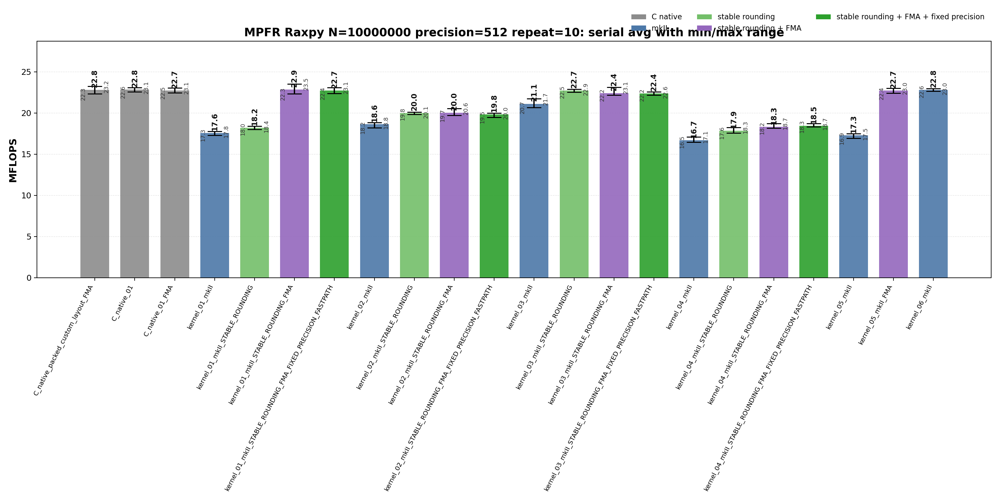
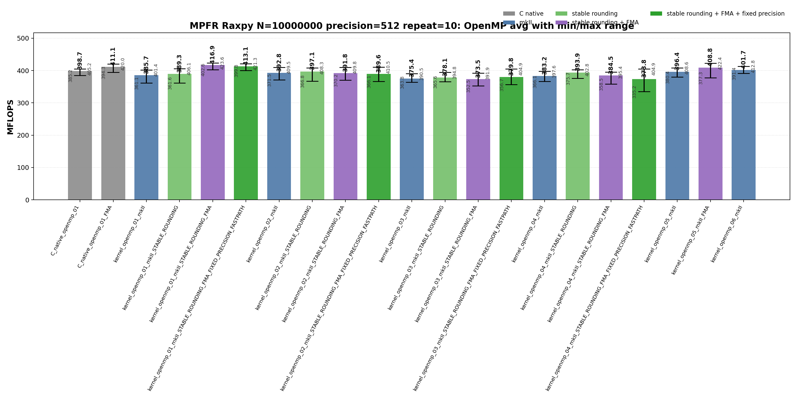

<!-- SPDX-License-Identifier: BSD-2-Clause -->

# 01_Raxpy

This directory benchmarks the MPFR real AXPY operation

```text
y_i = y_i + alpha * x_i
```

with fixed-precision `mpfr_t` and `mpfrxx::mpfr_class` data.  The benchmark is
kept parallel to `benchmarks/gmp/01_Raxpy/` and follows the documentation style
used by `benchmarks/mpfr/00_Rdot/`: every kernel shape is a standalone
translation unit, the timed function is `_Raxpy()`, and the measured ranking is
explained with hotpath disassembly rather than allocation counters.

## Build

From the repository root:

```bash
cmake -S . -B build_bench_release -DCMAKE_BUILD_TYPE=Release
cmake --build build_bench_release -j
```

Executables are created under:

```text
build_bench_release/benchmarks/mpfr/01_Raxpy/
```

Each executable takes:

```text
<vector size> <precision>
```

Example:

```bash
build_bench_release/benchmarks/mpfr/01_Raxpy/Raxpy_mpfr_kernel_01_mkII 10000000 512
```

## Kernel Shapes

Kernel numbers `01..04` intentionally match GMP Raxpy.  MPFR-specific
explicit-context kernels are added as `05` and `06`.

| Kernel | Timed source shape | Purpose |
|--------|--------------------|---------|
| `01` | `y[i] += alpha * x[i]` | Expression form.  FMA builds can lower this source to one `mpfr_fma` call per element. |
| `02` | `temp = alpha; temp *= x[i]; y[i] += temp;` | One product object initialized outside the loop and reused via copy-then-multiply. |
| `03` | `temp = alpha * x[i]; y[i] += temp;` | One product object initialized outside the loop and assigned from the product expression. |
| `04` | `mpfr_class temp = alpha * x[i]; y[i] += temp;` | Loop-local product object; intentionally expensive control. |
| `05` | `with_context(y[i], ctx) += alpha * x[i]` | Context-bound `01`; rounding is captured before the loop.  FMA builds can lower this to `mpfr_fma`. |
| `06` | `with_context(temp, ctx) = alpha * x[i]; with_context(y[i], ctx) += temp;` | Context-bound `03`; one product object is reused and loop operations use cached context rounding. |

Raw C baselines use independent source files:

```text
Raxpy_mpfr_C_native_01
Raxpy_mpfr_C_native_01_FMA
Raxpy_mpfr_C_native_openmp_01
Raxpy_mpfr_C_native_openmp_01_FMA
```

The packed custom-layout experiment is also a separate source file:

```text
Raxpy_mpfr_C_native_packed_custom_layout_FMA
```

Wrapper suffixes are cumulative:

| Suffix | Build option | Meaning |
|--------|--------------|---------|
| `mkII` | none | Generic wrapper expression path. |
| `STABLE_ROUNDING` | `GMPFRXX_MKII_ASSUME_STABLE_MPFR_ROUNDING_MODE` | Uses the wrapper stable-rounding path instead of the generic default-rounding lookup path. |
| `STABLE_ROUNDING_FMA` | stable rounding + `MPFRXX_ENABLE_FMA` | Allows expression shapes such as `y[i] += alpha * x[i]` to lower to `mpfr_fma`. |
| `STABLE_ROUNDING_FMA_FIXED_PRECISION_FASTPATH` | stable rounding + FMA + `GMPFRXX_MKII_ASSUME_FIXED_PRECISION_FASTPATH` | Enables fixed-precision wrapper specialization where applicable. |

Context-bound kernels are explicit targets:

```text
Raxpy_mpfr_kernel_05_mkII
Raxpy_mpfr_kernel_05_mkII_FMA
Raxpy_mpfr_kernel_06_mkII
Raxpy_mpfr_kernel_openmp_05_mkII
Raxpy_mpfr_kernel_openmp_05_mkII_FMA
Raxpy_mpfr_kernel_openmp_06_mkII
```

## Packed Custom Layout Experiment

`Raxpy_mpfr_C_native_packed_custom_layout_FMA` tests the data-layout hypothesis
that the normal `mpfr_t*` vector pays cache latency because each header is
contiguous but each `_mpfr_d` significand pointer may refer to a separate heap
allocation.  The packed executable uses `mpfr_custom_init_set` so each element
stores the MPFR header and significand limbs in one flat allocation:

```text
[ __mpfr_struct | limb0..limbN-1 ][ __mpfr_struct | limb0..limbN-1 ] ...
```

The timed kernel is intentionally the same one-call FMA shape as
`C_native_01_FMA`; the variable under test is the x/y vector layout.

Important constraints:

- The packed elements must not be passed to `mpfr_clear`; their significands
  are owned by the flat allocation.
- `mpfr_set_prec` must not be used on packed elements because it may replace
  `_mpfr_d` and destroy the packed layout.
- This is currently a benchmark/test-program path.  It is not a drop-in
  replacement for APIs that expect independently allocated `mpfr_t` arrays.

## Recorded Run

The current checked-in MPFR Raxpy data was regenerated from scratch after the
target matrix was aligned with MPFR Rdot and GMP Raxpy.

```text
N = 10000000
precision = 512
repeat = 10
OMP_NUM_THREADS = 32
OMP_PLACES = cores
OMP_PROC_BIND = spread
CPU = AMD Ryzen Threadripper 3970X 32-Core Processor
```

Results are stored in:

```text
results_raw/raxpy_mpfr_n10000000_p512_repeat10_20260517_144507/
```

Files:

- [Raw log](results_raw/raxpy_mpfr_n10000000_p512_repeat10_20260517_144507/benchmark_raxpy_mpfr_n10000000_p512_repeat10.log)
- [Raw CSV](results_raw/raxpy_mpfr_n10000000_p512_repeat10_20260517_144507/raw_raxpy_mpfr_n10000000_p512_repeat10.csv)
- [Summary CSV](results_raw/raxpy_mpfr_n10000000_p512_repeat10_20260517_144507/summary_raxpy_mpfr_n10000000_p512_repeat10.csv)

The sweep covers 43 variants and 430 timed runs.  Every timed run reported
`OK`.

The plots show average MFLOPS as vertical bars.  The black range line on each
bar is the observed min-to-max interval across the 10 repeats; labels show the
average and the range endpoints.





## Headline Results

| Class | Best average variant | Max MFLOPS | Avg MFLOPS | Min MFLOPS | Notes |
|-------|----------------------|-----------:|-----------:|-----------:|-------|
| Serial wrapper | `kernel_01_mkII_STABLE_ROUNDING_FMA` | 23.538 | 22.860 | 22.320 | Direct expression lowered to one `mpfr_fma` per element. |
| Serial raw C | `C_native_01` | 23.099 | 22.838 | 22.558 | Raw split multiply/add with one reusable product and cached rounding. |
| Serial context wrapper | `kernel_06_mkII` | 22.971 | 22.806 | 22.643 | Explicit-context reusable-product path; cached rounding without FMA. |
| OpenMP wrapper | `kernel_openmp_01_mkII_STABLE_ROUNDING_FMA` | 423.582 | 416.851 | 402.606 | Best OpenMP average and maximum overall. |
| OpenMP raw C | `C_native_openmp_01_FMA` | 420.049 | 411.108 | 394.320 | Raw OpenMP FMA baseline with cached rounding. |
| OpenMP context wrapper | `kernel_openmp_05_mkII_FMA` | 422.359 | 408.779 | 377.259 | Explicit-context direct FMA path. |

## Serial Results

Main interpretation table:

| Variant | Max MFLOPS | Avg MFLOPS | Min MFLOPS | Interpretation |
|---------|-----------:|-----------:|-----------:|----------------|
| `kernel_01_mkII_STABLE_ROUNDING_FMA` | 23.538 | 22.860 | 22.320 | Best serial wrapper average; direct expression lowered to one `mpfr_fma`. |
| `C_native_01` | 23.099 | 22.838 | 22.558 | Raw split multiply/add baseline with one reusable product and rounding loaded before the loop. |
| `C_native_packed_custom_layout_FMA` | 23.235 | 22.811 | 22.313 | Packed layout did not materially beat the ordinary raw C paths at 512-bit precision. |
| `kernel_06_mkII` | 22.971 | 22.806 | 22.643 | Explicit-context reusable-product path; close to raw split multiply/add. |
| `C_native_01_FMA` | 23.058 | 22.719 | 22.454 | Raw FMA baseline; one `mpfr_fma` per element with rounding cached outside the loop. |
| `kernel_05_mkII_FMA` | 23.015 | 22.715 | 22.398 | Explicit-context direct FMA; removes TLS rounding lookup but keeps the context precision check. |
| `kernel_03_mkII_STABLE_ROUNDING` | 22.887 | 22.713 | 22.542 | Reused product object with stable rounding; split multiply/add path. |
| `kernel_04_mkII` | 17.098 | 16.692 | 16.461 | Loop-local product object; useful as a control, not an optimization target. |

<details>
<summary>Serial results sorted by Max MFLOPS</summary>

| Rank | Variant | Max MFLOPS | Avg MFLOPS | Min MFLOPS |
|------|---------|-----------:|-----------:|-----------:|
| 1 | `kernel_01_mkII_STABLE_ROUNDING_FMA` | 23.538 | 22.860 | 22.320 |
| 2 | `C_native_packed_custom_layout_FMA` | 23.235 | 22.811 | 22.313 |
| 3 | `kernel_03_mkII_STABLE_ROUNDING_FMA` | 23.110 | 22.409 | 22.185 |
| 4 | `C_native_01` | 23.099 | 22.838 | 22.558 |
| 5 | `kernel_01_mkII_STABLE_ROUNDING_FMA_FIXED_PRECISION_FASTPATH` | 23.091 | 22.718 | 22.375 |
| 6 | `C_native_01_FMA` | 23.058 | 22.719 | 22.454 |
| 7 | `kernel_05_mkII_FMA` | 23.015 | 22.715 | 22.398 |
| 8 | `kernel_06_mkII` | 22.971 | 22.806 | 22.643 |
| 9 | `kernel_03_mkII_STABLE_ROUNDING` | 22.887 | 22.713 | 22.542 |
| 10 | `kernel_03_mkII_STABLE_ROUNDING_FMA_FIXED_PRECISION_FASTPATH` | 22.554 | 22.358 | 22.183 |
| 11 | `kernel_03_mkII` | 21.735 | 21.119 | 20.677 |
| 12 | `kernel_02_mkII_STABLE_ROUNDING_FMA` | 20.554 | 20.026 | 19.703 |
| 13 | `kernel_02_mkII_STABLE_ROUNDING` | 20.108 | 19.974 | 19.849 |
| 14 | `kernel_02_mkII_STABLE_ROUNDING_FMA_FIXED_PRECISION_FASTPATH` | 20.006 | 19.821 | 19.485 |
| 15 | `kernel_02_mkII` | 18.826 | 18.633 | 18.218 |
| 16 | `kernel_04_mkII_STABLE_ROUNDING_FMA` | 18.728 | 18.328 | 18.159 |
| 17 | `kernel_04_mkII_STABLE_ROUNDING_FMA_FIXED_PRECISION_FASTPATH` | 18.715 | 18.455 | 18.344 |
| 18 | `kernel_01_mkII_STABLE_ROUNDING` | 18.390 | 18.199 | 18.009 |
| 19 | `kernel_04_mkII_STABLE_ROUNDING` | 18.253 | 17.867 | 17.583 |
| 20 | `kernel_01_mkII` | 17.759 | 17.555 | 17.311 |
| 21 | `kernel_05_mkII` | 17.481 | 17.301 | 16.926 |
| 22 | `kernel_04_mkII` | 17.098 | 16.692 | 16.461 |

</details>

<details>
<summary>Serial results sorted by Avg MFLOPS</summary>

| Rank | Variant | Max MFLOPS | Avg MFLOPS | Min MFLOPS |
|------|---------|-----------:|-----------:|-----------:|
| 1 | `kernel_01_mkII_STABLE_ROUNDING_FMA` | 23.538 | 22.860 | 22.320 |
| 2 | `C_native_01` | 23.099 | 22.838 | 22.558 |
| 3 | `C_native_packed_custom_layout_FMA` | 23.235 | 22.811 | 22.313 |
| 4 | `kernel_06_mkII` | 22.971 | 22.806 | 22.643 |
| 5 | `C_native_01_FMA` | 23.058 | 22.719 | 22.454 |
| 6 | `kernel_01_mkII_STABLE_ROUNDING_FMA_FIXED_PRECISION_FASTPATH` | 23.091 | 22.718 | 22.375 |
| 7 | `kernel_05_mkII_FMA` | 23.015 | 22.715 | 22.398 |
| 8 | `kernel_03_mkII_STABLE_ROUNDING` | 22.887 | 22.713 | 22.542 |
| 9 | `kernel_03_mkII_STABLE_ROUNDING_FMA` | 23.110 | 22.409 | 22.185 |
| 10 | `kernel_03_mkII_STABLE_ROUNDING_FMA_FIXED_PRECISION_FASTPATH` | 22.554 | 22.358 | 22.183 |
| 11 | `kernel_03_mkII` | 21.735 | 21.119 | 20.677 |
| 12 | `kernel_02_mkII_STABLE_ROUNDING_FMA` | 20.554 | 20.026 | 19.703 |
| 13 | `kernel_02_mkII_STABLE_ROUNDING` | 20.108 | 19.974 | 19.849 |
| 14 | `kernel_02_mkII_STABLE_ROUNDING_FMA_FIXED_PRECISION_FASTPATH` | 20.006 | 19.821 | 19.485 |
| 15 | `kernel_02_mkII` | 18.826 | 18.633 | 18.218 |
| 16 | `kernel_04_mkII_STABLE_ROUNDING_FMA_FIXED_PRECISION_FASTPATH` | 18.715 | 18.455 | 18.344 |
| 17 | `kernel_04_mkII_STABLE_ROUNDING_FMA` | 18.728 | 18.328 | 18.159 |
| 18 | `kernel_01_mkII_STABLE_ROUNDING` | 18.390 | 18.199 | 18.009 |
| 19 | `kernel_04_mkII_STABLE_ROUNDING` | 18.253 | 17.867 | 17.583 |
| 20 | `kernel_01_mkII` | 17.759 | 17.555 | 17.311 |
| 21 | `kernel_05_mkII` | 17.481 | 17.301 | 16.926 |
| 22 | `kernel_04_mkII` | 17.098 | 16.692 | 16.461 |

</details>

## OpenMP Results

Main interpretation table:

| Variant | Max MFLOPS | Avg MFLOPS | Min MFLOPS | Interpretation |
|---------|-----------:|-----------:|-----------:|----------------|
| `kernel_openmp_01_mkII_STABLE_ROUNDING_FMA` | 423.582 | 416.851 | 402.606 | Best OpenMP average and maximum overall; direct wrapper FMA path. |
| `C_native_openmp_01_FMA` | 420.049 | 411.108 | 394.320 | Raw OpenMP FMA baseline with rounding loaded before the loop. |
| `kernel_openmp_05_mkII_FMA` | 422.359 | 408.779 | 377.259 | Explicit-context direct FMA; same performance class as raw C FMA. |
| `kernel_openmp_06_mkII` | 412.835 | 401.716 | 391.350 | Explicit-context split multiply/add with one private product object per thread. |
| `C_native_openmp_01` | 405.165 | 398.659 | 385.169 | Raw OpenMP split multiply/add baseline. |
| `kernel_openmp_04_mkII` | 397.640 | 383.172 | 366.082 | Loop-local product control; clearly below the reusable/direct paths. |
| `kernel_openmp_03_mkII_STABLE_ROUNDING_FMA_FIXED_PRECISION_FASTPATH` | 404.895 | 379.768 | 356.731 | Reused product source shape; FMA suffix does not make the hot loop fused. |

<details>
<summary>OpenMP results sorted by Max MFLOPS</summary>

| Rank | Variant | Max MFLOPS | Avg MFLOPS | Min MFLOPS |
|------|---------|-----------:|-----------:|-----------:|
| 1 | `kernel_openmp_01_mkII_STABLE_ROUNDING_FMA` | 423.582 | 416.851 | 402.606 |
| 2 | `kernel_openmp_05_mkII_FMA` | 422.359 | 408.779 | 377.259 |
| 3 | `kernel_openmp_01_mkII_STABLE_ROUNDING_FMA_FIXED_PRECISION_FASTPATH` | 421.330 | 413.101 | 399.757 |
| 4 | `C_native_openmp_01_FMA` | 420.049 | 411.108 | 394.320 |
| 5 | `kernel_openmp_06_mkII` | 412.835 | 401.716 | 391.350 |
| 6 | `kernel_openmp_02_mkII_STABLE_ROUNDING_FMA_FIXED_PRECISION_FASTPATH` | 410.476 | 389.603 | 366.119 |
| 7 | `kernel_openmp_02_mkII_STABLE_ROUNDING_FMA` | 409.824 | 391.791 | 370.162 |
| 8 | `kernel_openmp_02_mkII` | 409.494 | 392.839 | 371.521 |
| 9 | `kernel_openmp_05_mkII` | 408.562 | 396.354 | 380.401 |
| 10 | `kernel_openmp_02_mkII_STABLE_ROUNDING` | 408.288 | 397.131 | 366.808 |
| 11 | `kernel_openmp_01_mkII_STABLE_ROUNDING` | 406.055 | 389.332 | 361.568 |
| 12 | `C_native_openmp_01` | 405.165 | 398.659 | 385.169 |
| 13 | `kernel_openmp_03_mkII_STABLE_ROUNDING_FMA_FIXED_PRECISION_FASTPATH` | 404.895 | 379.768 | 356.731 |
| 14 | `kernel_openmp_04_mkII_STABLE_ROUNDING_FMA_FIXED_PRECISION_FASTPATH` | 404.885 | 373.818 | 335.235 |
| 15 | `kernel_openmp_04_mkII_STABLE_ROUNDING` | 402.828 | 393.875 | 375.747 |
| 16 | `kernel_openmp_01_mkII` | 401.404 | 385.654 | 361.130 |
| 17 | `kernel_openmp_04_mkII` | 397.640 | 383.172 | 366.082 |
| 18 | `kernel_openmp_04_mkII_STABLE_ROUNDING_FMA` | 395.389 | 384.456 | 358.496 |
| 19 | `kernel_openmp_03_mkII_STABLE_ROUNDING` | 394.774 | 378.099 | 365.597 |
| 20 | `kernel_openmp_03_mkII_STABLE_ROUNDING_FMA` | 391.938 | 373.511 | 352.451 |
| 21 | `kernel_openmp_03_mkII` | 390.514 | 375.388 | 363.837 |

</details>

<details>
<summary>OpenMP results sorted by Avg MFLOPS</summary>

| Rank | Variant | Max MFLOPS | Avg MFLOPS | Min MFLOPS |
|------|---------|-----------:|-----------:|-----------:|
| 1 | `kernel_openmp_01_mkII_STABLE_ROUNDING_FMA` | 423.582 | 416.851 | 402.606 |
| 2 | `kernel_openmp_01_mkII_STABLE_ROUNDING_FMA_FIXED_PRECISION_FASTPATH` | 421.330 | 413.101 | 399.757 |
| 3 | `C_native_openmp_01_FMA` | 420.049 | 411.108 | 394.320 |
| 4 | `kernel_openmp_05_mkII_FMA` | 422.359 | 408.779 | 377.259 |
| 5 | `kernel_openmp_06_mkII` | 412.835 | 401.716 | 391.350 |
| 6 | `C_native_openmp_01` | 405.165 | 398.659 | 385.169 |
| 7 | `kernel_openmp_02_mkII_STABLE_ROUNDING` | 408.288 | 397.131 | 366.808 |
| 8 | `kernel_openmp_05_mkII` | 408.562 | 396.354 | 380.401 |
| 9 | `kernel_openmp_04_mkII_STABLE_ROUNDING` | 402.828 | 393.875 | 375.747 |
| 10 | `kernel_openmp_02_mkII` | 409.494 | 392.839 | 371.521 |
| 11 | `kernel_openmp_02_mkII_STABLE_ROUNDING_FMA` | 409.824 | 391.791 | 370.162 |
| 12 | `kernel_openmp_02_mkII_STABLE_ROUNDING_FMA_FIXED_PRECISION_FASTPATH` | 410.476 | 389.603 | 366.119 |
| 13 | `kernel_openmp_01_mkII_STABLE_ROUNDING` | 406.055 | 389.332 | 361.568 |
| 14 | `kernel_openmp_01_mkII` | 401.404 | 385.654 | 361.130 |
| 15 | `kernel_openmp_04_mkII_STABLE_ROUNDING_FMA` | 395.389 | 384.456 | 358.496 |
| 16 | `kernel_openmp_04_mkII` | 397.640 | 383.172 | 366.082 |
| 17 | `kernel_openmp_03_mkII_STABLE_ROUNDING_FMA_FIXED_PRECISION_FASTPATH` | 404.895 | 379.768 | 356.731 |
| 18 | `kernel_openmp_03_mkII_STABLE_ROUNDING` | 394.774 | 378.099 | 365.597 |
| 19 | `kernel_openmp_03_mkII` | 390.514 | 375.388 | 363.837 |
| 20 | `kernel_openmp_04_mkII_STABLE_ROUNDING_FMA_FIXED_PRECISION_FASTPATH` | 404.885 | 373.818 | 335.235 |
| 21 | `kernel_openmp_03_mkII_STABLE_ROUNDING_FMA` | 391.938 | 373.511 | 352.451 |

</details>

## Memory Bandwidth Estimates

The benchmark reports MFLOPS as `2 * N / elapsed`, so
`iterations/s = MFLOPS * 1e6 / 2`.  At 512-bit precision, the MPFR significand
payload is 64 bytes per value.  The table below uses two logical traffic
models:

- Payload minimum: read `x[i]` payload, read `y[i]` payload, write `y[i]`
  payload, or 192 bytes per iteration.  This ignores the hot scalar `alpha`,
  temporary objects, and metadata.
- Header-inclusive estimate: payload minimum plus one 32-byte `mpfr_t` header
  read for `x[i]` and one read/write 32-byte header for `y[i]`, or 288 bytes
  per iteration on this LP64 build.

For this run:

```text
payload GB/s           = avg_mflops * 0.096
header-inclusive GB/s  = avg_mflops * 0.144
```

| Variant | Avg MFLOPS | Payload GB/s | Header-inclusive GB/s | Max header-inclusive GB/s |
|---------|-----------:|-------------:|-----------------------:|--------------------------:|
| `kernel_openmp_01_mkII_STABLE_ROUNDING_FMA` | 416.851 | 40.02 | 60.03 | 61.00 |
| `C_native_openmp_01_FMA` | 411.108 | 39.47 | 59.20 | 60.49 |
| `kernel_openmp_05_mkII_FMA` | 408.779 | 39.24 | 58.86 | 60.82 |
| `kernel_openmp_06_mkII` | 401.716 | 38.56 | 57.85 | 59.45 |
| `C_native_01` | 22.838 | 2.19 | 3.29 | 3.33 |
| `kernel_01_mkII_STABLE_ROUNDING_FMA` | 22.860 | 2.19 | 3.29 | 3.39 |
| `kernel_06_mkII` | 22.806 | 2.19 | 3.28 | 3.31 |

These are logical estimates, not hardware-counter measurements.  The true DRAM
traffic can be lower or higher depending on cache reuse, write-allocate
behavior, hardware prefetching, and allocator placement.

## Hotpath Disassembly

Only the steady-state timed loop is shown.  Addresses are from the recorded
`build_bench_release` binaries.

### `Raxpy_mpfr_C_native_01`

Raw split multiply/add baseline.  Rounding is loaded once before the loop and
kept in `%r13d`; the stack `mpfr_t` product is reused.

```asm
3d00: mov    %rbp,%rdx
3d03: mov    %r13d,%ecx
3d06: mov    %r15,%rsi
3d09: add    $0x1,%r14
3d0d: lea    0x10(%rsp),%rdi
3d12: add    $0x20,%rbp
3d16: call   mpfr_mul@plt
3d1b: mov    %rbx,%rsi
3d1e: mov    %rbx,%rdi
3d21: mov    %r13d,%ecx
3d24: lea    0x10(%rsp),%rdx
3d29: add    $0x20,%rbx
3d2d: call   mpfr_add@plt
3d32: cmp    %r14,0x8(%rsp)
3d37: jne    3d00
```

### `Raxpy_mpfr_C_native_01_FMA`

Raw FMA baseline.  This is the ideal MPFR hot loop for this source shape: one
`mpfr_fma` call and cached rounding in `%r14d`.

```asm
3cba: call   mpfr_get_default_rounding_mode@plt
3cbf: mov    %eax,%r14d

3cd0: mov    %rbx,%rcx
3cd3: mov    %rbp,%rdx
3cd6: mov    %rbx,%rdi
3cd9: mov    %r14d,%r8d
3cdc: mov    %r13,%rsi
3cdf: add    $0x1,%r15
3ce3: add    $0x20,%rbx
3ce7: add    $0x20,%rbp
3ceb: call   mpfr_fma@plt
3cf0: cmp    %r15,%r12
3cf3: jne    3cd0
```

### `Raxpy_mpfr_kernel_01_mkII_STABLE_ROUNDING_FMA_FIXED_PRECISION_FASTPATH`

Wrapper direct FMA path.  It has the same one-call structure as raw C FMA, but
the rounding mode is loaded from TLS inside the loop.

```asm
3c20: mov    %rbx,%rcx
3c23: mov    %rbp,%rdx
3c26: mov    %rbx,%rdi
3c29: mov    %r13,%rsi
3c2c: add    $0x1,%r14
3c30: add    $0x20,%rbx
3c34: add    $0x20,%rbp
3c38: mov    %fs:0xfffffffffffffffc,%r8d
3c41: call   mpfr_fma@plt
3c46: cmp    %r14,%r12
3c49: jne    3c20
```

### `Raxpy_mpfr_kernel_03_mkII_STABLE_ROUNDING_FMA_FIXED_PRECISION_FASTPATH`

The FMA suffix does not imply a fused hot loop here.  The source stores the
product in `temp` first, so the hot loop remains `mpfr_mul` plus `mpfr_add`.

```asm
3d20: mov    %fs:0xfffffffffffffffc,%ecx
3d28: mov    %rbp,%rdx
3d2b: mov    %r14,%rsi
3d2e: mov    %r12,%rdi
3d31: call   mpfr_mul@plt
3d36: mov    %fs:0xfffffffffffffffc,%ecx
3d3e: mov    %r12,%rdx
3d41: mov    %rbx,%rsi
3d44: mov    %rbx,%rdi
3d47: call   mpfr_add@plt
3d4c: add    $0x1,%r15
3d50: add    $0x20,%rbp
3d54: add    $0x20,%rbx
3d58: cmp    %r15,%r13
3d5b: jne    3d20
```

### `Raxpy_mpfr_kernel_05_mkII_FMA`

Explicit context direct FMA path.  The rounding mode comes from the context
storage rather than TLS, and the wrapper checks the destination precision.

```asm
3dd0: cmp    %r13,(%rbx)
3dd3: jne    cold
3dd9: mov    (%rsp),%r8d
3ddd: mov    %rbx,%rcx
3de0: mov    %r15,%rdx
3de3: mov    %rbx,%rdi
3de6: mov    %r14,%rsi
3de9: add    $0x1,%rbp
3ded: add    $0x20,%rbx
3df1: add    $0x20,%r15
3df5: call   mpfr_fma@plt
3dfa: cmp    %rbp,%r12
3dfd: jne    3dd0
```

### `Raxpy_mpfr_kernel_06_mkII`

Explicit context reusable-product path.  The loop is split `mpfr_mul` plus
`mpfr_add`, with cached rounding in `%r13d` and a precision check on `y[i]`.

```asm
4140: mov    0x8(%rsp),%rsi
4145: mov    %r13d,%ecx
4148: mov    %rbp,%rdx
414b: mov    %r12,%rdi
414e: call   mpfr_mul@plt
4153: cmp    (%r15),%r14
4156: jne    cold
415c: mov    %r13d,%ecx
415f: mov    %r12,%rdx
4162: mov    %r15,%rsi
4165: mov    %r15,%rdi
4168: call   mpfr_add@plt
416d: add    $0x1,%rbx
4171: add    $0x20,%rbp
4175: add    $0x20,%r15
4179: cmp    %rbx,(%rsp)
417d: jne    4140
```

### OpenMP FMA Comparison

Raw C OpenMP FMA has the same one-call shape as serial raw C FMA:

```asm
36e0: mov    %rbp,%rcx
36e3: mov    %r12,%rdx
36e6: mov    %rbp,%rdi
36e9: mov    %r14d,%r8d
36ec: mov    %r13,%rsi
36ef: add    $0x1,%rbx
36f3: add    $0x20,%rbp
36f7: add    $0x20,%r12
36fb: call   mpfr_fma@plt
3700: cmp    %rbx,%r15
3703: jne    36e0
```

The context OpenMP FMA path is structurally the same MPFR operation, but the
context object is loaded and the destination precision is checked:

```asm
3920: mov    0x20(%r13),%rax
3924: mov    0x0(%rbp),%rdi
3928: mov    0x8(%rax),%r8d
392c: cmp    %rdi,(%rax)
392f: jne    cold
3935: mov    0x8(%r13),%rsi
3939: mov    %rbp,%rcx
393c: mov    %r12,%rdx
393f: mov    %rbp,%rdi
3942: add    $0x1,%rbx
3946: add    $0x20,%rbp
394a: add    $0x20,%r12
394e: call   mpfr_fma@plt
3953: cmp    %rbx,%r14
3956: jne    3920
```

## Comparison With GMP Raxpy

The source-shape ladder is now aligned with GMP:

```text
01: expression-first AXPY
02: reusable product object via copy-then-multiply
03: reusable product object via expression assignment
04: loop-local product object
OpenMP 01-04: matching parallel forms
```

MPFR adds two dimensions that GMP `mpf_t` does not have:

- every arithmetic call needs an `mpfr_rnd_t`;
- expression-first `alpha * x + y` can be represented as one `mpfr_fma`.

That changes the optimization target.  GMP Raxpy mostly tests temporary
materialization and object reuse.  MPFR Raxpy also tests whether rounding is
looked up in the loop, loaded from TLS, cached in an explicit context, or
cached manually in raw C.

## Lessons Learned

- For Raxpy, direct FMA is the best source shape.  There is no reduction
  variable, so the `01` direct expression can become one `mpfr_fma` per element
  and wins both serial and OpenMP in this run.
- `kernel_03` is still useful as a reused-product split-path comparison, but
  it does not fuse after the product has been materialized.  The FMA suffix on
  `03` should be interpreted by disassembly, not by the target name alone.
- `kernel_04` is a control for loop-local product construction.  It is not a
  serious optimization target.
- `GMPFRXX_MKII_ASSUME_FIXED_PRECISION_FASTPATH` did not materially improve the
  best Raxpy path here.  At 512-bit precision, the MPFR call body and memory
  traffic dominate more than the remaining wrapper-side precision checks.
- Explicit context (`05`/`06`) is the clean design path for hoisting rounding
  out of the loop.  In this run it reaches the raw C class, but the extra
  context load and destination precision check mean it is not automatically
  faster than the stable-rounding FMA path.
- The packed custom layout did not improve 512-bit Raxpy in this run.  The
  result suggests that, for this kernel and precision, MPFR arithmetic cost and
  ordinary streaming behavior dominate over the simple header-to-limb pointer
  chase hypothesis.
