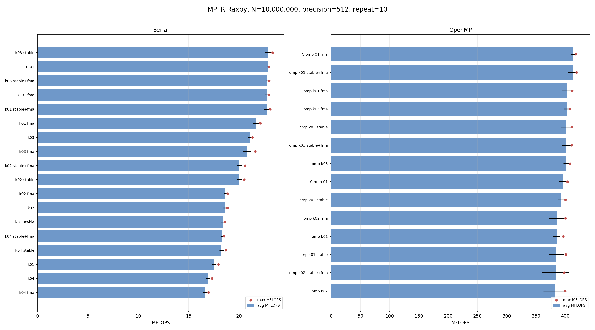

<!-- SPDX-License-Identifier: BSD-2-Clause -->

# 01_Raxpy

This directory benchmarks the MPFR real AXPY operation

```text
y_i = y_i + alpha * x_i
```

with random `mpfr_t` and `mpfrxx::mpfr_class` data at a fixed precision.  The
kernel numbering follows the GMP `01_Raxpy` benchmark where the same source
shape exists.

## Build

From the repository root:

```bash
cmake -S . -B build_bench_release -DCMAKE_BUILD_TYPE=Release
cmake --build build_bench_release -j
```

The executables are created under:

```text
build_bench_release/benchmarks/mpfr/01_Raxpy/
```

## Run

Run the MPFR benchmark set through the common MPFR runner:

```bash
benchmarks/common/run_mpfr_benchmarks.sh build_bench_release 512
```

Individual executables take:

```text
<vector size> <precision>
```

Example:

```bash
build_bench_release/benchmarks/mpfr/01_Raxpy/Raxpy_mpfr_kernel_03_mkII 10000000 512
```

For OpenMP repeat runs, keep affinity explicit:

```bash
OMP_NUM_THREADS=32 OMP_PLACES=cores OMP_PROC_BIND=spread \
build_bench_release/benchmarks/mpfr/01_Raxpy/Raxpy_mpfr_kernel_openmp_03_mkII \
    10000000 512
```

## Kernel Shapes

The timed body is `_Raxpy()` in each benchmark executable.  The `Raxpy()`
helper in `Raxpy.hpp` is the post-run correctness reference.

| Variant | Timed source shape | Temporary policy | GMP parallel |
|---------|--------------------|------------------|--------------|
| `C_native_01` | `mpfr_mul(temp, alpha, x[i], rnd); mpfr_add(y[i], y[i], temp, rnd);` | Raw `mpfr_t` product object initialized once. | Same role as GMP raw C native. |
| `C_native_01_FMA` | `mpfr_fma(y[i], alpha, x[i], y[i], rnd);` | No product temporary. | MPFR-specific baseline; GMP `mpf_t` has no matching FMA API. |
| `kernel_01` | `y[i] += alpha * x[i];` | Expression-first source shape. | Matches GMP `kernel_01`. |
| `kernel_02` | `temp = alpha; temp *= x[i]; y[i] += temp;` | One reusable product object, assigned from `alpha` then multiplied in place. | Matches GMP `kernel_02`. |
| `kernel_03` | `temp = alpha * x[i]; y[i] += temp;` | One reusable product object assigned from the product expression. | Matches GMP `kernel_03`. |
| `kernel_04` | `mpfr_class temp = alpha * x[i]; y[i] += temp;` | Loop-local product object. | Matches GMP `kernel_04`; intentionally allocation-heavy. |
| `kernel_openmp_01` | `y[i] += alpha * x[i];` inside `#pragma omp parallel for schedule(static)`. | One independent `y[i]` update per iteration. | Matches GMP OpenMP `kernel_01`. |
| `kernel_openmp_02` | `temp = alpha; temp *= x[i]; y[i] += temp;` inside `#pragma omp parallel for private(temp) schedule(static)`. | One private reusable product object per thread. | Matches GMP OpenMP `kernel_02`. |
| `kernel_openmp_03` | `temp = alpha * x[i]; y[i] += temp;` inside `#pragma omp parallel` plus `omp for schedule(static)`. | One reusable product object per thread, assigned from the expression. | Matches GMP OpenMP `kernel_03`. |

## Variant Suffixes

Each wrapper kernel is built as:

| Suffix | Build option |
|--------|--------------|
| `_mkII` | Default wrapper behavior. |
| `_mkII_STABLE_ROUNDING` | Assumes MPFR rounding mode is loop-invariant. |
| `_mkII_FMA` | Enables the wrapper FMA expression path where the source expression exposes a fused multiply-add. |
| `_mkII_STABLE_ROUNDING_FMA` | Combines stable rounding and FMA expression support. |

The FMA suffix is most relevant to expression-first shapes such as `kernel_01`.
Reusable-product kernels split multiply and add in source, so the suffix is
kept for build-matrix symmetry but should be checked by disassembly before it
is interpreted as an actual `mpfr_fma` hot path.

## Comparison With GMP Raxpy

The source-shape ladder is intentionally parallel to GMP:

```text
01: expression-first AXPY
02: reusable product object via copy-then-multiply
03: reusable product object via expression assignment
04: loop-local product object
OpenMP 01-03: matching parallel forms
```

The MPFR kernels additionally expose rounding-mode behavior.  `STABLE_ROUNDING`
variants are expected to remove repeated default-rounding lookups when the
wrapper can treat rounding as loop-invariant.  FMA-capable source shapes may
collapse multiply and add into one `mpfr_fma` call; this has no direct GMP
`mpf_t` equivalent.

## Recorded Result: N=10000000, 512-bit, Repeat 10

This run used the timed-loop MFLOPS printed by each benchmark executable.
All 320 timed runs reported `Result OK`.

Raw data:

- `results_raw/raxpy_n1e7_512_repeat10_20260515_153432/benchmark_raxpy_n10000000_p512_repeat10.log`
- `results_raw/raxpy_n1e7_512_repeat10_20260515_153432/raw_raxpy_n10000000_p512_repeat10.csv`
- `results_raw/raxpy_n1e7_512_repeat10_20260515_153432/summary_raxpy_n10000000_p512_repeat10.csv`



### Serial Results

| Variant | Max MFLOPS | Avg MFLOPS | Min MFLOPS | Observation |
|---------|------------|------------|------------|-------------|
| `C_native_01` | 22.979 | 22.864 | 22.709 | Raw `mpfr_mul` + `mpfr_add`, one reusable `mpfr_t` product, cached rounding. |
| `C_native_01_FMA` | 22.929 | 22.727 | 22.500 | Raw `mpfr_fma`, cached rounding.  It is not faster than non-FMA in this serial run. |
| `kernel_01_mkII` | 17.950 | 17.521 | 17.331 | Expression-first source, default wrapper path. |
| `kernel_01_mkII_STABLE_ROUNDING` | 18.571 | 18.357 | 18.131 | Stable rounding removes the function-call lookup from the hot loop, but still uses split expression materialization. |
| `kernel_01_mkII_FMA` | 22.107 | 21.732 | 21.150 | Expression lowers to `mpfr_fma`; close to C native FMA. |
| `kernel_01_mkII_STABLE_ROUNDING_FMA` | 23.089 | 22.726 | 22.341 | Best expression-first wrapper path; one `mpfr_fma` per element. |
| `kernel_02_mkII` | 18.849 | 18.613 | 18.326 | Reusable product via copy-then-multiply. |
| `kernel_02_mkII_STABLE_ROUNDING` | 20.517 | 20.030 | 19.792 | Stable rounding helps split multiply/add. |
| `kernel_02_mkII_FMA` | 18.867 | 18.631 | 18.396 | FMA option does not change this source shape. |
| `kernel_02_mkII_STABLE_ROUNDING_FMA` | 20.586 | 20.031 | 19.839 | Same practical shape as stable `kernel_02`. |
| `kernel_03_mkII` | 21.326 | 21.050 | 20.699 | Reusable product assigned from expression. |
| `kernel_03_mkII_STABLE_ROUNDING` | 23.321 | 22.901 | 22.536 | Best serial max in this run; matches the reusable-temp C native structure. |
| `kernel_03_mkII_FMA` | 21.603 | 20.807 | 20.322 | FMA option does not fuse because the source stores the product first. |
| `kernel_03_mkII_STABLE_ROUNDING_FMA` | 22.986 | 22.786 | 22.639 | Same split multiply/add shape as stable `kernel_03`, within run noise. |
| `kernel_04_mkII` | 17.321 | 16.887 | 16.530 | Loop-local product object is allocation-heavy. |
| `kernel_04_mkII_STABLE_ROUNDING` | 18.678 | 18.259 | 18.022 | Stable rounding helps, but construction cost remains. |
| `kernel_04_mkII_FMA` | 16.992 | 16.641 | 16.267 | FMA option cannot repair loop-local product materialization. |
| `kernel_04_mkII_STABLE_ROUNDING_FMA` | 18.499 | 18.304 | 18.078 | Same practical limitation as stable `kernel_04`. |

### OpenMP Results

| Variant | Max MFLOPS | Avg MFLOPS | Min MFLOPS | Observation |
|---------|------------|------------|------------|-------------|
| `C_native_openmp_01` | 403.673 | 395.833 | 384.630 | Raw OpenMP split multiply/add baseline. |
| `C_native_openmp_01_FMA` | 417.779 | 413.445 | 405.200 | Raw OpenMP FMA baseline. |
| `kernel_openmp_01_mkII` | 396.423 | 385.167 | 376.927 | Expression-first OpenMP wrapper default path. |
| `kernel_openmp_01_mkII_STABLE_ROUNDING` | 401.165 | 384.712 | 355.131 | Stable rounding alone is not enough to beat run-to-run variation. |
| `kernel_openmp_01_mkII_FMA` | 411.716 | 403.194 | 381.627 | FMA expression path reaches the C native FMA class. |
| `kernel_openmp_01_mkII_STABLE_ROUNDING_FMA` | 419.366 | 412.873 | 390.700 | Best OpenMP wrapper path; effectively tied with C native FMA average. |
| `kernel_openmp_02_mkII` | 399.834 | 382.219 | 344.728 | Per-thread reusable product via copy-then-multiply. |
| `kernel_openmp_02_mkII_STABLE_ROUNDING` | 400.465 | 392.942 | 384.945 | Stable split path is competitive with C native non-FMA. |
| `kernel_openmp_02_mkII_FMA` | 400.200 | 386.190 | 361.953 | FMA option does not fuse this source shape. |
| `kernel_openmp_02_mkII_STABLE_ROUNDING_FMA` | 398.180 | 383.448 | 318.760 | Same practical shape as stable `kernel_openmp_02`, with a noisy low run. |
| `kernel_openmp_03_mkII` | 407.940 | 401.398 | 390.496 | Per-thread reusable product assigned from expression. |
| `kernel_openmp_03_mkII_STABLE_ROUNDING` | 410.708 | 401.694 | 383.108 | Split multiply/add path near C native non-FMA. |
| `kernel_openmp_03_mkII_FMA` | 407.800 | 402.763 | 395.431 | FMA option does not fuse this source shape. |
| `kernel_openmp_03_mkII_STABLE_ROUNDING_FMA` | 410.981 | 401.636 | 388.922 | Same split multiply/add shape as stable `kernel_openmp_03`. |

### Estimated Memory Bandwidth Used

The benchmark reports MFLOPS as `2 * N / elapsed`, so
`iterations/s = MFLOPS * 1e6 / 2`.  At 512-bit precision, the MPFR significand
payload is 64 bytes per value.  The table below uses two logical traffic
models:

- Payload minimum: read `x[i]` payload, read `y[i]` payload, write `y[i]`
  payload, or 192 bytes per iteration.  This ignores the hot scalar `alpha`,
  the reusable product object, and metadata.
- Header-inclusive estimate: payload minimum plus one 32-byte `mpfr_t` header
  read for `x[i]` and one read/write 32-byte header for `y[i]`, or 288 bytes
  per iteration on this LP64 build.  This is still a logical estimate, not a
  hardware-counter measurement.

For this run:

```text
payload GB/s          = avg_mflops * 0.096
header-inclusive GB/s = avg_mflops * 0.144
```

| Variant | Avg MFLOPS | Payload GB/s | Header-inclusive GB/s | Max header-inclusive GB/s |
|---------|------------|--------------|------------------------|---------------------------|
| `C_native_01` | 22.864 | 2.19 | 3.29 | 3.31 |
| `C_native_01_FMA` | 22.727 | 2.18 | 3.27 | 3.30 |
| `kernel_01_mkII_STABLE_ROUNDING_FMA` | 22.726 | 2.18 | 3.27 | 3.32 |
| `kernel_03_mkII_STABLE_ROUNDING` | 22.901 | 2.20 | 3.30 | 3.36 |
| `C_native_openmp_01_FMA` | 413.445 | 39.69 | 59.54 | 60.16 |
| `kernel_openmp_01_mkII_STABLE_ROUNDING_FMA` | 412.873 | 39.64 | 59.45 | 60.39 |
| `kernel_openmp_03_mkII_STABLE_ROUNDING` | 401.694 | 38.56 | 57.84 | 59.14 |

The OpenMP FMA wrapper therefore uses roughly the same bandwidth class as the
C native FMA baseline: about 40 GB/s for 512-bit payload traffic, or about
60 GB/s if the `mpfr_t` headers for the streamed `x` and `y` arrays are counted.
The true DRAM traffic can be lower or higher depending on cache reuse,
write-allocate behavior, hardware prefetching, and allocator placement, so this
section should be read as a bandwidth sanity check rather than a substitute for
hardware counters.

## Hotpath Disassembly

The snippets below are from the Release benchmark binaries under
`build_bench_release/benchmarks/mpfr/01_Raxpy/`.  They focus on the timed
`_Raxpy()` loop or, for OpenMP, the outlined loop body.

### `C_native_01`

Baseline non-FMA C native keeps one `mpfr_t` product object and caches the
rounding mode before the loop.  The hot loop has one `mpfr_mul` and one
`mpfr_add` per element.

```asm
3cd9: call   mpfr_init@plt
3cde: call   mpfr_get_default_rounding_mode@plt
3ce3: mov    %eax,%r13d

3d00: mov    %rbp,%rdx        # x[i]
3d03: mov    %r13d,%ecx       # cached rounding mode
3d06: mov    %r15,%rsi        # alpha
3d0d: lea    0x10(%rsp),%rdi  # product temporary
3d16: call   mpfr_mul@plt
3d1b: mov    %rbx,%rsi        # y[i]
3d1e: mov    %rbx,%rdi        # y[i]
3d21: mov    %r13d,%ecx       # cached rounding mode
3d24: lea    0x10(%rsp),%rdx  # product temporary
3d29: add    $0x20,%rbx
3d2d: call   mpfr_add@plt
3d37: jne    3d00
3d3e: call   mpfr_clear@plt
```

### `C_native_01_FMA`

The FMA C native baseline also caches rounding once before the loop.  Its hot
loop is one `mpfr_fma` call per element.

```asm
3cba: call   mpfr_get_default_rounding_mode@plt
3cbf: mov    %eax,%r14d

3cd0: mov    %rbx,%rcx        # y[i] addend
3cd3: mov    %rbp,%rdx        # x[i]
3cd6: mov    %rbx,%rdi        # y[i] destination
3cd9: mov    %r14d,%r8d       # cached rounding mode
3cdc: mov    %r13,%rsi        # alpha
3ce3: add    $0x20,%rbx
3ce7: add    $0x20,%rbp
3ceb: call   mpfr_fma@plt
3cf3: jne    3cd0
```

### `kernel_01_mkII_STABLE_ROUNDING_FMA`

This is the closest wrapper path to `C_native_01_FMA`: it emits one
`mpfr_fma` per element.  The remaining structural difference is the rounding
argument.  C native uses a register cached before the loop; this wrapper build
loads the stable rounding value from TLS inside the loop.

```asm
3c80: mov    %rbx,%rcx        # y[i] addend
3c83: mov    %rbp,%rdx        # x[i]
3c86: mov    %rbx,%rdi        # y[i] destination
3c89: mov    %r13,%rsi        # alpha
3c90: add    $0x20,%rbx
3c94: add    $0x20,%rbp
3c98: mov    %fs:0xfffffffffffffffc,%r8d  # TLS rounding load
3ca1: call   mpfr_fma@plt
3ca9: jne    3c80
```

### `kernel_03_mkII_STABLE_ROUNDING`

This path is the wrapper equivalent of the reusable-product non-FMA shape.  It
initializes one product object outside the loop, then performs `mpfr_mul` and
`mpfr_add` for each element.  Compared with `C_native_01`, the loop still reads
rounding from TLS for each MPFR operation.

```asm
3f72: call   mpfr_get_default_prec@plt
3fa3: call   mpfr_init2@plt

3fd0: mov    %fs:0xfffffffffffffffc,%ecx  # TLS rounding load
3fd8: mov    %rbp,%rdx                    # x[i]
3fdb: mov    %r14,%rsi                    # alpha
3fde: mov    %r12,%rdi                    # product temporary
3fe1: call   mpfr_mul@plt
3fe6: mov    %fs:0xfffffffffffffffc,%ecx  # TLS rounding load
3fee: mov    %r12,%rdx                    # product temporary
3ff1: mov    %rbx,%rsi                    # y[i]
3ff4: mov    %rbx,%rdi                    # y[i]
3ff7: call   mpfr_add@plt
4004: add    $0x20,%rbx
400b: jne    3fd0
4010: call   mpfr_clear@plt
```

### `kernel_openmp_01_mkII_STABLE_ROUNDING_FMA`

The OpenMP outlined function has the expected chunk setup plus the same
one-`mpfr_fma` loop body.  This explains why the wrapper OpenMP FMA path lands
in the same class as `C_native_openmp_01_FMA`.

```asm
380f: call   omp_get_num_threads@plt
3816: call   omp_get_thread_num@plt
3847: cmp    %r13,%rbx
384a: jge    388c

3860: mov    0x8(%r14),%rsi   # alpha
3864: mov    %rbp,%rcx        # y[i] addend
3867: mov    %r12,%rdx        # x[i]
386a: mov    %rbp,%rdi        # y[i] destination
3871: add    $0x20,%rbp
3875: add    $0x20,%r12
3879: mov    %fs:0xfffffffffffffffc,%r8d  # TLS rounding load
3882: call   mpfr_fma@plt
388a: jne    3860
```

## Lessons Learned

- The useful MPFR Raxpy wrapper shapes are `kernel_01` when it can lower to
  `mpfr_fma`, and `kernel_03` when the product is intentionally reusable.
  `kernel_01_mkII_STABLE_ROUNDING_FMA` reaches the C native FMA serial class
  with 22.726 average MFLOPS, while `kernel_openmp_01_mkII_STABLE_ROUNDING_FMA`
  reaches the C native FMA OpenMP class with 412.873 average MFLOPS.
- The FMA build option is source-shape dependent.  It matters for
  `y[i] += alpha * x[i]`, but it does not fuse `kernel_02`, `kernel_03`, or
  `kernel_04` after the source has already materialized a product object.
- Stable rounding is a real serial optimization for split multiply/add paths.
  It removes the per-iteration `mpfr_get_default_rounding_mode` call from the
  wrapper path, but the current generated hot loops still load the cached
  rounding value from TLS for each MPFR call.
- `kernel_04` remains the wrong shape for performance.  Loop-local
  `mpfr_class` construction keeps it below reusable-product kernels even when
  stable rounding is enabled.
- Raw C native FMA is not automatically faster than raw C native non-FMA at
  512-bit precision in this benchmark.  The wrapper FMA path helps mainly
  because it avoids expression temporary materialization and split MPFR calls,
  not because `mpfr_fma` is universally cheaper than `mpfr_mul` plus
  `mpfr_add`.
- OpenMP measurements should be read with both max and average.  The best
  OpenMP wrapper path is structurally the same as C native FMA except for the
  TLS rounding load, and the remaining spread is dominated by normal OpenMP
  scheduling and system variation.
