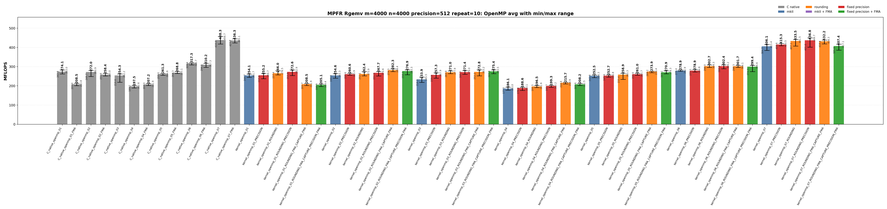
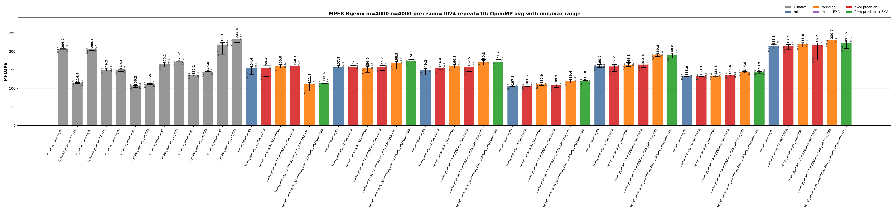

<!-- SPDX-License-Identifier: BSD-2-Clause -->

# 02_Rgemv

This directory benchmarks the MPFR real dense matrix-vector product

```text
y <- alpha * A * x + beta * y
```

with raw MPFR C kernels and `mpfrxx::mpfr_class` wrapper kernels. The
performance question is whether wrapper source shapes can reach the same
hot-loop class as raw MPFR C when rounding, fixed precision, FMA, and OpenMP
partitioning are controlled.

## Build

From the repository root:

```bash
cmake -S . -B build_bench_release -DCMAKE_BUILD_TYPE=Release
cmake --build build_bench_release -j
```

Executables are created under:

```text
build_bench_release/benchmarks/mpfr/02_Rgemv/
```

Each executable takes `<rows m> <cols n> <precision>`. Example:

```bash
build_bench_release/benchmarks/mpfr/02_Rgemv/Rgemv_mpfr_kernel_openmp_07_ROUNDING_FMA_CAPTURE_PRECISION_FMA 4000 4000 512
```

The repeat-10 runner uses the same source/build taxonomy:

```bash
OMP_NUM_THREADS=32 OMP_PLACES=cores OMP_PROC_BIND=spread \
    benchmarks/mpfr/02_Rgemv/run_repeat.sh build_bench_release 4000 4000 512 10
```

MPFR Rgemv wrapper targets omit a separate `mkII` implementation suffix because
this directory has only the mkII wrapper implementation.  The target suffixes
separate source changes from build flags:

| Suffix | Kind | Meaning |
|--------|------|---------|
| none | source baseline | Ordinary wrapper source for the numbered algorithm. |
| `ROUNDING` | source modifier | Captures `mpfrxx::evaluation_context` before the loop and uses `with_context` in the timed body.  No compile-time flag is implied. |
| `ROUNDING_FMA_CAPTURE` | source modifier | Uses the same loop-external rounding context and spells the inner update as an expression that can be captured by the ET FMA path. |
| `PRECISION` | build modifier | Builds the same source with `GMPFRXX_MKII_FAST_FIXED_PREC`. |
| final `FMA` | build modifier | Builds the FMA-capturable source with `GMPFRXX_MKII_ENABLE_FMA`. |

The C native targets encode FMA directly in their source, so they do not split
into `ROUNDING` and non-`ROUNDING` forms.

The cross-benchmark runner can execute the GMP and MPFR `00_Rdot`, `01_Raxpy`, and `02_Rgemv` suites for both standard precisions with one command:

```bash
OMP_NUM_THREADS=32 OMP_PLACES=cores OMP_PROC_BIND=spread \
    benchmarks/run_all.sh build_bench_release 512,1024 10 10000000 10000000 4000 4000
```

The second argument is a precision list. `both` and `all` are aliases for `512,1024`; a single value such as `512` still runs only that precision. Per-benchmark results are written to `results_raw/run_all_p512_repeat10_<timestamp>/` and `results_raw/run_all_p1024_repeat10_<timestamp>/` under each benchmark directory.

## Benchmark Parameters

| Parameter | Meaning |
| --- | --- |
| `m` | Number of matrix rows and length of `y`. |
| `n` | Number of matrix columns and length of `x`. |
| `precision` | MPFR precision in bits for matrix/vector/scalar inputs and temporaries. |
| `repeat` | Number of timed process executions per executable. |
| `OMP_NUM_THREADS` | OpenMP worker count for `openmp` executables. |
| `OMP_PLACES`, `OMP_PROC_BIND` | OpenMP affinity controls used by the runner. |

The committed runs use `m=4000`, `n=4000`, `repeat=10`, `precision=512` and `precision=1024`, with `OMP_NUM_THREADS=32`, `OMP_PLACES=cores`, and `OMP_PROC_BIND=spread`.

## Variant Shapes

The timed body is `_Rgemv()`. `A` is stored in column-major order.  The numbered
variant table names the source-level transition being measured.  Some variants branch from an earlier comparison point, so the transition column names the baseline explicitly.  `ROUNDING`,
`ROUNDING_FMA_CAPTURE`, `PRECISION`, and final `FMA` suffixes modify the same
numbered shape without changing the variant number.

| Variant | Transition from previous variant | Timed source shape | Temporary/resource policy | Purpose |
|---------|----------------------------------|--------------------|---------------------------|---------|
| `01` | Starting point. | Row-dot form: for each row `i`, accumulate `sum_j A[i+j*lda] * x[j]`, then update `y[i]`. | Reusable row accumulator and reusable product object. | Baseline row-owned Rgemv spelling; exposes the cost of strided column-major `A` access. |
| `02` | `01 -> 02`: change traversal from row-dot to column-major streaming. | Scale `y`, then stream columns of `A` and update all rows for each `j`. | Reusable `temp = alpha * x[j]` and reusable `templ = temp * A[i+j*lda]`. | Separates wrapper overhead from the dominant `A` access pattern and avoids FMA as a confounder. |
| `03` | `01 -> 03`: keep the row-dot traversal and switch from a reusable product temporary to an FMA-capturable expression spelling. | Row-dot direct-expression form: `temp += A[i+j*lda] * x[j]`, then `y[i] = alpha * temp + beta * y[i]`. | Reusable accumulator; expression product is FMA-capturable only in the `ROUNDING_FMA_CAPTURE` source. | Tests whether ET fusion can reach the raw C row-dot `mpfr_fma` / `mpfr_fmma` class. |
| `04` | `02 -> 04`: keep the column-major reusable-temporary traversal and add the explicit rounding/context comparison path. | Column-major reusable-temporary form; the base source intentionally remains in the same hot-loop class as `02`. | Reusable `temp` and `templ`; `ROUNDING` variants route all updates through a loop-external context. | Measures whether explicit rounding capture changes the reusable-temp column-major class without mixing in traversal or expression-shape changes. |
| `05` | `04 -> 05`: add OpenMP row partitioning and precompute `alpha * x`. | OpenMP row partition with precomputed `scaled_x[j] = alpha * x[j]`. | Precomputed scaled vector plus per-thread reusable product. | Removes repeated column-scalar work while each thread owns rows of `y`. |
| `06` | `05 -> 06`: add fixed 256-row blocking inside the row-owned OpenMP shape. | OpenMP 256-row blocks with column loop and contiguous row loop inside each block. | Per-thread reusable scratch; no shared-y race inside a block. | Trades extra loop structure for better locality in row-owned OpenMP code. |
| `07` | `06 -> 07`: switch from row ownership to column partitioning with reduction. | OpenMP column partition with per-thread partial `y` vectors and final reduction. | `num_threads * m` partial accumulators plus final reduction outside the hot column loop. | Preserves serial-like column-major `A` streaming without racing on `y`. |

Serial wrapper executables cover variants `01`-`04`; OpenMP wrapper executables
cover variants `01`-`07`.

## Source Transitions

The transition table above is intentionally source-level, but not strictly linear.  A variant number
changes the source algorithm; suffixes then ask separate questions about
rounding capture, FMA capture, and fixed precision.

For each applicable wrapper source, the generated target family is:

```text
<base>
<base>_PRECISION
<base>_ROUNDING
<base>_ROUNDING_PRECISION
<base>_ROUNDING_FMA_CAPTURE_FMA
<base>_ROUNDING_FMA_CAPTURE_PRECISION_FMA
```

The `ROUNDING_FMA_CAPTURE` source is only built as an FMA target because its
purpose is to test ET FMA lowering.  Non-FMA reusable-temporary variants remain
separate so they continue to match raw C kernels that avoid local allocation
without using FMA.

## C Native Equivalent Kernels

The mapping is based on the timed `_Rgemv()` source shape and generated hot
loop, not just on matching numeric suffixes.  Raw C kernels encode rounding and
FMA directly; wrapper kernels use suffixes to isolate those effects.

| C native kernel | Equivalent C++ wrapper kernel(s) | Equivalence basis |
|-----------------|----------------------------------|-------------------|
| `C_native_01` | `kernel_01`, `kernel_01_PRECISION` | Row-dot source with reusable row accumulator and product temporary. |
| `C_native_01_FMA` | `kernel_01_ROUNDING_FMA_CAPTURE_FMA`, `kernel_01_ROUNDING_FMA_CAPTURE_PRECISION_FMA` | Same row-dot algorithm, but the wrapper source uses context capture and an FMA-capturable expression. |
| `C_native_02` | `kernel_02`, `kernel_02_PRECISION`, `kernel_02_ROUNDING`, `kernel_02_ROUNDING_PRECISION` | Column-major reusable `temp`/`templ` source, intentionally non-FMA. |
| `C_native_02_FMA` | `kernel_02_ROUNDING_FMA_CAPTURE_FMA`, `kernel_02_ROUNDING_FMA_CAPTURE_PRECISION_FMA` | Column-major update with an FMA-capturable row update. |
| `C_native_03` | `kernel_03_ROUNDING_FMA_CAPTURE_FMA`, `kernel_03_ROUNDING_FMA_CAPTURE_PRECISION_FMA` | Row-dot FMA-style accumulation.  Raw C also uses `mpfr_fmma` for the final alpha/beta update. |
| `C_native_04` | `kernel_04`, `kernel_04_PRECISION`, `kernel_04_ROUNDING`, `kernel_04_ROUNDING_PRECISION` | Serial column-major reusable-temporary comparison point. |
| `C_native_openmp_NN` | `kernel_openmp_NN`, `kernel_openmp_NN_PRECISION`, `kernel_openmp_NN_ROUNDING`, `kernel_openmp_NN_ROUNDING_PRECISION` | Same OpenMP partitioning and non-FMA temporary policy as raw C variant `NN`. |
| `C_native_openmp_NN_FMA` | `kernel_openmp_NN_ROUNDING_FMA_CAPTURE_FMA`, `kernel_openmp_NN_ROUNDING_FMA_CAPTURE_PRECISION_FMA` | Same OpenMP partitioning as raw C variant `NN`, with FMA-capturable wrapper source and FMA-enabled build. |

The closest hot-loop comparison for the best historical OpenMP class is
`C_native_openmp_07_FMA` against
`kernel_openmp_07_ROUNDING_FMA_CAPTURE_PRECISION_FMA`.

## Recorded Run

### 512-bit run

| Field | Value |
|-------|-------|
| Run ID | `run_all_p512_repeat10_20260526_062542` |
| Date | 2026-05-26 |
| CPU | AMD Ryzen Threadripper 3970X 32-Core Processor |
| OS | Linux 6.8.0-94-generic x86_64 |
| Compiler | `c++ (Ubuntu 15.2.0-16ubuntu1) 15.2.0` |
| Build type | Release |
| Problem size | `m=4000`, `n=4000` |
| Precision | 512 bits |
| Repeat count | 10 |
| OpenMP | `OMP_NUM_THREADS=32`, `OMP_PLACES=cores`, `OMP_PROC_BIND=spread` |
| Default precision env | `MPFRXX_DEFAULT_PRECISION_BITS=512` |
| Benchmark command | `OMP_NUM_THREADS=32 OMP_PLACES=cores OMP_PROC_BIND=spread benchmarks/run_all.sh build_bench_release 512,1024 10` |
| Raw result directory | `benchmarks/mpfr/02_Rgemv/results_raw/run_all_p512_repeat10_20260526_062542/` |
| Raw log | `benchmarks/mpfr/02_Rgemv/results_raw/run_all_p512_repeat10_20260526_062542/benchmark_rgemv_mpfr_m4000_n4000_p512_repeat10.log` |
| Raw CSV | `benchmarks/mpfr/02_Rgemv/results_raw/run_all_p512_repeat10_20260526_062542/raw_rgemv_mpfr_m4000_n4000_p512_repeat10.csv` |
| Summary CSV | `benchmarks/mpfr/02_Rgemv/results_raw/run_all_p512_repeat10_20260526_062542/summary_rgemv_mpfr_m4000_n4000_p512_repeat10.csv` |
| Correctness | 850 / 850 runs reported OK. |




Plot regeneration command:

```bash
python3 benchmarks/mpfr/02_Rgemv/plot_repeat_summary.py \
    benchmarks/mpfr/02_Rgemv/results_raw/run_all_p512_repeat10_20260526_062542/benchmark_rgemv_mpfr_m4000_n4000_p512_repeat10.log \
    --output-dir benchmarks/mpfr/02_Rgemv/results_raw/run_all_p512_repeat10_20260526_062542 \
    --output-prefix rgemv_mpfr_m4000_n4000_p512_repeat10 \
    --title-prefix "MPFR Rgemv m=4000, n=4000, precision=512, repeat=10"
```

### 1024-bit run

| Field | Value |
|-------|-------|
| Run ID | `run_all_p1024_repeat10_20260526_062542` |
| Date | 2026-05-26 |
| CPU | AMD Ryzen Threadripper 3970X 32-Core Processor |
| OS | Linux 6.8.0-94-generic x86_64 |
| Compiler | `c++ (Ubuntu 15.2.0-16ubuntu1) 15.2.0` |
| Build type | Release |
| Problem size | `m=4000`, `n=4000` |
| Precision | 1024 bits |
| Repeat count | 10 |
| OpenMP | `OMP_NUM_THREADS=32`, `OMP_PLACES=cores`, `OMP_PROC_BIND=spread` |
| Default precision env | `MPFRXX_DEFAULT_PRECISION_BITS=1024` |
| Benchmark command | `OMP_NUM_THREADS=32 OMP_PLACES=cores OMP_PROC_BIND=spread benchmarks/run_all.sh build_bench_release 512,1024 10` |
| Raw result directory | `benchmarks/mpfr/02_Rgemv/results_raw/run_all_p1024_repeat10_20260526_062542/` |
| Raw log | `benchmarks/mpfr/02_Rgemv/results_raw/run_all_p1024_repeat10_20260526_062542/benchmark_rgemv_mpfr_m4000_n4000_p1024_repeat10.log` |
| Raw CSV | `benchmarks/mpfr/02_Rgemv/results_raw/run_all_p1024_repeat10_20260526_062542/raw_rgemv_mpfr_m4000_n4000_p1024_repeat10.csv` |
| Summary CSV | `benchmarks/mpfr/02_Rgemv/results_raw/run_all_p1024_repeat10_20260526_062542/summary_rgemv_mpfr_m4000_n4000_p1024_repeat10.csv` |
| Correctness | 850 / 850 runs reported OK. |




Plot regeneration command:

```bash
python3 benchmarks/mpfr/02_Rgemv/plot_repeat_summary.py \
    benchmarks/mpfr/02_Rgemv/results_raw/run_all_p1024_repeat10_20260526_062542/benchmark_rgemv_mpfr_m4000_n4000_p1024_repeat10.log \
    --output-dir benchmarks/mpfr/02_Rgemv/results_raw/run_all_p1024_repeat10_20260526_062542 \
    --output-prefix rgemv_mpfr_m4000_n4000_p1024_repeat10 \
    --title-prefix "MPFR Rgemv m=4000, n=4000, precision=1024, repeat=10"
```

## Resource or Bandwidth Estimates

The values below are model estimates derived from MFLOPS, not hardware-counter measurements. They count active limb bytes plus a header-inclusive object model. They exclude allocator metadata, cache-line overfetch, instruction fetch, and final OpenMP reduction traffic.

| Case | Representative best-avg variant | Avg MFLOPS | Active bytes/iteration | Header-inclusive bytes/iteration | Active GB/s | Header-inclusive GB/s |
| --- | --- | --- | --- | --- | --- | --- |
| 512-bit serial | `C_native_02_FMA` | 23.484 | 192 | 288 | 2.254 | 3.382 |
| 512-bit OpenMP | `C_native_openmp_07` | 438.252 | 192 | 288 | 42.072 | 63.108 |
| 1024-bit serial | `kernel_02_ROUNDING_FMA_CAPTURE_PRECISION_FMA` | 10.176 | 384 | 480 | 1.954 | 2.442 |
| 1024-bit OpenMP | `C_native_openmp_07_FMA` | 234.392 | 384 | 480 | 45.003 | 56.254 |

For `Rgemv`, the per-iteration byte model is a compact arithmetic-stream estimate. It is not a full cache-footprint or hardware-bandwidth measurement.

## Headline Results

The headline rows below are regenerated from the committed 512-bit and 1024-bit `run_all` summary CSV files.

| Precision | Class | Variant | Max MFLOPS | Avg MFLOPS | Interpretation |
| --- | --- | --- | --- | --- | --- |
| 512 | Best serial max | `kernel_02_ROUNDING_FMA_CAPTURE_PRECISION_FMA` | 24.124 | 23.454 | Wrapper context-captured FMA source built with fixed-precision assumptions; checks the closest fused hot-loop class. |
| 512 | Best serial average | `C_native_02_FMA` | 23.631 | 23.484 | Raw C FMA reference; the hot loop uses the fused backend operation where the source shape permits it. |
| 512 | Best OpenMP max | `C_native_openmp_07` | 456.671 | 438.252 | Raw C OpenMP column-partitioned class with per-thread partial vectors and final reduction outside the hot loop. |
| 512 | Best OpenMP average | `C_native_openmp_07` | 456.671 | 438.252 | Raw C OpenMP column-partitioned class with per-thread partial vectors and final reduction outside the hot loop. |
| 1024 | Best serial max | `kernel_02_ROUNDING_FMA_CAPTURE_PRECISION_FMA` | 10.366 | 10.176 | Wrapper context-captured FMA source built with fixed-precision assumptions; checks the closest fused hot-loop class. |
| 1024 | Best serial average | `kernel_02_ROUNDING_FMA_CAPTURE_PRECISION_FMA` | 10.366 | 10.176 | Wrapper context-captured FMA source built with fixed-precision assumptions; checks the closest fused hot-loop class. |
| 1024 | Best OpenMP max | `C_native_openmp_07_FMA` | 238.981 | 234.392 | Raw C OpenMP column-partitioned class with per-thread partial vectors and final reduction outside the hot loop. |
| 1024 | Best OpenMP average | `C_native_openmp_07_FMA` | 238.981 | 234.392 | Raw C OpenMP column-partitioned class with per-thread partial vectors and final reduction outside the hot loop. |

## Serial Results

### 512-bit serial interpretation

These rows are derived from `benchmarks/mpfr/02_Rgemv/results_raw/run_all_p512_repeat10_20260526_062542/summary_rgemv_mpfr_m4000_n4000_p512_repeat10.csv`.

| Observation | Variant | Max MFLOPS | Avg MFLOPS | Min MFLOPS | Interpretation |
| --- | --- | --- | --- | --- | --- |
| Best raw C serial avg | `C_native_02_FMA` | 23.631 | 23.484 | 23.372 | Raw C FMA reference; the hot loop uses the fused backend operation where the source shape permits it. |
| Best wrapper serial avg | `kernel_02_ROUNDING_FMA_CAPTURE_PRECISION_FMA` | 24.124 | 23.454 | 23.162 | Wrapper context-captured FMA source built with fixed-precision assumptions; checks the closest fused hot-loop class. |
| Best serial max | `kernel_02_ROUNDING_FMA_CAPTURE_PRECISION_FMA` | 24.124 | 23.454 | 23.162 | Wrapper context-captured FMA source built with fixed-precision assumptions; checks the closest fused hot-loop class. |

<details>
<summary>512-bit serial results sorted by Max MFLOPS</summary>

| Rank | Variant | Max MFLOPS | Avg MFLOPS | Min MFLOPS |
| --- | --- | --- | --- | --- |
| 1 | `kernel_02_ROUNDING_FMA_CAPTURE_PRECISION_FMA` | 24.124 | 23.454 | 23.162 |
| 2 | `kernel_02_ROUNDING_FMA_CAPTURE_FMA` | 23.927 | 23.368 | 23.084 |
| 3 | `kernel_04_ROUNDING_FMA_CAPTURE_FMA` | 23.678 | 23.331 | 22.866 |
| 4 | `C_native_02_FMA` | 23.631 | 23.484 | 23.372 |
| 5 | `kernel_04_ROUNDING_FMA_CAPTURE_PRECISION_FMA` | 23.605 | 23.294 | 22.694 |
| 6 | `kernel_04_ROUNDING` | 20.852 | 20.269 | 20.003 |
| 7 | `kernel_02_ROUNDING_PRECISION` | 20.549 | 20.354 | 20.209 |
| 8 | `kernel_04_ROUNDING_PRECISION` | 20.537 | 20.418 | 20.341 |
| 9 | `kernel_02_ROUNDING` | 20.457 | 20.343 | 20.054 |
| 10 | `C_native_04` | 19.788 | 19.608 | 19.348 |
| 11 | `C_native_02` | 19.772 | 19.603 | 19.351 |
| 12 | `kernel_02_PRECISION` | 19.123 | 18.690 | 18.420 |
| 13 | `kernel_02` | 18.991 | 18.715 | 18.526 |
| 14 | `kernel_04` | 18.912 | 18.632 | 18.360 |
| 15 | `kernel_04_PRECISION` | 18.795 | 18.603 | 18.329 |
| 16 | `C_native_01` | 11.578 | 10.410 | 9.649 |
| 17 | `kernel_01_PRECISION` | 11.574 | 10.381 | 9.478 |
| 18 | `C_native_01_FMA` | 11.295 | 10.895 | 10.249 |
| 19 | `C_native_03` | 11.121 | 10.646 | 10.369 |
| 20 | `kernel_03_ROUNDING_PRECISION` | 11.048 | 10.609 | 9.862 |
| 21 | `kernel_01_ROUNDING_PRECISION` | 11.046 | 10.215 | 9.875 |
| 22 | `kernel_03_ROUNDING` | 10.951 | 10.386 | 9.911 |
| 23 | `kernel_01_ROUNDING` | 10.844 | 10.350 | 9.857 |
| 24 | `kernel_01_ROUNDING_FMA_CAPTURE_FMA` | 10.537 | 10.180 | 9.873 |
| 25 | `kernel_01_ROUNDING_FMA_CAPTURE_PRECISION_FMA` | 10.474 | 10.220 | 10.069 |
| 26 | `kernel_03_ROUNDING_FMA_CAPTURE_FMA` | 10.451 | 10.102 | 9.948 |
| 27 | `kernel_01` | 10.414 | 9.713 | 9.314 |
| 28 | `kernel_03_ROUNDING_FMA_CAPTURE_PRECISION_FMA` | 10.350 | 10.184 | 10.031 |
| 29 | `kernel_03_PRECISION` | 10.221 | 9.758 | 9.376 |
| 30 | `kernel_03` | 8.670 | 8.467 | 8.164 |

</details>

<details>
<summary>512-bit serial results sorted by Avg MFLOPS</summary>

| Rank | Variant | Max MFLOPS | Avg MFLOPS | Min MFLOPS |
| --- | --- | --- | --- | --- |
| 1 | `C_native_02_FMA` | 23.631 | 23.484 | 23.372 |
| 2 | `kernel_02_ROUNDING_FMA_CAPTURE_PRECISION_FMA` | 24.124 | 23.454 | 23.162 |
| 3 | `kernel_02_ROUNDING_FMA_CAPTURE_FMA` | 23.927 | 23.368 | 23.084 |
| 4 | `kernel_04_ROUNDING_FMA_CAPTURE_FMA` | 23.678 | 23.331 | 22.866 |
| 5 | `kernel_04_ROUNDING_FMA_CAPTURE_PRECISION_FMA` | 23.605 | 23.294 | 22.694 |
| 6 | `kernel_04_ROUNDING_PRECISION` | 20.537 | 20.418 | 20.341 |
| 7 | `kernel_02_ROUNDING_PRECISION` | 20.549 | 20.354 | 20.209 |
| 8 | `kernel_02_ROUNDING` | 20.457 | 20.343 | 20.054 |
| 9 | `kernel_04_ROUNDING` | 20.852 | 20.269 | 20.003 |
| 10 | `C_native_04` | 19.788 | 19.608 | 19.348 |
| 11 | `C_native_02` | 19.772 | 19.603 | 19.351 |
| 12 | `kernel_02` | 18.991 | 18.715 | 18.526 |
| 13 | `kernel_02_PRECISION` | 19.123 | 18.690 | 18.420 |
| 14 | `kernel_04` | 18.912 | 18.632 | 18.360 |
| 15 | `kernel_04_PRECISION` | 18.795 | 18.603 | 18.329 |
| 16 | `C_native_01_FMA` | 11.295 | 10.895 | 10.249 |
| 17 | `C_native_03` | 11.121 | 10.646 | 10.369 |
| 18 | `kernel_03_ROUNDING_PRECISION` | 11.048 | 10.609 | 9.862 |
| 19 | `C_native_01` | 11.578 | 10.410 | 9.649 |
| 20 | `kernel_03_ROUNDING` | 10.951 | 10.386 | 9.911 |
| 21 | `kernel_01_PRECISION` | 11.574 | 10.381 | 9.478 |
| 22 | `kernel_01_ROUNDING` | 10.844 | 10.350 | 9.857 |
| 23 | `kernel_01_ROUNDING_FMA_CAPTURE_PRECISION_FMA` | 10.474 | 10.220 | 10.069 |
| 24 | `kernel_01_ROUNDING_PRECISION` | 11.046 | 10.215 | 9.875 |
| 25 | `kernel_03_ROUNDING_FMA_CAPTURE_PRECISION_FMA` | 10.350 | 10.184 | 10.031 |
| 26 | `kernel_01_ROUNDING_FMA_CAPTURE_FMA` | 10.537 | 10.180 | 9.873 |
| 27 | `kernel_03_ROUNDING_FMA_CAPTURE_FMA` | 10.451 | 10.102 | 9.948 |
| 28 | `kernel_03_PRECISION` | 10.221 | 9.758 | 9.376 |
| 29 | `kernel_01` | 10.414 | 9.713 | 9.314 |
| 30 | `kernel_03` | 8.670 | 8.467 | 8.164 |

</details>

### 1024-bit serial interpretation

These rows are derived from `benchmarks/mpfr/02_Rgemv/results_raw/run_all_p1024_repeat10_20260526_062542/summary_rgemv_mpfr_m4000_n4000_p1024_repeat10.csv`.

| Observation | Variant | Max MFLOPS | Avg MFLOPS | Min MFLOPS | Interpretation |
| --- | --- | --- | --- | --- | --- |
| Best raw C serial avg | `C_native_02_FMA` | 10.216 | 10.117 | 9.975 | Raw C FMA reference; the hot loop uses the fused backend operation where the source shape permits it. |
| Best wrapper serial avg | `kernel_02_ROUNDING_FMA_CAPTURE_PRECISION_FMA` | 10.366 | 10.176 | 10.070 | Wrapper context-captured FMA source built with fixed-precision assumptions; checks the closest fused hot-loop class. |
| Best serial max | `kernel_02_ROUNDING_FMA_CAPTURE_PRECISION_FMA` | 10.366 | 10.176 | 10.070 | Wrapper context-captured FMA source built with fixed-precision assumptions; checks the closest fused hot-loop class. |

<details>
<summary>1024-bit serial results sorted by Max MFLOPS</summary>

| Rank | Variant | Max MFLOPS | Avg MFLOPS | Min MFLOPS |
| --- | --- | --- | --- | --- |
| 1 | `kernel_02_ROUNDING_FMA_CAPTURE_PRECISION_FMA` | 10.366 | 10.176 | 10.070 |
| 2 | `kernel_02_ROUNDING_FMA_CAPTURE_FMA` | 10.359 | 10.144 | 9.999 |
| 3 | `kernel_04_ROUNDING_FMA_CAPTURE_PRECISION_FMA` | 10.228 | 10.122 | 10.035 |
| 4 | `C_native_02_FMA` | 10.216 | 10.117 | 9.975 |
| 5 | `kernel_04_ROUNDING_FMA_CAPTURE_FMA` | 10.200 | 10.066 | 9.858 |
| 6 | `C_native_02` | 9.683 | 9.411 | 9.249 |
| 7 | `kernel_04_ROUNDING_PRECISION` | 9.480 | 9.422 | 9.334 |
| 8 | `kernel_04_ROUNDING` | 9.470 | 9.410 | 9.345 |
| 9 | `C_native_04` | 9.447 | 9.397 | 9.310 |
| 10 | `kernel_02_ROUNDING` | 9.444 | 9.401 | 9.357 |
| 11 | `kernel_02_ROUNDING_PRECISION` | 9.410 | 9.311 | 9.259 |
| 12 | `kernel_02` | 9.173 | 8.956 | 8.855 |
| 13 | `kernel_02_PRECISION` | 9.034 | 8.950 | 8.881 |
| 14 | `kernel_04_PRECISION` | 9.022 | 8.968 | 8.890 |
| 15 | `kernel_04` | 8.992 | 8.920 | 8.860 |
| 16 | `kernel_03_ROUNDING_FMA_CAPTURE_FMA` | 8.490 | 8.275 | 8.176 |
| 17 | `kernel_01_ROUNDING_FMA_CAPTURE_PRECISION_FMA` | 8.464 | 8.306 | 8.239 |
| 18 | `kernel_01_ROUNDING_FMA_CAPTURE_FMA` | 8.447 | 8.300 | 8.198 |
| 19 | `kernel_03_ROUNDING_FMA_CAPTURE_PRECISION_FMA` | 8.319 | 8.276 | 8.225 |
| 20 | `kernel_01_ROUNDING_PRECISION` | 8.270 | 8.108 | 8.003 |
| 21 | `C_native_03` | 8.250 | 8.185 | 8.061 |
| 22 | `C_native_01_FMA` | 8.249 | 8.217 | 8.174 |
| 23 | `C_native_01` | 8.169 | 8.102 | 8.026 |
| 24 | `kernel_03_ROUNDING` | 8.153 | 8.071 | 7.834 |
| 25 | `kernel_01_ROUNDING` | 8.147 | 8.087 | 7.982 |
| 26 | `kernel_03_ROUNDING_PRECISION` | 8.134 | 8.082 | 8.029 |
| 27 | `kernel_01` | 8.084 | 7.859 | 7.752 |
| 28 | `kernel_01_PRECISION` | 8.008 | 7.876 | 7.829 |
| 29 | `kernel_03_PRECISION` | 7.896 | 7.840 | 7.791 |
| 30 | `kernel_03` | 7.546 | 7.353 | 7.296 |

</details>

<details>
<summary>1024-bit serial results sorted by Avg MFLOPS</summary>

| Rank | Variant | Max MFLOPS | Avg MFLOPS | Min MFLOPS |
| --- | --- | --- | --- | --- |
| 1 | `kernel_02_ROUNDING_FMA_CAPTURE_PRECISION_FMA` | 10.366 | 10.176 | 10.070 |
| 2 | `kernel_02_ROUNDING_FMA_CAPTURE_FMA` | 10.359 | 10.144 | 9.999 |
| 3 | `kernel_04_ROUNDING_FMA_CAPTURE_PRECISION_FMA` | 10.228 | 10.122 | 10.035 |
| 4 | `C_native_02_FMA` | 10.216 | 10.117 | 9.975 |
| 5 | `kernel_04_ROUNDING_FMA_CAPTURE_FMA` | 10.200 | 10.066 | 9.858 |
| 6 | `kernel_04_ROUNDING_PRECISION` | 9.480 | 9.422 | 9.334 |
| 7 | `C_native_02` | 9.683 | 9.411 | 9.249 |
| 8 | `kernel_04_ROUNDING` | 9.470 | 9.410 | 9.345 |
| 9 | `kernel_02_ROUNDING` | 9.444 | 9.401 | 9.357 |
| 10 | `C_native_04` | 9.447 | 9.397 | 9.310 |
| 11 | `kernel_02_ROUNDING_PRECISION` | 9.410 | 9.311 | 9.259 |
| 12 | `kernel_04_PRECISION` | 9.022 | 8.968 | 8.890 |
| 13 | `kernel_02` | 9.173 | 8.956 | 8.855 |
| 14 | `kernel_02_PRECISION` | 9.034 | 8.950 | 8.881 |
| 15 | `kernel_04` | 8.992 | 8.920 | 8.860 |
| 16 | `kernel_01_ROUNDING_FMA_CAPTURE_PRECISION_FMA` | 8.464 | 8.306 | 8.239 |
| 17 | `kernel_01_ROUNDING_FMA_CAPTURE_FMA` | 8.447 | 8.300 | 8.198 |
| 18 | `kernel_03_ROUNDING_FMA_CAPTURE_PRECISION_FMA` | 8.319 | 8.276 | 8.225 |
| 19 | `kernel_03_ROUNDING_FMA_CAPTURE_FMA` | 8.490 | 8.275 | 8.176 |
| 20 | `C_native_01_FMA` | 8.249 | 8.217 | 8.174 |
| 21 | `C_native_03` | 8.250 | 8.185 | 8.061 |
| 22 | `kernel_01_ROUNDING_PRECISION` | 8.270 | 8.108 | 8.003 |
| 23 | `C_native_01` | 8.169 | 8.102 | 8.026 |
| 24 | `kernel_01_ROUNDING` | 8.147 | 8.087 | 7.982 |
| 25 | `kernel_03_ROUNDING_PRECISION` | 8.134 | 8.082 | 8.029 |
| 26 | `kernel_03_ROUNDING` | 8.153 | 8.071 | 7.834 |
| 27 | `kernel_01_PRECISION` | 8.008 | 7.876 | 7.829 |
| 28 | `kernel_01` | 8.084 | 7.859 | 7.752 |
| 29 | `kernel_03_PRECISION` | 7.896 | 7.840 | 7.791 |
| 30 | `kernel_03` | 7.546 | 7.353 | 7.296 |

</details>

## OpenMP Results

### 512-bit OpenMP interpretation

These rows are derived from `benchmarks/mpfr/02_Rgemv/results_raw/run_all_p512_repeat10_20260526_062542/summary_rgemv_mpfr_m4000_n4000_p512_repeat10.csv`.

| Observation | Variant | Max MFLOPS | Avg MFLOPS | Min MFLOPS | Interpretation |
| --- | --- | --- | --- | --- | --- |
| Best raw C OpenMP avg | `C_native_openmp_07` | 456.671 | 438.252 | 417.973 | Raw C OpenMP column-partitioned class with per-thread partial vectors and final reduction outside the hot loop. |
| Best wrapper OpenMP avg | `kernel_openmp_07_ROUNDING_PRECISION` | 449.744 | 436.822 | 401.564 | Wrapper source with loop-external rounding/context plus fixed-precision build assumptions. |
| Best OpenMP max | `C_native_openmp_07` | 456.671 | 438.252 | 417.973 | Raw C OpenMP column-partitioned class with per-thread partial vectors and final reduction outside the hot loop. |

<details>
<summary>512-bit OpenMP results sorted by Max MFLOPS</summary>

| Rank | Variant | Max MFLOPS | Avg MFLOPS | Min MFLOPS |
| --- | --- | --- | --- | --- |
| 1 | `C_native_openmp_07` | 456.671 | 438.252 | 417.973 |
| 2 | `kernel_openmp_07_ROUNDING_PRECISION` | 449.744 | 436.822 | 401.564 |
| 3 | `C_native_openmp_07_FMA` | 445.126 | 436.254 | 423.655 |
| 4 | `kernel_openmp_07_ROUNDING` | 441.543 | 433.493 | 407.065 |
| 5 | `kernel_openmp_07_ROUNDING_FMA_CAPTURE_FMA` | 438.300 | 432.163 | 418.369 |
| 6 | `kernel_openmp_07_PRECISION` | 420.466 | 415.333 | 408.596 |
| 7 | `kernel_openmp_07_ROUNDING_FMA_CAPTURE_PRECISION_FMA` | 417.113 | 407.376 | 385.919 |
| 8 | `kernel_openmp_07` | 415.382 | 406.101 | 384.674 |
| 9 | `C_native_openmp_06` | 320.676 | 317.259 | 309.384 |
| 10 | `C_native_openmp_06_FMA` | 317.349 | 310.238 | 296.136 |
| 11 | `kernel_openmp_06_ROUNDING` | 309.342 | 302.670 | 296.025 |
| 12 | `kernel_openmp_06_ROUNDING_PRECISION` | 309.182 | 302.445 | 288.841 |
| 13 | `kernel_openmp_06_ROUNDING_FMA_CAPTURE_PRECISION_FMA` | 306.624 | 299.447 | 274.340 |
| 14 | `kernel_openmp_06_ROUNDING_FMA_CAPTURE_FMA` | 306.150 | 301.709 | 296.282 |
| 15 | `kernel_openmp_02_ROUNDING_FMA_CAPTURE_FMA` | 288.376 | 282.301 | 274.308 |
| 16 | `kernel_openmp_06_PRECISION` | 284.579 | 278.892 | 272.339 |
| 17 | `kernel_openmp_03_ROUNDING_FMA_CAPTURE_PRECISION_FMA` | 283.465 | 275.440 | 263.257 |
| 18 | `kernel_openmp_02_ROUNDING_FMA_CAPTURE_PRECISION_FMA` | 283.263 | 276.850 | 258.127 |
| 19 | `kernel_openmp_03_ROUNDING_FMA_CAPTURE_FMA` | 283.186 | 272.760 | 252.189 |
| 20 | `C_native_openmp_01` | 283.035 | 274.057 | 262.280 |
| 21 | `kernel_openmp_01_ROUNDING_PRECISION` | 282.924 | 272.644 | 253.882 |
| 22 | `kernel_openmp_06` | 282.910 | 278.854 | 275.449 |
| 23 | `C_native_openmp_02` | 280.902 | 272.030 | 248.732 |
| 24 | `kernel_openmp_03_ROUNDING_PRECISION` | 278.993 | 271.403 | 260.288 |
| 25 | `kernel_openmp_01_ROUNDING` | 278.503 | 265.999 | 257.450 |
| 26 | `kernel_openmp_05_ROUNDING_FMA_CAPTURE_PRECISION_FMA` | 278.291 | 270.892 | 263.104 |
| 27 | `kernel_openmp_03_ROUNDING` | 277.940 | 270.997 | 263.806 |
| 28 | `kernel_openmp_05_ROUNDING_FMA_CAPTURE_FMA` | 276.436 | 273.925 | 268.214 |
| 29 | `C_native_openmp_05_FMA` | 275.132 | 268.793 | 264.287 |
| 30 | `kernel_openmp_02_ROUNDING_PRECISION` | 274.568 | 267.742 | 251.475 |
| 31 | `kernel_openmp_02_ROUNDING` | 273.854 | 262.412 | 252.131 |
| 32 | `kernel_openmp_03_PRECISION` | 267.906 | 257.304 | 239.897 |
| 33 | `kernel_openmp_02_PRECISION` | 265.934 | 260.635 | 255.571 |
| 34 | `kernel_openmp_05_ROUNDING_PRECISION` | 265.688 | 261.001 | 255.591 |
| 35 | `kernel_openmp_05_ROUNDING` | 265.348 | 258.892 | 233.351 |
| 36 | `C_native_openmp_02_FMA` | 264.981 | 258.420 | 251.772 |
| 37 | `kernel_openmp_01_PRECISION` | 264.706 | 255.233 | 236.977 |
| 38 | `C_native_openmp_05` | 264.566 | 261.281 | 255.048 |
| 39 | `kernel_openmp_02` | 263.312 | 254.598 | 240.302 |
| 40 | `C_native_openmp_03` | 262.212 | 254.340 | 218.624 |
| 41 | `kernel_openmp_01` | 261.664 | 254.118 | 244.665 |
| 42 | `kernel_openmp_05_PRECISION` | 256.794 | 252.666 | 245.627 |
| 43 | `kernel_openmp_05` | 256.298 | 252.479 | 242.791 |
| 44 | `kernel_openmp_03` | 245.531 | 233.932 | 218.124 |
| 45 | `kernel_openmp_04_ROUNDING_FMA_CAPTURE_FMA` | 218.925 | 215.678 | 210.351 |
| 46 | `C_native_openmp_01_FMA` | 213.756 | 208.476 | 200.956 |
| 47 | `kernel_openmp_04_ROUNDING_FMA_CAPTURE_PRECISION_FMA` | 212.517 | 208.191 | 201.613 |
| 48 | `kernel_openmp_01_ROUNDING_FMA_CAPTURE_FMA` | 211.874 | 208.461 | 201.677 |
| 49 | `C_native_openmp_04_FMA` | 211.857 | 207.178 | 201.969 |
| 50 | `kernel_openmp_01_ROUNDING_FMA_CAPTURE_PRECISION_FMA` | 209.429 | 205.088 | 196.941 |
| 51 | `kernel_openmp_04_ROUNDING_PRECISION` | 203.219 | 199.343 | 192.675 |
| 52 | `C_native_openmp_04` | 202.619 | 197.481 | 189.216 |
| 53 | `kernel_openmp_04_ROUNDING` | 201.630 | 196.550 | 191.258 |
| 54 | `kernel_openmp_04_PRECISION` | 193.062 | 188.614 | 176.404 |
| 55 | `kernel_openmp_04` | 193.009 | 186.074 | 177.483 |

</details>

<details>
<summary>512-bit OpenMP results sorted by Avg MFLOPS</summary>

| Rank | Variant | Max MFLOPS | Avg MFLOPS | Min MFLOPS |
| --- | --- | --- | --- | --- |
| 1 | `C_native_openmp_07` | 456.671 | 438.252 | 417.973 |
| 2 | `kernel_openmp_07_ROUNDING_PRECISION` | 449.744 | 436.822 | 401.564 |
| 3 | `C_native_openmp_07_FMA` | 445.126 | 436.254 | 423.655 |
| 4 | `kernel_openmp_07_ROUNDING` | 441.543 | 433.493 | 407.065 |
| 5 | `kernel_openmp_07_ROUNDING_FMA_CAPTURE_FMA` | 438.300 | 432.163 | 418.369 |
| 6 | `kernel_openmp_07_PRECISION` | 420.466 | 415.333 | 408.596 |
| 7 | `kernel_openmp_07_ROUNDING_FMA_CAPTURE_PRECISION_FMA` | 417.113 | 407.376 | 385.919 |
| 8 | `kernel_openmp_07` | 415.382 | 406.101 | 384.674 |
| 9 | `C_native_openmp_06` | 320.676 | 317.259 | 309.384 |
| 10 | `C_native_openmp_06_FMA` | 317.349 | 310.238 | 296.136 |
| 11 | `kernel_openmp_06_ROUNDING` | 309.342 | 302.670 | 296.025 |
| 12 | `kernel_openmp_06_ROUNDING_PRECISION` | 309.182 | 302.445 | 288.841 |
| 13 | `kernel_openmp_06_ROUNDING_FMA_CAPTURE_FMA` | 306.150 | 301.709 | 296.282 |
| 14 | `kernel_openmp_06_ROUNDING_FMA_CAPTURE_PRECISION_FMA` | 306.624 | 299.447 | 274.340 |
| 15 | `kernel_openmp_02_ROUNDING_FMA_CAPTURE_FMA` | 288.376 | 282.301 | 274.308 |
| 16 | `kernel_openmp_06_PRECISION` | 284.579 | 278.892 | 272.339 |
| 17 | `kernel_openmp_06` | 282.910 | 278.854 | 275.449 |
| 18 | `kernel_openmp_02_ROUNDING_FMA_CAPTURE_PRECISION_FMA` | 283.263 | 276.850 | 258.127 |
| 19 | `kernel_openmp_03_ROUNDING_FMA_CAPTURE_PRECISION_FMA` | 283.465 | 275.440 | 263.257 |
| 20 | `C_native_openmp_01` | 283.035 | 274.057 | 262.280 |
| 21 | `kernel_openmp_05_ROUNDING_FMA_CAPTURE_FMA` | 276.436 | 273.925 | 268.214 |
| 22 | `kernel_openmp_03_ROUNDING_FMA_CAPTURE_FMA` | 283.186 | 272.760 | 252.189 |
| 23 | `kernel_openmp_01_ROUNDING_PRECISION` | 282.924 | 272.644 | 253.882 |
| 24 | `C_native_openmp_02` | 280.902 | 272.030 | 248.732 |
| 25 | `kernel_openmp_03_ROUNDING_PRECISION` | 278.993 | 271.403 | 260.288 |
| 26 | `kernel_openmp_03_ROUNDING` | 277.940 | 270.997 | 263.806 |
| 27 | `kernel_openmp_05_ROUNDING_FMA_CAPTURE_PRECISION_FMA` | 278.291 | 270.892 | 263.104 |
| 28 | `C_native_openmp_05_FMA` | 275.132 | 268.793 | 264.287 |
| 29 | `kernel_openmp_02_ROUNDING_PRECISION` | 274.568 | 267.742 | 251.475 |
| 30 | `kernel_openmp_01_ROUNDING` | 278.503 | 265.999 | 257.450 |
| 31 | `kernel_openmp_02_ROUNDING` | 273.854 | 262.412 | 252.131 |
| 32 | `C_native_openmp_05` | 264.566 | 261.281 | 255.048 |
| 33 | `kernel_openmp_05_ROUNDING_PRECISION` | 265.688 | 261.001 | 255.591 |
| 34 | `kernel_openmp_02_PRECISION` | 265.934 | 260.635 | 255.571 |
| 35 | `kernel_openmp_05_ROUNDING` | 265.348 | 258.892 | 233.351 |
| 36 | `C_native_openmp_02_FMA` | 264.981 | 258.420 | 251.772 |
| 37 | `kernel_openmp_03_PRECISION` | 267.906 | 257.304 | 239.897 |
| 38 | `kernel_openmp_01_PRECISION` | 264.706 | 255.233 | 236.977 |
| 39 | `kernel_openmp_02` | 263.312 | 254.598 | 240.302 |
| 40 | `C_native_openmp_03` | 262.212 | 254.340 | 218.624 |
| 41 | `kernel_openmp_01` | 261.664 | 254.118 | 244.665 |
| 42 | `kernel_openmp_05_PRECISION` | 256.794 | 252.666 | 245.627 |
| 43 | `kernel_openmp_05` | 256.298 | 252.479 | 242.791 |
| 44 | `kernel_openmp_03` | 245.531 | 233.932 | 218.124 |
| 45 | `kernel_openmp_04_ROUNDING_FMA_CAPTURE_FMA` | 218.925 | 215.678 | 210.351 |
| 46 | `C_native_openmp_01_FMA` | 213.756 | 208.476 | 200.956 |
| 47 | `kernel_openmp_01_ROUNDING_FMA_CAPTURE_FMA` | 211.874 | 208.461 | 201.677 |
| 48 | `kernel_openmp_04_ROUNDING_FMA_CAPTURE_PRECISION_FMA` | 212.517 | 208.191 | 201.613 |
| 49 | `C_native_openmp_04_FMA` | 211.857 | 207.178 | 201.969 |
| 50 | `kernel_openmp_01_ROUNDING_FMA_CAPTURE_PRECISION_FMA` | 209.429 | 205.088 | 196.941 |
| 51 | `kernel_openmp_04_ROUNDING_PRECISION` | 203.219 | 199.343 | 192.675 |
| 52 | `C_native_openmp_04` | 202.619 | 197.481 | 189.216 |
| 53 | `kernel_openmp_04_ROUNDING` | 201.630 | 196.550 | 191.258 |
| 54 | `kernel_openmp_04_PRECISION` | 193.062 | 188.614 | 176.404 |
| 55 | `kernel_openmp_04` | 193.009 | 186.074 | 177.483 |

</details>

### 1024-bit OpenMP interpretation

These rows are derived from `benchmarks/mpfr/02_Rgemv/results_raw/run_all_p1024_repeat10_20260526_062542/summary_rgemv_mpfr_m4000_n4000_p1024_repeat10.csv`.

| Observation | Variant | Max MFLOPS | Avg MFLOPS | Min MFLOPS | Interpretation |
| --- | --- | --- | --- | --- | --- |
| Best raw C OpenMP avg | `C_native_openmp_07_FMA` | 238.981 | 234.392 | 224.132 | Raw C OpenMP column-partitioned class with per-thread partial vectors and final reduction outside the hot loop. |
| Best wrapper OpenMP avg | `kernel_openmp_07_ROUNDING_FMA_CAPTURE_FMA` | 233.633 | 230.890 | 222.031 | Wrapper context-captured FMA source; checks whether expression spelling reaches the fused backend class. |
| Best OpenMP max | `C_native_openmp_07_FMA` | 238.981 | 234.392 | 224.132 | Raw C OpenMP column-partitioned class with per-thread partial vectors and final reduction outside the hot loop. |

<details>
<summary>1024-bit OpenMP results sorted by Max MFLOPS</summary>

| Rank | Variant | Max MFLOPS | Avg MFLOPS | Min MFLOPS |
| --- | --- | --- | --- | --- |
| 1 | `C_native_openmp_07_FMA` | 238.981 | 234.392 | 224.132 |
| 2 | `kernel_openmp_07_ROUNDING_FMA_CAPTURE_FMA` | 233.633 | 230.890 | 222.031 |
| 3 | `kernel_openmp_07_ROUNDING_FMA_CAPTURE_PRECISION_FMA` | 230.056 | 223.491 | 207.519 |
| 4 | `C_native_openmp_07` | 223.680 | 218.281 | 192.230 |
| 5 | `kernel_openmp_07_ROUNDING_PRECISION` | 223.214 | 216.194 | 177.311 |
| 6 | `kernel_openmp_07_ROUNDING` | 222.545 | 218.566 | 212.415 |
| 7 | `kernel_openmp_07` | 218.879 | 215.277 | 206.607 |
| 8 | `kernel_openmp_07_PRECISION` | 218.494 | 213.739 | 205.605 |
| 9 | `C_native_openmp_02` | 208.984 | 206.659 | 202.167 |
| 10 | `C_native_openmp_01` | 208.275 | 206.905 | 204.586 |
| 11 | `kernel_openmp_05_ROUNDING_FMA_CAPTURE_PRECISION_FMA` | 195.722 | 189.950 | 181.990 |
| 12 | `kernel_openmp_05_ROUNDING_FMA_CAPTURE_FMA` | 192.412 | 189.769 | 186.217 |
| 13 | `kernel_openmp_03_ROUNDING_FMA_CAPTURE_PRECISION_FMA` | 178.360 | 171.747 | 160.844 |
| 14 | `kernel_openmp_03_ROUNDING_FMA_CAPTURE_FMA` | 178.260 | 170.306 | 163.297 |
| 15 | `kernel_openmp_02_ROUNDING_FMA_CAPTURE_PRECISION_FMA` | 178.247 | 174.568 | 168.597 |
| 16 | `kernel_openmp_02_ROUNDING_FMA_CAPTURE_FMA` | 174.374 | 168.454 | 152.199 |
| 17 | `C_native_openmp_05_FMA` | 173.422 | 171.217 | 165.413 |
| 18 | `C_native_openmp_05` | 170.901 | 165.147 | 158.307 |
| 19 | `kernel_openmp_05_ROUNDING` | 169.892 | 164.133 | 159.394 |
| 20 | `kernel_openmp_05_ROUNDING_PRECISION` | 168.930 | 164.368 | 156.800 |
| 21 | `kernel_openmp_03_ROUNDING` | 165.810 | 160.905 | 155.594 |
| 22 | `kernel_openmp_01_ROUNDING_PRECISION` | 165.756 | 160.333 | 155.665 |
| 23 | `kernel_openmp_05_PRECISION` | 164.549 | 159.225 | 145.717 |
| 24 | `kernel_openmp_05` | 164.251 | 160.921 | 156.576 |
| 25 | `kernel_openmp_01_ROUNDING` | 164.025 | 159.971 | 155.959 |
| 26 | `kernel_openmp_03_ROUNDING_PRECISION` | 163.691 | 157.533 | 145.858 |
| 27 | `kernel_openmp_02` | 162.893 | 157.782 | 155.582 |
| 28 | `kernel_openmp_02_ROUNDING_PRECISION` | 162.272 | 156.745 | 148.662 |
| 29 | `kernel_openmp_02_PRECISION` | 161.864 | 157.098 | 152.835 |
| 30 | `kernel_openmp_02_ROUNDING` | 161.419 | 156.030 | 143.520 |
| 31 | `kernel_openmp_01_PRECISION` | 161.410 | 155.372 | 131.819 |
| 32 | `kernel_openmp_03_PRECISION` | 160.736 | 154.377 | 150.705 |
| 33 | `kernel_openmp_01` | 160.611 | 154.649 | 137.249 |
| 34 | `kernel_openmp_03` | 153.242 | 149.337 | 136.446 |
| 35 | `C_native_openmp_02_FMA` | 152.544 | 149.209 | 147.388 |
| 36 | `C_native_openmp_03` | 151.669 | 149.270 | 146.218 |
| 37 | `C_native_openmp_06_FMA` | 145.696 | 143.567 | 136.554 |
| 38 | `kernel_openmp_06_ROUNDING_FMA_CAPTURE_PRECISION_FMA` | 145.540 | 143.900 | 140.795 |
| 39 | `kernel_openmp_06_ROUNDING_FMA_CAPTURE_FMA` | 145.339 | 144.040 | 142.331 |
| 40 | `kernel_openmp_06_ROUNDING_PRECISION` | 136.768 | 135.570 | 133.919 |
| 41 | `kernel_openmp_06_ROUNDING` | 135.903 | 134.490 | 132.597 |
| 42 | `C_native_openmp_06` | 135.892 | 135.107 | 134.076 |
| 43 | `kernel_openmp_06_PRECISION` | 134.149 | 133.291 | 132.054 |
| 44 | `kernel_openmp_06` | 133.990 | 132.993 | 131.897 |
| 45 | `kernel_openmp_04_ROUNDING_FMA_CAPTURE_FMA` | 122.447 | 119.430 | 115.257 |
| 46 | `kernel_openmp_04_ROUNDING_FMA_CAPTURE_PRECISION_FMA` | 121.113 | 118.987 | 117.768 |
| 47 | `kernel_openmp_01_ROUNDING_FMA_CAPTURE_FMA` | 117.918 | 111.792 | 93.294 |
| 48 | `kernel_openmp_01_ROUNDING_FMA_CAPTURE_PRECISION_FMA` | 117.820 | 115.588 | 112.905 |
| 49 | `C_native_openmp_01_FMA` | 115.997 | 114.868 | 113.626 |
| 50 | `C_native_openmp_04_FMA` | 113.061 | 111.904 | 110.202 |
| 51 | `kernel_openmp_04_ROUNDING_PRECISION` | 112.609 | 109.206 | 102.287 |
| 52 | `kernel_openmp_04_ROUNDING` | 112.283 | 110.919 | 107.860 |
| 53 | `kernel_openmp_04_PRECISION` | 109.086 | 107.556 | 105.286 |
| 54 | `kernel_openmp_04` | 109.067 | 107.259 | 104.996 |
| 55 | `C_native_openmp_04` | 107.779 | 106.201 | 102.977 |

</details>

<details>
<summary>1024-bit OpenMP results sorted by Avg MFLOPS</summary>

| Rank | Variant | Max MFLOPS | Avg MFLOPS | Min MFLOPS |
| --- | --- | --- | --- | --- |
| 1 | `C_native_openmp_07_FMA` | 238.981 | 234.392 | 224.132 |
| 2 | `kernel_openmp_07_ROUNDING_FMA_CAPTURE_FMA` | 233.633 | 230.890 | 222.031 |
| 3 | `kernel_openmp_07_ROUNDING_FMA_CAPTURE_PRECISION_FMA` | 230.056 | 223.491 | 207.519 |
| 4 | `kernel_openmp_07_ROUNDING` | 222.545 | 218.566 | 212.415 |
| 5 | `C_native_openmp_07` | 223.680 | 218.281 | 192.230 |
| 6 | `kernel_openmp_07_ROUNDING_PRECISION` | 223.214 | 216.194 | 177.311 |
| 7 | `kernel_openmp_07` | 218.879 | 215.277 | 206.607 |
| 8 | `kernel_openmp_07_PRECISION` | 218.494 | 213.739 | 205.605 |
| 9 | `C_native_openmp_01` | 208.275 | 206.905 | 204.586 |
| 10 | `C_native_openmp_02` | 208.984 | 206.659 | 202.167 |
| 11 | `kernel_openmp_05_ROUNDING_FMA_CAPTURE_PRECISION_FMA` | 195.722 | 189.950 | 181.990 |
| 12 | `kernel_openmp_05_ROUNDING_FMA_CAPTURE_FMA` | 192.412 | 189.769 | 186.217 |
| 13 | `kernel_openmp_02_ROUNDING_FMA_CAPTURE_PRECISION_FMA` | 178.247 | 174.568 | 168.597 |
| 14 | `kernel_openmp_03_ROUNDING_FMA_CAPTURE_PRECISION_FMA` | 178.360 | 171.747 | 160.844 |
| 15 | `C_native_openmp_05_FMA` | 173.422 | 171.217 | 165.413 |
| 16 | `kernel_openmp_03_ROUNDING_FMA_CAPTURE_FMA` | 178.260 | 170.306 | 163.297 |
| 17 | `kernel_openmp_02_ROUNDING_FMA_CAPTURE_FMA` | 174.374 | 168.454 | 152.199 |
| 18 | `C_native_openmp_05` | 170.901 | 165.147 | 158.307 |
| 19 | `kernel_openmp_05_ROUNDING_PRECISION` | 168.930 | 164.368 | 156.800 |
| 20 | `kernel_openmp_05_ROUNDING` | 169.892 | 164.133 | 159.394 |
| 21 | `kernel_openmp_05` | 164.251 | 160.921 | 156.576 |
| 22 | `kernel_openmp_03_ROUNDING` | 165.810 | 160.905 | 155.594 |
| 23 | `kernel_openmp_01_ROUNDING_PRECISION` | 165.756 | 160.333 | 155.665 |
| 24 | `kernel_openmp_01_ROUNDING` | 164.025 | 159.971 | 155.959 |
| 25 | `kernel_openmp_05_PRECISION` | 164.549 | 159.225 | 145.717 |
| 26 | `kernel_openmp_02` | 162.893 | 157.782 | 155.582 |
| 27 | `kernel_openmp_03_ROUNDING_PRECISION` | 163.691 | 157.533 | 145.858 |
| 28 | `kernel_openmp_02_PRECISION` | 161.864 | 157.098 | 152.835 |
| 29 | `kernel_openmp_02_ROUNDING_PRECISION` | 162.272 | 156.745 | 148.662 |
| 30 | `kernel_openmp_02_ROUNDING` | 161.419 | 156.030 | 143.520 |
| 31 | `kernel_openmp_01_PRECISION` | 161.410 | 155.372 | 131.819 |
| 32 | `kernel_openmp_01` | 160.611 | 154.649 | 137.249 |
| 33 | `kernel_openmp_03_PRECISION` | 160.736 | 154.377 | 150.705 |
| 34 | `kernel_openmp_03` | 153.242 | 149.337 | 136.446 |
| 35 | `C_native_openmp_03` | 151.669 | 149.270 | 146.218 |
| 36 | `C_native_openmp_02_FMA` | 152.544 | 149.209 | 147.388 |
| 37 | `kernel_openmp_06_ROUNDING_FMA_CAPTURE_FMA` | 145.339 | 144.040 | 142.331 |
| 38 | `kernel_openmp_06_ROUNDING_FMA_CAPTURE_PRECISION_FMA` | 145.540 | 143.900 | 140.795 |
| 39 | `C_native_openmp_06_FMA` | 145.696 | 143.567 | 136.554 |
| 40 | `kernel_openmp_06_ROUNDING_PRECISION` | 136.768 | 135.570 | 133.919 |
| 41 | `C_native_openmp_06` | 135.892 | 135.107 | 134.076 |
| 42 | `kernel_openmp_06_ROUNDING` | 135.903 | 134.490 | 132.597 |
| 43 | `kernel_openmp_06_PRECISION` | 134.149 | 133.291 | 132.054 |
| 44 | `kernel_openmp_06` | 133.990 | 132.993 | 131.897 |
| 45 | `kernel_openmp_04_ROUNDING_FMA_CAPTURE_FMA` | 122.447 | 119.430 | 115.257 |
| 46 | `kernel_openmp_04_ROUNDING_FMA_CAPTURE_PRECISION_FMA` | 121.113 | 118.987 | 117.768 |
| 47 | `kernel_openmp_01_ROUNDING_FMA_CAPTURE_PRECISION_FMA` | 117.820 | 115.588 | 112.905 |
| 48 | `C_native_openmp_01_FMA` | 115.997 | 114.868 | 113.626 |
| 49 | `C_native_openmp_04_FMA` | 113.061 | 111.904 | 110.202 |
| 50 | `kernel_openmp_01_ROUNDING_FMA_CAPTURE_FMA` | 117.918 | 111.792 | 93.294 |
| 51 | `kernel_openmp_04_ROUNDING` | 112.283 | 110.919 | 107.860 |
| 52 | `kernel_openmp_04_ROUNDING_PRECISION` | 112.609 | 109.206 | 102.287 |
| 53 | `kernel_openmp_04_PRECISION` | 109.086 | 107.556 | 105.286 |
| 54 | `kernel_openmp_04` | 109.067 | 107.259 | 104.996 |
| 55 | `C_native_openmp_04` | 107.779 | 106.201 | 102.977 |

</details>

## Comparison with GMP version

The rows below compare the current 512-bit and 1024-bit `run_all` data for the same benchmark. This is a performance-class comparison; GMP `mpf` and MPFR have different precision, rounding, and range semantics.

| Precision | Class | GMP best-avg variant | GMP Avg MFLOPS | MPFR best-avg variant | MPFR Avg MFLOPS | MPFR/GMP |
| --- | --- | --- | --- | --- | --- | --- |
| 512 | Best serial average | `kernel_03_mkII` | 31.521 | `C_native_02_FMA` | 23.484 | 0.745x |
| 512 | Best OpenMP average | `kernel_openmp_07_mkII` | 537.954 | `C_native_openmp_07` | 438.252 | 0.815x |
| 1024 | Best serial average | `kernel_03_mkII` | 11.247 | `kernel_02_ROUNDING_FMA_CAPTURE_PRECISION_FMA` | 10.176 | 0.905x |
| 1024 | Best OpenMP average | `C_native_openmp_07` | 260.114 | `C_native_openmp_07_FMA` | 234.392 | 0.901x |

## Hotpath Disassembly

Representative snippets were collected with:

```bash
objdump -Cd --no-show-raw-insn build_bench_release/benchmarks/mpfr/02_Rgemv/<binary>
```

The snippets are representative, not exhaustive. They were selected to cover
the best serial raw FMA class, the requested wrapper OpenMP 04
fixed-precision/FMA class, the dominant raw OpenMP 07 worker, and the closest
wrapper OpenMP 07 FMA class. For MPFR Rgemv, the selection separates FMA effects
from matrix traversal effects: OpenMP 04 shows the row-partition FMA wrapper
shape, while OpenMP 07 mainly changes locality, partial-vector ownership, and
final reduction structure.

### `C_native_02_FMA`

Source: `benchmarks/mpfr/02_Rgemv/Rgemv_mpfr_C_native_02_FMA.cpp`.
The serial raw C FMA baseline caches the default rounding mode before the loop,
uses `mpfr_mul` for `temp = alpha * x[j]`, and uses one `mpfr_fma` per matrix
element.

```asm
2bc8: call   mpfr_get_default_rounding_mode@plt
2bd5: call   mpfr_init2@plt
2c90: mov    %r15,%rcx        # y[i] addend
2c93: mov    %r13,%rdx        # A[i + j*lda]
2c96: mov    %r15,%rdi        # y[i]
2c99: mov    %ebp,%r8d        # cached rounding
2c9c: mov    %rbx,%rsi        # temp = alpha * x[j]
2cab: call   mpfr_fma@plt
2cb3: jne    2c90
2cd9: mov    %rbx,%rdi
2cdc: call   mpfr_clear@plt
```

### `kernel_openmp_04_ROUNDING_FMA_CAPTURE_PRECISION_FMA`

Source: `benchmarks/mpfr/02_Rgemv/Rgemv_mpfr_kernel_openmp_04_ROUNDING_FMA_CAPTURE.cpp`.
The requested OpenMP 04 wrapper target keeps one reusable `temp` per worker,
partitions rows, and uses the expression `y_context += temp * A[i + j * lda]`
so the fixed-precision/FMA build emits `mpfr_fma` for the row update. The
`movabs $0x7ffffffffffffefe` checks are the inlined MPFR precision-validity
bounds from `with_context`; they are safety checks, not arithmetic work.

```asm
2f38: call   mpfr_init2@plt   # thread-local temp
3000: movabs $0x7ffffffffffffefe,%rax  # MPFR precision guard
3013: mov    0x30(%r14),%rdx
3017: mov    (%rsp),%ecx
301a: mov    %rbp,%rsi
301d: mov    %rbp,%rdi
3020: call   mpfr_mul@plt     # y[i] *= beta before the row loop
3050: mov    0x10(%r14),%rsi
3058: mov    %r13,%rdx
305b: lea    0x60(%rsp),%rdi  # temp
3068: call   mpfr_mul@plt     # temp = alpha * x[j]
306d: mov    (%rsp),%r8d      # cached rounding
3071: mov    %rbx,%rdx        # A[i+j*lda]
3074: mov    %rbp,%rcx        # y[i] addend
3077: lea    0x60(%rsp),%rsi  # temp
307c: mov    %rbp,%rdi        # y[i]
307f: call   mpfr_fma@plt     # y[i] += temp * A[i+j*lda]
308e: jne    3050
30c0: call   GOMP_barrier@plt
30ca: call   mpfr_clear@plt
```

### `C_native_openmp_07`

Source: `benchmarks/mpfr/02_Rgemv/Rgemv_mpfr_C_native_openmp_07.cpp`.
The non-FMA raw C 07 worker uses two reusable MPFR temporaries. Its row update
has one `mpfr_mul` and one `mpfr_add` per matrix element, plus barriers around
partial-vector phases and final reduction.

```asm
2d69: call   mpfr_init2@plt
2d74: call   mpfr_init2@plt
2de0: mov    0x20(%rsp),%rdx  # x[j]
2dea: mov    %ebp,%ecx        # cached rounding
2def: call   mpfr_mul@plt     # temp = alpha * x[j]
2e20: mov    %r12,%rdx        # A[i+j*lda]
2e25: mov    %r14,%rsi        # temp
2e28: mov    %r13,%rdi        # prod
2e2b: call   mpfr_mul@plt
2e33: mov    %rbx,%rdi        # partial_y[i]
2e38: mov    %r13,%rdx        # prod
2e47: call   mpfr_add@plt
2e51: jne    2e20
2e7e: call   GOMP_barrier@plt
```

### `kernel_openmp_07_ROUNDING_FMA_CAPTURE_PRECISION_FMA`

Source: `benchmarks/mpfr/02_Rgemv/Rgemv_mpfr_kernel_openmp_07_ROUNDING_FMA_CAPTURE.cpp`.
The fixed-precision FMA wrapper 07 path uses one `mpfr_mul` per column and one
`mpfr_fma` per matrix element in the worker hot loop. The remaining precision
checks are visible in the pre-loop/control path, not as `mpfr_init2`/`clear` per
matrix element.

```asm
3470: mov    0x10(%r14),%rsi  # x[j]
3474: mov    (%rsp),%ecx      # cached rounding
3477: mov    %r12,%rdi        # temp
347a: mov    0x18(%rsp),%rdx  # alpha
347f: call   mpfr_mul@plt
34b0: movabs $0x7ffffffffffffefe,%rcx
34ce: mov    (%rsp),%r8d      # cached rounding
34d2: mov    %rbx,%rcx        # partial_y[i]
34d5: mov    %r14,%rdx        # A[i+j*lda]
34d8: mov    %rbx,%rdi        # partial_y[i]
34db: mov    %r12,%rsi        # temp
34ea: call   mpfr_fma@plt
34f2: jne    34b0
3523: call   GOMP_barrier@plt
3566: call   mpfr_clear@plt
```

The hotpath explains the ranking: serial FMA helps the raw C column-major path,
but in OpenMP the 07 data partition dominates. Wrapper 07 variants are close to
raw C 07 when their inner loop has the same backend call sequence and no
per-element temporary initialization.

## Lessons Learned

- At 512 bits, the best serial average is `C_native_02_FMA` at 23.484 MFLOPS; the best OpenMP average is `C_native_openmp_07` at 438.252 MFLOPS.
- At 1024 bits, the best serial average is `kernel_02_ROUNDING_FMA_CAPTURE_PRECISION_FMA` at 10.176 MFLOPS; the best OpenMP average is `C_native_openmp_07_FMA` at 234.392 MFLOPS.
- For MPFR, loop-external rounding/context and FMA-capturable source forms are the changes that most often alter the hot-loop class.
- Fixed-precision builds help only when the source shape allows precision checks or scratch setup to be removed from the timed path; they do not automatically dominate every variant.
- OpenMP FMA effects are source-shape dependent: some fused forms improve the class, while others expose a different parallel bottleneck and should be checked against disassembly.
