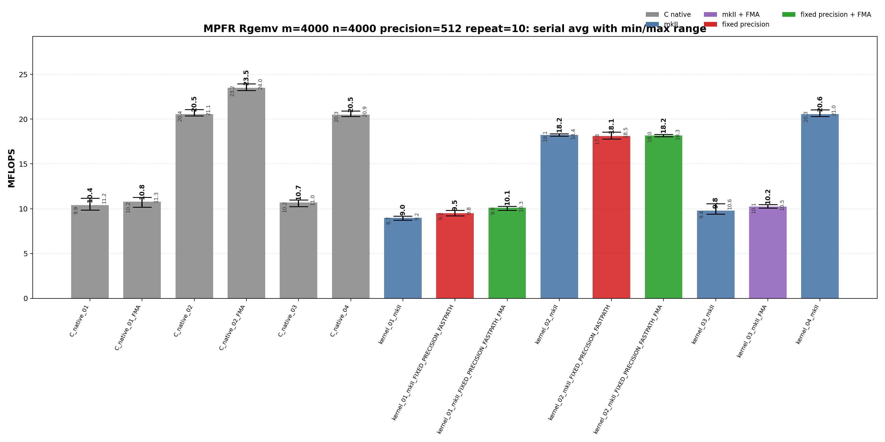
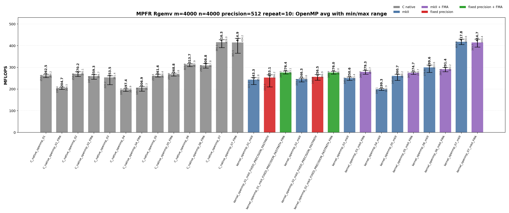

<!-- SPDX-License-Identifier: BSD-2-Clause -->

# 02_Rgemv

## Purpose

This benchmark measures MPFR-backed real matrix-vector multiplication:

```text
y <- alpha * A * x + beta * y
```

The benchmark compares raw MPFR C kernels with `mpfrxx::mpfr_class` wrapper kernels.  It focuses on source-level kernel shape, temporary lifetime, explicit evaluation context, FMA/FMMA call paths, OpenMP work partitioning, and whether wrapper code reaches the same generated hot-loop class as the raw C implementation.

## Build

From the repository root:

```bash
cmake -S . -B build_bench_release -DCMAKE_BUILD_TYPE=Release
cmake --build build_bench_release -j
```

The executables are generated under:

```text
build_bench_release/benchmarks/mpfr/02_Rgemv/
```

Single executable example:

```bash
OMP_NUM_THREADS=32 OMP_PLACES=cores OMP_PROC_BIND=spread \
  build_bench_release/benchmarks/mpfr/02_Rgemv/Rgemv_mpfr_kernel_openmp_07_mkII 4000 4000 512
```

Repeat-run script:

```bash
OMP_NUM_THREADS=32 OMP_PLACES=cores OMP_PROC_BIND=spread \
  benchmarks/mpfr/02_Rgemv/run_repeat.sh build_bench_release 4000 4000 512 10
```

The script runs every target listed in `benchmarks/mpfr/02_Rgemv/run_repeat.sh`, writes raw logs/CSV files, and regenerates plots through `benchmarks/mpfr/02_Rgemv/plot_repeat_summary.py`.

## Benchmark Parameters

| Parameter | Value in committed run | Meaning |
|-----------|------------------------|---------|
| `m` | 4000 | Number of rows of `A` and length of `y`. |
| `n` | 4000 | Number of columns of `A` and length of `x`. |
| `precision` | 512 bits | MPFR precision used for inputs, outputs, and scratch objects. |
| `repeat` | 10 | Each executable was timed 10 times. |
| `MFLOPS` | `2.0 * m * n / elapsed / 1e6` | One multiply and one add are counted per matrix element. |
| OpenMP threads | 32 | `OMP_NUM_THREADS=32`. |
| Affinity | cores/spread | `OMP_PLACES=cores`, `OMP_PROC_BIND=spread`. |
| Correctness | L1 norm check | Every recorded run reported `Result OK`. |

## Variant Shapes

| Variant | Timed source shape | Temporary/resource policy | Purpose |
|---------|--------------------|---------------------------|---------|
| `01` | Row-dot form: for each `i`, accumulate `sum_j A[i+j*lda] * x[j]`, then update `y[i]`. | Reusable row accumulator; wrapper `kernel_01` constructs row `temp` inside the row loop. | Baseline BLAS-like row-dot spelling; stresses strided column-major A access. |
| `01_FMA` | Variant `01` with MPFR FMA in the dot or expression FMA enabled where available. | Same row-dot resource lifetime as `01`. | Check whether FMA alone changes the performance class. |
| `02` | Column-major update: scale `y` by `beta`, then stream columns and update all rows. | Reusable `temp` and `templ` outside the timed inner loop. | Restore contiguous A access and reuse scratch objects. |
| `02_FMA` | Variant `02` with `mpfr_fma` in the row update where available. | Same scratch lifetime as `02`. | Raw C serial FMA comparison for the column-major source shape. |
| `03` | Explicit-context row-dot wrapper, or raw C row-dot with `mpfr_fma` plus final `mpfr_fmma`. | Reusable row accumulator; wrapper creates one explicit `evaluation_context`. | Compare explicit context against raw FMA/FMMA row-dot shape. |
| `04` | Explicit-context column-major wrapper, or raw C column-major reusable-temp baseline. | Reusable `temp` and `templ`; wrapper uses `with_context` for assignments and updates. | Best serial wrapper source shape without OpenMP. |
| `05` | OpenMP row partition with precomputed `alpha * x[j]`. | Precomputed scaled vector plus per-thread reusable product. | Remove repeated alpha*x work while keeping row-wise ownership of `y`. |
| `06` | OpenMP 256-row blocks; column loop and contiguous row loop inside each block. | Per-thread reusable `temp` and `templ`; no shared-y race inside a row block. | Improve locality while preserving simple y ownership. |
| `07` | OpenMP column partition with per-thread partial `y` vectors and final reduction. | `num_threads * m` partial accumulators plus final reduction. | Preserve serial-like column-major A streaming without racing on `y`. |
| `05_FMA`, `06_FMA`, `07_FMA` | FMA versions of the OpenMP 05/06/07 source shapes. | Same ownership and scratch policy as the non-FMA variants. | Check whether fused arithmetic changes the locality-driven OpenMP ranking. |

Serial executables currently cover variants `01`-`04`.  OpenMP executables currently cover variants `01`-`07`.  FMA variants are present only where a source-level FMA/FMMA comparison is meaningful for the implemented source shape.

## C Native Equivalent Kernels

| C native kernel | C++ wrapper kernel equivalent | Equivalence basis |
|-----------------|-------------------------------|-------------------|
| `C_native_01` | `kernel_01_mkII` | Both use row-dot source spelling and a final alpha/beta update. The wrapper expression form adds materialization overhead but keeps the same traversal. |
| `C_native_01_FMA` | `kernel_01_mkII_FIXED_PRECISION_FASTPATH_FMA` | Closest row-dot FMA comparison. The wrapper path also includes fixed-precision expression scratch handling. |
| `C_native_02` | `kernel_02_mkII` | Both scale `y`, then stream columns of `A` with reusable `temp`/`templ`. |
| `C_native_02_FMA` | `kernel_02_mkII_FIXED_PRECISION_FASTPATH_FMA` | Closest column-major FMA comparison. Exact generated code differs because the wrapper uses ET assignment paths. |
| `C_native_03` | `kernel_03_mkII_FMA` | Both test row-dot FMA-style accumulation. Raw C also uses `mpfr_fmma` for the final alpha/beta update. |
| `C_native_04` | `kernel_04_mkII` | Both are column-major reusable-temp baselines; `kernel_04_mkII` adds explicit `evaluation_context`. |
| `C_native_openmp_05` | `kernel_openmp_05_mkII` | Both precompute scaled `x` and partition rows. |
| `C_native_openmp_06` | `kernel_openmp_06_mkII` | Both use 256-row blocks and per-thread reusable scratch. |
| `C_native_openmp_07` | `kernel_openmp_07_mkII` | Both use column partitioning, per-thread partial y vectors, and final reduction. |
| `C_native_openmp_05_FMA`, `06_FMA`, `07_FMA` | `kernel_openmp_05_mkII_FMA`, `06_mkII_FMA`, `07_mkII_FMA` | Same OpenMP ownership pattern plus a fused inner update where the source shape supports it. |

## Recorded Run

| Field | Value |
|-------|-------|
| Run ID | `rgemv_mpfr_m4000_n4000_p512_repeat10_20260518_090054` |
| Date | 2026-05-18 |
| CPU | AMD Ryzen Threadripper 3970X 32-Core Processor |
| OS | Linux 6.8.0-94-generic x86_64 |
| Compiler | `c++ (Ubuntu 15.2.0-16ubuntu1) 15.2.0` |
| Build type | Release |
| CXX flags | `-O3 -DNDEBUG` |
| OpenMP | `OMP_NUM_THREADS=32`, `OMP_PLACES=cores`, `OMP_PROC_BIND=spread` |
| Raw result directory | `benchmarks/mpfr/02_Rgemv/results_raw/rgemv_mpfr_m4000_n4000_p512_repeat10_20260518_090054/` |
| Raw log | `benchmarks/mpfr/02_Rgemv/results_raw/rgemv_mpfr_m4000_n4000_p512_repeat10_20260518_090054/benchmark_rgemv_mpfr_m4000_n4000_p512_repeat10.log` |
| Raw CSV | `benchmarks/mpfr/02_Rgemv/results_raw/rgemv_mpfr_m4000_n4000_p512_repeat10_20260518_090054/raw_rgemv_mpfr_m4000_n4000_p512_repeat10.csv` |
| Summary CSV | `benchmarks/mpfr/02_Rgemv/results_raw/rgemv_mpfr_m4000_n4000_p512_repeat10_20260518_090054/summary_rgemv_mpfr_m4000_n4000_p512_repeat10.csv` |
| Correctness | 430 / 430 runs reported `Result OK`. |

Plot regeneration command:

```bash
python3 benchmarks/mpfr/02_Rgemv/plot_repeat_summary.py \
  benchmarks/mpfr/02_Rgemv/results_raw/rgemv_mpfr_m4000_n4000_p512_repeat10_20260518_090054/benchmark_rgemv_mpfr_m4000_n4000_p512_repeat10.log \
  --output-dir benchmarks/mpfr/02_Rgemv/results_raw/rgemv_mpfr_m4000_n4000_p512_repeat10_20260518_090054 \
  --output-prefix rgemv_mpfr_m4000_n4000_p512_repeat10 \
  --title-prefix "MPFR Rgemv m=4000 n=4000 precision=512 repeat=10"
```





## Resource or Bandwidth Estimates

These are model estimates derived from MFLOPS, not hardware-counter measurements.

For 512-bit MPFR values, the active significand payload is 8 limbs = 64 bytes, and the `mpfr_t` header is 32 bytes on this platform.  The table uses two intentionally simple traffic models:

| Model | Formula | Includes | Excludes |
|-------|---------|----------|----------|
| Active-data GB/s estimate | `Avg MFLOPS * 96 / 1000` | 512-bit limb payload traffic plus amortized vector/accumulator traffic per two counted flops. | Cache reuse details, allocator metadata, OpenMP reduction traffic, and MPFR internal control traffic. |
| Header-inclusive GB/s estimate | `Avg MFLOPS * 192 / 1000` | A conservative doubled model including `mpfr_t` header/pointer movement. | Hardware prefetch effects and actual cache-miss rates. |

| Variant | Avg MFLOPS | Max MFLOPS | Active-data GB/s estimate | Header-inclusive GB/s estimate |
|---------|-----------:|-----------:|--------------------------:|--------------------------------:|
| `kernel_openmp_07_mkII` | 417.819 | 430.553 | 40.11 | 80.22 |
| `C_native_openmp_07` | 416.322 | 427.951 | 39.97 | 79.93 |
| `C_native_openmp_07_FMA` | 414.894 | 434.193 | 39.83 | 79.66 |
| `kernel_openmp_07_mkII_FMA` | 414.740 | 430.394 | 39.82 | 79.63 |
| `C_native_openmp_06` | 313.690 | 317.905 | 30.11 | 60.23 |
| `kernel_openmp_06_mkII` | 299.606 | 310.649 | 28.76 | 57.52 |
| `kernel_openmp_03_mkII_FMA` | 279.314 | 286.726 | 26.81 | 53.63 |
| `kernel_openmp_05_mkII_FMA` | 274.691 | 278.656 | 26.37 | 52.74 |
| `C_native_02_FMA` | 23.491 | 23.951 | 2.26 | 4.51 |
| `kernel_04_mkII` | 20.563 | 21.027 | 1.97 | 3.95 |

The best OpenMP 07 class is about 40 GB/s under the active-data model and about 80 GB/s under the header-inclusive model.  This is consistent with a memory-traffic and layout sensitive kernel rather than a pure wrapper-dispatch problem.

## Serial Results

| Variant | Max MFLOPS | Avg MFLOPS | Min MFLOPS | Interpretation |
|---------|-----------:|-----------:|-----------:|----------------|
| `C_native_01` | 11.182 | 10.408 | 9.867 | Row-dot source shape with reusable temp/prod and final alpha/beta update. Strided column-major A access dominates the inner loop. |
| `C_native_01_FMA` | 11.290 | 10.778 | 10.195 | Same row-dot traversal, but the inner product uses mpfr_fma and the final update remains explicit. FMA helps serially but does not fix A stride locality. |
| `C_native_02` | 21.066 | 20.549 | 20.371 | Column-major update shape: scale y first, then stream A by columns with reusable temp/templ. This restores contiguous A access. |
| `C_native_02_FMA` | 23.951 | 23.491 | 23.182 | Column-major update with mpfr_fma in the y update. This is the best serial result in this run. |
| `C_native_03` | 11.000 | 10.701 | 10.238 | Row-dot shape using mpfr_fma in the dot and mpfr_fmma for alpha*temp+beta*y. FMMA does not overcome strided A traversal. |
| `C_native_04` | 20.905 | 20.497 | 20.300 | Column-major update using direct temp/templ reuse. Same performance class as C_native_02 without FMA. |
| `kernel_01_mkII` | 9.172 | 8.976 | 8.735 | Expression row-dot spelling; temp is constructed per row and expression temporaries remain visible in the hot path. |
| `kernel_01_mkII_FIXED_PRECISION_FASTPATH` | 9.817 | 9.501 | 9.228 | Same source shape as kernel_01, with fixed-precision scratch fastpath. It improves temporary handling but not row-strided A access. |
| `kernel_01_mkII_FIXED_PRECISION_FASTPATH_FMA` | 10.279 | 10.102 | 9.818 | Expression row-dot with fixed precision and FMA enabled. It improves arithmetic call shape, but still stays in the row-dot performance class. |
| `kernel_02_mkII` | 18.365 | 18.245 | 18.110 | Wrapper column-major update with reusable temp and templ. This is the closest wrapper analogue of C_native_02. |
| `kernel_02_mkII_FIXED_PRECISION_FASTPATH` | 18.549 | 18.122 | 17.794 | Same source shape as kernel_02 with fixed-precision scratch assumptions. The hot loop class is unchanged. |
| `kernel_02_mkII_FIXED_PRECISION_FASTPATH_FMA` | 18.301 | 18.176 | 18.046 | Same column-major wrapper source shape with FMA enabled. In this run it is not faster than baseline kernel_02. |
| `kernel_03_mkII` | 10.556 | 9.779 | 9.398 | Explicit-context row-dot. Rounding is carried by context, but the traversal remains row-strided. |
| `kernel_03_mkII_FMA` | 10.459 | 10.236 | 10.082 | Explicit-context row-dot with FMA enabled. Better average than non-FMA kernel_03, still row-dot limited. |
| `kernel_04_mkII` | 21.027 | 20.563 | 20.302 | Explicit-context column-major update with reusable temp/templ. Best serial wrapper result and close to C_native_02/C_native_04. |

<details>
<summary>Serial results sorted by Max MFLOPS</summary>

| Rank | Variant | Max MFLOPS | Avg MFLOPS | Min MFLOPS |
|------|---------|-----------:|-----------:|-----------:|
| 1 | `C_native_02_FMA` | 23.951 | 23.491 | 23.182 |
| 2 | `C_native_02` | 21.066 | 20.549 | 20.371 |
| 3 | `kernel_04_mkII` | 21.027 | 20.563 | 20.302 |
| 4 | `C_native_04` | 20.905 | 20.497 | 20.300 |
| 5 | `kernel_02_mkII_FIXED_PRECISION_FASTPATH` | 18.549 | 18.122 | 17.794 |
| 6 | `kernel_02_mkII` | 18.365 | 18.245 | 18.110 |
| 7 | `kernel_02_mkII_FIXED_PRECISION_FASTPATH_FMA` | 18.301 | 18.176 | 18.046 |
| 8 | `C_native_01_FMA` | 11.290 | 10.778 | 10.195 |
| 9 | `C_native_01` | 11.182 | 10.408 | 9.867 |
| 10 | `C_native_03` | 11.000 | 10.701 | 10.238 |
| 11 | `kernel_03_mkII` | 10.556 | 9.779 | 9.398 |
| 12 | `kernel_03_mkII_FMA` | 10.459 | 10.236 | 10.082 |
| 13 | `kernel_01_mkII_FIXED_PRECISION_FASTPATH_FMA` | 10.279 | 10.102 | 9.818 |
| 14 | `kernel_01_mkII_FIXED_PRECISION_FASTPATH` | 9.817 | 9.501 | 9.228 |
| 15 | `kernel_01_mkII` | 9.172 | 8.976 | 8.735 |

</details>

<details>
<summary>Serial results sorted by Avg MFLOPS</summary>

| Rank | Variant | Max MFLOPS | Avg MFLOPS | Min MFLOPS |
|------|---------|-----------:|-----------:|-----------:|
| 1 | `C_native_02_FMA` | 23.951 | 23.491 | 23.182 |
| 2 | `kernel_04_mkII` | 21.027 | 20.563 | 20.302 |
| 3 | `C_native_02` | 21.066 | 20.549 | 20.371 |
| 4 | `C_native_04` | 20.905 | 20.497 | 20.300 |
| 5 | `kernel_02_mkII` | 18.365 | 18.245 | 18.110 |
| 6 | `kernel_02_mkII_FIXED_PRECISION_FASTPATH_FMA` | 18.301 | 18.176 | 18.046 |
| 7 | `kernel_02_mkII_FIXED_PRECISION_FASTPATH` | 18.549 | 18.122 | 17.794 |
| 8 | `C_native_01_FMA` | 11.290 | 10.778 | 10.195 |
| 9 | `C_native_03` | 11.000 | 10.701 | 10.238 |
| 10 | `C_native_01` | 11.182 | 10.408 | 9.867 |
| 11 | `kernel_03_mkII_FMA` | 10.459 | 10.236 | 10.082 |
| 12 | `kernel_01_mkII_FIXED_PRECISION_FASTPATH_FMA` | 10.279 | 10.102 | 9.818 |
| 13 | `kernel_03_mkII` | 10.556 | 9.779 | 9.398 |
| 14 | `kernel_01_mkII_FIXED_PRECISION_FASTPATH` | 9.817 | 9.501 | 9.228 |
| 15 | `kernel_01_mkII` | 9.172 | 8.976 | 8.735 |

</details>

## OpenMP Results

| Variant | Max MFLOPS | Avg MFLOPS | Min MFLOPS | Interpretation |
|---------|-----------:|-----------:|-----------:|----------------|
| `C_native_openmp_01` | 268.207 | 262.513 | 253.106 | OpenMP row partition of variant 01. Parallelism helps, but each worker still walks A with large stride. |
| `C_native_openmp_01_FMA` | 208.520 | 204.681 | 198.427 | OpenMP row partition with FMA. Lower than non-FMA here, showing FMA alone is not the controlling factor. |
| `C_native_openmp_02` | 280.097 | 270.172 | 257.978 | OpenMP column-major update with synchronization-safe work split. Good locality and reusable scratch. |
| `C_native_openmp_02_FMA` | 266.664 | 259.262 | 245.031 | OpenMP column-major FMA version. Same broad class as 02 but lower average in this run. |
| `C_native_openmp_03` | 261.412 | 253.479 | 220.152 | OpenMP row-dot with mpfr_fma/mpfr_fmma. Still constrained by row-strided A access. |
| `C_native_openmp_04` | 200.888 | 197.351 | 189.296 | OpenMP variant with reusable temp/templ but less favorable parallel work shape than 05-07. |
| `C_native_openmp_04_FMA` | 212.336 | 206.911 | 189.924 | FMA version of 04. It changes the arithmetic call sequence but remains below the locality-improved kernels. |
| `C_native_openmp_05` | 268.393 | 261.622 | 255.432 | Precompute alpha*x and row-partition over y. It reduces repeated scalar work but keeps row-wise traversal over A. |
| `C_native_openmp_05_FMA` | 273.848 | 268.778 | 259.872 | FMA version of 05. It improves the row-partition wrapper/native class, but not enough to reach 06/07 locality. |
| `C_native_openmp_06` | 317.905 | 313.690 | 303.912 | 256-row block OpenMP shape. It keeps A contiguous within row blocks and avoids racing on y. |
| `C_native_openmp_06_FMA` | 317.801 | 308.806 | 296.946 | FMA version of 06. Same locality class as 06; lower average here is likely call-path or run variance. |
| `C_native_openmp_07` | 427.951 | 416.322 | 391.103 | Column partitioning with per-thread partial y vectors and final reduction. Best native average class. |
| `C_native_openmp_07_FMA` | 434.193 | 414.894 | 365.502 | FMA version of 07. It has the best single max, but the average matches the non-FMA 07 class. |
| `kernel_openmp_01_mkII` | 252.833 | 243.282 | 221.247 | OpenMP expression row-dot. Parallelism hides some cost, but source shape is still row-strided. |
| `kernel_openmp_01_mkII_FIXED_PRECISION_FASTPATH` | 266.206 | 253.112 | 210.338 | Same row-dot source with fixed-precision fastpath. Wide min/max spread suggests OpenMP variance. |
| `kernel_openmp_01_mkII_FIXED_PRECISION_FASTPATH_FMA` | 283.075 | 276.424 | 269.519 | Row-dot expression with fixed precision and FMA enabled. FMA improves the arithmetic sequence but not A locality. |
| `kernel_openmp_02_mkII` | 250.611 | 246.253 | 233.346 | OpenMP wrapper column-major update with reusable temporaries. Comparable to the lower column-major class. |
| `kernel_openmp_02_mkII_FIXED_PRECISION_FASTPATH` | 266.947 | 256.518 | 240.800 | Same source shape with fixed precision. It shifts overhead but does not change memory traversal. |
| `kernel_openmp_02_mkII_FIXED_PRECISION_FASTPATH_FMA` | 281.974 | 275.993 | 268.944 | FMA-enabled wrapper 02. It reaches the same class as the best row-partition FMA variants. |
| `kernel_openmp_03_mkII` | 255.405 | 250.561 | 240.228 | Explicit-context OpenMP row-dot. Rounding lookup is controlled, but A traversal remains the limiting source shape. |
| `kernel_openmp_03_mkII_FMA` | 286.726 | 279.314 | 268.694 | Explicit-context row-dot with FMA enabled. It is the fastest row-dot wrapper class in this run. |
| `kernel_openmp_04_mkII` | 202.950 | 199.326 | 194.112 | Explicit-context OpenMP column-major update, but the work split does not scale like 06/07. |
| `kernel_openmp_05_mkII` | 268.217 | 260.722 | 240.400 | Precompute scaled x, then row-partition y. Reusable templ avoids loop-local construction but keeps row-wise A traversal. |
| `kernel_openmp_05_mkII_FMA` | 278.656 | 274.691 | 267.675 | FMA version of 05. It improves average MFLOPS over non-FMA 05 by changing the inner update call sequence. |
| `kernel_openmp_06_mkII` | 310.649 | 299.606 | 276.649 | 256-row block wrapper variant. This is the second OpenMP performance class behind 07. |
| `kernel_openmp_06_mkII_FMA` | 300.214 | 291.418 | 280.069 | FMA version of 06. Same blocked locality class, but lower average than non-FMA in this run. |
| `kernel_openmp_07_mkII` | 430.553 | 417.819 | 404.926 | Column partitioning with per-thread partial y vectors and final reduction. Best OpenMP average overall. |
| `kernel_openmp_07_mkII_FMA` | 430.394 | 414.740 | 393.671 | FMA version of 07. Same top class as non-FMA 07, but not a better average in this run. |

<details>
<summary>OpenMP results sorted by Max MFLOPS</summary>

| Rank | Variant | Max MFLOPS | Avg MFLOPS | Min MFLOPS |
|------|---------|-----------:|-----------:|-----------:|
| 1 | `C_native_openmp_07_FMA` | 434.193 | 414.894 | 365.502 |
| 2 | `kernel_openmp_07_mkII` | 430.553 | 417.819 | 404.926 |
| 3 | `kernel_openmp_07_mkII_FMA` | 430.394 | 414.740 | 393.671 |
| 4 | `C_native_openmp_07` | 427.951 | 416.322 | 391.103 |
| 5 | `C_native_openmp_06` | 317.905 | 313.690 | 303.912 |
| 6 | `C_native_openmp_06_FMA` | 317.801 | 308.806 | 296.946 |
| 7 | `kernel_openmp_06_mkII` | 310.649 | 299.606 | 276.649 |
| 8 | `kernel_openmp_06_mkII_FMA` | 300.214 | 291.418 | 280.069 |
| 9 | `kernel_openmp_03_mkII_FMA` | 286.726 | 279.314 | 268.694 |
| 10 | `kernel_openmp_01_mkII_FIXED_PRECISION_FASTPATH_FMA` | 283.075 | 276.424 | 269.519 |
| 11 | `kernel_openmp_02_mkII_FIXED_PRECISION_FASTPATH_FMA` | 281.974 | 275.993 | 268.944 |
| 12 | `C_native_openmp_02` | 280.097 | 270.172 | 257.978 |
| 13 | `kernel_openmp_05_mkII_FMA` | 278.656 | 274.691 | 267.675 |
| 14 | `C_native_openmp_05_FMA` | 273.848 | 268.778 | 259.872 |
| 15 | `C_native_openmp_05` | 268.393 | 261.622 | 255.432 |
| 16 | `kernel_openmp_05_mkII` | 268.217 | 260.722 | 240.400 |
| 17 | `C_native_openmp_01` | 268.207 | 262.513 | 253.106 |
| 18 | `kernel_openmp_02_mkII_FIXED_PRECISION_FASTPATH` | 266.947 | 256.518 | 240.800 |
| 19 | `C_native_openmp_02_FMA` | 266.664 | 259.262 | 245.031 |
| 20 | `kernel_openmp_01_mkII_FIXED_PRECISION_FASTPATH` | 266.206 | 253.112 | 210.338 |
| 21 | `C_native_openmp_03` | 261.412 | 253.479 | 220.152 |
| 22 | `kernel_openmp_03_mkII` | 255.405 | 250.561 | 240.228 |
| 23 | `kernel_openmp_01_mkII` | 252.833 | 243.282 | 221.247 |
| 24 | `kernel_openmp_02_mkII` | 250.611 | 246.253 | 233.346 |
| 25 | `C_native_openmp_04_FMA` | 212.336 | 206.911 | 189.924 |
| 26 | `C_native_openmp_01_FMA` | 208.520 | 204.681 | 198.427 |
| 27 | `kernel_openmp_04_mkII` | 202.950 | 199.326 | 194.112 |
| 28 | `C_native_openmp_04` | 200.888 | 197.351 | 189.296 |

</details>

<details>
<summary>OpenMP results sorted by Avg MFLOPS</summary>

| Rank | Variant | Max MFLOPS | Avg MFLOPS | Min MFLOPS |
|------|---------|-----------:|-----------:|-----------:|
| 1 | `kernel_openmp_07_mkII` | 430.553 | 417.819 | 404.926 |
| 2 | `C_native_openmp_07` | 427.951 | 416.322 | 391.103 |
| 3 | `C_native_openmp_07_FMA` | 434.193 | 414.894 | 365.502 |
| 4 | `kernel_openmp_07_mkII_FMA` | 430.394 | 414.740 | 393.671 |
| 5 | `C_native_openmp_06` | 317.905 | 313.690 | 303.912 |
| 6 | `C_native_openmp_06_FMA` | 317.801 | 308.806 | 296.946 |
| 7 | `kernel_openmp_06_mkII` | 310.649 | 299.606 | 276.649 |
| 8 | `kernel_openmp_06_mkII_FMA` | 300.214 | 291.418 | 280.069 |
| 9 | `kernel_openmp_03_mkII_FMA` | 286.726 | 279.314 | 268.694 |
| 10 | `kernel_openmp_01_mkII_FIXED_PRECISION_FASTPATH_FMA` | 283.075 | 276.424 | 269.519 |
| 11 | `kernel_openmp_02_mkII_FIXED_PRECISION_FASTPATH_FMA` | 281.974 | 275.993 | 268.944 |
| 12 | `kernel_openmp_05_mkII_FMA` | 278.656 | 274.691 | 267.675 |
| 13 | `C_native_openmp_02` | 280.097 | 270.172 | 257.978 |
| 14 | `C_native_openmp_05_FMA` | 273.848 | 268.778 | 259.872 |
| 15 | `C_native_openmp_01` | 268.207 | 262.513 | 253.106 |
| 16 | `C_native_openmp_05` | 268.393 | 261.622 | 255.432 |
| 17 | `kernel_openmp_05_mkII` | 268.217 | 260.722 | 240.400 |
| 18 | `C_native_openmp_02_FMA` | 266.664 | 259.262 | 245.031 |
| 19 | `kernel_openmp_02_mkII_FIXED_PRECISION_FASTPATH` | 266.947 | 256.518 | 240.800 |
| 20 | `C_native_openmp_03` | 261.412 | 253.479 | 220.152 |
| 21 | `kernel_openmp_01_mkII_FIXED_PRECISION_FASTPATH` | 266.206 | 253.112 | 210.338 |
| 22 | `kernel_openmp_03_mkII` | 255.405 | 250.561 | 240.228 |
| 23 | `kernel_openmp_02_mkII` | 250.611 | 246.253 | 233.346 |
| 24 | `kernel_openmp_01_mkII` | 252.833 | 243.282 | 221.247 |
| 25 | `C_native_openmp_04_FMA` | 212.336 | 206.911 | 189.924 |
| 26 | `C_native_openmp_01_FMA` | 208.520 | 204.681 | 198.427 |
| 27 | `kernel_openmp_04_mkII` | 202.950 | 199.326 | 194.112 |
| 28 | `C_native_openmp_04` | 200.888 | 197.351 | 189.296 |

</details>

## Hotpath Disassembly

Disassembly command used for representative kernels:

```bash
objdump -Cd --no-show-raw-insn build_bench_release/benchmarks/mpfr/02_Rgemv/<executable>
```

Addresses are build-specific.  The important information is the backend call sequence, temporary lifetime, OpenMP work split, and whether `mpfr_init2`/`mpfr_clear` are inside the per-element hot loop.

### `Rgemv_mpfr_C_native_02_FMA`

Source file: `benchmarks/mpfr/02_Rgemv/Rgemv_mpfr_C_native_02_FMA.cpp`.

```asm
2a58: call   mpfr_get_default_rounding_mode@plt
2a65: call   mpfr_init2@plt              # reusable temp outside the j/i update loop
...
2a80: call   mpfr_mul@plt                # y[i] *= beta
...
2aef: call   mpfr_mul@plt                # temp = alpha * x[j]
...
2b20: mov    %r15,%rcx                   # y[i] addend
2b23: mov    %r13,%rdx                   # A[i+j*lda]
2b26: mov    %r15,%rdi                   # y[i] destination
2b2c: mov    %rbx,%rsi                   # temp
2b3b: call   mpfr_fma@plt                # y[i] += temp * A[i+j*lda]
2b43: jne    2b20
2b6c: call   mpfr_clear@plt
```

This is the best serial kernel.  The hot loop has one `mpfr_fma` per matrix element and no `mpfr_init2`/`mpfr_clear` inside the per-element loop.  The source shape streams `A` contiguously by columns.

### `Rgemv_mpfr_kernel_04_mkII`

Source file: `benchmarks/mpfr/02_Rgemv/Rgemv_mpfr_kernel_04.cpp`.

```asm
2cd7: call   mpfr_get_default_rounding_mode@plt
...
2d2d: call   mpfr_init2@plt              # temp
2d53: call   mpfr_init2@plt              # templ
...
2dd6: call   mpfr_mul@plt                # temp = alpha * x[j]
...
2e20: call   mpfr_mul@plt                # templ = temp * A[i+j*lda]
2e3a: call   mpfr_add@plt                # y[i] += templ
2e4f: jne    2e00
...
2e7a: call   mpfr_clear@plt
2e84: call   mpfr_clear@plt
```

This wrapper kernel is the best serial wrapper result.  It has the same column-major reusable-temp performance class as raw C `C_native_02`/`C_native_04`; the remaining gap to `C_native_02_FMA` is mostly the lack of a fused per-element update in this source shape.

### `Rgemv_mpfr_C_native_openmp_07_FMA`

Source file: `benchmarks/mpfr/02_Rgemv/Rgemv_mpfr_C_native_openmp_07_FMA.cpp`.

```asm
2b21: call   omp_get_thread_num@plt
2b3d: call   omp_get_num_threads@plt
...
2bab: call   mpfr_mul@plt                # y partition: y[i] *= beta
2bc2: call   GOMP_barrier@plt
...
2c06: call   mpfr_init2@plt              # per-thread temp
...
2c7f: call   mpfr_mul@plt                # temp = alpha * x[j]
...
2ccb: call   mpfr_fma@plt                # local_y[i] += temp * A[i+j*lda]
2cd3: jne    2cb0
2cfb: call   GOMP_barrier@plt
...
2d5b: call   mpfr_add@plt                # final reduction into y
2d85: call   GOMP_barrier@plt
2d8d: call   mpfr_clear@plt
```

This kernel has the best single max MFLOPS.  The inner update is fused, and the final reduction is outside the per-column hot loop.  The average is essentially tied with non-FMA 07, so the dominant optimization is the column partition plus partial-y layout, not FMA alone.

### `Rgemv_mpfr_kernel_openmp_07_mkII`

Source file: `benchmarks/mpfr/02_Rgemv/Rgemv_mpfr_kernel_openmp_07.cpp`.

```asm
2ece: call   omp_get_thread_num@plt
2ee2: call   omp_get_num_threads@plt
...
2f67: call   mpfr_mul@plt                # y[i] *= beta
2f99: call   GOMP_barrier@plt
...
2ff1: call   mpfr_init2@plt              # per-thread temp
301b: call   mpfr_init2@plt              # per-thread templ
...
30e1: call   mpfr_mul@plt                # temp = alpha * x[j]
...
311e: call   mpfr_mul@plt                # templ = temp * A[i+j*lda]
3143: call   mpfr_add@plt                # local_y[i] += templ
3155: jne    3110
3186: call   GOMP_barrier@plt
...
320b: call   mpfr_add@plt                # final reduction into y
3238: call   mpfr_clear@plt
3242: call   mpfr_clear@plt
```

This is the best OpenMP average overall.  It does not use FMA, but it has the right parallel shape: each thread owns a partial y vector while streaming columns, and the reduction happens after the main matrix pass.  The wrapper overhead is outside the per-element hot loop.

### `Rgemv_mpfr_kernel_openmp_05_mkII_FMA`

Source file: `benchmarks/mpfr/02_Rgemv/Rgemv_mpfr_kernel_openmp_05_FMA.cpp`.

```asm
2ce0: call   mpfr_mul@plt                # scaled_x[j] = alpha * x[j]
2cea: call   GOMP_barrier@plt
...
2d76: call   mpfr_mul@plt                # y[i] *= beta
...
2dc2: call   mpfr_fma@plt                # y[i] += scaled_x[j] * A[i+j*lda]
2dca: jne    2da0
2df4: jmp    GOMP_barrier@plt
```

FMA improves variant 05, but the row-partition source shape still walks `A` row-wise through column-major storage.  That is why it remains below 06/07 even though the arithmetic call sequence is fused.

## Lessons Learned

The main performance boundary is the Rgemv source shape, not wrapper syntax.  Serial column-major update variants (`C_native_02`, `C_native_04`, `kernel_04_mkII`) are in a different class from row-dot variants because they stream `A` contiguously.

FMA is useful but secondary.  `C_native_02_FMA` is the best serial result, and `kernel_openmp_05_mkII_FMA` improves over non-FMA 05.  However, OpenMP 07 without FMA has the best average, and FMA 07 is statistically the same class.  Locality and ownership dominate the final ranking.

The best OpenMP design in this run is column partitioning with per-thread partial y vectors and a final reduction.  It preserves a serial-like column-major A stream while avoiding shared-y races during the matrix pass.  The cost is `num_threads * m` MPFR partial accumulators and a reduction pass, but at `m=n=4000` that cost is amortized.

The 256-row block design is the second useful class.  It is simpler than partial-y reduction and avoids races by assigning row blocks, but it does not exploit the same column-partition locality over the whole matrix.

Explicit context matters for wrapper clarity and call-path control, but it does not compensate for an unfavorable memory traversal.  `kernel_04_mkII` shows that explicit-context wrapper code can reach the raw reusable-temp serial class when the source shape is aligned with the backend access pattern.

Future work should prioritize packed or layout-aware MPFR storage and better column-partition reduction strategies before adding more arithmetic-call variants.  The current run already shows that adding FMA to a locality-limited variant does not move it into the top class.
