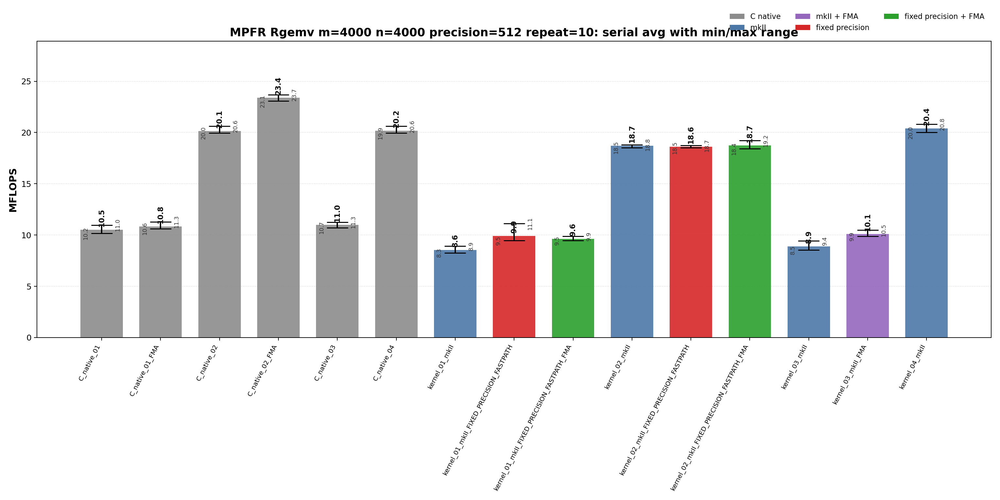
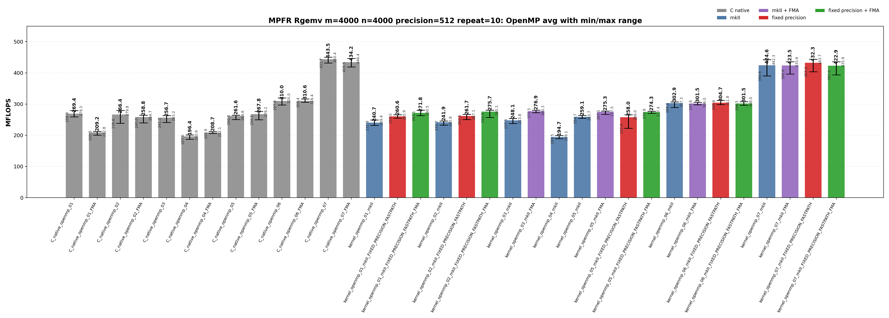
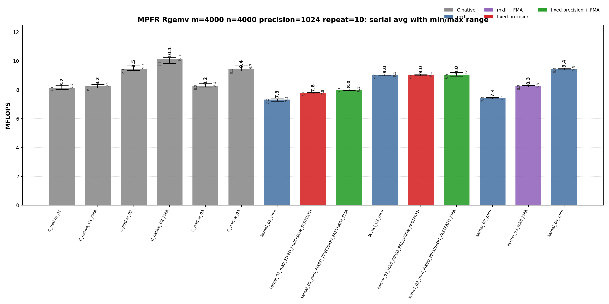
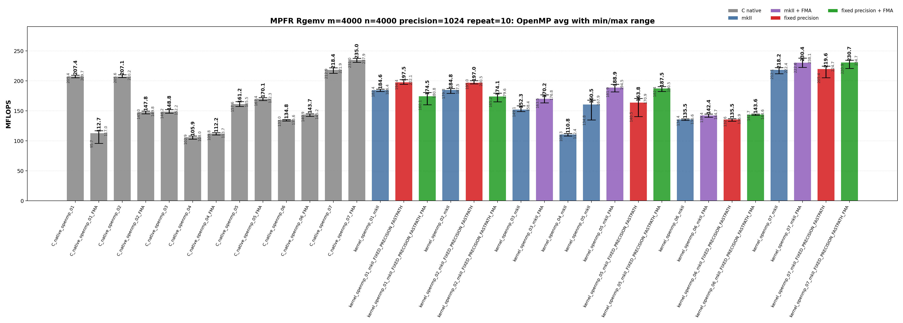

<!-- SPDX-License-Identifier: BSD-2-Clause -->

# 02_Rgemv

This directory benchmarks the MPFR real dense matrix-vector product

```text
y <- alpha * A * x + beta * y
```

with raw MPFR C kernels and `mpfrxx::mpfr_class` wrapper kernels. The
performance question is whether wrapper source shapes can reach the same
hot-loop class as raw MPFR C when rounding, fixed precision, FMA, and OpenMP
partitioning are controlled.

## Build

From the repository root:

```bash
cmake -S . -B build_bench_release -DCMAKE_BUILD_TYPE=Release
cmake --build build_bench_release -j
```

Executables are created under:

```text
build_bench_release/benchmarks/mpfr/02_Rgemv/
```

Each executable takes `<rows m> <cols n> <precision>`. Example:

```bash
build_bench_release/benchmarks/mpfr/02_Rgemv/Rgemv_mpfr_kernel_04_mkII 4000 4000 512
```

The repeat-10 run used:

```bash
OMP_NUM_THREADS=32 OMP_PLACES=cores OMP_PROC_BIND=spread \
    benchmarks/mpfr/02_Rgemv/run_repeat.sh build_bench_release 4000 4000 512 10
```

The mkII optimization variants use canonical build options such as
`GMPFRXX_MKII_FAST_FIXED_PREC` and `GMPFRXX_MKII_ENABLE_FMA`; executable
suffixes keep historical labels such as `FIXED_PRECISION_FASTPATH` for
benchmark continuity.

## Kernel Shapes

The timed body is `_Rgemv()`. `A` is stored in column-major order. Serial
variants cover row-dot and column-major source shapes. OpenMP variants cover
row partitioning, precomputed scaling, row blocking, and column partitioning
with per-thread partial `y` vectors.

| Variant | Timed source shape | Temporary/resource policy | Purpose |
|---------|--------------------|---------------------------|---------|
| `01` | Row-dot form: for each `i`, accumulate `sum_j A[i+j*lda] * x[j]`, then update `y[i]`. | Reusable row accumulator; wrapper expression forms still materialize expression temporaries. | Baseline row-dot spelling; stresses strided column-major `A` access. |
| `01_FMA` | Variant `01` with MPFR FMA where a fused source shape is available. | Same ownership and scratch lifetime as `01`. | Check whether FMA alone changes the row-dot performance class. |
| `02` | Column-major update: scale `y` by `beta`, then stream columns and update all rows. | Reusable `temp` and `templ` outside the inner loop. | Restore contiguous `A` access and reuse scratch objects. |
| `02_FMA` | Variant `02` with `mpfr_fma` in the row update where available. | Same scratch lifetime as `02`. | Raw C serial FMA comparison for the column-major source shape. |
| `03` | Explicit-context row-dot wrapper, or raw C row-dot with `mpfr_fma` plus final `mpfr_fmma`. | Reusable row accumulator; wrapper creates one explicit `evaluation_context`. | Compare explicit context against raw FMA/FMMA row-dot shape. |
| `04` | Explicit-context column-major wrapper, or raw C column-major reusable-temp baseline. | Reusable `temp` and `templ`; wrapper uses `with_context` for assignments and updates. | Best serial wrapper source shape without OpenMP. |
| `05` | OpenMP row partition with precomputed `alpha * x[j]`. | Precomputed scaled vector plus per-thread reusable product. | Remove repeated alpha*x work while keeping row-wise ownership of `y`. |
| `06` | OpenMP 256-row blocks; column loop and contiguous row loop inside each block. | Per-thread reusable scratch; no shared-y race inside a row block. | Improve locality while preserving simple y ownership. |
| `07` | OpenMP column partition with per-thread partial `y` vectors and final reduction. | `num_threads * m` partial accumulators plus final reduction. | Preserve serial-like column-major `A` streaming without racing on `y`. |
| `05_FMA`, `06_FMA`, `07_FMA` | FMA versions of the OpenMP 05/06/07 source shapes. | Same ownership and scratch policy as the non-FMA variants. | Check whether fused arithmetic changes the locality-driven OpenMP ranking. |

Serial executables cover variants `01`-`04`. OpenMP executables cover variants
`01`-`07`.

## C Native Equivalent Kernels

The mapping is based on the timed `_Rgemv()` source shape and generated hot
loop, not just on matching numeric suffixes.

| C native kernel | C++ wrapper kernel equivalent | Equivalence basis |
|-----------------|-------------------------------|-------------------|
| `C_native_01` | `kernel_01_mkII` | Both use row-dot source spelling and a final alpha/beta update. |
| `C_native_01_FMA` | `kernel_01_mkII_FIXED_PRECISION_FASTPATH_FMA` | Closest row-dot FMA comparison; the wrapper also includes fixed-precision expression scratch handling. |
| `C_native_02` | `kernel_02_mkII` | Both scale `y`, then stream columns of `A` with reusable `temp`/`templ`. |
| `C_native_02_FMA` | `kernel_02_mkII_FIXED_PRECISION_FASTPATH_FMA` | Closest column-major FMA comparison. Exact generated code differs because the wrapper uses expression assignment paths. |
| `C_native_03` | `kernel_03_mkII_FMA` | Both test row-dot FMA-style accumulation. Raw C also uses `mpfr_fmma` for the final alpha/beta update. |
| `C_native_04` | `kernel_04_mkII` | Both are column-major reusable-temp baselines; `kernel_04_mkII` adds explicit `evaluation_context`. |
| `C_native_openmp_05` | `kernel_openmp_05_mkII` | Both precompute scaled `x` and partition rows. |
| `C_native_openmp_06` | `kernel_openmp_06_mkII` | Both use 256-row blocks and per-thread reusable scratch. |
| `C_native_openmp_07` | `kernel_openmp_07_mkII` | Both use column partitioning, per-thread partial y vectors, and final reduction. |
| `C_native_openmp_07_FMA` | `kernel_openmp_07_mkII_FIXED_PRECISION_FASTPATH_FMA` | Closest current FMA hot-loop comparison: both use one `mpfr_mul` per column and one row update per matrix element inside the OpenMP worker loop. |

## Recorded Run

| Field | Value |
|-------|-------|
| Run ID | `rgemv_mpfr_m4000_n4000_p512_repeat10_20260523_173328` |
| Date | 2026-05-23 |
| CPU | AMD Ryzen Threadripper 3970X 32-Core Processor |
| OS | Linux 6.8.0-94-generic x86_64 |
| Compiler | `c++ (Ubuntu 15.2.0-16ubuntu1) 15.2.0` |
| Build type | Release |
| Problem size | `m=4000`, `n=4000` |
| Precision | 512 bits |
| Repeat count | 10 |
| OpenMP | `OMP_NUM_THREADS=32`, `OMP_PLACES=cores`, `OMP_PROC_BIND=spread` |
| Raw result directory | `benchmarks/mpfr/02_Rgemv/results_raw/rgemv_mpfr_m4000_n4000_p512_repeat10_20260523_173328/` |
| Raw log | `benchmarks/mpfr/02_Rgemv/results_raw/rgemv_mpfr_m4000_n4000_p512_repeat10_20260523_173328/benchmark_rgemv_mpfr_m4000_n4000_p512_repeat10.log` |
| Raw CSV | `benchmarks/mpfr/02_Rgemv/results_raw/rgemv_mpfr_m4000_n4000_p512_repeat10_20260523_173328/raw_rgemv_mpfr_m4000_n4000_p512_repeat10.csv` |
| Summary CSV | `benchmarks/mpfr/02_Rgemv/results_raw/rgemv_mpfr_m4000_n4000_p512_repeat10_20260523_173328/summary_rgemv_mpfr_m4000_n4000_p512_repeat10.csv` |
| Correctness | 490 / 490 runs reported `Result OK`. |





Plot regeneration command:

```bash
python3 benchmarks/mpfr/02_Rgemv/plot_repeat_summary.py \
    benchmarks/mpfr/02_Rgemv/results_raw/rgemv_mpfr_m4000_n4000_p512_repeat10_20260523_173328/benchmark_rgemv_mpfr_m4000_n4000_p512_repeat10.log \
    --output-dir benchmarks/mpfr/02_Rgemv/results_raw/rgemv_mpfr_m4000_n4000_p512_repeat10_20260523_173328 \
    --output-prefix rgemv_mpfr_m4000_n4000_p512_repeat10 \
    --title-prefix "MPFR Rgemv m=4000 n=4000 precision=512 repeat=10"
```

<!-- BEGIN 1024-BIT RECORDED RUN -->

### 1024-bit run

The 1024-bit addendum uses the same release build, CPU affinity, input shape,
and repeat count as the 512-bit run, with only the precision changed.

| Field | Value |
|-------|-------|
| Run ID | `rgemv_mpfr_m4000_n4000_p1024_repeat10_20260524_065200` |
| Date | 2026-05-24 |
| Problem size | `m=4000`, `n=4000` |
| Precision | 1024 bits |
| Repeat count | 10 |
| OpenMP | `OMP_NUM_THREADS=32`, `OMP_PLACES=cores`, `OMP_PROC_BIND=spread` |
| Benchmark command | `OMP_NUM_THREADS=32 OMP_PLACES=cores OMP_PROC_BIND=spread benchmarks/mpfr/02_Rgemv/run_repeat.sh build_bench_release 4000 4000 1024 10` |
| Raw result directory | `benchmarks/mpfr/02_Rgemv/results_raw/rgemv_mpfr_m4000_n4000_p1024_repeat10_20260524_065200/` |
| Raw log | `benchmarks/mpfr/02_Rgemv/results_raw/rgemv_mpfr_m4000_n4000_p1024_repeat10_20260524_065200/benchmark_rgemv_mpfr_m4000_n4000_p1024_repeat10.log` |
| Raw CSV | `benchmarks/mpfr/02_Rgemv/results_raw/rgemv_mpfr_m4000_n4000_p1024_repeat10_20260524_065200/raw_rgemv_mpfr_m4000_n4000_p1024_repeat10.csv` |
| Summary CSV | `benchmarks/mpfr/02_Rgemv/results_raw/rgemv_mpfr_m4000_n4000_p1024_repeat10_20260524_065200/summary_rgemv_mpfr_m4000_n4000_p1024_repeat10.csv` |
| Correctness | 490 / 490 runs reported `Result OK`. |





Plot regeneration command:

```bash
python3 benchmarks/mpfr/02_Rgemv/plot_repeat_summary.py \
    benchmarks/mpfr/02_Rgemv/results_raw/rgemv_mpfr_m4000_n4000_p1024_repeat10_20260524_065200/benchmark_rgemv_mpfr_m4000_n4000_p1024_repeat10.log \
    --output-dir benchmarks/mpfr/02_Rgemv/results_raw/rgemv_mpfr_m4000_n4000_p1024_repeat10_20260524_065200 \
    --output-prefix rgemv_mpfr_m4000_n4000_p1024_repeat10 \
    --title-prefix "MPFR Rgemv m=4000 n=4000 precision=1024 repeat=10"
```

<!-- END 1024-BIT RECORDED RUN -->

## Headline Results

| Observation | Evidence | Interpretation |
|-------------|----------|----------------|
| Best serial average | `C_native_02_FMA` at 23.399 MFLOPS avg, 23.694 max | Column-major traversal plus raw `mpfr_fma` is the fastest serial source shape in this run. |
| Best wrapper serial average | `kernel_04_mkII` at 20.405 MFLOPS avg | Explicit-context column-major reusable temporaries reach the raw C non-FMA class. |
| Best OpenMP average | `C_native_openmp_07` at 443.477 MFLOPS avg, 450.387 max | Column partitioning with per-thread partial y vectors is again the dominant OpenMP class. |
| Best wrapper OpenMP average | `kernel_openmp_07_mkII_FIXED_PRECISION_FASTPATH` at 432.347 MFLOPS avg | The wrapper 07 fixed-precision path remains close to the raw C 07 class; FMA is not automatically best for this OpenMP run. |
| FMA effect is source-shape dependent | Serial `C_native_02_FMA` 23.399 avg vs `C_native_02` 20.138 avg; OpenMP `C_native_openmp_07_FMA` 434.211 avg vs `C_native_openmp_07` 443.477 avg | FMA improves the serial column-major raw C path, but OpenMP locality and variance dominate the 07 class. |

<!-- BEGIN 1024-BIT HEADLINE RESULTS -->

### 1024-bit headline results

| Observation | Evidence | Interpretation |
|-------------|----------|----------------|
| Best serial average | `C_native_02_FMA` at 10.135 MFLOPS avg, 10.239 max | The raw C column-major FMA path is the best serial class. |
| Best wrapper serial average | `kernel_04_mkII` at 9.446 avg, 9.505 max | The explicit-context reusable temporary wrapper path is close to the non-FMA raw column-major class. |
| Best OpenMP average | `C_native_openmp_07_FMA` at 235.044 MFLOPS avg, 237.861 max | Column partitioning with FMA is the top MPFR OpenMP class at 1024 bits. |
| Best wrapper OpenMP average | `kernel_openmp_07_mkII_FIXED_PRECISION_FASTPATH_FMA` at 230.708 avg, 234.710 max | The wrapper fixed-precision/FMA 07 class is close to the raw C 07_FMA class. |
| 512 -> 1024 scaling | best OpenMP average changes from 443.477 to 235.044 MFLOPS | The best MPFR Rgemv OpenMP class falls to about half of the 512-bit throughput. |

<!-- END 1024-BIT HEADLINE RESULTS -->

## Serial Results

<details>
<summary>Serial results sorted by Max MFLOPS</summary>

| Rank | Variant | Max MFLOPS | Avg MFLOPS | Min MFLOPS |
|------|---------|------------|------------|------------|
| 1 | `C_native_02_FMA` | 23.694 | 23.399 | 23.069 |
| 2 | `kernel_04_mkII` | 20.827 | 20.405 | 20.001 |
| 3 | `C_native_02` | 20.622 | 20.138 | 19.953 |
| 4 | `C_native_04` | 20.619 | 20.165 | 19.944 |
| 5 | `kernel_02_mkII_FIXED_PRECISION_FASTPATH_FMA` | 19.213 | 18.737 | 18.420 |
| 6 | `kernel_02_mkII` | 18.817 | 18.698 | 18.523 |
| 7 | `kernel_02_mkII_FIXED_PRECISION_FASTPATH` | 18.728 | 18.617 | 18.512 |
| 8 | `C_native_01_FMA` | 11.291 | 10.850 | 10.621 |
| 9 | `C_native_03` | 11.265 | 10.983 | 10.709 |
| 10 | `kernel_01_mkII_FIXED_PRECISION_FASTPATH` | 11.110 | 9.913 | 9.473 |
| 11 | `C_native_01` | 10.970 | 10.528 | 10.151 |
| 12 | `kernel_03_mkII_FMA` | 10.471 | 10.112 | 9.883 |
| 13 | `kernel_01_mkII_FIXED_PRECISION_FASTPATH_FMA` | 9.882 | 9.637 | 9.475 |
| 14 | `kernel_03_mkII` | 9.424 | 8.893 | 8.535 |
| 15 | `kernel_01_mkII` | 8.911 | 8.552 | 8.266 |

</details>

<details>
<summary>Serial results sorted by Avg MFLOPS</summary>

| Rank | Variant | Max MFLOPS | Avg MFLOPS | Min MFLOPS |
|------|---------|------------|------------|------------|
| 1 | `C_native_02_FMA` | 23.694 | 23.399 | 23.069 |
| 2 | `kernel_04_mkII` | 20.827 | 20.405 | 20.001 |
| 3 | `C_native_04` | 20.619 | 20.165 | 19.944 |
| 4 | `C_native_02` | 20.622 | 20.138 | 19.953 |
| 5 | `kernel_02_mkII_FIXED_PRECISION_FASTPATH_FMA` | 19.213 | 18.737 | 18.420 |
| 6 | `kernel_02_mkII` | 18.817 | 18.698 | 18.523 |
| 7 | `kernel_02_mkII_FIXED_PRECISION_FASTPATH` | 18.728 | 18.617 | 18.512 |
| 8 | `C_native_03` | 11.265 | 10.983 | 10.709 |
| 9 | `C_native_01_FMA` | 11.291 | 10.850 | 10.621 |
| 10 | `C_native_01` | 10.970 | 10.528 | 10.151 |
| 11 | `kernel_03_mkII_FMA` | 10.471 | 10.112 | 9.883 |
| 12 | `kernel_01_mkII_FIXED_PRECISION_FASTPATH` | 11.110 | 9.913 | 9.473 |
| 13 | `kernel_01_mkII_FIXED_PRECISION_FASTPATH_FMA` | 9.882 | 9.637 | 9.475 |
| 14 | `kernel_03_mkII` | 9.424 | 8.893 | 8.535 |
| 15 | `kernel_01_mkII` | 8.911 | 8.552 | 8.266 |

</details>

<!-- BEGIN 1024-BIT SERIAL RESULTS -->

### 1024-bit serial results

<details>
<summary>1024-bit serial results sorted by Max MFLOPS</summary>

| Rank | Variant | Max MFLOPS | Avg MFLOPS | Min MFLOPS |
|------|---------|-----------:|-----------:|-----------:|
| 1 | `C_native_02_FMA` | 10.239 | 10.135 | 9.835 |
| 2 | `C_native_04` | 9.664 | 9.428 | 9.317 |
| 3 | `C_native_02` | 9.664 | 9.453 | 9.342 |
| 4 | `kernel_04_mkII` | 9.505 | 9.446 | 9.389 |
| 5 | `kernel_02_mkII_FIXED_PRECISION_FASTPATH_FMA` | 9.218 | 9.021 | 8.947 |
| 6 | `kernel_02_mkII` | 9.101 | 9.037 | 8.978 |
| 7 | `kernel_02_mkII_FIXED_PRECISION_FASTPATH` | 9.085 | 9.020 | 8.981 |
| 8 | `C_native_03` | 8.428 | 8.247 | 8.191 |
| 9 | `C_native_01_FMA` | 8.385 | 8.244 | 8.136 |
| 10 | `kernel_03_mkII_FMA` | 8.311 | 8.251 | 8.210 |

</details>

<details>
<summary>1024-bit serial results sorted by Avg MFLOPS</summary>

| Rank | Variant | Max MFLOPS | Avg MFLOPS | Min MFLOPS |
|------|---------|-----------:|-----------:|-----------:|
| 1 | `C_native_02_FMA` | 10.239 | 10.135 | 9.835 |
| 2 | `C_native_02` | 9.664 | 9.453 | 9.342 |
| 3 | `kernel_04_mkII` | 9.505 | 9.446 | 9.389 |
| 4 | `C_native_04` | 9.664 | 9.428 | 9.317 |
| 5 | `kernel_02_mkII` | 9.101 | 9.037 | 8.978 |
| 6 | `kernel_02_mkII_FIXED_PRECISION_FASTPATH_FMA` | 9.218 | 9.021 | 8.947 |
| 7 | `kernel_02_mkII_FIXED_PRECISION_FASTPATH` | 9.085 | 9.020 | 8.981 |
| 8 | `kernel_03_mkII_FMA` | 8.311 | 8.251 | 8.210 |
| 9 | `C_native_03` | 8.428 | 8.247 | 8.191 |
| 10 | `C_native_01_FMA` | 8.385 | 8.244 | 8.136 |

</details>

<!-- END 1024-BIT SERIAL RESULTS -->

## OpenMP Results

<details>
<summary>OpenMP results sorted by Max MFLOPS</summary>

| Rank | Variant | Max MFLOPS | Avg MFLOPS | Min MFLOPS |
|------|---------|------------|------------|------------|
| 1 | `C_native_openmp_07` | 450.387 | 443.477 | 431.698 |
| 2 | `C_native_openmp_07_FMA` | 446.434 | 434.211 | 419.320 |
| 3 | `kernel_openmp_07_mkII_FIXED_PRECISION_FASTPATH` | 443.717 | 432.347 | 403.404 |
| 4 | `kernel_openmp_07_mkII` | 442.255 | 424.578 | 390.647 |
| 5 | `kernel_openmp_07_mkII_FIXED_PRECISION_FASTPATH_FMA` | 435.915 | 422.903 | 393.619 |
| 6 | `kernel_openmp_07_mkII_FMA` | 435.591 | 423.481 | 396.605 |
| 7 | `C_native_openmp_06` | 319.980 | 309.978 | 297.026 |
| 8 | `C_native_openmp_06_FMA` | 316.450 | 310.560 | 305.449 |
| 9 | `kernel_openmp_06_mkII_FIXED_PRECISION_FASTPATH` | 311.849 | 304.658 | 298.643 |
| 10 | `kernel_openmp_06_mkII_FIXED_PRECISION_FASTPATH_FMA` | 308.033 | 301.513 | 296.455 |
| 11 | `kernel_openmp_06_mkII` | 307.267 | 302.946 | 289.235 |
| 12 | `kernel_openmp_06_mkII_FMA` | 306.001 | 301.495 | 297.622 |
| 13 | `kernel_openmp_01_mkII_FIXED_PRECISION_FASTPATH_FMA` | 280.481 | 271.844 | 263.117 |
| 14 | `kernel_openmp_02_mkII_FIXED_PRECISION_FASTPATH_FMA` | 280.332 | 275.665 | 256.853 |
| 15 | `kernel_openmp_03_mkII_FMA` | 280.251 | 276.867 | 272.540 |
| 16 | `C_native_openmp_02` | 279.824 | 266.356 | 238.561 |
| 17 | `C_native_openmp_01` | 279.283 | 269.360 | 258.861 |
| 18 | `kernel_openmp_05_mkII_FMA` | 277.508 | 275.289 | 267.102 |
| 19 | `kernel_openmp_05_mkII_FIXED_PRECISION_FASTPATH_FMA` | 277.387 | 274.280 | 270.791 |
| 20 | `C_native_openmp_05_FMA` | 276.183 | 267.790 | 250.078 |
| 21 | `kernel_openmp_02_mkII_FIXED_PRECISION_FASTPATH` | 267.119 | 261.653 | 250.506 |
| 22 | `kernel_openmp_05_mkII_FIXED_PRECISION_FASTPATH` | 265.960 | 258.000 | 222.574 |
| 23 | `kernel_openmp_01_mkII_FIXED_PRECISION_FASTPATH` | 265.941 | 260.629 | 255.021 |
| 24 | `C_native_openmp_02_FMA` | 264.702 | 258.768 | 239.969 |
| 25 | `C_native_openmp_05` | 264.570 | 261.610 | 250.269 |
| 26 | `kernel_openmp_05_mkII` | 263.661 | 259.104 | 254.679 |
| 27 | `C_native_openmp_03` | 263.191 | 256.680 | 241.140 |
| 28 | `kernel_openmp_03_mkII` | 253.793 | 248.094 | 237.519 |
| 29 | `kernel_openmp_01_mkII` | 249.410 | 240.700 | 231.913 |
| 30 | `kernel_openmp_02_mkII` | 245.838 | 241.927 | 232.728 |
| 31 | `C_native_openmp_01_FMA` | 212.814 | 209.176 | 200.510 |
| 32 | `C_native_openmp_04_FMA` | 212.124 | 208.743 | 205.855 |
| 33 | `C_native_openmp_04` | 200.930 | 196.446 | 187.555 |
| 34 | `kernel_openmp_04_mkII` | 199.126 | 194.668 | 189.480 |

</details>

<details>
<summary>OpenMP results sorted by Avg MFLOPS</summary>

| Rank | Variant | Max MFLOPS | Avg MFLOPS | Min MFLOPS |
|------|---------|------------|------------|------------|
| 1 | `C_native_openmp_07` | 450.387 | 443.477 | 431.698 |
| 2 | `C_native_openmp_07_FMA` | 446.434 | 434.211 | 419.320 |
| 3 | `kernel_openmp_07_mkII_FIXED_PRECISION_FASTPATH` | 443.717 | 432.347 | 403.404 |
| 4 | `kernel_openmp_07_mkII` | 442.255 | 424.578 | 390.647 |
| 5 | `kernel_openmp_07_mkII_FMA` | 435.591 | 423.481 | 396.605 |
| 6 | `kernel_openmp_07_mkII_FIXED_PRECISION_FASTPATH_FMA` | 435.915 | 422.903 | 393.619 |
| 7 | `C_native_openmp_06_FMA` | 316.450 | 310.560 | 305.449 |
| 8 | `C_native_openmp_06` | 319.980 | 309.978 | 297.026 |
| 9 | `kernel_openmp_06_mkII_FIXED_PRECISION_FASTPATH` | 311.849 | 304.658 | 298.643 |
| 10 | `kernel_openmp_06_mkII` | 307.267 | 302.946 | 289.235 |
| 11 | `kernel_openmp_06_mkII_FIXED_PRECISION_FASTPATH_FMA` | 308.033 | 301.513 | 296.455 |
| 12 | `kernel_openmp_06_mkII_FMA` | 306.001 | 301.495 | 297.622 |
| 13 | `kernel_openmp_03_mkII_FMA` | 280.251 | 276.867 | 272.540 |
| 14 | `kernel_openmp_02_mkII_FIXED_PRECISION_FASTPATH_FMA` | 280.332 | 275.665 | 256.853 |
| 15 | `kernel_openmp_05_mkII_FMA` | 277.508 | 275.289 | 267.102 |
| 16 | `kernel_openmp_05_mkII_FIXED_PRECISION_FASTPATH_FMA` | 277.387 | 274.280 | 270.791 |
| 17 | `kernel_openmp_01_mkII_FIXED_PRECISION_FASTPATH_FMA` | 280.481 | 271.844 | 263.117 |
| 18 | `C_native_openmp_01` | 279.283 | 269.360 | 258.861 |
| 19 | `C_native_openmp_05_FMA` | 276.183 | 267.790 | 250.078 |
| 20 | `C_native_openmp_02` | 279.824 | 266.356 | 238.561 |
| 21 | `kernel_openmp_02_mkII_FIXED_PRECISION_FASTPATH` | 267.119 | 261.653 | 250.506 |
| 22 | `C_native_openmp_05` | 264.570 | 261.610 | 250.269 |
| 23 | `kernel_openmp_01_mkII_FIXED_PRECISION_FASTPATH` | 265.941 | 260.629 | 255.021 |
| 24 | `kernel_openmp_05_mkII` | 263.661 | 259.104 | 254.679 |
| 25 | `C_native_openmp_02_FMA` | 264.702 | 258.768 | 239.969 |
| 26 | `kernel_openmp_05_mkII_FIXED_PRECISION_FASTPATH` | 265.960 | 258.000 | 222.574 |
| 27 | `C_native_openmp_03` | 263.191 | 256.680 | 241.140 |
| 28 | `kernel_openmp_03_mkII` | 253.793 | 248.094 | 237.519 |
| 29 | `kernel_openmp_02_mkII` | 245.838 | 241.927 | 232.728 |
| 30 | `kernel_openmp_01_mkII` | 249.410 | 240.700 | 231.913 |
| 31 | `C_native_openmp_01_FMA` | 212.814 | 209.176 | 200.510 |
| 32 | `C_native_openmp_04_FMA` | 212.124 | 208.743 | 205.855 |
| 33 | `C_native_openmp_04` | 200.930 | 196.446 | 187.555 |
| 34 | `kernel_openmp_04_mkII` | 199.126 | 194.668 | 189.480 |

</details>

<!-- BEGIN 1024-BIT OPENMP RESULTS -->

### 1024-bit OpenMP results

<details>
<summary>1024-bit OpenMP results sorted by Max MFLOPS</summary>

| Rank | Variant | Max MFLOPS | Avg MFLOPS | Min MFLOPS |
|------|---------|-----------:|-----------:|-----------:|
| 1 | `kernel_openmp_07_mkII_FMA` | 238.141 | 230.373 | 222.581 |
| 2 | `C_native_openmp_07_FMA` | 237.861 | 235.044 | 231.015 |
| 3 | `kernel_openmp_07_mkII_FIXED_PRECISION_FASTPATH_FMA` | 234.710 | 230.708 | 220.919 |
| 4 | `kernel_openmp_07_mkII_FIXED_PRECISION_FASTPATH` | 224.660 | 219.624 | 205.421 |
| 5 | `kernel_openmp_07_mkII` | 222.382 | 218.241 | 212.073 |
| 6 | `C_native_openmp_07` | 221.874 | 218.409 | 212.869 |
| 7 | `C_native_openmp_02` | 210.243 | 207.057 | 205.570 |
| 8 | `C_native_openmp_01` | 209.675 | 207.353 | 205.424 |
| 9 | `kernel_openmp_01_mkII_FIXED_PRECISION_FASTPATH` | 202.107 | 197.466 | 194.432 |
| 10 | `kernel_openmp_02_mkII_FIXED_PRECISION_FASTPATH` | 200.523 | 197.032 | 194.997 |

</details>

<details>
<summary>1024-bit OpenMP results sorted by Avg MFLOPS</summary>

| Rank | Variant | Max MFLOPS | Avg MFLOPS | Min MFLOPS |
|------|---------|-----------:|-----------:|-----------:|
| 1 | `C_native_openmp_07_FMA` | 237.861 | 235.044 | 231.015 |
| 2 | `kernel_openmp_07_mkII_FIXED_PRECISION_FASTPATH_FMA` | 234.710 | 230.708 | 220.919 |
| 3 | `kernel_openmp_07_mkII_FMA` | 238.141 | 230.373 | 222.581 |
| 4 | `kernel_openmp_07_mkII_FIXED_PRECISION_FASTPATH` | 224.660 | 219.624 | 205.421 |
| 5 | `C_native_openmp_07` | 221.874 | 218.409 | 212.869 |
| 6 | `kernel_openmp_07_mkII` | 222.382 | 218.241 | 212.073 |
| 7 | `C_native_openmp_01` | 209.675 | 207.353 | 205.424 |
| 8 | `C_native_openmp_02` | 210.243 | 207.057 | 205.570 |
| 9 | `kernel_openmp_01_mkII_FIXED_PRECISION_FASTPATH` | 202.107 | 197.466 | 194.432 |
| 10 | `kernel_openmp_02_mkII_FIXED_PRECISION_FASTPATH` | 200.523 | 197.032 | 194.997 |

</details>

<!-- END 1024-BIT OPENMP RESULTS -->

## Memory Bandwidth Estimates

These are model estimates derived from MFLOPS, not hardware-counter
measurements. For 512-bit MPFR values on this platform:

```text
sizeof(__mpfr_struct) = 32 bytes
sizeof(mp_limb_t)     = 8 bytes
active limbs          = 8
active payload        = 64 bytes
header + payload      = 96 bytes per value
```

The table uses two simple traffic models:

| Model | Formula | Includes | Excludes |
|-------|---------|----------|----------|
| Active-data GB/s estimate | `Avg MFLOPS * 96 / 1000` | Approximate 512-bit payload movement for `A`, `x`, and `y` per two counted flops. | Cache reuse details, allocator metadata, OpenMP reduction traffic, and MPFR internal control traffic. |
| Header-inclusive GB/s estimate | `Avg MFLOPS * 192 / 1000` | Conservative doubled model including `mpfr_t` header/pointer movement. | Hardware prefetch effects and actual cache-miss rates. |

| Variant | Avg MFLOPS | Max MFLOPS | Active-data GB/s estimate | Header-inclusive GB/s estimate |
|---------|-----------:|-----------:|--------------------------:|--------------------------------:|
| `C_native_openmp_07` | 443.477 | 450.387 | 42.57 | 85.15 |
| `C_native_openmp_07_FMA` | 434.211 | 446.434 | 41.68 | 83.37 |
| `kernel_openmp_07_mkII_FIXED_PRECISION_FASTPATH` | 432.347 | 443.717 | 41.51 | 83.01 |
| `kernel_openmp_07_mkII` | 424.578 | 442.255 | 40.76 | 81.52 |
| `kernel_openmp_07_mkII_FIXED_PRECISION_FASTPATH_FMA` | 422.903 | 435.915 | 40.60 | 81.20 |
| `C_native_openmp_06_FMA` | 310.560 | 316.450 | 29.81 | 59.63 |
| `kernel_openmp_06_mkII_FIXED_PRECISION_FASTPATH` | 304.658 | 311.849 | 29.25 | 58.49 |
| `kernel_openmp_03_mkII_FMA` | 276.867 | 280.251 | 26.58 | 53.16 |
| `C_native_02_FMA` | 23.399 | 23.694 | 2.25 | 4.49 |
| `kernel_04_mkII` | 20.405 | 20.827 | 1.96 | 3.92 |

<!-- BEGIN 1024-BIT MEMORY ESTIMATES -->

### 1024-bit estimates

For 1024-bit MPFR values, the active payload has 16 limbs and one
`mpfr_t` value is modeled as 160 bytes including its 32-byte header:

```text
active-data GB/s estimate      = Avg MFLOPS * 0.160
header-inclusive GB/s estimate = Avg MFLOPS * 0.320
```

| Variant | Avg MFLOPS | Max MFLOPS | Active-data GB/s estimate | Header-inclusive GB/s estimate |
|---------|-----------:|-----------:|--------------------------:|--------------------------------:|
| `C_native_openmp_07_FMA` | 235.044 | 237.861 | 37.607 | 75.214 |
| `kernel_openmp_07_mkII_FIXED_PRECISION_FASTPATH_FMA` | 230.708 | 234.710 | 36.913 | 73.827 |
| `C_native_02_FMA` | 10.135 | 10.239 | 1.622 | 3.243 |

<!-- END 1024-BIT MEMORY ESTIMATES -->

<!-- BEGIN COMPARISON WITH GMP VERSION -->

## Comparison with GMP version

The table compares the best average MFLOPS in the MPFR report with the
corresponding GMP report collected on the same machine and problem size.
These are benchmark-level comparisons: MPFR has explicit rounding and
range semantics, while GMP `mpf` has a different precision and rounding
model, so equal MFLOPS does not imply equal numerical semantics.

| Precision | Mode | MPFR best average variant | MPFR Avg MFLOPS | GMP best average variant | GMP Avg MFLOPS | MPFR/GMP |
|-----------|------|---------------------------|----------------:|--------------------------|---------------:|---------:|
| 512 | Serial | `C_native_02_FMA` | 23.399 | `kernel_03_mkII` | 31.493 | 0.74x |
| 512 | OpenMP | `C_native_openmp_07` | 443.477 | `kernel_openmp_07_mkII` | 538.770 | 0.82x |
| 1024 | Serial | `C_native_02_FMA` | 10.135 | `kernel_03_mkII_FIXED_PRECISION_FASTPATH` | 29.030 | 0.35x |
| 1024 | OpenMP | `C_native_openmp_07_FMA` | 235.044 | `kernel_openmp_07_mkII_FIXED_PRECISION_FASTPATH` | 508.233 | 0.46x |

For Rgemv, both backends select the same high-level OpenMP idea:
column partitioning with per-thread partial `y` vectors. The MPFR 1024-bit
winner is the 07 FMA class and remains close to its raw C counterpart,
but it is substantially below the best GMP mkII 07 class because MPFR
pays explicit rounding/range costs and has heavier per-operation backend
semantics.

<!-- END COMPARISON WITH GMP VERSION -->

## Hotpath Disassembly

Representative snippets were collected with:

```bash
objdump -Cd --no-show-raw-insn build_bench_release/benchmarks/mpfr/02_Rgemv/<binary>
```

### `C_native_02_FMA`

Source: `benchmarks/mpfr/02_Rgemv/Rgemv_mpfr_C_native_02_FMA.cpp`.
The serial raw C FMA baseline caches the default rounding mode before the loop,
uses `mpfr_mul` for `temp = alpha * x[j]`, and uses one `mpfr_fma` per matrix
element.

```asm
2bc8: call   mpfr_get_default_rounding_mode@plt
2bd5: call   mpfr_init2@plt
2c90: mov    %r15,%rcx        # y[i] addend
2c93: mov    %r13,%rdx        # A[i + j*lda]
2c96: mov    %r15,%rdi        # y[i]
2c99: mov    %ebp,%r8d        # cached rounding
2c9c: mov    %rbx,%rsi        # temp = alpha * x[j]
2cab: call   mpfr_fma@plt
2cb3: jne    2c90
2cd9: mov    %rbx,%rdi
2cdc: call   mpfr_clear@plt
```

### `kernel_04_mkII`

Source: `benchmarks/mpfr/02_Rgemv/Rgemv_mpfr_kernel_04.cpp`.
The explicit-context column-major wrapper path keeps the product temporaries
outside the inner loop. The hot loop is `mpfr_mul` plus `mpfr_add`; rounding is
cached in a register for the loop body.

```asm
32a3: call   mpfr_set4@plt    # temp = alpha, context rounding
32b6: call   mpfr_mul@plt     # temp *= x[j]
32e0: mov    0x78(%rsp),%ecx  # cached rounding
32e4: mov    0x8(%rsp),%rsi   # temp
32ec: mov    %rbp,%rdi        # templ
3300: call   mpfr_mul@plt     # templ = temp * A[i+j*lda]
3311: mov    %rbp,%rdx        # templ
3314: mov    %rbx,%rsi        # y[i]
3317: mov    %rbx,%rdi        # y[i]
331a: call   mpfr_add@plt
3323: add    $0x20,%rbx       # y++
3327: add    $0x20,%r13       # A++
332f: jne    32e0
335a: call   mpfr_clear@plt
```

### `C_native_openmp_07`

Source: `benchmarks/mpfr/02_Rgemv/Rgemv_mpfr_C_native_openmp_07.cpp`.
The non-FMA raw C 07 worker uses two reusable MPFR temporaries. Its row update
has one `mpfr_mul` and one `mpfr_add` per matrix element, plus barriers around
partial-vector phases and final reduction.

```asm
2d69: call   mpfr_init2@plt
2d74: call   mpfr_init2@plt
2de0: mov    0x20(%rsp),%rdx  # x[j]
2dea: mov    %ebp,%ecx        # cached rounding
2def: call   mpfr_mul@plt     # temp = alpha * x[j]
2e20: mov    %r12,%rdx        # A[i+j*lda]
2e25: mov    %r14,%rsi        # temp
2e28: mov    %r13,%rdi        # prod
2e2b: call   mpfr_mul@plt
2e33: mov    %rbx,%rdi        # partial_y[i]
2e38: mov    %r13,%rdx        # prod
2e47: call   mpfr_add@plt
2e51: jne    2e20
2e7e: call   GOMP_barrier@plt
```

### `kernel_openmp_07_mkII_FIXED_PRECISION_FASTPATH_FMA`

Source: `benchmarks/mpfr/02_Rgemv/Rgemv_mpfr_kernel_openmp_07_FMA.cpp`.
The fixed-precision FMA wrapper 07 path uses one `mpfr_mul` per column and one
`mpfr_fma` per matrix element in the worker hot loop. The remaining precision
checks are visible in the pre-loop/control path, not as `mpfr_init2`/`clear` per
matrix element.

```asm
3470: mov    0x10(%r14),%rsi  # x[j]
3474: mov    (%rsp),%ecx      # cached rounding
3477: mov    %r12,%rdi        # temp
347a: mov    0x18(%rsp),%rdx  # alpha
347f: call   mpfr_mul@plt
34b0: movabs $0x7ffffffffffffefe,%rcx
34ce: mov    (%rsp),%r8d      # cached rounding
34d2: mov    %rbx,%rcx        # partial_y[i]
34d5: mov    %r14,%rdx        # A[i+j*lda]
34d8: mov    %rbx,%rdi        # partial_y[i]
34db: mov    %r12,%rsi        # temp
34ea: call   mpfr_fma@plt
34f2: jne    34b0
3523: call   GOMP_barrier@plt
3566: call   mpfr_clear@plt
```

The hotpath explains the ranking: serial FMA helps the raw C column-major path,
but in OpenMP the 07 data partition dominates. Wrapper 07 variants are close to
raw C 07 when their inner loop has the same backend call sequence and no
per-element temporary initialization.

## Lessons Learned

- The first major boundary is matrix traversal. Row-dot variants are limited by
  strided column-major `A` access, while column-major and 07 variants stream the
  matrix more naturally.
- The best serial wrapper result is the explicit-context column-major reusable
  path. It reaches the raw C non-FMA class but not the raw C serial FMA result.
- FMA is useful, but not sufficient. It improves `C_native_02`, while OpenMP 07
  results are controlled more by locality, partial-vector reduction, and repeat
  variance.
- Fixed precision helps wrapper expression paths, but it is not a substitute
  for the right work partitioning.
- For OpenMP Rgemv, the 07 column-partition class is the main target for future
  optimization. The generated hot loop should be compared against raw C 07/FMA,
  not against row-partitioned 01-04 variants.
