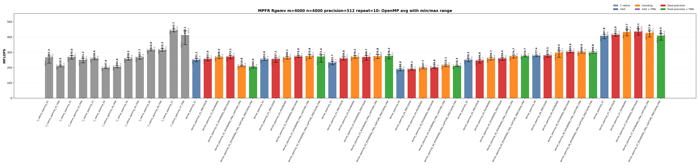

<!-- SPDX-License-Identifier: BSD-2-Clause -->

# 02_Rgemv

This directory benchmarks the MPFR real dense matrix-vector product

```text
y <- alpha * A * x + beta * y
```

with raw MPFR C kernels and `mpfrxx::mpfr_class` wrapper kernels. The
performance question is whether wrapper source shapes can reach the same
hot-loop class as raw MPFR C when rounding, fixed precision, FMA, and OpenMP
partitioning are controlled.

## Build

From the repository root:

```bash
cmake -S . -B build_bench_release -DCMAKE_BUILD_TYPE=Release
cmake --build build_bench_release -j
```

Executables are created under:

```text
build_bench_release/benchmarks/mpfr/02_Rgemv/
```

Each executable takes `<rows m> <cols n> <precision>`. Example:

```bash
build_bench_release/benchmarks/mpfr/02_Rgemv/Rgemv_mpfr_kernel_openmp_07_ROUNDING_FMA_CAPTURE_PRECISION_FMA 4000 4000 512
```

The repeat-10 runner uses the same source/build taxonomy:

```bash
OMP_NUM_THREADS=32 OMP_PLACES=cores OMP_PROC_BIND=spread \
    benchmarks/mpfr/02_Rgemv/run_repeat.sh build_bench_release 4000 4000 512 10
```

MPFR Rgemv wrapper targets omit a separate `mkII` implementation suffix because
this directory has only the mkII wrapper implementation.  The target suffixes
separate source changes from build flags:

| Suffix | Kind | Meaning |
|--------|------|---------|
| none | source baseline | Ordinary wrapper source for the numbered algorithm. |
| `ROUNDING` | source modifier | Captures `mpfrxx::evaluation_context` before the loop and uses `with_context` in the timed body.  No compile-time flag is implied. |
| `ROUNDING_FMA_CAPTURE` | source modifier | Uses the same loop-external rounding context and spells the inner update as an expression that can be captured by the ET FMA path. |
| `PRECISION` | build modifier | Builds the same source with `GMPFRXX_MKII_FAST_FIXED_PREC`. |
| final `FMA` | build modifier | Builds the FMA-capturable source with `GMPFRXX_MKII_ENABLE_FMA`. |

The C native targets encode FMA directly in their source, so they do not split
into `ROUNDING` and non-`ROUNDING` forms.

The cross-benchmark runner can execute the GMP and MPFR `00_Rdot`, `01_Raxpy`, and `02_Rgemv` suites for both standard precisions with one command:

```bash
OMP_NUM_THREADS=32 OMP_PLACES=cores OMP_PROC_BIND=spread \
    benchmarks/run_all.sh build_bench_release 512,1024 10 10000000 10000000 4000 4000
```

The second argument is a precision list. `both` and `all` are aliases for `512,1024`; a single value such as `512` still runs only that precision. Per-benchmark results are written to `results_raw/run_all_p512_repeat10_<timestamp>/` and `results_raw/run_all_p1024_repeat10_<timestamp>/` under each benchmark directory.

## Benchmark Parameters

| Parameter | Meaning |
| --- | --- |
| `m` | Number of matrix rows and length of `y`. |
| `n` | Number of matrix columns and length of `x`. |
| `precision` | MPFR precision in bits for matrix/vector/scalar inputs and temporaries. |
| `repeat` | Number of timed process executions per executable. |
| `OMP_NUM_THREADS` | OpenMP worker count for `openmp` executables. |
| `OMP_PLACES`, `OMP_PROC_BIND` | OpenMP affinity controls used by the runner. |

The committed runs use `m=4000`, `n=4000`, `repeat=10`, `precision=512` and `precision=1024`, with `OMP_NUM_THREADS=32`, `OMP_PLACES=cores`, and `OMP_PROC_BIND=spread`.

## Variant Shapes

The timed body is `_Rgemv()`. `A` is stored in column-major order.  The numbered
variant table names the source-level transition being measured.  Some variants branch from an earlier comparison point, so the transition column names the baseline explicitly.  `ROUNDING`,
`ROUNDING_FMA_CAPTURE`, `PRECISION`, and final `FMA` suffixes modify the same
numbered shape without changing the variant number.

| Variant | Transition from previous variant | Timed source shape | Temporary/resource policy | Purpose |
|---------|----------------------------------|--------------------|---------------------------|---------|
| `01` | Starting point. | Row-dot form: for each row `i`, accumulate `sum_j A[i+j*lda] * x[j]`, then update `y[i]`. | Reusable row accumulator and reusable product object. | Baseline row-owned Rgemv spelling; exposes the cost of strided column-major `A` access. |
| `02` | `01 -> 02`: change traversal from row-dot to column-major streaming. | Scale `y`, then stream columns of `A` and update all rows for each `j`. | Reusable `temp = alpha * x[j]` and reusable `templ = temp * A[i+j*lda]`. | Separates wrapper overhead from the dominant `A` access pattern and avoids FMA as a confounder. |
| `03` | `01 -> 03`: keep the row-dot traversal and switch from a reusable product temporary to an FMA-capturable expression spelling. | Row-dot direct-expression form: `temp += A[i+j*lda] * x[j]`, then `y[i] = alpha * temp + beta * y[i]`. | Reusable accumulator; expression product is FMA-capturable only in the `ROUNDING_FMA_CAPTURE` source. | Tests whether ET fusion can reach the raw C row-dot `mpfr_fma` / `mpfr_fmma` class. |
| `04` | `02 -> 04`: keep the column-major reusable-temporary traversal and add the explicit rounding/context comparison path. | Column-major reusable-temporary form; the base source intentionally remains in the same hot-loop class as `02`. | Reusable `temp` and `templ`; `ROUNDING` variants route all updates through a loop-external context. | Measures whether explicit rounding capture changes the reusable-temp column-major class without mixing in traversal or expression-shape changes. |
| `05` | `04 -> 05`: add OpenMP row partitioning and precompute `alpha * x`. | OpenMP row partition with precomputed `scaled_x[j] = alpha * x[j]`. | Precomputed scaled vector plus per-thread reusable product. | Removes repeated column-scalar work while each thread owns rows of `y`. |
| `06` | `05 -> 06`: add fixed 256-row blocking inside the row-owned OpenMP shape. | OpenMP 256-row blocks with column loop and contiguous row loop inside each block. | Per-thread reusable scratch; no shared-y race inside a block. | Trades extra loop structure for better locality in row-owned OpenMP code. |
| `07` | `06 -> 07`: switch from row ownership to column partitioning with reduction. | OpenMP column partition with per-thread partial `y` vectors and final reduction. | `num_threads * m` partial accumulators plus final reduction outside the hot column loop. | Preserves serial-like column-major `A` streaming without racing on `y`. |

Serial wrapper executables cover variants `01`-`04`; OpenMP wrapper executables
cover variants `01`-`07`.

## Source Transitions

The transition table above is intentionally source-level, but not strictly linear.  A variant number
changes the source algorithm; suffixes then ask separate questions about
rounding capture, FMA capture, and fixed precision.

For each applicable wrapper source, the generated target family is:

```text
<base>
<base>_PRECISION
<base>_ROUNDING
<base>_ROUNDING_PRECISION
<base>_ROUNDING_FMA_CAPTURE_FMA
<base>_ROUNDING_FMA_CAPTURE_PRECISION_FMA
```

The `ROUNDING_FMA_CAPTURE` source is only built as an FMA target because its
purpose is to test ET FMA lowering.  Non-FMA reusable-temporary variants remain
separate so they continue to match raw C kernels that avoid local allocation
without using FMA.

## C Native Equivalent Kernels

The mapping is based on the timed `_Rgemv()` source shape and generated hot
loop, not just on matching numeric suffixes.  Raw C kernels encode rounding and
FMA directly; wrapper kernels use suffixes to isolate those effects.

| C native kernel | Equivalent C++ wrapper kernel(s) | Equivalence basis |
|-----------------|----------------------------------|-------------------|
| `C_native_01` | `kernel_01`, `kernel_01_PRECISION` | Row-dot source with reusable row accumulator and product temporary. |
| `C_native_01_FMA` | `kernel_01_ROUNDING_FMA_CAPTURE_FMA`, `kernel_01_ROUNDING_FMA_CAPTURE_PRECISION_FMA` | Same row-dot algorithm, but the wrapper source uses context capture and an FMA-capturable expression. |
| `C_native_02` | `kernel_02`, `kernel_02_PRECISION`, `kernel_02_ROUNDING`, `kernel_02_ROUNDING_PRECISION` | Column-major reusable `temp`/`templ` source, intentionally non-FMA. |
| `C_native_02_FMA` | `kernel_02_ROUNDING_FMA_CAPTURE_FMA`, `kernel_02_ROUNDING_FMA_CAPTURE_PRECISION_FMA` | Column-major update with an FMA-capturable row update. |
| `C_native_03` | `kernel_03_ROUNDING_FMA_CAPTURE_FMA`, `kernel_03_ROUNDING_FMA_CAPTURE_PRECISION_FMA` | Row-dot FMA-style accumulation.  Raw C also uses `mpfr_fmma` for the final alpha/beta update. |
| `C_native_04` | `kernel_04`, `kernel_04_PRECISION`, `kernel_04_ROUNDING`, `kernel_04_ROUNDING_PRECISION` | Serial column-major reusable-temporary comparison point. |
| `C_native_openmp_NN` | `kernel_openmp_NN`, `kernel_openmp_NN_PRECISION`, `kernel_openmp_NN_ROUNDING`, `kernel_openmp_NN_ROUNDING_PRECISION` | Same OpenMP partitioning and non-FMA temporary policy as raw C variant `NN`. |
| `C_native_openmp_NN_FMA` | `kernel_openmp_NN_ROUNDING_FMA_CAPTURE_FMA`, `kernel_openmp_NN_ROUNDING_FMA_CAPTURE_PRECISION_FMA` | Same OpenMP partitioning as raw C variant `NN`, with FMA-capturable wrapper source and FMA-enabled build. |

The closest hot-loop comparison for the best historical OpenMP class is
`C_native_openmp_07_FMA` against
`kernel_openmp_07_ROUNDING_FMA_CAPTURE_PRECISION_FMA`.

## Recorded Run

### 512-bit run

| Field | Value |
|-------|-------|
| Run ID | `run_all_p512_repeat10_20260525_224339` |
| Date | 2026-05-25 |
| CPU | AMD Ryzen Threadripper 3970X 32-Core Processor |
| OS | Linux 6.8.0-94-generic x86_64 |
| Compiler | `c++ (Ubuntu 15.2.0-16ubuntu1) 15.2.0` |
| Build type | Release |
| Problem size | `m=4000`, `n=4000` |
| Precision | 512 bits |
| Repeat count | 10 |
| OpenMP | `OMP_NUM_THREADS=32`, `OMP_PLACES=cores`, `OMP_PROC_BIND=spread` |
| Benchmark command | `OMP_NUM_THREADS=32 OMP_PLACES=cores OMP_PROC_BIND=spread benchmarks/run_all.sh build_bench_release 512 10 10000000 10000000 4000 4000` |
| Raw result directory | `benchmarks/mpfr/02_Rgemv/results_raw/run_all_p512_repeat10_20260525_224339/` |
| Raw log | `benchmarks/mpfr/02_Rgemv/results_raw/run_all_p512_repeat10_20260525_224339/benchmark_rgemv_mpfr_m4000_n4000_p512_repeat10.log` |
| Raw CSV | `benchmarks/mpfr/02_Rgemv/results_raw/run_all_p512_repeat10_20260525_224339/raw_rgemv_mpfr_m4000_n4000_p512_repeat10.csv` |
| Summary CSV | `benchmarks/mpfr/02_Rgemv/results_raw/run_all_p512_repeat10_20260525_224339/summary_rgemv_mpfr_m4000_n4000_p512_repeat10.csv` |
| Correctness | 850 / 850 runs reported OK. |




Plot regeneration command:

```bash
python3 benchmarks/mpfr/02_Rgemv/plot_repeat_summary.py \
    benchmarks/mpfr/02_Rgemv/results_raw/run_all_p512_repeat10_20260525_224339/benchmark_rgemv_mpfr_m4000_n4000_p512_repeat10.log \
    --output-dir benchmarks/mpfr/02_Rgemv/results_raw/run_all_p512_repeat10_20260525_224339 \
    --output-prefix rgemv_mpfr_m4000_n4000_p512_repeat10 \
    --title-prefix "MPFR Rgemv m=4000, n=4000, precision=512, repeat=10"
```

### 1024-bit run

No current 1024-bit `run_all` result directory is present under this benchmark's `results_raw/` tree. Run `benchmarks/run_all.sh build_bench_release 1024 10 10000000 10000000 4000 4000` or the default dual-precision command to regenerate this section.

## Resource or Bandwidth Estimates

The values below are model estimates derived from MFLOPS, not hardware-counter measurements. They use the current 512-bit `run_all` summary and count active limb bytes plus a header-inclusive model. They exclude allocator metadata, cache-line overfetch, instruction fetch, and final OpenMP reduction traffic.

| Case | Representative best-avg variant | Avg MFLOPS | Active bytes/iteration | Header-inclusive bytes/iteration | Active GB/s | Header-inclusive GB/s |
| --- | --- | --- | --- | --- | --- | --- |
| 512-bit serial | `kernel_04_ROUNDING_FMA_CAPTURE_FMA` | 23.440 | 192 | 288 | 2.250 | 3.375 |
| 512-bit OpenMP | `C_native_openmp_07` | 443.738 | 192 | 288 | 42.599 | 63.898 |

For matrix-vector benchmarks, the per-iteration byte model is a compact active-data estimate for the arithmetic stream, not a full matrix-footprint or cache-reuse model.
## Headline Results

The 512-bit headline rows below are regenerated from `benchmarks/mpfr/02_Rgemv/results_raw/run_all_p512_repeat10_20260525_224339/summary_rgemv_mpfr_m4000_n4000_p512_repeat10.csv`. No 1024-bit raw data is present in the current `results_raw/` tree, so 1024-bit result sections are placeholders until a fresh 1024-bit `run_all` result is collected.

| Precision | Class | Variant | Max MFLOPS | Avg MFLOPS | Interpretation |
| --- | --- | --- | --- | --- | --- |
| 512 | Best serial max | `kernel_04_ROUNDING_FMA_CAPTURE_FMA` | 23.974 | 23.440 | Single fastest serial repeat; compare with Avg MFLOPS for stability. |
| 512 | Best serial average | `kernel_04_ROUNDING_FMA_CAPTURE_FMA` | 23.974 | 23.440 | Wrapper source captures rounding/context outside the loop; checks whether default-rounding lookup was part of the hot path. |
| 512 | Best OpenMP max | `kernel_openmp_07_ROUNDING_PRECISION` | 453.770 | 436.066 | Single fastest OpenMP repeat; OpenMP rows should be interpreted by performance class. |
| 512 | Best OpenMP average | `C_native_openmp_07` | 452.413 | 443.738 | Raw C OpenMP column-partitioned class with per-thread partial y vectors and final reduction outside the hot loop. |
## Serial Results

### 512-bit serial interpretation

These rows are derived from `benchmarks/mpfr/02_Rgemv/results_raw/run_all_p512_repeat10_20260525_224339/summary_rgemv_mpfr_m4000_n4000_p512_repeat10.csv`.

| Observation | Variant | Max MFLOPS | Avg MFLOPS | Min MFLOPS | Interpretation |
| --- | --- | --- | --- | --- | --- |
| Best raw C serial avg | `C_native_02_FMA` | 23.900 | 23.361 | 22.995 | Raw C MPFR FMA reference; the hot loop uses the fused backend operation where the source shape permits it. |
| Best mkII serial avg | `kernel_04_ROUNDING_FMA_CAPTURE_FMA` | 23.974 | 23.440 | 22.968 | Wrapper source captures rounding/context outside the loop; checks whether default-rounding lookup was part of the hot path. |
| Best serial max | `kernel_04_ROUNDING_FMA_CAPTURE_FMA` | 23.974 | 23.440 | 22.968 | Wrapper source captures rounding/context outside the loop; checks whether default-rounding lookup was part of the hot path. |

<details>
<summary>512-bit serial results sorted by Max MFLOPS</summary>

| Rank | Variant | Max MFLOPS | Avg MFLOPS | Min MFLOPS |
| --- | --- | --- | --- | --- |
| 1 | `kernel_04_ROUNDING_FMA_CAPTURE_FMA` | 23.974 | 23.440 | 22.968 |
| 2 | `C_native_02_FMA` | 23.900 | 23.361 | 22.995 |
| 3 | `kernel_02_ROUNDING_FMA_CAPTURE_PRECISION_FMA` | 23.639 | 23.354 | 22.928 |
| 4 | `kernel_04_ROUNDING_FMA_CAPTURE_PRECISION_FMA` | 23.589 | 23.331 | 22.791 |
| 5 | `kernel_02_ROUNDING_FMA_CAPTURE_FMA` | 23.525 | 23.390 | 23.212 |
| 6 | `kernel_02_ROUNDING_PRECISION` | 21.021 | 20.371 | 20.081 |
| 7 | `kernel_02_ROUNDING` | 20.920 | 20.347 | 20.053 |
| 8 | `kernel_04_ROUNDING_PRECISION` | 20.591 | 20.423 | 20.255 |
| 9 | `kernel_04_ROUNDING` | 20.478 | 20.273 | 20.131 |
| 10 | `C_native_04` | 20.085 | 19.627 | 19.388 |
| 11 | `C_native_02` | 19.772 | 19.532 | 19.360 |
| 12 | `kernel_02` | 19.319 | 18.744 | 18.480 |
| 13 | `kernel_02_PRECISION` | 19.238 | 18.734 | 18.460 |
| 14 | `kernel_04` | 18.909 | 18.684 | 18.421 |
| 15 | `kernel_04_PRECISION` | 18.822 | 18.627 | 18.495 |
| 16 | `kernel_01_PRECISION` | 11.817 | 10.165 | 9.284 |
| 17 | `C_native_01_FMA` | 11.589 | 10.918 | 10.377 |
| 18 | `C_native_01` | 11.537 | 10.192 | 9.836 |
| 19 | `C_native_03` | 11.486 | 10.889 | 10.527 |
| 20 | `kernel_03_ROUNDING_PRECISION` | 11.202 | 10.442 | 9.807 |
| 21 | `kernel_01_ROUNDING_PRECISION` | 11.063 | 10.339 | 9.852 |
| 22 | `kernel_03_ROUNDING` | 11.020 | 10.347 | 9.836 |
| 23 | `kernel_03_PRECISION` | 10.916 | 10.023 | 9.655 |
| 24 | `kernel_01` | 10.763 | 9.983 | 9.413 |
| 25 | `kernel_01_ROUNDING` | 10.587 | 10.152 | 9.744 |
| 26 | `kernel_01_ROUNDING_FMA_CAPTURE_PRECISION_FMA` | 10.547 | 10.246 | 10.058 |
| 27 | `kernel_03_ROUNDING_FMA_CAPTURE_PRECISION_FMA` | 10.445 | 10.253 | 10.037 |
| 28 | `kernel_03_ROUNDING_FMA_CAPTURE_FMA` | 10.308 | 10.134 | 9.922 |
| 29 | `kernel_01_ROUNDING_FMA_CAPTURE_FMA` | 10.277 | 10.112 | 9.903 |
| 30 | `kernel_03` | 8.841 | 8.538 | 8.303 |

</details>

<details>
<summary>512-bit serial results sorted by Avg MFLOPS</summary>

| Rank | Variant | Max MFLOPS | Avg MFLOPS | Min MFLOPS |
| --- | --- | --- | --- | --- |
| 1 | `kernel_04_ROUNDING_FMA_CAPTURE_FMA` | 23.974 | 23.440 | 22.968 |
| 2 | `kernel_02_ROUNDING_FMA_CAPTURE_FMA` | 23.525 | 23.390 | 23.212 |
| 3 | `C_native_02_FMA` | 23.900 | 23.361 | 22.995 |
| 4 | `kernel_02_ROUNDING_FMA_CAPTURE_PRECISION_FMA` | 23.639 | 23.354 | 22.928 |
| 5 | `kernel_04_ROUNDING_FMA_CAPTURE_PRECISION_FMA` | 23.589 | 23.331 | 22.791 |
| 6 | `kernel_04_ROUNDING_PRECISION` | 20.591 | 20.423 | 20.255 |
| 7 | `kernel_02_ROUNDING_PRECISION` | 21.021 | 20.371 | 20.081 |
| 8 | `kernel_02_ROUNDING` | 20.920 | 20.347 | 20.053 |
| 9 | `kernel_04_ROUNDING` | 20.478 | 20.273 | 20.131 |
| 10 | `C_native_04` | 20.085 | 19.627 | 19.388 |
| 11 | `C_native_02` | 19.772 | 19.532 | 19.360 |
| 12 | `kernel_02` | 19.319 | 18.744 | 18.480 |
| 13 | `kernel_02_PRECISION` | 19.238 | 18.734 | 18.460 |
| 14 | `kernel_04` | 18.909 | 18.684 | 18.421 |
| 15 | `kernel_04_PRECISION` | 18.822 | 18.627 | 18.495 |
| 16 | `C_native_01_FMA` | 11.589 | 10.918 | 10.377 |
| 17 | `C_native_03` | 11.486 | 10.889 | 10.527 |
| 18 | `kernel_03_ROUNDING_PRECISION` | 11.202 | 10.442 | 9.807 |
| 19 | `kernel_03_ROUNDING` | 11.020 | 10.347 | 9.836 |
| 20 | `kernel_01_ROUNDING_PRECISION` | 11.063 | 10.339 | 9.852 |
| 21 | `kernel_03_ROUNDING_FMA_CAPTURE_PRECISION_FMA` | 10.445 | 10.253 | 10.037 |
| 22 | `kernel_01_ROUNDING_FMA_CAPTURE_PRECISION_FMA` | 10.547 | 10.246 | 10.058 |
| 23 | `C_native_01` | 11.537 | 10.192 | 9.836 |
| 24 | `kernel_01_PRECISION` | 11.817 | 10.165 | 9.284 |
| 25 | `kernel_01_ROUNDING` | 10.587 | 10.152 | 9.744 |
| 26 | `kernel_03_ROUNDING_FMA_CAPTURE_FMA` | 10.308 | 10.134 | 9.922 |
| 27 | `kernel_01_ROUNDING_FMA_CAPTURE_FMA` | 10.277 | 10.112 | 9.903 |
| 28 | `kernel_03_PRECISION` | 10.916 | 10.023 | 9.655 |
| 29 | `kernel_01` | 10.763 | 9.983 | 9.413 |
| 30 | `kernel_03` | 8.841 | 8.538 | 8.303 |

</details>
### 1024-bit serial interpretation

No current 1024-bit `run_all` summary CSV is present under this benchmark's `results_raw/` tree. The serial table should be regenerated after a fresh 1024-bit run is collected.

## OpenMP Results

### 512-bit OpenMP interpretation

These rows are derived from `benchmarks/mpfr/02_Rgemv/results_raw/run_all_p512_repeat10_20260525_224339/summary_rgemv_mpfr_m4000_n4000_p512_repeat10.csv`.

| Observation | Variant | Max MFLOPS | Avg MFLOPS | Min MFLOPS | Interpretation |
| --- | --- | --- | --- | --- | --- |
| Best raw C OpenMP avg | `C_native_openmp_07` | 452.413 | 443.738 | 434.352 | Raw C OpenMP column-partitioned class with per-thread partial y vectors and final reduction outside the hot loop. |
| Best mkII OpenMP avg | `kernel_openmp_07_ROUNDING_PRECISION` | 453.770 | 436.066 | 413.395 | Wrapper source with loop-external context plus fixed-precision build assumptions; intended to remove rounding lookup and precision checks from the hot path. |
| Best OpenMP max | `kernel_openmp_07_ROUNDING_PRECISION` | 453.770 | 436.066 | 413.395 | Wrapper source with loop-external context plus fixed-precision build assumptions; intended to remove rounding lookup and precision checks from the hot path. |

<details>
<summary>512-bit OpenMP results sorted by Max MFLOPS</summary>

| Rank | Variant | Max MFLOPS | Avg MFLOPS | Min MFLOPS |
| --- | --- | --- | --- | --- |
| 1 | `kernel_openmp_07_ROUNDING_PRECISION` | 453.770 | 436.066 | 413.395 |
| 2 | `C_native_openmp_07` | 452.413 | 443.738 | 434.352 |
| 3 | `kernel_openmp_07_ROUNDING` | 451.354 | 433.697 | 408.068 |
| 4 | `C_native_openmp_07_FMA` | 441.899 | 414.090 | 350.140 |
| 5 | `kernel_openmp_07_ROUNDING_FMA_CAPTURE_FMA` | 441.134 | 427.857 | 400.026 |
| 6 | `kernel_openmp_07_ROUNDING_FMA_CAPTURE_PRECISION_FMA` | 423.990 | 409.503 | 379.500 |
| 7 | `kernel_openmp_07_PRECISION` | 421.887 | 415.048 | 405.932 |
| 8 | `kernel_openmp_07` | 418.931 | 407.824 | 389.733 |
| 9 | `C_native_openmp_06_FMA` | 323.155 | 315.222 | 306.788 |
| 10 | `C_native_openmp_06` | 320.361 | 315.034 | 309.094 |
| 11 | `kernel_openmp_06_ROUNDING` | 310.291 | 298.459 | 267.822 |
| 12 | `kernel_openmp_06_ROUNDING_PRECISION` | 310.057 | 303.640 | 296.977 |
| 13 | `kernel_openmp_06_ROUNDING_FMA_CAPTURE_PRECISION_FMA` | 305.673 | 298.809 | 295.094 |
| 14 | `kernel_openmp_06_ROUNDING_FMA_CAPTURE_FMA` | 304.824 | 300.898 | 294.761 |
| 15 | `kernel_openmp_03_ROUNDING_FMA_CAPTURE_FMA` | 286.568 | 274.762 | 259.871 |
| 16 | `kernel_openmp_02_ROUNDING_FMA_CAPTURE_PRECISION_FMA` | 286.078 | 272.367 | 235.609 |
| 17 | `kernel_openmp_06_PRECISION` | 284.686 | 279.527 | 267.278 |
| 18 | `kernel_openmp_02_ROUNDING_FMA_CAPTURE_FMA` | 284.195 | 275.789 | 260.456 |
| 19 | `kernel_openmp_03_ROUNDING_FMA_CAPTURE_PRECISION_FMA` | 283.496 | 276.267 | 257.369 |
| 20 | `kernel_openmp_01_ROUNDING_PRECISION` | 280.174 | 272.110 | 256.806 |
| 21 | `kernel_openmp_06` | 280.036 | 277.360 | 271.953 |
| 22 | `C_native_openmp_02` | 279.127 | 269.979 | 255.518 |
| 23 | `kernel_openmp_02_ROUNDING_PRECISION` | 279.052 | 273.043 | 267.282 |
| 24 | `kernel_openmp_05_ROUNDING_FMA_CAPTURE_PRECISION_FMA` | 278.295 | 274.711 | 270.630 |
| 25 | `kernel_openmp_05_ROUNDING_FMA_CAPTURE_FMA` | 277.867 | 274.728 | 262.678 |
| 26 | `kernel_openmp_03_ROUNDING_PRECISION` | 277.858 | 269.737 | 248.235 |
| 27 | `kernel_openmp_03_ROUNDING` | 277.414 | 270.153 | 261.295 |
| 28 | `C_native_openmp_01` | 276.202 | 267.294 | 229.323 |
| 29 | `kernel_openmp_01_ROUNDING` | 275.234 | 269.308 | 258.421 |
| 30 | `C_native_openmp_05_FMA` | 273.536 | 267.679 | 254.987 |
| 31 | `kernel_openmp_02_ROUNDING` | 273.386 | 266.068 | 256.415 |
| 32 | `kernel_openmp_03_PRECISION` | 270.291 | 259.843 | 250.005 |
| 33 | `C_native_openmp_05` | 266.603 | 258.235 | 248.319 |
| 34 | `kernel_openmp_05_ROUNDING` | 266.567 | 259.712 | 248.845 |
| 35 | `kernel_openmp_05_ROUNDING_PRECISION` | 264.599 | 259.407 | 248.606 |
| 36 | `kernel_openmp_01_PRECISION` | 264.175 | 257.000 | 245.065 |
| 37 | `kernel_openmp_02_PRECISION` | 263.513 | 257.133 | 233.324 |
| 38 | `C_native_openmp_03` | 262.814 | 258.858 | 251.341 |
| 39 | `C_native_openmp_02_FMA` | 262.137 | 251.211 | 231.328 |
| 40 | `kernel_openmp_01` | 261.426 | 251.069 | 239.284 |
| 41 | `kernel_openmp_02` | 261.423 | 253.902 | 247.342 |
| 42 | `kernel_openmp_05` | 256.444 | 250.201 | 238.532 |
| 43 | `kernel_openmp_05_PRECISION` | 253.667 | 246.759 | 229.182 |
| 44 | `kernel_openmp_03` | 241.548 | 232.723 | 219.760 |
| 45 | `kernel_openmp_04_ROUNDING_FMA_CAPTURE_FMA` | 218.576 | 215.149 | 206.239 |
| 46 | `kernel_openmp_01_ROUNDING_FMA_CAPTURE_FMA` | 214.589 | 210.762 | 206.586 |
| 47 | `C_native_openmp_01_FMA` | 214.307 | 210.469 | 205.246 |
| 48 | `kernel_openmp_04_ROUNDING_FMA_CAPTURE_PRECISION_FMA` | 212.782 | 210.341 | 206.743 |
| 49 | `C_native_openmp_04_FMA` | 212.386 | 205.637 | 197.966 |
| 50 | `kernel_openmp_01_ROUNDING_FMA_CAPTURE_PRECISION_FMA` | 207.386 | 204.976 | 196.688 |
| 51 | `kernel_openmp_04_ROUNDING_PRECISION` | 202.763 | 199.795 | 193.790 |
| 52 | `kernel_openmp_04_ROUNDING` | 201.658 | 197.666 | 192.049 |
| 53 | `C_native_openmp_04` | 200.072 | 197.551 | 194.210 |
| 54 | `kernel_openmp_04_PRECISION` | 192.247 | 189.121 | 183.514 |
| 55 | `kernel_openmp_04` | 191.920 | 188.018 | 178.801 |

</details>

<details>
<summary>512-bit OpenMP results sorted by Avg MFLOPS</summary>

| Rank | Variant | Max MFLOPS | Avg MFLOPS | Min MFLOPS |
| --- | --- | --- | --- | --- |
| 1 | `C_native_openmp_07` | 452.413 | 443.738 | 434.352 |
| 2 | `kernel_openmp_07_ROUNDING_PRECISION` | 453.770 | 436.066 | 413.395 |
| 3 | `kernel_openmp_07_ROUNDING` | 451.354 | 433.697 | 408.068 |
| 4 | `kernel_openmp_07_ROUNDING_FMA_CAPTURE_FMA` | 441.134 | 427.857 | 400.026 |
| 5 | `kernel_openmp_07_PRECISION` | 421.887 | 415.048 | 405.932 |
| 6 | `C_native_openmp_07_FMA` | 441.899 | 414.090 | 350.140 |
| 7 | `kernel_openmp_07_ROUNDING_FMA_CAPTURE_PRECISION_FMA` | 423.990 | 409.503 | 379.500 |
| 8 | `kernel_openmp_07` | 418.931 | 407.824 | 389.733 |
| 9 | `C_native_openmp_06_FMA` | 323.155 | 315.222 | 306.788 |
| 10 | `C_native_openmp_06` | 320.361 | 315.034 | 309.094 |
| 11 | `kernel_openmp_06_ROUNDING_PRECISION` | 310.057 | 303.640 | 296.977 |
| 12 | `kernel_openmp_06_ROUNDING_FMA_CAPTURE_FMA` | 304.824 | 300.898 | 294.761 |
| 13 | `kernel_openmp_06_ROUNDING_FMA_CAPTURE_PRECISION_FMA` | 305.673 | 298.809 | 295.094 |
| 14 | `kernel_openmp_06_ROUNDING` | 310.291 | 298.459 | 267.822 |
| 15 | `kernel_openmp_06_PRECISION` | 284.686 | 279.527 | 267.278 |
| 16 | `kernel_openmp_06` | 280.036 | 277.360 | 271.953 |
| 17 | `kernel_openmp_03_ROUNDING_FMA_CAPTURE_PRECISION_FMA` | 283.496 | 276.267 | 257.369 |
| 18 | `kernel_openmp_02_ROUNDING_FMA_CAPTURE_FMA` | 284.195 | 275.789 | 260.456 |
| 19 | `kernel_openmp_03_ROUNDING_FMA_CAPTURE_FMA` | 286.568 | 274.762 | 259.871 |
| 20 | `kernel_openmp_05_ROUNDING_FMA_CAPTURE_FMA` | 277.867 | 274.728 | 262.678 |
| 21 | `kernel_openmp_05_ROUNDING_FMA_CAPTURE_PRECISION_FMA` | 278.295 | 274.711 | 270.630 |
| 22 | `kernel_openmp_02_ROUNDING_PRECISION` | 279.052 | 273.043 | 267.282 |
| 23 | `kernel_openmp_02_ROUNDING_FMA_CAPTURE_PRECISION_FMA` | 286.078 | 272.367 | 235.609 |
| 24 | `kernel_openmp_01_ROUNDING_PRECISION` | 280.174 | 272.110 | 256.806 |
| 25 | `kernel_openmp_03_ROUNDING` | 277.414 | 270.153 | 261.295 |
| 26 | `C_native_openmp_02` | 279.127 | 269.979 | 255.518 |
| 27 | `kernel_openmp_03_ROUNDING_PRECISION` | 277.858 | 269.737 | 248.235 |
| 28 | `kernel_openmp_01_ROUNDING` | 275.234 | 269.308 | 258.421 |
| 29 | `C_native_openmp_05_FMA` | 273.536 | 267.679 | 254.987 |
| 30 | `C_native_openmp_01` | 276.202 | 267.294 | 229.323 |
| 31 | `kernel_openmp_02_ROUNDING` | 273.386 | 266.068 | 256.415 |
| 32 | `kernel_openmp_03_PRECISION` | 270.291 | 259.843 | 250.005 |
| 33 | `kernel_openmp_05_ROUNDING` | 266.567 | 259.712 | 248.845 |
| 34 | `kernel_openmp_05_ROUNDING_PRECISION` | 264.599 | 259.407 | 248.606 |
| 35 | `C_native_openmp_03` | 262.814 | 258.858 | 251.341 |
| 36 | `C_native_openmp_05` | 266.603 | 258.235 | 248.319 |
| 37 | `kernel_openmp_02_PRECISION` | 263.513 | 257.133 | 233.324 |
| 38 | `kernel_openmp_01_PRECISION` | 264.175 | 257.000 | 245.065 |
| 39 | `kernel_openmp_02` | 261.423 | 253.902 | 247.342 |
| 40 | `C_native_openmp_02_FMA` | 262.137 | 251.211 | 231.328 |
| 41 | `kernel_openmp_01` | 261.426 | 251.069 | 239.284 |
| 42 | `kernel_openmp_05` | 256.444 | 250.201 | 238.532 |
| 43 | `kernel_openmp_05_PRECISION` | 253.667 | 246.759 | 229.182 |
| 44 | `kernel_openmp_03` | 241.548 | 232.723 | 219.760 |
| 45 | `kernel_openmp_04_ROUNDING_FMA_CAPTURE_FMA` | 218.576 | 215.149 | 206.239 |
| 46 | `kernel_openmp_01_ROUNDING_FMA_CAPTURE_FMA` | 214.589 | 210.762 | 206.586 |
| 47 | `C_native_openmp_01_FMA` | 214.307 | 210.469 | 205.246 |
| 48 | `kernel_openmp_04_ROUNDING_FMA_CAPTURE_PRECISION_FMA` | 212.782 | 210.341 | 206.743 |
| 49 | `C_native_openmp_04_FMA` | 212.386 | 205.637 | 197.966 |
| 50 | `kernel_openmp_01_ROUNDING_FMA_CAPTURE_PRECISION_FMA` | 207.386 | 204.976 | 196.688 |
| 51 | `kernel_openmp_04_ROUNDING_PRECISION` | 202.763 | 199.795 | 193.790 |
| 52 | `kernel_openmp_04_ROUNDING` | 201.658 | 197.666 | 192.049 |
| 53 | `C_native_openmp_04` | 200.072 | 197.551 | 194.210 |
| 54 | `kernel_openmp_04_PRECISION` | 192.247 | 189.121 | 183.514 |
| 55 | `kernel_openmp_04` | 191.920 | 188.018 | 178.801 |

</details>
### 1024-bit OpenMP interpretation

No current 1024-bit `run_all` summary CSV is present under this benchmark's `results_raw/` tree. The OpenMP table should be regenerated after a fresh 1024-bit run is collected.

## Comparison with GMP version

The rows below compare the current 512-bit `run_all` data for `02_Rgemv`. This is a performance-class comparison; GMP `mpf` and MPFR have different precision and rounding semantics.

| Class | GMP best-avg variant | GMP Avg MFLOPS | MPFR best-avg variant | MPFR Avg MFLOPS | MPFR/GMP |
| --- | --- | --- | --- | --- | --- |
| Best serial average | `C_native_03` | 31.366 | `kernel_04_ROUNDING_FMA_CAPTURE_FMA` | 23.440 | 0.747x |
| Best OpenMP average | `kernel_openmp_07_orig` | 542.565 | `C_native_openmp_07` | 443.738 | 0.818x |

## Hotpath Disassembly

Representative snippets were collected with:

```bash
objdump -Cd --no-show-raw-insn build_bench_release/benchmarks/mpfr/02_Rgemv/<binary>
```

The snippets are representative, not exhaustive. They were selected to cover
the best serial raw FMA class, the requested wrapper OpenMP 04
fixed-precision/FMA class, the dominant raw OpenMP 07 worker, and the closest
wrapper OpenMP 07 FMA class. For MPFR Rgemv, the selection separates FMA effects
from matrix traversal effects: OpenMP 04 shows the row-partition FMA wrapper
shape, while OpenMP 07 mainly changes locality, partial-vector ownership, and
final reduction structure.

### `C_native_02_FMA`

Source: `benchmarks/mpfr/02_Rgemv/Rgemv_mpfr_C_native_02_FMA.cpp`.
The serial raw C FMA baseline caches the default rounding mode before the loop,
uses `mpfr_mul` for `temp = alpha * x[j]`, and uses one `mpfr_fma` per matrix
element.

```asm
2bc8: call   mpfr_get_default_rounding_mode@plt
2bd5: call   mpfr_init2@plt
2c90: mov    %r15,%rcx        # y[i] addend
2c93: mov    %r13,%rdx        # A[i + j*lda]
2c96: mov    %r15,%rdi        # y[i]
2c99: mov    %ebp,%r8d        # cached rounding
2c9c: mov    %rbx,%rsi        # temp = alpha * x[j]
2cab: call   mpfr_fma@plt
2cb3: jne    2c90
2cd9: mov    %rbx,%rdi
2cdc: call   mpfr_clear@plt
```

### `kernel_openmp_04_mkII_FIXED_PRECISION_FASTPATH_FMA`

Source: `benchmarks/mpfr/02_Rgemv/Rgemv_mpfr_kernel_openmp_04_FMA.cpp`.
The requested OpenMP 04 wrapper target keeps one reusable `temp` per worker,
partitions rows, and uses the expression `y_context += temp * A[i + j * lda]`
so the fixed-precision/FMA build emits `mpfr_fma` for the row update. The
`movabs $0x7ffffffffffffefe` checks are the inlined MPFR precision-validity
bounds from `with_context`; they are safety checks, not arithmetic work.

```asm
2f38: call   mpfr_init2@plt   # thread-local temp
3000: movabs $0x7ffffffffffffefe,%rax  # MPFR precision guard
3013: mov    0x30(%r14),%rdx
3017: mov    (%rsp),%ecx
301a: mov    %rbp,%rsi
301d: mov    %rbp,%rdi
3020: call   mpfr_mul@plt     # y[i] *= beta before the row loop
3050: mov    0x10(%r14),%rsi
3058: mov    %r13,%rdx
305b: lea    0x60(%rsp),%rdi  # temp
3068: call   mpfr_mul@plt     # temp = alpha * x[j]
306d: mov    (%rsp),%r8d      # cached rounding
3071: mov    %rbx,%rdx        # A[i+j*lda]
3074: mov    %rbp,%rcx        # y[i] addend
3077: lea    0x60(%rsp),%rsi  # temp
307c: mov    %rbp,%rdi        # y[i]
307f: call   mpfr_fma@plt     # y[i] += temp * A[i+j*lda]
308e: jne    3050
30c0: call   GOMP_barrier@plt
30ca: call   mpfr_clear@plt
```

### `C_native_openmp_07`

Source: `benchmarks/mpfr/02_Rgemv/Rgemv_mpfr_C_native_openmp_07.cpp`.
The non-FMA raw C 07 worker uses two reusable MPFR temporaries. Its row update
has one `mpfr_mul` and one `mpfr_add` per matrix element, plus barriers around
partial-vector phases and final reduction.

```asm
2d69: call   mpfr_init2@plt
2d74: call   mpfr_init2@plt
2de0: mov    0x20(%rsp),%rdx  # x[j]
2dea: mov    %ebp,%ecx        # cached rounding
2def: call   mpfr_mul@plt     # temp = alpha * x[j]
2e20: mov    %r12,%rdx        # A[i+j*lda]
2e25: mov    %r14,%rsi        # temp
2e28: mov    %r13,%rdi        # prod
2e2b: call   mpfr_mul@plt
2e33: mov    %rbx,%rdi        # partial_y[i]
2e38: mov    %r13,%rdx        # prod
2e47: call   mpfr_add@plt
2e51: jne    2e20
2e7e: call   GOMP_barrier@plt
```

### `kernel_openmp_07_mkII_FIXED_PRECISION_FASTPATH_FMA`

Source: `benchmarks/mpfr/02_Rgemv/Rgemv_mpfr_kernel_openmp_07_FMA.cpp`.
The fixed-precision FMA wrapper 07 path uses one `mpfr_mul` per column and one
`mpfr_fma` per matrix element in the worker hot loop. The remaining precision
checks are visible in the pre-loop/control path, not as `mpfr_init2`/`clear` per
matrix element.

```asm
3470: mov    0x10(%r14),%rsi  # x[j]
3474: mov    (%rsp),%ecx      # cached rounding
3477: mov    %r12,%rdi        # temp
347a: mov    0x18(%rsp),%rdx  # alpha
347f: call   mpfr_mul@plt
34b0: movabs $0x7ffffffffffffefe,%rcx
34ce: mov    (%rsp),%r8d      # cached rounding
34d2: mov    %rbx,%rcx        # partial_y[i]
34d5: mov    %r14,%rdx        # A[i+j*lda]
34d8: mov    %rbx,%rdi        # partial_y[i]
34db: mov    %r12,%rsi        # temp
34ea: call   mpfr_fma@plt
34f2: jne    34b0
3523: call   GOMP_barrier@plt
3566: call   mpfr_clear@plt
```

The hotpath explains the ranking: serial FMA helps the raw C column-major path,
but in OpenMP the 07 data partition dominates. Wrapper 07 variants are close to
raw C 07 when their inner loop has the same backend call sequence and no
per-element temporary initialization.

## Lessons Learned

- The first major boundary is matrix traversal. Row-dot variants are limited by
  strided column-major `A` access, while column-major and 07 variants stream the
  matrix more naturally.
- The best serial wrapper result is the explicit-context column-major reusable
  path. It reaches the raw C non-FMA class but not the raw C serial FMA result.
- FMA is useful, but not sufficient. It improves `C_native_02`, while OpenMP 07
  results are controlled more by locality, partial-vector reduction, and repeat
  variance.
- Fixed precision helps wrapper expression paths, but it is not a substitute
  for the right work partitioning.
- OpenMP 04 now has a fixed-precision/FMA wrapper target for direct
  row-partition comparison, but it remains a row-owned traversal. The 07
  column-partition class is still the main target for future optimization, and
  its generated hot loop should be compared against raw C 07/FMA.
