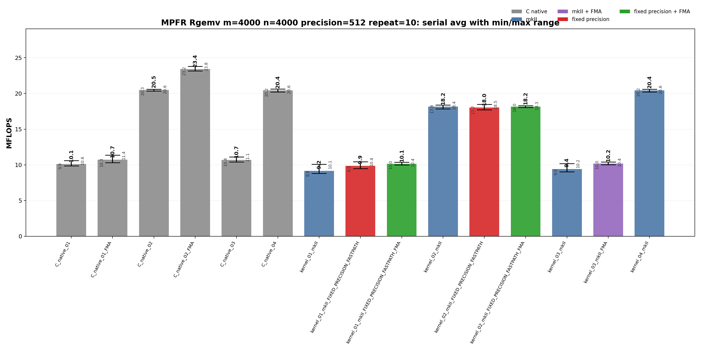
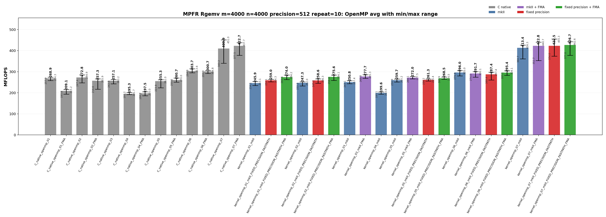

<!-- SPDX-License-Identifier: BSD-2-Clause -->

# 02_Rgemv

## Purpose

This benchmark measures MPFR-backed real matrix-vector multiplication:

```text
y <- alpha * A * x + beta * y
```

The benchmark compares raw MPFR C kernels with `mpfrxx::mpfr_class` wrapper
kernels.  The main question is whether wrapper source shapes can reach the same
generated hot-loop class as raw MPFR C when the kernel uses reusable scratch,
explicit evaluation context, fixed-precision assumptions, FMA, and OpenMP work
partitioning.

## Build

From the repository root:

```bash
cmake -S . -B build_bench_release -DCMAKE_BUILD_TYPE=Release
cmake --build build_bench_release -j
```

The executables are generated under:

```text
build_bench_release/benchmarks/mpfr/02_Rgemv/
```

Single executable example:

```bash
OMP_NUM_THREADS=32 OMP_PLACES=cores OMP_PROC_BIND=spread \
  build_bench_release/benchmarks/mpfr/02_Rgemv/Rgemv_mpfr_kernel_openmp_07_mkII_FIXED_PRECISION_FASTPATH_FMA 4000 4000 512
```

Repeat-run script:

```bash
OMP_NUM_THREADS=32 OMP_PLACES=cores OMP_PROC_BIND=spread \
  benchmarks/mpfr/02_Rgemv/run_repeat.sh build_bench_release 4000 4000 512 10
```

## Benchmark Parameters

| Parameter | Value in committed run | Meaning |
|-----------|------------------------|---------|
| `m` | 4000 | Number of rows of `A` and length of `y`. |
| `n` | 4000 | Number of columns of `A` and length of `x`. |
| `precision` | 512 bits | MPFR precision used for inputs, outputs, and scratch objects. |
| `repeat` | 10 | Each executable was timed 10 times. |
| `MFLOPS` | `2.0 * m * n / elapsed / 1e6` | One multiply and one add are counted per matrix element. |
| OpenMP threads | 32 | `OMP_NUM_THREADS=32`. |
| Affinity | cores/spread | `OMP_PLACES=cores`, `OMP_PROC_BIND=spread`. |
| Correctness | L1 norm check | Every recorded run reported `Result OK`. |

## Variant Shapes

| Variant | Timed source shape | Temporary/resource policy | Purpose |
|---------|--------------------|---------------------------|---------|
| `01` | Row-dot form: for each `i`, accumulate `sum_j A[i+j*lda] * x[j]`, then update `y[i]`. | Reusable row accumulator; wrapper expression forms still materialize expression temporaries. | Baseline BLAS-like row-dot spelling; stresses strided column-major A access. |
| `01_FMA` | Variant `01` with MPFR FMA where a fused source shape is available. | Same ownership and scratch lifetime as `01`. | Check whether FMA alone changes the row-dot performance class. |
| `02` | Column-major update: scale `y` by `beta`, then stream columns and update all rows. | Reusable `temp` and `templ` outside the inner loop. | Restore contiguous A access and reuse scratch objects. |
| `02_FMA` | Variant `02` with `mpfr_fma` in the row update where available. | Same scratch lifetime as `02`. | Raw C serial FMA comparison for the column-major source shape. |
| `03` | Explicit-context row-dot wrapper, or raw C row-dot with `mpfr_fma` plus final `mpfr_fmma`. | Reusable row accumulator; wrapper creates one explicit `evaluation_context`. | Compare explicit context against raw FMA/FMMA row-dot shape. |
| `04` | Explicit-context column-major wrapper, or raw C column-major reusable-temp baseline. | Reusable `temp` and `templ`; wrapper uses `with_context` for assignments and updates. | Best serial wrapper source shape without OpenMP. |
| `05` | OpenMP row partition with precomputed `alpha * x[j]`. | Precomputed scaled vector plus per-thread reusable product. | Remove repeated alpha*x work while keeping row-wise ownership of `y`. |
| `06` | OpenMP 256-row blocks; column loop and contiguous row loop inside each block. | Per-thread reusable scratch; no shared-y race inside a row block. | Improve locality while preserving simple y ownership. |
| `07` | OpenMP column partition with per-thread partial `y` vectors and final reduction. | `num_threads * m` partial accumulators plus final reduction. | Preserve serial-like column-major A streaming without racing on `y`. |
| `05_FMA`, `06_FMA`, `07_FMA` | FMA versions of the OpenMP 05/06/07 source shapes. | Same ownership and scratch policy as the non-FMA variants. | Check whether fused arithmetic changes the locality-driven OpenMP ranking. |

Serial executables currently cover variants `01`-`04`.  OpenMP executables
cover variants `01`-`07`.

## C Native Equivalent Kernels

| C native kernel | C++ wrapper kernel equivalent | Equivalence basis |
|-----------------|-------------------------------|-------------------|
| `C_native_01` | `kernel_01_mkII` | Both use row-dot source spelling and a final alpha/beta update. |
| `C_native_01_FMA` | `kernel_01_mkII_FIXED_PRECISION_FASTPATH_FMA` | Closest row-dot FMA comparison. The wrapper path also includes fixed-precision expression scratch handling. |
| `C_native_02` | `kernel_02_mkII` | Both scale `y`, then stream columns of `A` with reusable `temp`/`templ`. |
| `C_native_02_FMA` | `kernel_02_mkII_FIXED_PRECISION_FASTPATH_FMA` | Closest column-major FMA comparison. Exact generated code differs because the wrapper uses ET assignment paths. |
| `C_native_03` | `kernel_03_mkII_FMA` | Both test row-dot FMA-style accumulation. Raw C also uses `mpfr_fmma` for the final alpha/beta update. |
| `C_native_04` | `kernel_04_mkII` | Both are column-major reusable-temp baselines; `kernel_04_mkII` adds explicit `evaluation_context`. |
| `C_native_openmp_05` | `kernel_openmp_05_mkII` | Both precompute scaled `x` and partition rows. |
| `C_native_openmp_06` | `kernel_openmp_06_mkII` | Both use 256-row blocks and per-thread reusable scratch. |
| `C_native_openmp_07` | `kernel_openmp_07_mkII` | Both use column partitioning, per-thread partial y vectors, and final reduction. |
| `C_native_openmp_07_FMA` | `kernel_openmp_07_mkII_FIXED_PRECISION_FASTPATH_FMA` | Closest current hot-loop comparison: both use one `mpfr_mul` per column and one `mpfr_fma` per matrix element inside the OpenMP worker loop. |

## Recorded Run

| Field | Value |
|-------|-------|
| Run ID | `rgemv_mpfr_m4000_n4000_p512_repeat10_20260518_121840` |
| Date | 2026-05-18 |
| CPU | AMD Ryzen Threadripper 3970X 32-Core Processor |
| OS | Linux 6.8.0-94-generic x86_64 |
| Compiler | `c++ (Ubuntu 15.2.0-16ubuntu1) 15.2.0` |
| Build type | Release |
| CXX flags | `-O3 -DNDEBUG` |
| OpenMP | `OMP_NUM_THREADS=32`, `OMP_PLACES=cores`, `OMP_PROC_BIND=spread` |
| Raw result directory | `benchmarks/mpfr/02_Rgemv/results_raw/rgemv_mpfr_m4000_n4000_p512_repeat10_20260518_121840/` |
| Raw log | `benchmarks/mpfr/02_Rgemv/results_raw/rgemv_mpfr_m4000_n4000_p512_repeat10_20260518_121840/benchmark_rgemv_mpfr_m4000_n4000_p512_repeat10.log` |
| Raw CSV | `benchmarks/mpfr/02_Rgemv/results_raw/rgemv_mpfr_m4000_n4000_p512_repeat10_20260518_121840/raw_rgemv_mpfr_m4000_n4000_p512_repeat10.csv` |
| Summary CSV | `benchmarks/mpfr/02_Rgemv/results_raw/rgemv_mpfr_m4000_n4000_p512_repeat10_20260518_121840/summary_rgemv_mpfr_m4000_n4000_p512_repeat10.csv` |
| Correctness | 490 / 490 runs reported `Result OK`. |
| 1024-bit status | A 1024-bit sweep was started but interrupted before summary CSV and plots were generated, so it is intentionally not part of this committed report. |

Plot regeneration command:

```bash
python3 benchmarks/mpfr/02_Rgemv/plot_repeat_summary.py \
  benchmarks/mpfr/02_Rgemv/results_raw/rgemv_mpfr_m4000_n4000_p512_repeat10_20260518_121840/benchmark_rgemv_mpfr_m4000_n4000_p512_repeat10.log \
  --output-dir benchmarks/mpfr/02_Rgemv/results_raw/rgemv_mpfr_m4000_n4000_p512_repeat10_20260518_121840 \
  --output-prefix rgemv_mpfr_m4000_n4000_p512_repeat10 \
  --title-prefix "MPFR Rgemv m=4000 n=4000 precision=512 repeat=10"
```





## Resource or Bandwidth Estimates

These are model estimates derived from MFLOPS, not hardware-counter
measurements.

For 512-bit MPFR values, the active significand payload is 8 limbs = 64 bytes,
and the `mpfr_t` header is 32 bytes on this platform.  The table uses two
simple traffic models:

| Model | Formula | Includes | Excludes |
|-------|---------|----------|----------|
| Active-data GB/s estimate | `Avg MFLOPS * 96 / 1000` | Approximate 512-bit payload movement for `A`, `x`, and `y` per two counted flops. | Cache reuse details, allocator metadata, OpenMP reduction traffic, and MPFR internal control traffic. |
| Header-inclusive GB/s estimate | `Avg MFLOPS * 192 / 1000` | Conservative doubled model including `mpfr_t` header/pointer movement. | Hardware prefetch effects and actual cache-miss rates. |

| Variant | Avg MFLOPS | Max MFLOPS | Active-data GB/s estimate | Header-inclusive GB/s estimate |
|---------|-----------:|-----------:|--------------------------:|--------------------------------:|
| `kernel_openmp_07_mkII_FIXED_PRECISION_FASTPATH_FMA` | 426.726 | 442.596 | 40.97 | 81.93 |
| `kernel_openmp_07_mkII_FMA` | 422.830 | 440.697 | 40.59 | 81.18 |
| `C_native_openmp_07_FMA` | 422.698 | 437.714 | 40.58 | 81.16 |
| `kernel_openmp_07_mkII_FIXED_PRECISION_FASTPATH` | 422.540 | 455.267 | 40.56 | 81.13 |
| `kernel_openmp_07_mkII` | 413.364 | 426.330 | 39.68 | 79.37 |
| `C_native_openmp_07` | 409.898 | 451.011 | 39.35 | 78.70 |
| `C_native_openmp_06` | 303.738 | 313.605 | 29.16 | 58.32 |
| `kernel_openmp_06_mkII` | 295.979 | 304.954 | 28.41 | 56.83 |

The OpenMP 07 class reaches about 40-41 GB/s under the active-data model and
about 79-82 GB/s under the header-inclusive model.  This supports the current
working model: MPFR Rgemv performance is mainly controlled by memory traversal
and per-worker data layout once wrapper overhead is moved out of the inner
loop.

## Serial Results

| Variant | Max MFLOPS | Avg MFLOPS | Min MFLOPS | Interpretation |
|---------|-----------:|-----------:|-----------:|----------------|
| `C_native_01` | 10.601 | 10.122 | 9.871 | Row-dot baseline; strided column-major A access dominates. |
| `C_native_01_FMA` | 11.353 | 10.737 | 10.314 | FMA helps the row-dot arithmetic path but not the A traversal. |
| `C_native_02` | 20.601 | 20.489 | 20.337 | Column-major update with reusable scratch; contiguous A access defines the serial baseline. |
| `C_native_02_FMA` | 23.802 | 23.395 | 23.158 | Best serial raw C result; column-major traversal plus fused update. |
| `C_native_03` | 11.102 | 10.703 | 10.405 | Row-dot with FMA/FMMA; still row-stride limited. |
| `C_native_04` | 20.606 | 20.433 | 20.196 | Column-major reusable-temp baseline; same class as `C_native_02`. |
| `kernel_01_mkII` | 10.079 | 9.152 | 8.819 | Expression row-dot; wrapper materialization is visible but traversal is the larger limit. |
| `kernel_01_mkII_FIXED_PRECISION_FASTPATH` | 10.437 | 9.858 | 9.461 | Fixed-precision scratch improves row-dot expression overhead modestly. |
| `kernel_01_mkII_FIXED_PRECISION_FASTPATH_FMA` | 10.364 | 10.144 | 9.994 | Fixed precision plus FMA moves the arithmetic path close to C row-dot FMA. |
| `kernel_02_mkII` | 18.374 | 18.160 | 17.848 | Wrapper column-major update; close to the raw reusable-scratch class but still below C native. |
| `kernel_02_mkII_FIXED_PRECISION_FASTPATH` | 18.470 | 18.040 | 17.715 | Same source shape as kernel 02; fastpath does not change traversal. |
| `kernel_02_mkII_FIXED_PRECISION_FASTPATH_FMA` | 18.280 | 18.169 | 18.030 | FMA-enabled wrapper 02; same performance class as wrapper 02. |
| `kernel_03_mkII` | 10.188 | 9.409 | 9.035 | Explicit-context row-dot; rounding lookup is controlled but A traversal remains poor. |
| `kernel_03_mkII_FMA` | 10.395 | 10.178 | 10.029 | Explicit-context row-dot with FMA; similar to fixed row-dot FMA. |
| `kernel_04_mkII` | 20.577 | 20.441 | 20.202 | Best serial wrapper result; explicit-context column-major update reaches the C native non-FMA class. |

<details>
<summary>Serial results sorted by Max MFLOPS</summary>

| Rank | Variant | Max MFLOPS | Avg MFLOPS | Min MFLOPS |
|------|---------|-----------:|-----------:|-----------:|
| 1 | `C_native_02_FMA` | 23.802 | 23.395 | 23.158 |
| 2 | `C_native_04` | 20.606 | 20.433 | 20.196 |
| 3 | `C_native_02` | 20.601 | 20.489 | 20.337 |
| 4 | `kernel_04_mkII` | 20.577 | 20.441 | 20.202 |
| 5 | `kernel_02_mkII_FIXED_PRECISION_FASTPATH` | 18.470 | 18.040 | 17.715 |
| 6 | `kernel_02_mkII` | 18.374 | 18.160 | 17.848 |
| 7 | `kernel_02_mkII_FIXED_PRECISION_FASTPATH_FMA` | 18.280 | 18.169 | 18.030 |
| 8 | `C_native_01_FMA` | 11.353 | 10.737 | 10.314 |
| 9 | `C_native_03` | 11.102 | 10.703 | 10.405 |
| 10 | `C_native_01` | 10.601 | 10.122 | 9.871 |
| 11 | `kernel_01_mkII_FIXED_PRECISION_FASTPATH` | 10.437 | 9.858 | 9.461 |
| 12 | `kernel_03_mkII_FMA` | 10.395 | 10.178 | 10.029 |
| 13 | `kernel_01_mkII_FIXED_PRECISION_FASTPATH_FMA` | 10.364 | 10.144 | 9.994 |
| 14 | `kernel_03_mkII` | 10.188 | 9.409 | 9.035 |
| 15 | `kernel_01_mkII` | 10.079 | 9.152 | 8.819 |

</details>

<details>
<summary>Serial results sorted by Avg MFLOPS</summary>

| Rank | Variant | Max MFLOPS | Avg MFLOPS | Min MFLOPS |
|------|---------|-----------:|-----------:|-----------:|
| 1 | `C_native_02_FMA` | 23.802 | 23.395 | 23.158 |
| 2 | `C_native_02` | 20.601 | 20.489 | 20.337 |
| 3 | `kernel_04_mkII` | 20.577 | 20.441 | 20.202 |
| 4 | `C_native_04` | 20.606 | 20.433 | 20.196 |
| 5 | `kernel_02_mkII_FIXED_PRECISION_FASTPATH_FMA` | 18.280 | 18.169 | 18.030 |
| 6 | `kernel_02_mkII` | 18.374 | 18.160 | 17.848 |
| 7 | `kernel_02_mkII_FIXED_PRECISION_FASTPATH` | 18.470 | 18.040 | 17.715 |
| 8 | `C_native_01_FMA` | 11.353 | 10.737 | 10.314 |
| 9 | `C_native_03` | 11.102 | 10.703 | 10.405 |
| 10 | `kernel_03_mkII_FMA` | 10.395 | 10.178 | 10.029 |
| 11 | `kernel_01_mkII_FIXED_PRECISION_FASTPATH_FMA` | 10.364 | 10.144 | 9.994 |
| 12 | `C_native_01` | 10.601 | 10.122 | 9.871 |
| 13 | `kernel_01_mkII_FIXED_PRECISION_FASTPATH` | 10.437 | 9.858 | 9.461 |
| 14 | `kernel_03_mkII` | 10.188 | 9.409 | 9.035 |
| 15 | `kernel_01_mkII` | 10.079 | 9.152 | 8.819 |

</details>

## OpenMP Results

| Variant | Max MFLOPS | Avg MFLOPS | Min MFLOPS | Interpretation |
|---------|-----------:|-----------:|-----------:|----------------|
| `C_native_openmp_01` | 274.338 | 268.928 | 257.942 | OpenMP row partition; parallelism helps but A traversal is still strided. |
| `C_native_openmp_01_FMA` | 215.181 | 209.112 | 193.359 | FMA row-dot path is lower here; FMA alone is not the controlling factor. |
| `C_native_openmp_02` | 284.918 | 272.822 | 247.400 | Column-major update with better locality than row-dot variants. |
| `C_native_openmp_02_FMA` | 265.863 | 257.333 | 216.609 | FMA version of 02; lower average in this run. |
| `C_native_openmp_03` | 263.171 | 257.143 | 242.535 | Row-dot with FMA/FMMA; still below locality-improved kernels. |
| `C_native_openmp_04` | 201.679 | 195.280 | 191.171 | Reusable scratch but less favorable OpenMP work shape. |
| `C_native_openmp_04_FMA` | 205.036 | 197.467 | 186.152 | FMA changes arithmetic calls but remains in the 04 class. |
| `C_native_openmp_05` | 262.013 | 255.284 | 223.893 | Precomputed scaled x and row partition; avoids repeated alpha*x but keeps row-wise A traversal. |
| `C_native_openmp_05_FMA` | 270.006 | 260.698 | 250.604 | FMA version of 05; modestly improves the row-partition class. |
| `C_native_openmp_06` | 313.605 | 303.738 | 294.841 | 256-row block class; better locality than 05 and stable across repeats. |
| `C_native_openmp_06_FMA` | 304.778 | 300.686 | 291.294 | FMA version of 06; same blocked class, slightly lower average. |
| `C_native_openmp_07` | 451.011 | 409.898 | 340.169 | Column partition with per-thread partial y vectors; high max but wider variance. |
| `C_native_openmp_07_FMA` | 437.714 | 422.698 | 377.521 | FMA version of 07; best native average in this run. |
| `kernel_openmp_01_mkII` | 253.097 | 245.852 | 234.130 | Wrapper row-dot OpenMP; same traversal limit as native 01. |
| `kernel_openmp_01_mkII_FIXED_PRECISION_FASTPATH` | 264.251 | 258.957 | 252.070 | Fixed precision helps wrapper row-dot overhead modestly. |
| `kernel_openmp_01_mkII_FIXED_PRECISION_FASTPATH_FMA` | 284.165 | 274.041 | 262.597 | Row-dot wrapper with fixed precision and FMA; reaches the 270 MFLOPS class. |
| `kernel_openmp_02_mkII` | 252.010 | 247.292 | 232.250 | Wrapper column-major update; lower than C native 02. |
| `kernel_openmp_02_mkII_FIXED_PRECISION_FASTPATH` | 266.296 | 258.631 | 245.162 | Fixed precision improves wrapper 02 but does not change the locality class. |
| `kernel_openmp_02_mkII_FIXED_PRECISION_FASTPATH_FMA` | 284.150 | 275.649 | 258.359 | FMA fixed wrapper 02 reaches the best non-06/07 wrapper class. |
| `kernel_openmp_03_mkII` | 257.440 | 250.829 | 243.130 | Explicit-context row-dot; rounding state is controlled but A traversal remains row-dot. |
| `kernel_openmp_03_mkII_FMA` | 285.308 | 277.651 | 268.832 | Fastest row-dot wrapper class in this run. |
| `kernel_openmp_04_mkII` | 203.757 | 199.604 | 193.124 | Explicit-context OpenMP 04; work split keeps it below 05-07. |
| `kernel_openmp_05_mkII` | 265.200 | 259.698 | 250.939 | Precomputed scaled x with wrapper row partition. |
| `kernel_openmp_05_mkII_FMA` | 277.472 | 271.951 | 266.148 | FMA improves the 05 wrapper arithmetic path. |
| `kernel_openmp_05_mkII_FIXED_PRECISION_FASTPATH` | 265.381 | 261.275 | 256.170 | Fixed precision alone keeps the 05 source shape class. |
| `kernel_openmp_05_mkII_FIXED_PRECISION_FASTPATH_FMA` | 274.515 | 268.465 | 263.860 | Fixed precision plus FMA, but still row-partition 05. |
| `kernel_openmp_06_mkII` | 304.954 | 295.979 | 279.938 | 256-row block wrapper; second OpenMP performance class behind 07. |
| `kernel_openmp_06_mkII_FMA` | 300.106 | 291.726 | 274.004 | FMA version of 06; same blocked class. |
| `kernel_openmp_06_mkII_FIXED_PRECISION_FASTPATH` | 297.398 | 287.354 | 260.407 | Fixed precision does not improve 06 in this run. |
| `kernel_openmp_06_mkII_FIXED_PRECISION_FASTPATH_FMA` | 304.093 | 295.427 | 283.060 | Fixed precision plus FMA returns to the non-FMA 06 class. |
| `kernel_openmp_07_mkII` | 426.330 | 413.364 | 360.711 | Column partition with per-thread partial y vectors; top wrapper class. |
| `kernel_openmp_07_mkII_FMA` | 440.697 | 422.830 | 352.684 | FMA wrapper 07; same top class as C native 07 FMA. |
| `kernel_openmp_07_mkII_FIXED_PRECISION_FASTPATH` | 455.267 | 422.540 | 373.962 | Highest single max; average is the same top 07 class. |
| `kernel_openmp_07_mkII_FIXED_PRECISION_FASTPATH_FMA` | 442.596 | 426.726 | 377.784 | Best average overall; hot loop matches the raw C FMA call sequence class. |

<details>
<summary>OpenMP results sorted by Max MFLOPS</summary>

| Rank | Variant | Max MFLOPS | Avg MFLOPS | Min MFLOPS |
|------|---------|-----------:|-----------:|-----------:|
| 1 | `kernel_openmp_07_mkII_FIXED_PRECISION_FASTPATH` | 455.267 | 422.540 | 373.962 |
| 2 | `C_native_openmp_07` | 451.011 | 409.898 | 340.169 |
| 3 | `kernel_openmp_07_mkII_FIXED_PRECISION_FASTPATH_FMA` | 442.596 | 426.726 | 377.784 |
| 4 | `kernel_openmp_07_mkII_FMA` | 440.697 | 422.830 | 352.684 |
| 5 | `C_native_openmp_07_FMA` | 437.714 | 422.698 | 377.521 |
| 6 | `kernel_openmp_07_mkII` | 426.330 | 413.364 | 360.711 |
| 7 | `C_native_openmp_06` | 313.605 | 303.738 | 294.841 |
| 8 | `kernel_openmp_06_mkII` | 304.954 | 295.979 | 279.938 |
| 9 | `C_native_openmp_06_FMA` | 304.778 | 300.686 | 291.294 |
| 10 | `kernel_openmp_06_mkII_FIXED_PRECISION_FASTPATH_FMA` | 304.093 | 295.427 | 283.060 |
| 11 | `kernel_openmp_06_mkII_FMA` | 300.106 | 291.726 | 274.004 |
| 12 | `kernel_openmp_06_mkII_FIXED_PRECISION_FASTPATH` | 297.398 | 287.354 | 260.407 |
| 13 | `kernel_openmp_03_mkII_FMA` | 285.308 | 277.651 | 268.832 |
| 14 | `C_native_openmp_02` | 284.918 | 272.822 | 247.400 |
| 15 | `kernel_openmp_01_mkII_FIXED_PRECISION_FASTPATH_FMA` | 284.165 | 274.041 | 262.597 |
| 16 | `kernel_openmp_02_mkII_FIXED_PRECISION_FASTPATH_FMA` | 284.150 | 275.649 | 258.359 |
| 17 | `kernel_openmp_05_mkII_FMA` | 277.472 | 271.951 | 266.148 |
| 18 | `kernel_openmp_05_mkII_FIXED_PRECISION_FASTPATH_FMA` | 274.515 | 268.465 | 263.860 |
| 19 | `C_native_openmp_01` | 274.338 | 268.928 | 257.942 |
| 20 | `C_native_openmp_05_FMA` | 270.006 | 260.698 | 250.604 |
| 21 | `kernel_openmp_02_mkII_FIXED_PRECISION_FASTPATH` | 266.296 | 258.631 | 245.162 |
| 22 | `C_native_openmp_02_FMA` | 265.863 | 257.333 | 216.609 |
| 23 | `kernel_openmp_05_mkII_FIXED_PRECISION_FASTPATH` | 265.381 | 261.275 | 256.170 |
| 24 | `kernel_openmp_05_mkII` | 265.200 | 259.698 | 250.939 |
| 25 | `kernel_openmp_01_mkII_FIXED_PRECISION_FASTPATH` | 264.251 | 258.957 | 252.070 |
| 26 | `C_native_openmp_03` | 263.171 | 257.143 | 242.535 |
| 27 | `C_native_openmp_05` | 262.013 | 255.284 | 223.893 |
| 28 | `kernel_openmp_03_mkII` | 257.440 | 250.829 | 243.130 |
| 29 | `kernel_openmp_01_mkII` | 253.097 | 245.852 | 234.130 |
| 30 | `kernel_openmp_02_mkII` | 252.010 | 247.292 | 232.250 |
| 31 | `C_native_openmp_01_FMA` | 215.181 | 209.112 | 193.359 |
| 32 | `C_native_openmp_04_FMA` | 205.036 | 197.467 | 186.152 |
| 33 | `kernel_openmp_04_mkII` | 203.757 | 199.604 | 193.124 |
| 34 | `C_native_openmp_04` | 201.679 | 195.280 | 191.171 |

</details>

<details>
<summary>OpenMP results sorted by Avg MFLOPS</summary>

| Rank | Variant | Max MFLOPS | Avg MFLOPS | Min MFLOPS |
|------|---------|-----------:|-----------:|-----------:|
| 1 | `kernel_openmp_07_mkII_FIXED_PRECISION_FASTPATH_FMA` | 442.596 | 426.726 | 377.784 |
| 2 | `kernel_openmp_07_mkII_FMA` | 440.697 | 422.830 | 352.684 |
| 3 | `C_native_openmp_07_FMA` | 437.714 | 422.698 | 377.521 |
| 4 | `kernel_openmp_07_mkII_FIXED_PRECISION_FASTPATH` | 455.267 | 422.540 | 373.962 |
| 5 | `kernel_openmp_07_mkII` | 426.330 | 413.364 | 360.711 |
| 6 | `C_native_openmp_07` | 451.011 | 409.898 | 340.169 |
| 7 | `C_native_openmp_06` | 313.605 | 303.738 | 294.841 |
| 8 | `C_native_openmp_06_FMA` | 304.778 | 300.686 | 291.294 |
| 9 | `kernel_openmp_06_mkII` | 304.954 | 295.979 | 279.938 |
| 10 | `kernel_openmp_06_mkII_FIXED_PRECISION_FASTPATH_FMA` | 304.093 | 295.427 | 283.060 |
| 11 | `kernel_openmp_06_mkII_FMA` | 300.106 | 291.726 | 274.004 |
| 12 | `kernel_openmp_06_mkII_FIXED_PRECISION_FASTPATH` | 297.398 | 287.354 | 260.407 |
| 13 | `kernel_openmp_03_mkII_FMA` | 285.308 | 277.651 | 268.832 |
| 14 | `kernel_openmp_02_mkII_FIXED_PRECISION_FASTPATH_FMA` | 284.150 | 275.649 | 258.359 |
| 15 | `kernel_openmp_01_mkII_FIXED_PRECISION_FASTPATH_FMA` | 284.165 | 274.041 | 262.597 |
| 16 | `C_native_openmp_02` | 284.918 | 272.822 | 247.400 |
| 17 | `kernel_openmp_05_mkII_FMA` | 277.472 | 271.951 | 266.148 |
| 18 | `C_native_openmp_01` | 274.338 | 268.928 | 257.942 |
| 19 | `kernel_openmp_05_mkII_FIXED_PRECISION_FASTPATH_FMA` | 274.515 | 268.465 | 263.860 |
| 20 | `kernel_openmp_05_mkII_FIXED_PRECISION_FASTPATH` | 265.381 | 261.275 | 256.170 |
| 21 | `C_native_openmp_05_FMA` | 270.006 | 260.698 | 250.604 |
| 22 | `kernel_openmp_05_mkII` | 265.200 | 259.698 | 250.939 |
| 23 | `kernel_openmp_01_mkII_FIXED_PRECISION_FASTPATH` | 264.251 | 258.957 | 252.070 |
| 24 | `kernel_openmp_02_mkII_FIXED_PRECISION_FASTPATH` | 266.296 | 258.631 | 245.162 |
| 25 | `C_native_openmp_02_FMA` | 265.863 | 257.333 | 216.609 |
| 26 | `C_native_openmp_03` | 263.171 | 257.143 | 242.535 |
| 27 | `C_native_openmp_05` | 262.013 | 255.284 | 223.893 |
| 28 | `kernel_openmp_03_mkII` | 257.440 | 250.829 | 243.130 |
| 29 | `kernel_openmp_02_mkII` | 252.010 | 247.292 | 232.250 |
| 30 | `kernel_openmp_01_mkII` | 253.097 | 245.852 | 234.130 |
| 31 | `C_native_openmp_01_FMA` | 215.181 | 209.112 | 193.359 |
| 32 | `kernel_openmp_04_mkII` | 203.757 | 199.604 | 193.124 |
| 33 | `C_native_openmp_04_FMA` | 205.036 | 197.467 | 186.152 |
| 34 | `C_native_openmp_04` | 201.679 | 195.280 | 191.171 |

</details>

## Hotpath Disassembly

Command used:

```bash
objdump -Cd --no-show-raw-insn build_bench_release/benchmarks/mpfr/02_Rgemv/<binary>
```

### Raw C OpenMP 07 FMA

Source file:

```text
benchmarks/mpfr/02_Rgemv/Rgemv_mpfr_C_native_openmp_07_FMA.cpp
```

Representative inner loop:

```asm
2c70: mov    0x10(%rsp),%rdx
2c75: mov    0x38(%rsp),%rsi
2c7a: mov    %ebp,%ecx
2c7c: mov    %r12,%rdi
2c7f: call   mpfr_mul@plt

2cb0: mov    %r13,%rcx
2cb3: mov    %r15,%rdx
2cb6: mov    %r13,%rdi
2cb9: mov    %ebp,%r8d
2cbc: mov    %r12,%rsi
2ccb: call   mpfr_fma@plt
2cd3: jne    2cb0
```

The worker computes `temp = alpha * x[j]` once per assigned column and then
updates the per-thread partial y vector with one `mpfr_fma` per matrix element.
The rounding mode is in a register (`%ebp`) in the hot loop.

### mkII OpenMP 07 Fixed-Precision FMA

Source file:

```text
benchmarks/mpfr/02_Rgemv/Rgemv_mpfr_kernel_openmp_07_FMA.cpp
```

Representative inner loop from
`Rgemv_mpfr_kernel_openmp_07_mkII_FIXED_PRECISION_FASTPATH_FMA`:

```asm
2d30: mov    0x40(%rsp),%rax
2d35: mov    0x18(%rsp),%rdx
2d3a: mov    %ebp,%ecx
2d3c: mov    %r13,%rdi
2d3f: mov    0x10(%rax),%rsi
2d43: call   mpfr_mul@plt

2d70: mov    %r14,%rcx
2d73: mov    %r15,%rdx
2d76: mov    %r14,%rdi
2d79: mov    %ebp,%r8d
2d7c: mov    %r13,%rsi
2d8b: call   mpfr_fma@plt
2d93: jne    2d70
```

The wrapper source still uses:

```cpp
auto local_context = mpfrxx::with_context(local_y[i], precision, rnd);
local_context += temp * A[i + j * lda];
```

The important generated-code result is that the inner `mpfr_fma` loop no longer
loads the rounding mode through a context object.  Like the raw C FMA loop, it
passes rounding from a register (`%ebp`).  The remaining differences are outside
the element FMA loop: `local_context = 0.0` and `mpfr_class temp(0.0, precision)`
generate `mpfr_set_d`, while the raw C zeroing path uses `mpfr_set_ui`.

## Lessons Learned

The main performance boundary is the source-level work partition and memory
traversal, not the wrapper syntax itself.  Serial row-dot variants remain around
9-11 MFLOPS because they walk column-major `A` with a large stride.  Serial
column-major variants move to the 18-23 MFLOPS class; `kernel_04_mkII` reaches
the raw non-FMA C column-major class.

For OpenMP, variant 07 is the decisive shape.  Per-thread partial y vectors
preserve the column-major stream over `A` and avoid races on `y`, and the best
wrapper result is now `kernel_openmp_07_mkII_FIXED_PRECISION_FASTPATH_FMA` at
426.726 average MFLOPS.  That is slightly above the raw C OpenMP 07 FMA average
in this run, and the hot-loop disassembly shows the same backend arithmetic
class: one `mpfr_mul` per column and one `mpfr_fma` per matrix element.

The fixed-precision fastpath matters most when it removes checks or scratch
management from the repeated wrapper path.  In the OpenMP 07 FMA case, the
`with_context(value, precision, rnd)` form keeps wrapper syntax while allowing
the compiler to pass the rounding mode as a local scalar in the hot loop.

FMA is not automatically faster for every source shape.  It helps several row
and column update variants, but the 06 and 07 classes are governed more by
locality, reduction structure, and run-to-run variance than by replacing
`mul+add` with FMA alone.

The next useful step is not another wrapper spelling change for the inner 07
loop.  The disassembly already shows the intended MPFR call sequence.  Further
work should focus on data layout, partial-vector footprint, reduction cost, and
whether the zeroing path should use an integral zero fastpath instead of
`mpfr_set_d` for cosmetic and minor setup-loop consistency with raw C.
