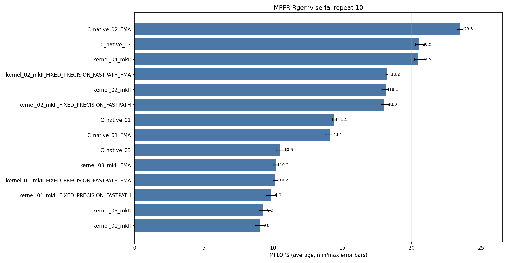
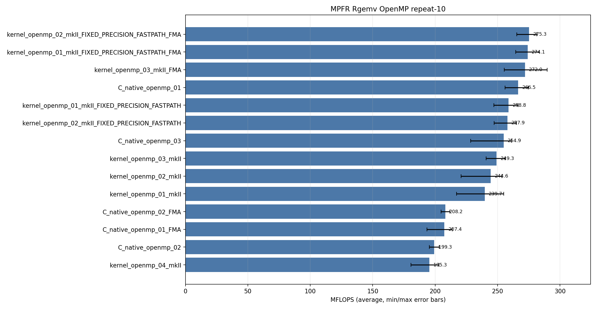

<!-- SPDX-License-Identifier: BSD-2-Clause -->

# 02_Rgemv

This directory benchmarks the MPFR real dense matrix-vector product

```text
y = alpha * A * x + beta * y
```

with raw `mpfr_t` C kernels and `mpfrxx_mkII` expression-template kernels.
The benchmark compares source-level kernel shapes, reusable temporaries,
explicit evaluation contexts, FMA lowering, OpenMP row partitioning, and the
`GMPFRXX_MKII_ASSUME_FIXED_PRECISION_FASTPATH` build option.

## Build

From the repository root:

```bash
cmake -S . -B build_bench_release -DCMAKE_BUILD_TYPE=Release
cmake --build build_bench_release -j
```

Executables are created under:

```text
build_bench_release/benchmarks/mpfr/02_Rgemv/
```

Each executable takes:

```text
<rows m> <cols n> <precision>
```

Example:

```bash
build_bench_release/benchmarks/mpfr/02_Rgemv/Rgemv_mpfr_kernel_04_mkII 4000 4000 512
```

For OpenMP runs, keep affinity explicit:

```bash
OMP_NUM_THREADS=32 OMP_PLACES=cores OMP_PROC_BIND=spread \
build_bench_release/benchmarks/mpfr/02_Rgemv/Rgemv_mpfr_kernel_openmp_03_mkII_FMA \
    4000 4000 512
```

## Benchmark Parameters

| Parameter | Meaning |
|-----------|---------|
| `m` | Number of rows in `A` and length of `y`. |
| `n` | Number of columns in `A` and length of `x`. |
| `precision` | MPFR precision in bits. |

Each executable reports `Elapsed time`, `MFLOPS`, `L1 Norm of difference`,
and `Result OK` / `Result NG`.  MFLOPS is computed from the timed loop as:

```text
2 * m * n / elapsed_seconds / 1e6
```

The correctness reference is `Rgemv()` in `Rgemv.hpp`; the timed hot loop is
`_Rgemv()` in each executable.

Wrapper suffixes:

| Suffix | Meaning |
|--------|---------|
| `mkII` | This header with the default precision and rounding policy. |
| `mkII_FIXED_PRECISION_FASTPATH` | Build with `GMPFRXX_MKII_ASSUME_FIXED_PRECISION_FASTPATH`. |
| `mkII_FIXED_PRECISION_FASTPATH_FMA` | Fixed-precision build plus FMA-enabled expression lowering. |
| `mkII_FMA` | FMA-enabled expression lowering without the fixed-precision build option. |

MPFR differs from the GMP `mpf` benchmark because every arithmetic operation
takes a rounding mode.  The explicit-context variants capture precision and
rounding once outside the hot loop and route compound assignment through
`mpfrxx::with_context`.

## Variant Shapes

The serial kernels include both row-dot and column-AXPY source shapes.  The
OpenMP kernels are row-owned to avoid concurrent writes to `y[i]`; this makes
some OpenMP variants intentionally different from their serial column-AXPY
counterparts.

| Variant | Timed source shape | Temporary/resource policy | Purpose |
|---------|--------------------|---------------------------|---------|
| `01` | Row-dot wrapper: `temp += A[i + j*lda] * x[j]`, then `y[i] = alpha * temp + beta * y[i]`.  Raw C `01` uses column order with direct multiply/add. | Wrapper constructs a row accumulator per row; raw C reuses one `mpfr_t temp`. | Baseline expression/source-shape stress case. |
| `02` | Column AXPY: scale `y`, compute `temp = alpha * x[j]`, then update `y[i] += temp * A[i + j*lda]`. | Reusable `temp` and `templ` objects are initialized outside the loop nest. | Main non-context reusable-temporary path. |
| `03` | Raw C and explicit-context wrapper row-dot: `temp += A[i + j*lda] * x[j]`, then `y[i] = alpha * temp + beta * y[i]`. | Raw C uses one reusable `mpfr_t temp`; wrapper uses one reusable `mpfr_class temp` accessed through `with_context`. | Compare the wrapper FMA path against a raw C `mpfr_fma` accumulation and final `mpfr_fmma`. |
| `04` | Explicit-context column AXPY wrapper: scale `y`, compute `temp = alpha * x[j]`, then `templ = temp * A[...]`, `y += templ`. | Reusable `temp` and `templ` are initialized once and accessed through `with_context`. | Best serial wrapper source shape in this run. |
| `openmp_01` | Row-owned direct row-dot expression. | Each row owns its accumulator; two parallel regions scale `y` and then update rows. | Race-free OpenMP baseline. |
| `openmp_02` | Currently the same row-owned row-dot source shape as `openmp_01`. | Same resource policy as `openmp_01`. | Placeholder for a numbered counterpart; current source should be treated as duplicate of `openmp_01`. |
| `openmp_03` | Explicit-context row-owned row-dot. | One reusable `temp` per thread, accessed through `with_context`. | Best OpenMP wrapper source shape in this run; optional FMA lowers the row accumulation. |
| `openmp_04` | Explicit-context row-owned copy-then-multiply. | Per-thread reusable `temp` and `templ`; recomputes `alpha * x[j]` for each row. | Race-free counterpart to column-AXPY logic, but with less reuse than serial `04`. |

## C Native Equivalent Kernels

The mapping below is based on the timed `_Rgemv()` hot-loop source shape, not
only on matching numeric suffixes.

| C native kernel | Equivalent C++ wrapper kernel(s) | Equivalence notes |
|-----------------|----------------------------------|-------------------|
| `C_native_01` | Closest to `kernel_01_*` and `kernel_openmp_01_*` source class | Raw C uses direct `mpfr_mul`, `mpfr_mul`, `mpfr_add` with one reusable `temp`; the wrapper row-dot expression materializes through the ET evaluator rather than spelling the same C calls directly. |
| `C_native_01_FMA` | Closest to FMA-enabled `kernel_01_*` and `kernel_openmp_01_*` | Raw C replaces the second multiply/add with `mpfr_fma`. |
| `C_native_02` | `kernel_02_*`, serial part of `kernel_04_mkII` | Column AXPY with `temp = alpha * x[j]` hoisted outside the inner row loop. |
| `C_native_02_FMA` | Desired raw C FMA counterpart of the column-AXPY wrapper shape | Best serial raw C result; inner row loop is one `mpfr_fma` after hoisting `temp`. |
| `C_native_03` | `kernel_03_mkII_FMA` | Row-dot raw C path with `mpfr_fma` for `temp += A*x` and `mpfr_fmma` for `y = alpha*temp + beta*y`. |
| `C_native_openmp_01` | `kernel_openmp_01_*`, `kernel_openmp_02_*` | Row-owned dot-product source shape; wrapper `openmp_02` is currently a duplicate of `openmp_01`. |
| `C_native_openmp_01_FMA` | FMA-enabled row-owned direct source class | Raw C row-dot path with explicit `mpfr_fma` in the row loop. |
| `C_native_openmp_02` | Closest to `kernel_openmp_04_mkII` | Row-owned copy-then-multiply; avoids races but recomputes `alpha * x[j]` per row. |
| `C_native_openmp_02_FMA` | FMA raw C counterpart of `kernel_openmp_04_mkII` | Row-owned copy-then-FMA shape; still cannot reuse `alpha * x[j]` across rows. |
| `C_native_openmp_03` | `kernel_openmp_03_mkII_FMA` | Row-owned raw C path with one per-thread `temp`, `mpfr_fma` accumulation, and final `mpfr_fmma`. |

## Recorded Run

The current checked-in MPFR Rgemv data uses:

```text
M = 4000
N = 4000
precision = 512
repeat = 10
OMP_NUM_THREADS = 32
OMP_PLACES = cores
OMP_PROC_BIND = spread
CPU = AMD Ryzen Threadripper 3970X 32-Core Processor
```

Results are stored in:

```text
results_raw/rgemv_mpfr_m4000_n4000_p512_repeat10_20260517_222713/
```

Files:

- [Raw log](results_raw/rgemv_mpfr_m4000_n4000_p512_repeat10_20260517_222713/benchmark_rgemv_mpfr_m4000_n4000_p512_repeat10.log)
- [Raw CSV](results_raw/rgemv_mpfr_m4000_n4000_p512_repeat10_20260517_222713/raw_rgemv_mpfr_m4000_n4000_p512_repeat10.csv)
- [Summary CSV](results_raw/rgemv_mpfr_m4000_n4000_p512_repeat10_20260517_222713/summary_rgemv_mpfr_m4000_n4000_p512_repeat10.csv)

All 28 variants in this recorded run reported `Result OK` in all 10 runs, for
280 successful timed runs.





## Resource or Bandwidth Estimates

These are model estimates derived from MFLOPS, not hardware-counter
measurements.  On this LP64 machine:

```text
sizeof(__mpfr_struct) = 32 bytes
sizeof(mp_limb_t)     = 8 bytes
precision             = 512 bits
active limbs          = 8
active mpfr value     = 32-byte header + 8 limbs * 8 = 96 bytes
```

For one matrix element at 512-bit precision:

```text
A+x active logical GB/s   = MFLOPS * 0.096
A+x+y active logical GB/s = MFLOPS * 0.192
```

`A+x` counts one matrix value and one vector value per two floating-point
operations.  `A+x+y` additionally counts one read and one write of `y` per
matrix element.  Real traffic can differ because `mpfr_t` stores a contiguous
32-byte header whose `_mpfr_d` pointer refers to separately allocated limb
storage, so pointer chasing and cache misses are not represented by these
simple byte formulas.

| Variant | Avg MFLOPS | Max MFLOPS | A+x avg GB/s | A+x+y avg GB/s |
|---------|-----------:|-----------:|-------------:|---------------:|
| `kernel_openmp_02_mkII_FIXED_PRECISION_FASTPATH_FMA` | 275.267 | 281.348 | 26.43 | 52.85 |
| `kernel_openmp_03_mkII_FMA` | 271.960 | 289.735 | 26.11 | 52.22 |
| `C_native_openmp_01` | 266.518 | 274.484 | 25.59 | 51.17 |
| `C_native_openmp_03` | 254.927 | 261.220 | 24.47 | 48.95 |
| `C_native_02_FMA` | 23.526 | 23.723 | 2.26 | 4.52 |
| `kernel_04_mkII` | 20.498 | 21.040 | 1.97 | 3.94 |
| `C_native_03` | 10.532 | 11.007 | 1.01 | 2.02 |

## Serial Results

Main interpretation table:

| Variant | Max MFLOPS | Avg MFLOPS | Min MFLOPS | Interpretation |
|---------|-----------:|-----------:|-----------:|----------------|
| `C_native_02_FMA` | 23.723 | 23.526 | 23.294 | Best serial result; column-AXPY hoists `alpha * x[j]`, then uses one `mpfr_fma` per matrix element. |
| `C_native_02` | 21.047 | 20.538 | 20.298 | Raw non-FMA column-AXPY baseline. |
| `kernel_04_mkII` | 21.040 | 20.498 | 20.205 | Best serial wrapper; explicit context plus reusable `temp`/`templ` avoids repeated default-rounding lookup in the wrapper path. |
| `kernel_02_mkII_FIXED_PRECISION_FASTPATH_FMA` | 18.305 | 18.246 | 18.139 | Fixed precision plus FMA is the best non-context wrapper `02` path in this run. |
| `C_native_01` | 14.593 | 14.415 | 14.304 | Direct raw C multiply/multiply/add source shape. |
| `C_native_03` | 11.007 | 10.532 | 10.235 | Raw C row-dot with `mpfr_fma` accumulation and final `mpfr_fmma`; still loses to column-AXPY traversal. |
| `kernel_03_mkII_FMA` | 10.388 | 10.214 | 10.000 | Explicit-context row-dot FMA path; close to `C_native_03`, but row-dot traversal remains weak in serial column-major storage. |

<details>
<summary>Serial results sorted by Max MFLOPS</summary>

| Rank | Variant | Max MFLOPS | Avg MFLOPS | Min MFLOPS |
|------|---------|-----------:|-----------:|-----------:|
| 1 | `C_native_02_FMA` | 23.723 | 23.526 | 23.294 |
| 2 | `C_native_02` | 21.047 | 20.538 | 20.298 |
| 3 | `kernel_04_mkII` | 21.040 | 20.498 | 20.205 |
| 4 | `kernel_02_mkII_FIXED_PRECISION_FASTPATH` | 18.447 | 18.032 | 17.801 |
| 5 | `kernel_02_mkII` | 18.352 | 18.124 | 17.862 |
| 6 | `kernel_02_mkII_FIXED_PRECISION_FASTPATH_FMA` | 18.305 | 18.246 | 18.139 |
| 7 | `C_native_01` | 14.593 | 14.415 | 14.304 |
| 8 | `C_native_01_FMA` | 14.256 | 14.095 | 13.771 |
| 9 | `C_native_03` | 11.007 | 10.532 | 10.235 |
| 10 | `kernel_03_mkII_FMA` | 10.388 | 10.214 | 10.000 |
| 11 | `kernel_01_mkII_FIXED_PRECISION_FASTPATH_FMA` | 10.380 | 10.172 | 10.008 |
| 12 | `kernel_01_mkII_FIXED_PRECISION_FASTPATH` | 10.245 | 9.873 | 9.482 |
| 13 | `kernel_03_mkII` | 9.866 | 9.305 | 8.966 |
| 14 | `kernel_01_mkII` | 9.423 | 9.035 | 8.710 |

</details>

<details>
<summary>Serial results sorted by Avg MFLOPS</summary>

| Rank | Variant | Max MFLOPS | Avg MFLOPS | Min MFLOPS |
|------|---------|-----------:|-----------:|-----------:|
| 1 | `C_native_02_FMA` | 23.723 | 23.526 | 23.294 |
| 2 | `C_native_02` | 21.047 | 20.538 | 20.298 |
| 3 | `kernel_04_mkII` | 21.040 | 20.498 | 20.205 |
| 4 | `kernel_02_mkII_FIXED_PRECISION_FASTPATH_FMA` | 18.305 | 18.246 | 18.139 |
| 5 | `kernel_02_mkII` | 18.352 | 18.124 | 17.862 |
| 6 | `kernel_02_mkII_FIXED_PRECISION_FASTPATH` | 18.447 | 18.032 | 17.801 |
| 7 | `C_native_01` | 14.593 | 14.415 | 14.304 |
| 8 | `C_native_01_FMA` | 14.256 | 14.095 | 13.771 |
| 9 | `C_native_03` | 11.007 | 10.532 | 10.235 |
| 10 | `kernel_03_mkII_FMA` | 10.388 | 10.214 | 10.000 |
| 11 | `kernel_01_mkII_FIXED_PRECISION_FASTPATH_FMA` | 10.380 | 10.172 | 10.008 |
| 12 | `kernel_01_mkII_FIXED_PRECISION_FASTPATH` | 10.245 | 9.873 | 9.482 |
| 13 | `kernel_03_mkII` | 9.866 | 9.305 | 8.966 |
| 14 | `kernel_01_mkII` | 9.423 | 9.035 | 8.710 |

</details>

## OpenMP Results

Main interpretation table:

| Variant | Max MFLOPS | Avg MFLOPS | Min MFLOPS | Interpretation |
|---------|-----------:|-----------:|-----------:|----------------|
| `kernel_openmp_02_mkII_FIXED_PRECISION_FASTPATH_FMA` | 281.348 | 275.267 | 265.305 | Best OpenMP average in this run; current source duplicates the row-dot class but adds fixed precision and FMA. |
| `kernel_openmp_01_mkII_FIXED_PRECISION_FASTPATH_FMA` | 283.612 | 274.098 | 264.623 | Same row-dot source class as `openmp_02`; close to the best average. |
| `kernel_openmp_03_mkII_FMA` | 289.735 | 271.960 | 255.352 | Best OpenMP maximum; explicit-context row-dot path with FMA lowering. |
| `C_native_openmp_01` | 274.484 | 266.518 | 256.062 | Best raw C OpenMP average in this run. |
| `C_native_openmp_03` | 261.220 | 254.927 | 228.386 | Raw C row-dot with `mpfr_fma` accumulation and final `mpfr_fmma`; useful comparison point for wrapper `openmp_03`. |
| `kernel_openmp_03_mkII` | 256.047 | 249.266 | 240.922 | Explicit-context row-dot without FMA. |
| `kernel_openmp_04_mkII` | 203.013 | 195.329 | 180.576 | Explicit-context copy-then-multiply row-owned path; less reuse than serial `04`. |

<details>
<summary>OpenMP results sorted by Max MFLOPS</summary>

| Rank | Variant | Max MFLOPS | Avg MFLOPS | Min MFLOPS |
|------|---------|-----------:|-----------:|-----------:|
| 1 | `kernel_openmp_03_mkII_FMA` | 289.735 | 271.960 | 255.352 |
| 2 | `kernel_openmp_01_mkII_FIXED_PRECISION_FASTPATH_FMA` | 283.612 | 274.098 | 264.623 |
| 3 | `kernel_openmp_02_mkII_FIXED_PRECISION_FASTPATH_FMA` | 281.348 | 275.267 | 265.305 |
| 4 | `C_native_openmp_01` | 274.484 | 266.518 | 256.062 |
| 5 | `kernel_openmp_01_mkII_FIXED_PRECISION_FASTPATH` | 266.460 | 258.793 | 247.048 |
| 6 | `kernel_openmp_02_mkII_FIXED_PRECISION_FASTPATH` | 265.224 | 257.861 | 247.165 |
| 7 | `C_native_openmp_03` | 261.220 | 254.927 | 228.386 |
| 8 | `kernel_openmp_03_mkII` | 256.047 | 249.266 | 240.922 |
| 9 | `kernel_openmp_01_mkII` | 254.890 | 239.685 | 217.228 |
| 10 | `kernel_openmp_02_mkII` | 253.484 | 244.569 | 220.789 |
| 11 | `C_native_openmp_01_FMA` | 213.711 | 207.426 | 193.510 |
| 12 | `C_native_openmp_02_FMA` | 211.869 | 208.177 | 204.868 |
| 13 | `C_native_openmp_02` | 203.180 | 199.311 | 195.472 |
| 14 | `kernel_openmp_04_mkII` | 203.013 | 195.329 | 180.576 |

</details>

<details>
<summary>OpenMP results sorted by Avg MFLOPS</summary>

| Rank | Variant | Max MFLOPS | Avg MFLOPS | Min MFLOPS |
|------|---------|-----------:|-----------:|-----------:|
| 1 | `kernel_openmp_02_mkII_FIXED_PRECISION_FASTPATH_FMA` | 281.348 | 275.267 | 265.305 |
| 2 | `kernel_openmp_01_mkII_FIXED_PRECISION_FASTPATH_FMA` | 283.612 | 274.098 | 264.623 |
| 3 | `kernel_openmp_03_mkII_FMA` | 289.735 | 271.960 | 255.352 |
| 4 | `C_native_openmp_01` | 274.484 | 266.518 | 256.062 |
| 5 | `kernel_openmp_01_mkII_FIXED_PRECISION_FASTPATH` | 266.460 | 258.793 | 247.048 |
| 6 | `kernel_openmp_02_mkII_FIXED_PRECISION_FASTPATH` | 265.224 | 257.861 | 247.165 |
| 7 | `C_native_openmp_03` | 261.220 | 254.927 | 228.386 |
| 8 | `kernel_openmp_03_mkII` | 256.047 | 249.266 | 240.922 |
| 9 | `kernel_openmp_02_mkII` | 253.484 | 244.569 | 220.789 |
| 10 | `kernel_openmp_01_mkII` | 254.890 | 239.685 | 217.228 |
| 11 | `C_native_openmp_02_FMA` | 211.869 | 208.177 | 204.868 |
| 12 | `C_native_openmp_01_FMA` | 213.711 | 207.426 | 193.510 |
| 13 | `C_native_openmp_02` | 203.180 | 199.311 | 195.472 |
| 14 | `kernel_openmp_04_mkII` | 203.013 | 195.329 | 180.576 |

</details>

## Hotpath Disassembly

The snippets below show the representative call structure observed in the
recorded Release build.  Addresses are build-local and are not API.

### `C_native_02_FMA`

Raw C column-AXPY FMA is the best serial baseline.  It loads the default
rounding mode once, hoists `temp = alpha * x[j]`, and the inner row loop is one
`mpfr_fma` per matrix element.

```asm
call   mpfr_get_default_rounding_mode@plt
call   mpfr_init2@plt
...
call   mpfr_mul@plt        # y[i] *= beta
...
call   mpfr_set@plt        # temp = alpha
call   mpfr_mul@plt        # temp *= x[j]
...
call   mpfr_fma@plt        # y[i] = temp * A[i+j*lda] + y[i]
...
call   mpfr_clear@plt
```

### `C_native_03` and `C_native_openmp_03`

Raw C `03` is the direct comparison target for the wrapper `03` FMA path.  The
serial version performs one `mpfr_set_d` per row, one `mpfr_fma` per matrix
element in the row dot product, and one final `mpfr_fmma` per row.  The OpenMP
version keeps the same hot loop with one private `temp` per thread.

```asm
call   mpfr_init2@plt
call   mpfr_get_default_rounding_mode@plt
call   mpfr_set_d@plt      # temp = 0
...
call   mpfr_fma@plt        # temp += A[i+j*lda] * x[j]
...
call   mpfr_fmma@plt       # y = alpha * temp + beta * y
call   mpfr_clear@plt
```

### `kernel_openmp_03_mkII_FMA`

This is the explicit-context OpenMP wrapper and the maximum-MFLOPS wrapper in
the recorded run.  The OpenMP worker initializes one per-thread `temp`,
captures rounding through the explicit context, and the row-dot accumulation
lowers to `mpfr_fma`.  The final assignment can lower to `mpfr_fmma` in the
FMA build.

```asm
call   mpfr_init2@plt
call   mpfr_get_default_rounding_mode@plt
call   mpfr_set_d@plt      # temp = 0
...
call   mpfr_fma@plt        # temp += A[i+j*lda] * x[j]
...
call   mpfr_fmma@plt       # y = alpha * temp + beta * y
call   GOMP_barrier@plt
call   mpfr_clear@plt
```

### `kernel_04_mkII`

This is the best serial wrapper.  Its source is closest to the raw C `02`
column-AXPY family, but it uses explicit context wrappers around the reusable
`temp`, `templ`, and destination `y[i]`.  The important difference from the
row-dot `03` source shape is that `alpha * x[j]` is computed once per column
and reused for every row.

```asm
call   mpfr_get_default_rounding_mode@plt
call   mpfr_init2@plt      # temp
call   mpfr_init2@plt      # templ
...
call   mpfr_mul@plt        # y[i] *= beta
...
call   mpfr_set@plt        # temp = alpha
call   mpfr_mul@plt        # temp *= x[j]
...
call   mpfr_set@plt        # templ = temp
call   mpfr_mul@plt        # templ *= A[i+j*lda]
call   mpfr_add@plt        # y[i] += templ
```

## Lessons Learned

Serial MPFR Rgemv is source-shape sensitive.  The column-AXPY shape wins
because it hoists `alpha * x[j]` outside the inner row loop and streams
column-major `A` contiguously.  Raw `C_native_02_FMA` is the best serial result
because the inner row loop is reduced to one `mpfr_fma` call.

Explicit context matters, but it does not compensate for a poor traversal by
itself.  `kernel_04_mkII` is the best serial wrapper because it combines the
good column-AXPY traversal with loop-invariant precision and rounding.  The
explicit-context row-dot `kernel_03_mkII_FMA` still loses in serial because it
walks column-major `A` with a large stride for each row.

OpenMP changes the tradeoff.  Row-owned loops avoid concurrent writes to
`y[i]`.  In this run the best OpenMP average is
`kernel_openmp_02_mkII_FIXED_PRECISION_FASTPATH_FMA`, while the best OpenMP
maximum is `kernel_openmp_03_mkII_FMA`.  The gap is small enough that it should
be treated as a source-shape plus OpenMP-variability result, not as a stable
proof that one path always dominates.  Use average MFLOPS for ranking and max
MFLOPS for peak-path inspection.

`openmp_04` is not a direct parallelization of serial `04`.  A direct
column-AXPY OpenMP loop would race on `y[i]`; the current race-free row-owned
version recomputes `alpha * x[j]` for every row, so it is much slower than the
best row-dot OpenMP variants.

Compared with the GMP `mpf` Rgemv benchmark, MPFR has an extra rounding-mode
dimension in every arithmetic call.  The explicit-context path is therefore a
real optimization target, but the dominant factors remain source shape,
temporary reuse, and whether the generated hot loop reaches `mpfr_fma`.
