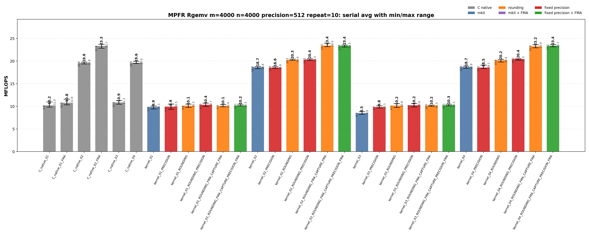
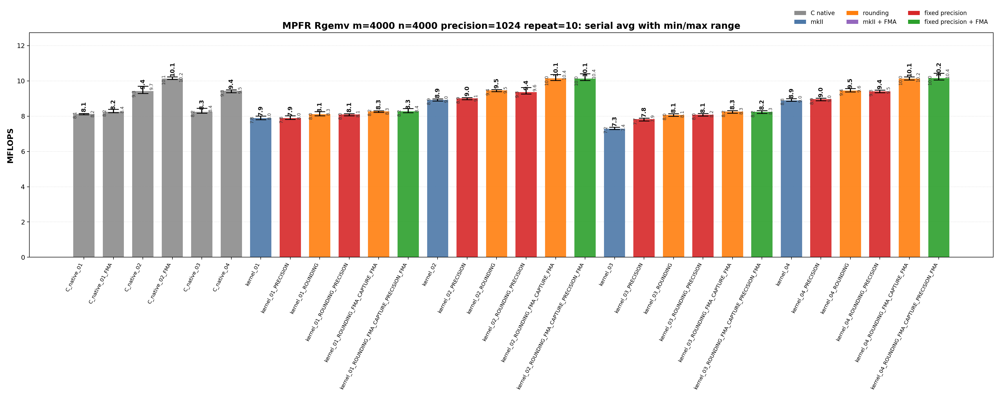
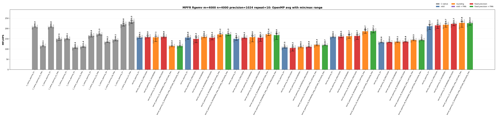

<!-- SPDX-License-Identifier: BSD-2-Clause -->

# 02_Rgemv

This directory benchmarks the MPFR real dense matrix-vector product

```text
y <- alpha * A * x + beta * y
```

with raw MPFR C kernels and `mpfrxx::mpfr_class` wrapper kernels. The
performance question is whether wrapper source shapes can reach the same
hot-loop class as raw MPFR C when rounding, fixed precision, FMA, and OpenMP
partitioning are controlled.

## Build

From the repository root:

```bash
cmake -S . -B build_bench_release -DCMAKE_BUILD_TYPE=Release
cmake --build build_bench_release -j
```

Executables are created under:

```text
build_bench_release/benchmarks/mpfr/02_Rgemv/
```

Each executable takes `<rows m> <cols n> <precision>`. Example:

```bash
build_bench_release/benchmarks/mpfr/02_Rgemv/Rgemv_mpfr_kernel_openmp_07_ROUNDING_FMA_CAPTURE_PRECISION_FMA 4000 4000 512
```

The repeat-10 runner uses the same source/build taxonomy:

```bash
OMP_NUM_THREADS=32 OMP_PLACES=cores OMP_PROC_BIND=spread \
    benchmarks/mpfr/02_Rgemv/run_repeat.sh build_bench_release 4000 4000 512 10
```

MPFR Rgemv wrapper targets omit a separate `mkII` implementation suffix because
this directory has only the mkII wrapper implementation.  The target suffixes
separate source changes from build flags:

| Suffix | Kind | Meaning |
|--------|------|---------|
| none | source baseline | Ordinary wrapper source for the numbered algorithm. |
| `ROUNDING` | source modifier | Captures an explicit `mpfr_rnd_t` before the loop and uses `with_rounding` in the timed body.  No compile-time flag is implied. |
| `ROUNDING_FMA_CAPTURE` | source modifier | Uses the same loop-external rounding and spells the inner update as an expression that can be captured by the ET FMA path. |
| `PRECISION` | build modifier | Builds the same source with `GMPFRXX_MKII_FAST_FIXED_PREC`. |
| final `FMA` | build modifier | Builds the FMA-capturable source with `GMPFRXX_MKII_ENABLE_FMA`. |

The C native targets encode FMA directly in their source, so they do not split
into `ROUNDING` and non-`ROUNDING` forms.

The cross-benchmark runner can execute the GMP and MPFR `00_Rdot`, `01_Raxpy`, and `02_Rgemv` suites for both standard precisions with one command:

```bash
OMP_NUM_THREADS=32 OMP_PLACES=cores OMP_PROC_BIND=spread \
    benchmarks/run_all.sh build_bench_release 512,1024 10 10000000 10000000 4000 4000
```

The second argument is a precision list. `both` and `all` are aliases for `512,1024`; a single value such as `512` still runs only that precision. Per-benchmark results are written to `results_raw/run_all_p512_repeat10_<timestamp>/` and `results_raw/run_all_p1024_repeat10_<timestamp>/` under each benchmark directory.

## Benchmark Parameters

| Parameter | Meaning |
| --- | --- |
| `m` | Number of matrix rows and length of `y`. |
| `n` | Number of matrix columns and length of `x`. |
| `precision` | MPFR precision in bits for matrix/vector/scalar inputs and temporaries. |
| `repeat` | Number of timed process executions per executable. |
| `OMP_NUM_THREADS` | OpenMP worker count for `openmp` executables. |
| `OMP_PLACES`, `OMP_PROC_BIND` | OpenMP affinity controls used by the runner. |

The committed runs use `m=4000`, `n=4000`, `repeat=10`, `precision=512` and `precision=1024`, with `OMP_NUM_THREADS=32`, `OMP_PLACES=cores`, and `OMP_PROC_BIND=spread`.

## Variant Shapes

The timed body is `_Rgemv()`. `A` is stored in column-major order.  The numbered
variant table names the source-level transition being measured.  Some variants branch from an earlier comparison point, so the transition column names the baseline explicitly.  `ROUNDING`,
`ROUNDING_FMA_CAPTURE`, `PRECISION`, and final `FMA` suffixes modify the same
numbered shape without changing the variant number.

| Variant | Transition from previous variant | Timed source shape | Temporary/resource policy | Purpose |
|---------|----------------------------------|--------------------|---------------------------|---------|
| `01` | Starting point. | Row-dot form: for each row `i`, accumulate `sum_j A[i+j*lda] * x[j]`, then update `y[i]`. | Reusable row accumulator and reusable product object. | Baseline row-owned Rgemv spelling; exposes the cost of strided column-major `A` access. |
| `02` | `01 -> 02`: change traversal from row-dot to column-major streaming. | Scale `y`, then stream columns of `A` and update all rows for each `j`. | Reusable `temp = alpha * x[j]` and reusable `templ = temp * A[i+j*lda]`. | Separates wrapper overhead from the dominant `A` access pattern and avoids FMA as a confounder. |
| `03` | `01 -> 03`: keep the row-dot traversal and switch from a reusable product temporary to an FMA-capturable expression spelling. | Row-dot direct-expression form: `temp += A[i+j*lda] * x[j]`, then `y[i] = alpha * temp + beta * y[i]`. | Reusable accumulator; expression product is FMA-capturable only in the `ROUNDING_FMA_CAPTURE` source. | Tests whether ET fusion can reach the raw C row-dot `mpfr_fma` / `mpfr_fmma` class. |
| `04` | `02 -> 04`: keep the column-major reusable-temporary traversal and add the explicit rounding comparison path. | Column-major reusable-temporary form; the base source intentionally remains in the same hot-loop class as `02`. | Reusable `temp` and `templ`; `ROUNDING` variants route all updates through a loop-external rounding. | Measures whether explicit rounding capture changes the reusable-temp column-major class without mixing in traversal or expression-shape changes. |
| `05` | `04 -> 05`: add OpenMP row partitioning and precompute `alpha * x`. | OpenMP row partition with precomputed `scaled_x[j] = alpha * x[j]`. | Precomputed scaled vector plus per-thread reusable product. | Removes repeated column-scalar work while each thread owns rows of `y`. |
| `06` | `05 -> 06`: add fixed 256-row blocking inside the row-owned OpenMP shape. | OpenMP 256-row blocks with column loop and contiguous row loop inside each block. | Per-thread reusable scratch; no shared-y race inside a block. | Trades extra loop structure for better locality in row-owned OpenMP code. |
| `07` | `06 -> 07`: switch from row ownership to column partitioning with reduction. | OpenMP column partition with per-thread partial `y` vectors and final reduction. | `num_threads * m` partial accumulators plus final reduction outside the hot column loop. | Preserves serial-like column-major `A` streaming without racing on `y`. |

Serial wrapper executables cover variants `01`-`04`; OpenMP wrapper executables
cover variants `01`-`07`.

## Source Transitions

The transition table above is intentionally source-level, but not strictly linear.  A variant number
changes the source algorithm; suffixes then ask separate questions about
rounding capture, FMA capture, and fixed precision.

For each applicable wrapper source, the generated target family is:

```text
<base>
<base>_PRECISION
<base>_ROUNDING
<base>_ROUNDING_PRECISION
<base>_ROUNDING_FMA_CAPTURE_FMA
<base>_ROUNDING_FMA_CAPTURE_PRECISION_FMA
```

The `ROUNDING_FMA_CAPTURE` source is only built as an FMA target because its
purpose is to test ET FMA lowering.  Non-FMA reusable-temporary variants remain
separate so they continue to match raw C kernels that avoid local allocation
without using FMA.

## C Native Equivalent Kernels

The mapping is based on the timed `_Rgemv()` source shape and generated hot
loop, not just on matching numeric suffixes.  Raw C kernels encode rounding and
FMA directly; wrapper kernels use suffixes to isolate those effects.

| C native kernel | Equivalent C++ wrapper kernel(s) | Equivalence basis |
|-----------------|----------------------------------|-------------------|
| `C_native_01` | `kernel_01`, `kernel_01_PRECISION` | Row-dot source with reusable row accumulator and product temporary. |
| `C_native_01_FMA` | `kernel_01_ROUNDING_FMA_CAPTURE_FMA`, `kernel_01_ROUNDING_FMA_CAPTURE_PRECISION_FMA` | Same row-dot algorithm, but the wrapper source uses rounding capture and an FMA-capturable expression. |
| `C_native_02` | `kernel_02`, `kernel_02_PRECISION`, `kernel_02_ROUNDING`, `kernel_02_ROUNDING_PRECISION` | Column-major reusable `temp`/`templ` source, intentionally non-FMA. |
| `C_native_02_FMA` | `kernel_02_ROUNDING_FMA_CAPTURE_FMA`, `kernel_02_ROUNDING_FMA_CAPTURE_PRECISION_FMA` | Column-major update with an FMA-capturable row update. |
| `C_native_03` | `kernel_03_ROUNDING_FMA_CAPTURE_FMA`, `kernel_03_ROUNDING_FMA_CAPTURE_PRECISION_FMA` | Row-dot FMA-style accumulation.  Raw C also uses `mpfr_fmma` for the final alpha/beta update. |
| `C_native_04` | `kernel_04`, `kernel_04_PRECISION`, `kernel_04_ROUNDING`, `kernel_04_ROUNDING_PRECISION` | Serial column-major reusable-temporary comparison point. |
| `C_native_openmp_NN` | `kernel_openmp_NN`, `kernel_openmp_NN_PRECISION`, `kernel_openmp_NN_ROUNDING`, `kernel_openmp_NN_ROUNDING_PRECISION` | Same OpenMP partitioning and non-FMA temporary policy as raw C variant `NN`. |
| `C_native_openmp_NN_FMA` | `kernel_openmp_NN_ROUNDING_FMA_CAPTURE_FMA`, `kernel_openmp_NN_ROUNDING_FMA_CAPTURE_PRECISION_FMA` | Same OpenMP partitioning as raw C variant `NN`, with FMA-capturable wrapper source and FMA-enabled build. |

The closest hot-loop comparison for the best historical OpenMP class is
`C_native_openmp_07_FMA` against
`kernel_openmp_07_ROUNDING_FMA_CAPTURE_PRECISION_FMA`.

## Recorded Run

### 512-bit run

| Field | Value |
|-------|-------|
| Run ID | `run_all_p512_repeat10_20260527_094954` |
| Date | 2026-05-27 |
| CPU | AMD Ryzen Threadripper 3970X 32-Core Processor |
| OS | Linux 6.8.0-94-generic x86_64 |
| Compiler | `c++ (Ubuntu 15.2.0-16ubuntu1) 15.2.0` |
| Build type | Release |
| Problem size | `m=4000`, `n=4000` |
| Precision | 512 bits |
| Repeat count | 10 |
| OpenMP | `OMP_NUM_THREADS=32`, `OMP_PLACES=cores`, `OMP_PROC_BIND=spread` |
| Default precision env | `MPFRXX_DEFAULT_PRECISION_BITS=512` |
| Benchmark command | `OMP_NUM_THREADS=32 OMP_PLACES=cores OMP_PROC_BIND=spread benchmarks/run_all.sh build_bench_release 512,1024 10` |
| Raw result directory | `benchmarks/mpfr/02_Rgemv/results_raw/run_all_p512_repeat10_20260527_094954/` |
| Raw log | `benchmarks/mpfr/02_Rgemv/results_raw/run_all_p512_repeat10_20260527_094954/benchmark_rgemv_mpfr_m4000_n4000_p512_repeat10.log` |
| Raw CSV | `benchmarks/mpfr/02_Rgemv/results_raw/run_all_p512_repeat10_20260527_094954/raw_rgemv_mpfr_m4000_n4000_p512_repeat10.csv` |
| Summary CSV | `benchmarks/mpfr/02_Rgemv/results_raw/run_all_p512_repeat10_20260527_094954/summary_rgemv_mpfr_m4000_n4000_p512_repeat10.csv` |
| Correctness | 850 / 850 runs reported OK. |




Plot regeneration command:

```bash
python3 benchmarks/mpfr/02_Rgemv/plot_repeat_summary.py \
    benchmarks/mpfr/02_Rgemv/results_raw/run_all_p512_repeat10_20260527_094954/benchmark_rgemv_mpfr_m4000_n4000_p512_repeat10.log \
    --output-dir benchmarks/mpfr/02_Rgemv/results_raw/run_all_p512_repeat10_20260527_094954 \
    --output-prefix rgemv_mpfr_m4000_n4000_p512_repeat10 \
    --title-prefix "MPFR Rgemv m=4000, n=4000, precision=512, repeat=10"
```

### 1024-bit run

| Field | Value |
|-------|-------|
| Run ID | `run_all_p1024_repeat10_20260527_094954` |
| Date | 2026-05-27 |
| CPU | AMD Ryzen Threadripper 3970X 32-Core Processor |
| OS | Linux 6.8.0-94-generic x86_64 |
| Compiler | `c++ (Ubuntu 15.2.0-16ubuntu1) 15.2.0` |
| Build type | Release |
| Problem size | `m=4000`, `n=4000` |
| Precision | 1024 bits |
| Repeat count | 10 |
| OpenMP | `OMP_NUM_THREADS=32`, `OMP_PLACES=cores`, `OMP_PROC_BIND=spread` |
| Default precision env | `MPFRXX_DEFAULT_PRECISION_BITS=1024` |
| Benchmark command | `OMP_NUM_THREADS=32 OMP_PLACES=cores OMP_PROC_BIND=spread benchmarks/run_all.sh build_bench_release 512,1024 10` |
| Raw result directory | `benchmarks/mpfr/02_Rgemv/results_raw/run_all_p1024_repeat10_20260527_094954/` |
| Raw log | `benchmarks/mpfr/02_Rgemv/results_raw/run_all_p1024_repeat10_20260527_094954/benchmark_rgemv_mpfr_m4000_n4000_p1024_repeat10.log` |
| Raw CSV | `benchmarks/mpfr/02_Rgemv/results_raw/run_all_p1024_repeat10_20260527_094954/raw_rgemv_mpfr_m4000_n4000_p1024_repeat10.csv` |
| Summary CSV | `benchmarks/mpfr/02_Rgemv/results_raw/run_all_p1024_repeat10_20260527_094954/summary_rgemv_mpfr_m4000_n4000_p1024_repeat10.csv` |
| Correctness | 850 / 850 runs reported OK. |





Plot regeneration command:

```bash
python3 benchmarks/mpfr/02_Rgemv/plot_repeat_summary.py \
    benchmarks/mpfr/02_Rgemv/results_raw/run_all_p1024_repeat10_20260527_094954/benchmark_rgemv_mpfr_m4000_n4000_p1024_repeat10.log \
    --output-dir benchmarks/mpfr/02_Rgemv/results_raw/run_all_p1024_repeat10_20260527_094954 \
    --output-prefix rgemv_mpfr_m4000_n4000_p1024_repeat10 \
    --title-prefix "MPFR Rgemv m=4000, n=4000, precision=1024, repeat=10"
```

## Resource or Bandwidth Estimates

The values below are model estimates derived from MFLOPS, not hardware-counter measurements. They count active limb bytes plus a header-inclusive object model. They exclude allocator metadata, cache-line overfetch, instruction fetch, and final OpenMP reduction traffic.

| Case | Representative best-avg variant | Avg MFLOPS | Active bytes/iteration | Header-inclusive bytes/iteration | Active GB/s | Header-inclusive GB/s |
| --- | --- | --- | --- | --- | --- | --- |
| 512-bit serial | `kernel_02_ROUNDING_FMA_CAPTURE_FMA` | 23.408 | 192 | 288 | 2.247 | 3.371 |
| 512-bit OpenMP | `kernel_openmp_07_ROUNDING_PRECISION` | 443.905 | 192 | 288 | 42.615 | 63.922 |
| 1024-bit serial | `kernel_04_ROUNDING_FMA_CAPTURE_PRECISION_FMA` | 10.152 | 384 | 480 | 1.949 | 2.437 |
| 1024-bit OpenMP | `C_native_openmp_07_FMA` | 233.270 | 384 | 480 | 44.788 | 55.985 |

For `Rgemv`, the per-iteration byte model is a compact arithmetic-stream estimate. It is not a full cache-footprint or hardware-bandwidth measurement.

## Headline Results

The headline rows below are regenerated from the committed 512-bit and 1024-bit `run_all` summary CSV files.

| Precision | Class | Variant | Max MFLOPS | Avg MFLOPS | Interpretation |
| --- | --- | --- | --- | --- | --- |
| 512 | Best max serial | `kernel_02_ROUNDING_FMA_CAPTURE_FMA` | 23.959 | 23.408 | Wrapper source with loop-external rounding and FMA-capturable spelling. |
| 512 | Best average serial | `kernel_02_ROUNDING_FMA_CAPTURE_FMA` | 23.959 | 23.408 | Wrapper source with loop-external rounding and FMA-capturable spelling. |
| 512 | Best max OpenMP | `C_native_openmp_07` | 456.803 | 441.707 | Raw C OpenMP column-partitioned class with per-thread partial vectors and final reduction outside the hot loop. |
| 512 | Best average OpenMP | `kernel_openmp_07_ROUNDING_PRECISION` | 455.524 | 443.905 | Wrapper source captures rounding outside the loop and uses the fixed-precision build. |
| 1024 | Best max serial | `kernel_04_ROUNDING_FMA_CAPTURE_PRECISION_FMA` | 10.434 | 10.152 | Wrapper source with loop-external rounding, FMA-capturable spelling, and fixed-precision FMA build. |
| 1024 | Best average serial | `kernel_04_ROUNDING_FMA_CAPTURE_PRECISION_FMA` | 10.434 | 10.152 | Wrapper source with loop-external rounding, FMA-capturable spelling, and fixed-precision FMA build. |
| 1024 | Best max OpenMP | `C_native_openmp_07_FMA` | 239.287 | 233.270 | Raw C OpenMP column-partitioned class with per-thread partial vectors and final reduction outside the hot loop. |
| 1024 | Best average OpenMP | `C_native_openmp_07_FMA` | 239.287 | 233.270 | Raw C OpenMP column-partitioned class with per-thread partial vectors and final reduction outside the hot loop. |

## Serial Results

### 512-bit serial interpretation

These rows are derived from `benchmarks/mpfr/02_Rgemv/results_raw/run_all_p512_repeat10_20260527_094954/summary_rgemv_mpfr_m4000_n4000_p512_repeat10.csv`.

| Observation | Variant | Max MFLOPS | Avg MFLOPS | Min MFLOPS | Interpretation |
| --- | --- | --- | --- | --- | --- |
| Best raw C average | `C_native_02_FMA` | 23.711 | 23.349 | 22.843 | Raw C FMA reference; the hot loop uses the fused backend operation where the source shape permits it. |
| Best wrapper baseline average | `kernel_04` | 18.882 | 18.682 | 18.437 | Wrapper baseline for the numbered source shape. |
| Best wrapper rounding average | `kernel_04_ROUNDING_PRECISION` | 20.513 | 20.434 | 20.224 | Wrapper source captures rounding outside the loop and uses the fixed-precision build. |
| Best wrapper precision average | `kernel_04_ROUNDING_PRECISION` | 20.513 | 20.434 | 20.224 | Wrapper source captures rounding outside the loop and uses the fixed-precision build. |
| Best wrapper FMA average | `kernel_02_ROUNDING_FMA_CAPTURE_FMA` | 23.959 | 23.408 | 23.197 | Wrapper source with loop-external rounding and FMA-capturable spelling. |
| Best max | `kernel_02_ROUNDING_FMA_CAPTURE_FMA` | 23.959 | 23.408 | 23.197 | Wrapper source with loop-external rounding and FMA-capturable spelling. |

<details>
<summary>512-bit serial results sorted by Max MFLOPS</summary>

| Rank | Variant | Max MFLOPS | Avg MFLOPS | Min MFLOPS |
| --- | --- | --- | --- | --- |
| 1 | `kernel_02_ROUNDING_FMA_CAPTURE_FMA` | 23.959 | 23.408 | 23.197 |
| 2 | `C_native_02_FMA` | 23.711 | 23.349 | 22.843 |
| 3 | `kernel_04_ROUNDING_FMA_CAPTURE_PRECISION_FMA` | 23.664 | 23.373 | 23.164 |
| 4 | `kernel_04_ROUNDING_FMA_CAPTURE_FMA` | 23.616 | 23.246 | 22.945 |
| 5 | `kernel_02_ROUNDING_FMA_CAPTURE_PRECISION_FMA` | 23.547 | 23.377 | 23.132 |
| 6 | `kernel_02_ROUNDING_PRECISION` | 20.532 | 20.353 | 20.165 |
| 7 | `kernel_04_ROUNDING_PRECISION` | 20.513 | 20.434 | 20.224 |
| 8 | `kernel_02_ROUNDING` | 20.443 | 20.292 | 20.175 |
| 9 | `kernel_04_ROUNDING` | 20.380 | 20.173 | 19.803 |
| 10 | `C_native_04` | 19.988 | 19.649 | 19.459 |
| 11 | `C_native_02` | 19.787 | 19.619 | 19.376 |
| 12 | `kernel_04_PRECISION` | 19.137 | 18.542 | 18.346 |
| 13 | `kernel_04` | 18.882 | 18.682 | 18.437 |
| 14 | `kernel_02` | 18.842 | 18.661 | 18.319 |
| 15 | `kernel_02_PRECISION` | 18.759 | 18.566 | 18.374 |
| 16 | `C_native_01_FMA` | 11.593 | 10.776 | 10.338 |
| 17 | `C_native_03` | 11.294 | 10.853 | 10.474 |
| 18 | `C_native_01` | 11.009 | 10.230 | 9.831 |
| 19 | `kernel_01_ROUNDING_PRECISION` | 10.708 | 10.367 | 10.023 |
| 20 | `kernel_03_ROUNDING` | 10.613 | 10.174 | 9.735 |
| 21 | `kernel_03_ROUNDING_PRECISION` | 10.611 | 10.235 | 9.894 |
| 22 | `kernel_01_PRECISION` | 10.534 | 9.931 | 9.380 |
| 23 | `kernel_01_ROUNDING` | 10.531 | 10.146 | 9.764 |
| 24 | `kernel_03_ROUNDING_FMA_CAPTURE_PRECISION_FMA` | 10.500 | 10.296 | 10.104 |
| 25 | `kernel_01_ROUNDING_FMA_CAPTURE_PRECISION_FMA` | 10.482 | 10.226 | 10.101 |
| 26 | `kernel_01_ROUNDING_FMA_CAPTURE_FMA` | 10.376 | 10.095 | 9.902 |
| 27 | `kernel_03_ROUNDING_FMA_CAPTURE_FMA` | 10.294 | 10.176 | 10.008 |
| 28 | `kernel_03_PRECISION` | 10.120 | 9.845 | 9.655 |
| 29 | `kernel_01` | 10.097 | 9.867 | 9.425 |
| 30 | `kernel_03` | 8.828 | 8.509 | 8.261 |

</details>

<details>
<summary>512-bit serial results sorted by Avg MFLOPS</summary>

| Rank | Variant | Max MFLOPS | Avg MFLOPS | Min MFLOPS |
| --- | --- | --- | --- | --- |
| 1 | `kernel_02_ROUNDING_FMA_CAPTURE_FMA` | 23.959 | 23.408 | 23.197 |
| 2 | `kernel_02_ROUNDING_FMA_CAPTURE_PRECISION_FMA` | 23.547 | 23.377 | 23.132 |
| 3 | `kernel_04_ROUNDING_FMA_CAPTURE_PRECISION_FMA` | 23.664 | 23.373 | 23.164 |
| 4 | `C_native_02_FMA` | 23.711 | 23.349 | 22.843 |
| 5 | `kernel_04_ROUNDING_FMA_CAPTURE_FMA` | 23.616 | 23.246 | 22.945 |
| 6 | `kernel_04_ROUNDING_PRECISION` | 20.513 | 20.434 | 20.224 |
| 7 | `kernel_02_ROUNDING_PRECISION` | 20.532 | 20.353 | 20.165 |
| 8 | `kernel_02_ROUNDING` | 20.443 | 20.292 | 20.175 |
| 9 | `kernel_04_ROUNDING` | 20.380 | 20.173 | 19.803 |
| 10 | `C_native_04` | 19.988 | 19.649 | 19.459 |
| 11 | `C_native_02` | 19.787 | 19.619 | 19.376 |
| 12 | `kernel_04` | 18.882 | 18.682 | 18.437 |
| 13 | `kernel_02` | 18.842 | 18.661 | 18.319 |
| 14 | `kernel_02_PRECISION` | 18.759 | 18.566 | 18.374 |
| 15 | `kernel_04_PRECISION` | 19.137 | 18.542 | 18.346 |
| 16 | `C_native_03` | 11.294 | 10.853 | 10.474 |
| 17 | `C_native_01_FMA` | 11.593 | 10.776 | 10.338 |
| 18 | `kernel_01_ROUNDING_PRECISION` | 10.708 | 10.367 | 10.023 |
| 19 | `kernel_03_ROUNDING_FMA_CAPTURE_PRECISION_FMA` | 10.500 | 10.296 | 10.104 |
| 20 | `kernel_03_ROUNDING_PRECISION` | 10.611 | 10.235 | 9.894 |
| 21 | `C_native_01` | 11.009 | 10.230 | 9.831 |
| 22 | `kernel_01_ROUNDING_FMA_CAPTURE_PRECISION_FMA` | 10.482 | 10.226 | 10.101 |
| 23 | `kernel_03_ROUNDING_FMA_CAPTURE_FMA` | 10.294 | 10.176 | 10.008 |
| 24 | `kernel_03_ROUNDING` | 10.613 | 10.174 | 9.735 |
| 25 | `kernel_01_ROUNDING` | 10.531 | 10.146 | 9.764 |
| 26 | `kernel_01_ROUNDING_FMA_CAPTURE_FMA` | 10.376 | 10.095 | 9.902 |
| 27 | `kernel_01_PRECISION` | 10.534 | 9.931 | 9.380 |
| 28 | `kernel_01` | 10.097 | 9.867 | 9.425 |
| 29 | `kernel_03_PRECISION` | 10.120 | 9.845 | 9.655 |
| 30 | `kernel_03` | 8.828 | 8.509 | 8.261 |

</details>

### 1024-bit serial interpretation

These rows are derived from `benchmarks/mpfr/02_Rgemv/results_raw/run_all_p1024_repeat10_20260527_094954/summary_rgemv_mpfr_m4000_n4000_p1024_repeat10.csv`.

| Observation | Variant | Max MFLOPS | Avg MFLOPS | Min MFLOPS | Interpretation |
| --- | --- | --- | --- | --- | --- |
| Best raw C average | `C_native_02_FMA` | 10.223 | 10.131 | 10.077 | Raw C FMA reference; the hot loop uses the fused backend operation where the source shape permits it. |
| Best wrapper baseline average | `kernel_02` | 8.979 | 8.920 | 8.856 | Wrapper baseline for the numbered source shape. |
| Best wrapper rounding average | `kernel_02_ROUNDING` | 9.509 | 9.458 | 9.395 | Wrapper source captures rounding outside the loop to avoid default-rounding lookup in the timed body. |
| Best wrapper precision average | `kernel_04_ROUNDING_PRECISION` | 9.485 | 9.413 | 9.338 | Wrapper source captures rounding outside the loop and uses the fixed-precision build. |
| Best wrapper FMA average | `kernel_04_ROUNDING_FMA_CAPTURE_PRECISION_FMA` | 10.434 | 10.152 | 10.049 | Wrapper source with loop-external rounding, FMA-capturable spelling, and fixed-precision FMA build. |
| Best max | `kernel_04_ROUNDING_FMA_CAPTURE_PRECISION_FMA` | 10.434 | 10.152 | 10.049 | Wrapper source with loop-external rounding, FMA-capturable spelling, and fixed-precision FMA build. |

<details>
<summary>1024-bit serial results sorted by Max MFLOPS</summary>

| Rank | Variant | Max MFLOPS | Avg MFLOPS | Min MFLOPS |
| --- | --- | --- | --- | --- |
| 1 | `kernel_04_ROUNDING_FMA_CAPTURE_PRECISION_FMA` | 10.434 | 10.152 | 10.049 |
| 2 | `kernel_02_ROUNDING_FMA_CAPTURE_PRECISION_FMA` | 10.414 | 10.134 | 10.020 |
| 3 | `kernel_02_ROUNDING_FMA_CAPTURE_FMA` | 10.357 | 10.144 | 10.030 |
| 4 | `kernel_04_ROUNDING_FMA_CAPTURE_FMA` | 10.226 | 10.125 | 10.049 |
| 5 | `C_native_02_FMA` | 10.223 | 10.131 | 10.077 |
| 6 | `C_native_02` | 9.698 | 9.419 | 9.283 |
| 7 | `kernel_02_ROUNDING_PRECISION` | 9.632 | 9.361 | 9.257 |
| 8 | `kernel_04_ROUNDING` | 9.566 | 9.457 | 9.376 |
| 9 | `kernel_02_ROUNDING` | 9.509 | 9.458 | 9.395 |
| 10 | `C_native_04` | 9.498 | 9.429 | 9.329 |
| 11 | `kernel_04_ROUNDING_PRECISION` | 9.485 | 9.413 | 9.338 |
| 12 | `kernel_02_PRECISION` | 9.051 | 9.011 | 8.931 |
| 13 | `kernel_04_PRECISION` | 9.020 | 8.959 | 8.878 |
| 14 | `kernel_04` | 8.994 | 8.898 | 8.841 |
| 15 | `kernel_02` | 8.979 | 8.920 | 8.856 |
| 16 | `C_native_03` | 8.445 | 8.251 | 8.173 |
| 17 | `kernel_01_ROUNDING_FMA_CAPTURE_PRECISION_FMA` | 8.431 | 8.280 | 8.204 |
| 18 | `C_native_01_FMA` | 8.393 | 8.247 | 8.199 |
| 19 | `kernel_03_ROUNDING_FMA_CAPTURE_PRECISION_FMA` | 8.319 | 8.246 | 8.155 |
| 20 | `kernel_03_ROUNDING_FMA_CAPTURE_FMA` | 8.319 | 8.266 | 8.166 |
| 21 | `kernel_01_ROUNDING_FMA_CAPTURE_FMA` | 8.307 | 8.271 | 8.221 |
| 22 | `kernel_01_ROUNDING` | 8.255 | 8.105 | 8.028 |
| 23 | `C_native_01` | 8.159 | 8.125 | 8.083 |
| 24 | `kernel_03_ROUNDING_PRECISION` | 8.155 | 8.078 | 8.012 |
| 25 | `kernel_01_ROUNDING_PRECISION` | 8.147 | 8.103 | 8.025 |
| 26 | `kernel_03_ROUNDING` | 8.145 | 8.073 | 7.991 |
| 27 | `kernel_01_PRECISION` | 8.027 | 7.884 | 7.821 |
| 28 | `kernel_01` | 8.014 | 7.886 | 7.803 |
| 29 | `kernel_03_PRECISION` | 7.885 | 7.826 | 7.730 |
| 30 | `kernel_03` | 7.380 | 7.294 | 7.245 |

</details>

<details>
<summary>1024-bit serial results sorted by Avg MFLOPS</summary>

| Rank | Variant | Max MFLOPS | Avg MFLOPS | Min MFLOPS |
| --- | --- | --- | --- | --- |
| 1 | `kernel_04_ROUNDING_FMA_CAPTURE_PRECISION_FMA` | 10.434 | 10.152 | 10.049 |
| 2 | `kernel_02_ROUNDING_FMA_CAPTURE_FMA` | 10.357 | 10.144 | 10.030 |
| 3 | `kernel_02_ROUNDING_FMA_CAPTURE_PRECISION_FMA` | 10.414 | 10.134 | 10.020 |
| 4 | `C_native_02_FMA` | 10.223 | 10.131 | 10.077 |
| 5 | `kernel_04_ROUNDING_FMA_CAPTURE_FMA` | 10.226 | 10.125 | 10.049 |
| 6 | `kernel_02_ROUNDING` | 9.509 | 9.458 | 9.395 |
| 7 | `kernel_04_ROUNDING` | 9.566 | 9.457 | 9.376 |
| 8 | `C_native_04` | 9.498 | 9.429 | 9.329 |
| 9 | `C_native_02` | 9.698 | 9.419 | 9.283 |
| 10 | `kernel_04_ROUNDING_PRECISION` | 9.485 | 9.413 | 9.338 |
| 11 | `kernel_02_ROUNDING_PRECISION` | 9.632 | 9.361 | 9.257 |
| 12 | `kernel_02_PRECISION` | 9.051 | 9.011 | 8.931 |
| 13 | `kernel_04_PRECISION` | 9.020 | 8.959 | 8.878 |
| 14 | `kernel_02` | 8.979 | 8.920 | 8.856 |
| 15 | `kernel_04` | 8.994 | 8.898 | 8.841 |
| 16 | `kernel_01_ROUNDING_FMA_CAPTURE_PRECISION_FMA` | 8.431 | 8.280 | 8.204 |
| 17 | `kernel_01_ROUNDING_FMA_CAPTURE_FMA` | 8.307 | 8.271 | 8.221 |
| 18 | `kernel_03_ROUNDING_FMA_CAPTURE_FMA` | 8.319 | 8.266 | 8.166 |
| 19 | `C_native_03` | 8.445 | 8.251 | 8.173 |
| 20 | `C_native_01_FMA` | 8.393 | 8.247 | 8.199 |
| 21 | `kernel_03_ROUNDING_FMA_CAPTURE_PRECISION_FMA` | 8.319 | 8.246 | 8.155 |
| 22 | `C_native_01` | 8.159 | 8.125 | 8.083 |
| 23 | `kernel_01_ROUNDING` | 8.255 | 8.105 | 8.028 |
| 24 | `kernel_01_ROUNDING_PRECISION` | 8.147 | 8.103 | 8.025 |
| 25 | `kernel_03_ROUNDING_PRECISION` | 8.155 | 8.078 | 8.012 |
| 26 | `kernel_03_ROUNDING` | 8.145 | 8.073 | 7.991 |
| 27 | `kernel_01` | 8.014 | 7.886 | 7.803 |
| 28 | `kernel_01_PRECISION` | 8.027 | 7.884 | 7.821 |
| 29 | `kernel_03_PRECISION` | 7.885 | 7.826 | 7.730 |
| 30 | `kernel_03` | 7.380 | 7.294 | 7.245 |

</details>

## OpenMP Results

### 512-bit OpenMP interpretation

These rows are derived from `benchmarks/mpfr/02_Rgemv/results_raw/run_all_p512_repeat10_20260527_094954/summary_rgemv_mpfr_m4000_n4000_p512_repeat10.csv`.

| Observation | Variant | Max MFLOPS | Avg MFLOPS | Min MFLOPS | Interpretation |
| --- | --- | --- | --- | --- | --- |
| Best raw C average | `C_native_openmp_07` | 456.803 | 441.707 | 410.740 | Raw C OpenMP column-partitioned class with per-thread partial vectors and final reduction outside the hot loop. |
| Best wrapper baseline average | `kernel_openmp_07` | 424.417 | 414.541 | 404.645 | Wrapper baseline for the numbered source shape. |
| Best wrapper rounding average | `kernel_openmp_07_ROUNDING_PRECISION` | 455.524 | 443.905 | 438.940 | Wrapper source captures rounding outside the loop and uses the fixed-precision build. |
| Best wrapper precision average | `kernel_openmp_07_ROUNDING_PRECISION` | 455.524 | 443.905 | 438.940 | Wrapper source captures rounding outside the loop and uses the fixed-precision build. |
| Best wrapper FMA average | `kernel_openmp_07_ROUNDING_FMA_CAPTURE_FMA` | 440.532 | 430.510 | 417.799 | Wrapper source with loop-external rounding and FMA-capturable spelling. |
| Best max | `C_native_openmp_07` | 456.803 | 441.707 | 410.740 | Raw C OpenMP column-partitioned class with per-thread partial vectors and final reduction outside the hot loop. |

<details>
<summary>512-bit OpenMP results sorted by Max MFLOPS</summary>

| Rank | Variant | Max MFLOPS | Avg MFLOPS | Min MFLOPS |
| --- | --- | --- | --- | --- |
| 1 | `C_native_openmp_07` | 456.803 | 441.707 | 410.740 |
| 2 | `kernel_openmp_07_ROUNDING_PRECISION` | 455.524 | 443.905 | 438.940 |
| 3 | `kernel_openmp_07_ROUNDING` | 451.607 | 429.673 | 358.727 |
| 4 | `C_native_openmp_07_FMA` | 447.086 | 435.390 | 410.865 |
| 5 | `kernel_openmp_07_ROUNDING_FMA_CAPTURE_FMA` | 440.532 | 430.510 | 417.799 |
| 6 | `kernel_openmp_07_ROUNDING_FMA_CAPTURE_PRECISION_FMA` | 424.715 | 411.706 | 370.154 |
| 7 | `kernel_openmp_07` | 424.417 | 414.541 | 404.645 |
| 8 | `kernel_openmp_07_PRECISION` | 422.104 | 407.190 | 389.375 |
| 9 | `C_native_openmp_06_FMA` | 321.263 | 304.490 | 243.412 |
| 10 | `C_native_openmp_06` | 319.904 | 313.489 | 306.336 |
| 11 | `kernel_openmp_06_ROUNDING_FMA_CAPTURE_FMA` | 309.420 | 302.743 | 297.014 |
| 12 | `kernel_openmp_06_ROUNDING_FMA_CAPTURE_PRECISION_FMA` | 307.779 | 302.674 | 299.226 |
| 13 | `kernel_openmp_06_ROUNDING_PRECISION` | 307.756 | 304.611 | 297.460 |
| 14 | `kernel_openmp_06_ROUNDING` | 307.043 | 303.273 | 299.901 |
| 15 | `kernel_openmp_02_ROUNDING_FMA_CAPTURE_FMA` | 286.205 | 279.826 | 261.309 |
| 16 | `kernel_openmp_02_ROUNDING_FMA_CAPTURE_PRECISION_FMA` | 285.854 | 276.142 | 238.751 |
| 17 | `kernel_openmp_03_ROUNDING_FMA_CAPTURE_PRECISION_FMA` | 285.602 | 278.889 | 263.343 |
| 18 | `kernel_openmp_03_ROUNDING_FMA_CAPTURE_FMA` | 284.793 | 280.122 | 270.205 |
| 19 | `kernel_openmp_06_PRECISION` | 282.318 | 279.035 | 272.002 |
| 20 | `kernel_openmp_06` | 280.806 | 275.289 | 259.342 |
| 21 | `kernel_openmp_02_ROUNDING_PRECISION` | 280.315 | 270.435 | 263.127 |
| 22 | `C_native_openmp_02` | 280.165 | 273.378 | 261.847 |
| 23 | `kernel_openmp_01_ROUNDING_PRECISION` | 278.532 | 274.301 | 268.432 |
| 24 | `kernel_openmp_05_ROUNDING_FMA_CAPTURE_FMA` | 277.877 | 271.832 | 255.937 |
| 25 | `kernel_openmp_05_ROUNDING_FMA_CAPTURE_PRECISION_FMA` | 277.836 | 272.463 | 265.593 |
| 26 | `kernel_openmp_01_ROUNDING` | 277.348 | 271.493 | 266.065 |
| 27 | `kernel_openmp_03_ROUNDING_PRECISION` | 277.250 | 266.445 | 259.509 |
| 28 | `kernel_openmp_02_ROUNDING` | 276.810 | 267.774 | 254.172 |
| 29 | `kernel_openmp_03_ROUNDING` | 275.865 | 266.292 | 257.755 |
| 30 | `C_native_openmp_01` | 275.172 | 267.388 | 258.359 |
| 31 | `C_native_openmp_05_FMA` | 274.618 | 268.457 | 255.378 |
| 32 | `C_native_openmp_05` | 268.494 | 259.932 | 242.915 |
| 33 | `kernel_openmp_03_PRECISION` | 267.778 | 259.593 | 244.333 |
| 34 | `kernel_openmp_05_ROUNDING` | 266.012 | 258.836 | 247.207 |
| 35 | `kernel_openmp_05_ROUNDING_PRECISION` | 265.634 | 261.267 | 251.581 |
| 36 | `C_native_openmp_03` | 264.577 | 258.410 | 249.309 |
| 37 | `kernel_openmp_01_PRECISION` | 264.038 | 256.587 | 247.572 |
| 38 | `kernel_openmp_01` | 263.737 | 256.383 | 250.390 |
| 39 | `kernel_openmp_02` | 263.054 | 255.102 | 236.181 |
| 40 | `kernel_openmp_02_PRECISION` | 261.499 | 257.805 | 252.077 |
| 41 | `C_native_openmp_02_FMA` | 261.178 | 257.209 | 250.302 |
| 42 | `kernel_openmp_05` | 256.345 | 251.342 | 239.722 |
| 43 | `kernel_openmp_05_PRECISION` | 256.013 | 253.343 | 247.933 |
| 44 | `kernel_openmp_03` | 245.261 | 236.043 | 227.444 |
| 45 | `kernel_openmp_04_ROUNDING_FMA_CAPTURE_FMA` | 218.981 | 215.823 | 207.805 |
| 46 | `C_native_openmp_01_FMA` | 214.010 | 211.186 | 206.009 |
| 47 | `kernel_openmp_04_ROUNDING_FMA_CAPTURE_PRECISION_FMA` | 212.634 | 209.981 | 207.193 |
| 48 | `kernel_openmp_01_ROUNDING_FMA_CAPTURE_PRECISION_FMA` | 212.528 | 201.436 | 174.882 |
| 49 | `C_native_openmp_04_FMA` | 212.354 | 207.721 | 201.859 |
| 50 | `kernel_openmp_01_ROUNDING_FMA_CAPTURE_FMA` | 211.826 | 208.486 | 203.567 |
| 51 | `kernel_openmp_04_ROUNDING_PRECISION` | 203.965 | 198.283 | 186.882 |
| 52 | `C_native_openmp_04` | 199.802 | 193.921 | 179.551 |
| 53 | `kernel_openmp_04_ROUNDING` | 199.597 | 196.691 | 189.959 |
| 54 | `kernel_openmp_04_PRECISION` | 193.107 | 189.088 | 181.783 |
| 55 | `kernel_openmp_04` | 191.818 | 188.546 | 182.193 |

</details>

<details>
<summary>512-bit OpenMP results sorted by Avg MFLOPS</summary>

| Rank | Variant | Max MFLOPS | Avg MFLOPS | Min MFLOPS |
| --- | --- | --- | --- | --- |
| 1 | `kernel_openmp_07_ROUNDING_PRECISION` | 455.524 | 443.905 | 438.940 |
| 2 | `C_native_openmp_07` | 456.803 | 441.707 | 410.740 |
| 3 | `C_native_openmp_07_FMA` | 447.086 | 435.390 | 410.865 |
| 4 | `kernel_openmp_07_ROUNDING_FMA_CAPTURE_FMA` | 440.532 | 430.510 | 417.799 |
| 5 | `kernel_openmp_07_ROUNDING` | 451.607 | 429.673 | 358.727 |
| 6 | `kernel_openmp_07` | 424.417 | 414.541 | 404.645 |
| 7 | `kernel_openmp_07_ROUNDING_FMA_CAPTURE_PRECISION_FMA` | 424.715 | 411.706 | 370.154 |
| 8 | `kernel_openmp_07_PRECISION` | 422.104 | 407.190 | 389.375 |
| 9 | `C_native_openmp_06` | 319.904 | 313.489 | 306.336 |
| 10 | `kernel_openmp_06_ROUNDING_PRECISION` | 307.756 | 304.611 | 297.460 |
| 11 | `C_native_openmp_06_FMA` | 321.263 | 304.490 | 243.412 |
| 12 | `kernel_openmp_06_ROUNDING` | 307.043 | 303.273 | 299.901 |
| 13 | `kernel_openmp_06_ROUNDING_FMA_CAPTURE_FMA` | 309.420 | 302.743 | 297.014 |
| 14 | `kernel_openmp_06_ROUNDING_FMA_CAPTURE_PRECISION_FMA` | 307.779 | 302.674 | 299.226 |
| 15 | `kernel_openmp_03_ROUNDING_FMA_CAPTURE_FMA` | 284.793 | 280.122 | 270.205 |
| 16 | `kernel_openmp_02_ROUNDING_FMA_CAPTURE_FMA` | 286.205 | 279.826 | 261.309 |
| 17 | `kernel_openmp_06_PRECISION` | 282.318 | 279.035 | 272.002 |
| 18 | `kernel_openmp_03_ROUNDING_FMA_CAPTURE_PRECISION_FMA` | 285.602 | 278.889 | 263.343 |
| 19 | `kernel_openmp_02_ROUNDING_FMA_CAPTURE_PRECISION_FMA` | 285.854 | 276.142 | 238.751 |
| 20 | `kernel_openmp_06` | 280.806 | 275.289 | 259.342 |
| 21 | `kernel_openmp_01_ROUNDING_PRECISION` | 278.532 | 274.301 | 268.432 |
| 22 | `C_native_openmp_02` | 280.165 | 273.378 | 261.847 |
| 23 | `kernel_openmp_05_ROUNDING_FMA_CAPTURE_PRECISION_FMA` | 277.836 | 272.463 | 265.593 |
| 24 | `kernel_openmp_05_ROUNDING_FMA_CAPTURE_FMA` | 277.877 | 271.832 | 255.937 |
| 25 | `kernel_openmp_01_ROUNDING` | 277.348 | 271.493 | 266.065 |
| 26 | `kernel_openmp_02_ROUNDING_PRECISION` | 280.315 | 270.435 | 263.127 |
| 27 | `C_native_openmp_05_FMA` | 274.618 | 268.457 | 255.378 |
| 28 | `kernel_openmp_02_ROUNDING` | 276.810 | 267.774 | 254.172 |
| 29 | `C_native_openmp_01` | 275.172 | 267.388 | 258.359 |
| 30 | `kernel_openmp_03_ROUNDING_PRECISION` | 277.250 | 266.445 | 259.509 |
| 31 | `kernel_openmp_03_ROUNDING` | 275.865 | 266.292 | 257.755 |
| 32 | `kernel_openmp_05_ROUNDING_PRECISION` | 265.634 | 261.267 | 251.581 |
| 33 | `C_native_openmp_05` | 268.494 | 259.932 | 242.915 |
| 34 | `kernel_openmp_03_PRECISION` | 267.778 | 259.593 | 244.333 |
| 35 | `kernel_openmp_05_ROUNDING` | 266.012 | 258.836 | 247.207 |
| 36 | `C_native_openmp_03` | 264.577 | 258.410 | 249.309 |
| 37 | `kernel_openmp_02_PRECISION` | 261.499 | 257.805 | 252.077 |
| 38 | `C_native_openmp_02_FMA` | 261.178 | 257.209 | 250.302 |
| 39 | `kernel_openmp_01_PRECISION` | 264.038 | 256.587 | 247.572 |
| 40 | `kernel_openmp_01` | 263.737 | 256.383 | 250.390 |
| 41 | `kernel_openmp_02` | 263.054 | 255.102 | 236.181 |
| 42 | `kernel_openmp_05_PRECISION` | 256.013 | 253.343 | 247.933 |
| 43 | `kernel_openmp_05` | 256.345 | 251.342 | 239.722 |
| 44 | `kernel_openmp_03` | 245.261 | 236.043 | 227.444 |
| 45 | `kernel_openmp_04_ROUNDING_FMA_CAPTURE_FMA` | 218.981 | 215.823 | 207.805 |
| 46 | `C_native_openmp_01_FMA` | 214.010 | 211.186 | 206.009 |
| 47 | `kernel_openmp_04_ROUNDING_FMA_CAPTURE_PRECISION_FMA` | 212.634 | 209.981 | 207.193 |
| 48 | `kernel_openmp_01_ROUNDING_FMA_CAPTURE_FMA` | 211.826 | 208.486 | 203.567 |
| 49 | `C_native_openmp_04_FMA` | 212.354 | 207.721 | 201.859 |
| 50 | `kernel_openmp_01_ROUNDING_FMA_CAPTURE_PRECISION_FMA` | 212.528 | 201.436 | 174.882 |
| 51 | `kernel_openmp_04_ROUNDING_PRECISION` | 203.965 | 198.283 | 186.882 |
| 52 | `kernel_openmp_04_ROUNDING` | 199.597 | 196.691 | 189.959 |
| 53 | `C_native_openmp_04` | 199.802 | 193.921 | 179.551 |
| 54 | `kernel_openmp_04_PRECISION` | 193.107 | 189.088 | 181.783 |
| 55 | `kernel_openmp_04` | 191.818 | 188.546 | 182.193 |

</details>

### 1024-bit OpenMP interpretation

These rows are derived from `benchmarks/mpfr/02_Rgemv/results_raw/run_all_p1024_repeat10_20260527_094954/summary_rgemv_mpfr_m4000_n4000_p1024_repeat10.csv`.

| Observation | Variant | Max MFLOPS | Avg MFLOPS | Min MFLOPS | Interpretation |
| --- | --- | --- | --- | --- | --- |
| Best raw C average | `C_native_openmp_07_FMA` | 239.287 | 233.270 | 223.995 | Raw C OpenMP column-partitioned class with per-thread partial vectors and final reduction outside the hot loop. |
| Best wrapper baseline average | `kernel_openmp_07` | 218.877 | 211.194 | 195.134 | Wrapper baseline for the numbered source shape. |
| Best wrapper rounding average | `kernel_openmp_07_ROUNDING_PRECISION` | 225.733 | 222.680 | 213.624 | Wrapper source captures rounding outside the loop and uses the fixed-precision build. |
| Best wrapper precision average | `kernel_openmp_07_ROUNDING_PRECISION` | 225.733 | 222.680 | 213.624 | Wrapper source captures rounding outside the loop and uses the fixed-precision build. |
| Best wrapper FMA average | `kernel_openmp_07_ROUNDING_FMA_CAPTURE_FMA` | 235.356 | 227.571 | 206.196 | Wrapper source with loop-external rounding and FMA-capturable spelling. |
| Best max | `C_native_openmp_07_FMA` | 239.287 | 233.270 | 223.995 | Raw C OpenMP column-partitioned class with per-thread partial vectors and final reduction outside the hot loop. |

<details>
<summary>1024-bit OpenMP results sorted by Max MFLOPS</summary>

| Rank | Variant | Max MFLOPS | Avg MFLOPS | Min MFLOPS |
| --- | --- | --- | --- | --- |
| 1 | `C_native_openmp_07_FMA` | 239.287 | 233.270 | 223.995 |
| 2 | `kernel_openmp_07_ROUNDING_FMA_CAPTURE_FMA` | 235.356 | 227.571 | 206.196 |
| 3 | `kernel_openmp_07_ROUNDING_FMA_CAPTURE_PRECISION_FMA` | 230.245 | 225.918 | 216.130 |
| 4 | `kernel_openmp_07_ROUNDING_PRECISION` | 225.733 | 222.680 | 213.624 |
| 5 | `C_native_openmp_07` | 224.867 | 220.590 | 211.986 |
| 6 | `kernel_openmp_07_ROUNDING` | 224.455 | 218.659 | 206.735 |
| 7 | `kernel_openmp_07_PRECISION` | 220.550 | 215.481 | 200.858 |
| 8 | `kernel_openmp_07` | 218.877 | 211.194 | 195.134 |
| 9 | `C_native_openmp_02` | 210.618 | 206.553 | 204.715 |
| 10 | `C_native_openmp_01` | 210.013 | 206.434 | 204.888 |
| 11 | `kernel_openmp_05_ROUNDING_FMA_CAPTURE_FMA` | 194.010 | 186.650 | 176.387 |
| 12 | `kernel_openmp_05_ROUNDING_FMA_CAPTURE_PRECISION_FMA` | 192.497 | 187.197 | 179.082 |
| 13 | `kernel_openmp_03_ROUNDING_FMA_CAPTURE_FMA` | 175.796 | 171.404 | 165.843 |
| 14 | `kernel_openmp_03_ROUNDING_FMA_CAPTURE_PRECISION_FMA` | 175.447 | 168.042 | 146.883 |
| 15 | `kernel_openmp_02_ROUNDING_FMA_CAPTURE_FMA` | 175.421 | 171.214 | 160.600 |
| 16 | `kernel_openmp_02_ROUNDING_FMA_CAPTURE_PRECISION_FMA` | 174.793 | 171.264 | 165.390 |
| 17 | `C_native_openmp_05_FMA` | 173.163 | 171.274 | 167.876 |
| 18 | `kernel_openmp_05_ROUNDING` | 170.407 | 162.669 | 152.315 |
| 19 | `kernel_openmp_05_ROUNDING_PRECISION` | 169.528 | 163.670 | 147.043 |
| 20 | `C_native_openmp_05` | 167.873 | 163.823 | 158.901 |
| 21 | `kernel_openmp_05_PRECISION` | 164.699 | 160.515 | 155.085 |
| 22 | `kernel_openmp_03_ROUNDING` | 164.641 | 157.983 | 135.044 |
| 23 | `kernel_openmp_02_ROUNDING` | 164.117 | 158.980 | 155.138 |
| 24 | `kernel_openmp_01_PRECISION` | 164.016 | 158.009 | 154.476 |
| 25 | `kernel_openmp_03_ROUNDING_PRECISION` | 163.569 | 155.684 | 137.651 |
| 26 | `kernel_openmp_01_ROUNDING_PRECISION` | 162.577 | 158.850 | 154.745 |
| 27 | `kernel_openmp_05` | 162.207 | 158.493 | 155.698 |
| 28 | `kernel_openmp_01_ROUNDING` | 162.055 | 157.071 | 136.622 |
| 29 | `kernel_openmp_02_ROUNDING_PRECISION` | 160.536 | 155.336 | 144.697 |
| 30 | `kernel_openmp_01` | 160.026 | 156.099 | 152.946 |
| 31 | `kernel_openmp_02` | 160.009 | 155.919 | 147.491 |
| 32 | `kernel_openmp_02_PRECISION` | 158.938 | 149.307 | 131.002 |
| 33 | `kernel_openmp_03_PRECISION` | 157.571 | 154.313 | 151.240 |
| 34 | `kernel_openmp_03` | 156.771 | 149.734 | 142.087 |
| 35 | `C_native_openmp_03` | 151.826 | 149.132 | 145.828 |
| 36 | `C_native_openmp_02_FMA` | 150.695 | 147.487 | 142.782 |
| 37 | `C_native_openmp_06_FMA` | 145.677 | 144.056 | 139.936 |
| 38 | `kernel_openmp_06_ROUNDING_FMA_CAPTURE_PRECISION_FMA` | 145.560 | 143.175 | 141.373 |
| 39 | `kernel_openmp_06_ROUNDING_FMA_CAPTURE_FMA` | 145.189 | 143.522 | 140.295 |
| 40 | `kernel_openmp_06_ROUNDING_PRECISION` | 137.051 | 135.763 | 134.022 |
| 41 | `kernel_openmp_06_ROUNDING` | 136.142 | 135.092 | 131.653 |
| 42 | `C_native_openmp_06` | 135.578 | 134.166 | 131.656 |
| 43 | `kernel_openmp_06_PRECISION` | 134.389 | 133.355 | 132.168 |
| 44 | `kernel_openmp_06` | 133.909 | 132.619 | 130.494 |
| 45 | `kernel_openmp_04_ROUNDING_FMA_CAPTURE_FMA` | 121.662 | 120.324 | 115.713 |
| 46 | `kernel_openmp_04_ROUNDING_FMA_CAPTURE_PRECISION_FMA` | 120.710 | 118.738 | 117.153 |
| 47 | `C_native_openmp_01_FMA` | 117.297 | 114.051 | 111.692 |
| 48 | `kernel_openmp_01_ROUNDING_FMA_CAPTURE_PRECISION_FMA` | 116.899 | 114.364 | 110.565 |
| 49 | `kernel_openmp_01_ROUNDING_FMA_CAPTURE_FMA` | 116.438 | 114.386 | 111.250 |
| 50 | `C_native_openmp_04_FMA` | 113.304 | 111.439 | 108.277 |
| 51 | `kernel_openmp_04_ROUNDING_PRECISION` | 112.844 | 110.558 | 108.723 |
| 52 | `kernel_openmp_04_ROUNDING` | 111.831 | 109.522 | 106.575 |
| 53 | `kernel_openmp_04` | 109.737 | 107.511 | 104.269 |
| 54 | `kernel_openmp_04_PRECISION` | 109.444 | 105.249 | 90.224 |
| 55 | `C_native_openmp_04` | 108.205 | 105.925 | 102.504 |

</details>

<details>
<summary>1024-bit OpenMP results sorted by Avg MFLOPS</summary>

| Rank | Variant | Max MFLOPS | Avg MFLOPS | Min MFLOPS |
| --- | --- | --- | --- | --- |
| 1 | `C_native_openmp_07_FMA` | 239.287 | 233.270 | 223.995 |
| 2 | `kernel_openmp_07_ROUNDING_FMA_CAPTURE_FMA` | 235.356 | 227.571 | 206.196 |
| 3 | `kernel_openmp_07_ROUNDING_FMA_CAPTURE_PRECISION_FMA` | 230.245 | 225.918 | 216.130 |
| 4 | `kernel_openmp_07_ROUNDING_PRECISION` | 225.733 | 222.680 | 213.624 |
| 5 | `C_native_openmp_07` | 224.867 | 220.590 | 211.986 |
| 6 | `kernel_openmp_07_ROUNDING` | 224.455 | 218.659 | 206.735 |
| 7 | `kernel_openmp_07_PRECISION` | 220.550 | 215.481 | 200.858 |
| 8 | `kernel_openmp_07` | 218.877 | 211.194 | 195.134 |
| 9 | `C_native_openmp_02` | 210.618 | 206.553 | 204.715 |
| 10 | `C_native_openmp_01` | 210.013 | 206.434 | 204.888 |
| 11 | `kernel_openmp_05_ROUNDING_FMA_CAPTURE_PRECISION_FMA` | 192.497 | 187.197 | 179.082 |
| 12 | `kernel_openmp_05_ROUNDING_FMA_CAPTURE_FMA` | 194.010 | 186.650 | 176.387 |
| 13 | `kernel_openmp_03_ROUNDING_FMA_CAPTURE_FMA` | 175.796 | 171.404 | 165.843 |
| 14 | `C_native_openmp_05_FMA` | 173.163 | 171.274 | 167.876 |
| 15 | `kernel_openmp_02_ROUNDING_FMA_CAPTURE_PRECISION_FMA` | 174.793 | 171.264 | 165.390 |
| 16 | `kernel_openmp_02_ROUNDING_FMA_CAPTURE_FMA` | 175.421 | 171.214 | 160.600 |
| 17 | `kernel_openmp_03_ROUNDING_FMA_CAPTURE_PRECISION_FMA` | 175.447 | 168.042 | 146.883 |
| 18 | `C_native_openmp_05` | 167.873 | 163.823 | 158.901 |
| 19 | `kernel_openmp_05_ROUNDING_PRECISION` | 169.528 | 163.670 | 147.043 |
| 20 | `kernel_openmp_05_ROUNDING` | 170.407 | 162.669 | 152.315 |
| 21 | `kernel_openmp_05_PRECISION` | 164.699 | 160.515 | 155.085 |
| 22 | `kernel_openmp_02_ROUNDING` | 164.117 | 158.980 | 155.138 |
| 23 | `kernel_openmp_01_ROUNDING_PRECISION` | 162.577 | 158.850 | 154.745 |
| 24 | `kernel_openmp_05` | 162.207 | 158.493 | 155.698 |
| 25 | `kernel_openmp_01_PRECISION` | 164.016 | 158.009 | 154.476 |
| 26 | `kernel_openmp_03_ROUNDING` | 164.641 | 157.983 | 135.044 |
| 27 | `kernel_openmp_01_ROUNDING` | 162.055 | 157.071 | 136.622 |
| 28 | `kernel_openmp_01` | 160.026 | 156.099 | 152.946 |
| 29 | `kernel_openmp_02` | 160.009 | 155.919 | 147.491 |
| 30 | `kernel_openmp_03_ROUNDING_PRECISION` | 163.569 | 155.684 | 137.651 |
| 31 | `kernel_openmp_02_ROUNDING_PRECISION` | 160.536 | 155.336 | 144.697 |
| 32 | `kernel_openmp_03_PRECISION` | 157.571 | 154.313 | 151.240 |
| 33 | `kernel_openmp_03` | 156.771 | 149.734 | 142.087 |
| 34 | `kernel_openmp_02_PRECISION` | 158.938 | 149.307 | 131.002 |
| 35 | `C_native_openmp_03` | 151.826 | 149.132 | 145.828 |
| 36 | `C_native_openmp_02_FMA` | 150.695 | 147.487 | 142.782 |
| 37 | `C_native_openmp_06_FMA` | 145.677 | 144.056 | 139.936 |
| 38 | `kernel_openmp_06_ROUNDING_FMA_CAPTURE_FMA` | 145.189 | 143.522 | 140.295 |
| 39 | `kernel_openmp_06_ROUNDING_FMA_CAPTURE_PRECISION_FMA` | 145.560 | 143.175 | 141.373 |
| 40 | `kernel_openmp_06_ROUNDING_PRECISION` | 137.051 | 135.763 | 134.022 |
| 41 | `kernel_openmp_06_ROUNDING` | 136.142 | 135.092 | 131.653 |
| 42 | `C_native_openmp_06` | 135.578 | 134.166 | 131.656 |
| 43 | `kernel_openmp_06_PRECISION` | 134.389 | 133.355 | 132.168 |
| 44 | `kernel_openmp_06` | 133.909 | 132.619 | 130.494 |
| 45 | `kernel_openmp_04_ROUNDING_FMA_CAPTURE_FMA` | 121.662 | 120.324 | 115.713 |
| 46 | `kernel_openmp_04_ROUNDING_FMA_CAPTURE_PRECISION_FMA` | 120.710 | 118.738 | 117.153 |
| 47 | `kernel_openmp_01_ROUNDING_FMA_CAPTURE_FMA` | 116.438 | 114.386 | 111.250 |
| 48 | `kernel_openmp_01_ROUNDING_FMA_CAPTURE_PRECISION_FMA` | 116.899 | 114.364 | 110.565 |
| 49 | `C_native_openmp_01_FMA` | 117.297 | 114.051 | 111.692 |
| 50 | `C_native_openmp_04_FMA` | 113.304 | 111.439 | 108.277 |
| 51 | `kernel_openmp_04_ROUNDING_PRECISION` | 112.844 | 110.558 | 108.723 |
| 52 | `kernel_openmp_04_ROUNDING` | 111.831 | 109.522 | 106.575 |
| 53 | `kernel_openmp_04` | 109.737 | 107.511 | 104.269 |
| 54 | `C_native_openmp_04` | 108.205 | 105.925 | 102.504 |
| 55 | `kernel_openmp_04_PRECISION` | 109.444 | 105.249 | 90.224 |

</details>

## Comparison with GMP version

MPFR and GMP `mpf` do not implement the same numerical contract. MPFR carries explicit rounding and range behavior, while GMP `mpf` follows GMP's floating-point model. The comparison below uses the same problem size, precision, repeat count, and OpenMP settings, and reports best average MFLOPS from the committed run.

| Precision | Mode | GMP best avg | MPFR best avg | MPFR / GMP | Interpretation |
| --- | --- | --- | --- | --- | --- |
| 512 | serial | `kernel_03_mkII` 31.449 | `kernel_02_ROUNDING_FMA_CAPTURE_FMA` 23.408 | 0.744 | MPFR pays explicit rounding/range semantics, but FMA and rounding-capture paths narrow the gap when the hot loop matches the raw C arithmetic class. |
| 512 | OpenMP | `C_native_openmp_07` 540.759 | `kernel_openmp_07_ROUNDING_PRECISION` 443.905 | 0.821 | MPFR pays explicit rounding/range semantics, but FMA and rounding-capture paths narrow the gap when the hot loop matches the raw C arithmetic class. |
| 1024 | serial | `kernel_03_mkII_FIXED_PRECISION_FASTPATH` 11.268 | `kernel_04_ROUNDING_FMA_CAPTURE_PRECISION_FMA` 10.152 | 0.901 | MPFR pays explicit rounding/range semantics, but FMA and rounding-capture paths narrow the gap when the hot loop matches the raw C arithmetic class. |
| 1024 | OpenMP | `C_native_openmp_07` 262.194 | `C_native_openmp_07_FMA` 233.270 | 0.890 | MPFR pays explicit rounding/range semantics, but FMA and rounding-capture paths narrow the gap when the hot loop matches the raw C arithmetic class. |

## Hotpath Disassembly

Representative commands:

```bash
objdump -Cd --no-show-raw-insn build_bench_release/benchmarks/mpfr/02_Rgemv/Rgemv_mpfr_C_native_02_FMA
objdump -Cd --no-show-raw-insn build_bench_release/benchmarks/mpfr/02_Rgemv/Rgemv_mpfr_kernel_02_ROUNDING_FMA_CAPTURE_PRECISION_FMA
objdump -Cd --no-show-raw-insn build_bench_release/benchmarks/mpfr/02_Rgemv/Rgemv_mpfr_C_native_openmp_07_FMA
objdump -Cd --no-show-raw-insn build_bench_release/benchmarks/mpfr/02_Rgemv/Rgemv_mpfr_kernel_openmp_07_ROUNDING_FMA_CAPTURE_PRECISION_FMA
```

The refreshed representative disassembly shows that the wrapper FMA-capture
variants reach the same MPFR arithmetic class as the raw C FMA kernels. They
are not control-flow identical: the wrapper binaries still contain default
state, precision, and expression-evaluation guard paths around the fast path.

| Representative | Hotpath observation | Comparison point |
|----------------|---------------------|------------------|
| `C_native_02_FMA` | Caches rounding, computes `temp = alpha * x[j]` with `mpfr_mul`, then uses one `mpfr_fma` per matrix element for `y[i] += temp * A[i,j]`. | Raw serial FMA-capture baseline. |
| `kernel_02_ROUNDING_FMA_CAPTURE_PRECISION_FMA` | Emits the same `mpfr_mul` plus `mpfr_fma` arithmetic class as `C_native_02_FMA`; wrapper guards and fallback paths remain outside or around the intended hot loop. | Closest mkII serial FMA equivalent. |
| `C_native_openmp_07_FMA` | Column partitioning with thread-local partial `y`; worker loop has `mpfr_mul` for the column scalar and `mpfr_fma` for matrix elements. Barriers/reduction are outside the innermost arithmetic loop. | Raw OpenMP FMA baseline. |
| `kernel_openmp_07_ROUNDING_FMA_CAPTURE_PRECISION_FMA` | Same OpenMP algorithmic class and same MPFR arithmetic calls as `C_native_openmp_07_FMA`; extra wrapper control paths remain visible in the binary. | Closest mkII OpenMP FMA equivalent. |

Representative excerpts from the current binaries:

```asm
# Rgemv_mpfr_C_native_02_FMA::_Rgemv
2be8: call   mpfr_get_default_rounding_mode@plt
2bf3: mov    %eax,%ebp          # cached rounding mode
2c10: mov    %r15,%rdx
2c16: mov    %ebp,%ecx
2c18: mov    %r13,%rsi
2c1b: call   mpfr_mul@plt       # temp = alpha * x[j]
2c60: mov    0x20(%rsp),%rsi
2c7f: call   mpfr_mul@plt       # temp for this column
2cb0: mov    %r15,%rcx          # y[i] addend/destination
2cb3: mov    %r13,%rdx          # A[i,j]
2cb6: mov    %r15,%rdi          # y[i] destination
2cb9: mov    %ebp,%r8d          # cached rounding
2cbc: mov    %rbx,%rsi          # temp
2ccb: call   mpfr_fma@plt       # y[i] += temp * A[i,j]
2cd0: cmp    %r14,%r12
2cd3: jne    2cb0 <_Rgemv+0x140>
2cf3: jne    2c60 <_Rgemv+0xf0>
```

```asm
# Rgemv_mpfr_kernel_02_ROUNDING_FMA_CAPTURE_PRECISION_FMA::_Rgemv
2f30: mov    0x8(%rsp),%rdx
2f35: mov    0x28(%rsp),%rsi
2f3a: mov    %ebp,%ecx          # cached rounding
2f3c: mov    %r12,%rdi          # reusable temp
2f3f: call   mpfr_mul@plt       # temp = alpha * x[j]
2f44: test   %rbx,%rbx
2f70: mov    %ebp,%r8d          # cached rounding
2f73: mov    %r14,%rcx          # y[i] addend
2f76: mov    %r15,%rdx          # A[i,j]
2f79: mov    %r12,%rsi          # temp
2f7c: mov    %r14,%rdi          # y[i] destination
2f7f: call   mpfr_fma@plt
2f84: add    $0x1,%r13
2f88: add    $0x20,%r14
2f8c: add    $0x20,%r15
2f93: jne    2f70 <_Rgemv+0x190>
2fb3: jne    2f30 <_Rgemv+0x150>
2fbc: call   mpfr_clear@plt
```

```asm
# Rgemv_mpfr_C_native_openmp_07_FMA::_Rgemv._omp_fn
2e00: mov    0x10(%rsp),%rdx
2e05: mov    0x38(%rsp),%rsi
2e0a: mov    %ebp,%ecx          # cached rounding
2e0c: mov    %r12,%rdi          # reusable temp
2e0f: call   mpfr_mul@plt       # temp = alpha * x[j]
2e40: mov    %r13,%rcx          # partial_y[i]
2e43: mov    %r15,%rdx          # A[i,j]
2e46: mov    %r13,%rdi          # partial_y[i] destination
2e49: mov    %ebp,%r8d          # cached rounding
2e4c: mov    %r12,%rsi          # temp
2e5b: call   mpfr_fma@plt
2e60: cmp    %r14,%rbx
2e63: jne    2e40 <_Rgemv._omp_fn+0x210>
2e85: jne    2e00 <_Rgemv._omp_fn+0x1d0>
2e8b: call   GOMP_barrier@plt
```

```asm
# Rgemv_mpfr_kernel_openmp_07_ROUNDING_FMA_CAPTURE_PRECISION_FMA::_Rgemv._omp_fn
34a0: mov    0x10(%r15),%rsi
34a4: mov    0x38(%rsp),%ecx    # cached rounding
34a8: mov    %rbp,%rdi          # reusable temp
34ab: mov    0x18(%rsp),%rdx
34b0: call   mpfr_mul@plt       # temp = alpha * x[j]
34b5: cmpq   $0x0,(%rsp)
34e0: mov    0x48(%r13),%rax    # wrapper precision metadata check
34f8: mov    %rbx,%rcx          # partial_y[i]
34fb: mov    %r15,%rdx          # A[i,j]
34fe: mov    %rbx,%rdi          # partial_y[i] destination
3501: mov    %rbp,%rsi          # temp
3504: call   mpfr_fma@plt
3509: add    $0x1,%r14
350d: add    $0x20,%rbx
3511: add    $0x20,%r15
3519: jne    34e0 <_Rgemv._omp_fn+0x2c0>
353e: jne    34a0 <_Rgemv._omp_fn+0x280>
354b: call   GOMP_barrier@plt
```

Suffix-removal check for the serial `02` FMA-capture source shape: the quoted
`Rgemv_mpfr_kernel_02_ROUNDING_FMA_CAPTURE_PRECISION_FMA::_Rgemv` loop above is
the cached reference. In this benchmark, `FMA_CAPTURE` is a `ROUNDING` source
modifier, so removing `ROUNDING` also removes the source form that reaches
`mpfr_fma`.

| Target | Removed cache assumption | Disassembly evidence | Meaning |
|--------|--------------------------|----------------------|---------|
| `kernel_02_PRECISION` | `ROUNDING` and FMA-capture source | The hot path repeatedly calls `mpfr_get_default_rounding_mode`, uses `mpfr_set4`, and falls back to split `mpfr_mul` plus `mpfr_add`. | Fixed precision alone cannot cache rounding or recover the FMA-capture source shape. |
| `kernel_02_ROUNDING_FMA_CAPTURE_FMA` | `PRECISION` | The loop still emits `mpfr_fma`, but precision guards remain in the row and matrix loops. | FMA plus cached rounding is not enough to make the wrapper loop match the fixed-precision C loop. |
| `kernel_02` | `ROUNDING`, `PRECISION`, and FMA-capture source | The hot path repeatedly calls `mpfr_get_default_rounding_mode`, uses `mpfr_set4`, and emits split `mpfr_mul` plus `mpfr_add`. | This is the fully uncached column-major wrapper baseline for the same numbered source family. |

The `cmpb $0x0,%fs:...` instruction is the generated check for the
DSO-local `static thread_local bool initialized` used by
`initialize_mpfr_defaults_for_current_thread()`. On Linux x86-64, `%fs` is the
TLS base and the displayed displacement is a build/link-specific TLS offset,
not a meaningful absolute address. This guard is not MPFR arithmetic and is not
the rounding value passed to an MPFR operation.

In the `PRECISION` and vanilla excerpts, the first `mpfr_get_default_rounding_mode`
call following the TLS initialization-flag check belongs to the first-use
MPFR-default initialization/refresh path. Once that per-thread flag is set, the
branch skips that guarded refresh call. The later `mpfr_get_default_rounding_mode`
calls are the actual rounding values passed to `mpfr_set4`, `mpfr_mul`, and
`mpfr_add`. Removing `ROUNDING` therefore leaves steady-state rounding lookups
inside the column/row hot path even when fixed precision is assumed.

```asm
# Rgemv_mpfr_kernel_02_PRECISION::_Rgemv
2ec0: cmpb   $0x0,%fs:0xfffffffffffffff8
2ee3: call   mpfr_get_default_rounding_mode@plt  # first-use default refresh path
2ef0: call   mpfr_get_default_rounding_mode@plt  # rounding for mpfr_set4
2f05: call   mpfr_set4@plt
2f3a: call   mpfr_get_default_rounding_mode@plt  # rounding for mpfr_mul
2f3f: mov    %r12,%rdx          # A[i,j]
2f42: mov    %rbp,%rsi          # temp
2f45: mov    %rbp,%rdi          # temp destination
2f48: mov    %eax,%ecx          # uncached rounding
2f4a: call   mpfr_mul@plt
2f7f: call   mpfr_get_default_rounding_mode@plt  # rounding for mpfr_add
2f84: mov    %rbp,%rdx          # product temp
2f87: mov    %rbx,%rsi          # y[i]
2f8a: mov    %rbx,%rdi          # y[i] destination
2f8d: mov    %eax,%ecx          # uncached rounding
2f8f: call   mpfr_add@plt
2fa5: jne    2ec0 <_Rgemv+0x270>
```

```asm
# Rgemv_mpfr_kernel_02_ROUNDING_FMA_CAPTURE_FMA::_Rgemv
3030: cmp    0x0(%r13),%r12     # scaled x[j] precision guard
3034: jne    2985 <_Rgemv.cold+0x160>
303a: mov    %ebp,%ecx          # cached rounding
3045: call   mpfr_mul@plt
30c0: cmp    (%r15),%r12        # y[i] precision guard
30c3: jne    286e <_Rgemv.cold+0x49>
30c9: mov    0x8(%rsp),%rsi     # temp
30ce: mov    %ebp,%r8d          # cached rounding
30d1: mov    %r15,%rcx          # y[i]
30d4: mov    %r14,%rdx          # A[i,j]
30d7: mov    %r15,%rdi          # y[i] destination
30da: call   mpfr_fma@plt
30ee: jne    30c0 <_Rgemv+0x1a0>
```

```asm
# Rgemv_mpfr_kernel_02::_Rgemv
2ee0: cmpb   $0x0,%fs:0xfffffffffffffff8
2f03: call   mpfr_get_default_rounding_mode@plt  # first-use default refresh path
2f10: call   mpfr_get_default_rounding_mode@plt  # rounding for mpfr_set4
2f15: mov    0x88(%rsp),%ecx
2f20: mov    %rbp,%rdi          # temporary destination
2f25: call   mpfr_set4@plt
2f5a: call   mpfr_get_default_rounding_mode@plt  # rounding for mpfr_mul
2f5f: mov    %r12,%rdx          # A[i,j]
2f62: mov    %rbp,%rsi          # temp
2f65: mov    %rbp,%rdi          # product temp destination
2f68: mov    %eax,%ecx          # uncached rounding
2f6a: call   mpfr_mul@plt
2f9f: call   mpfr_get_default_rounding_mode@plt  # rounding for mpfr_add
2fa4: mov    %rbp,%rdx          # product temp
2fa7: mov    %rbx,%rsi          # y[i]
2faa: mov    %rbx,%rdi          # y[i] destination
2fad: mov    %eax,%ecx          # uncached rounding
2faf: call   mpfr_add@plt
2fc5: jne    2ee0 <_Rgemv+0x270>
```

The wrapper FMA-capture paths reach the same `mpfr_mul` plus `mpfr_fma`
arithmetic class as the raw C FMA paths. The OpenMP wrapper excerpt also shows
why it is not control-flow identical: wrapper precision metadata checks remain
inside the worker loop around the fast arithmetic path.

## Lessons Learned

The clean Rgemv split is visible in the disassembly: FMA-capture variants change
the matrix-element loop from split multiply/add to `mpfr_mul` for the scaled
column value plus `mpfr_fma` for `y[i] += temp * A[i,j]`.

For 512-bit serial runs, `kernel_02_ROUNDING_FMA_CAPTURE_FMA` leads both max
and average. The fixed-precision variant is the cleaner fastpath comparison for
disassembly, but the no-`PRECISION` FMA-capture target wins this run by a small
margin; do not read that as a durable precision-fastpath penalty without more
isolated repeats.

For 512-bit OpenMP runs, `C_native_openmp_07` has the highest max, while
`kernel_openmp_07_ROUNDING_PRECISION` has the highest average. Both use the
column-partitioned dataflow with per-thread partial `y` vectors; the split
between max and average is OpenMP variance within the same algorithmic class.

For 1024-bit serial runs, `kernel_04_ROUNDING_FMA_CAPTURE_PRECISION_FMA` leads
both max and average. At this precision, the FMA-captured wrapper source and
fixed-precision build combine into the strongest serial class.

For 1024-bit OpenMP runs, `C_native_openmp_07_FMA` leads both max and average.
The higher precision makes the fused arithmetic path more valuable, and the raw
C path keeps the least surrounding wrapper control in the worker loop.

Compared with GMP, MPFR narrows the serial gap at 1024 bits but remains behind
for OpenMP Rgemv. The likely boundary is the combination of MPFR rounding
semantics, precision checks around wrapper operations, and OpenMP reduction
traffic, not a failure to emit `mpfr_fma` in the representative FMA-capture
variants.
