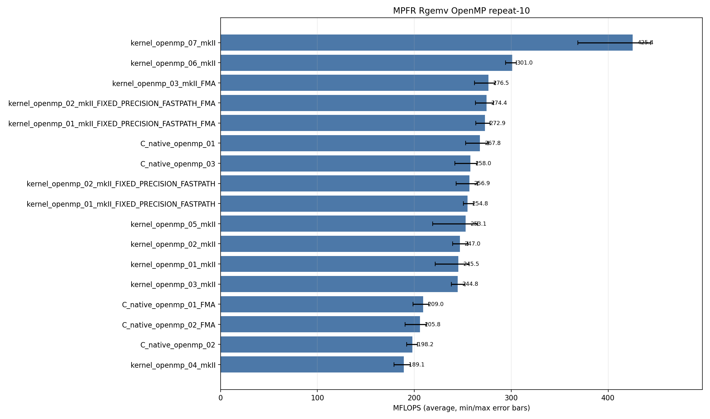

<!-- SPDX-License-Identifier: BSD-2-Clause -->

# 02_Rgemv

This directory benchmarks MPFR dense real matrix-vector multiplication:

```text
y = alpha * A * x + beta * y
```

The timed kernels compare raw `mpfr_t` C code with `mpfrxx_mkII`
expression-template wrappers.  The main questions are source shape, row-owned
OpenMP versus column-major streaming, explicit evaluation context, reusable
temporaries, FMA/FMMA lowering, and the fixed-precision fast path.

## Build

From the repository root:

```bash
cmake -S . -B build_bench_release -DCMAKE_BUILD_TYPE=Release
cmake --build build_bench_release -j
```

Executables are written under:

```text
build_bench_release/benchmarks/mpfr/02_Rgemv/
```

Each executable takes:

```text
<rows m> <cols n> <precision>
```

Example:

```bash
build_bench_release/benchmarks/mpfr/02_Rgemv/Rgemv_mpfr_kernel_openmp_07_mkII 4000 4000 512
```

For OpenMP runs, use explicit affinity:

```bash
OMP_NUM_THREADS=32 OMP_PLACES=cores OMP_PROC_BIND=spread \
build_bench_release/benchmarks/mpfr/02_Rgemv/Rgemv_mpfr_kernel_openmp_07_mkII \
    4000 4000 512
```

## Benchmark Parameters

| Parameter | Meaning |
|-----------|---------|
| `m` | Number of rows in `A` and length of `y`. |
| `n` | Number of columns in `A` and length of `x`. |
| `precision` | MPFR precision in bits. |

Each executable reports `Elapsed time`, `MFLOPS`, `L1 Norm of difference`, and
`Result OK` / `Result NG`.  MFLOPS uses the timed loop only:

```text
2 * m * n / elapsed_seconds / 1e6
```

The correctness reference is `Rgemv()` in `Rgemv.hpp`; the timed kernel is
`_Rgemv()` in each benchmark source.

Wrapper suffixes:

| Suffix | Meaning |
|--------|---------|
| `mkII` | Default `mpfrxx_mkII` wrapper path. |
| `mkII_FIXED_PRECISION_FASTPATH` | Build with `GMPFRXX_MKII_ASSUME_FIXED_PRECISION_FASTPATH`. |
| `mkII_FIXED_PRECISION_FASTPATH_FMA` | Fixed precision plus `MPFRXX_ENABLE_FMA`. |
| `mkII_FMA` | `MPFRXX_ENABLE_FMA` without the fixed-precision build option. |

MPFR-specific note: every arithmetic operation takes a rounding mode.  The
explicit-context wrapper kernels capture precision and rounding outside the hot
loop and route assignments through `mpfrxx::with_context`.

## Variant Shapes

The serial kernels include row-dot and column-AXPY shapes.  The OpenMP kernels
use race-free variants: row-owned loops, row blocks, or column partitioning
with thread-local partial vectors.

| Variant | Timed source shape | Temporary/resource policy | Purpose |
|---------|--------------------|---------------------------|---------|
| `01` | Wrapper row-dot: `temp += A[i + j*lda] * x[j]`, then `y[i] = alpha * temp + beta * y[i]`.  Raw C `01` is direct column-order multiply/multiply/add. | Wrapper constructs one row accumulator per row; raw C reuses one `mpfr_t temp`. | Baseline expression/source-shape stress case. |
| `02` | Column AXPY: scale `y`, compute `temp = alpha * x[j]`, then update `y[i] += temp * A[i + j*lda]`. | Reusable `temp` and `templ` objects outside the loop nest. | Main non-context reusable-temporary path. |
| `03` | Raw C and explicit-context wrapper row-dot: `temp += A[i + j*lda] * x[j]`, then `y[i] = alpha * temp + beta * y[i]`. | Raw C uses one reusable `mpfr_t temp`; wrapper uses one reusable `mpfr_class temp` through `with_context`. | Compare wrapper FMA path with raw C `mpfr_fma` accumulation and final `mpfr_fmma`. |
| `04` | Explicit-context column AXPY wrapper: scale `y`, compute `temp = alpha * x[j]`, then `templ = temp * A[...]`, `y += templ`. | Reusable `temp` and `templ` through `with_context`. | Best serial wrapper source shape. |
| `openmp_01` | Row-owned direct row-dot expression. | Each row owns its accumulator; separate parallel regions scale and update rows. | Race-free OpenMP baseline. |
| `openmp_02` | Currently the same row-owned row-dot source shape as `openmp_01`. | Same policy as `openmp_01`. | Numbered placeholder; treat current source as duplicate of `openmp_01`. |
| `openmp_03` | Explicit-context row-owned row-dot. | One reusable `temp` per thread through `with_context`. | Explicit-context row-dot and FMA comparison path. |
| `openmp_04` | Explicit-context row-owned copy-then-multiply. | Per-thread reusable `temp` and `templ`; recomputes `alpha * x[j]` per row. | Race-free counterpart to serial column-AXPY logic, but with less reuse. |
| `openmp_05` | Precompute `scaled_x[j] = alpha * x[j]`, then row-owned update. | Shared read-only `scaled_x`, per-thread reusable `templ`, explicit context. | Remove repeated `alpha * x[j]` from row-owned OpenMP. |
| `openmp_06` | 256-row blocks, then column loop and contiguous row loop inside the block. | Per-thread reusable `temp` and `templ`, explicit context. | Restore contiguous `A` access inside each row block. |
| `openmp_07` | Column partitioning with thread-local partial `y` vectors and final reduction. | `num_threads * m` partial accumulators plus reduction, explicit context. | Keep serial-like column-major `A` streaming without racing on `y`. |

## C Native Equivalent Kernels

The mapping is based on the timed `_Rgemv()` source shape.

| C native kernel | Equivalent wrapper kernel(s) | Notes |
|-----------------|------------------------------|-------|
| `C_native_01` | Closest to `kernel_01_*` and `kernel_openmp_01_*` source class | Raw C uses `mpfr_mul`, `mpfr_mul`, `mpfr_add`; wrapper materializes through ET evaluation. |
| `C_native_01_FMA` | Closest to FMA-enabled `kernel_01_*` and `kernel_openmp_01_*` | Raw C replaces the second multiply/add with `mpfr_fma`. |
| `C_native_02` | `kernel_02_*`, serial source class of `kernel_04_mkII` | Column AXPY with `alpha * x[j]` hoisted outside the row loop. |
| `C_native_02_FMA` | Raw C FMA counterpart of the column-AXPY source class | Best serial raw C path. |
| `C_native_03` | `kernel_03_mkII_FMA` | Raw C row-dot with `mpfr_fma` accumulation and final `mpfr_fmma`. |
| `C_native_openmp_01` | `kernel_openmp_01_*`, `kernel_openmp_02_*` | Row-owned dot-product source shape; wrapper `openmp_02` is currently a duplicate of `openmp_01`. |
| `C_native_openmp_01_FMA` | FMA-enabled row-owned direct source class | Raw C row-owned path with explicit `mpfr_fma`. |
| `C_native_openmp_02` | Closest to `kernel_openmp_04_mkII` | Row-owned copy-then-multiply; avoids races but recomputes `alpha * x[j]` per row. |
| `C_native_openmp_02_FMA` | FMA counterpart of `kernel_openmp_04_mkII` | Row-owned copy-then-FMA source shape. |
| `C_native_openmp_03` | `kernel_openmp_03_mkII_FMA` | Row-owned raw C path with one private `temp`, `mpfr_fma`, and final `mpfr_fmma`. |
| none yet | `kernel_openmp_05_mkII` | Raw C precomputed-`scaled_x` counterpart has not been added. |
| none yet | `kernel_openmp_06_mkII` | Raw C 256-row-block counterpart has not been added. |
| none yet | `kernel_openmp_07_mkII` | Raw C column-partition partial-vector counterpart has not been added. |

## Recorded Run

The current checked-in data uses:

```text
M = 4000
N = 4000
precision = 512
repeat = 10
OMP_NUM_THREADS = 32
OMP_PLACES = cores
OMP_PROC_BIND = spread
CPU = AMD Ryzen Threadripper 3970X 32-Core Processor
```

Results are stored in:

```text
results_raw/rgemv_mpfr_m4000_n4000_p512_repeat10_20260517_232612/
```

Files:

- [Raw log](results_raw/rgemv_mpfr_m4000_n4000_p512_repeat10_20260517_232612/benchmark_rgemv_mpfr_m4000_n4000_p512_repeat10.log)
- [Raw CSV](results_raw/rgemv_mpfr_m4000_n4000_p512_repeat10_20260517_232612/raw_rgemv_mpfr_m4000_n4000_p512_repeat10.csv)
- [Summary CSV](results_raw/rgemv_mpfr_m4000_n4000_p512_repeat10_20260517_232612/summary_rgemv_mpfr_m4000_n4000_p512_repeat10.csv)

All 31 variants reported `Result OK` in all 10 runs, for 310 successful timed
runs.




## Resource and Bandwidth Estimates

These are model estimates derived from MFLOPS, not hardware-counter
measurements.  On this LP64 system:

```text
sizeof(__mpfr_struct) = 32 bytes
sizeof(mp_limb_t)     = 8 bytes
precision             = 512 bits
active limbs          = 8
active mpfr value     = 32-byte header + 8 limbs * 8 = 96 bytes
```

For one matrix element at 512-bit precision:

```text
A+x active logical GB/s   = MFLOPS * 0.096
A+x+y active logical GB/s = MFLOPS * 0.192
```

`A+x` counts one matrix value and one vector value per two floating-point
operations.  `A+x+y` additionally counts one read and one write of `y`.
Actual traffic can differ because `mpfr_t` headers are contiguous but each
`_mpfr_d` points to limb storage.

| Variant | Avg MFLOPS | Max MFLOPS | A+x avg GB/s | A+x+y avg GB/s |
|---------|-----------:|-----------:|-------------:|---------------:|
| `kernel_openmp_07_mkII` | 425.405 | 444.009 | 40.84 | 81.68 |
| `kernel_openmp_06_mkII` | 300.961 | 305.343 | 28.89 | 57.78 |
| `kernel_openmp_03_mkII_FMA` | 276.493 | 283.361 | 26.54 | 53.09 |
| `kernel_openmp_02_mkII_FIXED_PRECISION_FASTPATH_FMA` | 274.422 | 281.627 | 26.34 | 52.69 |
| `C_native_openmp_01` | 267.849 | 276.264 | 25.71 | 51.43 |
| `kernel_openmp_05_mkII` | 253.099 | 265.235 | 24.30 | 48.59 |
| `C_native_02_FMA` | 23.565 | 24.238 | 2.26 | 4.52 |
| `kernel_04_mkII` | 20.521 | 20.837 | 1.97 | 3.94 |

## Serial Results

Main interpretation table:

| Variant | Max MFLOPS | Avg MFLOPS | Min MFLOPS | Interpretation |
|---------|-----------:|-----------:|-----------:|----------------|
| `C_native_02_FMA` | 24.238 | 23.565 | 23.318 | Best serial result; column AXPY hoists `alpha * x[j]` and uses one `mpfr_fma` per matrix element. |
| `kernel_04_mkII` | 20.837 | 20.521 | 20.306 | Best serial wrapper; explicit context plus reusable `temp`/`templ`. |
| `C_native_02` | 21.064 | 20.497 | 20.210 | Raw non-FMA column-AXPY baseline. |
| `kernel_02_mkII_FIXED_PRECISION_FASTPATH_FMA` | 18.593 | 18.253 | 18.042 | Best non-context wrapper `02` path in this run. |
| `C_native_01` | 14.739 | 14.470 | 14.306 | Direct raw C multiply/multiply/add source shape. |
| `C_native_03` | 11.150 | 10.604 | 10.238 | Raw C row-dot with `mpfr_fma` and `mpfr_fmma`; row-dot traversal loses in serial. |
| `kernel_03_mkII_FMA` | 10.560 | 10.223 | 9.895 | Wrapper row-dot FMA path; close to `C_native_03`, still traversal-limited. |

<details>
<summary>Serial results sorted by Max MFLOPS</summary>

| Rank | Variant | Max MFLOPS | Avg MFLOPS | Min MFLOPS |
|------|---------|-----------:|-----------:|-----------:|
| 1 | `C_native_02_FMA` | 24.238 | 23.565 | 23.318 |
| 2 | `C_native_02` | 21.064 | 20.497 | 20.210 |
| 3 | `kernel_04_mkII` | 20.837 | 20.521 | 20.306 |
| 4 | `kernel_02_mkII_FIXED_PRECISION_FASTPATH_FMA` | 18.593 | 18.253 | 18.042 |
| 5 | `kernel_02_mkII_FIXED_PRECISION_FASTPATH` | 18.554 | 18.093 | 17.891 |
| 6 | `kernel_02_mkII` | 18.308 | 18.159 | 17.827 |
| 7 | `C_native_01` | 14.739 | 14.470 | 14.306 |
| 8 | `C_native_01_FMA` | 14.565 | 14.111 | 13.632 |
| 9 | `C_native_03` | 11.150 | 10.604 | 10.238 |
| 10 | `kernel_01_mkII_FIXED_PRECISION_FASTPATH` | 10.697 | 9.756 | 9.360 |
| 11 | `kernel_01_mkII_FIXED_PRECISION_FASTPATH_FMA` | 10.600 | 10.259 | 10.047 |
| 12 | `kernel_03_mkII_FMA` | 10.560 | 10.223 | 9.895 |
| 13 | `kernel_03_mkII` | 10.023 | 9.411 | 9.073 |
| 14 | `kernel_01_mkII` | 9.530 | 9.231 | 8.895 |

</details>

<details>
<summary>Serial results sorted by Avg MFLOPS</summary>

| Rank | Variant | Max MFLOPS | Avg MFLOPS | Min MFLOPS |
|------|---------|-----------:|-----------:|-----------:|
| 1 | `C_native_02_FMA` | 24.238 | 23.565 | 23.318 |
| 2 | `kernel_04_mkII` | 20.837 | 20.521 | 20.306 |
| 3 | `C_native_02` | 21.064 | 20.497 | 20.210 |
| 4 | `kernel_02_mkII_FIXED_PRECISION_FASTPATH_FMA` | 18.593 | 18.253 | 18.042 |
| 5 | `kernel_02_mkII` | 18.308 | 18.159 | 17.827 |
| 6 | `kernel_02_mkII_FIXED_PRECISION_FASTPATH` | 18.554 | 18.093 | 17.891 |
| 7 | `C_native_01` | 14.739 | 14.470 | 14.306 |
| 8 | `C_native_01_FMA` | 14.565 | 14.111 | 13.632 |
| 9 | `C_native_03` | 11.150 | 10.604 | 10.238 |
| 10 | `kernel_01_mkII_FIXED_PRECISION_FASTPATH_FMA` | 10.600 | 10.259 | 10.047 |
| 11 | `kernel_03_mkII_FMA` | 10.560 | 10.223 | 9.895 |
| 12 | `kernel_01_mkII_FIXED_PRECISION_FASTPATH` | 10.697 | 9.756 | 9.360 |
| 13 | `kernel_03_mkII` | 10.023 | 9.411 | 9.073 |
| 14 | `kernel_01_mkII` | 9.530 | 9.231 | 8.895 |

</details>

## OpenMP Results

Main interpretation table:

| Variant | Max MFLOPS | Avg MFLOPS | Min MFLOPS | Interpretation |
|---------|-----------:|-----------:|-----------:|----------------|
| `kernel_openmp_07_mkII` | 444.009 | 425.405 | 368.658 | Best OpenMP result; column partitioning keeps column-major `A` streaming and reduces thread-local partial `y` vectors. |
| `kernel_openmp_06_mkII` | 305.343 | 300.961 | 294.228 | Best row-owned OpenMP shape; 256-row blocking restores contiguous `A` access inside each block. |
| `kernel_openmp_03_mkII_FMA` | 283.361 | 276.493 | 262.054 | Best FMA row-dot wrapper path. |
| `kernel_openmp_02_mkII_FIXED_PRECISION_FASTPATH_FMA` | 281.627 | 274.422 | 263.159 | Row-dot source class plus fixed precision and FMA. |
| `C_native_openmp_01` | 276.264 | 267.849 | 252.829 | Best raw C OpenMP average in this run. |
| `kernel_openmp_05_mkII` | 265.235 | 253.099 | 219.010 | Precomputed `scaled_x`; removes repeated `alpha*x[j]` but remains row-traversal limited. |
| `kernel_openmp_04_mkII` | 196.073 | 189.131 | 178.891 | Row-owned copy-then-multiply path; recomputes `alpha*x[j]` per row. |

<details>
<summary>OpenMP results sorted by Max MFLOPS</summary>

| Rank | Variant | Max MFLOPS | Avg MFLOPS | Min MFLOPS |
|------|---------|-----------:|-----------:|-----------:|
| 1 | `kernel_openmp_07_mkII` | 444.009 | 425.405 | 368.658 |
| 2 | `kernel_openmp_06_mkII` | 305.343 | 300.961 | 294.228 |
| 3 | `kernel_openmp_03_mkII_FMA` | 283.361 | 276.493 | 262.054 |
| 4 | `kernel_openmp_02_mkII_FIXED_PRECISION_FASTPATH_FMA` | 281.627 | 274.422 | 263.159 |
| 5 | `kernel_openmp_01_mkII_FIXED_PRECISION_FASTPATH_FMA` | 278.142 | 272.919 | 263.536 |
| 6 | `C_native_openmp_01` | 276.264 | 267.849 | 252.829 |
| 7 | `kernel_openmp_02_mkII_FIXED_PRECISION_FASTPATH` | 265.546 | 256.906 | 243.067 |
| 8 | `kernel_openmp_05_mkII` | 265.235 | 253.099 | 219.010 |
| 9 | `C_native_openmp_03` | 264.769 | 257.980 | 241.797 |
| 10 | `kernel_openmp_01_mkII_FIXED_PRECISION_FASTPATH` | 261.236 | 254.841 | 250.560 |
| 11 | `kernel_openmp_01_mkII` | 256.413 | 245.487 | 221.473 |
| 12 | `kernel_openmp_02_mkII` | 255.099 | 246.962 | 239.511 |
| 13 | `kernel_openmp_03_mkII` | 252.277 | 244.797 | 238.188 |
| 14 | `C_native_openmp_01_FMA` | 214.913 | 209.023 | 198.656 |
| 15 | `C_native_openmp_02_FMA` | 212.448 | 205.838 | 190.414 |
| 16 | `C_native_openmp_02` | 203.394 | 198.172 | 192.071 |
| 17 | `kernel_openmp_04_mkII` | 196.073 | 189.131 | 178.891 |

</details>

<details>
<summary>OpenMP results sorted by Avg MFLOPS</summary>

| Rank | Variant | Max MFLOPS | Avg MFLOPS | Min MFLOPS |
|------|---------|-----------:|-----------:|-----------:|
| 1 | `kernel_openmp_07_mkII` | 444.009 | 425.405 | 368.658 |
| 2 | `kernel_openmp_06_mkII` | 305.343 | 300.961 | 294.228 |
| 3 | `kernel_openmp_03_mkII_FMA` | 283.361 | 276.493 | 262.054 |
| 4 | `kernel_openmp_02_mkII_FIXED_PRECISION_FASTPATH_FMA` | 281.627 | 274.422 | 263.159 |
| 5 | `kernel_openmp_01_mkII_FIXED_PRECISION_FASTPATH_FMA` | 278.142 | 272.919 | 263.536 |
| 6 | `C_native_openmp_01` | 276.264 | 267.849 | 252.829 |
| 7 | `C_native_openmp_03` | 264.769 | 257.980 | 241.797 |
| 8 | `kernel_openmp_02_mkII_FIXED_PRECISION_FASTPATH` | 265.546 | 256.906 | 243.067 |
| 9 | `kernel_openmp_01_mkII_FIXED_PRECISION_FASTPATH` | 261.236 | 254.841 | 250.560 |
| 10 | `kernel_openmp_05_mkII` | 265.235 | 253.099 | 219.010 |
| 11 | `kernel_openmp_02_mkII` | 255.099 | 246.962 | 239.511 |
| 12 | `kernel_openmp_01_mkII` | 256.413 | 245.487 | 221.473 |
| 13 | `kernel_openmp_03_mkII` | 252.277 | 244.797 | 238.188 |
| 14 | `C_native_openmp_01_FMA` | 214.913 | 209.023 | 198.656 |
| 15 | `C_native_openmp_02_FMA` | 212.448 | 205.838 | 190.414 |
| 16 | `C_native_openmp_02` | 203.394 | 198.172 | 192.071 |
| 17 | `kernel_openmp_04_mkII` | 196.073 | 189.131 | 178.891 |

</details>

## Hotpath Disassembly

The snippets below show representative call structure in the Release build.
Addresses are intentionally omitted because they are build-local.

### `C_native_02_FMA`

Best serial raw C shape: default rounding is loaded once, `alpha*x[j]` is
hoisted, and the inner row loop is one `mpfr_fma`.

```asm
call   mpfr_get_default_rounding_mode@plt
call   mpfr_init2@plt
...
call   mpfr_mul@plt        # y[i] *= beta
...
call   mpfr_set@plt        # temp = alpha
call   mpfr_mul@plt        # temp *= x[j]
...
call   mpfr_fma@plt        # y[i] = temp * A[i+j*lda] + y[i]
...
call   mpfr_clear@plt
```

### `C_native_03` and `C_native_openmp_03`

Raw C row-dot comparison target for wrapper `03` FMA:

```asm
call   mpfr_init2@plt
call   mpfr_get_default_rounding_mode@plt
call   mpfr_set_d@plt      # temp = 0
...
call   mpfr_fma@plt        # temp += A[i+j*lda] * x[j]
...
call   mpfr_fmma@plt       # y = alpha * temp + beta * y
call   mpfr_clear@plt
```

### `kernel_openmp_03_mkII_FMA`

Wrapper row-dot FMA path:

```asm
call   mpfr_init2@plt
call   mpfr_get_default_rounding_mode@plt
call   mpfr_set_d@plt      # temp = 0
...
call   mpfr_fma@plt        # temp += A[i+j*lda] * x[j]
...
call   mpfr_fmma@plt       # y = alpha * temp + beta * y
call   GOMP_barrier@plt
call   mpfr_clear@plt
```

### `kernel_openmp_07_mkII`

`openmp_07` does not win by a new arithmetic primitive.  It wins by source
shape: column partitioning streams contiguous column-major `A`, accumulates
into thread-local partial `y`, then performs a reduction.  The arithmetic hot
loop is still multiply plus add through reusable wrapper temporaries.

## Lessons Learned

Serial MPFR Rgemv is dominated by source shape.  The column-AXPY shape wins
because it hoists `alpha*x[j]` outside the inner row loop and streams
column-major `A` contiguously.  `C_native_02_FMA` is the best serial result
because the inner row loop is reduced to one `mpfr_fma` call.

Explicit context helps the wrapper, but it cannot compensate for a poor memory
walk.  `kernel_04_mkII` is the best serial wrapper because it combines
column-AXPY traversal, reusable temporaries, and loop-invariant rounding.  The
row-dot `kernel_03_mkII_FMA` reaches the intended `mpfr_fma`/`mpfr_fmma` shape
but remains slow in serial because it walks a column-major matrix with a large
stride.

OpenMP changes the best strategy.  Row-owned kernels avoid races on `y`, but
they make the matrix access pattern poor.  `openmp_06` improves that with
256-row blocks, and `openmp_07` goes further by partitioning columns and using
thread-local partial `y` vectors.  That is why `kernel_openmp_07_mkII` reaches
425.405 average MFLOPS while the best row-owned FMA wrapper remains around
276 MFLOPS.

`openmp_05` confirms that precomputing `scaled_x` alone is not enough.  It
removes repeated `alpha*x[j]`, but without fixing the matrix traversal it stays
below the blocked and column-partitioned variants.

Compared with GMP `mpf`, MPFR adds a rounding-mode dimension to every
operation.  Explicit contexts remain important, but the largest gains in this
benchmark come from restoring column-major streaming and avoiding write races
without forcing row-strided matrix access.
