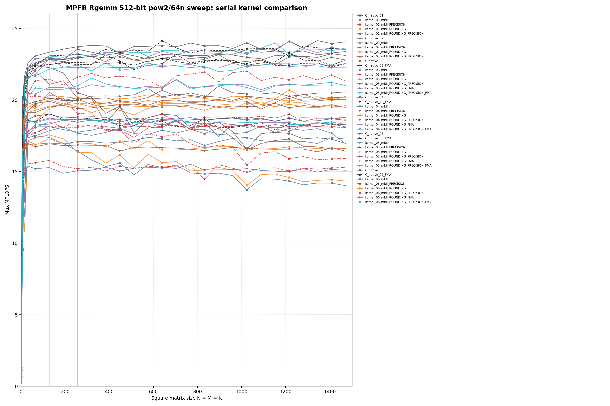
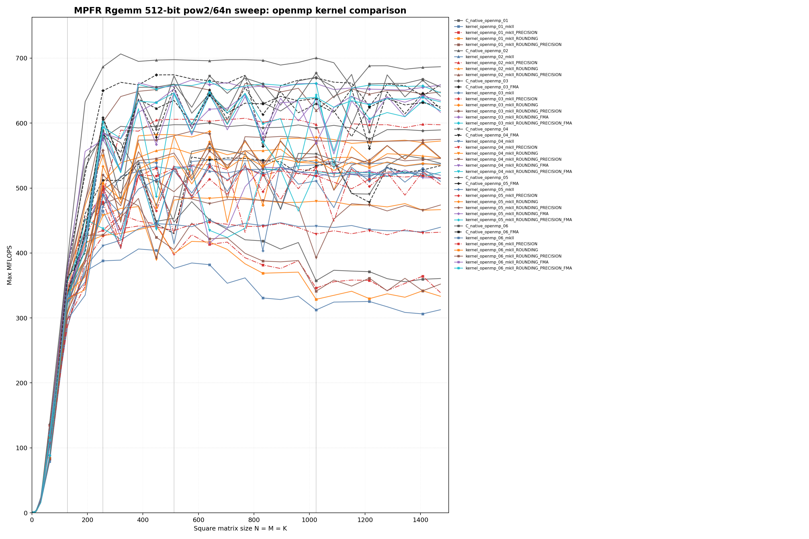

<!--
Copyright (c) 2026
     Nakata, Maho
     All rights reserved.

Redistribution and use in source and binary forms, with or without
modification, are permitted provided that the following conditions
are met:
1. Redistributions of source code must retain the above copyright
   notice, this list of conditions and the following disclaimer.
2. Redistributions in binary form must reproduce the above copyright
   notice, this list of conditions and the following disclaimer in the
   documentation and/or other materials provided with the distribution.

THIS SOFTWARE IS PROVIDED BY THE AUTHOR AND CONTRIBUTORS ``AS IS'' AND
ANY EXPRESS OR IMPLIED WARRANTIES, INCLUDING, BUT NOT LIMITED TO, THE
IMPLIED WARRANTIES OF MERCHANTABILITY AND FITNESS FOR A PARTICULAR PURPOSE
ARE DISCLAIMED.  IN NO EVENT SHALL THE AUTHOR OR CONTRIBUTORS BE LIABLE
FOR ANY DIRECT, INDIRECT, INCIDENTAL, SPECIAL, EXEMPLARY, OR CONSEQUENTIAL
DAMAGES (INCLUDING, BUT NOT LIMITED TO, PROCUREMENT OF SUBSTITUTE GOODS
OR SERVICES; LOSS OF USE, DATA, OR PROFITS; OR BUSINESS INTERRUPTION)
HOWEVER CAUSED AND ON ANY THEORY OF LIABILITY, WHETHER IN CONTRACT, STRICT
LIABILITY, OR TORT (INCLUDING NEGLIGENCE OR OTHERWISE) ARISING IN ANY WAY
OUT OF THE USE OF THIS SOFTWARE, EVEN IF ADVISED OF THE POSSIBILITY OF
SUCH DAMAGE.
-->

# 03_Rgemm

## Purpose

This directory benchmarks the MPFR real dense matrix-matrix product:

```text
C = alpha * A * B + beta * C
```

It compares raw `mpfr_t` C native kernels against `mpfrxx::mpfr_class`
wrapper kernels. The main question is whether each wrapper source shape emits
the same MPFR hot-loop class as the corresponding C native kernel, and which
wrapper suffixes are needed to remove repeated rounding/default-state work.

There is no upstream `gmpxx.h`-style `orig` implementation for MPFR in this
benchmark family; MPFR results compare raw C native and mkII wrapper paths.

## Build

From the repository root:

```bash
cmake -S . -B build_bench_release -DCMAKE_BUILD_TYPE=Release
cmake --build build_bench_release -j --target Rgemm_mpfr_C_native_03
cmake --build build_bench_release -j --target Rgemm_mpfr_C_native_03_FMA
cmake --build build_bench_release -j --target Rgemm_mpfr_kernel_03_mkII_ROUNDING_PRECISION_FMA
cmake --build build_bench_release -j --target Rgemm_mpfr_kernel_openmp_06_mkII_ROUNDING_PRECISION_FMA
```

Executables are written under:

```text
build_bench_release/benchmarks/mpfr/03_Rgemm/
```

Individual executables take:

```text
<rows m> <cols k> <cols n> <precision>
```

Example:

```bash
build_bench_release/benchmarks/mpfr/03_Rgemm/Rgemm_mpfr_kernel_03_mkII_ROUNDING_PRECISION_FMA 128 128 128 512
```

## Benchmark Parameters

The current executable arguments define:

| Parameter | Meaning |
|-----------|---------|
| `m` | Number of rows of `A` and `C`. |
| `k` | Shared dimension of `A` and `B`. |
| `n` | Number of columns of `B` and `C`. |
| `precision` | MPFR precision in bits for raw and wrapper objects. |

The benchmark initializes random MPFR values, times only the selected `_Rgemm`
kernel, computes a wrapper reference result, and reports the L1 norm of the
difference.

## Variant Shapes

The MPFR Rgemm source matrix mirrors the GMP Rgemm numbering.

| Variant | Transition from previous variant | Timed source shape | Temporary/resource policy | Purpose |
|---------|----------------------------------|--------------------|---------------------------|---------|
| `01` | Baseline | Row-dot form, `i -> j -> l`; each `C(i,j)` builds a dot product and then applies `alpha`. | A dot-product temporary is local to each output element. | Stress expression materialization in the direct mathematical spelling. |
| `02` | Change traversal | Rank-1 / column-major update, `j -> l -> i`; `alpha * B(l,j)` is reused across all rows. | One scaled-`B` temporary per `(l,j)` panel step. | Test the BLAS-like streaming update that reuses `alpha * B`. |
| `03` | Reuse temporaries explicitly | `temp = alpha; temp *= B(l,j); templ = temp; templ *= A(i,l); C += templ`. | `temp` and `templ` are created outside the timed inner loop and reused. | Compare wrapper code against a raw reusable-object C native baseline. |
| `04` | Add 4x4 output blocking | 4x4 `C` tile accumulator with edge redirection. | A 4x4 set of managed `mpfr_class` accumulators plus scratch objects. | Test whether register-blocking ideas transfer to managed MPFR objects. |
| `05` | Replace 4x4 accumulators with a 4-column panel | Precompute four `scaled_b` values and stream rows with one product object. | Four scaled-`B` scratch values and one reusable product object. | Reduce accumulator object pressure while preserving `B` reuse. |
| `06` | Add row blocking to `05` | Variant `05` with a fixed 256-row block. | Same panel scratch as `05`, applied per row block. | Test OpenMP granularity and cache behavior for the panel kernel. |

Wrapper optimization suffixes are generated for every numbered source shape:

| Suffix | Kind | Meaning |
|--------|------|---------|
| `mkII` | baseline | Ordinary wrapper source with default wrapper rounding lookup behavior. |
| `mkII_PRECISION` | build modifier on baseline source | Builds the ordinary wrapper source with `GMPFRXX_MKII_FAST_FIXED_PREC`. |
| `mkII_ROUNDING` | source modifier | Uses `mpfrxx::with_rounding(..., rounding)` after capturing rounding outside the loop. |
| `mkII_ROUNDING_PRECISION` | build modifier on `ROUNDING` source | Adds `GMPFRXX_MKII_FAST_FIXED_PREC` to the cached-rounding split multiply/add source. |
| `mkII_ROUNDING_FMA` | source + build modifier | Uses a `*_ROUNDING_FMA.cpp` source that spells the update as `C += scaled * A`, built with `GMPFRXX_MKII_ENABLE_FMA`. |
| `mkII_ROUNDING_PRECISION_FMA` | source + build modifier | Adds fixed precision to the FMA-capturable rounding source. |

## C Native Equivalent Kernels

The raw C native and wrapper variants use the same numbering. Equivalence is
based on source shape and emitted MPFR calls.

| C native kernel | Wrapper equivalent | Notes |
|-----------------|--------------------|-------|
| `Rgemm_mpfr_C_native_01` | `Rgemm_mpfr_kernel_01_mkII*` | Same row-dot source shape; wrapper expression handling can still affect temporary construction and rounding lookup. |
| `Rgemm_mpfr_C_native_02` | `Rgemm_mpfr_kernel_02_mkII*` | Same rank-1 traversal. |
| `Rgemm_mpfr_C_native_03` | `Rgemm_mpfr_kernel_03_mkII_ROUNDING_PRECISION` | Reusable `temp`/`templ`, cached rounding, and split `mpfr_mul` + `mpfr_add`. |
| `Rgemm_mpfr_C_native_03_FMA` | `Rgemm_mpfr_kernel_03_mkII_ROUNDING_PRECISION_FMA` | Reusable `temp`, direct `C += temp * A` source, and `mpfr_fma` in the hot loop. |
| `Rgemm_mpfr_C_native_04` | `Rgemm_mpfr_kernel_04_mkII_ROUNDING_PRECISION` | Same 4x4 accumulator shape with split multiply/add. |
| `Rgemm_mpfr_C_native_04_FMA` | `Rgemm_mpfr_kernel_04_mkII_ROUNDING_PRECISION_FMA` | Same 4x4 accumulator shape with direct accumulator FMA. |
| `Rgemm_mpfr_C_native_05` | `Rgemm_mpfr_kernel_05_mkII_ROUNDING_PRECISION` | Same 4-column panel shape with split multiply/add. |
| `Rgemm_mpfr_C_native_05_FMA` | `Rgemm_mpfr_kernel_05_mkII_ROUNDING_PRECISION_FMA` | Same 4-column panel shape with direct `C += scaled_b * A` FMA. |
| `Rgemm_mpfr_C_native_06` | `Rgemm_mpfr_kernel_06_mkII_ROUNDING_PRECISION` | Same row-blocked 4-column panel shape with split multiply/add. |
| `Rgemm_mpfr_C_native_06_FMA` | `Rgemm_mpfr_kernel_06_mkII_ROUNDING_PRECISION_FMA` | Same row-blocked 4-column panel shape with direct `C += scaled_b * A` FMA. |

The `FMA` suffix is only attached to `*_ROUNDING_FMA.cpp` sources. Those
sources intentionally expose `C += scaled * A` or `acc += scaled * A`, so the
`GMPFRXX_MKII_ENABLE_FMA` build can lower the wrapper expression to `mpfr_fma`.
The ordinary `*_ROUNDING.cpp` sources remain split multiply/add baselines.

## Recorded Run

A clean GMP/MPFR Rgemm sweep was collected with the current target matrix:

```bash
benchmarks/run_rgemm_all.sh build_bench_release 512 1500 128 5 1 both
```

The recorded run uses the runner default multiple size `64`. The size set
combines powers of two and multiples of 64 up to 1500:

```text
1, 2, 4, 8, 16, 32, 64, 128, 192, 256, 320, 384, 448, 512,
576, 640, 704, 768, 832, 896, 960, 1024, 1088, 1152, 1216,
1280, 1344, 1408, 1472
```

Sizes `N <= 128` use `repeat=5`; larger sizes use `repeat=1`. The run used
512-bit precision and 32 OpenMP threads with `OMP_PLACES=cores` and
`OMP_PROC_BIND=spread`. Timed runs use `-nocheck` after the runner smoke tests.
All recorded timed samples report `Check skipped`.

Artifacts:

- MPFR raw data: [results_raw/rgemm_mpfr_all_pow2_64n_p512_repeat1_small5_20260531_170547/](results_raw/rgemm_mpfr_all_pow2_64n_p512_repeat1_small5_20260531_170547/)
- GMP raw data: [../../gmp/03_Rgemm/results_raw/rgemm_gmp_all_pow2_64n_p512_repeat1_small5_20260531_170547/](../../gmp/03_Rgemm/results_raw/rgemm_gmp_all_pow2_64n_p512_repeat1_small5_20260531_170547/)
- MPFR raw CSV rows: `2437` including header.
- GMP raw CSV rows: `1393` including header.

The following line plots compare all MPFR Rgemm targets within this backend.
The horizontal axis is the square matrix size `N = M = K`, and the vertical axis is max MFLOPS.





Regenerate the MPFR kernel-comparison plots with:

```bash
benchmarks/plot_rgemm_kernel_comparison.py \
    --summary benchmarks/mpfr/03_Rgemm/results_raw/rgemm_mpfr_all_pow2_64n_p512_repeat1_small5_20260531_170547/summary_rgemm_mpfr_all_pow2_64n_p512_repeat1_small5_20260531_170547.csv \
    --backend mpfr \
    --output-prefix benchmarks/mpfr/03_Rgemm/results_raw/rgemm_mpfr_all_pow2_64n_p512_repeat1_small5_20260531_170547/rgemm_mpfr_kernel_comparison_p512 \
    --title-prefix "MPFR Rgemm 512-bit pow2/64n sweep"
```

## Comparison with GMP Rgemm

The clean 512-bit sweep shows a real backend-level difference. The gap is
already present in the best serial C native kernels, so it is not just a
wrapper artifact. Wrapper alignment still matters for MPFR: `ROUNDING` and
`FMA` variants are needed before the wrapper hot loop matches the corresponding
C native MPFR call class, but after that the remaining gap is mostly GMP
`mpf_t` versus MPFR arithmetic cost.

| Size | Metric | GMP best MFLOPS | MPFR best MFLOPS | GMP/MPFR | GMP winner | MPFR winner |
|------|--------|----------------:|-----------------:|---------:|------------|-------------|
| `128` | serial best | `31.227` | `23.343` | `1.34x` | `Rgemm_gmp_C_native_02` | `Rgemm_mpfr_C_native_02` |
| `128` | OpenMP best | `465.942` | `387.972` | `1.20x` | `Rgemm_gmp_kernel_openmp_01_mkII_FIXED_PRECISION_FASTPATH` | `Rgemm_mpfr_C_native_openmp_02` |
| `256` | serial best | `30.978` | `23.722` | `1.31x` | `Rgemm_gmp_C_native_02` | `Rgemm_mpfr_C_native_02` |
| `256` | OpenMP best | `766.179` | `686.616` | `1.12x` | `Rgemm_gmp_kernel_openmp_03_mkII` | `Rgemm_mpfr_C_native_openmp_02` |
| `512` | serial best | `31.246` | `23.743` | `1.32x` | `Rgemm_gmp_C_native_02` | `Rgemm_mpfr_C_native_02` |
| `512` | OpenMP best | `865.246` | `697.644` | `1.24x` | `Rgemm_gmp_C_native_openmp_06` | `Rgemm_mpfr_C_native_openmp_02` |
| `1024` | serial best | `30.948` | `24.013` | `1.29x` | `Rgemm_gmp_C_native_02` | `Rgemm_mpfr_C_native_02` |
| `1024` | OpenMP best | `848.648` | `700.338` | `1.21x` | `Rgemm_gmp_C_native_openmp_03` | `Rgemm_mpfr_C_native_openmp_02` |
| `1472` | serial best | `31.346` | `24.069` | `1.30x` | `Rgemm_gmp_C_native_02` | `Rgemm_mpfr_C_native_02` |
| `1472` | OpenMP best | `871.995` | `686.758` | `1.27x` | `Rgemm_gmp_C_native_openmp_06` | `Rgemm_mpfr_C_native_openmp_02` |

At `N=1472`, the best MPFR wrapper reaches the same class as MPFR C native but
not the same class as GMP:

| Backend | C native best | mkII wrapper best | Wrapper/C native |
|---------|---------------|-------------------|-----------------:|
| GMP | `Rgemm_gmp_C_native_openmp_06`, `871.995` MFLOPS | `Rgemm_gmp_kernel_openmp_02_mkII_FIXED_PRECISION_FASTPATH`, `833.164` MFLOPS | `95.5%` |
| MPFR | `Rgemm_mpfr_C_native_openmp_02`, `686.758` MFLOPS | `Rgemm_mpfr_kernel_openmp_03_mkII_ROUNDING_FMA`, `658.488` MFLOPS | `95.9%` |

This means the wrapper work is not the dominant remaining difference at large
sizes in this run. GMP and MPFR select different winning source shapes: GMP
large-size winners are panel or rank-1 variants depending on implementation,
while MPFR raw C native is dominated by variant `02`, the rank-1 column-major
update. MPFR `ROUNDING_FMA` paths are still important because they close the
wrapper/C-native gap for variants such as `03`, `05`, and `06`, but they do not
make MPFR arithmetic equivalent to GMP `mpf_t` arithmetic.

## Resource or Bandwidth Estimates

No bandwidth estimate is reported here yet. Rgemm has much higher arithmetic
intensity than Rdot/Raxpy, and the useful estimate should be derived from a
fresh committed timing sweep rather than from disassembly alone.

## Hotpath Disassembly

Representative disassembly was collected with:

```bash
objdump -Cd --no-show-raw-insn build_bench_release/benchmarks/mpfr/03_Rgemm/<binary>
```

Addresses and TLS offsets are build-specific. The relevant information is the
call sequence inside the loops.

| Kernel | Representative hot-loop calls | Rounding/default-state work in arithmetic loop | Interpretation |
|--------|-------------------------------|-----------------------------------------------|----------------|
| `Rgemm_mpfr_C_native_03` | `mpfr_set4`, `mpfr_mul`, `mpfr_add` | No; `mpfr_get_default_rounding_mode` is outside the loop. | Raw reusable-object baseline. |
| `Rgemm_mpfr_kernel_03_mkII` | `mpfr_get_default_rounding_mode`, TLS guard, `mpfr_set4`, `mpfr_mul`, `mpfr_add` | Yes | Baseline wrapper does not match the cached-rounding C native hot loop. |
| `Rgemm_mpfr_kernel_03_mkII_ROUNDING_PRECISION` | `mpfr_set4`, `mpfr_mul`, `mpfr_add` | No inner-loop rounding lookup | Closest split multiply/add wrapper match for C native `03`. |
| `Rgemm_mpfr_C_native_03_FMA` | `mpfr_fma` | No; `mpfr_get_default_rounding_mode` is outside the loop. | Raw FMA baseline for variant `03`. |
| `Rgemm_mpfr_kernel_03_mkII_ROUNDING_PRECISION_FMA` | `mpfr_fma` | No inner-loop rounding lookup | FMA source variant for C native `03_FMA`; verified to call `mpfr_fma`. |
| `Rgemm_mpfr_kernel_openmp_06_mkII_ROUNDING_PRECISION` | panel `mpfr_set4` / `mpfr_mul`, row update `mpfr_set4` / `mpfr_mul` / `mpfr_add` | No inner-loop rounding lookup | OpenMP outlined panel loop carries cached rounding through the worker function. |
| `Rgemm_mpfr_C_native_06_FMA` | row update `mpfr_fma` | No; `mpfr_get_default_rounding_mode` is outside the loop. | Raw FMA baseline for the row-blocked 4-column panel. |
| `Rgemm_mpfr_kernel_openmp_06_mkII_ROUNDING_PRECISION_FMA` | row update `mpfr_fma` | No inner-loop rounding lookup | OpenMP FMA panel loop; verified to call `mpfr_fma`. |

### `Rgemm_mpfr_C_native_03`

The raw C native reusable-temporary kernel reads the default rounding mode once
before the matrix loops and passes the cached `mpfr_rnd_t` to each MPFR call.

```asm
2d66: call   mpfr_get_default_rounding_mode@plt
...
2ea0: mov    0x30(%rsp),%rsi
2ea5: mov    %r13d,%edx
2ea8: mov    %rbx,%rdi
2eab: mov    0x8(%rsi),%ecx
2eae: call   mpfr_set4@plt
2eb3: mov    0x18(%rsp),%rdx
2eb8: mov    %r13d,%ecx
2ebb: mov    %rbx,%rsi
2ebe: mov    %rbx,%rdi
2ec1: call   mpfr_mul@plt
...
2ef0: mov    0x98(%rsp),%ecx
2ef7: mov    %r13d,%edx
2efa: mov    %rbx,%rsi
2efd: mov    %r12,%rdi
2f00: add    $0x1,%r15
2f04: call   mpfr_set4@plt
2f09: mov    %r14,%rdx
2f0c: mov    %r13d,%ecx
2f0f: mov    %r12,%rsi
2f12: mov    %r12,%rdi
2f15: add    $0x20,%r14
2f19: call   mpfr_mul@plt
2f1e: mov    %rbp,%rsi
2f21: mov    %rbp,%rdi
2f24: mov    %r13d,%ecx
2f27: mov    %r12,%rdx
2f2a: add    $0x20,%rbp
2f2e: call   mpfr_add@plt
2f33: cmp    %r15,0x8(%rsp)
2f38: jne    2ef0 <_Rgemm+0x210>
```

This is the C native target that wrapper `03` should be compared against:
cached rounding plus reusable `temp`/`templ` objects.

### `Rgemm_mpfr_C_native_03_FMA`

The raw C native FMA variant keeps the same reusable `temp = alpha * B`
precompute, but updates `C` with one explicit `mpfr_fma` call.

```asm
2eb8: mov    0x30(%rsp),%r14
2ebd: shl    $0x5,%rdx
2ec1: lea    (%rax,%rdx,1),%r12
2ed0: mov    %r14,%rcx
2ed3: mov    %r12,%rdx
2ed6: mov    %r14,%rdi
2ed9: mov    %r15d,%r8d
2edc: mov    %rbx,%rsi
2edf: add    $0x1,%r13
2ee3: add    $0x20,%r14
2ee7: add    $0x20,%r12
2eeb: call   mpfr_fma@plt
2ef0: cmp    %r13,%rbp
2ef3: jne    2ed0 <_Rgemm+0x1d0>
```

This is the raw FMA reference for `Rgemm_mpfr_kernel_03_mkII_ROUNDING_PRECISION_FMA`.

### `Rgemm_mpfr_kernel_03_mkII`

The vanilla wrapper source has the same high-level reusable temporary spelling,
but without the `ROUNDING` suffix it still enters the default-state and
rounding lookup path from the loop.

```asm
33a0: cmpb   $0x0,%fs:0xfffffffffffffff8
...
33c3: call   mpfr_get_default_rounding_mode@plt
33c8: mov    %eax,%fs:0xfffffffffffffffc
33d0: call   mpfr_get_default_rounding_mode@plt
33d5: add    $0x1,%r14
33d9: mov    %rbx,%rsi
33dc: mov    %rbx,%rdi
33df: mov    %eax,%ecx
33e1: mov    %r12,%rdx
33e4: add    $0x20,%rbx
33e8: call   mpfr_mul@plt
33ed: cmp    %r14,%r13
33f0: jne    33a0 <_Rgemm+0xc0>
```

A later update loop shows the same pattern combined with the reusable object
operations:

```asm
3570: cmpb   $0x0,%fs:0xfffffffffffffff8
...
3593: call   mpfr_get_default_rounding_mode@plt
3598: mov    %eax,%fs:0xfffffffffffffffc
35a0: call   mpfr_get_default_rounding_mode@plt
...
35b4: call   mpfr_set4@plt
...
35e9: call   mpfr_get_default_rounding_mode@plt
...
35fd: call   mpfr_mul@plt
```

The `cmpb $0x0,%fs:...` instruction is the Linux x86-64 TLS guard check for
the wrapper per-thread MPFR default-state initialization flag. The offset is
DSO/build specific. Its presence in this excerpt means the vanilla target is
not the same hot-loop class as the C native cached-rounding baseline.

### `Rgemm_mpfr_kernel_03_mkII_ROUNDING_PRECISION`

The rounded/fixed split baseline captures rounding before the matrix loops.

```asm
3126: cmpb   $0x0,%fs:0xfffffffffffffff8
312f: je     340b <_Rgemm+0x34b>
3135: call   mpfr_get_default_rounding_mode@plt
313a: mov    %eax,%r12d
```

The arithmetic loop then uses the cached `%r12d` rounding value and no longer
calls `mpfr_get_default_rounding_mode` inside the element update.

```asm
32f0: mov    0x30(%rsp),%rsi
32f5: mov    0x8(%rsp),%rbx
32fa: mov    %r12d,%edx
32fd: mov    0x8(%rsi),%ecx
3300: mov    %rbx,%rdi
3303: call   mpfr_set4@plt
3308: mov    0x18(%rsp),%rdx
330d: mov    %r12d,%ecx
3310: mov    %rbx,%rsi
3313: mov    %rbx,%rdi
3316: call   mpfr_mul@plt
...
3340: mov    0xa8(%rsp),%ecx
3347: mov    0x8(%rsp),%rsi
334c: mov    %r12d,%edx
334f: mov    %rbp,%rdi
3352: call   mpfr_set4@plt
3357: mov    %r12d,%ecx
335a: mov    %r13,%rdx
335d: mov    %rbp,%rsi
3360: mov    %rbp,%rdi
3363: call   mpfr_mul@plt
3368: mov    %r12d,%ecx
336b: mov    %rbp,%rdx
336e: mov    %rbx,%rsi
3371: mov    %rbx,%rdi
3374: call   mpfr_add@plt
3379: add    $0x1,%r14
337d: add    $0x20,%rbx
3381: add    $0x20,%r13
3385: cmp    %r14,%r15
3388: jne    3340 <_Rgemm+0x270>
```

This is the closest wrapper hot-loop match to `Rgemm_mpfr_C_native_03`.
The source keeps an explicit `templ` object, so the emitted arithmetic is
`mpfr_set4`, `mpfr_mul`, and `mpfr_add`.

### `Rgemm_mpfr_kernel_03_mkII_ROUNDING_PRECISION_FMA`

The `ROUNDING_FMA` source removes the product temporary from the `C` update and
spells the hot update as:

```cpp
c_rounding += temp * A[i + l * lda];
```

Built with `GMPFRXX_MKII_ENABLE_FMA`, that source lowers to `mpfr_fma` in the
element update loop.

```asm
322b: shl    $0x5,%rdx
322f: lea    (%rax,%rdx,1),%r15
3240: mov    %ebp,%r8d
3243: mov    %r14,%rcx
3246: mov    %r15,%rdx
3249: mov    %rbx,%rsi
324c: mov    %r14,%rdi
324f: call   mpfr_fma@plt
3254: add    $0x1,%r13
3258: add    $0x20,%r14
325c: add    $0x20,%r15
3260: cmp    %r13,%r12
3263: jne    3240 <_Rgemm+0x210>
```

This is the wrapper FMA counterpart of `Rgemm_mpfr_C_native_03_FMA`.

### `Rgemm_mpfr_C_native_06_FMA`

The raw row-blocked 4-column panel FMA kernel calls `mpfr_fma` directly for
the row update:

```cpp
mpfr_fma(C[i + (j0 + jj) * ldc], scratch.scaled_b[jj],
         a, C[i + (j0 + jj) * ldc], rnd);
```

The emitted hot loop is one MPFR fused multiply-add call per `C` element update.

```asm
3020: mov    0x28(%rsp),%r14
3025: xor    %ebx,%ebx
3027: mov    %rbx,%rsi
302a: mov    0xc(%rsp),%r8d
302f: mov    %r14,%rcx
3032: mov    %r14,%rdi
3035: shl    $0x5,%rsi
3039: mov    %r15,%rdx
303c: add    $0x1,%rbx
3040: add    %r12,%rsi
3043: call   mpfr_fma@plt
3048: add    0x30(%rsp),%r14
304d: cmp    %r13,%rbx
3050: jl     3027 <_Rgemm+0x347>
```

### `Rgemm_mpfr_kernel_openmp_06_mkII_ROUNDING_PRECISION_FMA`

The OpenMP row-blocked panel variant passes cached rounding into the worker
function. The `ROUNDING_FMA` source spells the row update as:

```cpp
c_rounding += scratch.scaled_b[jj] * a;
```

The outlined OpenMP worker lowers that row update to `mpfr_fma`.

```asm
3a18: mov    0x10(%rsp),%r8d
3a1d: mov    %r14,%rcx
3a20: mov    %r14,%rdi
3a23: shl    $0x5,%rsi
3a27: mov    %rbx,%rdx
3a2a: add    $0x1,%rbp
3a2e: add    %r15,%rsi
3a31: call   mpfr_fma@plt
3a36: add    0x18(%rsp),%r14
3a3b: cmp    %rbp,0x8(%rsp)
3a40: jg     3a15 <...+0x575>
```

The representative OpenMP hot loop has no `mpfr_get_default_rounding_mode`
call and now matches the raw C native FMA row-update class.

## Lessons Learned

For MPFR Rgemm, C native equivalence requires both source-shape alignment and
rounding-policy alignment. Variant `03` demonstrates the distinction clearly:
the vanilla wrapper has the same reusable temporary source shape, but its
disassembly still contains loop-visible rounding/default-state work. The
`ROUNDING_PRECISION` target removes that work and reaches the
same split `mpfr_mul` / `mpfr_add` call class as the raw C native baseline.

The FMA path is source-shape dependent. The ordinary `ROUNDING` sources remain
split multiply/add baselines, while the added `ROUNDING_FMA` sources expose the
update as one multiply-add expression and the `ROUNDING_PRECISION_FMA` targets
emit `mpfr_fma`. GMP Rgemm has no corresponding update in this phase because
GMP `mpf_t` does not provide an `mpfr_fma`-style fused operation.
